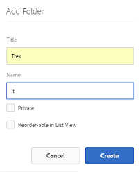

# Preparar ativos para tradução {#preparing-assets-for-translation}

Ativos multilíngues são ativos com binários, metadados e tags em vários idiomas. Geralmente, binários, metadados e tags para ativos existem em um idioma, que são traduzidos para outros idiomas para uso em projetos multilíngues.

Nos ativos Adobe Experience Manager, ativos multilíngues são incluídos em pastas, onde cada pasta contém os ativos em um idioma diferente.

Cada pasta de idioma é chamada de cópia de idioma. A pasta raiz de uma cópia de idioma, conhecida como raiz de idioma, identifica o idioma do conteúdo na cópia de idioma. Por exemplo, */content/dam/it* é a raiz do idioma italiano para a cópia em italiano. As cópias de idioma devem usar uma raiz [de idioma configurada](preparing-assets-for-translation.md#creating-a-language-root) corretamente para que o idioma correto seja direcionado quando as traduções dos ativos de origem forem executadas.

A cópia de idioma para a qual você adicionou ativos originalmente é o idioma principal. O idioma principal é a fonte traduzida para outros idiomas. Uma hierarquia de pastas de amostra inclui várias raízes de idioma:

```
 /content
  /- dam
   |- en
   |- fr
   |- de
   |- es
   |- it
   |- ja
   |- zh
```

Execute as seguintes etapas para preparar seus ativos para tradução:

1. Crie a raiz do idioma do idioma principal. Por exemplo, a raiz do idioma da cópia em inglês na hierarquia da pasta de amostra é `/content/dam/en`. Verifique se a raiz do idioma está configurada corretamente de acordo com as informações em [Criar uma raiz](preparing-assets-for-translation.md#creating-a-language-root)do idioma.

1. Adicione ativos ao seu idioma principal.
1. Crie a raiz do idioma de cada idioma do público alvo para o qual você precisa de uma cópia do idioma.

## Criar uma raiz de idioma {#creating-a-language-root}

Para criar a raiz do idioma, crie uma pasta e use um código de idioma ISO como o valor da propriedade Name. Depois de criar a raiz do idioma, é possível criar uma cópia do idioma em qualquer nível na raiz do idioma.

Por exemplo, a página raiz da cópia em idioma italiano da hierarquia de amostra tem `it` a propriedade Name. A propriedade Name é usada como o nome do nó do ativo no repositório e, portanto, determina o caminho dos ativos. (`https://[aem_server]:[port]/assets.html/content/dam/it/`).

1. From the Assets console, click **[!UICONTROL Create]** and choose **[!UICONTROL Folder]** from the menu.

   

1. No campo **[!UICONTROL Nome]** , digite o código do país no formato de `<language-code>`.

   

1. Clique em **[!UICONTROL Criar]**. A raiz do idioma é criada no console Ativos.

## raízes da língua Visualização {#viewing-language-roots}

A interface do Experience Manager fornece um painel **[!UICONTROL Referências]** que exibe uma lista de raízes de idioma que foram criadas em Ativos.

1. No console Ativos, selecione o idioma principal para o qual deseja criar cópias de idioma.
1. No painel esquerdo, selecione a opção **[!UICONTROL Referências]** para abrir o painel [!UICONTROL Referência] .

   

1. No painel Referências, clique em Cópias **[!UICONTROL de idioma]**. O painel Cópias [!UICONTROL de] idioma mostra as cópias de idioma dos ativos.

   
