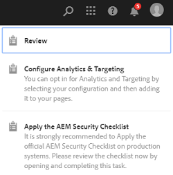

# Pasta privada em [!DNL Adobe Experience Manager Assets] {#private-folder}

| Versão | Link do artigo |
| -------- | ---------------------------- |
| AEM as a Cloud Service | [Clique aqui](https://experienceleague.adobe.com/docs/experience-manager-cloud-service/content/assets/manage/private-folder.html?lang=en) |
| AEM 6.5 | Este artigo |

Você pode criar uma pasta privada na variável [!DNL Adobe Experience Manager Assets] que está disponível exclusivamente para você. Você pode compartilhar essa pasta particular com outros usuários e atribuir vários privilégios a eles. Com base no nível de privilégio atribuído, os usuários podem executar várias tarefas na pasta, por exemplo, exibir ativos na pasta ou editar os ativos.

>[!NOTE]
>
>A pasta privada tem pelo menos um membro com a função Proprietário.

## Criação e compartilhamento de pasta privada {#create-share-private-folder}

Para criar e compartilhar uma pasta privada:

1. No [!DNL Assets] , clique em **[!UICONTROL Criar]** na barra de ferramentas e escolha **[!UICONTROL Pasta]** no menu.

   

1. No **[!UICONTROL Criar pasta]** , insira um título e nome (opcional) para a pasta e selecione **[!UICONTROL Privado]** opção.

1. Clique em **[!UICONTROL Criar]**. Uma pasta privada é criada.

   

1. Para compartilhar a pasta com outros usuários e atribuir privilégios a eles, selecione a pasta e clique em **[!UICONTROL Propriedades]** na barra de ferramentas.

   

   >[!NOTE]
   >
   >A pasta não estará visível para nenhum outro usuário até que você a compartilhe.

1. No **[!UICONTROL Propriedades da pasta]** selecione um usuário na lista suspensa **[!UICONTROL Adicionar usuário]** atribua uma função ao usuário em sua pasta particular e clique em **[!UICONTROL Adicionar]**.

   

   >[!NOTE]
   >
   >É possível atribuir várias funções, como `Editor`, `Owner`ou `Viewer` ao usuário com quem você compartilha a pasta. Se você atribuir um `Owner` para o usuário, o usuário tem `Editor` privilégios na pasta. Além disso, o usuário pode compartilhar a pasta com outras pessoas. Se você atribuir um `Editor` usuário pode editar os ativos na sua pasta privada. Se você atribuir uma função de visualizador, o usuário só poderá visualizar os ativos na pasta privada.

   >[!NOTE]
   >
   >A pasta privada tem pelo menos um membro com `Owner` função. Portanto, o administrador não pode remover todos os membros proprietários de uma pasta privada. No entanto, para remover os proprietários existentes (e o próprio administrador) da pasta privada, o administrador deve adicionar outro usuário como proprietário.

1. Clique em **[!UICONTROL Salvar]**. Dependendo da função atribuída, o usuário recebe um conjunto de privilégios em sua pasta privada quando faz logon no [!DNL Assets].
1. Clique em **[!UICONTROL Ok]** para fechar a mensagem de confirmação.
1. O usuário com quem você compartilha a pasta recebe uma notificação de compartilhamento. Efetue logon no [!DNL Assets] com as credenciais do usuário para exibir a notificação.

   

1. Clique em [!UICONTROL Notificação] para abrir uma lista de notificações.

   

1. Clique na entrada da pasta privada compartilhada pelo administrador para abrir a pasta.

>[!NOTE]
>
>Para criar uma pasta privada, é necessário Ler e Modificar [permissões de controle de acesso](/help/sites-administering/security.md#permissions-in-aem) na pasta pai na qual deseja criar uma pasta privada. Se você não for um administrador, essas permissões não estarão habilitadas para você por padrão em `/content/dam`. Nesse caso, primeiro obtenha essas permissões para sua ID/grupo de usuários antes de tentar criar pastas privadas.

## Exclusão de pasta privada {#delete-private-folder}

É possível excluir uma pasta selecionando-a e, em seguida, [!UICONTROL Excluir] no menu superior ou usando a tecla Backspace em seu teclado.

>[!CAUTION]
>
>Se você excluir uma pasta privada do CRXDE Lite, os grupos de usuários redundantes serão deixados no repositório.

>[!NOTE]
>
>Se você excluir uma pasta usando o método acima na interface do usuário do, os grupos de usuários associados também serão excluídos.
>
>No entanto, os grupos de usuários redundantes, não utilizados e gerados automaticamente existentes podem ser removidos do repositório usando `clean` método no JMX na instância do autor (`http://[server]:[port]/system/console/jmx/com.day.cq.dam.core.impl.team%3Atype%3DClean+redundant+groups+for+Assets`).
