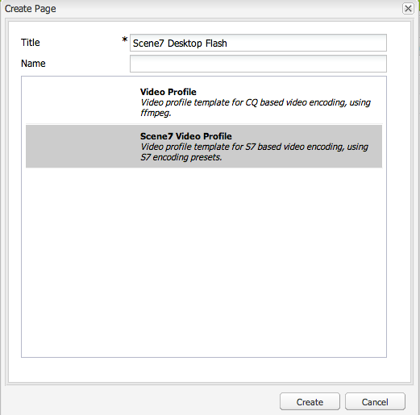

# Vídeo {#video}

Os ativos fornecem gerenciamento centralizado de ativos de vídeo, onde você pode fazer upload de vídeos diretamente para os Ativos para autocodificação para o Dynamic Media Classic (Scene7) e acessar vídeos do Dynamic Media Classic diretamente dos Ativos para criação de página.

A integração de vídeo do Dynamic Media Classic estende o alcance do vídeo otimizado a todas as telas (detecção automática de dispositivo e largura de banda).

* The **[!UICONTROL Scene7 Video]** component automatically performs device and bandwidth detection to play the right format and right quality video across desktop, tablets and mobile.
* Assets: é possível incluir conjuntos de vídeos adaptáveis, em vez de somente ativos de vídeo individuais. Um conjunto de vídeos adaptáveis é um contêiner para todas as representações de vídeo necessárias para reproduzir o vídeo de forma contínua em várias telas. Um Conjunto de vídeos adaptáveis agrupa versões do mesmo vídeo que são codificadas em diferentes taxas de bits e formatos, como 400 kbps, 800 kbps e 1000 kbps. Você usa um conjunto de vídeos adaptáveis, juntamente com o componente de vídeo do S7, para transmitir vídeo adaptável em vários tipos de telas, incluindo telas de computadores, e dispositivos móveis com iOS, Android, Blackberry e Windows. Consulte a [documentação do Scene7 sobre conjuntos de vídeos adaptáveis](https://help.adobe.com/en_US/scene7/using/WS53492AE1-6029-45d8-BF80-F4B5CF33EB08.html) para obter mais informações.

## Sobre o FFMPEG e o Dynamic Media Classic {#about-ffmpeg-and-scene}

O processo de codificação de vídeo padrão se baseia no uso da integração em FFMPEG com perfis de vídeo. Portanto, o fluxo de trabalho de ingestão DAM predefinido contém as duas etapas de fluxo de trabalho baseadas em ffmpeg a seguir:

* Miniaturas de FFMPEG
* Codificação FFMPEG

Lembre-se de que ativar e configurar a integração do Dynamic Media Classic não remove nem desativa automaticamente essas duas etapas do fluxo de trabalho do fluxo de trabalho de ingestão DAM predefinido. Se você já usa a codificação de vídeo baseada em FFMPEG no AEM, é provável que tenha o FFMPEG instalado em seus ambientes de criação. Nesse caso, um novo vídeo assimilado usando DAM seria codificado duas vezes: uma vez do codificador FFMPEG e uma vez da integração do Dynamic Media Classic.

Se você tiver a codificação de vídeo baseada em FFMPEG em AEM configurada e FFMPEG instalada, o Adobe recomenda que você remova os dois workflows FFMPEG de seus workflows de ingestão de DAM.

## Formatos suportados {#supported-formats}

Os seguintes formatos são compatíveis com o componente de vídeo do Scene7:

* F4V H.264
* MP4 H.264

## Como decidir onde fazer upload de seu vídeo {#deciding-where-to-upload-your-video}

Para decidir onde fazer upload de seus ativos de vídeo, considere o seguinte:

* O ativo de vídeo requer um fluxo de trabalho?
* O ativo de vídeo requer controle de versão?

Se a resposta for “sim” para ambas as perguntas, faça upload do vídeo diretamente no Adobe DAM. Se a resposta for &quot;não&quot; para ambas as perguntas, faça upload do vídeo diretamente para o Dynamic Media Classic. O fluxo de trabalho referente a cada cenário é descrito na próxima seção.

### If you are uploading your video directly to Adobe DAM {#if-you-are-uploading-your-video-directly-to-adobe-dam}

Se precisar de um fluxo de trabalho ou controle de versão para seus ativos, faça upload para o Adobe DAM primeiro. Este é o fluxo de trabalho recomendado:

1. Faça upload do ativo de vídeo para Adobe DAM e codifique e publique automaticamente no Dynamic Media Classic.
1. No AEM, acesse os ativos de vídeo no WCM na guia **[!UICONTROL Filmes]** do Localizador de conteúdo.
1. Author with **[!UICONTROL Scene7 Video]** or **[!UICONTROL Foundation Video]** component.

### Se estiver fazendo upload do vídeo no Scene7 {#if-you-are-uploading-your-video-to-scene}

Se você não precisar de um fluxo de trabalho ou controle de versão para os ativos, faça upload deles no Scene7. Este é o fluxo de trabalho recomendado:

1. In Dynamic Media Classic, [set up a scheduled FTP uploading and encoding to Scene7 (system automated)](https://help.adobe.com/en_US/scene7/using/WS70B173EC-4CAD-4b4c-BF9C-43A11F3A5950.html).
1. No AEM, acesse os ativos de vídeo no WCM na guia **[!UICONTROL Scene7]** do Localizador de conteúdo.
1. Author with the **[!UICONTROL Scene7 Video]** component.

## Configurar a integração de vídeo do Scene7 {#configuring-integration-with-scene-video}

Para configurar predefinições universais:

1. Em **[!UICONTROL Serviços em nuvem]**, navegue até a configuração do **[!UICONTROL Scene7]** e clique em **[!UICONTROL Editar.]**
1. Selecione a guia **[!UICONTROL Vídeo]**.

   

   >[!NOTE]
   >
   >A guia **[!UICONTROL Vídeo]** não será exibida se a página não possuir uma configuração de nuvem.

1. Selecione o perfil de codificação de vídeo adaptável, um perfil de codificação de vídeo pronto para uso ou um perfil de codificação de vídeo personalizado.

   >[!NOTE]
   >
   >For more information about what the video presets mean, see the [Dynamic Media Classic documentation](https://help.adobe.com/en_US/scene7/using/WSE86ACF2B-BD50-4c48-A1D7-9CD4405B62D0.html).
   >
   >A Adobe recomenda selecionar ambos os conjuntos de vídeos adaptáveis ao configurar as predefinições universais ou selecionar a opção **[!UICONTROL Codificação de vídeo adaptável]**.

1. Os perfis de codificação selecionados são aplicados automaticamente a todos os vídeos enviados por upload para a pasta de destino DAM CQ configurada para essa configuração de nuvem do Scene7. É possível configurar várias configurações de nuvem do Scene7 com diferentes pastas de destino para aplicar diversos perfis de codificação, conforme necessário.

## Atualizar as predefinições de codificação e do visualizador {#updating-viewer-and-encoding-presets}

Se você precisar atualizar as predefinições de codificação de vídeo e do visualizador no AEM porque elas foram atualizadas no Scene7, navegue até a configuração do Scene7 na configuração de nuvem e clique em **[!UICONTROL Atualizar as predefinições de codificação e do visualizador.]**

## Upload do vídeo de origem primária para o Scene7 a partir do Adobe DAM {#uploading-your-master-video}

1. Navegue até a pasta de destino DAM CQ onde você definiu as configurações de nuvem com os perfis de codificação do Scene7.
1. Clique em **[!UICONTROL Carregar]** para carregar o vídeo de origem primária. Video uploading and encoding is complete after the [!UICONTROL DAM Update Asset] workflow is complete and **[!UICONTROL Publish to Scene7]** has a checkmark.

   >[!NOTE]
   >
   >Pode levar algum tempo para gerar as miniaturas de vídeo.

   Dragging the DAM primary source video on to the video component accesses *all* of the Scene7 encoded proxy renditions for delivery.

## Comparação do componente de vídeo de base com o componente de vídeo do Scene7 {#foundation-video-component-versus-scene-video-component}

Ao usar o AEM, você tem acesso ao componente de Vídeo disponível no Sites e o componente de vídeo do Scene7. Esses componentes não são intercambiáveis.

O componente de vídeo do Scene7 funciona somente para vídeos do Scene7. O componente de base funciona com os vídeos armazenados do AEM (usando ffmpeg) e com os vídeos do Scene7.

A seguinte matriz explica quando você deve usar cada componente:

>[!NOTE]
>
>Pronto para uso, o componente de vídeo do S7 usa o perfil de vídeo universal. No entanto, você pode obter o player de vídeo baseado em HTML5 para uso AEM executando um dos procedimentos a seguir no Scene7: copie o código incorporado do player de vídeo HTML5 e coloque-o na sua página de AEM.

## Componente de vídeo do AEM {#aem-video-component}

Mesmo que o uso do componente de vídeo do Scene7 seja recomendado para visualizar os vídeos do Scene7, esta seção descreve o uso dos vídeos do Scene7 com o Componente de vídeo de base do AEM, por uma questão de completude.

### Comparação entre vídeos do Scene7 e do AEM {#aem-video-and-scene-video-comparison}

A tabela a seguir fornece uma comparação avançada dos recursos suportados entre o Componente de vídeo de base do AEM e o Componente de vídeo do Scene7:

|  | Vídeo de base do AEM | Vídeo do Scene7 |
|---|---|---|
| Abordagem | Abordagem de HTML5 primeiro. O Flash é usado somente para o fallback não-HTML5. | Flash na maioria dos computadores. O HTML5 é usado para dispositivos móveis e tablets. |
| Entrega | Progressiva | Transmissão adaptável |
| Acompanhamento | Sim | Sim |
| Extensibilidade | Sim | Sim (com o SDK do visualizador do Scene7) |
| Vídeo móvel | Sim | Sim |

### Configuração {#setting-up}

#### Criação de perfis de vídeo {#creating-video-profiles}

As diferentes codificações de vídeo são criadas de acordo com as predefinições de codificação do S7 selecionadas na configuração de nuvem do S7. Para que possam ser utilizadas pelo componente de vídeo de base, um perfil de vídeo deve ser criado para cada predefinição de codificação do S7 selecionada. Isso permite que o componente de vídeo selecione as execuções de DAM apropriadas.

>[!NOTE]
>
>Os novos perfis de vídeo e as alterações a eles devem ser ativados para publicação.

1. Em AEM, toque em **[!UICONTROL Ferramentas]> Console[!UICONTROL de configuração]**.
1. In the **[!UICONTROL Configuration Console]** navigate to **[!UICONTROL Tools > DAM > Video Profiles]** in the navigation tree.
1. Crie um novo perfil de vídeo do S7. In the **[!UICONTROL New...]** menu, select **[!UICONTROL Create Page]** and then select the Scene7 Video Profile template. Forneça um nome para a nova página de perfil de vídeo e clique em **[!UICONTROL Criar.]**

   

1. Edite o novo perfil de vídeo. Selecione primeiro a configuração de nuvem. Em seguida, selecione a mesma predefinição de codificação selecionada na configuração de nuvem.

   

   | Propriedade | Descrição |
   |---|---|
   | Configurações de nuvem do Scene7 | A configuração da nuvem a ser usada para as predefinições de codificação. |
   | Predefinição de codificação do Scene7 | A predefinição de codificação para mapear este perfil de vídeo. |
   | Tipo de vídeo HTML5 | Essa propriedade permite definir o valor da propriedade type do elemento de fonte de vídeo HTML5. Essa informação não é fornecida pelas predefinições de codificação do S7, mas é necessária para renderizar corretamente os vídeos usando o elemento de vídeo HTML5. Uma lista de formatos comuns é fornecida, mas eles podem ser substituídos por outros formatos. |

   Repita essa etapa para todas as predefinições de codificação selecionadas na configuração de nuvem que você deseja usar no componente de vídeo.

#### Configuring design {#configuring-design}

The **[!UICONTROL Foundation Video]** component must know about what video profiles to use in order to build the video sources list. Você deve abrir a caixa de diálogo de design de componentes de vídeo e configurar o design de componentes para usar os novos perfis de vídeo.

>[!NOTE]
>
>If you use the **[!UICONTROL Foundation Video]** component on a mobile page, you might need to repeat these steps on the design of the mobile page.

>[!NOTE]
>
>As alterações feitas no design exigem que ele seja aplicado para serem aplicadas na publicação.

1. Open the **[!UICONTROL Foundation Video]** component&#39;s design dialog box and change to the **[!UICONTROL Profiles]** tab. Em seguida, exclua os perfis predefinidos e adicione os novos perfis de vídeo S7. A ordem da lista do perfil na caixa de diálogo de design define a ordem do elemento de fontes de vídeo ao renderizar.
1. Para navegadores que não suportam HTML5, o componente de vídeo permite configurar um fallback de Flash. Open the video components design dialog box and change to the **[!UICONTROL Flash]** tab. Configure as configurações do player de Flash e atribua um perfil de fallback ao player flash.

#### Lista de verificação {#checklist}

1. Crie uma configuração de nuvem do S7. Verifique se as predefinições de codificação de vídeo estão definidas e se o importador está em execução.
1. Crie um perfil de vídeo do S7 para cada predefinição de codificação de vídeo selecionada na configuração da nuvem.
1. Os perfis de vídeo devem ser ativados.
1. Configure the design of the **[!UICONTROL oundation Video]** component on your page.
1. Ative o design após finalizar as alterações no design.

