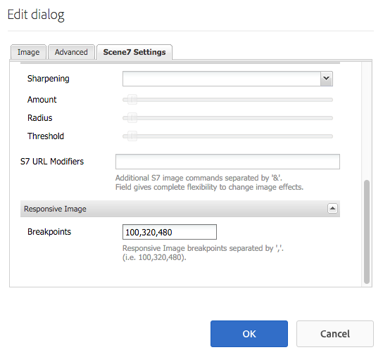

# Adicionar recursos do Dynamic Media Classic às páginas {#adding-scene-features-to-your-page}

[Adobe Dynamic Media Classic](https://experienceleague.adobe.com/docs/dynamic-media-classic/using/home.html) O é uma solução hospedada para gerenciamento, aprimoramento, publicação e fornecimento de ativos de mídia avançada para exibições e impressão conectadas à Web, dispositivos móveis, e-mail e Internet.

Você pode visualizar ativos do Experience Manager publicados no Dynamic Media Classic em vários visualizadores:

* Zoom
* Flyout
* Vídeo
* Modelo da imagem
* Imagem

Você pode publicar ativos digitais diretamente do Experience Manager para o Dynamic Media Classic e também do Dynamic Media Classic para o Experience Manager.

Este documento descreve como publicar ativos digitais do Experience Manager para o Dynamic Media Classic e vice-versa. Os visualizadores também são descritos em detalhes. Para obter informações sobre como configurar o Experience Manager para Dynamic Media Classic, consulte [Integrar o Dynamic Media Classic com o Experience Manager](/help/sites-administering/scene7.md).

Consulte também [Adicionar mapas de imagem](image-maps.md).

Para obter mais informações sobre o uso de componentes de vídeo com o Experience Manager, consulte [Vídeo](video.md).

>[!NOTE]
>
>Se os ativos do Dynamic Media Classic não forem exibidos corretamente, verifique se o Dynamic Media está [desabilitado](config-dynamic.md#disabling-dynamic-media) e atualize a página.

## Publicar manualmente no Dynamic Media Classic a partir de ativos {#manually-publishing-to-scene-from-assets}

Você pode publicar ativos digitais no Dynamic Media Classic da seguinte maneira:

* [Na interface clássica do console de Ativos](/help/sites-classic-ui-authoring/manage-assets-classic-s7.md#publishing-from-the-assets-console)
* [Na interface clássica do usuário de um ativo](/help/sites-classic-ui-authoring/manage-assets-classic-s7.md#publishing-from-an-asset)
* [Na interface de usuário clássica fora da pasta do CQ Target](/help/sites-classic-ui-authoring/manage-assets-classic-s7.md#publishing-assets-from-outside-the-cq-target-folder)

>[!NOTE]
>
>O Experience Manager publica no Dynamic Media Classic de forma assíncrona. Depois de selecionar **[!UICONTROL Publish]**, leva vários segundos para seu ativo ser publicado no Dynamic Media Classic.

## Componentes do Dynamic Media Classic {#scene-components}

Os seguintes componentes do Dynamic Media Classic estão disponíveis no Experience Manager:

* Zoom
* Submenu (Zoom)
* Modelo da imagem
* Imagem
* Vídeo

>[!NOTE]
>
>Esses componentes não estão disponíveis por padrão e devem ser selecionados em **[!UICONTROL Design]** antes de usar.

Após serem disponibilizados no **[!UICONTROL Design]** você pode adicionar os componentes à sua página como qualquer outro componente Experience Manager. Os ativos que ainda não foram publicados no Dynamic Media Classic são publicados no Dynamic Media Classic se estiverem em uma pasta sincronizada, em uma página ou com uma configuração de nuvem do Dynamic Media Classic.

>[!NOTE]
>
>Se você estiver criando e desenvolvendo visualizadores personalizados e usando o Localizador de conteúdo, será necessário adicionar explicitamente a `allowfullscreen` parâmetro.

### Aviso de fim de vida útil de visualizadores Flash {#flash-viewers-end-of-life-notice}

A partir de 31 de janeiro de 2017, a Adobe Dynamic Media Classic encerrou o suporte à plataforma de visualizador de Flashes.

### Adicionar um componente do Dynamic Media Classic (Scene7) a uma página {#adding-a-scene-component-to-a-page}

Adicionar um componente do Dynamic Media Classic (Scene7) a uma página é o mesmo que adicionar um componente a qualquer página. Os componentes do Dynamic Media Classic são descritos detalhadamente nas seções a seguir.

**Para adicionar um componente do Dynamic Media Classic (Scene7) a uma página:**

1. No Experience Manager, abra a página à qual deseja adicionar a variável **[!UICONTROL Dynamic Media Classic (Scene7)]** componente.

1. Se nenhum componente do Dynamic Media Classic estiver disponível, selecione **[!UICONTROL Design]** , selecione qualquer componente com uma borda azul, selecione a **[!UICONTROL Pai]** e, em seguida, o **[!UICONTROL Configuração]** ícone. Entrada **[!UICONTROL Parsys (Design)]**, selecione todos os componentes do Dynamic Media Classic para disponibilizá-los e selecione **[!UICONTROL OK]**.

   

1. Selecionar **[!UICONTROL Editar]** para que você possa retornar a **[!UICONTROL Editar]** modo.

1. Arraste um componente do grupo Dynamic Media Classic no sidekick para a página no local desejado.

1. Selecione o **[!UICONTROL Configuração]** ícone para poder abrir o componente.

1. Edite o componente conforme necessário e selecione **[!UICONTROL OK]** para salvar as alterações.
1. Arraste a imagem ou o vídeo do navegador de conteúdo para o componente Dynamic Media Classic adicionado à página.

   >[!NOTE]
   >
   >Somente na interface para toque, você deve arrastar e soltar a imagem ou o vídeo no componente do Dynamic Media Classic inserido na página. Não há suporte para selecionar e editar o componente Dynamic Media Classic e depois escolher o ativo.

### Adicionar uma experiência de visualização interativa a um site responsivo {#adding-interactive-viewing-experiences-to-a-responsive-website}

O design responsivo para seus ativos significa que seu ativo se adapta dependendo de onde é exibido. Com um design responsivo, os mesmos ativos podem ser exibidos de maneira eficaz em vários dispositivos.

Consulte também [Design responsivo para páginas da Web](/help/sites-developing/responsive.md).

**Para adicionar uma experiência de visualização interativa a um site responsivo:**

1. Efetue logon no Experience Manager e verifique se você [Adobe Dynamic Media Classic Cloud Services configurado](/help/sites-administering/scene7.md#configuring-scene-integration) e que os componentes do Dynamic Media Classic estão disponíveis.

   >[!NOTE]
   >
   >Se os componentes do Dynamic Media Classic não estiverem disponíveis, verifique se [para ativá-los por meio do modo Design](/help/sites-authoring/default-components-designmode.md).

1. Em um site com o **[!UICONTROL Dynamic Media Classic]** componentes ativados, arraste uma **[!UICONTROL Imagem]** componente à página.
1. Selecione o componente e selecione o ícone de configuração.
1. No **[!UICONTROL Configurações do Dynamic Media Classic]** , ajuste os pontos de interrupção.

   

1. Confirme se os visualizadores estão redimensionando com agilidade e se todas as interações estão otimizadas para desktop, tablet e dispositivos móveis.

### Configurações comuns a todos os componentes do Dynamic Media Classic {#settings-common-to-all-scene-components}

Embora as opções de configuração variem, as seguintes opções são comuns a todos [!UICONTROL Dynamic Media Classic] componentes:

* **[!UICONTROL Referência de arquivo]** - Procure um arquivo que você deseja referenciar. A referência de arquivo mostra o URL do ativo e não necessariamente o URL completo do Dynamic Media Classic, incluindo os comandos e parâmetros do URL. Não é possível adicionar comandos e parâmetros de URL do Dynamic Media Classic neste campo. Em vez disso, você as adiciona por meio da funcionalidade correspondente no componente.
* **[!UICONTROL Largura]** - Permite definir a largura.
* **[!UICONTROL Altura]** - Permite definir a altura.

Você define essas opções de configuração abrindo (clicando duas vezes) um componente do Dynamic Media Classic, por exemplo, ao abrir um **[!UICONTROL Zoom]** componente:

### Zoom {#zoom}

O componente de HTML5 Zoom exibe uma imagem maior quando você pressiona o **[!UICONTROL +]** botão.

O ativo tem ferramentas de zoom na parte inferior. Selecionar **[!UICONTROL +]** se desejar ampliar; selecione **[!UICONTROL -]** se quiser reduzir. Tocar no **[!UICONTROL x]** ou a seta para redefinir zoom traz a imagem de volta ao tamanho original como foi importada. Selecione as setas diagonais para usá-las em tela cheia. Selecionar **[!UICONTROL Editar]** para configurar o componente. Com esse componente, você pode configurar [configurações comuns a todos [!UICONTROL Dynamic Media Classic] componentes](#settings-common-to-all-scene-components).

### Flyout {#flyout}

No HTML 5 **[!UICONTROL Flyout]** , o ativo é exibido como tela dividida; o ativo é deixado no tamanho especificado; à direita, a parte de zoom é exibida. Selecionar **[!UICONTROL Editar]** para configurar o componente. Com esse componente, você pode configurar [configurações comuns a todos os componentes do Dynamic Media Classic](#settings-common-to-all-scene-components).

>[!NOTE]
>
>Se o seu **[!UICONTROL Flyout]** O componente usa um tamanho personalizado, esse tamanho personalizado é usado e a configuração responsiva do componente é desativada.
>
>Se o seu **[!UICONTROL Flyout]** O componente usa o tamanho padrão, conforme definido em **[!UICONTROL Modo Design]**, o tamanho padrão é usado e o componente é expandido para acomodar o tamanho do layout da página com a configuração responsiva do componente ativada. Há uma limitação na configuração responsiva do componente. Quando você usa o **[!UICONTROL Flyout]** componente com configuração responsiva, não o use com ampliação de página inteira. Caso contrário, a variável **[!UICONTROL Flyout]** ultrapassa a borda direita da página.

### Imagem {#image}

O DYNAMIC MEDIA CLASSIC **[!UICONTROL Imagem]** O componente permite adicionar a funcionalidade Dynamic Media Classic às imagens, como modificadores Dynamic Media Classic, predefinições de imagens ou do visualizador e nitidez. O DYNAMIC MEDIA CLASSIC **[!UICONTROL Imagem]** é semelhante a outros componentes de imagem no Experience Manager com funcionalidade especial do Dynamic Media Classic. Neste exemplo, a imagem tem o modificador de URL do Dynamic Media Classic, `&op_invert=1` aplicado.

**[!UICONTROL Título, texto alternativo]** - No **[!UICONTROL Avançado]** adicione um título à imagem e texto alternativo para os usuários que têm gráficos desativados.

**[!UICONTROL URL, Abrir em]** - É possível definir um ativo do para abrir um link. Defina o **[!UICONTROL URL]** e no **[!UICONTROL Abrir em]** indique se deseja que ele seja aberto na mesma janela ou em uma nova janela.

**[!UICONTROL Predefinição do visualizador]** - Selecione uma predefinição do visualizador existente no menu suspenso. Se a predefinição do visualizador que você está procurando não estiver visível, é necessário torná-la visível. Consulte [Gerenciar predefinições do visualizador](/help/assets/managing-viewer-presets.md). Não é possível selecionar uma predefinição do visualizador se você estiver usando uma predefinição de imagem e vice-versa.

**[!UICONTROL Configuração do Dynamic Media Classic]** - Selecione a configuração do Dynamic Media Classic que deseja usar para buscar predefinições de imagens ativas do SPS.

**[!UICONTROL Predefinição de imagem]** - Selecione uma predefinição de imagem existente no menu suspenso. Se a predefinição de imagem que você está procurando não estiver visível, será necessário torná-la visível. Consulte [Gerenciar predefinições de imagem](/help/assets/managing-image-presets.md). Não é possível selecionar uma predefinição do visualizador se você estiver usando uma predefinição de imagem e vice-versa.

**[!UICONTROL Formato de saída]** - Selecione o formato de saída da imagem, por exemplo jpeg. Dependendo do formato de saída selecionado, há opções de configuração adicionais. Consulte [Práticas recomendadas de predefinição de imagem](/help/assets/managing-image-presets.md#image-preset-options).

**[!UICONTROL Nitidez]** - Selecione como deseja tornar a imagem mais nítida. A nitidez é explicada em detalhes em [Práticas recomendadas de predefinição de imagem](/help/assets/managing-image-presets.md#image-preset-options) e [Práticas recomendadas de nitidez](/help/assets/assets/sharpening_images.pdf).

**[!UICONTROL Modificadores de URL]** - Você pode alterar os efeitos de imagem fornecendo comandos de imagem Dynamic Media Classic adicionais. Esses comandos estão descritos em [Predefinições da imagem](/help/assets/managing-image-presets.md) e a variável [Referência de comando](https://experienceleague.adobe.com/docs/dynamic-media-developer-resources/image-serving-api/image-serving-api/http-protocol-reference/command-reference/c-command-reference.html).

**[!UICONTROL Pontos de interrupção]** - Se o seu site é responsivo, você quer ajustar os pontos de interrupção. Os pontos de interrupção devem ser separados por vírgulas ( , ).

### Modelo da imagem {#image-template}

[Modelos de imagem Dynamic Media Classic](https://experienceleague.adobe.com/docs/dynamic-media-classic/using/template-basics/quick-start-template-basics.html) são conteúdos em camadas do Photoshop que foram importados para o Dynamic Media Classic, onde o conteúdo e as propriedades foram parametrizados para fins de variabilidade. A variável **[!UICONTROL Modelo de imagem]** O componente permite importar imagens e alterar o texto dinamicamente no Experience Manager. Além disso, você pode configurar o **[!UICONTROL Modelo de imagem]** para usar valores do contexto do cliente, para que cada usuário experimente a imagem de forma personalizada.

Selecionar **[!UICONTROL Editar]** se quiser configurar o componente. Você pode configurar [configurações comuns a todos os componentes do Dynamic Media Classic](#settings-common-to-all-scene-components) e outras configurações descritas nesta seção.

**[!UICONTROL Referência de arquivo, Largura, Altura]** - Consulte as configurações comuns a todos os componentes do ScDynamic Media Classicene7.

>[!NOTE]
>
>Os comandos e parâmetros de URL do Dynamic Media Classic não podem ser adicionados diretamente ao URL de referência de arquivo. Eles só podem ser definidos na interface do usuário do componente no **[!UICONTROL Parâmetro]** painel.

**[!UICONTROL Título, texto alternativo]** - Na guia Modelo de imagem do Dynamic Media Classic, adicione um título à imagem e texto alternativo para os usuários que têm gráficos desativados.

**[!UICONTROL URL, Abrir em]** - É possível definir um ativo do para abrir um link. Defina o URL e, em Abrir no, indique se deseja abri-lo na mesma janela ou em uma nova janela.

**[!UICONTROL Painel de parâmetros]** - Ao importar uma imagem, os parâmetros são pré-preenchidos com informações da imagem. Se não houver conteúdo que possa ser alterado dinamicamente, essa janela ficará vazia.

#### Alterar texto dinamicamente {#changing-text-dynamically}

Para alterar o texto dinamicamente, insira o novo texto nos campos e selecione **[!UICONTROL OK]**. Neste exemplo, a variável **[!UICONTROL Preço]** agora custa US$ 50 e o frete custa 99 centavos.

O texto na imagem é alterado. É possível redefinir o texto para o valor original tocando **[!UICONTROL Redefinir]** ao lado do campo.

#### Alterar texto para refletir o valor de um valor de contexto do cliente {#changing-text-to-reflect-the-value-of-a-client-context-value}

Para vincular um campo a um valor de contexto de cliente, selecione **[!UICONTROL Selecionar]** para abrir o menu de contexto do cliente, selecione o contexto do cliente e **[!UICONTROL OK]**. Neste exemplo, o nome muda com base na vinculação do Name com o nome formatado no perfil.

O texto reflete o nome do usuário conectado no momento. Você pode redefinir o texto para o valor original clicando em **[!UICONTROL Redefinir]** ao lado do campo.

#### Transforme o modelo de imagem do Dynamic Media Classic em um link {#making-the-scene-image-template-a-link}

1. Na página com o Dynamic Media Classic **[!UICONTROL Modelo de imagem]** componente, selecione **[!UICONTROL Editar]**.
1. No **[!UICONTROL URL]** insira o URL para o qual os usuários vão quando a imagem é tocada. No **[!UICONTROL Abrir em]** selecione se deseja que o target seja aberto (uma nova janela ou a mesma janela).

   

1. Selecionar **[!UICONTROL OK]**.

### Componente de vídeo {#video-component}

O DYNAMIC MEDIA CLASSIC **[!UICONTROL Vídeo]** O componente (disponível na seção Dynamic Media Classic do sidekick) usa detecção de dispositivo e largura de banda para veicular o vídeo correto em cada tela. Esse componente é um reprodutor de vídeo HTML5; é um único visualizador que pode ser usado entre canais.

Ele pode ser usado para conjuntos de vídeos adaptáveis, um único vídeo MP4 ou um único vídeo F4V.

Consulte [Vídeo](s7-video.md) para obter mais informações sobre como os vídeos funcionam com a integração do Dynamic Media Classic. Além disso, consulte [o componente de Vídeo do Dynamic Media Classic versus o componente de Vídeo do Foundation](s7-video.md).

### Limitações conhecidas do componente de vídeo {#known-limitations-for-the-video-component}

O DAM do Adobe e o WCM mostram se um vídeo de origem primária foi carregado. Eles não mostram esses ativos proxy:

* Representações codificadas do Dynamic Media Classic
* Conjuntos de vídeo adaptável do Dynamic Media Classic

Ao usar um conjunto de vídeos adaptáveis com o componente de vídeo do Dynamic Media Classic, você deve redimensionar o componente para ajustá-lo às dimensões do vídeo.

## Navegador de conteúdo do Dynamic Media Classic {#scene-content-browser}

O navegador de conteúdo do Dynamic Media Classic permite exibir o conteúdo do Dynamic Media Classic diretamente no Experience Manager. Para acessar o navegador de conteúdo, na guia **[!UICONTROL Localizador de conteúdo]**, selecione **[!UICONTROL Dynamic Media Classic]** na interface do usuário otimizada para toque ou na **[!UICONTROL S7]** ícone na interface clássica do usuário. A funcionalidade é idêntica entre as duas interfaces do usuário.

Se você tiver várias configurações, o Experience Manager, por padrão, exibirá a variável [configuração padrão](/help/sites-administering/scene7.md#configuring-a-default-configuration). Você pode selecionar configurações diferentes diretamente no navegador de conteúdo do Dynamic Media Classic no menu suspenso.

>[!NOTE]
>
>* Os ativos na pasta sob demanda não aparecem no navegador de conteúdo do Dynamic Media Classic.
>* Quando [A Visualização Segura está ativada](/help/sites-administering/scene7.md#configuring-the-state-published-unpublished-of-assets-pushed-to-scene), os ativos publicados e não publicados no Dynamic Media Classic aparecem no navegador de conteúdo do Dynamic Media Classic.
>* Se você não vir **[!UICONTROL Dynamic Media Classic]** ou o **[!UICONTROL S7]** ícone como uma opção no navegador de conteúdo, você deve [configurar o Dynamic Media Classic para funcionar com o Experience Manager](/help/sites-administering/scene7.md).
>* Para vídeo, o navegador de conteúdo do Dynamic Media Classic é compatível com:
   >
   >   * Conjuntos de vídeos adaptados: contêiner de todas as representações de vídeo necessárias para a reprodução contínua em várias telas
   >   * Vídeo MP4 único
   >   * Vídeo F4V único

### Procurar conteúdo na interface otimizada para toque {#browsing-content-in-the-touch-optimized-ui}

Você pode acessar o navegador de conteúdo na interface otimizada para toque ou na interface clássica. Atualmente, o otimizado para toque tem a seguinte limitação:

* Os ativos FXG e Flash do Dynamic Media Classic não são compatíveis.

Procurar ativos do Dynamic Media Classic selecionando **[!UICONTROL Dynamic Media Classic]** no terceiro menu suspenso. O Dynamic Media Classic não será exibido na lista se você não tiver configurado a integração Dynamic Media Classic/Experience Manager.

>[!NOTE]
>
>* O navegador de conteúdo do Dynamic Media Classic carrega cerca de 100 ativos e os classifica por nome.
>* Se você tiver um servidor de visualização seguro definido, o navegador usará esse servidor de visualização para renderizar miniaturas e ativos.
>

Além disso, você pode navegar pelas informações de resolução, tamanho, dias desde a modificação e nome do arquivo, passando o cursor do mouse sobre o ativo no navegador.

* Para Conjuntos e modelos de vídeo adaptável, nenhuma informação de tamanho é gerada para miniaturas.
* Para Conjuntos de vídeos adaptados, nenhuma resolução é gerada para miniaturas.

### Pesquisar ativos do Dynamic Media Classic com o navegador de conteúdo {#searching-for-scene-assets-with-the-content-browser}

Pesquisar ativos no Dynamic Media Classic é semelhante à pesquisar ativos no Experience Manager Assets. No entanto, ao pesquisar, você está vendo uma visualização remota dos ativos no sistema Dynamic Media Classic, em vez de importá-los diretamente para o Experience Manager.

Você pode usar a interface clássica ou a interface otimizada para toque para visualizar e pesquisar ativos. Dependendo da interface, a forma como você pesquisa será um pouco diferente.

Ao pesquisar em qualquer uma das interfaces do usuário, você pode filtrar pelos seguintes critérios (mostrados aqui na interface otimizada para toque):

**[!UICONTROL Inserir palavras-chave]** - Você pode pesquisar ativos por nome. Ao pesquisar, as palavras-chave digitadas são aquelas com as quais o nome do arquivo começa. Por exemplo, digitar a palavra &quot;natação&quot; procuraria qualquer nome de arquivo de ativo que começasse com essas letras nessa ordem. Certifique-se de pressionar Enter depois de digitar o termo para localizar o ativo.

**[!UICONTROL Pasta/caminho]** - O nome da pasta que é vista se baseia na configuração selecionada. Você pode detalhar os níveis inferiores tocando no ícone de pasta e selecionando uma subpasta e, em seguida, tocando na marca de seleção para selecioná-la.

Se você inserir uma palavra-chave e selecionar uma pasta, o Experience Manager pesquisará essa pasta e todas as subpastas. No entanto, se você não inserir nenhuma palavra-chave ao pesquisar, selecionar a pasta mostrará apenas os ativos nessa pasta e não incluirá nenhuma subpasta.

Por padrão, o Experience Manager pesquisa a pasta selecionada e todas as subpastas.

**[!UICONTROL Tipo de ativo]** - Selecionar **[!UICONTROL Dynamic Media Classic]** para navegar pelo conteúdo do Dynamic Media Classic. Essa opção só estará disponível se o Dynamic Media Classic tiver sido configurado.

**[!UICONTROL Configuração]** - Se você tiver mais de uma configuração Dynamic Media Classic definida em [!UICONTROL Cloud Services], você pode selecioná-lo aqui. Como resultado, a pasta muda com base na configuração escolhida.

**[!UICONTROL Tipo de ativo]** - No navegador Dynamic Media Classic, você pode filtrar os resultados para incluir qualquer um dos seguintes itens: imagens, modelos, vídeos e conjuntos de vídeos adaptáveis. Se você não selecionar nenhum tipo de ativo, o Experience Manager, por padrão, pesquisa todos os tipos de ativos.

>[!NOTE]
>
>* Na interface clássica, também é possível pesquisar por **Flash** e **FXG**. A filtragem desses tipos na interface otimizada para toque não é compatível.
>
>* Ao pesquisar vídeos, você pesquisa uma única representação. Os resultados retornam a representação original (somente &amp;ast;.mp4) e a representação codificada.
>* Ao pesquisar um conjunto de vídeos adaptáveis, você pesquisa a pasta e todas as subpastas, mas somente se tiver adicionado uma palavra-chave à pesquisa. Se você não tiver adicionado uma palavra-chave, o Experience Manager não pesquisará nas subpastas.
>

**[!UICONTROL Publicar status]** - Você pode filtrar por ativos com base no status da publicação: **[!UICONTROL Não publicado]** ou **[!UICONTROL Publicado]**. Se você não selecionar nenhuma **[!UICONTROL Publicar status]**, o Experience Manager pesquisa por padrão todos os status de publicação.

