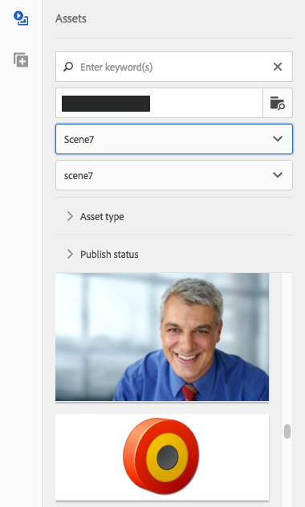

# Adicionar recursos do Dynamic Media Classic à sua página {#adding-scene-features-to-your-page}

[O Adobe Dynamic Media ](https://help.adobe.com/en_US/scene7/using/WS26AB0D9A-F51C-464e-88C8-580A5A82F810.html) Classic é uma solução hospedada para gerenciar, aprimorar, publicar e fornecer ativos de mídia avançada para Web, dispositivos móveis, email e telas e impressão conectadas à Internet.

Você pode visualização AEM ativos publicados no Dynamic Media Classic em vários visualizadores:

* Zoom
* Flyout
* Vídeo
* Modelo de imagem
* Imagem

Você pode publicar ativos digitais diretamente do AEM para o Dynamic Media Classic e pode publicar ativos digitais do Dynamic Media Classic para AEM.

Este documento descreve como publicar ativos digitais do AEM para o Dynamic Media Classic e vice-versa. Os visualizadores também são descritos detalhadamente. Para obter informações sobre como configurar AEM para o Dynamic Media Classic, consulte [Integração do Dynamic Media Classic com AEM](/help/sites-administering/scene7.md).

Consulte também [Adição de mapas de imagem](image-maps.md).

Para obter mais informações sobre como usar componentes de vídeo com AEM, consulte [Vídeo](video.md).

>[!NOTE]
>
>Se os ativos do Dynamic Media Classic não forem exibidos corretamente, verifique se a Mídia dinâmica está [desativada](config-dynamic.md#disabling-dynamic-media) e atualize a página.

## Publicar manualmente no Dynamic Media Classic a partir de ativos {#manually-publishing-to-scene-from-assets}

Você pode publicar ativos digitais no Dynamic Media Classic da seguinte maneira:

* [Na interface de usuário clássica do console Ativos](/help/sites-classic-ui-authoring/manage-assets-classic-s7.md#publishing-from-the-assets-console)
* [Na interface de usuário clássica de um ativo](/help/sites-classic-ui-authoring/manage-assets-classic-s7.md#publishing-from-an-asset)
* [Na interface de usuário clássica fora da pasta do Público alvo CQ](/help/sites-classic-ui-authoring/manage-assets-classic-s7.md#publishing-assets-from-outside-the-cq-target-folder)

>[!NOTE]
>
>AEM publica no Dynamic Media Classic de forma assíncrona. Depois de clicar em **[!UICONTROL Publicar]**, pode levar vários segundos para que o ativo publique no Dynamic Media Classic.

## Componentes do Dynamic Media Classic {#scene-components}

Os seguintes componentes do Dynamic Media Classic estão disponíveis no AEM:

* Zoom
* Flyout (Zoom)
* Modelo de imagem
* Imagem
* Vídeo

>[!NOTE]
>
>Esses componentes não estão disponíveis por padrão e precisam ser selecionados no modo **[!UICONTROL Design]** antes de usar.

Depois que eles forem disponibilizados no modo **[!UICONTROL Design]**, você poderá adicionar os componentes à sua página como qualquer outro componente AEM. Os ativos que ainda não foram publicados no Dynamic Media Classic são publicados no Dynamic Media Classic se estiverem em uma pasta sincronizada ou em uma página ou com uma configuração de nuvem do Dynamic Media Classic.

>[!NOTE]
>
>Se você estiver criando e desenvolvendo visualizadores personalizados e usando o Localizador de conteúdo, precisará adicionar explicitamente o parâmetro **[!UICONTROL allowfullscreen]**.

### Aviso de fim de vida útil de visualizadores Flash {#flash-viewers-end-of-life-notice}

A partir de 31 de janeiro de 2017, o Adobe Dynamic Media Classic encerrou o suporte para a plataforma do visualizador de Flashes.

Para obter mais informações sobre essa alteração importante, consulte [Perguntas frequentes sobre o fim de vida útil do visualizador Flash](https://docs.adobe.com/content/docs/pt/aem/6-1/administer/integration/marketing-cloud/scene7/flash-eol.html).

### Adicionar um componente do Dynamic Media Classic (Scene7) a uma página {#adding-a-scene-component-to-a-page}

Adicionar um componente do Dynamic Media Classic (Scene7) a uma página é o mesmo que adicionar um componente a qualquer página. Os componentes do Dynamic Media Classic são descritos detalhadamente nas seções a seguir.

**Para adicionar um componente do Dynamic Media Classic (Scene7) a uma página**

1. Em AEM, abra a página onde deseja adicionar o componente Dynamic Media Classic (Scene7).

1. Se nenhum componente do Dynamic Media Classic estiver disponível, clique no modo **[!UICONTROL Design]**, toque em qualquer componente com uma borda azul, toque no ícone **[!UICONTROL Pai]** e, em seguida, no ícone **[!UICONTROL Configuração]**. Em **[!UICONTROL Parsys (Design)]**, selecione todos os componentes do Dynamic Media Classic para disponibilizá-los e clique em **[!UICONTROL OK.]**

   

1. Clique em **[!UICONTROL Editar]** para voltar ao modo **[!UICONTROL Editar]**.

1. Arraste um componente do grupo do Dynamic Media Classic no sidekick para a página no local desejado.

1. Clique no ícone **[!UICONTROL Configuração]** para abrir o componente.

1. Edite o componente conforme necessário e clique em **[!UICONTROL OK]** para salvar as alterações.
1. Arraste sua imagem ou vídeo do navegador de conteúdo até o componente Dynamic Media Classic que você adicionou à página.

   >[!NOTE]
   >
   >Somente na interface de usuário de toque, você deve arrastar e soltar a imagem ou o vídeo no componente do Dynamic Media Classic que você colocou na página. A seleção e edição do componente Dynamic Media Classic e a escolha do ativo não são suportadas.

### Adicionar experiências de visualização interativas a um site responsivo {#adding-interactive-viewing-experiences-to-a-responsive-website}

Design responsivo para seus ativos significa que eles se adaptam dependendo de onde são exibidos. Com o design responsivo, os mesmos ativos podem ser exibidos de maneira eficaz em diversos dispositivos.

Consulte também [Design responsivo para páginas da Web](/help/sites-developing/responsive.md).

**Para adicionar uma experiência de visualização interativa a um site responsivo**

1. Faça logon no AEM e certifique-se de que você tenha [configurado o Adobe Dynamic Media Classic Cloud Services](/help/sites-administering/scene7.md#configuring-scene-integration) e que os componentes do Dynamic Media Classic estejam disponíveis.

   >[!NOTE]
   >
   >Se os componentes do Dynamic Media Classic não estiverem disponíveis, certifique-se de [para ativá-los por meio do modo Design](/help/sites-authoring/default-components-designmode.md).

1. Em um site com os componentes **[!UICONTROL Dynamic Media Classic]** ativados, arraste um componente **[!UICONTROL Image]** para a página.
1. Selecione o componente e toque no ícone de configuração.
1. Na guia **[!UICONTROL Configurações do Dynamic Media Classic]**, ajuste os pontos de interrupção.

   

1. Verifique se os visualizadores estão sendo redimensionados de maneira adequada e de que todas as interações sejam otimizadas para desktop, tablet e dispositivo móvel.

### Configurações comuns a todos os componentes do Dynamic Media Classic {#settings-common-to-all-scene-components}

Embora as opções de configuração variem, as opções a seguir são comuns a todos os [!UICONTROL componentes do Dynamic Media Classic]:

* **[!UICONTROL Referência]**  de arquivo - Navegue até um arquivo que deseja referenciar. A referência de arquivo mostra o URL do ativo e não necessariamente o URL completo do Dynamic Media Classic, incluindo os comandos e parâmetros do URL. Não é possível adicionar comandos e parâmetros de URL do Dynamic Media Classic neste campo. Eles devem ser adicionados por meio da funcionalidade correspondente no componente.
* **[!UICONTROL Largura]**  - Permite definir a largura.
* **[!UICONTROL Altura]** - Permite definir a altura.

Você define essas opções de configuração abrindo (clicando no duplo) um componente do Dynamic Media Classic, por exemplo, ao abrir um componente **[!UICONTROL Zoom]**:

### Zoom {#zoom}

O componente de zoom HTML5 exibe uma imagem maior quando você pressiona o botão **[!UICONTROL +]**.

O ativo tem ferramentas de zoom na parte inferior. Toque em **[!UICONTROL +]** para ampliar. Toque em **[!UICONTROL -]** para reduzir. Tocar em **[!UICONTROL x]** ou na seta de redefinição de zoom traz a imagem de volta ao tamanho original que ela foi importada. Toque nas setas diagonais para torná-las em tela cheia. Toque em **[!UICONTROL Editar]** para configurar o componente. Com esse componente, você pode definir [configurações comuns a todos os [!UICONTROL componentes do Dynamic Media Classic]](#settings-common-to-all-scene-components).

### Flyout {#flyout}

No componente HTML5 **[!UICONTROL Flyout]**, o ativo é mostrado como tela dividida; deixou o ativo no tamanho especificado; à direita, a parte de zoom é exibida. Toque em **[!UICONTROL Editar]** para configurar o componente. Com esse componente, você pode definir [configurações comuns a todos os componentes do Dynamic Media Classic](#settings-common-to-all-scene-components).

>[!NOTE]
>
>Se seu componente **[!UICONTROL Flyout]** usar um tamanho personalizado, esse tamanho personalizado será usado e a configuração responsiva do componente será desativada.
>
>Se seu componente **[!UICONTROL Flyout]** usar o tamanho padrão, conforme definido em **[!UICONTROL Visualização de design]**, o tamanho padrão será usado e o componente será expandido para acomodar o tamanho do layout da página com a configuração responsiva do componente ativada. Esteja ciente, no entanto, de que há uma limitação na configuração responsiva do componente. Quando você usa o componente **[!UICONTROL Flyout]** com a configuração responsiva, não deve usá-lo com o trecho de página completo. Caso contrário, o **[!UICONTROL Flyout]** poderá se estender além da borda direita da página.

### Imagem {#image}

O componente Dynamic Media Classic **[!UICONTROL Image]** permite que você adicione a funcionalidade do Dynamic Media Classic às suas imagens, como modificadores do Dynamic Media Classic, predefinições de imagem ou visualizador e nitidez. O componente Dynamic Media Classic **[!UICONTROL Image]** é semelhante a outros componentes de imagem em AEM com funcionalidade especial do Dynamic Media Classic. Neste exemplo, a imagem tem o modificador de URL do Dynamic Media Classic, `&op_invert=1` aplicado.

**[!UICONTROL Título, Texto]**  alternativo - Na guia  **** Avançado, adicione um título à imagem e ao texto alternativo para os usuários que tiverem gráficos desativados.

**[!UICONTROL URL, Abrir]**  - você pode definir um ativo de para abrir um link. Defina o **[!UICONTROL URL]** e, em **[!UICONTROL Abrir em]**, indique se você deseja que ele abra na mesma janela ou em uma nova.

**[!UICONTROL Predefinição]**  do visualizador - selecione uma predefinição do visualizador existente no menu suspenso. Se a predefinição de visualizador que você está procurando não estiver visível, pode ser necessário torná-la visível. Consulte [Gerenciar predefinições do visualizador](/help/assets/managing-viewer-presets.md). Não é possível selecionar uma predefinição de visualizador se você estiver usando uma predefinição de imagem e vice-versa.

**[!UICONTROL Configuração]**  do Dynamic Media Classic - selecione a configuração do Dynamic Media Classic que deseja usar para buscar predefinições de imagens ativas do SPS.

**[!UICONTROL Predefinição]**  de imagem - selecione uma predefinição de imagem existente no menu suspenso. Se a predefinição de imagem que você está procurando não estiver visível, pode ser necessário torná-la visível. Consulte [Gerenciar predefinições de imagens](/help/assets/managing-image-presets.md). Não é possível selecionar uma predefinição de visualizador se você estiver usando uma predefinição de imagem e vice-versa.

**[!UICONTROL Formato]**  de saída - Selecione o formato de saída da imagem, por exemplo jpeg. Dependendo do formato de saída selecionado, você pode ter opções de configuração adicionais. Consulte [Práticas recomendadas de predefinição de imagem](/help/assets/managing-image-presets.md#image-preset-options).

**[!UICONTROL Nitidez]**  - Selecione como deseja tornar a imagem nítida. A nitidez é explicada detalhadamente em [Práticas recomendadas da predefinição de imagem](/help/assets/managing-image-presets.md#image-preset-options) e [Práticas recomendadas de nitidez](/help/assets/assets/sharpening_images.pdf).

**[!UICONTROL Modificadores]**  de URL - é possível alterar os efeitos de imagem fornecendo comandos adicionais de imagem do Dynamic Media Classic. Eles estão descritos em [Predefinições de imagem](/help/assets/managing-image-presets.md) e na [Referência de comandos](https://experienceleague.adobe.com/docs/dynamic-media-developer-resources/image-serving-api/image-serving-api/http-protocol-reference/command-reference/c-command-reference.html).

**[!UICONTROL Pontos de interrupção]**  - se o site estiver respondendo, você deseja ajustar os pontos de interrupção. Os pontos de interrupção devem ser separados por vírgulas ( , ).

### Modelo de imagem {#image-template}

[Os ](https://docs.adobe.com/help/en/dynamic-media-classic/using/template-basics/quick-start-template-basics.html) modelos de imagem do Dynamic Media Classic são conteúdo em camadas do Photoshop importado para o Dynamic Media Classic, onde o conteúdo e as propriedades foram parametrizados para variabilidade. O componente do **[!UICONTROL Modelo de imagem]** permite importar imagens e alterar dinamicamente o texto no AEM. Além disso, é possível configurar o componente do **[!UICONTROL Modelo de imagem]** para usar valores do contexto de cliente, de modo que cada usuário experiencie a imagem de uma maneira personalizada.

Toque em **[!UICONTROL Editar]** para configurar o componente. Você pode definir [configurações comuns a todos os componentes do Dynamic Media Classic](#settings-common-to-all-scene-components), bem como outras configurações descritas nesta seção.

**[!UICONTROL Referência de arquivo, Largura, Altura]**  - Consulte as configurações comuns a todos os componentes do ScDynamic Media Classicene7.

>[!NOTE]
>
>Os parâmetros e comandos do URL do Dynamic Media Classic não podem ser adicionados diretamente ao URL de referência de arquivo. Eles podem ser definidos somente na interface do componente no painel **[!UICONTROL Parâmetro]**.

**[!UICONTROL Título, Texto]**  alternativo - na guia Modelo de imagem clássica do Dynamic Media, adicione um título à imagem e ao texto alternativo para os usuários que tiverem gráficos desativados.

**[!UICONTROL URL, Abrir]**  - você pode definir um ativo de para abrir um link. Defina o URL e, em Abrir em, indique se você deseja que ele abra na mesma janela ou em uma nova.

**[!UICONTROL Painel]**  de parâmetros - ao importar uma imagem, os parâmetros são pré-preenchidos com informações da imagem. Caso nenhum conteúdo possa ser alterado dinamicamente, essa janela fica vazia.

#### Alterar o texto dinamicamente {#changing-text-dynamically}

Para alterar o texto dinamicamente, insira o novo texto nos campos e clique em **[!UICONTROL OK.]** Neste exemplo, o **[!UICONTROL Preço]** agora é $50 e o frete é de 99 centavos de dólar.

O texto na imagem é alterado. É possível redefinir o texto de volta para o valor original tocando em **[!UICONTROL Redefinir]** ao lado do campo.

#### Alterar o texto para refletir o valor de contexto do cliente {#changing-text-to-reflect-the-value-of-a-client-context-value}

Para vincular um campo a um valor de contexto do cliente, toque em **[!UICONTROL Selecionar]** para abrir o menu de contexto do cliente, selecione o contexto do cliente e toque em **[!UICONTROL OK.]** Neste exemplo, o nome é alterado com base na vinculação do Nome com o nome formatado no perfil.

O texto reflete o nome do cliente conectado no momento. É possível redefinir o texto de volta para o valor original ao clicar em **[!UICONTROL Redefinir]** próximo ao campo.

#### Como tornar o modelo de imagem do Dynamic Media Classic um link {#making-the-scene-image-template-a-link}

1. Na página com o componente Dynamic Media Classic **[!UICONTROL Modelo de imagem]**, toque em **[!UICONTROL Editar.]**
1. No campo **[!UICONTROL URL]**, insira o URL para o qual os usuários vão quando a imagem é tocada. No campo **[!UICONTROL Abrir em]**, selecione se deseja onde o destino seja aberto (uma nova janela ou na mesma).

   

1. Toque em **[!UICONTROL OK.]**

### Componente de vídeo {#video-component}

O componente Dynamic Media Classic **[!UICONTROL Video]** (disponível na seção Dynamic Media Classic do sidekick) usa a detecção de dispositivos e largura de banda para fornecer o vídeo correto a cada tela. Este componente é um reprodutor de vídeo HTML5; é um visualizador único que pode ser usado em todos os canais.

Ele pode ser usado pra conjuntos de vídeos adaptáveis, um único vídeo MP4 ou um único vídeo F4V.

Consulte [Vídeo](s7-video.md) para obter mais informações sobre como os vídeos funcionam com a integração do Dynamic Media Classic. Além disso, consulte [o componente Dynamic Media Classic Video versus o componente Foundation Video](s7-video.md).

### Restrições conhecidas do componente de vídeo {#known-limitations-for-the-video-component}

Adobe DAM e WCM mostram se um vídeo de origem primária foi carregado. Eles não mostram os ativos de proxy a seguir:

* Execuções codificadas do Dynamic Media Classic
* Conjuntos de vídeo adaptativos Dynamic Media Classic

Ao usar um conjunto de vídeo adaptável com o componente de vídeo Dynamic Media Classic, é necessário redimensionar o componente para ajustar às dimensões do vídeo.

## Navegador de conteúdo do Dynamic Media Classic {#scene-content-browser}

O navegador de conteúdo do Dynamic Media Classic permite que você visualização conteúdo do Dynamic Media Classic diretamente no AEM. Para acessar o navegador de conteúdo, no **[!UICONTROL Localizador de conteúdo]**, selecione **[!UICONTROL Dynamic Media Classic]** na interface de usuário otimizada ao toque ou o ícone **[!UICONTROL S7]** na interface de usuário clássica. A funcionalidade é idêntica em ambas as interfaces do usuário.

Caso tenha diversas configurações, o AEM exibe, por padrão, a [configuração padrão](/help/sites-administering/scene7.md#configuring-a-default-configuration). Você pode selecionar configurações diferentes diretamente no navegador de conteúdo do Dynamic Media Classic no menu suspenso.

>[!NOTE]
>
>* Os ativos localizados na pasta ad-hoc não aparecerão no navegador de conteúdo do Dynamic Media Classic.
>* Quando [A Pré-visualização segura está ativada](/help/sites-administering/scene7.md#configuring-the-state-published-unpublished-of-assets-pushed-to-scene), os ativos publicados e não publicados no Dynamic Media Classic aparecem no navegador de conteúdo do Dynamic Media Classic.
>* Se você não vir **[!UICONTROL o Dynamic Media Classic]** ou o ícone **[!UICONTROL S7]** como uma opção no navegador de conteúdo, é necessário [configurar o Dynamic Media Classic para trabalhar com AEM](/help/sites-administering/scene7.md).
>* Para vídeo, o navegador de conteúdo do Dynamic Media Classic é compatível:

   >
   >   
   * Conjuntos de vídeos adaptáveis: contêiner de todas as representações de vídeo necessárias para uma reprodução perfeita em diversas telas
   >   * Vídeo MP4 único
   >   * Vídeo F4V único

### Navegação no conteúdo na interface otimizada ao toque {#browsing-content-in-the-touch-optimized-ui}

Você pode acessar o navegador de conteúdo na interface otimizada ao toque ou clássica. Atualmente, a interface otimizada para toque tem a seguinte limitação:

* Os ativos FXG e Flash do Dynamic Media Classic não são suportados.

Navegue pelos ativos do Dynamic Media Classic selecionando **[!UICONTROL Dynamic Media Classic]** no terceiro menu suspenso. O Dynamic Media Classic não será exibido na lista se você não tiver configurado a integração do Dynamic Media Classic/AEM.

>[!NOTE]
>
>* O navegador de conteúdo do Dynamic Media Classic carrega cerca de 100 ativos e os classifica pelo nome.
>* Se você tiver um servidor de pré-visualização seguro definido, o navegador usará esse servidor de pré-visualização para renderizar miniaturas e ativos.

>

Além disso, você pode navegar pelas informações de resolução, tamanho, dias desde a modificação e nome do arquivo passando o mouse sobre o ativo no navegador.

* Para conjuntos e modelos de vídeo adaptáveis, nenhuma informação de tamanho é gerada para miniaturas.
* Para Conjuntos de vídeos adaptáveis, nenhuma resolução é gerada para miniaturas.

### Procurando ativos do Dynamic Media Classic com o navegador de conteúdo {#searching-for-scene-assets-with-the-content-browser}

Pesquisar ativos do Dynamic Media Classic é semelhante a pesquisar AEM ativos, exceto que ao pesquisar, você está vendo uma visualização remota dos ativos no sistema Dynamic Media Classic, em vez de importá-los diretamente para o AEM.

É possível usar a interface do usuário clássica ou a otimizada para toque para visualizar e pesquisar ativos. Dependendo da interface, a maneira como você pesquisa é levemente diferente.

Ao pesquisar em qualquer uma das interfaces de usuário, você pode filtrar pelos seguintes critérios (mostrados aqui na interface otimizada para toque):

**[!UICONTROL Digite palavras-chave]**  - você pode pesquisar ativos por nome. Ao pesquisar, as palavras-chave inseridas corresponderão às palavras com as quais o nome de arquivo come. Por exemplo, digitar a palavra “nadar” pesquisaria todos os nomes de arquivo de ativo que comecem com as letras nessa ordem. Pressione Enter depois de digitar o termo para localizar o ativo.

**[!UICONTROL Pasta/caminho]**  - O nome da pasta que aparece é baseado na configuração selecionada. Você pode fazer o detalhamento para níveis inferiores tocando no ícone de pasta e selecionando uma subpasta e tocando na marca de seleção para selecioná-la.

Se você inserir uma palavra-chave e selecionar uma pasta, o AEM procura nessa pasta e em todas as subpastas. No entanto, se você não digitar nenhuma palavra-chave ao pesquisar, selecionar a pasta exibirá somente os ativos nessa pasta e não incluirá nenhuma subpasta.

Por padrão, o AEM procura na pasta selecionada e em todas as subpastas.

**[!UICONTROL Tipo de ativo]**  - selecione  **[!UICONTROL Dynamic Media]** Classic para navegar pelo conteúdo do Dynamic Media Classic. Essa opção só estará disponível se o Dynamic Media Classic tiver sido configurado.

**[!UICONTROL Configuração]**  - se você tiver mais de uma configuração do Dynamic Media Classic definida no  [!UICONTROL Cloud Services], poderá selecioná-la aqui. Como resultado, a pasta será alterada com base na configuração escolhida.

**[!UICONTROL Tipo]**  de ativo - No navegador Dynamic Media Classic, você pode filtrar os resultados para incluir qualquer um dos seguintes: imagens, modelos, vídeos e conjuntos de vídeo adaptáveis. Se você não selecionar nenhum tipo de ativo, o AEM procura todos os tipos de ativo por padrão.

>[!NOTE]
>
>* Na interface do usuário clássica, também é possível procurar pelo **Flash** e pelo **FXG**. A filtragem para eles na interface otimizada para toque não é compatível atualmente.
   >
   >
* Ao pesquisar por vídeo, você estará procurando uma única representação. Os resultados retornam a execução original (somente &amp;ast;.mp4) e a execução codificada.
>* Ao pesquisar um conjunto de vídeos adaptáveis, você está pesquisando a pasta e todas as subpastas, mas somente se tiver adicionado uma palavra-chave à pesquisa. Caso não tenha adicionado uma palavra-chave, o AEM não pesquisará nas subpastas.

>

**[!UICONTROL Status]**  da publicação - você pode filtrar ativos com base no status da publicação:  **[!UICONTROL Não]** publicado ou  **[!UICONTROL publicado.]** Se você não selecionar nenhum Status **[!UICONTROL de]** publicação, AEM por padrão pesquisa todos os status de publicação.

