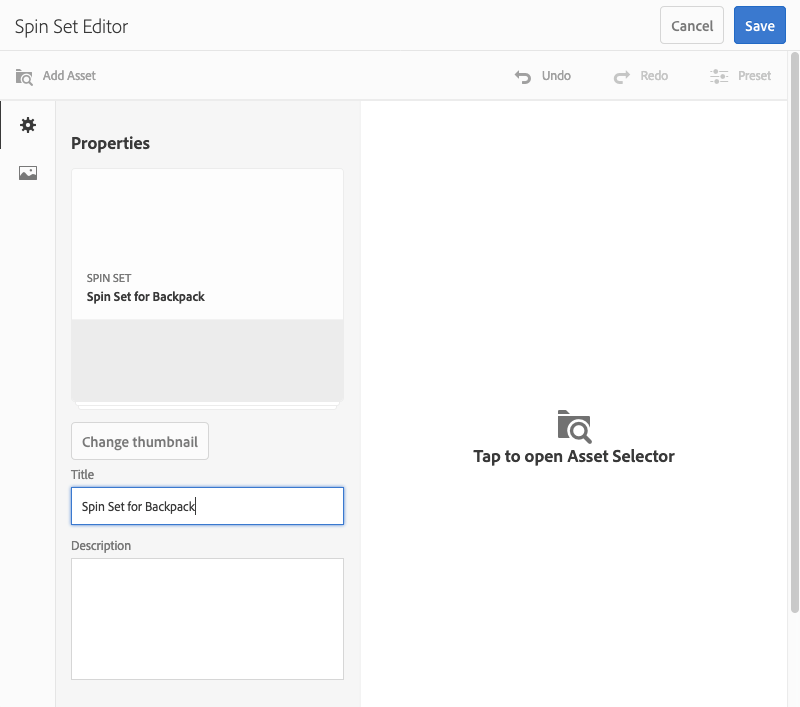
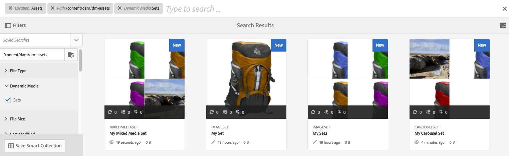

# Conjuntos de rotação{#spin-sets}

Um Conjunto de rotação simula o ato real de girar um objeto para examiná-lo. Os Conjuntos de rotação permitem visualizar itens de qualquer ângulo, obtendo os detalhes visuais principais de qualquer ângulo.

Um Conjunto de rotação simula uma experiência de visualização de 360 graus. O Dynamic Media oferece Conjuntos de rotação de eixo único em que os visualizadores podem girar um item. Além disso, os usuários podem &quot;formar livremente&quot; o zoom e deslocar qualquer uma das exibições com apenas alguns cliques do mouse. Dessa forma, os usuários podem examinar um item mais detalhadamente de um ponto de vista específico.

Os Conjuntos de rotação são designados por um banner com a palavra **[!UICONTROL SPINSET]**. Além disso, se o Conjunto de rotação for publicado, a data de publicação, indicada pelo ícone **[!UICONTROL Mundo]**, estará no banner junto com a última data de modificação, indicada pelo ícone **[!UICONTROL Lápis]**.

>[!NOTE]
>
>Para obter informações sobre a interface do usuário do Assets, consulte [Gerenciar ativos](/help/assets/manage-assets.md).

## Início rápido: Conjuntos de rotação {#quick-start-spin-sets}

Para ativar e executar rapidamente com Conjuntos de rotação, siga estas etapas:

1. [Carregue suas imagens para várias exibições](#uploading-assets-for-spin-sets).

   No mínimo, você precisa de 8 a 12 capturas de um item para um Conjunto de rotação unidimensional e 16 a 24 para um Conjunto de rotação bidimensional. As fotos devem ser tiradas regularmente para dar a impressão de que o item está girando e sendo virado. Por exemplo, se um Conjunto de rotação unidimensional incluir 12 capturas, gire o item 30 graus (360/12) para cada disparo.

1. [Criar conjuntos de rotação](#creating-spin-sets).

   Para criar um Conjunto de rotação, selecione **[!UICONTROL Criar > Conjunto de rotação]** e nomeie o conjunto, escolha os ativos e escolha a ordem em que as imagens serão exibidas.

   Consulte [Trabalhar com seletores](/help/assets/working-with-selectors.md).

   >[!NOTE]
   >
   >Também é possível criar conjuntos de rotação automaticamente por meio de [predefinições de conjuntos em lotes](/help/assets/config-dms7.md#creating-batch-set-presets-to-auto-generate-image-sets-and-spin-sets). **Importante:** os conjuntos em lote são criados pelo IPS (Sistema de produção de imagem) como parte da ingestão de ativos e estão disponíveis apenas no modo Dynamic Media - Scene7.

1. Configure [Predefinições do Visualizador do Conjunto de rotação](/help/assets/managing-viewer-presets.md), conforme necessário.

   Os administradores podem criar ou modificar as Predefinições do visualizador de conjunto de rotação. Para ver seu conjunto de rotação com uma predefinição do visualizador, selecione o conjunto de rotação e, no menu suspenso do painel à esquerda, selecione **Visualizadores**.

   Consulte **[!UICONTROL Ferramentas > Ativos > Predefinições do visualizador]** para criar ou editar predefinições do visualizador.

   Consulte [Adicionar e editar predefinições do visualizador](/help/assets/managing-viewer-presets.md).

1. [Visualização de conjuntos de rotação](#viewing-spin-sets).

   Você pode exibir e acessar conjuntos criados por meio de predefinições de conjuntos em lotes de três maneiras diferentes. (Conjuntos criados usando predefinições de conjunto de lotes, faça com que *not* apareça na interface do usuário.)

1. [Visualizar conjuntos de rotação](/help/assets/previewing-assets.md).

   Selecione o Conjunto de rotação e você pode visualizá-lo. Gire o conjunto de rotação. Você pode escolher visualizadores diferentes no menu **[!UICONTROL Visualizadores]**, disponível no menu suspenso do painel à esquerda.

1. [Publicar conjuntos de rotação](/help/assets/publishing-dynamicmedia-assets.md).

   A publicação de um Conjunto de rotação ativa o URL e a cadeia de caracteres de inserção. Além disso, você deve [publicar a predefinição do visualizador](/help/assets/managing-viewer-presets.md).

1. [Vincule URLs ao seu ](/help/assets/linking-urls-to-yourwebapplication.md) aplicativo web ou  [Incorpore o visualizador](/help/assets/embed-code.md) de vídeo ou imagem.

   O AEM Assets cria chamadas de URL para Conjuntos de rotação e as ativa depois que você publica os conjuntos de rotação. Você pode copiar esses URLs ao visualizar ativos. Como alternativa, você pode incorporá-los ao seu site.

   Selecione o Conjunto de rotação e, no menu suspenso do painel à esquerda, selecione **[!UICONTROL Visualizadores]**.

   Consulte [Vincular um conjunto de rotação a uma página da Web](/help/assets/linking-urls-to-yourwebapplication.md) e [Incorporar o visualizador de vídeo ou imagem](/help/assets/embed-code.md).

Se precisar, você pode [editar Conjuntos de rotação](#editing-spin-sets). Além disso, você pode visualizar e modificar [Propriedades do conjunto de rotação](/help/assets/manage-assets.md#editing-properties).

## Fazer upload de ativos para conjuntos de rotação {#uploading-assets-for-spin-sets}

No mínimo, você precisa de 8 a 12 capturas de um item para um Conjunto de rotação unidimensional e 16 a 24 para um Conjunto de rotação bidimensional. As fotos devem ser tiradas regularmente para dar a impressão de que o item está girando e sendo virado. Por exemplo, se um Conjunto de rotação unidimensional incluir 12 capturas, gire o item 30 graus (360/12) para cada disparo.

Você pode fazer upload de imagens para os Conjuntos de rotação da mesma maneira que faria [carregar qualquer outro ativo no AEM Assets](/help/assets/manage-assets.md).

### Diretrizes para capturar imagens para seu conjunto de rotação {#guidelines-for-shooting-spin-set-images}

Veja a seguir algumas práticas recomendadas sobre imagens de conjunto de rotação. Em geral, quanto mais imagens você tiver em um Conjunto de rotação, melhor será o efeito giratório da imagem. No entanto, incluir muitas imagens no conjunto também aumenta a quantidade de tempo que as imagens levam para serem carregadas. AEM recomenda estas diretrizes para fotografar imagens para uso em Conjuntos de rotação:

* No mínimo, use 8 a 12 imagens em um conjunto de rotação unidimensional e 16 a 24 imagens em um conjunto de rotação bidimensional. É necessário um mínimo de 8 imagens para rodar 360 graus. Os Conjuntos de rotação unidimensionais são mais comuns, pois a criação de Conjuntos de rotação bidimensionais exige muito trabalho.
* Usar um formato sem perdas; Recomenda-se TIFF e PNG.
* Mascarar todas as imagens para que o item apareça em um plano de fundo branco ou de alto contraste. Como opção, adicione sombras.
* Verifique se os detalhes do produto estão bem iluminados e em foco.
* Use imagens de rotação para roupas de moda com um manequim ou modelo. Frequentemente, o manequim é completamente mascarado (utilizando um manequim de vidro) ou na imagem aparece um manequim/moldura estilizada. Você pode criar um conjunto de rotação no modelo definindo o número de ângulos. Marque cada ângulo com uma fita no chão para guiar o modelo para pisar e olhe na direção de cada tomada.

## Criação de conjuntos de rotação {#creating-spin-sets}

Esta seção descreve como criar Conjuntos de rotação no AEM.

>[!NOTE]
>
>Também é possível criar conjuntos de rotação automaticamente por meio de [predefinições de conjuntos em lotes](/help/assets/config-dms7.md#creating-batch-set-presets-to-auto-generate-image-sets-and-spin-sets). **Importante:** os conjuntos em lote são criados pelo IPS (Sistema de produção de imagem) como parte da ingestão de ativos e estão disponíveis apenas no modo Dynamic Media - Scene7.
>
>Consulte &quot;Criando predefinições de conjuntos de lotes para gerar automaticamente Conjuntos de imagens e Conjuntos de rotação&quot; em [Configurando o Dynamic Media - Modo Scene7](/help/assets/config-dms7.md#creating-batch-set-presets-to-auto-generate-image-sets-and-spin-sets).

>[!NOTE]
>
>A ordem em que as imagens aparecem em um conjunto de rotação é importante. Certifique-se de ordená-los para que o giro seja uma exibição suave de 360 graus.

**Para criar Conjuntos de rotação:**

1. No Assets, navegue até o local em que deseja criar um conjunto de rotação, clique em **[!UICONTROL Criar]** e selecione **[!UICONTROL Conjunto de rotação]**. Além disso, crie o conjunto de dentro de uma pasta que contenha seus ativos. O Editor de conjunto de rotação é exibido.

   

1. No Editor de conjunto de rotação, no campo **[!UICONTROL Title]**, digite um nome para o conjunto de rotação. O nome aparece no banner através do Conjunto de rotação. Opcionalmente, informe uma descrição.

   

   >[!NOTE]
   >
   >Ao criar o conjunto de rotação, você pode alterar a miniatura do conjunto de rotação ou permitir que AEM selecione a miniatura automaticamente com base nos ativos no conjunto de rotação. Para selecionar uma miniatura, clique em **[!UICONTROL Change thumbnail]** e selecione qualquer imagem (você também pode navegar para outras pastas para localizar imagens). Se tiver selecionado uma miniatura e decidir que deseja AEM gerar uma a partir do conjunto de rotação, selecione **[!UICONTROL Alternar para miniatura automática]**.

1. Siga um destes procedimentos:

   * Próximo ao canto superior esquerdo da página Editor do conjunto de rotação, toque em **[!UICONTROL Adicionar ativo]**.

   * Próximo ao meio da página Editor do conjunto de rotação, toque em **[!UICONTROL Toque para abrir o Seletor de ativo]**.
   Toque para selecionar ativos que deseja incluir no seu Conjunto de rotação. Os ativos selecionados têm um ícone de marca de seleção sobre eles. Quando terminar, próximo ao canto superior direito da página, toque em **[!UICONTROL Selecionar]**.

   Com o Seletor de ativos, procure por ativos ao digitar uma palavra-chave e tocar em **[!UICONTROL Retornar]**. Aplique filtros para refinar os resultados da pesquisa. Filtre por caminho, coleção, tipo de arquivo e tag. Selecione o filtro e toque no ícone **[!UICONTROL Filtro]**, na barra de ferramentas. Altere a exibição ao tocar no ícone Exibir e selecionar **[!UICONTROL Exibição em coluna]**, **[!UICONTROL Exibição de cartão]** ou **[!UICONTROL Exibição em lista]**.

   Consulte [Trabalhar com seletores](/help/assets/working-with-selectors.md).

   

1. Ao adicionar ativos ao seu conjunto, eles são automaticamente adicionados em ordem alfanumérica. Você pode reordenar ou classificar ativos manualmente depois de adicioná-los.

   Se necessário, arraste o ícone Reordenar de um ativo à direita do nome do arquivo do ativo para reordenar as imagens para cima ou para baixo na lista definida.

   .

   Reorganizando o Quadro 11 no conjunto de rotação arrastando-o para um novo local.

1. (Opcional) Siga um destes procedimentos:

   * Para excluir uma imagem, selecione-a e toque em **[!UICONTROL Excluir ativo]**.

   * Para aplicar uma predefinição, próximo ao canto superior direito da página, toque em **[!UICONTROL Predefinição]** e selecione uma predefinição para aplicar a todos os ativos ao mesmo tempo.

1. Clique em **[!UICONTROL Salvar]**. O Conjunto de rotação recém-criado é exibido na pasta em que você o criou.

## Visualização de conjuntos de rotação {#viewing-spin-sets}

Você pode criar conjuntos de rotação na interface do usuário ou automaticamente usando [predefinições do conjunto de lotes](/help/assets/config-dms7.md#creating-batch-set-presets-to-auto-generate-image-sets-and-spin-sets). No entanto, os conjuntos criados usando predefinições de conjunto de lotes, do *not* aparecem na interface do usuário. Você pode acessar conjuntos criados por predefinições de conjuntos em lotes de três maneiras diferentes. (Esses métodos estão disponíveis mesmo se você tiver criado os conjuntos de rotação na interface do usuário).

>[!NOTE]
>
>Também é possível visualizar conjuntos por meio da interface do usuário, conforme descrito em [Editar conjuntos de rotação](#editing-spin-sets).

**Para exibir Conjuntos de rotação:**

1. Ao abrir as propriedades de um ativo individual. As propriedades indicam o que define o ativo selecionado como membro (em **[!UICONTROL Membro de Conjuntos]**). Clique no nome do conjunto para ver todo o conjunto.

   

1. A partir de uma imagem de membro de qualquer conjunto. Selecione o menu **[!UICONTROL Conjuntos]** para exibir os conjuntos dos quais o ativo é membro.

   

1. Na pesquisa, você pode selecionar **[!UICONTROL Filtros]**, expandir o **[!UICONTROL Dynamic Media]** e selecionar **[!UICONTROL Conjuntos]**.

   A pesquisa retorna conjuntos correspondentes que foram criados manualmente na interface do usuário ou criados automaticamente por meio de predefinições de conjuntos em lotes. Para conjuntos automatizados, a consulta de pesquisa é realizada usando critérios de pesquisa `Starts with` diferentes de AEM pesquisa baseada no uso de `Contains` critérios de pesquisa. Definir o filtro para **[!UICONTROL Conjuntos]** é a única maneira de pesquisar conjuntos automatizados.

   

## Editar conjuntos de rotação {#editing-spin-sets}

Você pode executar várias tarefas de edição em Conjuntos de rotação, como o seguinte:

* Adicione imagens ao Conjunto de rotação.
* Reordene as imagens no Conjunto de rotação.
* Exclua ativos no Conjunto de rotação.
* Aplicar predefinições do visualizador.
* Exclua o Conjunto de rotação.

**Para editar um Conjunto de rotação:**

1. Siga um destes procedimentos:

   * Passe o mouse sobre um ativo Conjunto de rotação, em seguida toque em **[!UICONTROL Editar]** (ícone de lápis).
   * Passe o mouse sobre um ativo Conjunto de rotação, toque em **[!UICONTROL Selecione]** (ícone de marca de seleção) e toque em **[!UICONTROL Editar]** na barra de ferramentas.

   * Toque em um ativo Conjunto de rotação e toque em **[!UICONTROL Editar]** (ícone de lápis) na barra de ferramentas.

1. Para editar o Conjunto de rotação, siga um destes procedimentos:

   * Para reorganizar imagens, arraste uma imagem para um novo local (selecione o ícone de reordenação para mover itens).
   * Para classificar itens em ordem crescente ou decrescente, clique no cabeçalho da coluna.
   * Para adicionar um ativo ou atualizar um ativo existente, clique em **[!UICONTROL Adicionar ativo]**. Navegue até um ativo, selecione-o e toque em **[!UICONTROL Selecionar]** próximo ao canto superior direito.
Se você excluir a imagem que AEM usa para a miniatura ao substituí-la por outra imagem, o ativo original ainda será exibido.
   * Para excluir um ativo, selecione-o e clique ou toque em **[!UICONTROL Excluir ativo]**.
   * Para aplicar uma predefinição, toque ou clique no ícone Predefinição e selecione uma predefinição.
   * Para excluir um Conjunto de rotação inteiro, navegue até o Conjunto de rotação, selecione-o e selecione **[!UICONTROL Excluir]**

   >[!NOTE]
   >
   >Edite as imagens em um Conjunto de imagens ao navegar até o conjunto, tocar em **[!UICONTROL Definir membros]** no painel à esquerda e tocar no ícone Lápis em um ativo individual para abrir a janela de edição.

1. Clique em **[!UICONTROL Salvar]** ao concluir a edição.

## Visualização de conjuntos de rotação {#previewing-spin-sets}

Consulte [Visualização de ativos](/help/assets/previewing-assets.md).

## Publicação de conjuntos de rotação {#publishing-spin-sets}

Consulte [Publicar ativos](/help/assets/publishing-dynamicmedia-assets.md).
