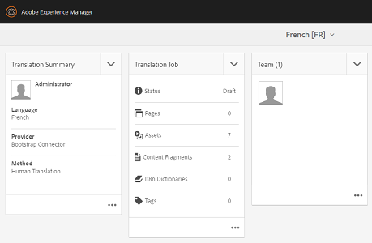

# Aplicar serviços de tradução em nuvem a pastas {#applying-translation-cloud-services-to-folders}

[!DNL Adobe Experience Manager] O permite que você use serviços de tradução baseados em nuvem do provedor de tradução de sua escolha para garantir que seus ativos sejam traduzidos com base em seus requisitos.

Você pode aplicar o serviço de nuvem de tradução diretamente à pasta de ativos para que ele possa ser usado durante os fluxos de trabalho de tradução.

## Aplicar os serviços de tradução {#applying-the-translation-services}

Aplicar serviços de nuvem de tradução diretamente à pasta de ativos elimina a necessidade de configurar serviços de tradução ao criar ou atualizar fluxos de trabalho de tradução.

1. No [!DNL Assets] , selecione a pasta à qual deseja aplicar os serviços de tradução.
1. Na barra de ferramentas, clique em **[!UICONTROL Propriedades]** para exibir o **[!UICONTROL Propriedades da pasta]** página.

   

1. Navegue até a guia **[!UICONTROL Serviços da nuvem]**.
1. Na lista Configurações de Cloud Service, escolha o provedor de tradução desejado. Por exemplo, se você deseja utilizar os serviços de tradução do Microsoft, escolha **[!UICONTROL Microsoft Translator]**.

   

1. Escolha o conector para o provedor de tradução.

   

1. Na barra de ferramentas, clique em **[!UICONTROL Salvar]** e clique em **[!UICONTROL OK]** para fechar a caixa de diálogo. O serviço de tradução é aplicado à pasta.

## Aplicar conector de tradução personalizado  {#applying-custom-translation-connector}

Se quiser aplicar um conector personalizado para os serviços de tradução que deseja usar nos fluxos de trabalho de tradução. Para aplicar um conector personalizado, primeiro instale o conector do Gerenciador de pacotes. Em seguida, configure o conector do console Serviços da nuvem. Após configurar o conector, ele estará disponível na lista de conectores na guia Serviços da nuvem descrita em [Aplicar serviços de tradução](transition-cloud-services.md#applying-the-translation-services). Depois de aplicar o conector personalizado e executar os fluxos de trabalho de tradução, o bloco **[!UICONTROL Resumo da tradução]** do projeto de tradução exibe os detalhes do conector nos cabeçalhos **[!UICONTROL Provedor]** e **[!UICONTROL Método]**.

1. Instale o conector do Gerenciador de pacotes.
1. Clique em [!DNL Experience Manager] e navegue até **[!UICONTROL Ferramentas]** > **[!UICONTROL Implantação]** > **[!UICONTROL Cloud Service]**.
1. Localize o conector instalado em **[!UICONTROL Serviços de terceiros]** na página **[!UICONTROL Serviços da nuvem]**.

   

1. Clique em **[!UICONTROL Configurar agora]** link para abrir a **[!UICONTROL Criar configuração]** diálogo.

   

1. Especifique um título e nome para o conector e clique em **[!UICONTROL Criar]**. O conector personalizado está disponível na lista de conectores na guia **[!UICONTROL Serviços da nuvem]** descrita na etapa 5 de [Aplicar serviços de tradução](#applying-the-translation-services).
1. Execute qualquer fluxo de trabalho de tradução descrito em [Criar projetos de tradução](translation-projects.md) depois de aplicar o conector personalizado. Verifique os detalhes do conector no bloco **[!UICONTROL Resumo da tradução]** do projeto de tradução no console **[!UICONTROL Projetos]**.

   
