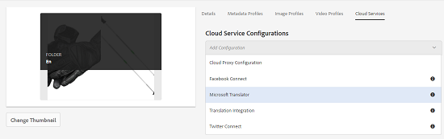

# Aplicar serviços de tradução em nuvem a pastas {#applying-translation-cloud-services-to-folders}

O Adobe Experience Manager (AEM) permite que você utilize serviços de tradução baseados em nuvem do provedor de tradução de sua escolha para garantir que seus ativos sejam traduzidos com base em suas necessidades.

Você pode aplicar o serviço de nuvem de tradução diretamente à sua pasta de ativos para que eles possam ser utilizados durante os fluxos de trabalho de tradução.

## Aplicar os serviços de tradução {#applying-the-translation-services}

A aplicação de serviços de tradução em nuvem diretamente à sua pasta de ativos elimina a necessidade de configurar os serviços de tradução ao criar ou atualizar fluxos de trabalho de tradução.

1. Na interface do usuário do Assets, selecione a pasta na qual deseja aplicar os serviços de tradução.
1. Na barra de ferramentas, clique/toque no ícone **[!UICONTROL Propriedades]** para exibir a página Propriedades **[!UICONTROL da]** pasta.

   

1. Navegue até a guia Serviços **[!UICONTROL em]** nuvem.
1. Na lista Configurações de serviços em nuvem, escolha o provedor de tradução desejado. Por exemplo, se você deseja utilizar os serviços de tradução da Microsoft, escolha **[!UICONTROL Microsoft Translator]**.

   

1. Escolha o conector para o provedor de tradução.

   

1. Na barra de ferramentas, clique/toque em **[!UICONTROL Salvar]** e clique em **[!UICONTROL OK]** para fechar a caixa de diálogo. O serviço de tradução é aplicado à pasta.

## Aplicar conector de tradução personalizado {#applying-custom-translation-connector}

Se quiser aplicar um conector personalizado para os serviços de tradução que deseja usar nos fluxos de trabalho de tradução. Para aplicar um conector personalizado, instale primeiro o conector do Gerenciador de pacotes. Em seguida, configure o conector do console Serviços em nuvem. Após configurar o conector, ele estará disponível na lista de conectores na guia Serviços em nuvem descrita em [Aplicando os serviços](transition-cloud-services.md#applying-the-translation-services)de tradução. Depois de aplicar o conector personalizado e executar fluxos de trabalho de tradução, o bloco Resumo **[!UICONTROL da]** tradução do projeto de tradução exibe os detalhes do conector sob os cabeçalhos **[!UICONTROL Provedor]** e **[!UICONTROL Método]**.

1. Instale o conector do Package Manager.
1. Clique/toque no logotipo do AEM e navegue até **[!UICONTROL Ferramentas > Implantação > Serviços]** em nuvem.
1. Localize o conector instalado em Serviços **[!UICONTROL de]** terceiros na página Serviços **[!UICONTROL da]** Cloud.

   

1. Clique/toque no link **[!UICONTROL Configurar agora]** para abrir a caixa de diálogo **[!UICONTROL Criar configuração]** .

   

1. Especifique um título e um nome para o conector e clique/toque em **[!UICONTROL Criar]**. O conector personalizado está disponível na lista de conectores na guia Serviços **[!UICONTROL em]** nuvem descrita na etapa 5 de [Aplicação dos serviços](#applying-the-translation-services)de tradução.
1. Execute qualquer fluxo de trabalho de tradução descrito em [Criação de projetos](translation-projects.md) de tradução depois de aplicar o conector personalizado. Verifique os detalhes do conector no bloco Resumo **[!UICONTROL da]** tradução do projeto de tradução no console **[!UICONTROL Projetos]** .

   
