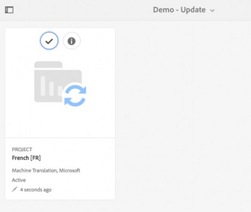

# Criar projetos de tradução {#creating-translation-projects}

Para criar uma cópia de idioma, acione um dos seguintes fluxos de trabalho de cópia de idioma disponíveis no painel Referências na interface do usuário [!DNL Experience Manager] .

* **Criar e traduzir**: Nesse fluxo de trabalho, os ativos a serem traduzidos são copiados para a raiz do idioma no qual você deseja traduzir. Além disso, dependendo das opções escolhidas, um projeto de tradução é criado para os ativos no console Projetos . Dependendo das configurações, o projeto de tradução pode ser iniciado manualmente ou pode ser executado automaticamente assim que o projeto de tradução for criado.

* **Atualizar cópias** de idioma: Execute esse fluxo de trabalho para traduzir um grupo adicional de ativos e incluí-lo em uma cópia de idioma para uma localidade específica. Nesse caso, os ativos traduzidos são adicionados à pasta de destino que já contém os ativos traduzidos anteriormente.

>[!PREREQUISITES]
>
>* Os usuários que criam projetos de tradução são membros do grupo `projects-administrators`.
>* O provedor de serviços de tradução oferece suporte à tradução de binários.

## Criar e traduzir workflow {#create-and-translate-workflow}

Você usa o workflow criar e traduzir para gerar cópias de idioma para um idioma específico pela primeira vez. O fluxo de trabalho fornece as seguintes opções:

* Criar somente estrutura.
* Criar um novo projeto de tradução.
* Adicionar ao projeto de tradução existente.

### Criar somente estrutura {#create-structure-only}

Use a opção **[!UICONTROL Somente criar estrutura]** para criar uma hierarquia de pasta de destino na raiz do idioma de destino para corresponder à hierarquia da pasta de origem na raiz do idioma de origem. Nesse caso, os ativos de origem são copiados na pasta de destino. No entanto, nenhum projeto de tradução é gerado.

1. Na interface [!DNL Assets], selecione a pasta de origem para a qual deseja criar uma estrutura na raiz do idioma de destino.

1. Abra o painel **[!UICONTROL Referências]** e clique em **[!UICONTROL Cópias de idioma]** em **[!UICONTROL Cópias]**.

   

1. Clique em **[!UICONTROL Criar e traduzir]**. Na lista **[!UICONTROL Idiomas de destino]**, selecione o idioma para o qual deseja criar uma estrutura de pastas.

1. Na lista **[!UICONTROL Projeto]**, escolha **[!UICONTROL Somente criar estrutura]**.

1. Clique em **[!UICONTROL Criar]**. A nova estrutura para o idioma de destino é listada em **[!UICONTROL Cópias de idioma]**.

   

1. Clique na estrutura da lista e em **[!UICONTROL Revelar no Assets]** para navegar até a estrutura de pastas no idioma de destino.

   

### Criar um novo projeto de tradução {#create-a-new-translation-project}

Se você usar essa opção, os ativos a serem traduzidos serão copiados para a raiz do idioma no qual deseja traduzir. Dependendo das opções escolhidas, um projeto de tradução é criado para os ativos no console Projetos . Dependendo das configurações, o projeto de tradução pode ser iniciado manualmente ou executado automaticamente assim que o projeto de tradução for criado.

1. Na interface do usuário [!DNL Assets], selecione a pasta de origem para a qual deseja criar uma Cópia de idioma.
1. Abra o painel **[!UICONTROL Referências]** e clique em **[!UICONTROL Cópias de idioma]** em **[!UICONTROL Cópias]**.

   

1. Clique em **[!UICONTROL Criar e traduzir]** na parte inferior.

1. Na lista **[!UICONTROL Idiomas de destino]**, selecione os idiomas para os quais deseja criar uma estrutura de pastas.

1. Na lista **[!UICONTROL Project]**, selecione **[!UICONTROL Create a new translation project]**.

1. No campo **[!UICONTROL Título do projeto]**, informe um título para o projeto.

1. Clique em **[!UICONTROL Criar]**. [!DNL Assets] da pasta de origem são copiadas para as pastas de destino das localidades selecionadas na etapa 4.

   

1. Para navegar até a pasta, selecione a cópia de idioma e clique em **[!UICONTROL Revelar no Assets]**.

   

1. Navegue até o console Projetos . A pasta de tradução é copiada para o console Projetos .

   

1. Abra a pasta para exibir o projeto de tradução.

   

1. Clique no projeto para abrir a página de detalhes.

   

1. Para exibir o status do trabalho de tradução, clique nas reticências na parte inferior do bloco **[!UICONTROL Tarefa de Tradução]**.

   

   Para obter mais detalhes sobre status de trabalho, consulte [Monitorando o Status de um Trabalho de Tradução](/help/sites-administering/tc-manage.md#monitoring-the-status-of-a-translation-job).

1. Navegue até a interface do usuário [!DNL Assets] e abra a página [!UICONTROL Propriedades] para cada um dos ativos traduzidos para exibir os metadados traduzidos.

   

   *Figura: Metadados traduzidos na página de propriedades do ativo.*

   >[!NOTE]
   >
   >Esse recurso está disponível para ativos e pastas. Quando um ativo é selecionado em vez de uma pasta, toda a hierarquia de pastas até a raiz do idioma é copiada para criar uma cópia de idioma para o ativo.

### Adicionar ao projeto de tradução existente {#add-to-existing-translation-project}

Se você usar essa opção, o fluxo de trabalho de tradução será executado para ativos que você adicionar à pasta de origem após executar um fluxo de trabalho de tradução anterior. Somente os ativos recém-adicionados são copiados para a pasta de destino que contém ativos traduzidos anteriormente. Nenhum novo projeto de tradução é criado neste caso.

1. Na interface [!DNL Assets], navegue até a pasta de origem que contém ativos não traduzidos.
1. Selecione um ativo que deseja traduzir e abra o **[!UICONTROL painel Referência]**. A seção **[!UICONTROL Cópias de idioma]** exibe o número de cópias de tradução atualmente disponíveis.
1. Clique em **[!UICONTROL Cópias de idioma]** em **[!UICONTROL Cópias]**. Uma lista de cópias de tradução disponíveis é exibida.
1. Clique em **[!UICONTROL Criar e traduzir]** na parte inferior.

1. Na lista **[!UICONTROL Idiomas de destino]**, selecione os idiomas para os quais deseja criar uma estrutura de pastas.

1. Na lista **[!UICONTROL Projeto]**, selecione **[!UICONTROL Adicionar ao projeto de tradução existente]** para executar o fluxo de trabalho de tradução na pasta.

   >[!NOTE]
   >
   >Se você escolher a opção **[!UICONTROL Adicionar ao projeto de tradução existente]**, seu projeto de tradução será adicionado a um projeto pré-existente somente se as configurações do projeto corresponderem exatamente às configurações do projeto pré-existente. Caso contrário, um novo projeto será criado.

1. Na lista **[!UICONTROL Projeto de tradução existente]**, selecione um projeto para adicionar o ativo para tradução.

1. Clique em **[!UICONTROL Criar]**. Os ativos que serão traduzidos são adicionados à pasta de destino. A pasta atualizada está listada na seção **[!UICONTROL Cópias de idioma]**.

   

1. Navegue até o console Projetos e abra o projeto de tradução existente que você adicionou.
1. Clique no projeto de tradução para exibir a página de detalhes do projeto.

   

1. Clique nas reticências na parte inferior do bloco **Tarefa de Tradução** para exibir os ativos no fluxo de trabalho de tradução. A lista de tarefas de tradução também exibe entradas para metadados e tags de ativos. Essas entradas indicam que metadados e tags de ativos também são traduzidos.

   >[!NOTE]
   >
   >Se você excluir a entrada para tags ou metadados, nenhuma tag ou metadados é traduzido para qualquer um dos ativos.

   >[!NOTE]
   >
   >Se o ativo adicionado ao trabalho de tradução incluir subativos, selecione os subativos e remova-os para que a tradução continue sem falhas.

1. Para iniciar a tradução dos ativos, clique na seta no bloco **[!UICONTROL Tarefa de Tradução]** e selecione **[!UICONTROL Iniciar]** na lista.

   

   Uma mensagem notifica o início do trabalho de tradução.

1. Para exibir o status do trabalho de tradução, clique nas reticências na parte inferior do bloco **[!UICONTROL Tarefa de Tradução]**.

   

   Para obter mais detalhes, consulte [Monitorando o Status de um Trabalho de Tradução](/help/sites-administering/tc-manage.md#monitoring-the-status-of-a-translation-job).

1. Após a conclusão da tradução, o status é alterado para Pronto para revisar. Navegue até a interface do usuário [!DNL Assets] e abra a página Propriedades de cada um dos ativos traduzidos para exibir os metadados traduzidos.

## Atualizar cópias de idioma {#update-language-copies}

Execute esse fluxo de trabalho para traduzir qualquer conjunto adicional de ativos e incluí-lo em uma cópia de idioma para uma localidade específica. Nesse caso, os ativos traduzidos são adicionados à pasta de destino que já contém os ativos traduzidos anteriormente. Dependendo da escolha de opções, um projeto de tradução é criado ou um projeto de tradução existente é atualizado para os novos ativos. O fluxo de trabalho Atualizar cópias de idioma inclui as seguintes opções:

* Criar um novo projeto de tradução
* Adicionar ao projeto de tradução existente

### Criar um novo projeto de tradução {#create-a-new-translation-project-1}

Se você usar essa opção, um projeto de tradução será criado para o conjunto de ativos para os quais deseja atualizar uma cópia de idioma.

1. Na interface do usuário [!DNL Assets], selecione a pasta de origem na qual você adicionou um ativo.
1. Abra o painel **[!UICONTROL Referências]** e clique em **[!UICONTROL Cópias de idioma]** em **[!UICONTROL Cópias]** para exibir a lista de cópias de idioma.
1. Marque a caixa de seleção ao lado de **[!UICONTROL Cópias de idioma]** e selecione a pasta de destino correspondente ao local adequado.

   

1. Clique em **[!UICONTROL Atualizar cópias de idioma]** na parte inferior.

1. Na lista **[!UICONTROL Project]**, escolha **[!UICONTROL Criar um novo projeto de tradução]**.

1. No campo **[!UICONTROL Título do projeto]**, informe um título para o projeto.

1. Clique em **[!UICONTROL Iniciar]**.
1. Navegue até o console Projetos . A pasta de tradução é copiada para o console Projetos .

   

1. Abra a pasta para exibir o projeto de tradução.

   

1. Clique no projeto para abrir a página de detalhes.

   

1. Para iniciar a tradução dos ativos, clique na seta no bloco **[!UICONTROL Tarefa de Tradução]** e selecione **[!UICONTROL Iniciar]** na lista.

   

   Uma mensagem notifica o início do trabalho de tradução.

1. Para exibir o status do trabalho de tradução, clique nas reticências na parte inferior do bloco **[!UICONTROL Tarefa de Tradução]**.

   

   Para obter mais detalhes sobre status de trabalho, consulte [Monitorando o Status de um Trabalho de Tradução](../sites-administering/tc-manage.md#monitoring-the-status-of-a-translation-job).

1. Navegue até a interface do usuário [!DNL Assets] e abra a página Propriedades de cada um dos ativos traduzidos para exibir os metadados traduzidos.

### Adicionar ao projeto de tradução existente {#add-to-existing-translation-project-1}

Se você usar essa opção, o conjunto de ativos será adicionado a um projeto de tradução existente para atualizar a cópia de idioma para o local escolhido.

1. Na interface do usuário [!DNL Assets], selecione a pasta de origem na qual você adicionou uma pasta de ativos.
1. Abra o painel **[!UICONTROL Referências]** e clique em **[!UICONTROL Cópias de Idioma]** em **[!UICONTROL Cópias]** para exibir a lista de cópias de idioma.

   

1. Marque a caixa de seleção ao lado de **[!UICONTROL Cópias de idioma]**, que seleciona todas as cópias de idioma. Desmarque as outras cópias, exceto a cópia de idioma (cópias) correspondente às localidades para as quais você deseja traduzir.

   

1. Clique em **[!UICONTROL Atualizar cópias de idioma]** na parte inferior.

1. Na lista **[!UICONTROL Project]**, escolha **[!UICONTROL Adicionar ao projeto de tradução existente]**.

1. Na lista **[!UICONTROL Projeto de tradução existente]**, selecione um projeto para adicionar o ativo para tradução.

1. Clique em **[!UICONTROL Iniciar]**.
1. Consulte as etapas 9 a 14 de [Adicionar ao projeto de tradução existente](translation-projects.md#add-to-existing-translation-project) para concluir o restante do procedimento.

## Criar cópias temporárias de idioma {#creating-temporary-language-copies}

Quando você executa um fluxo de trabalho de tradução para atualizar uma cópia de idioma com as versões editadas dos ativos originais, a cópia de idioma existente é preservada até que você aprove o(s) ativo(s) traduzido(s). [!DNL Adobe Experience Manager Assets] armazena o(s) ativo(s) recém-traduzido(s) em um local temporário e atualiza a cópia de idioma existente após você aprovar explicitamente o(s) ativo(s). Se você rejeitar o(s) ativo(s), a cópia de idioma permanecerá inalterada.

1. Clique na pasta raiz de origem em **[!UICONTROL Cópias de idioma]** para as quais você já criou uma cópia de idioma e clique em **[!UICONTROL Revelar no Assets]** para abrir a pasta em [!DNL Experience Manager Assets].

   

1. Na interface [!DNL Assets], selecione um ativo já convertido e clique em **[!UICONTROL Editar]** na barra de ferramentas para abrir o ativo no modo de edição.
1. Edite o ativo e salve as alterações.
1. Execute as etapas 2 a 14 do procedimento [Adicionar ao projeto de tradução existente](#add-to-existing-translation-project) para atualizar a cópia de idioma.
1. Clique nas reticências na parte inferior do bloco **[!UICONTROL Tarefa de Tradução]**. Na lista de ativos na página **[!UICONTROL Tarefa de Tradução]**, é possível visualizar claramente o local temporário onde a versão traduzida do ativo é armazenada.

   

1. Marque a caixa de seleção ao lado de **[!UICONTROL Title]**.
1. Na barra de ferramentas, clique em **[!UICONTROL Aceitar tradução]**  e, em seguida, clique em **[!UICONTROL Aceitar]** na caixa de diálogo para substituir o ativo traduzido na pasta de destino pela versão traduzida do ativo editado.

   >[!NOTE]
   >
   >Para permitir que o fluxo de trabalho de tradução atualize os ativos de destino, aceite o ativo e os metadados.

   Clique em **[!UICONTROL Reject Translation]**  para reter a versão traduzida originalmente do ativo na raiz da localidade de destino e rejeitar a versão editada.

1. Para exibir os metadados traduzidos, navegue até o console [!DNL Assets] e abra a página [!UICONTROL Propriedades] de cada um dos ativos traduzidos.

## Dicas e limitações {#tips-limitations}

* Se você iniciar um fluxo de trabalho de tradução para ativos complexos, como arquivos PDF e [!DNL Adobe InDesign], seus subativos ou representações (se houver) não serão enviados para tradução.
* Se você usar a tradução automática, os binários de ativos não serão traduzidos.
