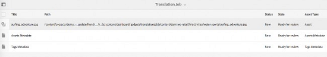

# Criar projetos de tradução {#creating-translation-projects}

Para criar uma cópia de idioma, dispare um dos seguintes workflows de cópia de idioma disponíveis no painel Referências na interface do [!DNL Experience Manager] usuário.

* **Criar e traduzir**: Neste fluxo de trabalho, os ativos a serem traduzidos são copiados para a raiz do idioma para o qual você deseja traduzir. Além disso, dependendo das opções escolhidas, um projeto de tradução é criado para os ativos no console Projetos. Dependendo das configurações, o projeto de tradução pode ser iniciado manualmente ou pode ser executado automaticamente assim que o projeto de tradução for criado.

* **Atualizar cópias** de idioma: Execute esse fluxo de trabalho para traduzir um grupo adicional de ativos e incluí-lo em uma cópia de idioma para uma localidade específica. Nesse caso, os ativos convertidos são adicionados à pasta do público alvo que já contém os ativos convertidos anteriormente.

>[!NOTE]
>
>Os binários de ativos são traduzidos somente se o provedor de serviço de tradução suportar a tradução de binários.

>[!NOTE]
>
>Se você iniciar um fluxo de trabalho de tradução para ativos complexos, como arquivos PDF e [!DNL Adobe InDesign] arquivos, seus subativos ou representações (se houver) não serão submetidos para conversão.

## Criar e traduzir fluxo de trabalho {#create-and-translate-workflow}

Use o fluxo de trabalho de criação e tradução para gerar cópias de idioma para um idioma específico pela primeira vez. O fluxo de trabalho fornece as seguintes opções:

* Criar somente estrutura.
* Criar um novo projeto de tradução.
* Adicionar ao projeto de tradução existente.

### Criar somente estrutura {#create-structure-only}

Use a opção **[!UICONTROL Somente criar estrutura]** para criar uma hierarquia de pasta de destino na raiz do idioma de destino para corresponder à hierarquia da pasta de origem na raiz do idioma de origem. Nesse caso, os ativos de origem são copiados na pasta de destino. No entanto, nenhum projeto de tradução é gerado.

1. Na [!DNL Assets] interface, selecione a pasta de origem para a qual deseja criar uma estrutura na raiz do idioma do público alvo.
1. Open the **[!UICONTROL References]** pane and click **[!UICONTROL Language Copies]** under **[!UICONTROL Copies]**.

   

1. Clique em **[!UICONTROL Criar e traduzir]** na parte inferior.

1. From the **[!UICONTROL Target Languages]** list, select the language for which you want to create a folder structure.

1. Na lista **[!UICONTROL Projeto]**, escolha **[!UICONTROL Somente criar estrutura]**.

   

1. Clique em **[!UICONTROL Criar]**. A nova estrutura para o idioma do público alvo é listada em Cópias **[!UICONTROL de idiomas]**.

   

1. Clique na estrutura da lista e, em seguida, clique em **[!UICONTROL Revelar nos Ativos]** para navegar até a estrutura de pastas no idioma do público alvo.

   

### Criar um novo projeto de tradução {#create-a-new-translation-project}

Se você usar essa opção, os ativos a serem traduzidos serão copiados para a raiz do idioma para o qual você deseja traduzir. Dependendo das opções escolhidas, um projeto de tradução é criado para os ativos no console Projetos. Dependendo das configurações, o projeto de tradução pode ser iniciado manualmente ou executado automaticamente assim que o projeto de tradução for criado.

1. Na interface do [!DNL Assets] usuário, selecione a pasta de origem para a qual deseja criar uma cópia de Idioma.
1. Open the **[!UICONTROL References]** pane and click **[!UICONTROL Language Copies]** under **[!UICONTROL Copies]**.

   

1. Clique em **[!UICONTROL Criar e traduzir]** na parte inferior.

1. Na lista **[!UICONTROL Idiomas de destino]**, selecione os idiomas para os quais deseja criar uma estrutura de pastas.

   

1. Na lista **[!UICONTROL Projeto]** , selecione **[!UICONTROL Criar um novo projeto]** de tradução.

   

1. No campo **[!UICONTROL Título do projeto]**, informe um título para o projeto.

   

1. Clique em **[!UICONTROL Criar]**. [!DNL Assets] da pasta de origem são copiadas para as pastas de públicos alvos para as localidades selecionadas na etapa 4.

   

1. Para navegar até a pasta, selecione a cópia de idioma e clique em **[!UICONTROL Revelar em Ativos]**.

   

1. Navegue até o console Projetos. A pasta de tradução é copiada para o console Projetos.

   

1. Abra a pasta para visualização do projeto de tradução.

   

1. Clique no projeto para abrir a página de detalhes.

   

1. Para visualização do status do trabalho de tradução, clique nas reticências na parte inferior do bloco Trabalho **[!UICONTROL de]** tradução.

   

   Para obter mais detalhes sobre status de trabalhos, consulte [Monitorando o Status de um Trabalho](/help/sites-administering/tc-manage.md#monitoring-the-status-of-a-translation-job)de Tradução.

1. Navegue até a [!DNL Assets] interface do usuário e abra a página Propriedades de cada um dos ativos traduzidos para visualização dos metadados traduzidos.

   

   *Figura: Metadados traduzidos na página de propriedades do ativo.*

   >[!NOTE]
   >
   >Este recurso está disponível para ativos e pastas. Quando um ativo é selecionado em vez de uma pasta, toda a hierarquia de pastas até a raiz do idioma é copiada para criar uma cópia do idioma para o ativo.

### Adicionar ao projeto de tradução existente {#add-to-existing-translation-project}

Se você usar essa opção, o fluxo de trabalho de tradução será executado para os ativos adicionados à pasta de origem após executar um fluxo de trabalho de tradução anterior. Somente os ativos recém-adicionados são copiados para a pasta do público alvo que contém ativos convertidos anteriormente. Nenhum novo projeto de tradução é criado neste caso.

1. Na [!DNL Assets] interface do usuário, navegue até a pasta de origem que contém ativos não convertidos.
1. Selecione um ativo que deseja traduzir e abra o **[!UICONTROL painel Referência]**. A seção **[!UICONTROL Cópias de idioma]** exibe o número de cópias de tradução atualmente disponíveis.
1. Click **[!UICONTROL Language Copies]** under **[!UICONTROL Copies]**. Uma lista de cópias de tradução disponíveis é exibida.
1. Clique em **[!UICONTROL Criar e traduzir]** na parte inferior.

1. Na lista **[!UICONTROL Idiomas de destino]**, selecione os idiomas para os quais deseja criar uma estrutura de pastas.

1. Na lista **[!UICONTROL Projeto]**, selecione **[!UICONTROL Adicionar ao projeto de tradução existente]** para executar o fluxo de trabalho de tradução na pasta.

   

   >[!NOTE]
   >
   >Se você escolher a opção **[!UICONTROL Adicionar ao projeto]** de tradução existente, seu projeto de tradução será adicionado a um projeto pré-existente somente se as configurações do projeto corresponderem exatamente às configurações do projeto pré-existente. Caso contrário, um novo projeto será criado.

1. Na lista do projeto **[!UICONTROL de tradução]** existente, selecione um projeto para adicionar o ativo para conversão.

1. Clique em **[!UICONTROL Criar]**. Os ativos que serão traduzidos são adicionados à pasta de destino. A pasta atualizada está listada na seção **[!UICONTROL Cópias de idioma]**.

   

1. Navegue até o console Projetos e abra o projeto de tradução existente ao qual você adicionou.
1. Clique na visualização do projeto de tradução na página de detalhes do projeto.

   

1. Click the ellipsis at the bottom of the **Translation Job** tile to view the assets in the translation workflow. A lista de tarefas de tradução também exibe entradas para metadados e tags de ativos. Essas entradas indicam que metadados e tags de ativos também são traduzidos.

   >[!NOTE]
   >
   >Se você excluir a entrada para tags ou metadados, nenhuma tag ou metadados será traduzida para qualquer um dos ativos.

   >[!NOTE]
   >
   >Se você usar Tradução automática, os binários de ativos não serão traduzidos.

   >[!NOTE]
   >
   >Se o ativo adicionado ao trabalho de tradução incluir subativos, selecione os subativos e remova-os para que a tradução continue sem falhas.

1. Para start da tradução dos ativos, clique na seta no bloco Trabalho **[!UICONTROL de]** tradução e selecione **[!UICONTROL Start]** na lista.

   

   Uma mensagem notifica o início do trabalho de tradução.

1. Para visualização do status do trabalho de tradução, clique nas reticências na parte inferior do bloco Trabalho **[!UICONTROL de]** tradução.

   

   Para obter mais detalhes, consulte [Monitorando o Status de um Trabalho](/help/sites-administering/tc-manage.md#monitoring-the-status-of-a-translation-job)de Tradução.

1. Após a conclusão da tradução, o status é alterado para Pronto para Revisão. Navegue até a [!DNL Assets] interface do usuário e abra a página Propriedades de cada um dos ativos traduzidos para visualização dos metadados traduzidos.

## Atualizar cópias de idioma {#update-language-copies}

Execute esse fluxo de trabalho para traduzir qualquer conjunto adicional de ativos e incluí-lo em uma cópia de idioma para uma localidade específica. Nesse caso, os ativos convertidos são adicionados à pasta do público alvo que já contém os ativos convertidos anteriormente. Dependendo da escolha das opções, um projeto de tradução é criado ou um projeto de tradução existente é atualizado para os novos ativos. O fluxo de trabalho de cópias de idioma de atualização inclui as seguintes opções:

* Criar um novo projeto de tradução
* Adicionar ao projeto de tradução existente

### Criar um novo projeto de tradução {#create-a-new-translation-project-1}

Se você usar essa opção, um projeto de tradução será criado para o conjunto de ativos para os quais você deseja atualizar uma cópia de idioma.

1. Na [!DNL Assets] interface do usuário, selecione a pasta de origem na qual você adicionou um ativo.
1. Open the **[!UICONTROL References]** pane, and click **[!UICONTROL Language Copies]** under **[!UICONTROL Copies]** to display the list of language copies.
1. Marque a caixa de seleção ao lado de **[!UICONTROL Cópias de idioma]** e selecione a pasta de destino correspondente ao local adequado.

   

1. Clique em **[!UICONTROL Atualizar cópias]** de idioma na parte inferior.

1. Na lista **[!UICONTROL Projeto]** , escolha **[!UICONTROL Criar um novo projeto]** de tradução.

   

1. No campo **[!UICONTROL Título do projeto]**, informe um título para o projeto.

1. Clique em **[!UICONTROL Start]**.
1. Navegue até o console Projetos. A pasta de tradução é copiada para o console Projetos.

   

1. Abra a pasta para visualização do projeto de tradução.

   

1. Clique no projeto para abrir a página de detalhes.

   

1. Para start da tradução dos ativos, clique na seta no bloco Trabalho **[!UICONTROL de]** tradução e selecione **[!UICONTROL Start]** na lista.

   

   Uma mensagem notifica o início do trabalho de tradução.

1. Para visualização do status do trabalho de tradução, clique nas reticências na parte inferior do bloco Trabalho **[!UICONTROL de]** tradução.

   

   Para obter mais detalhes sobre status de trabalhos, consulte [Monitorando o Status de um Trabalho](../sites-administering/tc-manage.md#monitoring-the-status-of-a-translation-job)de Tradução.

1. Navegue até a interface do [!DNL Assets] usuário e abra a página Propriedades de cada um dos ativos traduzidos para visualização dos metadados traduzidos.

### Adicionar ao projeto de tradução existente {#add-to-existing-translation-project-1}

Se você usar essa opção, o conjunto de ativos será adicionado a um projeto de tradução existente para atualizar a cópia de idioma para a localidade escolhida.

1. Na [!DNL Assets] interface do usuário, selecione a pasta de origem na qual você adicionou uma pasta de ativos.
1. Open the **[!UICONTROL References pane]**, and click **[!UICONTROL Language Copies]** under **[!UICONTROL Copies]** to display the list of language copies.

   

1. Marque a caixa de seleção ao lado de **[!UICONTROL Cópias de idioma]**, que seleciona todas as cópias de idioma. Desmarque as outras cópias, exceto a cópia de idioma (cópias) correspondente às localidades para as quais você deseja traduzir.

   

1. Clique em **[!UICONTROL Atualizar cópias]** de idioma na parte inferior.

1. Na lista **[!UICONTROL Projeto]** , escolha **[!UICONTROL Adicionar ao projeto]** de tradução existente.

   

1. Na lista do projeto **[!UICONTROL de tradução]** existente, selecione um projeto para adicionar o ativo para conversão.

1. Clique em **[!UICONTROL Start]**.
1. Consulte as etapas 9 a 14 de [Adicionar ao projeto](translation-projects.md#add-to-existing-translation-project) de tradução existente para concluir o restante do procedimento.

## Criar cópias de idioma temporárias {#creating-temporary-language-copies}

Quando você executa um fluxo de trabalho de tradução para atualizar uma cópia de idioma com versões editadas dos ativos originais, a cópia de idioma existente é preservada até que você aprove os ativos convertidos. [!DNL Adobe Experience Manager Assets] armazena o(s) ativo(s) recém-traduzido(s) em um local temporário e atualiza a cópia de idioma existente após você aprovar explicitamente o(s) ativo(s). Se você rejeitar o(s) ativo(s), a cópia de idioma permanecerá inalterada.

1. Click the source root folder under **[!UICONTROL Language Copies]** for which you already created a language copy, and then click **[!UICONTROL Reveal in Assets]** to open the folder in [!DNL Experience Manager Assets].

   

1. Na [!DNL Assets] interface, selecione um ativo que já tenha sido convertido e clique em **[!UICONTROL Editar]** na barra de ferramentas para abrir o ativo no modo de edição.
1. Edite o ativo e salve as alterações.
1. Execute as etapas 2 a 14 do procedimento [Adicionar ao projeto](#add-to-existing-translation-project) de tradução existente para atualizar a cópia de idioma.
1. Clique nas reticências na parte inferior do bloco Trabalho **[!UICONTROL de]** tradução. Na lista de ativos na página Trabalho **[!UICONTROL de]** tradução, é possível visualização claramente o local temporário onde a versão traduzida do ativo é armazenada.

   

1. Marque a caixa de seleção ao lado de **[!UICONTROL Título]**.
1. From the toolbar, click **[!UICONTROL Accept Translation]**  and then click **[!UICONTROL Accept]** in the dialog to overwrite the translated asset in the target folder with the translated version of the edited asset.

   >[!NOTE]
   >
   >Para permitir que o fluxo de trabalho de tradução atualize o(s) ativo(s) de destino, aceite o ativo e os metadados.

   Clique em **[!UICONTROL Rejeitar tradução]**  para manter a versão traduzida originalmente do ativo na raiz da localidade do público alvo e rejeitar a versão editada.

1. Para visualização dos metadados traduzidos, navegue até o [!DNL Assets] console e abra a página [!UICONTROL Propriedades] de cada um dos ativos traduzidos.

>[!MORELIKETHIS]
>
>* [Dicas para traduzir metadados](https://blogs.adobe.com/experiencedelivers/experience-management/translate_aemassets_metadata/)com eficiência.

