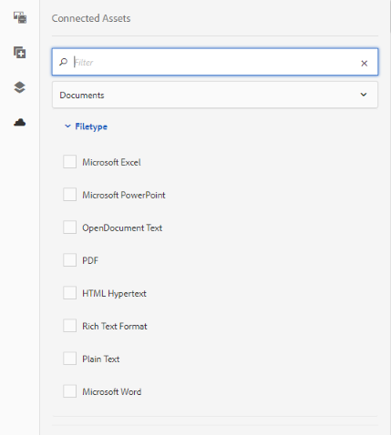

# Use o Connected Assets para compartilhar ativos do DAM no [!DNL Experience Manager Sites] {#use-connected-assets-to-share-dam-assets-in-aem-sites}

Em grandes empresa, a infraestrutura necessária para criar sites pode ser distribuída. Às vezes, os recursos de criação de sites e os ativos digitais usados para criar esses sites podem residir em diferentes implantações. Algumas razões podem ser distribuídas geograficamente por implantações existentes que são necessárias para trabalhar em paralelo ou em aquisições que levam a uma infraestrutura heterogênea que a empresa principal deseja usar em conjunto.

[!DNL Adobe Experience Manager Sites]O oferece recursos para criar páginas da Web e o é o sistema de gerenciamento de ativos digitais (DAM) que fornece os ativos necessários para sites.[!DNL Adobe Experience Manager Assets] [!DNL Experience Manager] agora suporta o caso de uso acima, integrando [!DNL Experience Manager Sites] e [!DNL Experience Manager Assets].

## Visão geral do Connected Assets {#overview-of-connected-assets}

When editing pages in Page Editor, the authors can seamlessly search, browse, and embed assets from a different [!DNL Experience Manager Assets] deployment. To do an [!DNL Experience Manager] administrator do a one-time integration of a local deployment of [!DNL Experience Manager Sites] with a different (remote) deployment of [!DNL Experience Manager Assets].

For the [!DNL Sites] authors, the remote assets are available as read-only local assets. A funcionalidade suporta pesquisa e uso ininterruptos de alguns ativos remotos de cada vez. Para disponibilizar muitos ativos remotos em uma única implantação local, considere migrar os ativos em massa. Consulte Guia [de migração dos ativos](/help/assets/assets-migration-guide.md)do Experience Manager.

### Pré-requisitos e implantações compatíveis {#prerequisites}

Antes de usar ou configurar esse recurso, verifique o seguinte:

* Os usuários fazem parte dos grupos de usuários apropriados em cada implantação.
* Para os tipos de implantação do Adobe Experience Manager, um dos critérios compatíveis é atendido. [!DNL Experience Manager] 6.5 [!DNL Assets] funciona com [!DNL Experience Manager] o Cloud Service. Para obter mais informações, consulte a funcionalidade Ativos [conectados no Experience Manager como um serviço](https://docs.adobe.com/content/help/en/experience-manager-cloud-service/assets/admin/use-assets-across-connected-assets-instances.html)em nuvem.

   |  | [!DNL Experience Manager Sites] como um serviço em nuvem | Experience Manager 6.5 [!DNL Sites] no AMS | Experience Manager 6.5 [!DNL Sites] no local |
   |---|---|---|---|
   | **[!DNL Experience Manager Assets]como um serviço em nuvem ** | Compatível | Compatível | Compatível |
   | **Experience Manager 6.5[!DNL Assets]no AMS** | Compatível | Compatível | Compatível |
   | **Experience Manager 6.5[!DNL Assets]no local** | Incompatível | Incompatível | Incompatível |

### Formatos de arquivo não suportados {#mimetypes}

Os autores podem pesquisar imagens e os seguintes tipos de documentos no Localizador de conteúdo e usar os ativos pesquisados no Editor de páginas. Os documentos podem ser adicionados ao componente `Download` e as imagens podem ser adicionadas ao componente `Image`. Authors can also add the remote assets in any custom Experience Manager component that extends the default `Download` or `Image` components. A lista de formatos suportados são:

* **Formatos** de imagem: Os formatos de imagem suportados pelo componente  Imagem são suportados pelos Ativos conectados. [!DNL Dynamic Media] as imagens não são compatíveis.
* **Formatos de documento**: consulte [Formatos de documento compatíveis com os Connected Assets](assets-formats.md#supported-document-formats).

### Usuários e grupos envolvidos {#users-and-groups-involved}

As várias funções envolvidas para configurar e usar o recurso e seus grupos de usuários correspondentes são descritas abaixo. O escopo local é usado para o caso de uso em que uma página da Web é criada por um autor. O escopo remoto é usado para a implantação do DAM que hospeda os ativos necessários. The [!DNL Sites] author fetches these remote assets.

| Função | Escopo | Grupo de usuários | Nome do usuário na apresentação | Requisito |
|---|---|---|---|---|
| [!DNL Sites] administrador | Local | Administrador do Experience Manager | `admin` | Set up Experience Manager, configure integration with the remote [!DNL Assets] deployment. |
| Usuário do DAM | Local | Autor | `ksaner` | Usado para exibir e duplicar os ativos pesquisados em `/content/DAM/connectedassets/`. |
| [!DNL Sites] author | Local | Author (with read access on the remote DAM and author access on local [!DNL Sites]) | `ksaner` | End user are [!DNL Sites] authors who use this integration to improve their content velocity. Os autores pesquisam e procuram ativos no DAM remoto usando o Localizador de conteúdo e usando as imagens necessárias nas páginas da Web locais. As credenciais do usuário do DAM `ksaner` são usadas. |
| [!DNL Assets] administrador | Remoto | Administrador do Experience Manager | `admin` sobre o Experience Manager remoto | Configure o CORS (Cross-Origin Resource Sharing). |
| Usuário do DAM | Remoto | Autor | `ksaner` sobre o Experience Manager remoto | Função de autor na implantação remota do Experience Manager. Pesquise e procure ativos no Connected Assets usando o Localizador de conteúdo. |
| Distribuidor do DAM (usuário técnico) | Remoto | construtores de pacotes e autores de sites | `ksaner` sobre o Experience Manager remoto | This user present on the remote deployment is used by Experience Manager local server (not the Site author role) to fetch the remote assets, on behalf of [!DNL Sites] author. Essa função não é igual às duas funções `ksaner` acima e pertence a um grupo de usuários diferente. |

## Configure a connection between [!DNL Sites] and [!DNL Assets] deployments {#configure-a-connection-between-sites-and-assets-deployments}

Um administrador do Experience Manager pode criar essa integração. Once created, the permissions required to use it are established via user groups that are defined on the [!DNL Sites] deployment and on the DAM deployment.

To configure Connected Assets and local [!DNL Sites] connectivity, follow these steps.

1. Access an existing [!DNL Experience Manager Sites] deployment or create a deployment using the following command:

   1. Na pasta do arquivo JAR, execute o seguinte comando em um terminal para criar cada servidor Experience Manager.
      `java -XX:MaxPermSize=768m -Xmx4096m -jar <quickstart jar filepath> -r samplecontent -p 4502 -nofork -gui -nointeractive &`

   1. Após alguns minutos, os start do servidor do Experience Manager serão executados com êxito. Consider this [!DNL Experience Manager Sites] deployment as the local machine for web page authoring, say at `https://[local_sites]:4502`.

1. Ensure that the users and roles with local scope exist on the Experience Manager Sites deployment and on the [!DNL Experience Manager Assets] deployment on AMS. Create a technical user on [!DNL Assets] deployment and add to the user group mentioned in [users and groups involved](/help/assets/use-assets-across-connected-assets-instances.md#users-and-groups-involved).

1. Access the local [!DNL Experience Manager Sites] deployment at `https://[local_sites]:4502`. Clique em **[!UICONTROL Ferramentas]** > **[!UICONTROL Ativos]** > **[!UICONTROL Configuração do Connected Assets]** e forneça os seguintes valores:

   1. [!DNL Experience Manager Assets] o local é `https://[assets_servername_ams]:[port]`.
   1. Credenciais de um distribuidor do DAM (usuário técnico).
   1. In **[!UICONTROL Mount Point]** field, enter the local Experience Manager path where Experience Manager fetches the assets. Por exemplo, pasta `remoteassets`.
   1. Ajuste os valores do **[!UICONTROL Limite de otimização da transferência do binário original]**, dependendo da sua rede. Uma representação de ativos maior que esse limite é transferida de forma assíncrona.
   1. Select **[!UICONTROL Datastore Shared with Connected Assets]**, if you use a datastore to store your assets and the Datastore is the common storage between both Experience Manager deployments. Nesse caso, o limite não importa, pois os binários de ativos reais residem no datastore e não são transferidos.
      
   *Figura: uma configuração normal do Connected Assets.*

1. Como os ativos já são processados e as representações são buscadas, desative os inicializadores do fluxo de trabalho. Adjust the launcher configurations on the local ([!DNL Experience Manager Sites]) deployment to exclude the `connectedassets` folder, in which the remote assets are fetched.

   1. On [!DNL Experience Manager Sites] deployment, click **[!UICONTROL Tools]** > **[!UICONTROL Workflow]** > **[!UICONTROL Launchers]**.

   1. Procure Iniciadores com fluxos de trabalho como **[!UICONTROL Ativo de atualização do DAM]** e **[!UICONTROL Writeback de metadados do DAM]**.

   1. Selecione o iniciador do fluxo de trabalho e clique em **[!UICONTROL Propriedades]** na barra de ações.

   1. No assistente Propriedades, altere os campos **[!UICONTROL Caminho]** como os seguintes mapeamentos para atualizar as expressões regulares para excluir os **[!UICONTROL ativos conectados]** do ponto de montagem.
   | Antes | Depois |
   |---|---|
   | `/content/dam(/((?!/subassets).)*/)renditions/original` | `/content/dam(/((?!/subassets)(?!connectedassets).)*/)renditions/original` |
   | `/content/dam(/*/)renditions/original` | `/content/dam(/((?!connectedassets).)*/)renditions/original` |
   | `/content/dam(/*)/jcr:content/metadata` | `/content/dam(/((?!connectedassets).)*/)jcr:content/metadata` |

   >[!NOTE]
   >
   >Todas as execuções que estão disponíveis na implantação remota do Experience Manager são buscadas, quando os autores buscam um ativo. Se você quiser criar mais representações de um ativo buscado, pule esta etapa de configuração. The [!UICONTROL DAM Update Asset] workflow gets triggered and creates more renditions. These renditions are available only on the local [!DNL Sites] deployment and not on the remote DAM deployment.

1. Add the [!DNL Experience Manager Sites] instance as one of the **[!UICONTROL Allowed Origins]** on the remote [!DNL Experience Manager Assets] CORS configuration.

   1. Faça logon usando as credenciais de administrador. Pesquisar `Cross-Origin`. Acesse **[!UICONTROL Ferramentas]** > **[!UICONTROL Operações]** > **[!UICONTROL Console da Web]**.

   1. To create a CORS configuration for [!DNL Experience Manager Sites] instance, click  icon next to **[!UICONTROL Adobe Granite Cross-Origin Resource Sharing Policy]**.

   1. In the field **[!UICONTROL Allowed Origins]**, input the URL of the local [!DNL Sites], that is, `https://[local_sites]:[port]`. Salve a configuração.

## Use ativos remotos {#use-remote-assets}

Os autores do site usam o Localizador de conteúdo para se conectar à instância do DAM. Os autores podem procurar, buscar e arrastar os ativos remotos em um componente. Para autenticar no DAM remoto, mantenha acessíveis as credenciais do usuário do DAM fornecidas pelo administrador.

Os autores podem usar os ativos disponíveis nas instâncias do DAM local e do DAM remoto, em uma única página da Web. Use o Localizador de conteúdo para alternar entre a pesquisa no DAM local ou a pesquisa no DAM remoto.

Only those tags of remote assets are fetched that have an exact corresponding tag along with the same taxonomy hierarchy, available on the local [!DNL Sites] instance. Quaisquer outras tags são descartadas. Os autores podem pesquisar ativos remotos usando todas as tags presentes na implantação remota do Experience Manager, já que o Experience Manager oferta uma pesquisa de texto completo.

### Apresentação do uso {#walk-through-of-usage}

Use a configuração acima para ter uma experiência de criação a fim de entender a funcionalidade. Use documentos ou imagens de sua escolha na implantação remota do DAM.

1. Navigate to the [!DNL Assets] user interface on the remote deployment by accessing **[!UICONTROL Assets]** > **[!UICONTROL Files]** from [!DNL Experience Manager] workspace. Como alternativa, acesse `https://[assets_servername_ams]:[port]/assets.html/content/dam` em um navegador. Carregue os ativos de sua escolha.
1. On the [!DNL Sites] instance, in the profile activator in the upper-right corner, click **[!UICONTROL Impersonate as]**. Forneça `ksaner` como nome de usuário, selecione a opção fornecida e clique em **[!UICONTROL OK]**.
1. Abra uma página do site We.Retail em **[!UICONTROL Sites]** > **[!UICONTROL We.Retail]** > **[!UICONTROL br]** > **[!UICONTROL pt]**. Edite a página. Como alternativa, acesse `https://[aem_server]:[port]/editor.html/content/we-retail/us/en/men.html` em um navegador para editar uma página.

   Clique em **[!UICONTROL Alternar painel lateral]** no canto superior esquerdo da página.

1. Open the [!UICONTROL Assets] tab and click **[!UICONTROL Log in to Connected Assets]**.
1. Forneça as credenciais - `ksaner` como nome de usuário e `password` como senha. This user has authoring permissions on both the [!DNL Experience Manager] deployments.
1. Procure o ativo que você adicionou ao DAM. Os ativos remotos são exibidos no painel esquerdo. Filtre por imagens ou documentos e filtre também por tipos de documentos compatíveis. Arraste as imagens em um componente `Image` e os documentos em um componente `Download`.

   The fetched assets are read-only on the local [!DNL Experience Manager Sites] deployment. You can still use the options provided by your [!DNL Experience Manager Sites] components to edit the fetched asset. A edição por componentes não é destrutiva.

   

   *Figura: opções para filtrar tipos de documentos e imagens ao pesquisar ativos no DAM remoto.*

1. Um autor do site será notificado se ocorrer uma busca assíncrona de ativo e uma falha na tarefa de busca. Durante a criação ou até mesmo após a criação, os autores podem ver informações detalhadas sobre as tarefas de busca e erros na interface do usuário de [trabalhos assíncronos](/help/assets/asynchronous-jobs.md).

   

   *Figura: notificação sobre a busca assíncrona de ativos que ocorre em segundo plano.*

1. When publishing a page, [!DNL Experience Manager] displays a complete list of assets that are used in the page. Verifique se os ativos remotos foram buscados com êxito no momento da publicação. Para verificar o status de cada ativo buscado, consulte a interface do usuário de [trabalhos assíncronos](/help/assets/asynchronous-jobs.md).

   >[!NOTE]
   >
   >Mesmo se um ou mais ativos remotos não forem buscados, a página será publicada. O componente que usa o ativo remoto é publicado vazio. The [!DNL Experience Manager] notification area displays notification for errors that show in async jobs page.

>[!CAUTION]
>
>Uma vez usados em uma página da Web, os ativos remotos buscados podem ser pesquisados e usados por qualquer pessoa com permissões para acessar a pasta local em que os ativos buscados são armazenados (`connectedassets` na apresentação acima). Os ativos também podem ser pesquisados e visualizados no repositório local por meio do [!UICONTROL Localizador de conteúdo].

Os ativos buscados podem ser usados como qualquer outro ativo local, exceto se os metadados associados não puderem ser editados.

## Limitações        {#limitations}

**Permissões e gerenciamento de ativos**

* Os ativos locais não são sincronizados com os ativos originais na implantação remota. As edições, exclusões ou revogação de permissões na implantação do DAM não são propagadas para a jusante.
* Os ativos locais são cópias somente leitura. Os componentes do Experience Manager fazem edições não destrutivas em ativos. Nenhuma outra edição é permitida.
* Os ativos buscados localmente estão disponíveis apenas para fins de criação. Os fluxos de trabalho de atualização de ativos não podem ser aplicados e os metadados não podem ser editados.
* Somente as imagens e os formatos de documento listados são compatíveis. [!DNL Dynamic Media] ativos, Fragmentos de conteúdo e Fragmentos de experiência não são suportados.
* Os esquemas de metadados não são buscados.
* All [!DNL Sites] authors have read permissions on the fetched copies, even if they do not have access to the remote DAM deployment.
* Não há suporte de API para personalizar a integração.
* A funcionalidade suporta pesquisa e uso ininterruptos de ativos remotos. Para disponibilizar muitos ativos remotos em uma única implantação local, considere migrar os ativos. Consulte [guia de migração de Ativos](assets-migration-guide.md).
* Não é possível usar um ativo remoto como uma miniatura de página na interface do usuário Propriedades [!UICONTROL da] página. Você pode definir uma miniatura de uma página da Web na interface do usuário Propriedades [!UICONTROL da] página na [!UICONTROL miniatura] clicando em [!UICONTROL Selecionar imagem].

**Configuração e licenciamento**

* [!DNL Experience Manager Assets] a implantação no AMS é suportada.
* [!DNL Experience Manager Sites] pode se conectar a um único [!DNL Experience Manager Assets] repositório de cada vez.
* A license of [!DNL Experience Manager Assets] working as remote repository.
* One or more licenses of [!DNL Experience Manager Sites] working as local authoring deployment.

**Uso**

* A única funcionalidade compatível é pesquisar ativos remotos e arrastar os ativos remotos na página local para criar conteúdo.
* A operação de busca expira após 5 segundos. Os autores podem ter problemas ao buscar ativos, digamos se houver problemas de rede. Os autores podem tentar novamente, arrastando o ativo remoto do [!UICONTROL Localizador de conteúdo] para o [!UICONTROL Editor de páginas].
* Edições simples que não são destrutivas e a edição compatível por meio do componente [!DNL Experience Manager] do podem ser realizadas nos ativos buscados. `Image` Os ativos são somente leitura.

## Solução de problemas {#troubleshoot}

Siga estas etapas para solucionar problemas de cenários de erro comuns:

* Se não for possível pesquisar ativos remotos no Localizador de conteúdo, verifique novamente se as funções e permissões necessárias estão em vigor.
* Um ativo buscado em um DAM remoto pode não ser publicado em uma página da Web pelos motivos a seguir: ele não existe no local remoto, falta de permissões adequadas para buscá-lo e falha de rede. Verifique se o ativo não foi removido do DAM remoto ou se as permissões não foram alteradas. Verifique se os requisitos necessários foram atendidos. Tente adicionar o ativo novamente à página e publique-o de novo. Verifique a [lista de trabalhos assíncronos](/help/assets/asynchronous-jobs.md) quanto a erros na busca de ativos.
