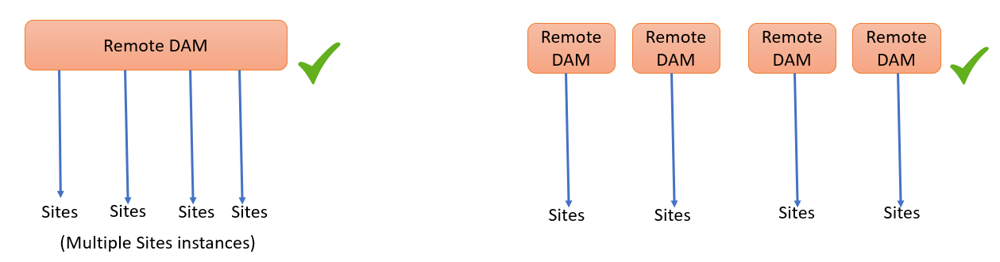
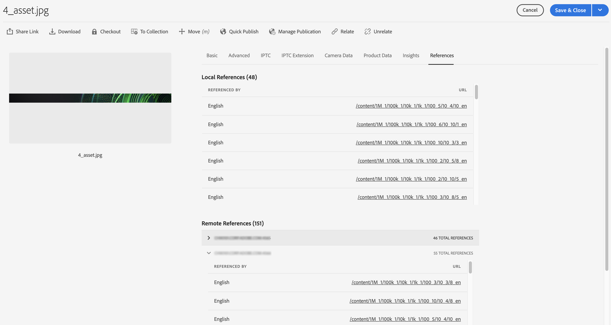

# Usar o Connected Assets para compartilhar ativos do DAM em [!DNL Experience Manager Sites] {#use-connected-assets-to-share-dam-assets-in-aem-sites}

| Versão | Link do artigo |
| -------- | ---------------------------- |
| AEM as a Cloud Service | [Clique aqui](https://experienceleague.adobe.com/docs/experience-manager-cloud-service/content/assets/admin/use-assets-across-connected-assets-instances.html?lang=en) |
| AEM 6.5 | Este artigo |


Em grandes empresa, a infraestrutura necessária para criar sites pode ser distribuída. Às vezes, os recursos de criação de sites e os ativos digitais usados para criar esses sites podem residir em diferentes implantações. Um motivo pode ser a distribuição geográfica de implantações existentes que são necessárias para trabalhar em conjunto. Outro motivo pode ser aquisições que levam a uma infraestrutura heterogênea, incluindo diferentes versões do [!DNL Experience Manager], que a empresa principal deseja usar juntas.

A funcionalidade Assets conectada oferece suporte aos casos de uso acima integrando o [!DNL Experience Manager Sites] e o [!DNL Experience Manager Assets]. Os usuários podem criar páginas da Web no [!DNL Sites] que usam os ativos digitais de uma implantação do [!DNL Assets] separada.

>[!NOTE]
>
>Configure o Connected Assets somente quando precisar usar os ativos disponíveis em uma implantação remota do DAM em uma implantação separada do Sites para criação de páginas da Web.

## Visão geral do Connected Assets {#overview-of-connected-assets}

Ao editar páginas no [!UICONTROL Editor de páginas] como destino, os autores podem pesquisar, procurar e incorporar facilmente ativos de uma implantação diferente do [!DNL Assets] que atue como uma fonte de ativos. Os administradores criam uma integração única de uma implantação do [!DNL Experience Manager] com o recurso [!DNL Sites] com outra implantação do [!DNL Experience Manager] com o recurso [!DNL Assets]. Os autores de site também podem usar imagens do Dynamic Media nas páginas da Web do site por meio do Connected Assets e usar as funcionalidades do Dynamic Media, como recorte inteligente e predefinições de imagem.

Para os autores do [!DNL Sites], os ativos remotos estão disponíveis como ativos locais somente leitura. A funcionalidade suporta pesquisa e acesso ininterruptos a ativos remotos no Editor de sites. Para quaisquer outros casos de uso que possam exigir que o conjunto completo de ativos esteja disponível no Sites, considere migrar os ativos em massa em vez de usar o Connected Assets. Consulte o [guia de migração do Experience Manager Assets](/help/assets/assets-migration-guide.md).

### Pré-requisitos e implantações compatíveis {#prerequisites}

Antes de usar ou configurar esse recurso, verifique o seguinte:

* Os usuários fazem parte dos grupos de usuários apropriados em cada implantação.
* Para os tipos de implantação [!DNL Adobe Experience Manager], um dos critérios aceitos foi atendido. [!DNL Experience Manager] 6.5 [!DNL Assets] funciona com [!DNL Experience Manager] as a Cloud Service. Para obter mais informações sobre como essa funcionalidade funciona no [!DNL Experience Manager] as a [!DNL Cloud Service], consulte [Connected Assets no Experience Manager as a Cloud Service](https://experienceleague.adobe.com/docs/experience-manager-cloud-service/content/assets/admin/use-assets-across-connected-assets-instances.html).

  | | [!DNL Sites] as a [!DNL Cloud Service] | [!DNL Experience Manager] 6.5 [!DNL Sites] no AMS | [!DNL Experience Manager] 6.5 [!DNL Sites] no local |
  |---|---|---|---|
  | **[!DNL Experience Manager Assets]as a[!DNL Cloud Service]** | Compatível | Compatível | Compatível |
  | **[!DNL Experience Manager]6.5 [!DNL Assets] no AMS** | Compatível | Compatível | Compatível |
  | **[!DNL Experience Manager]6.5 [!DNL Assets] no local** | Incompatível | Incompatível | Incompatível |

### Formatos de arquivo não compatíveis {#mimetypes}

Os autores pesquisam imagens e os seguintes tipos de documentos no Localizador de conteúdo e arrastam os ativos pesquisados no Editor de páginas. Os documentos são adicionados ao componente `Download` e as imagens ao componente `Image`. Os autores também podem adicionar os ativos remotos em qualquer componente [!DNL Experience Manager] personalizado que estende os componentes `Download` ou `Image` padrão. Os formatos compatíveis são:

* **Formatos de imagem**: os formatos aceitos pelo [componente de Imagem](assets-formats.md#supported-raster-image-formats).
* **Formatos de documento**: consulte os [formatos de documento compatíveis](assets-formats.md#supported-document-formats).

### Usuários e grupos envolvidos {#users-and-groups-involved}

As várias funções envolvidas para configurar e usar o recurso e seus grupos de usuários correspondentes são descritas abaixo. O escopo local é usado para o caso de uso em que um autor cria uma página da Web. O escopo remoto é usado para a implantação do DAM que hospeda os ativos necessários. O autor [!DNL Sites] busca esses ativos remotos.

| Função | Escopo | Grupo de usuários | Nome do usuário na apresentação | Descrições |
|---|---|---|---|---|
| [!DNL Sites] administrador | Local | [!DNL Experience Manager] `administrators` | `admin` | Configurar o [!DNL Experience Manager] e a integração com a implantação remota [!DNL Assets]. |
| Usuário do DAM | Local | `Authors` | `ksaner` | Usado para exibir e duplicar os ativos pesquisados em `/content/DAM/connectedassets/`. |
| Autor de [!DNL Sites] | Local | <ul><li>`Authors` (com acesso de leitura no DAM remoto e acesso de autor no [!DNL Sites] local) </li> <li>`dam-users` no [!DNL Sites] local</li></ul> | `ksaner` | Os usuários finais são [!DNL Sites] autores que usam essa integração para melhorar sua velocidade de conteúdo. Os autores pesquisam e procuram ativos no DAM remoto usando o [!UICONTROL Localizador de conteúdo] e usando as imagens necessárias nas páginas da Web locais. As credenciais do usuário do DAM `ksaner` são usadas. |
| [!DNL Assets] administrador | Remoto | [!DNL Experience Manager] `administrators` | `admin` no [!DNL Experience Manager] remoto | Configure o CORS (Cross-Origin Resource Sharing). |
| Usuário do DAM | Remoto | `Authors` | `ksaner` no [!DNL Experience Manager] remoto | Função de autor na implantação remota [!DNL Experience Manager]. Pesquise e procure ativos no Connected Assets usando o [!UICONTROL Localizador de conteúdo]. |
| Distribuidor do DAM (usuário técnico) | Remoto | [!DNL Sites] `Authors` | `ksaner` no [!DNL Experience Manager] remoto | Este usuário presente na implantação remota é usado pelo servidor local [!DNL Experience Manager] (não pela função de autor [!DNL Sites]) para buscar os ativos remotos, em nome do autor [!DNL Sites]. Essa função não é igual às duas funções `ksaner` acima e pertence a um grupo de usuários diferente. |

### Arquitetura do Connected Assets {#connected-assets-architecture}

Experience Manager permite conectar uma implantação remota do DAM como uma origem a várias implantações de Experience Manager [!DNL Sites]. No entanto, você pode conectar uma implantação do [!DNL Sites] com apenas uma implantação remota do DAM.

Avalie o número ideal de instâncias do Sites para se conectar a uma implantação remota do DAM. O Adobe recomenda conectar de forma incremental as instâncias do Sites à implantação e testar se não há impacto no desempenho no DAM remoto, pois cada instância do Sites conectada contribui para o tráfego de dados no DAM remoto.

Os diagramas a seguir ilustram os cenários compatíveis:



O diagrama a seguir ilustra um cenário incompatível:


## Configurar uma conexão entre [!DNL Sites] e [!DNL Assets] implantações {#configure-a-connection-between-sites-and-assets-deployments}

Um administrador do [!DNL Experience Manager] pode criar essa integração. Depois de criadas, as permissões necessárias para usá-la são estabelecidas por meio de grupos de usuários. Os grupos de usuários são definidos na implantação do [!DNL Sites] e na implantação do DAM.

Para configurar a conectividade do Connected Assets e do [!DNL Sites] local, siga estas etapas:

1. Acesse uma implantação existente do [!DNL Sites] ou crie uma implantação usando o seguinte comando:

   1. Na pasta do arquivo JAR, execute o seguinte comando em um terminal para criar cada servidor [!DNL Experience Manager].

      `java -Xmx4096m -jar <quickstart jar filepath> -r samplecontent -p 4502 -nofork -gui -nointeractive &`

   1. Após alguns minutos, o servidor [!DNL Experience Manager] será iniciado com êxito. Considere esta implantação do [!DNL Sites] como a máquina local da criação de página da Web, digamos em `https://[local_sites]:4502`.

1. Verifique se os usuários e as funções com o escopo apropriado existem na implantação do [!DNL Sites] e na implantação do [!DNL Assets] no AMS. Crie um usuário técnico na implantação do [!DNL Assets] e adicione ao grupo de usuários mencionado em [usuários e grupos envolvidos](/help/assets/use-assets-across-connected-assets-instances.md#users-and-groups-involved).

1. Acesse a implantação local [!DNL Sites] em `https://[local_sites]:4502`. Clique em **[!UICONTROL Ferramentas]** > **[!UICONTROL Ativos]** > **[!UICONTROL Configuração do Connected Assets]** e forneça os seguintes valores:

   1. Um **[!UICONTROL Título]** da configuração.
   1. **[!UICONTROL URL do DAM remoto]** é a URL do local [!DNL Assets] no formato `https://[assets_servername]:[port]`.
   1. Credenciais de um distribuidor do DAM (usuário técnico).
   1. No campo **[!UICONTROL Ponto de Montagem]**, insira o caminho [!DNL Experience Manager] local onde [!DNL Experience Manager] busca os ativos. Por exemplo, pasta `remoteassets`. Os ativos buscados no DAM são armazenados nesta pasta na implantação do [!DNL Sites].
   1. **[!UICONTROL URL de Sites Locais]** é o local da implantação do [!DNL Sites]. A implantação [!DNL Assets] usa esse valor para manter referências aos ativos digitais buscados por essa implantação [!DNL Sites].
   1. Credenciais de usuário técnico [!DNL Sites].
   1. O campo **[!UICONTROL Limite de otimização da transferência do binário original]** especifica se os ativos originais (incluindo as representações) são transferidos de forma síncrona ou não. O Assets com tamanho de arquivo menor pode ser obtido prontamente, enquanto ativos com tamanho de arquivo relativamente maior são melhor sincronizados de forma assíncrona. O valor depende dos recursos da rede.
   1. Selecione **[!UICONTROL Datastore compartilhado com o Connected Assets]**, se você usar um datastore para armazenar seus ativos e se o Datastore for compartilhado entre as duas implantações. Nesse caso, o limite não importa, pois os binários de ativos reais estão disponíveis no armazenamento de dados e não são transferidos.

   

   *Figura: uma configuração típica da funcionalidade Connected Assets.*

1. Os ativos digitais existentes na implantação do [!DNL Assets] já foram processados e as representações são geradas. Essas representações são buscadas usando essa funcionalidade, de modo que não há necessidade de gerar novamente as representações. Desative os iniciadores do fluxo de trabalho para impedir a regeneração de representações. Ajuste as configurações do iniciador na implantação do ([!DNL Sites]) para excluir a pasta `connectedassets` (os ativos são buscados nessa pasta).

   1. Na implantação do [!DNL Sites], clique em **[!UICONTROL Ferramentas]** > **[!UICONTROL Fluxo de trabalho]** > **[!UICONTROL Iniciadores]**.

   1. Procure Iniciadores com fluxos de trabalho como **[!UICONTROL Ativo de atualização do DAM]** e **[!UICONTROL Writeback de metadados do DAM]**.

   1. Selecione o iniciador do fluxo de trabalho e clique em **[!UICONTROL Propriedades]** na barra de ações.

   1. No assistente de [!UICONTROL Propriedades], altere os campos **[!UICONTROL Caminho]** como os seguintes mapeamentos para atualizar suas expressões regulares para excluir o ponto de montagem **[!UICONTROL connectedassets]**.

   | Antes | Depois |
   |---|---|
   | `/content/dam(/((?!/subassets).)*/)renditions/original` | `/content/dam(/((?!/subassets)(?!connectedassets).)*/)renditions/original` |
   | `/content/dam(/.*/)renditions/original` | `/content/dam(/((?!connectedassets).)*/)renditions/original` |
   | `/content/dam(/.*)/jcr:content/metadata` | `/content/dam(/((?!connectedassets).)*/)jcr:content/metadata` |

   >[!NOTE]
   >
   >Todas as representações disponíveis na implantação remota são buscadas, quando os autores buscam um ativo. Se você quiser criar mais representações de um ativo buscado, pule esta etapa de configuração. O fluxo de trabalho [!UICONTROL Ativo de atualização do DAM] é acionado e cria mais representações. Essas representações estão disponíveis somente na implantação local [!DNL Sites] e não na implantação remota do DAM.

1. Adicione a implantação [!DNL Sites] como uma origem permitida na configuração CORS na implantação [!DNL Assets]. Para obter mais informações, consulte [entender o CORS](https://experienceleague.adobe.com/docs/experience-manager-learn/foundation/security/understand-cross-origin-resource-sharing.html).

1. Configurar o [suporte a cookies no mesmo site](/help/sites-administering/same-site-cookie-support.md).

Você pode verificar a conectividade entre as [!DNL Sites] implantações configuradas e a [!DNL Assets] implantação.

![Teste de conexão do Connected Assets configurado [!DNL Sites]](assets/connected-assets-multiple-config.png)
*Figura: Teste de conexão do Connected Assets configurado [!DNL Sites].*

## Usar ativos do Dynamic Media {#dynamic-media-assets}


Com o Connected Assets, você pode usar ativos de imagem processados pelo [!DNL Dynamic Media] a partir da implantação remota do DAM em páginas do Sites e usar as funcionalidades do Dynamic Media, como recorte inteligente e predefinições de imagem.

Para usar [!DNL Dynamic Media] com o Connected Assets:

1. Configure [!DNL Dynamic Media] na implantação remota do DAM com o modo de sincronização habilitado.
1. Configurar [Assets Conectado](#configure-a-connection-between-sites-and-assets-deployments).
1. Configure [!DNL Dynamic Media] na instância do Sites com o mesmo nome de empresa configurado no DAM remoto. A implantação do Sites deve ter acesso somente leitura à conta do Dynamic Media para funcionar com ativos conectados. Portanto, desative o modo de Sincronização na configuração do Dynamic Media na instância do Sites.

>[!CAUTION]
>
>Com o Connected Assets e a configuração [!DNL Dynamic Media], você não pode usar o [!DNL Dynamic Media] para processar ativos locais disponíveis na implantação do [!DNL Sites].

## Configurar o [!DNL Dynamic Media] {#configure-dynamic-media}

Para configurar o [!DNL Dynamic Media] em [!DNL Assets] e [!DNL Sites] implantações:

1. Habilite e configure [!DNL Dynamic Media] como configuração global na implantação remota do autor [!DNL Assets]. Para configurar o Dynamic Media, consulte [Configurar o Dynamic Media](/help/assets/config-dynamic.md#configuring-dynamic-media-cloud-services).
Na implantação remota [!DNL Assets], no [!UICONTROL modo de sincronização do Dynamic Media], selecione **[!UICONTROL Habilitado por padrão]**.

1. Crie a configuração do Connected Assets conforme descrito em [Configurar a conexão entre implantações de sites e ativos](#configure-a-connection-between-sites-and-assets-deployments). Além disso, selecione a opção **[!UICONTROL Buscar representação original para Dynamic Media Connected Assets]**.

1. Configurar [!DNL Dynamic Media] em implantações [!DNL Sites] locais e [!DNL Assets] remotas. Siga as instruções para [configurar [!DNL Dynamic Media]](/help/assets/config-dynamic.md#configuring-dynamic-media-cloud-services).

   * Use o mesmo nome de empresa em todas as configurações.
   * No [!DNL Sites] local, no [!UICONTROL modo de sincronização do Dynamic Media], selecione **[!UICONTROL Desabilitado por padrão]**. A implantação [!DNL Sites] deve ter acesso somente leitura à conta [!DNL Dynamic Media].
   * No [!DNL Sites] local, na opção **[!UICONTROL Publish Assets]**, selecione **[!UICONTROL Publish Seletiva]**. Não selecione **[!UICONTROL Sincronizar todo o conteúdo]**.

1. Habilitar o [[!DNL Dynamic Media] suporte no Componente principal de Imagem](https://experienceleague.adobe.com/docs/experience-manager-core-components/using/components/image.html#dynamic-media). Este recurso habilita o [Componente de imagem](https://www.aemcomponents.dev/content/core-components-examples/library/core-content/image.html) padrão para exibir [!DNL Dynamic Media] imagens quando [!DNL Dynamic Media] imagens são usadas por autores em páginas da Web na implantação local [!DNL Sites].

## Usar ativos remotos {#use-remote-assets}

Os autores do site usam o Localizador de conteúdo para se conectar à implantação do DAM. Os autores podem procurar, buscar e arrastar os ativos remotos em um componente. Para autenticar no DAM remoto, mantenha acessíveis as credenciais fornecidas pelo administrador (se houver).

Os autores podem usar os ativos disponíveis no DAM local e na implantação remota do DAM, em uma única página da Web. Use o Localizador de conteúdo para alternar entre a pesquisa no DAM local ou a pesquisa no DAM remoto.

São buscadas somente as marcas de ativos remotos que têm uma marca exata correspondente junto com a mesma hierarquia de taxonomia, disponível na implantação local [!DNL Sites]. Quaisquer outras tags são descartadas. Os autores podem pesquisar ativos remotos usando todas as marcas presentes na implantação remota do [!DNL Experience Manager], pois ela oferece uma pesquisa de texto completo.

### Apresentação do uso {#walk-through-of-usage}

Use a configuração acima para ter uma experiência de criação a fim de entender a funcionalidade. Use documentos ou imagens de sua escolha na implantação remota do DAM.

1. Navegue até a interface [!DNL Assets] na implantação remota, acessando **[!UICONTROL Assets]** > **[!UICONTROL Arquivos]** do espaço de trabalho [!DNL Experience Manager]. Como alternativa, acesse `https://[assets_servername_ams]:[port]/assets.html/content/dam` em um navegador. Carregue os ativos de sua escolha.
1. Na implantação [!DNL Sites], no ativador de perfil no canto superior direito, clique em **[!UICONTROL Representar como]**. Forneça `ksaner` como nome de usuário, selecione a opção fornecida e clique em **[!UICONTROL OK]**.
1. Abra uma página do site We.Retail em **[!UICONTROL Sites]** > **[!UICONTROL We.Retail]** > **[!UICONTROL br]** > **[!UICONTROL pt]**. Edite a página. Como alternativa, acesse `https://[aem_server]:[port]/editor.html/content/we-retail/us/en/men.html` em um navegador para editar uma página.

   Clique em **[!UICONTROL Alternar painel lateral]** no canto superior esquerdo da página.

1. Abra a guia [!UICONTROL Assets] (Localizador de Conteúdo Remoto) e clique em **[!UICONTROL Fazer Logon no Connected Assets]**.
1. Forneça as credenciais - `ksaner` como nome de usuário e `password` como senha. Este usuário tem permissões de criação em ambas as implantações do [!DNL Experience Manager].
1. Procure o ativo que você adicionou ao DAM. Os ativos remotos são exibidos no painel esquerdo. Filtre por imagens ou documentos e filtre também por tipos de documentos compatíveis. Arraste as imagens em um componente `Image` e os documentos em um componente `Download`.

   Os ativos buscados são somente leitura na implantação local [!DNL Sites]. Você ainda pode usar as opções fornecidas pelos componentes do [!DNL Sites] para editar o ativo buscado. A edição por componentes não é destrutiva.

   

   *Figura: opções para filtrar tipos de documentos e imagens ao pesquisar ativos no DAM remoto.*

1. Um autor do site será notificado se a busca original de um ativo for realizada de forma assíncrona e se qualquer tarefa de busca falhar. Durante a criação ou até mesmo após a criação, os autores podem ver informações detalhadas sobre as tarefas de busca e erros na interface do usuário de [trabalhos assíncronos](/help/sites-administering/asynchronous-jobs.md).

   

   *Figura: notificação sobre a busca assíncrona de ativos que ocorre em segundo plano.*

1. Ao publicar uma página, [!DNL Experience Manager] exibe uma lista completa dos ativos usados na página. Verifique se os ativos remotos foram buscados com êxito no momento da publicação. Para verificar o status de cada ativo buscado, consulte a interface do usuário [trabalhos assíncronos](/help/sites-administering/asynchronous-jobs.md).

   >[!NOTE]
   >
   >Mesmo se um ou mais ativos remotos não forem buscados completamente, a página será publicada. A área de notificação [!DNL Experience Manager] exibe uma notificação de erros que são exibidos na página de trabalhos assíncronos.

>[!CAUTION]
>
>Uma vez usados em uma página da Web, os ativos remotos buscados podem ser pesquisados e usados por qualquer pessoa com permissões para acessar a pasta local. Os ativos buscados são armazenados na pasta local (`connectedassets` na apresentação acima). Os ativos também podem ser pesquisados e visualizados no repositório local por meio do [!UICONTROL Localizador de conteúdo].

Os ativos buscados podem ser usados como qualquer outro ativo local, exceto se os metadados associados não puderem ser editados.

### Verificar o uso de um ativo em várias páginas da Web {#asset-usage-references}

[!DNL Experience Manager] permite que os usuários do DAM verifiquem todas as referências a um ativo. Ajuda a entender e gerenciar o uso de um ativo no [!DNL Sites] remoto e em ativos compostos. Muitos autores de páginas da Web na implantação do [!DNL Experience Manager Sites] podem usar um ativo em um [!DNL Assets] remoto em páginas da Web diferentes. Para simplificar o gerenciamento de ativos e não resultar em referências quebradas, é importante que os usuários do DAM verifiquem o uso de um ativo em páginas da Web locais e remotas. A guia [!UICONTROL Referências] na página [!UICONTROL Propriedades] de um ativo lista as referências locais e remotas do ativo.

Para exibir e gerenciar referências na implantação do [!DNL Assets], siga estas etapas:

1. Selecione um ativo no Console [!DNL Assets] e clique em **[!UICONTROL Propriedades]** na barra de ferramentas.
1. Clique na guia **[!UICONTROL Referências]**. Consulte **[!UICONTROL Referências locais]** para usar o ativo na implantação [!DNL Assets]. Consulte **[!UICONTROL Referências remotas] para usar o ativo na implantação do [!DNL Sites], em que o ativo foi buscado usando a funcionalidade do Connected Assets.

   

1. As referências para [!DNL Sites] páginas exibem a contagem total de referências para cada [!DNL Sites] local. Pode levar algum tempo para encontrar todas as referências e exibir o número total de referências.
1. A lista de referências é interativa e os usuários do DAM podem clicar em uma referência para abrir a página de referência. Se as referências remotas não puderem ser buscadas por algum motivo, uma notificação será exibida informando o usuário sobre a falha.
1. Os usuários podem mover ou excluir o ativo. Ao mover ou excluir um ativo, o número total de referências de todos os ativos/pastas selecionados é exibido em uma caixa de diálogo de aviso. Ao excluir um ativo para o qual as referências ainda não foram recuperadas, uma caixa de diálogo de aviso é exibida.

   

### Gerenciar atualizações de ativos no DAM remoto {#manage-updates-in-remote-dam}

Após [configurar uma conexão](#configure-a-connection-between-sites-and-assets-deployments) entre o DAM remoto e [!DNL Sites] implantações, os ativos no DAM remoto são disponibilizados na implantação do [!DNL Sites]. Em seguida, você pode atualizar, excluir, renomear e mover operações nos ativos ou pastas remotos do DAM. As atualizações, com algum atraso, estão disponíveis automaticamente na implantação do [!DNL Sites]. Além disso, se um ativo no DAM remoto for usado em uma página local do [!DNL Experience Manager Sites], as atualizações do ativo no DAM remoto serão exibidas na página [!DNL Sites].

Ao mover um ativo de um local para outro, certifique-se de [ajustar as referências](/help/assets/manage-assets.md) para que o ativo seja exibido na página [!DNL Sites]. Se você mover um ativo para um local que não esteja acessível da implantação local do [!DNL Sites], ele não será exibido na implantação do Sites.

Você também pode atualizar as propriedades de metadados de um ativo no DAM remoto e as alterações estão disponíveis na implantação local [!DNL Sites].

[!DNL Sites] autores podem visualizar as atualizações disponíveis na implantação do [!DNL Sites] e republicar as alterações para torná-las disponíveis na instância de publicação do [!DNL Experience Manager].

[!DNL Experience Manager] exibe um indicador visual de status expirado nos ativos em `Remote Assets Content Finder` para impedir que os autores de sites usem o ativo em uma página [!DNL Sites]. Se você usar um ativo com um status expirado em uma página [!DNL Sites], o ativo não será exibido na instância de publicação [!DNL Experience Manager].

## Perguntas frequentes {#frequently-asked-questions}

+++**Você deve configurar o Connected Assets se precisar usar os ativos disponíveis na sua implantação do [!DNL Sites]?**

Não há necessidade de configurar o Connected Assets nesse caso. Você pode usar os ativos disponíveis na implantação do [!DNL Sites].

+++

+++**Quando você precisa configurar o recurso Connected Assets?**

Configure o recurso Connected Assets somente quando precisar usar os ativos disponíveis em uma implantação remota do DAM em uma implantação do [!DNL Sites].

+++

+++**Você pode conectar várias implantações do [!DNL Sites] a uma implantação remota do DAM após configurar o Connected Assets?**

Sim, você pode conectar várias implantações do [!DNL Sites] a uma implantação remota do DAM após configurar o Connected Assets. Para obter mais informações, consulte [Arquitetura do Connected Assets](#connected-assets-architecture).

+++

+++**Quantas implantações remotas do DAM você pode conectar a uma implantação do [!DNL Sites] após configurar o Connected Assets?**

Você pode conectar uma implantação remota do DAM a uma implantação do [!DNL Sites] após configurar o Connected Assets. Para obter mais informações, consulte [Arquitetura do Connected Assets](#connected-assets-architecture).

+++

+++**Você pode usar o Dynamic Media Assets da sua implantação do [!DNL Sites] após configurar o Connected Assets?**

Após configurar o Connected Assets, [!DNL Dynamic Media] ativos ficam disponíveis na implantação do [!DNL Sites] em modo somente leitura. Como resultado, você não pode usar o [!DNL Dynamic Media] para processar ativos na implantação do [!DNL Sites]. Para obter mais informações, consulte [Configurar uma conexão entre implantações do Sites e do Dynamic Media](#dynamic-media-assets).

+++

+++**Você pode usar ativos dos tipos de formato Imagem e Documento da implantação remota do DAM na implantação do [!DNL Sites] após configurar o Connected Assets?**

Sim, você pode usar ativos dos tipos de formato Imagem e Documento da implantação remota do DAM na implantação do [!DNL Sites] após configurar o Connected Assets.

+++

+++**Você pode usar fragmentos de conteúdo e ativos de vídeo da implantação remota do DAM na implantação do [!DNL Sites] após configurar o Connected Assets?**

Não, você não pode usar fragmentos de conteúdo e ativos de vídeo da implantação remota do DAM na implantação do [!DNL Sites] após configurar o Connected Assets.

+++

+++**Você pode usar os ativos da Dynamic Media da implantação remota do DAM na implantação do [!DNL Sites] após configurar o Connected Assets?**

Sim, você pode configurar e usar ativos de imagem do Dynamic Media a partir da implantação remota do DAM na implantação do [!DNL Sites] após configurar o Connected Assets. Para obter mais informações, consulte [Configurar uma conexão entre implantações do Sites e do Dynamic Media](#dynamic-media-assets).

+++

+++**Após configurar o Connected Assets, você pode executar as operações de atualização, exclusão, renomeação e movimentação nos ativos ou pastas remotos do DAM?**

Sim, após configurar o Connected Assets, você pode executar as operações atualizar, excluir, renomear e mover nos ativos ou pastas do DAM remoto. As atualizações, com algum atraso, estão disponíveis automaticamente na implantação do Sites. Para obter mais informações, consulte [Gerenciar atualizações de ativos no DAM remoto](#handling-updates-to-remote-assets).

+++

+++**Após configurar o Connected Assets, você pode adicionar ou modificar ativos na implantação do [!DNL Sites] e disponibilizá-los na implantação remota do DAM?**

Você pode adicionar ativos à implantação do [!DNL Sites], mas esses ativos não podem ser disponibilizados para a implantação remota do DAM.

+++

## Limitações e práticas recomendadas {#tip-and-limitations}

* Para obter insights sobre o uso de ativos, configure a funcionalidade do [Assets Insight](/help/assets/asset-insights.md) na instância [!DNL Sites].

* Você não pode arrastar o ativo remoto para a [caixa de diálogo de Configuração do Componente de Imagem](https://experienceleague.adobe.com/docs/experience-manager-core-components/using/wcm-components/image.html?lang=en#configure-dialog). No entanto, você pode arrastar o ativo remoto diretamente para o componente de imagem na página Sites sem clicar em **[!UICONTROL Configurar]**.

### Permissões e gerenciamento de ativos {#permissions-and-managing-assets}

* Os ativos locais são cópias somente leitura. [!DNL Experience Manager] componentes fazem edições não destrutivas nos ativos. Nenhuma outra edição é permitida.
* Os ativos buscados localmente estão disponíveis apenas para fins de criação. Os fluxos de trabalho de atualização de ativos não podem ser aplicados e os metadados não podem ser editados.
* Somente as imagens e os formatos de documento listados são compatíveis. Não há suporte para [!DNL Content Fragments] e [!DNL Experience Fragments].
* [!DNL Experience Manager] não busca os esquemas de metadados. Isso significa que todos os metadados buscados podem não ser exibidos. Se o esquema for atualizado separadamente na implantação [!DNL Sites], todas as propriedades de metadados serão exibidas.
* Todos os [!DNL Sites] autores têm permissões de leitura nas cópias buscadas, mesmo que os autores não possam acessar a implantação remota do DAM.
* Não há suporte de API para personalizar a integração.
* A funcionalidade suporta pesquisa e uso ininterruptos de ativos remotos. Para disponibilizar muitos ativos remotos em uma única implantação local, considere migrar os ativos. Consulte [guia de migração de Ativos](assets-migration-guide.md).
* Não é possível usar um ativo remoto como miniatura de página na interface do usuário [!UICONTROL Propriedades da página]. Você pode definir uma miniatura de uma página da Web na interface de usuário [!UICONTROL Propriedades da Página] a partir da [!UICONTROL Miniatura] clicando em [!UICONTROL Selecionar Imagem].

### Configuração e licenciamento {#setup-licensing}

* Há suporte para a implantação [!DNL Assets] em [!DNL Adobe Managed Services].
* [!DNL Sites] pode se conectar a uma única implantação do [!DNL Assets] de cada vez.
* É necessária uma licença de [!DNL Assets] que funcione como repositório remoto.
* Uma ou mais licenças de [!DNL Sites] que funcionam como implantação de criação local são necessárias.

### Uso {#usage}

* Os usuários podem pesquisar ativos remotos e arrastá-los na página local durante a criação. Nenhuma outra funcionalidade é suportada.
* A operação de busca expira após 5 segundos. Os autores podem ter problemas ao buscar ativos, digamos se houver problemas de rede. Os autores podem tentar novamente, arrastando o ativo remoto do [!UICONTROL Localizador de Conteúdo] para o [!UICONTROL Editor de Páginas].
* Edições simples que não são destrutivas e a edição com suporte por meio do componente `Image` podem ser realizadas nos ativos buscados. Os ativos são somente leitura.
* O único método para buscar novamente o ativo é arrastá-lo em uma página. Não há suporte para API ou outros métodos para buscar novamente um ativo e atualizá-lo.
* Se os ativos estiverem descontinuados do DAM, eles continuarão em uso em [!DNL Sites] páginas.
* As entradas de referência remota de um ativo são buscadas de forma assíncrona. As referências e a contagem total não são em tempo real, e pode haver alguma diferença se um autor do Sites usar o ativo enquanto um usuário do DAM estiver visualizando a referência. Os usuários do DAM podem atualizar a página e tentar novamente em alguns minutos para obter a contagem total.

## Solução de problemas {#troubleshoot}

Para solucionar erros comuns, siga estas etapas:

* Se você não conseguir pesquisar ativos remotos no [!UICONTROL Localizador de Conteúdo], verifique se as funções e permissões necessárias estão em vigor.

* Um ativo buscado no DAM remoto não pode ser publicado em uma página da Web por um ou mais motivos. Ele não existe no servidor remoto, a falta de permissões apropriadas para buscá-lo ou uma falha de rede podem ser os motivos. Verifique se o ativo não foi removido do DAM remoto. Verifique se as permissões apropriadas estão em vigor e se os pré-requisitos foram atendidos. Tente adicionar o ativo novamente à página e publique-o novamente. Verifique a [lista de trabalhos assíncronos](/help/sites-administering/asynchronous-jobs.md) quanto a erros na busca de ativos.

* Se você não conseguir acessar a implantação remota do DAM a partir da implantação local [!DNL Sites], verifique se os cookies entre sites são permitidos e se o [suporte a cookies do mesmo site](/help/sites-administering/same-site-cookie-support.md) está configurado. Se cookies entre sites estiverem bloqueados, as implantações de [!DNL Experience Manager] podem não ser autenticadas. Por exemplo, [!DNL Google Chrome] no modo Incógnito pode bloquear cookies de terceiros. Para permitir cookies no navegador do [!DNL Chrome], clique no ícone &quot;olho&quot; na barra de endereços, navegue até **Site Não Funciona** > **Bloqueado**, selecione a URL do DAM Remoto e permita o cookie de token de logon. Como alternativa, consulte [como habilitar cookies de terceiros](https://support.google.com/chrome/answer/95647).

  

* Se você não conseguir acessar a implantação remota do DAM do Adobe Managed Services a partir da implantação do as a Cloud Service Sites do Experience Manager Sites, atualize o arquivo `aem_author.vhost`, disponível em `"/etc/httpd/conf.d/available_vhosts`, para que o DAM remoto inclua os seguintes cabeçalhos na configuração do Dispatcher:

  ```xml
  Header Set Access-Control-Allow-Origin <Local Sites instance host>
  Header Set Access-Control-Allow-Credentials true
  ```

* Se as referências remotas não forem recuperadas e resultarem em uma mensagem de erro, verifique se a implantação do [!DNL Sites] está disponível e se há problemas de conectividade de rede. Tente novamente mais tarde para verificar. A implantação do [!DNL Assets] tenta estabelecer duas vezes a conexão com a implantação do [!DNL Sites] e relata uma falha.

  

* Se os cookies não forem enviados do servidor do Sites para o servidor do Assets no Google Chrome, isso ocorre porque a conexão do Assets não é por HTTPS. Se você não usar HTTPS na instância do Assets, o cabeçalho `SameSite=None` não poderá ser adicionado à resposta após a autenticação com o servidor do Assets.

