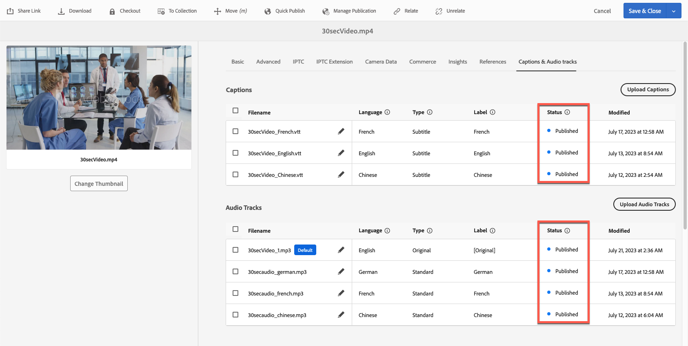
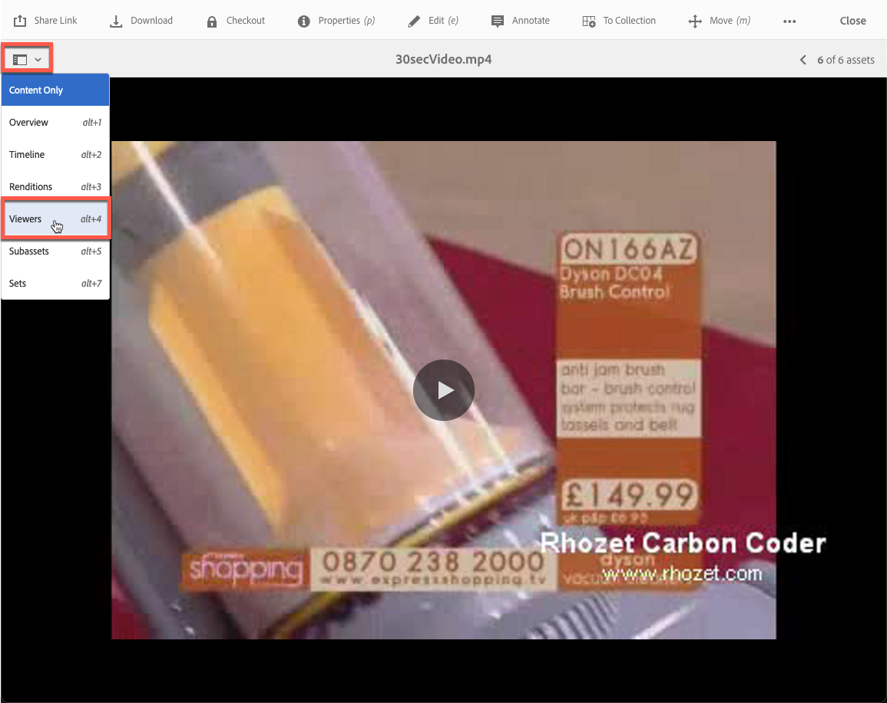

# Vídeo no Dynamic Media {#video}

Esta seção descreve como trabalhar com vídeo no Dynamic Media.

## Início rápido: vídeos {#quick-start-videos}

A descrição do fluxo de trabalho passo a passo a seguir foi projetada para ajudar você a começar a usar rapidamente os Conjuntos de vídeos adaptados no Dynamic Media. Após cada etapa, há referências cruzadas para cabeçalhos de tópicos onde você pode encontrar mais informações.

>[!IMPORTANT]
>
>Verifique se o administrador do Adobe Experience Manager ativou e configurou o Dynamic Media Cloud Services no modo Dynamic Media - Scene7 ou no modo Hybrid antes de trabalhar com vídeo no Dynamic Media.
>
>* Consulte [Configurar Dynamic Media Cloud Services](/help/assets/config-dms7.md#configuring-dynamic-media-cloud-services) em Configuração do Dynamic Media - Modo Scene7 e [Solução de problemas do Dynamic Media - Modo Scene7](/help/assets/troubleshoot-dms7.md).
>
>* Consulte [Configurar o Dynamic Media Cloud Services](/help/assets/config-dynamic.md#configuring-dynamic-media-cloud-services) em Configuração do Dynamic Media - Modo híbrido.
>
>Problema atual conhecido de reprodução de vídeo na Dynamic Media *somente no Experience Manager 6.5.9.0*:
>
>* Se um vídeo publicado for atualizado, ele deverá ser publicado novamente para refletir as alterações no delivery.
>

1. **Carregue seus vídeos do Dynamic Media** fazendo o seguinte:

   * Crie seu próprio perfil de codificação de vídeo. Ou você pode simplesmente usar o perfil _Codificação de vídeo adaptável_ predefinido que vem com o Dynamic Media.

      * [Criar um perfil de codificação de vídeo](/help/assets/video-profiles.md#creating-a-video-encoding-profile-for-adaptive-streaming).
      * A resolução máxima de codificação de vídeo de saída é 8.192 × 4.320 ou 4.320 × 8.192.md.
      * Saiba mais sobre as [Práticas recomendadas para codificação de vídeo](#best-practices-for-encoding-videos).

   * Associe o perfil de processamento de vídeo a uma ou mais pastas nas quais você fará upload dos vídeos de origem primária.

      * [Aplicar um perfil de vídeo às pastas](/help/assets/video-profiles.md#applying-a-video-profile-to-folders).
      * Saiba mais sobre as [Práticas recomendadas para organizar ativos digitais para usar perfis de processamento](/help/assets/organize-assets.md).
      * Saiba mais sobre [Organizar ativos digitais](/help/assets/organize-assets.md).

   * Faça upload dos vídeos de origem principal para as pastas. Quando você adiciona vídeos à pasta, eles são codificados de acordo com o perfil de processamento de vídeo atribuído à pasta.

      * O Dynamic Media é compatível principalmente com vídeos de formato curto com duração máxima de 30 minutos e resolução mínima superior a 25 × 25.
      * A resolução máxima de vídeo de entrada suportada é de 16.384 × 16.384.
      * Você pode carregar arquivos de vídeo de até 15 GB cada.
      * [Carregue seus vídeos](/help/assets/managing-video-assets.md#upload-and-preview-video-assets).
      * Saiba mais sobre [Formatos de arquivo de entrada com suporte](/help/assets/assets-formats.md#supported-multimedia-formats).

   * Monitore o andamento da [codificação de vídeo](#monitoring-video-encoding-and-youtube-publishing-progress) na exibição do ativo ou do fluxo de trabalho.

1. **Gerencie seus vídeos do Dynamic Media** seguindo um destes procedimentos:

   * Organize, navegue e pesquise ativos de vídeo

      * [Organizar ativos digitais](/help/assets/organize-assets.md)
Saiba mais sobre as [Práticas recomendadas para organizar ativos digitais para usar perfis de processamento](organize-assets.md)

      * [Pesquisar ativos de vídeo](search-assets.md#custompredicates) ou [Pesquisar ativos](/help/assets/search-assets.md)

   * Pré-visualizar e publicar ativos de vídeo

      * Visualize o vídeo de origem e as representações codificadas do vídeo, juntamente com suas miniaturas associadas:
        [Visualizar vídeos](managing-video-assets.md#upload-and-preview-video-assets) ou [Visualizar ativos](previewing-assets.md)
        [Exibir representações de vídeo](video-renditions.md)
        [Gerenciar representações de vídeo](manage-assets.md#managing-renditions)

      * [Gerenciar predefinições do visualizador](managing-viewer-presets.md)
      * [Publicar ativos](publishing-dynamicmedia-assets.md)

   * Trabalhar com metadados de vídeo

      * Visualize as propriedades de uma representação de vídeo codificada, como taxa de quadros, taxa de bits de áudio e vídeo e codec:
        [Exibir propriedades de representação de vídeo](video-renditions.md)

      * Edite as propriedades do vídeo, como título, descrição, tags e campos de metadados personalizados:
        [Editar propriedades do vídeo](manage-assets.md#editing-properties)

      * [Gerenciar metadados para ativos digitais](metadata.md)
      * [Esquemas de metadados](metadata-schemas.md)

   * Revise, aprove e anote vídeos e mantenha o controle total de versão

      * [Anotar vídeos](managing-video-assets.md#annotate-video-assets) ou [Anotar ativos](manage-assets.md#annotating)

      * [Criar uma versão](manage-assets.md#asset-versioning)
      * [Aplicar fluxos de trabalho a ativos](assets-workflow.md) ou consultar [Iniciar um fluxo de trabalho em um ativo](manage-assets.md#starting-a-workflow-on-an-asset)

      * [Revisar ativos da pasta](bulk-approval.md)
      * [Projetos](../sites-authoring/projects.md)

1. **Publique seus vídeos do Dynamic Media** seguindo um destes procedimentos:

   * Se você usa o Adobe Experience Manager como seu sistema de gerenciamento de conteúdo na Web, é possível adicionar vídeos diretamente às suas páginas da Web.

      * [Adicionar vídeos às suas páginas da Web](adding-dynamic-media-assets-to-pages.md).

   * Se você estiver usando um sistema de gerenciamento de conteúdo da Web de terceiros, é possível vincular ou incorporar vídeos às suas páginas da Web.

      * Integrar vídeo usando o URL:
        [Vincular URLs ao aplicativo Web](linking-urls-to-yourwebapplication.md).

      * Integrar vídeo usando o código integrado em uma página da Web:
        [Incorporar o visualizador de vídeo em uma página da Web](embed-code.md).

   * [Gerar relatórios de vídeo](#viewing-video-reports).

   * [Adicionar legendas ao vídeo](#adding-captions-to-video).

## Trabalhar com vídeo no Dynamic Media {#working-with-video-in-dynamic-media}

O Vídeo no Dynamic Media é uma solução completa que facilita a publicação de vídeo adaptável de alta qualidade para transmissão em várias telas, incluindo dispositivos móveis para desktop, iOS, Android™, BlackBerry® e Windows. Um Conjunto de vídeos adaptados agrupa versões do mesmo vídeo codificadas em taxas de bits e formatos diferentes, como 400 kbps, 800 kbps e 1000 kbps. O computador desktop ou dispositivo móvel detecta a largura de banda disponível.

Por exemplo, em um dispositivo móvel iOS, ele detecta uma largura de banda como 3G, 4G ou Wi-Fi. Em seguida, ele seleciona automaticamente o vídeo codificado correto entre as várias taxas de bits de vídeo no Conjunto de vídeos adaptados. O vídeo é transmitido para desktops, dispositivos móveis ou tablets.

Além disso, a qualidade do vídeo é comutada automaticamente de forma dinâmica se as condições da rede forem alteradas no desktop ou no dispositivo móvel. Além disso, se um cliente entrar no modo de tela cheia em um desktop, o Conjunto de vídeos adaptados responderá usando uma resolução melhor, melhorando a experiência de visualização do cliente. Os conjuntos de vídeos adaptados garantem a reprodução ideal para clientes que visualizam vídeos do Dynamic Media em várias telas e dispositivos.

A lógica que um reprodutor de vídeo usa para determinar qual vídeo codificado reproduzir ou selecionar durante a reprodução se baseia no seguinte algoritmo:

1. O reprodutor de vídeo carrega o fragmento de vídeo inicial com base na taxa de bits mais próxima do valor definido como &quot;taxa de bits inicial&quot; no próprio reprodutor.
1. O reprodutor de vídeo muda com base nas alterações na velocidade da largura de banda, usando os seguintes critérios:

   1. O player escolhe o fluxo de largura de banda mais alto abaixo ou igual à largura de banda estimada.
   1. O player considera apenas 80% da largura de banda disponível. No entanto, se estiver mudando, é mais conservador em apenas 70% para evitar superestimar e voltar imediatamente.

Para obter informações técnicas detalhadas sobre o algoritmo, consulte [https://android.googlesource.com/platform/frameworks/av/+/master/media/libstagefright/httplive/LiveSession.cpp](https://android.googlesource.com/platform/frameworks/av/+/master/media/libstagefright/httplive/LiveSession.cpp)

Para gerenciar vídeos únicos e Conjuntos de vídeos adaptados, o seguinte é suportado:

* Carregue vídeos em vários formatos compatíveis e codifique-os em MP4 H.264 para reprodução em várias telas. Você pode usar predefinições predefinidas de vídeos adaptáveis, predefinições de codificação de vídeos únicos ou personalizar sua própria codificação para controlar a qualidade e o tamanho do vídeo.

   * Quando um Conjunto de vídeos adaptados é gerado, ele inclui vídeos MP4.
   * **Observação**: vídeos primários/de origem não são adicionados a um Conjunto de Vídeos Adaptáveis.

* Legendagem de vídeo em todos os visualizadores de vídeo do HTML5.
* Organize, navegue e pesquise vídeos com suporte completo a metadados para obter um gerenciamento eficiente dos ativos de vídeo.
* Forneça Conjuntos de vídeos adaptados para a Web e para desktops e dispositivos móveis, incluindo iPhone, iPad, Android™, BlackBerry® e Windows phone.

O streaming de vídeo adaptável é suportado em várias plataformas iOS. Consulte o [Guia de Referência de Visualizadores do Dynamic Media](https://experienceleague.adobe.com/en/docs/dynamic-media-developer-resources/library/viewers-aem-assets-dmc/video/c-html5-video-reference#video).

O Dynamic Media suporta reprodução de vídeo móvel para vídeo MP4 H.264. <!-- LINK IS 404 WITH NO SUITABLE REPLACEMENT You can find BlackBerry&reg; devices that support this video format at the following: [Supported video formats on BlackBerry&reg;](https://support.blackberry.com/kb/articleDetail?ArticleNumber=000005482). -->

Você pode encontrar dispositivos Windows compatíveis com este formato de vídeo em: [Codecs de mídia compatíveis para Windows Phone 8](https://learn.microsoft.com/en-us/windows/uwp/audio-video-camera/supported-codecs)

* Reproduza o vídeo usando as Predefinições do visualizador de vídeo do Dynamic Media, incluindo o seguinte:

   * Visualizadores de vídeo únicos.
   * Visualizadores de mídia mista que combinam conteúdo de vídeo e imagem.

* Configure players de vídeo para atender às suas necessidades de marca.
* Integre vídeo ao seu site, site móvel ou aplicativo móvel com um URL simples ou código integrado.

<!-- See [Dynamic video playback](https://s7d9.scene7.com/s7/uvideo.jsp?asset=GeoRetail/Mop_AVS&config=GeoRetail/Universal_Video1&stageSize=640,480) sample. -->

Consulte também [Visualizadores para Experience Manager Assets e Dynamic Media Classic](https://experienceleague.adobe.com/en/docs/dynamic-media-developer-resources/library/viewers-aem-assets-dmc/c-html5-s7-aem-asset-viewers#viewers-aem-assets-dmc) e [Visualizadores somente para ativos do Experience Manager](https://experienceleague.adobe.com/en/docs/dynamic-media-developer-resources/library/viewers-for-aem-assets-only/c-html5-aem-asset-viewers#viewers-for-aem-assets-only).

## Prática recomendada: uso do visualizador de vídeo HTML5 {#best-practice-using-the-html-video-viewer}

As predefinições do visualizador de vídeo do Dynamic Media HTML5 são players de vídeo robustos. Você pode usá-los para evitar muitos problemas comuns associados à reprodução de vídeo HTML5. E, problemas associados a dispositivos móveis, como falta de entrega de transmissão adaptável da taxa de bits e alcance limitado do navegador do desktop.

No lado do design do reprodutor, é possível projetar a funcionalidade dele usando as ferramentas padrão de desenvolvimento na Web. Por exemplo, você pode projetar os botões, os controles e o plano de fundo personalizado da imagem de pôster usando o HTML5 e o CSS para ajudar você a alcançar seus clientes com uma aparência personalizada.

No lado da reprodução do visualizador, ele detecta automaticamente o recurso de vídeo do navegador. Em seguida, ele serve o vídeo usando o HLS (HTTP Live Streaming) ou DASH (Dynamic Adaptive Streaming sobre HTTP), também conhecido como transmissão adaptável de taxa de bits. Ou, se esses métodos de delivery não estiverem presentes, será usado o HTML5 progressive.

Ao combinar em um único player o seguinte:

* A capacidade de projetar os componentes de reprodução usando HTML5 e CSS
* Ter reprodução integrada
* Usar transmissão adaptável e progressiva dependendo da capacidade do navegador

Estenda o alcance do seu conteúdo de mídia avançada para usuários de desktop e dispositivos móveis e garanta uma experiência em vídeo simplificada.

Consulte também [Sobre visualizadores do HTML5](https://experienceleague.adobe.com/en/docs/dynamic-media-developer-resources/library/viewers-for-aem-assets-only/c-html5-aem-asset-viewers#viewers-for-aem-assets-only).

### Reprodução de vídeo em computadores desktop e dispositivos móveis usando o visualizador de vídeo do HTML5 {#playback-of-video-on-desktop-computers-and-mobile-devices-using-the-html-video-viewer}

Para streaming de vídeo adaptável de desktop e móvel, os vídeos usados para a alternância da taxa de bits são baseados em todos os vídeos MP4 no Conjunto de vídeos adaptados.

A reprodução de vídeo ocorre usando DASH ou HLS, ou download progressivo de vídeo. Em versões anteriores do Experience Manager, como 6.0, 6.1 e 6.2, os vídeos eram transmitidos via HTTP.

No Experience Manager 6.3 e posteriores, os vídeos agora são transmitidos em HTTPS (ou seja, DASH ou HLS), pois o URL do serviço de gateway do DM também usa HTTPS. Não há impacto para o cliente nesse comportamento padrão. A transmissão de vídeo sempre ocorre por HTTPS, exceto quando o navegador não oferece suporte a ela. (Consulte a tabela a seguir). Por conseguinte,

* Se você tiver um site HTTPS com transmissão de vídeo HTTPS, a transmissão está boa.
* Se você tiver um site HTTP com transmissão de vídeo HTTPS, a transmissão está boa e não há problemas de conteúdo misto no navegador da Web.

O DASH é o padrão internacional e o HLS é um padrão da Apple. Ambos são usados para transmissão de vídeo adaptável. E ambas as tecnologias ajustam automaticamente a reprodução com base na capacidade de largura de banda da rede. Ele também permite que o cliente &quot;procure&quot; qualquer ponto do vídeo, sem a necessidade de aguardar o download do restante do vídeo.

O vídeo progressivo é fornecido ao baixar e armazenar o vídeo localmente no sistema de desktop de um usuário ou dispositivo móvel.

A tabela a seguir descreve o dispositivo, o navegador e o método de reprodução de vídeos em computadores desktop e dispositivos móveis que usam o visualizador de vídeo do Dynamic Media.

<table>
 <tbody>
  <tr>
   <td><strong>Device</strong></td>
   <td><strong>Navegador</strong></td>
   <td><strong>Modo de reprodução de vídeo</strong></td>
  </tr>
  <tr>
   <td>Desktop</td>
   <td>Internet Explorer 9 e 10</td>
   <td>Download progressivo.</td>
  </tr>
  <tr>
   <td>Desktop</td>
   <td>Internet Explorer 11+</td>
   <td>No Windows 8 e Windows 10 - Force o uso de HTTPS sempre que DASH* ou HLS for solicitado. Limitação conhecida: HTTP no DASH* ou HLS não funciona nesta combinação de navegador/sistema operacional<br /> <br /> No Windows 7 - Download progressivo. Usa lógica padrão para selecionar o protocolo HTTP em comparação com HTTPS.</td>
  </tr>
  <tr>
   <td>Desktop</td>
   <td>Firefox 23-44</td>
   <td>Download progressivo.</td>
  </tr>
  <tr>
   <td>Desktop</td>
   <td>Firefox 45 ou posterior</td>
   <td>Transmissão da taxa de bits adaptável DASH* ou HLS.</td>
  </tr>
  <tr>
   <td>Desktop</td>
   <td>Chrome</td>
   <td>Transmissão da taxa de bits adaptável DASH* ou HLS.</td>
  </tr>
  <tr>
   <td>Desktop</td>
   <td>Safari (Mac)</td>
   <td>HLS adaptive bitrate streaming.</td>
  </tr>
  <tr>
   <td>Dispositivos móveis</td>
   <td>Chrome (Android™ 6 ou anterior)</td>
   <td>Download progressivo.</td>
  </tr>
  <tr>
   <td>Dispositivos móveis</td>
   <td>Chrome (Android™ 7 ou posterior)</td>
   <td>Transmissão da taxa de bits adaptável DASH* ou HLS.</td>
  </tr>
  <tr>
   <td>Dispositivos móveis</td>
   <td>Android™ (navegador padrão)</td>
   <td>Download progressivo.</td>
  </tr>
  <tr>
   <td>Dispositivos móveis</td>
   <td>Safari (iOS)</td>
   <td>HLS adaptive bitrate streaming.</td>
  </tr>
  <tr>
   <td>Dispositivos móveis</td>
   <td>Chrome (iOS)</td>
   <td>HLS adaptive bitrate streaming.</td>
  </tr>
  <tr>
   <td>Dispositivos móveis</td>
   <td>BlackBerry®</td>
   <td>Transmissão da taxa de bits adaptável DASH* ou HLS./td&gt;
  </tr>
 </tbody>
</table>

## Arquitetura da solução de vídeo Dynamic Media {#architecture-of-dynamic-media-video-solution}

O gráfico a seguir mostra o fluxo de trabalho geral de criação de vídeos que são carregados e codificados pelo DMGateway (no modo híbrido do Dynamic Media) e disponibilizados para consumo público.


## Arquitetura de publicação híbrida para vídeos {#hybrid-publishing-architecture-for-videos}


## Práticas recomendadas para codificação de vídeos {#best-practices-for-encoding-videos}

O fluxo de trabalho **Codificação de vídeo do Dynamic Media** codifica o vídeo se você tiver habilitado o Dynamic Media e configurado os serviços da nuvem de vídeo. Esse fluxo de trabalho captura o histórico do processo de fluxo de trabalho e as informações de falha. Se você tiver habilitado o Dynamic Media e configurado os serviços da nuvem de vídeo, o fluxo de trabalho **[!UICONTROL Codificação de vídeo do Dynamic Media]** será aplicado automaticamente ao carregar um vídeo. (Se você não estiver usando o Dynamic Media, o fluxo de trabalho **[!UICONTROL Ativo de atualização do DAM]** entrará em vigor.)

<!-- DEAD The following are best-practice tips for encoding source video files.

For advice about video encoding, see [Video Encoding Basics](https://www.adobe.com/go/learn_s7_encoding_en).

* [Streaming 101: The Basics — Codecs, Bandwidth, Data Rate, and Resolution](https://www.adobe.com/go/learn_s7_streaming101_en). -->

### Arquivos de vídeo do Source {#source-video-files}

Ao codificar um arquivo de vídeo, use um arquivo de vídeo de origem com a mais alta qualidade possível. Evite usar arquivos de vídeo codificados anteriormente, pois esses arquivos já estão compactados, e codificações adicionais criam um vídeo de qualidade inferior.

* O Dynamic Media é compatível principalmente com vídeos de formato curto com duração máxima de 30 minutos e resolução mínima superior a 25 × 25.
* Você pode fazer upload de arquivos de vídeo de origem principal de até 15 GB cada.

A tabela a seguir descreve o tamanho recomendado, a taxa de proporção e a taxa de bits mínima que seus arquivos de vídeo de origem devem ter antes de serem codificados:

| Tamanho | Taxa de proporção | Taxa de bits mínima |
|--- |--- |--- |
| 1024 × 768 | 4:3 | 4500 kbps para a maioria dos vídeos. |
| 1280 × 720 | 16:9 | 3000 - 6000 kbps, dependendo da quantidade de movimento no vídeo. |
| 1920 × 1080 | 16:9 | 6000 - 8000 kbps, dependendo da quantidade de movimento no vídeo. |

### Obter os metadados de um arquivo {#obtaining-a-file-s-metadata}

Você pode obter os metadados de um arquivo visualizando os metadados usando uma ferramenta de edição de vídeo ou um aplicativo projetado para obter metadados. A seguir estão as instruções para usar o MediaInfo, um aplicativo de terceiros, para obter os metadados de um arquivo de vídeo:

1. Vá para [Download de MediaInfo](https://mediaarea.net/en/MediaInfo/Download).
1. Selecione e baixe o instalador para a versão da GUI e siga as instruções de instalação.
1. Após a instalação, clique com o botão direito no arquivo de vídeo (somente Windows) e selecione MediaInfo, ou abra MediaInfo e arraste o arquivo de vídeo para o aplicativo. Você verá todos os metadados associados ao arquivo de vídeo, incluindo largura, altura e fps.

### Taxa de proporção {#aspect-ratio}

Ao selecionar ou criar uma predefinição de codificação de vídeo para o arquivo de vídeo principal, verifique se a proporção da predefinição corresponde à do arquivo de vídeo principal. A taxa de proporção é a relação entre a largura e a altura do vídeo.

Para determinar a proporção de um arquivo de vídeo, obtenha os metadados do arquivo e anote a largura e a altura do arquivo. Consulte Obter os metadados de um arquivo acima. Em seguida, use esta fórmula para determinar a proporção:

largura/altura = taxa de proporção

A tabela a seguir descreve como os resultados da fórmula são convertidos em opções comuns de taxa de proporção:

| Resultado da fórmula | Taxa de proporção |
|--- |--- |
| 1,33 | 4:3 |
| 0,75 | 3:4 |
| 1,78 | 16:9 |
| 0,56 | 9:16 |

Por exemplo, um vídeo com 1440 de largura × 1080 de altura tem uma proporção largura/altura de 1440/1080 ou 1,33. Nesse caso, você escolhe uma predefinição de codificação de vídeo com uma proporção 4:3 para codificar o arquivo de vídeo.

### Taxa de bits {#bitrate}

Uma taxa de bits é a quantidade de dados codificada para compor um segundo da reprodução de vídeo. A taxa de bits é medida em kilobits por segundo (Kbps).

>[!NOTE]
>
>Como todos os codecs usam compactação com perdas, a taxa de bits é o fator mais importante na qualidade do vídeo. Com a compactação com perdas, quanto mais você compacta um arquivo de vídeo, mais a qualidade é degradada. Por isso, todas as outras características são iguais (resolução, taxa de quadros e codec), quanto menor a taxa de bits, menor a qualidade do arquivo compactado.

Ao selecionar uma codificação de taxa de bits, há dois tipos que você pode escolher:

* **[!UICONTROL Codificação de taxa de bits constante]** (CBR) - Durante a codificação do CBR, a taxa de bits ou o número de bits por segundo é mantido o mesmo durante todo o processo de codificação. A codificação CBR persiste na taxa de definição de dados para sua configuração ao longo de todo o vídeo. Além disso, a codificação CBR não otimiza os arquivos de mídia para melhorar a qualidade, mas economiza espaço de armazenamento.
Use o CBR se o vídeo tiver um nível de movimento semelhante em todo o vídeo. O CBR é usado com mais frequência para streaming de conteúdo de vídeo. Consulte também [Usar parâmetros de codificação de vídeo personalizados](/help/assets/video-profiles.md#using-custom-added-video-encoding-parameters).

* **[!UICONTROL Codificação de taxa de bits variável]** (VBR) - A codificação de VBR ajusta a taxa de dados para baixo e para o limite superior definido, com base nos dados exigidos pelo compactador. Essa funcionalidade significa que, durante um processo de codificação de VBR, a taxa de bits do arquivo de mídia aumenta ou diminui dinamicamente, dependendo das necessidades de taxa de bits do arquivo de mídia.
O VBR demora mais para codificar, mas produz os resultados mais favoráveis; a qualidade do arquivo de mídia é superior. O VBR é usado com mais frequência para entrega progressiva de conteúdo de vídeo http.

Quando você usa VBR versus CRB?
Ao selecionar VBR versus CBR, é quase sempre recomendável usar VBR para seus arquivos de mídia. O VBR fornece arquivos de maior qualidade a taxas de bits competitivas. Ao usar o VBR, certifique-se de usar o com codificação em dois passos e defina a taxa de bits máxima para 1,5 vez a taxa de bits do vídeo de destino.

Ao escolher uma predefinição de codificação de vídeo, lembre-se da velocidade de conexão do usuário final de destino. Escolha uma predefinição com uma taxa de dados que seja 80% dessa velocidade. Por exemplo, se a velocidade de conexão do usuário final de destino for 1000 Kbps, a melhor predefinição é aquela com uma taxa de dados de vídeo de 800 Kbps.

Esta tabela descreve a taxa de dados de velocidades de conexão típicas.

| Velocidade (Kbps) | Tipo de conexão |
|--- |--- |
| 256 | Conexão dial-up. |
| 800 | Conexão móvel típica. Para essa conexão, direcione uma taxa de dados na faixa de 400 a no máximo 800 para experiências 3G. |
| 2000 | Conexão típica de desktop de banda larga. Para essa conexão, direcione uma taxa de dados na faixa de 800-2000 Kbps, com a média da maioria dos targets de 1200-1500 Kbps. |
| 5000 | Conexão típica de alta banda larga. A codificação nesse intervalo superior não é recomendada porque a entrega de vídeo nessa velocidade não está disponível para a maioria dos consumidores. |

### Resolução {#resolution}

**Resolução** descreve a altura e a largura de um arquivo de vídeo em pixels. A maioria dos vídeos de origem é armazenada em alta resolução (por exemplo, 1920 × 1080). Para fins de transmissão, o vídeo de origem é compactado para uma resolução menor (640 × 480 ou menor).

Resolução e taxa de dados são dois fatores vinculados integralmente que determinam a qualidade do vídeo. Para manter a mesma qualidade de vídeo, quanto maior o número de pixels em um arquivo de vídeo (quanto maior a resolução), maior deverá ser a taxa de dados. Por exemplo, considere o número de pixels por quadro em um arquivo de vídeo de resolução 320 × 240 e resolução 640 × 480:

| Resolução | Pixels por quadro |
|--- |--- |
| 320 × 240 | 76.800 |
| 640 × 480 | 307.200 |

O arquivo de 640 × 480 tem quatro vezes mais pixels por quadro. Para obter a mesma taxa de dados para essas duas resoluções de exemplo, aplique a compactação quatro vezes maior ao arquivo 640 × 480, o que pode reduzir a qualidade do vídeo. Portanto, uma taxa de dados de vídeo de 250 Kbps produz uma visualização de alta qualidade com resolução de 320 × 240, mas não com resolução de 640 × 480.

Em geral, quanto maior a taxa de dados usada, melhor a aparência do vídeo e maior a resolução usada, maior a taxa de dados que você deve manter a qualidade da visualização (em comparação com resoluções mais baixas).

Como a resolução e a taxa de dados são vinculadas, você tem duas opções ao codificar vídeos:

* Escolha uma taxa de dados e, em seguida, codifique na resolução mais alta que tenha uma boa aparência com a taxa de dados escolhida.
* Escolha uma resolução e codifique na taxa de dados necessária para obter um vídeo de alta qualidade na resolução escolhida.

Ao escolher (ou criar) uma predefinição de codificação de vídeo para o arquivo de vídeo de origem principal, use essa tabela para definir a resolução correta:

| Resolução | Altura (pixels) | Tamanho da tela |
|--- |--- |--- |
| 240p | 240 | Tela pequena |
| 300p | 300 | Tela pequena normalmente para dispositivos móveis |
| 360p | 360 | Tela pequena |
| 480p | 480 | Tela do Medium |
| 720p | 720 | Tela grande |
| 1080p | 1080 | Tela grande de alta definição |

A resolução máxima de vídeo de entrada suportada é de 16.384 × 16.384. A resolução máxima de codificação de vídeo de saída é 8,192 × 4,320 ou 4,320 × 8,192.

### Fps (Quadros por segundo) {#fps-frames-per-second}

Nos Estados Unidos e no Japão, a maioria dos vídeos é gravada a 29,97 quadros por segundo (fps). Na Europa, o padrão é de 25 qps. O filme, no entanto, é tipicamente filmado a 24 fps.

Escolha uma predefinição de codificação de vídeo que corresponda à taxa de fps do arquivo de vídeo de origem principal. Por exemplo, se o vídeo de origem principal tiver 25 qps, escolha uma predefinição de codificação com 25 qps. Por padrão, toda codificação personalizada usa o fps do arquivo de vídeo de origem principal. Por isso, não é necessário especificar explicitamente a configuração fps ao criar uma predefinição de codificação de vídeo.

### Dimensões de codificação de vídeo {#video-encoding-dimensions}

Para obter resultados ideais, selecione dimensões de codificação de forma que o vídeo de origem seja um múltiplo inteiro de todos os vídeos codificados.

Para calcular essa proporção, divida a largura da origem pela largura codificada para obter a proporção da largura. Em seguida, divida a altura da origem pela altura codificada para obter a proporção da altura.

Se a proporção resultante for um inteiro, significa que o vídeo está dimensionado de maneira ideal. Se a proporção resultante não for um número inteiro, ela afetará a qualidade do vídeo, deixando artefatos de pixel restantes na exibição. Esse efeito é mais perceptível quando o vídeo tem texto.

Por exemplo, suponha que a fonte de vídeo seja 1920 × 1080. Na tabela a seguir, os três vídeos codificados fornecem as configurações de codificação ideais para usar.

| Tipo de vídeo | Largura × altura | Proporção de largura | Taxa de altura |
|--- |--- |--- |--- |
| Origem | 1920 × 1080 | 1 | 1 |
| Codificado | 960 × 540 | 2 | 2 |
| Codificado | 640 × 360 | 3 | 3 |
| Codificado | 480 × 270 | 4 | 4 |

### Formato de arquivo de vídeo codificado {#encoded-video-file-format}

O Dynamic Media recomenda o uso de predefinições de codificação de vídeo MP4 H.264. Como os arquivos MP4 usam o codec de vídeo H.264, ele fornece vídeo de alta qualidade, mas em um tamanho de arquivo compactado.

## Exibir relatórios de vídeo {#viewing-video-reports}

>[!NOTE]
>
>Os relatórios de vídeo só estão disponíveis quando você executa o Dynamic Media - Modo híbrido.

Os Relatórios de vídeo exibem várias métricas agregadas em um período especificado para ajudar você a monitorar se os vídeos individuais e agregados *publicados* estão apresentando o desempenho esperado. Os dados das principais métricas a seguir são agregados para todos os vídeos publicados em todo o site:

* Vídeos iniciados
* Taxa de Conclusão
* Tempo médio em vídeo
* Tempo total em vídeo
* Vídeos por visita

Uma tabela de todos os vídeos *publicados* também está listada para que você possa acompanhar os vídeos mais vistos no seu site com base no total de vídeos iniciados.

Ao selecionar um nome de vídeo na lista, ele mostra o relatório de retenção de público-alvo (drop-off) do vídeo no formato de um gráfico de linhas. O gráfico exibe o número de visualizações em um determinado momento durante a reprodução do vídeo. Ao reproduzir o vídeo, a barra vertical é rastreada em sincronização com o indicador de tempo no reprodutor. Quedas nos dados do gráfico de linhas indicam onde o público-alvo cai de desinteresse.

Se o vídeo tiver sido codificado fora do Adobe Experience Manager Dynamic Media, o gráfico de retenção de público-alvo (drop-off) e os dados de Porcentagem de reprodução na tabela não estarão disponíveis.

Consulte também [Configurar serviços em nuvem do Dynamic Media](/help/assets/config-dynamic.md).

>[!NOTE]
>
>Os dados de rastreamento e relatórios são baseados exclusivamente no uso do próprio player de vídeo do Dynamic Media e da predefinição do player de vídeo associada. Dessa forma, você não pode rastrear e relatar vídeos que são reproduzidos por outros players de vídeo.

Por padrão, na primeira vez que você insere Relatórios de vídeo, o relatório exibe os dados de vídeo começando no primeiro dia do mês atual e termina com a data do mês atual. No entanto, é possível substituir o intervalo de datas padrão especificando seu próprio intervalo de datas. Na próxima vez que você inserir Relatórios de vídeo, o intervalo de datas especificado será usado.

Para que os relatórios de vídeo funcionem corretamente, uma ID do conjunto de relatórios é criada automaticamente quando o Dynamic Media Cloud Services é configurado. Ao mesmo tempo, a ID do conjunto de relatórios é enviada para o servidor de publicação para que fique disponível para o recurso Copiar URL ao visualizar ativos. No entanto, essa funcionalidade exige que o servidor de publicação já esteja configurado. Se o servidor de publicação não estiver configurado, ainda será possível publicar para ver o relatório de vídeo. No entanto, você deve retornar à Configuração da Nuvem do Dynamic Media e selecionar **[!UICONTROL OK]**.

**Para exibir relatórios de vídeo:**

1. No canto superior esquerdo do Experience Manager, selecione o logotipo do Experience Manager e, no painel à esquerda, clique em **[!UICONTROL Ferramentas]** (ícone de martelo) > **[!UICONTROL Assets]** > **[!UICONTROL Relatórios de vídeo]**.
1. Na página Relatórios de vídeo, siga um destes procedimentos:

   * Próximo ao canto superior direito, selecione o ícone **Atualizar relatório de vídeo**.
Use Atualizar somente se a data final do relatório for o dia atual. Isso garante que você veja o rastreamento de vídeo que ocorreu desde a última vez que executou o relatório.

   * Próximo ao canto superior direito, selecione o ícone **Seletor de datas**.
Especifique o intervalo de datas inicial e final para o qual deseja dados de vídeo e selecione **[!UICONTROL Executar Relatório]**.

   A caixa de grupo Métricas principais identifica várias medidas agregadas para todos os vídeos *publicados* do site.

1. Na tabela que lista os principais vídeos publicados, selecione um nome de vídeo para reproduzir o vídeo e também veja o relatório de retenção de público-alvo (drop-off) do vídeo.

### Exibir relatórios de vídeo com base em um visualizador de vídeo criado por você usando a SDK do visualizador do Dynamic Media HTML5 {#viewing-video-reports-based-on-a-video-viewer-that-you-created-using-the-scene-hmtl-viewer-sdk}

Se você usar um visualizador de vídeo pronto para uso fornecido pelo Dynamic Media ou se criar uma predefinição do visualizador personalizado com base em um visualizador de vídeo pronto para uso, nenhuma etapa adicional será necessária para visualizar os Relatórios de vídeo. No entanto, se você tiver criado seu próprio visualizador de vídeo com base na API do SDK do visualizador do HTML5, use as seguintes etapas para garantir que seu visualizador de vídeo esteja enviando eventos de rastreamento para os Relatórios de vídeo do Dynamic Media.

Use o [Guia de Referência de Visualizadores do Adobe Dynamic Media](https://experienceleague.adobe.com/en/docs/dynamic-media-developer-resources) e a [API do SDK do Visualizador do HTML5](https://s7d1.scene7.com/s7sdk/3.10/docs/jsdoc/index.html) para criar seus próprios visualizadores de vídeo.

**Para exibir relatórios de vídeo com base em um visualizador de vídeo criado usando a SDK do Visualizador do Dynamic Media HTML5:**

1. Navegue até qualquer ativo de vídeo publicado.
1. Próximo ao canto superior esquerdo da página do ativo, na lista suspensa, selecione **[!UICONTROL Visualizadores]**.
1. Selecione qualquer predefinição do visualizador de vídeo e copie o código incorporado.
1. No código incorporado, localize a linha com o seguinte:

   `videoViewer.setParam("config2", "<value>");`

   O parâmetro `config2` habilita o rastreamento em Visualizadores HTML5. Também é uma predefinição específica da empresa que contém as informações de configuração para relatórios de vídeo e configurações do Adobe Analytics para clientes específicos.

   O valor correto do parâmetro config2 foi encontrado tanto no **[!UICONTROL Código Incorporado]** quanto na função de cópia **[!UICONTROL URL]**. Na URL do comando de cópia **[!UICONTROL URL]**, procure pelo parâmetro `&config2=<value>`. O valor é quase sempre `companypreset`, mas em algumas instâncias também pode ser `companypreset-1`, `companypreset-2` e assim por diante.

1. Em seu código de visualizador de vídeo personalizado, adicione o AppMeasurementBridge .jsp à página do visualizador fazendo o seguinte:

   * Primeiro, determine se você precisa do parâmetro `&preset`.

     Se o parâmetro `config2` for `companypreset`, você *não* precisará de `&preset=parameter`.

     Se `config2` for qualquer outra coisa, defina o parâmetro predefinido como igual ao parâmetro `config2`. Por exemplo, se `config2=companypreset-2`, adicione `&param2=companypreset-2` ao URL AppMeasurementBridge.jsp.

   * Em seguida, adicione o script AppMeasurementBridge.jsp:

     `<script language="javascript" type="text/javascript" src="https://s7d1.scene7.com/s7viewers/AppMeasurementBridge.jsp?company=robindallas&preset=companypreset-2"></script>`

1. Crie o componente TrackingManager fazendo o seguinte:

   * Depois de chamar `s7sdk.Util.init();`, crie uma instância de TrackingManager para rastrear eventos adicionando o seguinte:

     `var trackingManager = new s7sdk.TrackingManager();`

   * Conecte os componentes ao TrackingManager fazendo o seguinte:

     No manipulador de eventos `s7sdk.Event.SDK_READY`, anexe o componente que você deseja rastrear ao TrackingManager.

     Por exemplo, se o componente for `videoPlayer`, adicione

     `trackingManager.attach(videoPlayer);`

     para anexar o componente ao trackingManager. Para rastrear vários visualizadores em uma página, use vários componentes do gerenciador de rastreamento.

   * Crie o objeto AppMeasurementBridge adicionando o seguinte:

     ```
     var appMeasurementBridge = new AppMeasurementBridge(); appMeasurementBridge.setVideoPlayer(videoPlayer);
     ```

   * Adicione a função de rastreamento ao adicionar o seguinte:

     ```
     trackingManager.setCallback(appMeasurementBridge.track, 
      appMeasurementBridge);
     ```

   O objeto appMeasurementBridge tem uma função de rastreamento integrada. No entanto, você pode fornecer o seu próprio para oferecer suporte a vários sistemas de rastreamento ou outras funcionalidades.

<!--    For more information, see *Using the TrackingManager Component* in the *Scene7 HTML5 Viewer SDK User Guide* available for download from [Adobe Developer Connection](https://help.adobe.com/en_US/scene7/using/WSef8d5860223939e2-43dedf7012b792fc1d5-8000.html). -->


## Sobre o suporte a várias legendas e faixas de áudio para vídeos no Dynamic Media{#about-msma}

Com o recurso de várias legendas e faixas de áudio no Dynamic Media, é possível adicionar facilmente várias legendas e faixas de áudio a um vídeo principal. Esse recurso significa que os vídeos estão acessíveis a um público-alvo global. Você pode personalizar um único vídeo principal publicado para um público-alvo global em vários idiomas e seguir as diretrizes de acessibilidade para diferentes regiões geográficas. Os autores também podem gerenciar as legendas e faixas de áudio em uma única guia na interface do usuário do.


Alguns casos de uso a serem considerados para adicionar várias legendas e faixas de áudio ao vídeo principal incluem:

| Tipo | Caso de uso |
|--- |--- |
| **Legendas** | Suporte a vários idiomas |
|  | Texto descritivo para acessibilidade |
| **Faixas de áudio** | Suporte a vários idiomas |
|  | Faixas de comentários |
|  | Áudio descritivo |

Todos os [formatos de vídeo com suporte no Dynamic Media](/help/assets/assets-formats.md) e todos os visualizadores de vídeo do Dynamic Media, exceto o visualizador do *Video_360* do Dynamic Media, têm suporte para uso com várias legendas e faixas de áudio.

O recurso de múltiplas legendas e faixas de áudio está disponível para sua conta do Dynamic Media por meio de um botão de recurso que deve ser ativado pelo Suporte ao cliente da Adobe.

### Adicionar várias legendas e faixas de áudio ao seu vídeo {#add-msma}

Antes de adicionar várias legendas e faixas de áudio ao vídeo, verifique se você já tem o seguinte no local:

* O Dynamic Media é configurado em um ambiente AEM.
* Um [perfil de Vídeo do Dynamic Media é aplicado à pasta em que seus vídeos são assimilados](/help/assets/video-profiles.md#applying-a-video-profile-to-folders).

Legendas e legendas adicionadas são compatíveis com os formatos WebVTT e Adobe `.vtt`. E os arquivos de trilha de áudio adicionados são suportados com o formato MP3.

>[!IMPORTANT]
>
>Qualquer vídeo que você tenha carregado *antes* de habilitar o suporte a várias legendas e faixas de áudio na sua conta do Dynamic Media, [deve ser reprocessado](/help/assets/processing-profiles.md#reprocessing-assets). Essa etapa de reprocessamento de vídeo é necessária para que o recurso de várias legendas e faixas de áudio esteja disponível para eles. Os URLs do vídeo continuam funcionando e sendo reproduzidos como de costume, após o reprocessamento.

**Para adicionar várias legendas e faixas de áudio ao seu vídeo:**

1. [Carregue seu vídeo principal em uma pasta](/help/assets/managing-video-assets.md#upload-and-preview-video-assets) que já tenha um perfil de vídeo atribuído a ela.
1. Navegue até o ativo de vídeo carregado que você deseja adicionar várias legendas e faixas de áudio.
1. No modo de seleção de ativos, na Exibição em lista ou na Exibição de cartão, selecione o ativo de vídeo.
1. Na barra de ferramentas, selecione o ícone Propriedades (um círculo com um &quot;i&quot;).
   *Ativo de vídeo selecionado no Modo de Exibição de Cartão.*
1. Na página Propriedades do vídeo, selecione a guia **[!UICONTROL Legendas e faixas de áudio]**.

   >[!TIP]
   >Se você não vir a guia **[!UICONTROL Legendas e faixas de áudio]**, isso significa uma destas duas coisas:
   >
   >* A pasta em que o vídeo selecionado reside não tem um perfil de vídeo atribuído a ele. Nesse caso, consulte [Aplicar um perfil de vídeo à pasta](/help/assets/video-profiles.md#applying-video-profiles-to-specific-folders).
   >* Ou o Dynamic Media deve reprocessar o vídeo. Nesse caso, consulte [Reprocessar ativos em uma pasta](/help/assets/processing-profiles.md#reprocessing-assets).
   >
   >Quando tiver concluído uma das tarefas acima, retorne a essas etapas.

   *Guia Legendas e faixas de áudio na página Propriedades do vídeo.*

1. (Opcional) Para adicionar um ou mais arquivos de legenda a um vídeo, faça o seguinte:
   * Selecione **[!UICONTROL Carregar Legendas]**.
   * Navegue até um ou mais arquivos `.vtt` (faixas de texto do vídeo) e selecione-os e abra-os.
   * Para que as legendas fiquem visíveis no reprodutor de mídia, você *deve* adicionar os detalhes necessários (metadados) sobre cada *arquivo de legenda que você carregou.* Selecione o ícone de lápis à direita de um nome de arquivo de legenda. Na caixa de diálogo **Editar Legenda**, insira os seguintes detalhes necessários sobre o arquivo e selecione **[!UICONTROL Salvar]**. Repita esse processo para cada arquivo de legenda que você carregou:

     | Metadados da legenda | Descrição |
     |--- |--- |
     | Nome de arquivo | O nome de arquivo padrão é derivado do nome de arquivo original. O nome do arquivo só pode ser alterado durante o carregamento e não pode ser alterado posteriormente. Os requisitos de caracteres de nome de arquivo são iguais para o AEM Assets.<br>O mesmo nome de arquivo não pode ser usado para arquivos de legenda e de faixa de áudio adicionais. |
     | Idioma | Selecione o idioma da legenda. |
     | Tipo | Selecione o tipo de legenda que você está usando.<br>**Subtítulo** - O texto da legenda exibido com o vídeo que traduz ou transcreve a caixa de diálogo.<br>**Legenda** - O texto da legenda inclui ruídos de fundo, diferenciação de alto-falantes e outros detalhes relevantes. Também fornece a tradução ou transcrição da caixa de diálogo. Todos esses aspectos tornam o conteúdo mais acessível para indivíduos surdos ou com deficiência auditiva. |
     | Rótulo | O texto exibido para o nome da legenda na lista pop-up **[!UICONTROL Selecionar áudio ou subtítulo]** no reprodutor de mídia. O rótulo é o que um cliente vê que corresponde a uma faixa de legenda ou subtítulo. Por exemplo, `English (CC)`. |

     É possível alterar ou editar os metadados da legenda posteriormente, se necessário. Quando o vídeo é publicado, esses detalhes são refletidos nos URLs públicos em vídeos publicados.

1. (Opcional) Para adicionar uma ou mais faixas de áudio a um vídeo, faça o seguinte:
   * Selecione **[!UICONTROL Carregar Faixas De Áudio]**.
   * Navegue até um ou mais arquivos .mp3, selecione-os e abra-os.
   * Para fazer com que as faixas de áudio apareçam na lista pop-up **[!UICONTROL Selecionar áudio ou legenda]** no reprodutor de mídia, você *deve* fornecer os detalhes necessários. Estes detalhes são necessários para *cada* arquivo de faixa de áudio que você adicionou. Selecione o ícone de lápis à direita de um nome de arquivo de faixa de áudio. Na caixa de diálogo **Editar Faixa de Áudio**, insira os seguintes detalhes necessários e selecione **[!UICONTROL Salvar]**. Repita esse processo para cada arquivo de trilha de áudio que você carregou.

     | Metadados da faixa de áudio | Descrição |
     |--- |--- |
     | Nome de arquivo | O nome de arquivo padrão é derivado do nome de arquivo original. O nome do arquivo só pode ser alterado durante o carregamento e não pode ser alterado posteriormente. Os requisitos de caracteres de nome de arquivo são iguais para o AEM Assets.<br>O mesmo nome de arquivo não pode ser usado para arquivos adicionais de faixa de áudio ou de legenda. |
     | Idioma | Selecione o idioma da faixa de áudio. |
     | Tipo | Selecione o tipo de faixa de áudio que você está usando.<br>**Original** - A faixa de áudio originalmente anexada ao vídeo e representada como `[Original]` no rótulo com o idioma `English` selecionado por padrão. Embora seja possível alterar o **[!UICONTROL Rótulo]** e o **[!UICONTROL Idioma]** na caixa de diálogo **[!UICONTROL Editar Faixa de Áudio]**, o padrão serão os valores originais se o vídeo principal for reprocessado.<br>**Padrão** - Uma faixa de áudio complementar para um idioma diferente do original.<br>**Descrição de áudio** - Uma faixa de áudio que também inclui uma narração descritiva de ações e gestos não verbais no vídeo, tornando o conteúdo mais acessível para indivíduos com deficiências visuais. |
     | Rótulo | O texto que é exibido como o nome da faixa de áudio na lista pop-up **[!UICONTROL Selecionar áudio ou subtítulo]** no reprodutor de mídia. O rótulo é o que um cliente vê que corresponde a uma faixa de áudio. Por exemplo, `English [Original]`. O rótulo do áudio anexado a um vídeo é definido como `[Original]` por padrão. |

     Você pode alterar ou editar esses metadados de trilha de áudio posteriormente, se necessário. Quando o vídeo é publicado, esses detalhes são refletidos nos URLs públicos em vídeos publicados.

1. No canto superior direito da página, na lista suspensa **[!UICONTROL Salvar e fechar]**, selecione **[!UICONTROL Salvar]**. Os arquivos são carregados e o processamento de metadados é iniciado, como visto na coluna **Status** da interface.

   >[!NOTE]
   >
   >Com base nas configurações de cache da sua instância, o processamento de metadados pode levar vários minutos antes de ser refletido na pré-visualização e nos URLs publicados.

1. (Opcional) Se você selecionou **[!UICONTROL Salvar e fechar]** na etapa anterior, em vez de selecionar **[!UICONTROL Salvar]**, ainda poderá ver o status de processamento dos arquivos carregados. Consulte [Exibir o status do ciclo de vida dos arquivos de legenda e trilha de áudio carregados](#lifecycle-status-video).
1. (Opcional) Visualize o vídeo antes da publicação para garantir que as legendas e o áudio funcionem conforme esperado. Consulte [Visualizar um vídeo com várias legendas e faixas de áudio](#preview-video-audio-subtitle)
1. Publique o vídeo. Consulte [Publicar ativos](publishing-dynamicmedia-assets.md).

#### Sobre a adição de arquivos de legenda e trilha de áudio a um vídeo já publicado

Fazer o upload de arquivos de legenda adicionais ou de faixas de áudio para um vídeo já publicado resulta na atribuição do status `Processed` a esses arquivos. Esse status é aplicado depois que os arquivos são preparados após o upload. Nesse ponto, é possível visualizar o vídeo no Dynamic Media para ver ou ouvir os arquivos recém-carregados.

Após a visualização, no entanto, você deve *publicar* o vídeo novamente para que os arquivos de legenda ou trilha de áudio recém-adicionados também sejam publicados. Após a publicação, as legendas ou o áudio ficam disponíveis com o URL público do Dynamic Media.

>[!NOTE]
>
>Com base nas configurações de armazenamento em cache da sua instância, as atualizações de metadados podem levar vários minutos antes de serem refletidas na pré-visualização e em URLs publicados.

No cenário em que você configurou o Dynamic Media para publicação imediata, o upload de arquivos de legenda ou áudio adicionais aciona imediatamente uma publicação do vídeo após o upload de arquivos de legenda ou áudio.

>[!CAUTION]
>
>Ao carregar arquivos de legenda ou de áudio para um vídeo publicado ou não, os arquivos serão excluídos se você [*reprocessar*](/help/assets/processing-profiles.md#reprocessing-assets) o vídeo. Somente o áudio original do vídeo permanece intacto. Nesses casos, você deve fazer upload novamente dos arquivos de legenda e de trilha de áudio para o vídeo.

#### Adicione várias legendas a um vídeo que tenha um URL existente com modificador de legenda

O Dynamic Media é compatível com a adição de uma única legenda com vídeo por meio de um modificador de URL. Consulte [Adicionar legendas ao vídeo](#adding-captions-to-video).

Várias alterações de legenda têm precedência sobre uma legenda adicionada por meio de um modificador de URL para vídeos publicados.

**Para adicionar várias legendas a um vídeo que tenha uma URL existente com o modificador de legenda:**

1. Faça upload do arquivo de legenda que já foi adicionado como um modificador ao vídeo para que você possa gerenciar o arquivo explicitamente.
1. Carregue quaisquer arquivos de legenda adicionais, conforme necessário.
1. Publique o vídeo como de costume.
O URL existente com o modificador de legenda agora pode carregar várias legendas.

### Exibir o status do ciclo de vida dos arquivos de legenda e trilha de áudio carregados{#lifecycle-status-video}

Você pode observar o status do ciclo de vida de qualquer legenda ou arquivo de trilha de áudio carregado no vídeo principal. Você pode fazer isso na guia **Legendas e faixas de áudio** das **Propriedades**.

**Para exibir o status do ciclo de vida de um vídeo:**

1. Navegue até o ativo de vídeo cujo status do ciclo de vida você deseja exibir.
1. No modo de seleção de ativos, na Exibição em lista ou na Exibição de cartão, selecione o ativo de vídeo.
1. Na barra de ferramentas, selecione o ícone Propriedades (um círculo com um &quot;i&quot;).
1. Na página Propriedades, selecione a guia **[!UICONTROL Legendas e faixas de áudio]**. Na coluna Status, observe o estado de cada legenda ou arquivo de áudio.

| Status da legenda ou da faixa de áudio | Descrição |
| --- | --- |
| Processamento | Quando um novo arquivo de legenda ou trilha de áudio é adicionado e salvo, ele entra em um estado de &quot;Processamento&quot;. O Dynamic Media processa o arquivo anexando o manifesto de transmissão ao vídeo principal. |
| Processado | Após a conclusão do processamento, o arquivo de legenda ou trilha de áudio, ou a faixa de áudio original associada ao vídeo principal, é exibido em um estado &quot;Processado&quot;. Você pode visualizar os arquivos de legenda e faixa de áudio que aparecem como &quot;Processados&quot; *antes* de publicar o vídeo ao vivo. |
| Publicado | Um estado &quot;Publicado&quot; representa um estado semelhante a &quot;Publicado&quot; para um vídeo principal. Os Assets são publicados quando o vídeo principal é publicado e ficam disponíveis no URL público do Dynamic Media. |
| Falhou | Um estado &quot;Com falha&quot; significa que o processamento de uma legenda ou faixa de áudio não foi concluído. Exclua a legenda ou o arquivo de trilha de áudio e carregue novamente. |
| A página não publicada | Quando a publicação de um vídeo principal é cancelada explicitamente, qualquer legenda ou arquivo de trilha de áudio adicionado ao vídeo também tem sua publicação cancelada. |

*Status do ciclo de vida de cada legenda e arquivo de trilha de áudio carregados.*

### Definir o áudio padrão de um vídeo com várias faixas de áudio

Por padrão, o áudio original de um vídeo é definido como o áudio padrão a ser reproduzido.

No entanto, todos os arquivos de trilha de áudio carregados podem ser definidos como o áudio padrão a ser reproduzido depois que um vídeo é carregado no visualizador. Na interface do usuário Propriedades, na guia **Legendas e faixas de áudio**, o rótulo `Default` é aplicado à direita do arquivo de faixa de áudio para reprodução de vídeo.

>[!NOTE]
>
>A reprodução do áudio padrão também pode depender do que está definido nos seguintes navegadores:
>
>* Chrome - O áudio padrão definido no vídeo é reproduzido.
>* Safari - Se o idioma padrão estiver definido no Safari, o áudio será reproduzido com o idioma padrão definido, se disponível com o manifesto do vídeo. Caso contrário, o áudio padrão definido como parte das propriedades de um vídeo será reproduzido.

**Para definir o áudio padrão de um vídeo que tenha várias faixas de áudio:**

1. Navegue até o ativo de vídeo cuja faixa de áudio padrão você deseja definir.
1. No modo de seleção de ativos, na Exibição em lista ou na Exibição de cartão, selecione o ativo de vídeo.
1. Na barra de ferramentas, selecione o ícone Propriedades (um círculo com um &quot;i&quot;).
1. Na página Propriedades, selecione a guia **[!UICONTROL Legendas e faixas de áudio]**.
1. No cabeçalho **Faixas de áudio**, selecione o arquivo de faixa de áudio que deseja definir como padrão do vídeo.
1. Selecione **[!UICONTROL Definir como padrão]**.
Na caixa de diálogo **Definir como padrão**, selecione **[!UICONTROL Substituir]**.

   *Definindo a faixa de áudio padrão para um vídeo.*

1. No canto superior direito, selecione **[!UICONTROL Salvar e fechar]**.
1. Publique o vídeo. Consulte [Publicar ativos](publishing-dynamicmedia-assets.md).

### Visualizar um vídeo com várias legendas e faixas de áudio{#preview-video-audio-subtitle}

Depois que os arquivos de legenda e de rastreamento de áudio são carregados em um vídeo e processados, é possível usar o visualizador de vídeo do Dynamic Media (ou outros tipos de visualizador, se desejado) para visualizar todas as faixas diferentes. A visualização ajuda você a ver a aparência e o som do seu vídeo para os clientes e garante que ele esteja se comportando conforme esperado.

Quando estiver satisfeito com o vídeo, você poderá [publicá-lo](publishing-dynamicmedia-assets.md) usando qualquer um dos métodos a seguir.

Consulte [Incorporar o Visualizador de Vídeo ou Imagem a uma Página da Web](/help/assets/embed-code.md).
Consulte [Vincular URLs ao aplicativo Web](/help/assets/linking-urls-to-yourwebapplication.md). O método de vinculação baseado em URL não é possível se o conteúdo interativo tiver links com URLs relativos, principalmente links para páginas do Experience Manager Sites.
Consulte [Adicionar o Dynamic Media Assets às páginas](/help/assets/adding-dynamic-media-assets-to-pages.md).

>[!NOTE]
>
>A guia padrão Visualização do Experience Manager não mostra várias legendas e faixas de áudio. Isso ocorre porque essas faixas estão associadas ao Dynamic Media e só podem ser vistas usando a pré-visualização do Visualizador do Dynamic Media.

**Para visualizar um vídeo com várias legendas e faixas de áudio:**

1. No **[!UICONTROL Assets]**, navegue até um vídeo existente no qual você tenha adicionado várias legendas e faixas de áudio.
1. Clique no ativo de vídeo para abri-lo no modo de visualização.
1. Na página de visualização, próximo ao canto superior esquerdo da página, selecione a lista suspensa e, em seguida, selecione **[!UICONTROL Visualizadores]**.

   

1. Na lista Visualizadores, selecione um visualizador que deseja usar para a pré-visualização do vídeo. Como exemplo, a seguinte captura de tela mostra o visualizador de **[!UICONTROL Vídeo]** que está sendo selecionado.

   

1. Próximo ao canto inferior direito, à esquerda do ícone do volume, selecione o ícone de balão de fala e selecione o áudio ou a legenda que deseja ouvir ou ver, ou ambos. Se desejar, em Legendas, você pode selecionar **[!UICONTROL Desativado]** para que as legendas não sejam exibidas.

   *Simulação de um usuário selecionando o áudio e a legenda para reprodução de vídeo.*

1. Para iniciar a reprodução, selecione o botão **[!UICONTROL Reproduzir]** do vídeo.
Anote os botões **[!UICONTROL URL]** e **[!UICONTROL Incorporar]** no canto inferior esquerdo. Use esses botões para [vincular a URL do vídeo ao seu aplicativo Web](/help/assets/linking-urls-to-yourwebapplication.md) ou para [incorporar o vídeo em uma Página da Web](/help/assets/embed-code.md), respectivamente.
1. Próximo ao canto superior direito da página de visualização, selecione **[!UICONTROL Fechar]**.

### Excluir arquivos de legenda ou de trilha de áudio de um vídeo

É possível excluir arquivos de legenda ou de trilha de áudio de um vídeo. A exclusão de arquivos de legenda ou trilha de áudio publicados é refletida automaticamente no URL publicado do vídeo.

A faixa de áudio original extraída de um vídeo principal não pode ser excluída.

**Para excluir arquivos de legenda ou de trilha de áudio de um vídeo:**

1. Navegue até o ativo de vídeo cuja faixa de áudio padrão você deseja definir.
1. No modo de seleção de ativos, na Exibição em lista ou na Exibição de cartão, selecione o ativo de vídeo.
1. Na barra de ferramentas, selecione o ícone Propriedades (um círculo com um &quot;i&quot;).
1. Na página Propriedades, selecione a guia **[!UICONTROL Legendas e faixas de áudio]**.
1. Siga um destes procedimentos:

   * Legendas - No cabeçalho **Legendas**, selecione um ou mais arquivos de legenda que deseja excluir do vídeo e selecione **[!UICONTROL Excluir]**.
   * Faixas de áudio - No cabeçalho **Faixas de áudio**, selecione um ou mais arquivos de faixas de áudio que deseja excluir do vídeo e selecione **[!UICONTROL Excluir]**.

1. Na caixa de diálogo Excluir, selecione **[!UICONTROL OK]**.
1. Publique o vídeo.

### Baixar arquivos de legenda ou de trilha de áudio que foram carregados em um vídeo

É possível baixar um ou mais arquivos de legenda ou de trilha de áudio carregados para uso com um vídeo. Você tem a opção de baixar todos os arquivos selecionados como um .zip ou criar uma pasta de download separada para cada arquivo.

A faixa de áudio original extraída de um arquivo primário não pode ser baixada.

**Para baixar arquivos de legenda ou de trilha de áudio de um vídeo:**

1. Navegue até o ativo de vídeo cuja faixa de áudio padrão você deseja definir.
1. No modo de seleção de ativos, na Exibição em lista ou na Exibição de cartão, selecione o ativo de vídeo.
1. Na barra de ferramentas, selecione o ícone Propriedades (um círculo com um &quot;i&quot;).
1. Na página Propriedades, selecione a guia **[!UICONTROL Legendas e faixas de áudio]**.
1. Siga um destes procedimentos:

   * Legendas - No cabeçalho **Legendas**, selecione um ou mais arquivos de legenda que deseja baixar do vídeo e selecione **[!UICONTROL Baixar]**.
   * Faixas de áudio - No cabeçalho **Faixas de áudio**, selecione um ou mais arquivos de faixas de áudio que você deseja baixar do vídeo e selecione **[!UICONTROL Baixar]**.

1. Na caixa de diálogo Download, defina as seguintes opções:

   | Opção | Descrição |
   |--- |--- |
   | Salvar como | Use o nome de arquivo padrão especificado no campo de texto Salvar como ou especifique seu próprio nome. |
   | Criar uma pasta separada para cada ativo | Crie uma pasta para cada arquivo de legenda ou de trilha de áudio selecionado para download. |
   | Email | Use o programa de email padrão para enviar o arquivo .zip para um endereço de email especificado. |
   | Ativos | Especifica o número de arquivos que você está baixando e o tamanho total combinado de todos os arquivos selecionados. Desmarcar esta opção esmaece (desativa) o botão **[!UICONTROL Baixar]**, impedindo que você baixe qualquer arquivo. |

1. Selecione **[!UICONTROL Baixar]**.
1. Publique o vídeo. Consulte [Publicar ativos](publishing-dynamicmedia-assets.md).


## Adicionar legendas ocultas a um vídeo {#adding-captions-to-video}

Você pode estender o alcance de seus vídeos para mercados globais adicionando legendas ocultas a vídeos únicos ou a Conjuntos de vídeos adaptados. Ao adicionar legendas ocultas, você evita a necessidade de dublar o áudio ou a necessidade de usar alto-falantes nativos para regravar o áudio para cada idioma diferente. O vídeo é reproduzido no idioma em que foi gravado. Legendas em idiomas estrangeiros aparecem para que pessoas de diferentes idiomas ainda possam entender a parte de áudio.

As legendas ocultas também permitem maior acessibilidade para pessoas surdas ou com deficiência auditiva.

>[!NOTE]
>
>O reprodutor de vídeo usado deve oferecer suporte à exibição de legendas.

Consulte também [Acessibilidade no Dynamic Media](/help/assets/accessibility-dm.md).

O Dynamic Media converte arquivos de legenda para o formato JSON (JavaScript Object Notation). Essa conversão significa que você pode incorporar o texto JSON em uma página da Web como uma transcrição oculta, mas completa, do vídeo. Os mecanismos de pesquisa podem rastrear e indexar o conteúdo para facilitar a descoberta dos vídeos e fornecer aos clientes detalhes adicionais sobre o conteúdo do vídeo.

Consulte [Conteúdo estático (não de imagem) do servidor](https://experienceleague.adobe.com/en/docs/dynamic-media-developer-resources/image-serving-api/image-serving-api/c-serving-static-nonimage-contents#image-serving-api) para obter mais informações sobre como usar a função JSON em uma URL.

**Para adicionar legendas ocultas a um vídeo:**

1. Use um aplicativo ou serviço de terceiros para criar o arquivo de legenda de vídeo.

   Certifique-se de que o arquivo criado segue o padrão WebVTT (Web Video Text Tracks, Rastreamentos de texto de vídeo na Web). A extensão do nome de arquivo de legendagem é `.vtt`. Você pode obter mais informações sobre o padrão de legendagem WebVTT.

   Consulte [WebVTT: o formato de faixas de texto de vídeo da Web](https://w3c.github.io/webvtt/).

   Há muitos sites que oferecem ferramentas e serviços gratuitos e premium que você pode usar para criar arquivos de legenda/legenda WebVTT fora do Dynamic Media. <!-- THE FOLLOWING LINK IS NO LONGER LIVE. CHECKED DECEMBER 13, 2023 For example, to create a simple video caption file with no styling, you can use the following free online caption authoring and editing tool: -->

   <!--[WebVTT Caption Maker](https://testdrive-archive.azurewebsites.net/Graphics/CaptionMaker/Default.html)

   For best results, use the tool in Internet Explorer 9 or above, Google Chrome, or Safari.

   In the tool, in the **[!UICONTROL Enter URL of video file]** field, paste the copied URL of your video file and then click **[!UICONTROL Load]**. See [Obtain a URL for an Asset](/help/assets/linking-urls-to-yourwebapplication.md#obtaining-a-url-for-an-asset) to get the URL to the video file itself which you can then paste into the **[!UICONTROL Enter URL of video file field]**. Internet Explorer, Chrome, or Safari can then natively play back the video. -->

   Siga as instruções na tela de um site para criar e salvar o arquivo WebVTT. Quando terminar, copie o conteúdo do arquivo de legenda e cole-o em um editor de texto sem formatação e salve-o com uma extensão de nome de arquivo `.vtt`.

   >[!NOTE]
   >
   >Para o suporte global de legendas de vídeo em vários idiomas, o padrão WebVTT exige a criação de `.vtt` arquivos e chamadas separados para cada idioma ao qual você deseja oferecer suporte.

   Geralmente, você deseja nomear o arquivo de legenda `.vtt` com o mesmo nome do arquivo de vídeo e anexá-lo com a localidade do idioma, como -EN, -FR ou -DE. Ao fazer isso, ele pode ajudar você a automatizar a geração dos URLs de vídeo usando seu sistema existente de gerenciamento de conteúdo na Web.

1. No Experience Manager, carregue seu arquivo de legenda WebVTT no DAM.
1. Navegue até o ativo de vídeo *publicado* que você deseja associar ao arquivo de legenda carregado.

   Lembre-se de que os URLs só estão disponíveis para cópia *depois* que você *publicou* os ativos pela primeira vez.

   Consulte [Publicar ativos](/help/assets/publishing-dynamicmedia-assets.md).

1. Siga uma das seguintes opções:

   * Para uma experiência de visualizador de vídeo pop-up, clique no **[!UICONTROL URL]**. Na caixa de diálogo URL, selecione e copie o URL para a Área de transferência e, em seguida, cole o URL em um editor de texto simples. Anexe o URL copiado do vídeo com a seguinte sintaxe:

     `&caption=<server_path>/is/content/<path_to_caption.vtt_file,1>`

     Observe o `,1` no final do caminho da legenda. Imediatamente após a extensão de nome de arquivo `.vtt` no caminho, você pode ativar (ativar) ou desativar (desativar) o botão de legendas ocultas na barra do reprodutor de vídeo definindo como `,1` ou `,0`, respectivamente.

   * Para uma experiência de visualizador de vídeo incorporado, selecione **[!UICONTROL Código incorporado]**. Na caixa de diálogo Incorporar código, selecione e copie o código incorporado na Área de transferência e, em seguida, cole o código em um editor de texto simples. Anexe o código incorporado copiado com a seguinte sintaxe:

     `videoViewer.setParam("caption","<path_to_caption.vtt_file,1>");`

     Observe o `,1` no final do caminho da legenda. Imediatamente após a extensão de nome de arquivo `.vtt` no caminho, você pode ativar (ativar) ou desativar (desativar) o botão de legendas ocultas na barra do reprodutor de vídeo definindo como `,1` ou `,0`, respectivamente.

## Adicionar marcadores de capítulo ao vídeo {#adding-chapter-markers-to-video}

Você pode facilitar a visualização e a navegação dos vídeos de formulário longo adicionando marcadores de capítulo a vídeos únicos ou aos Conjuntos de vídeos adaptados. Quando um usuário reproduz o vídeo, ele pode clicar nos marcadores de capítulo na linha do tempo do vídeo (também conhecido como depurador do vídeo) para navegar facilmente até o ponto de interesse. Ou eles podem acessar imediatamente novos conteúdos, demonstrações e tutoriais.

>[!NOTE]
>
>O reprodutor de vídeo usado deve aceitar o uso de marcadores de capítulo. Os players de vídeo do Dynamic Media são compatíveis com marcadores de capítulo, mas o uso de players de vídeo de terceiros não pode.

Se desejar, você pode criar e marcar seu próprio visualizador de vídeo personalizado com capítulos em vez de usar uma predefinição do visualizador de vídeo. Para obter instruções sobre como criar seu próprio visualizador do HTML5 com navegação de capítulo, na API do SDK do Visualizador do Adobe HTML5, consulte o cabeçalho &quot;Personalizando comportamento usando modificadores&quot; nas classes `s7sdk.video.VideoPlayer` e `s7sdk.video.VideoScrubber`. Consulte a documentação da [API do SDK do Visualizador do HTML5](https://s7d1.scene7.com/s7sdk/3.10/docs/jsdoc/index.html).

<!-- If desired, you can create and brand your own custom video viewer with chapters instead of using a video viewer preset. For instructions on creating your own HTML5 viewer with chapter navigation, in the Adobe Scene7 Viewer SDK for HTML5 guide, reference the heading "Customizing Behavior Using Modifiers" under the classes `s7sdk.video.VideoPlayer` and `s7sdk.video.VideoScrubber`. The Adobe Scene7 Viewer SDK is available as a download from [Adobe Developer Connection](https://help.adobe.com/en_US/scene7/using/WSef8d5860223939e2-43dedf7012b792fc1d5-8000.html). -->

Uma lista de capítulos é criada para o vídeo da mesma maneira que as legendas. Ou seja, você cria um arquivo WebVTT. Observe, no entanto, que esse arquivo deve ser separado de qualquer arquivo de legenda WebVTT que você também esteja usando; não é possível combinar legendas e capítulos em um arquivo WebVTT.

Você pode usar a seguinte amostra como exemplo do formato usado para criar um arquivo WebVTT com navegação de capítulo:

### Arquivo WebVTT com navegação de capítulo de vídeo {#webvtt-file-with-video-chapter-navigation}

```xml
WEBVTT
Chapter 1
00:00.000 --> 01:04.364
The bicycle store behind it all.
Chapter 2
01:04.364 --> 02:00.944
Creative Cloud.
Chapter 3
02:00.944 --> 03:02.937
Ease of management for a working solution.
Chapter 4
03:02.937 --> 03:35.000
Cost-efficient access to rapidly evolving technology.
```

No exemplo acima, `Chapter 1` é o identificador de sinalização e é opcional. A hora de sinalização de `00:00:000 --> 01:04:364` especifica a hora inicial e final do capítulo, no formato `00:00:000`. Os últimos três dígitos são milissegundos e podem ser deixados como `000`, se preferir. O título do capítulo de `The bicycle store behind it all` é a descrição real do conteúdo do capítulo. O identificador de sinalização, o tempo de sinalização inicial e o título do capítulo são exibidos em um pop-up do player de vídeo quando um usuário passa o ponteiro do mouse sobre um ponto de sinalização visual na linha do tempo do vídeo.

Como você está usando um visualizador de vídeo HTML5, certifique-se de que o arquivo de capítulo criado segue o padrão WebVTT (Web Video Text Tracks). A extensão de nome de arquivo do capítulo é `.vtt`. Você pode obter mais informações sobre o padrão de legendagem WebVTT.

Consulte [WebVTT: o formato de faixas de texto de vídeo da Web](https://w3c.github.io/webvtt/)

**Para adicionar navegação de capítulo de vídeo:**

1. Salve o arquivo `.vtt` em codificação UTF8 para evitar problemas com a representação de caracteres no texto do título do capítulo.

   Geralmente, você deseja nomear o arquivo de capítulo `.vtt` com o mesmo nome do arquivo de vídeo e anexá-lo com capítulos. Ao fazer isso, ele pode ajudar você a automatizar a geração dos URLs de vídeo usando seu sistema existente de gerenciamento de conteúdo na Web.
1. No Experience Manager, carregue seu arquivo de capítulo WebVTT.

   Consulte [Carregando Assets](/help/assets/manage-assets.md#uploading-assets).

1. Siga uma das seguintes opções:

   <table>
     <tbody>
      <tr>
       <td>Para obter uma experiência de visualizador de vídeo pop-up,</td>
       <td>
       <ol>
       <li>Navegue até o <i>ativo de vídeo </i> publicado que você deseja associar ao arquivo de capítulo que você carregou. Lembre-se de que os URLs só estão disponíveis para cópia <i>depois</i> que você <i>publicou</i> os ativos pela primeira vez. Consulte <a href="/help/assets/publishing-dynamicmedia-assets.md">Publicação de Assets.</a></li>
       <li>No menu suspenso, clique em <strong>Visualizadores</strong>.</li>
       <li>No painel à esquerda, clique no nome da predefinição do visualizador de vídeo. Uma visualização do vídeo é aberta em uma página separada.</li>
       <li>No painel à esquerda, na parte inferior, clique no <strong>URL</strong>.</li>
       <li>Na caixa de diálogo URL, selecione e copie o URL para a Área de transferência e, em seguida, cole o URL em um editor de texto simples.</li>
       <li>Anexe a URL copiada do vídeo com a seguinte sintaxe para que você possa associá-la à URL copiada para o seu arquivo de capítulo:<br /> <br /> <code>&navigation=<<i>full_copied_URL_path_to_chapter_file</i>.vtt></code><br /> </li>
       </ol> </td>
      </tr>
      <tr>
       <td>Para uma experiência de visualizador de vídeo inserido,<br /> </td>
       <td>
       <ol>
       <li>Navegue até o <i>ativo de vídeo </i> publicado que você deseja associar ao arquivo de capítulo que você carregou. Lembre-se de que os URLs só estão disponíveis para cópia <i>depois</i> que você <i>publicou</i> os ativos pela primeira vez. Consulte <a href="/help/assets/publishing-dynamicmedia-assets.md">Publicação de Assets.</a></li>
       <li>No menu suspenso, clique em <strong>Visualizadores</strong>.</li>
       <li>No painel à esquerda, clique no nome da predefinição do visualizador de vídeo. Uma visualização do vídeo é aberta em uma página separada.</li>
       <li>No painel à esquerda, na parte inferior, clique em <strong>Incorporar</strong>.</li>
       <li>Na caixa de diálogo Incorporar código, selecione e copie o código inteiro para a Área de transferência e, em seguida, cole-o em um editor de texto simples.</li>
       <li>Anexe o código incorporado do vídeo com a seguinte sintaxe para que você possa associá-lo ao URL copiado para o arquivo de capítulo:<br /> <br /> <code>videoViewer.setParam("navigation","&lt;<i>full_copied_URL_path_to_chapter_file</i>.vtt&gt;"</code></li>
       </ol> </td>
      </tr>
     </tbody>
   </table>

## Sobre miniaturas de vídeo no Dynamic Media - modo Scene7 {#about-video-thumbnails-in-dynamic-media-scene-mode}

Uma miniatura de vídeo é uma versão em tamanho reduzido de um quadro de vídeo ou um ativo de imagem que representa o vídeo para o cliente. A miniatura serve para incentivar o cliente a selecionar o vídeo.

Todos os vídeos no Experience Manager devem ter uma miniatura associada, e a exclusão de uma miniatura requer a sua substituição. Por padrão, ao carregar um vídeo no Experience Manager, o primeiro quadro é usado como miniatura. Entretanto, é possível personalizar a miniatura para fins de marca ou pesquisa visual, por exemplo. Ao personalizar uma miniatura do vídeo, você pode reproduzi-lo e pausá-lo no quadro que deseja usar. Ou você pode selecionar um ativo de imagem que já tenha carregado e *publicado* no gerenciador de ativos digitais.

Uma imagem em miniatura de vídeo personalizada selecionada em um vídeo não é extraída e salva no DAM como um ativo separado e distinto. No entanto, uma miniatura de vídeo personalizada selecionada de um ativo de imagem existente é salva no JCR. O caminho do ativo selecionado é armazenado no nó do ativo de vídeo como no seguinte caminho de exemplo:

`/content/dam/*<folder_name*>/<*video_name*>/jcr:content/manualThumbnail`

A capacidade de personalizar uma miniatura de vídeo só estará disponível após você ter aplicado um perfil de vídeo à pasta em que o vídeo está localizado.

Consulte também [Sobre miniaturas de vídeo no Dynamic Media - Modo híbrido](#about-video-thumbnails-in-dynamic-media-hybrid-mode).

### Adicionar uma miniatura de vídeo personalizada {#adding-a-custom-video-thumbnail}

Essas etapas se aplicam apenas ao Dynamic Media executado no modo &quot;Dynamicmedia_Scene7&quot;.

**Para adicionar uma miniatura de vídeo personalizada:**

1. Certifique-se de já ter feito o seguinte:

   * Criada uma pasta para seus ativos de vídeo.
   * [Aplicar um perfil de vídeo à pasta](/help/assets/video-profiles.md#applying-a-video-profile-to-folders).

   * [Carregou seus vídeos para a pasta](/help/assets/managing-video-assets.md#upload-and-preview-video-assets).

1. Navegue até um ativo de vídeo carregado cuja imagem em miniatura você deseja alterar.
1. No modo de seleção de ativos, em **[!UICONTROL Exibição em lista]** ou **[!UICONTROL Exibição de cartão]**, selecione o ativo de vídeo.
1. Na barra de ferramentas, selecione o ícone **[!UICONTROL Propriedades]** (um círculo contendo um &quot;i&quot;).
1. Na página Propriedades do vídeo, selecione **[!UICONTROL Alterar miniatura]**.
1. Na página Alterar miniatura, siga um destes procedimentos:

   * Para usar um quadro do vídeo como a nova miniatura:

      * Na barra de ferramentas, selecione **[!UICONTROL Selecionar quadro do vídeo]**.
      * Selecione o botão Reproduzir e, em seguida, o botão Pausar no quadro que você deseja capturar como a nova miniatura do vídeo.

   * Para usar um ativo de imagem como a nova miniatura:

      * Na barra de ferramentas, selecione **[!UICONTROL Selecionar miniatura do Assets]**.
      * Selecione **[!UICONTROL Selecionar miniatura]**.
      * Navegue até um ativo de imagem carregado e publicado anteriormente que você deseja usar. O ativo é redimensionado automaticamente para servir como uma imagem em miniatura do vídeo.
      * Selecione o ativo de imagem e selecione **[!UICONTROL Selecionar]**.

1. Na página Alterar miniatura, selecione **[!UICONTROL Salvar alteração]**.
1. Na página Propriedades do vídeo, no canto superior direito, selecione **[!UICONTROL Salvar e fechar]**.

## Sobre miniaturas de vídeo no Dynamic Media - modo híbrido {#about-video-thumbnails-in-dynamic-media-hybrid-mode}

Você pode escolher uma das dez imagens em miniatura geradas automaticamente pelo Dynamic Media para adicionar ao seu vídeo. O reprodutor de vídeo exibe a miniatura selecionada quando um ativo de vídeo é usado com o componente de Mídia dinâmica no ambiente de criação do Experience Manager Sites, Experience Manager Mobile ou Experience Manager Screens. A miniatura serve como uma imagem estática que melhor representa o conteúdo de todo o vídeo e incentiva os usuários a clicar no botão Reproduzir.

Com base no tempo total do vídeo, o Dynamic Media captura dez imagens em miniatura (padrão). O sistema captura imagens nos seguintes intervalos de vídeo:

* 1%
* 11%
* 21%
* 31%
* 41%
* 51%
* 61%
* 71%
* 81%
* 91%

As dez miniaturas persistem, o que significa que, se você decidir escolher uma miniatura diferente posteriormente, não será necessário gerar a série novamente. Você visualiza as dez imagens em miniatura e seleciona aquela que deseja usar com o vídeo. Se quiser alterar para o padrão, você pode usar o CRXDE Lite para configurar o intervalo de tempo em que as imagens em miniatura são geradas. Por exemplo, se você deseja gerar apenas uma série de quatro imagens em miniatura espaçadas uniformemente a partir do vídeo, é possível configurar o tempo de intervalo em 24%, 49%, 74% e 99%.

O ideal é que você possa adicionar uma miniatura de vídeo a qualquer momento depois de fazer upload do vídeo, mas antes de publicá-lo no seu site.

Se preferir, é possível optar por fazer upload de uma miniatura personalizada para representar o vídeo, em vez de usar uma miniatura gerada pelo Dynamic Media. Por exemplo, você pode criar uma imagem em miniatura personalizada que tenha o título do seu vídeo, uma imagem de abertura atraente ou uma imagem específica capturada do seu vídeo. A imagem em miniatura de vídeo personalizada que você carregar deve ter uma resolução máxima de 1280 × 720 pixels (largura mínima de 640 pixels) e não ser maior que 2 MB.

Consulte também [Sobre miniaturas de vídeo no modo Dynamic Media - Scene7](/help/assets/video.md#about-video-thumbnails-in-dynamic-media-scene-mode).

### Adicionar uma miniatura de vídeo {#adding-a-video-thumbnail}

Essas etapas se aplicam apenas ao Dynamic Media executado no modo Híbrido.

**Para adicionar uma miniatura de vídeo:**

1. Navegue até um ativo de vídeo carregado ao qual deseja adicionar uma miniatura de vídeo.
1. No modo de seleção de ativos, na Exibição em lista ou na Exibição de cartão, selecione o ativo de vídeo.
1. Na barra de ferramentas, selecione o ícone **[!UICONTROL Propriedades da Exibição]** (um círculo contendo um &quot;i&quot;).
1. Na página Propriedades do vídeo, selecione **[!UICONTROL Alterar miniatura]**.
1. Na página Alterar Miniatura, na barra de ferramentas, selecione **[!UICONTROL Selecionar Quadro]**.

   O Dynamic Media gera uma série de imagens em miniatura do vídeo com base no intervalo de tempo padrão ou personalizado.

1. Visualize as imagens em miniatura geradas e selecione aquela que deseja adicionar ao vídeo.
1. Selecione **[!UICONTROL Salvar alteração]**.

   A imagem em miniatura do vídeo é atualizada para usar a miniatura selecionada. Posteriormente, se você decidir alterar a imagem da miniatura, poderá retornar à página **[!UICONTROL Alterar miniatura]** e selecionar uma nova.

   Se você definir novos intervalos de tempo padrão ou fizer upload de um novo vídeo para substituir o existente, verifique se o Dynamic Media gera novamente as miniaturas.

   Consulte [Configurar o intervalo de tempo padrão no qual as miniaturas de vídeo são geradas](#configuring-the-default-time-interval-that-video-thumbnails-are-generated).

#### Configurar o intervalo de tempo padrão no qual as miniaturas de vídeo são geradas {#configuring-the-default-time-interval-that-video-thumbnails-are-generated}

Ao configurar e salvar o novo intervalo de tempo padrão, sua alteração se aplica automaticamente somente aos vídeos que você fizer upload no futuro. Isso não aplica automaticamente o novo padrão aos vídeos carregados anteriormente. Para vídeos existentes, você deve regenerar as miniaturas.

Consulte [Adicionar uma miniatura de vídeo](#adding-a-video-thumbnail).

**Para configurar o intervalo de tempo padrão durante o qual as miniaturas de vídeo são geradas:**

1. No Experience Manager, selecione **[!UICONTROL Ferramentas]** > **[!UICONTROL Geral]** > **[!UICONTROL CRXDE Lite]**.

1. Na página do CRXDE Lite, no painel de diretórios à esquerda, navegue até `o etc/dam/imageserver/configuration/jcr:content/settings.`

   se o painel diretório não estiver visível, selecione o ícone >> à esquerda da guia Início.

1. No painel inferior direito, na guia Propriedades, selecione `thumbnailtime`.
1. Na caixa de diálogo **[!UICONTROL Editar tempo de miniatura]**, use os campos de texto para inserir valores de intervalo como porcentagens.

   * Selecione o ícone de sinal de mais (+) se desejar adicionar um ou mais campos de valor de intervalo. Se necessário, role até a parte inferior da caixa de diálogo para ver o ícone.
   * Selecione o ícone de sinal de menos (-) à direita de um campo de valor de intervalo se desejar excluí-lo da lista.
   * Selecione o ícone de seta para cima e o ícone de seta para baixo se desejar reordenar os valores do intervalo.

1. Selecione **[!UICONTROL OK]** e retorne à guia Propriedades.
1. Próximo ao canto superior esquerdo da página do CRXDE Lite, selecione **[!UICONTROL Salvar tudo]** e, em seguida, selecione o ícone Voltar à página inicial no canto superior esquerdo para retornar ao Experience Manager.

   Consulte [Adicionar uma miniatura de vídeo](#adding-a-video-thumbnail).

### Adicionar uma miniatura de vídeo personalizada {#adding-a-custom-video-thumbnail-1}

Essas etapas se aplicam apenas ao Dynamic Media executado no modo Híbrido.

**Para adicionar uma miniatura de vídeo personalizada:**

1. Navegue até um ativo de vídeo carregado ao qual deseja adicionar uma miniatura de vídeo personalizada.
1. No modo de seleção de ativos, na Exibição em lista ou na Exibição de cartão, selecione o ativo de vídeo.
1. Na barra de ferramentas, selecione o ícone **[!UICONTROL Propriedades da Exibição]** (um círculo contendo um &quot;i&quot;).
1. Na página Propriedades do vídeo, selecione **[!UICONTROL Alterar miniatura]**.
1. Na página Alterar miniatura, na barra de ferramentas, selecione **[!UICONTROL Carregar nova miniatura]**.
1. Navegue até uma imagem de miniatura que você deseja usar, selecione-a e, em seguida, selecione **[!UICONTROL Abrir]** para começar a carregar a imagem no Experience Manager. Após o upload, publique a imagem.
1. Depois de carregar e publicar a imagem com êxito, na página Alterar miniatura, selecione **[!UICONTROL Salvar alterações]**.

   A miniatura personalizada é adicionada ao vídeo.

## Alterar o URL do Dynamic Media para ativos do Dynamic Media {#manifest-urls}

Os vídeos processados no Dynamic Media podem ser usados com visualizadores prontos para uso. Ou, acessando os URLs de manifesto e reproduzindo-os em visualizadores personalizados. Veja a seguir a API para buscar URLs de manifesto para um vídeo.

### Sobre a API getVideoManifestURI

A API `getVideoManifestURI`é exposta por meio de c`q-scene7-api:com.day.cq.dam.scene7.api` e pode ser usada para gerar as seguintes URLs de manifesto:

```java
/**   
* Returns the manifest url for videos 
* @param resource video resource 
* @param manifestType type of video streaming manifest being requested 
* @param onlyIfPublished return a manifest only if the video is published 
* @return the manifest url for videos 
* 
* @throws Exception 
*/
@Nullable 
String getVideoManifestURI(Resource resource, ManifestType manifestType, boolean onlyIfPublished) throws Exception;
```

#### Parâmetros da API getVideoManifestURI

Essa API usa os três parâmetros a seguir:

| Parâmetro | Descrição |
| --- | --- |
| `resource` | O recurso correspondente ao vídeo que o Dynamic Media assimilou. |
| `manifestType` | Pode ser `ManifestType.DASH` ou `ManifestType.HLS` |
| `onlyIfPublished` | Definido como verdadeiro caso o uri de manifesto seja gerado somente se for publicado e estiver disponível no nível de entrega. |

Para buscar as URLs de manifesto para vídeos usando o método acima, adicione um [perfil de codificação de vídeo](/help/assets/video-profiles.md#creating-a-video-encoding-profile-for-adaptive-streaming) a uma pasta &quot;carregar vídeos&quot;. O Dynamic Media processa esses vídeos com base nas codificações encontradas no arquivo de codificação de vídeo atribuído à pasta. Agora, você pode chamar a API acima para buscar URLs de manifesto para os vídeos carregados.

### Cenários de erro

A API retorna nulo se houver erros. As exceções são registradas em logs de erro do Experience Manager. Todos esses erros registrados começam com `Could not generate Video Manifest URI`. Os seguintes cenários podem fazer com que esses erros ocorram:

* Um `IllegalArgumentException` é registrado para qualquer um dos seguintes:

   * O parâmetro `resource` passado é nulo.
   * O parâmetro `resource` passado não é um vídeo.
   * O parâmetro `manifestType` passado é nulo.
   * O parâmetro `onlyIfPublished` é passado como true, mas o vídeo não foi publicado.
   * O vídeo não foi assimilado usando um Conjunto de vídeos adaptados do Dynamic Media.

* `IOException` é registrado quando há um problema de conexão com o Dynamic Media.
* `UnsupportedOperationException` é registrado quando um parâmetro `manifestType` passado é `ManifestType.DASH`, enquanto o vídeo não foi processado usando o formato DASH.

Este é um exemplo da API acima usando servlets gravados na especificação *HTTPWhiteBoard*. Selecione cada guia para a sintaxe de código.

>[!BEGINTABS]

>[!TAB Adicionar dependência em pom.xml]

+++**Adicionar dependência em pom.xml**

```java
dependency> 
     <groupId>com.day.cq.dam</groupId> 
     <artifactId>cq-scene7-api</artifactId> 
     <version>5.12.64</version> 
     <scope>provided</scope> 
</dependency> 
```

+++

>[!TAB Servlet de exemplo]

+++**Servlet de exemplo**

```java
@Component
        service = Servlet.class 
) 
@HttpWhiteboardServletPattern(value = ManifestServlet.SERVLET_PATTERN) 
@HttpWhiteboardContextSelect(value = Constants.SERVLET_CONTEXT_SELECTOR) 
public class ManifestServlet extends HttpServlet { 

   private static final Logger LOGGER = LoggerFactory.getLogger(ManifestServlet.class); 

   private final ObjectMapper objectMapper; 

    @Reference 
    private Scene7Service scene7Service; 

   public static final String SERVLET_PATTERN = Constants.VIDEO_API_PREFIX + "/manifestUrl"; 

   public ManifestServlet() {
         this.objectMapper = new ObjectMapper(); 
         objectMapper.setSerializationInclusion(JsonInclude.Include.NON_NULL); 
   }

   @Override 

   protected void doGet(HttpServletRequest request, HttpServletResponse response) throws IOException {
        final ResourceResolver resolver = getResourceResolver(request); 
        String assetPath = request.getParameter("assetPath"); 
        String manifest = request.getParameter("manifestType"); 
        String onlyIfPublished = request.getParameter("onlyIfPublished"); 
        Resource resource = resolver.getResource(assetPath); 
        response.setCharacterEncoding(StandardCharsets.UTF_8.toString()); 
        response.setContentType("application/json"); 
        if(resource == null) { 
            LOGGER.info("could not retrieve the resource from JCR"); 
            error("could not retrieve the resource from JCR", response); 
            return; 
        }

        String manifestUri = null; 

        try{ 
            ManifestType manifestType =  ManifestType.DASH; 
            if(manifest != null) { 
                manifestType = ManifestType.valueOf(manifest); 
            } 
            manifestUri = scene7Service.getVideoManifestURI(resource, manifestType, onlyIfPublished != null); 
            objectMapper.writeValue(response.getWriter(), new ManifestUrl(manifestUri)); 
            response.setContentType("application/json"); 
        } catch (Exception e) { 
            LOGGER.error(e.getMessage(), e); 
            error(String.format("Unable to get the manifest url for %s. %s", assetPath, e.getMessage()), response); 
        } 
    } 

    private ResourceResolver getResourceResolver(HttpServletRequest request) { 
        Object rr = request.getAttribute(AuthenticationSupport.REQUEST_ATTRIBUTE_RESOLVER); 
        if (!(rr instanceof ResourceResolver)) { 
            throw new IllegalStateException( 
                    "The request does not seem to have been created via Apache Sling's authentication mechanism."); 
        } else { 
            return (ResourceResolver) rr; 
        } 
    } 

    private void error(String errorMessage, HttpServletResponse response) throws IOException { 
        ManifestUrl errorManifest = new ManifestUrl(null); 
        errorManifest.setErrorMessage(errorMessage); 
        response.setStatus(HttpServletResponse.SC_INTERNAL_SERVER_ERROR); 
        objectMapper.writeValue(response.getWriter(), errorManifest); 
    } 
} 
```

+++

>[!TAB Classe de resposta para servlet]

+++**Classe de resposta para servlet**

```java
public class ManifestUrl extends VideoResponse { 
     String manifestUrl; 
     public ManifestUrl(String manifestUrl) { 
         this.manifestUrl = manifestUrl; 
     } 
     public String getManifestUrl() { 
         return manifestUrl; 
     } 
} 

public abstract class VideoResponse { 
     String errorString; 

     public String getErrorString() { 
         return errorString; 
     } 

     public void setErrorMessage(String errorString) { 
         this.errorString = errorString; 
     } 
} 
```

+++

>[!TAB Arquivo de constantes referenciado no servlet]

+++**Arquivo de constantes referenciado no servlet**

```java
public final class Constants { 

     private Constants() { 
     } 

     public static final String VIDEO_API_PREFIX = "/dynamicmedia/video"; 
     public static final String SERVLET_CONTEXT_SELECTOR = "(" + HttpWhiteboardConstants.HTTP_WHITEBOARD_CONTEXT_NAME + "=" + 
             DMSampleApiHttpContext.CONTEXT_NAME + ")"; 

 } 
```

+++

>[!TAB ServletContext]

+++**ServletContext**

Monte o servlet acima usando um `servletContext`. Este é um exemplo de `servletContext`.

```java
public class DMSampleApiHttpContext extends ServletContextHelper { 

 public static final String CONTEXT_NAME = "com.adobe.dmSample"; 
 public static final String CONTEXT_PATH = "/dmSample"; 

 private final MimeTypeService mimeTypeService; 

 private final AuthenticationSupport authenticationSupport; 

 /** 
  * Constructs a new context that will use the given dependencies. 
  * 
  * @param mimeTypeService Used when providing mime type of requests. 
  * @param authenticationSupport Used to authenticate requests with sling. 
  */ 
 @Activate 
 public DMSampleApiHttpContext(@Reference final MimeTypeService mimeTypeService, 
                               @Reference final AuthenticationSupport authenticationSupport) { 
     this.mimeTypeService = mimeTypeService; 
     this.authenticationSupport = authenticationSupport; 
 } 

 // ---------- HttpContext interface ---------------------------------------- 
 /** 
  * Returns the MIME type as resolved by the <code>MimeTypeService</code> or 
  * <code>null</code> if the service is not available. 
  */ 
 @Override 
 public String getMimeType(String name) { 
     MimeTypeService mtservice = mimeTypeService; 
     if (mtservice != null) { 
         return mtservice.getMimeType(name); 
     } 
     return null; 
 } 

 /** 
  * Returns the real context path that is used to mount this context. 
  * @param req servlet request 
  * @return the context path 
  */ 
 public static String getRealContextPath(HttpServletRequest req) { 
     final String path = req.getContextPath(); 
     if (path.equals(CONTEXT_PATH)) { 
         return ""; 
     } 
     return path.substring(CONTEXT_PATH.length()); 
 } 

 /** 
  * Returns a request wrapper that transforms the context path back to the original one 
  * @param req request 
  * @return the request wrapper 
  */ 
 public static HttpServletRequest createContextPathAdapterRequest(HttpServletRequest req) { 
     return new HttpServletRequestWrapper(req) { 

         @Override 
         public String getContextPath() { 
             return getRealContextPath((HttpServletRequest) getRequest()); 
         } 

     }; 

 } 

 /** 
  * Always returns <code>null</code> because resources are all provided 
  * through individual endpoint implementations. 
  */ 
 @Override 
 public URL getResource(String name) { 
     return null; 
 } 

 /** 
  * Tries to authenticate the request using the 
  * <code>SlingAuthenticator</code>. If the authenticator or the Repository 
  * is missing this method returns <code>false</code> and sends a 503/SERVICE 
  * UNAVAILABLE status back to the client. 
  */ 
 @Override 
 public boolean handleSecurity(HttpServletRequest request, 
                               HttpServletResponse response) throws IOException { 

     final AuthenticationSupport authenticator = this.authenticationSupport; 
     if (authenticator != null) { 
         return authenticator.handleSecurity(createContextPathAdapterRequest(request), response); 
     } 

     // send 503/SERVICE UNAVAILABLE, flush to ensure delivery 
     response.sendError(HttpServletResponse.SC_SERVICE_UNAVAILABLE, 
             "AuthenticationSupport service missing. Cannot authenticate request."); 
     response.flushBuffer(); 

     // terminate this request now 
     return false; 
 } 
}
```

+++

>[!ENDTABS]

### Usar o servlet de amostra

Você invoca o servlet executando uma operação `GET` em `/dmSample/dynamicmedia/video/manifestUrl`. Os seguintes parâmetros de consulta são transmitidos:

| Parâmetro de consulta | Descrição |
| --- | --- |
| `assetPath` | Obrigatório. O caminho para o vídeo para o qual `manifestUrl` é gerado. |
| `manifestType` | Opcional. O parâmetro pode ser DASH ou HLS. Se não for transmitido, o padrão será DASH. |
| `onlyIfPublished` | Opcional. Se aprovado, o `manifestUrl` será retornado somente se o vídeo for publicado. |

Neste exemplo, vamos supor a seguinte configuração:

* A empresa é `samplecompany`.
* A instância de criação é `http://sample-aem-author.com`.
* A pasta `/content/dam/video-example` tem um perfil de codificação de vídeo aplicado a ela.
* O vídeo `scenery.mp4` foi carregado para a pasta `/content/dam/video-example`.

Você pode chamar o servlet das seguintes maneiras:

| Tipo | Descrição |
| :--- | --- |
| HLS | `http://sample-aem-author.com/dmSample/dynamicmedia/video/manifestUrl?manifestType=HLS&assetPath=/content/dam/video-example/scenery.mp4`<br><br>Se a entrega DASH estiver habilitada:<br>`{"manifestUrl":"https://s7d1.scene7.com/is/content/samplecompany/scenery-AVS.m3u8?packagedStreaming=true"}`<br><br>Se a entrega DASH estiver desabilitada:<br>`{"manifestUrl":"https://s7d1.scene7.com/is/content/samplecompany/scenery-AVS.m3u8"}` |
| TRAÇO | `http://sample-aem-author.com/dmSample/dynamicmedia/video/manifestUrl?manifestType=DASH&assetPath=/content/dam/video-example/scenery.mp4`<br><br>Se a entrega DASH estiver habilitada:<br>`{"manifestUrl":"https://s7d1.scene7.com/is/content/samplecompany/scenery-AVS.mpd"}`<br><br>Se a entrega DASH estiver desabilitada:<br>`{}` |
| Erro: o caminho do ativo está errado | `http://sample-aem-author.com/dmSample/dynamicmedia/video/manifestUrl?manifestType=DASH&assetPath=/content/dam/video-example/scennnnnnery.mp4`<br><br>`{"errorString":"could not retrieve the resource from JCR"}` |


<!-- OBSOLETE. REMOVED AS PER EMAIL FROM RIYA MIDHA ON WEDNESDAY, MARCH 5, 2025

### Enable DASH, multiple caption and audio track support on your Dynamic Media account {#enable-dash}

**About enabling DASH on your account**
DASH (Digital Adaptive Streaming over HTTP) is the international standard for video streaming and is widely adopted across different video viewers. When DASH is enabled on your account, you get the option to choose from either DASH or HLS for adaptive video streaming. Or, you can opt for both with automatic switching between players when **[!UICONTROL auto]** is selected as the playback type in the Viewer preset.

Some key benefits from enabling DASH on your account include the following:
     
* Package DASH stream video for adaptive bitrate streaming. This method leads to higher efficiency of delivery. Adaptive streaming ensures the best viewing experience for your customers.
* Browser optimized streaming with Dynamic Media players switches between HLS and DASH streaming to ensure the best quality of service. The video player auto-switches to HLS when a Safari browser is used.
* You can configure your preferred streaming method (HLS or DASH) by editing the video viewer preset.
* Optimized video encoding ensures that no additional storage is used while enabling DASH capability. A single set of video encodings are created for both HLS and DASH to optimize video storage costs.
* Helps make video delivery more accessible for your customers.
* Get the streaming URL by way of APIs, too.

Enabling DASH on your account requires two steps: 

* Configuring Dynamic Media to use DASH, which you can easily do yourself.
* Configuring Experience Manager 6.5 to use DASH which is done by way of an Adobe Customer Support case that you create and submit.

When you create an Adobe Support case to enable DASH on your account, multiple caption and audio track support is automatically enabled as well. Once activated, all newly uploaded videos are processed using an updated backend architecture that supports adding multiple caption and audio tracks.

>[!IMPORTANT]
>
>Any videos that you uploaded *before* enabling multiple caption and audio track support on your Dynamic Media account, [must be reprocessed](/help/assets/processing-profiles.md#reprocessing-assets). This video reprocessing step is necessary so that multiple caption and audio track capability is available to them. The video URLs continue to work and play as usual, after reprocessing.

**To enable DASH, multiple caption and multiple audio track support on your Dynamic Media account:**

<!-- 1. **Configure Dynamic Media for DASH** - In Dynamic Media on Experience Manager 6.5, navigate to [https://localhost:4502/system/console/configMgr](https://localhost:4502/system/console/configMgr).

1. Search for **AEM Assets Dynamic Media Video Advanced Streaming** feature flag.
1. To enable (turn on) DASH, select the checkbox.
1. Begin by **configuring Dynamic Media for DASH** - From Experience Manager, navigate to **[!UICONTROL Tools]** > **[!UICONTROL Operations]** > **[!UICONTROL Web Console]**.

1. From the **[!UICONTROL Adobe Experience Manager Web Console Configuration]** page, scroll to the name *AEM Assets Dynamic Media Video Advanced Streaming Feature Flag*.

1. To the left of the name, select the checkbox to enable (turn on) DASH.

1. Select **[!UICONTROL Save]**.

1. Now, use the Admin Console to start the [creation of a new support case](https://helpx.adobe.com/enterprise/using/support-for-experience-cloud.html).
1. To create a support case, follow the instructions while ensuring you provide the following information:

    * Primary contact name, email, phone.
    * Name of your Dynamic Media account.
    * Specify that you want DASH, multiple caption and multiple audio track support enabled on your Dynamic Media account, on Experience Manager 6.5.
   
1. Adobe Customer Support adds you to the Customer Wait List based on the order in which requests are submitted.
1. When Adobe is ready to handle your request, Customer Support contacts you to coordinate and set a target date for enablement.
1. Customer support notifies you after completion.
1. Now, you can do either one of the following:

    * Create your [video viewer preset](/help/assets/managing-viewer-presets.md#creating-a-new-viewer-preset) as usual.
    * [Add multiple caption and audio tracks](#add-msma) to your video. -->


