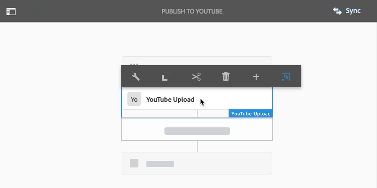

# Vídeo no Dynamic Media {#video}

Esta seção descreve como trabalhar com vídeo no Dynamic Media.

## Start rápido: Vídeos {#quick-start-videos}

A seguinte descrição passo a passo do fluxo de trabalho foi projetada para ajudá-lo a começar a usar rapidamente os conjuntos de vídeo adaptáveis no Dynamic Media. Depois de cada etapa, há referências cruzadas a cabeçalhos de tópicos nos quais você pode encontrar mais informações.

>[!NOTE]
>
>Antes de trabalhar com vídeo no Dynamic Media, verifique se o administrador do AEM já habilitou e configurou Cloud Service Dynamic Media no modo Dynamic Media - Scene7 ou Dynamic Media - Modo híbrido.
>
>* Consulte [Configuração de Cloud Service](/help/assets/config-dms7.md#configuring-dynamic-media-cloud-services) Dynamic Media em Configuração do Dynamic Media - modo Scene7 e [Solução de problemas do Dynamic Media - modo Scene7.](/help/assets/troubleshoot-dms7.md)
   >
   >
* Consulte [Configuração de Cloud Service](/help/assets/config-dynamic.md#configuring-dynamic-media-cloud-services) Dynamic Media em Configuração do Dynamic Media - Modo híbrido.

>


1. **Carregue seus vídeos** do Dynamic Media fazendo o seguinte:

   * Crie seu próprio perfil de codificação de vídeo. Ou você pode simplesmente usar o perfil _Adaptive Video Encoding_ predefinido que acompanha o Dynamic Media.

      * [Criação de um perfil](/help/assets/video-profiles.md#creating-a-video-encoding-profile-for-adaptive-streaming)de codificação de vídeo.
      * Saiba mais sobre as práticas [recomendadas para codificação](#best-practices-for-encoding-videos)de vídeo.
   * Associe o perfil de processamento de vídeo a uma ou mais pastas onde você carregará seus vídeos de origem primária.

      * [Aplicar um perfil de vídeo a pastas](/help/assets/video-profiles.md#applying-a-video-profile-to-folders).
      * Saiba mais sobre as [Práticas recomendadas para organizar seus ativos digitais para o uso de perfis](/help/assets/organize-assets.md)de processamento.
      * Saiba mais sobre como [organizar ativos](/help/assets/organize-assets.md)digitais.
   * Carregue seus vídeos de origem primária nas pastas. É possível carregar arquivos de vídeo com até 15 GB cada. Quando você adiciona vídeos à pasta, eles são codificados de acordo com o perfil de processamento de vídeo atribuído à pasta.

      * [Carregue seus vídeos](/help/assets/managing-video-assets.md#uploadingandpreviewingvideoassets).
      * Saiba mais sobre os formatos [de arquivo de entrada](/help/assets/assets-formats.md#supported-multimedia-formats)suportados.
   * Monitore como a codificação [de vídeo está progredindo](#monitoring-video-encoding-and-youtube-publishing-progress) a partir da visualização do ativo ou do fluxo de trabalho.


1. **Gerencie seus vídeos** do Dynamic Media executando um dos procedimentos a seguir:

   * Organizar, navegar e pesquisar ativos de vídeo

      * [Organização de ativos](/help/assets/organize-assets.md)digitais Saiba mais sobre as práticas [recomendadas para a organização de seus ativos digitais para o uso de perfis de processamento](organize-assets.md)

      * [Pesquisar ativos](search-assets.md#custompredicates) de vídeo ou [Pesquisar ativos](managing-assets-touch-ui.md#search-assets)
   * Pré-visualização e publicação de ativos de vídeo

      * Visualização o vídeo de origem e as representações codificadas do vídeo, juntamente com as miniaturas associadas:
         [Visualizar vídeos](managing-video-assets.md#upload-and-preview-video-assets) ou [Visualizar ativos](previewing-assets.md)
         [Exibição de representações de vídeo](video-renditions.md)
         [Gerenciamento de execuções de vídeo](managing-assets-touch-ui.md#managing-renditions)

      * [Gerenciar predefinições do visualizador](managing-viewer-presets.md)
      * [Publicar ativos](publishing-dynamicmedia-assets.md)
   * Trabalhar com metadados de vídeo

      * Visualização as propriedades de uma execução de vídeo codificado, como taxa de quadros, taxa de bits de áudio e vídeo e codec:
         [Exibir propriedades de representação de vídeo](video-renditions.md)

      * Edite as propriedades do vídeo, como título, descrição e tags, e os campos de metadados personalizados:
         [Editar propriedades de vídeo](managing-assets-touch-ui.md#editing-properties)

      * [Gerenciamento de metadados para ativos digitais](metadata.md)
      * [Esquemas de metadados](metadata-schemas.md)
   * Revise, aprove e anote vídeos e mantenha o controle total da versão

      * [Anotação em vídeos](managing-video-assets.md#annotate-video-assets) ou ativos de [anotação](managing-assets-touch-ui.md#annotating)

      * [Criação de uma versão](managing-assets-touch-ui.md#asset-versioning)
      * [Aplicar workflows a ativos](assets-workflow.md) ou ver [Iniciar um fluxo de trabalho em um ativo](managing-assets-touch-ui.md#starting-a-workflow-on-an-asset)

      * [Revisar ativos da pasta](bulk-approval.md)
      * [Projetos](../sites-authoring/projects.md)


1. **Publique seus vídeos** do Dynamic Media executando um dos procedimentos a seguir:

   * Se você estiver usando o Adobe Experience Manager como seu sistema de gestão de conteúdo da Web, poderá adicionar vídeos diretamente às suas páginas da Web.

      * [Adding videos to your web pages](adding-dynamic-media-assets-to-pages.md).
   * Se você estiver usando um sistema de gestão de conteúdo da Web de terceiros, poderá vincular ou incorporar vídeos às suas páginas da Web.

      * Integrar vídeo usando URL:
         [Vincular URLs do ao aplicativo da Web](linking-urls-to-yourwebapplication.md).

      * Integre vídeo usando o código incorporado na página da Web:
         [Incorporação do visualizador de vídeo em uma página](embed-code.md)da Web.
   * [Publicar vídeos no YouTube](#publishing-videos-to-youtube).
   * [Geração de relatórios](#viewing-video-reports)de vídeo.

   * [Adicionar legendas ao vídeo](#adding-captions-to-video).


## Trabalhar com vídeo no Dynamic Media {#working-with-video-in-dynamic-media}

O vídeo no Dynamic Media é uma solução completa que facilita a publicação de vídeo adaptativo de alta qualidade para transmissão em várias telas, incluindo dispositivos móveis desktop, iOS, Android, Blackberry e Windows. Um Conjunto de vídeos adaptáveis agrupa versões do mesmo vídeo que são codificadas em diferentes taxas de bits e formatos, como 400 kbps, 800 kbps e 1000 kbps. O computador desktop ou dispositivo móvel detecta a largura de banda disponível.

Por exemplo, em um dispositivo móvel iOS, ele detecta uma largura de banda como 3G, 4G ou Wi-Fi. Em seguida, seleciona automaticamente o vídeo codificado direito entre as várias taxas de bits de vídeo no Conjunto de vídeos adaptáveis. O vídeo é transmitido para desktops, dispositivos móveis ou tablets.

Além disso, a qualidade do vídeo é automaticamente alternada se as condições da rede mudarem no desktop ou no dispositivo móvel. Além disso, se um cliente entrar no modo de tela cheia em um desktop, o Conjunto de vídeos adaptáveis responderá usando uma resolução melhor, melhorando assim a experiência de visualização do cliente. O uso de Conjuntos de vídeo adaptativos oferece a melhor reprodução possível para clientes que reproduzem vídeo Dynamic Media em várias telas e dispositivos.

A lógica que um player de vídeo usa para determinar qual vídeo codificado reproduzir ou selecionar durante a reprodução é baseada no seguinte algoritmo:

1. O player de vídeo carrega o fragmento de vídeo inicial com base na taxa de bits mais próxima ao valor definido para &quot;taxa de bits inicial&quot; no próprio player.
1. O player de vídeo muda com base nas alterações na velocidade da largura de banda, usando os seguintes critérios:

   1. O player escolhe o fluxo de largura de banda mais alta abaixo ou igual à largura de banda estimada.
   1. O player considera apenas 80% da largura de banda disponível. No entanto, se está mudando, é mais conservador em apenas 70% para evitar sobrestimações e imediatamente voltar.

Para obter informações técnicas detalhadas sobre o algoritmo, consulte [https://android.googlesource.com/platform/frameworks/av/+/master/media/libstagefright/httplive/LiveSession.cpp](https://android.googlesource.com/platform/frameworks/av/+/master/media/libstagefright/httplive/LiveSession.cpp)

Para gerenciar um único vídeo e Conjuntos de vídeos adaptáveis, há suporte para o seguinte:

* Carregar vídeo de vários formatos de vídeo e formatos de áudio suportados e codificar vídeo para o formato MP4 H.264 para reprodução em várias telas. Você pode usar predefinições de vídeo adaptáveis predefinidas, predefinições de codificação de vídeo único ou personalizar sua própria codificação para controlar a qualidade e o tamanho do vídeo.

   * Quando um conjunto de vídeo adaptável é gerado, ele inclui vídeos MP4.
   * **Observação**: Vídeos Principais/de origem não são adicionados a um Conjunto de vídeos adaptáveis.

* Video captioning in all HTML5 video viewers.
* Organize, navegue e pesquise vídeos com suporte total a metadados para o gerenciamento eficiente dos ativos de vídeo.
* Forneça Conjuntos de vídeo adaptáveis para a Web, desktops e dispositivos móveis, incluindo iPhone, iPad, Android, Blackberry e telefone Windows.

O streaming de vídeo adaptativo é suportado em várias plataformas iOS. Consulte Guia [de referência do](https://docs.adobe.com/content/help/en/dynamic-media-developer-resources/library/viewers-aem-assets-dmc/video/c-html5-video-reference.html)Scene7 Viewers.

A Dynamic Media oferece suporte à reprodução de vídeo móvel para vídeo MP4 H.264. Você pode encontrar dispositivos Blackberry compatíveis com este formato de vídeo no seguinte endereço: [Formatos de vídeo suportados no Blackberry](https://support.blackberry.com/kb/articleDetail?ArticleNumber=000005482).

Você pode encontrar dispositivos Windows compatíveis com este formato de vídeo no seguinte endereço: [Formatos de vídeo suportados no Windows Phone](https://msdn.microsoft.com/library/windows/apps/ff462087%28v=vs.105%29.aspx)

* Reproduza o vídeo usando as predefinições do Dynamic Media Video Viewer, incluindo:

   * Visualizadores de vídeo individuais.
   * Visualizadores de mídia mista que combinam conteúdo de vídeo e imagem.

* Configure players de vídeo para atender às suas necessidades de marca.
* Integre vídeo ao seu site, site móvel ou aplicativo móvel com um URL simples ou código incorporado.

Consulte Exemplo de reprodução [](https://s7d9.scene7.com/s7/uvideo.jsp?asset=GeoRetail/Mop_AVS&amp;config=GeoRetail/Universal_Video1&amp;stageSize=640,480) de vídeo dinâmica.

See also [Viewers for AEM Assets and Dynamic Media Classic](https://docs.adobe.com/content/help/en/dynamic-media-developer-resources/library/viewers-aem-assets-dmc/c-html5-s7-aem-asset-viewers.html) and [Viewers for AEM assets only](https://docs.adobe.com/content/help/en/dynamic-media-developer-resources/library/viewers-for-aem-assets-only/c-html5-aem-asset-viewers.html) in the Adobe Scene7 Viewers Reference Guide.

## Melhores práticas: Uso do visualizador de vídeo HTML5 {#best-practice-using-the-html-video-viewer}

The Dynamic Media HTML5 Video viewer presets are robust video players. Você pode usá-los para evitar muitos problemas comuns associados à reprodução de vídeo HTML5 e problemas associados a dispositivos móveis, como falta de delivery de transmissão adaptável e alcance limitado do navegador do desktop.

No lado do design do player, é possível projetar toda a funcionalidade do player de vídeo usando ferramentas padrão de desenvolvimento da Web. Por exemplo, você pode projetar botões, controles e imagens de fundo de pôster personalizadas usando HTML5 e CSS para ajudá-lo a alcançar seus clientes com uma aparência personalizada.

No lado da reprodução do visualizador, ele detecta automaticamente a capacidade de vídeo do navegador. Em seguida, ele serve o vídeo usando HLS (HTTP Live Streaming), também conhecido como streaming de vídeo adaptável. Ou, se esses métodos de delivery não estiverem presentes, então o HTML5 progressivo será usado.

Ao combinar em um único player a capacidade de projetar os componentes de reprodução usando HTML5 e CSS, ter reprodução integrada e usar streaming adaptável e progressivo dependendo da capacidade do navegador, você estende o alcance do conteúdo de mídia avançada para usuários de desktop e móveis e garante uma experiência de vídeo otimizada.

Consulte também [Sobre visualizadores](https://docs.adobe.com/content/help/en/dynamic-media-developer-resources/library/viewers-for-aem-assets-only/c-html5-aem-asset-viewers.html) HTML5 no Guia de referência do Adobe Scene7 Viewers.

### Reprodução de vídeo em computadores desktop e dispositivos móveis usando o visualizador de vídeo HTML5 {#playback-of-video-on-desktop-computers-and-mobile-devices-using-the-html-video-viewer}

Para streaming de vídeo adaptável para desktop e dispositivos móveis, os vídeos usados para switching de taxa de bits são baseados em todos os vídeos MP4 no Conjunto de vídeos adaptáveis.

Video playback occurs using either HLS or progressive video download. Em versões anteriores do AEM, como 6.0, 6.1 e 6.2, os vídeos eram transmitidos via HTTP.

No entanto, no AEM 6.3 e em diante, os vídeos agora são transmitidos por HTTPS (ou seja, HLS), pois o URL do serviço de gateway DM sempre usa HTTPS também. Observe que não há impacto do cliente neste comportamento padrão. Ou seja, o streaming de vídeo sempre ocorrerá em HTTPS, a menos que não seja suportado pelo navegador. (consulte a tabela a seguir). Portanto,

* Se você tiver um site HTTPS com streaming de vídeo HTTPS, o streaming está funcionando bem.
* Se você tiver um site HTTP com streaming de vídeo HTTPS, o streaming estará correto e não haverá problemas de conteúdo misto no navegador da Web.

HLS é um padrão da Apple para streaming de vídeo adaptável que ajusta automaticamente a reprodução com base na capacidade de largura de banda da rede. Ele também permite que o cliente &quot;procure&quot; qualquer ponto do vídeo, sem precisar aguardar o download do restante do vídeo.

Progressive video is delivered by downloading and storing the video locally on a user’s desktop system or mobile device.

A tabela a seguir descreve o dispositivo, o navegador e o método de reprodução de vídeos em computadores desktop e dispositivos móveis usando o Scene7 Video Viewer.

<table>
 <tbody>
  <tr>
   <td><strong>Device</strong></td>
   <td><strong>Navegador</strong></td>
   <td><strong>Modo de reprodução de vídeo</strong></td>
  </tr>
  <tr>
   <td>Área de trabalho</td>
   <td>Internet Explorer 9 e 10</td>
   <td>Download progressivo.</td>
  </tr>
  <tr>
   <td>Área de trabalho</td>
   <td>Internet Explorer 11+</td>
   <td>No Windows 8 e no Windows 10 - Forçar o uso de HTTPS sempre que HLS for solicitado. Limitação conhecida: O HTTP no HLS não funciona nesta combinação<br /> de navegador/sistema operacional <br /> No Windows 7 - Download progressivo. Usa a lógica padrão para selecionar protocolo HTTP versus HTTPS.</td>
  </tr>
  <tr>
   <td>Área de trabalho</td>
   <td>Firefox 23-44</td>
   <td>Download progressivo.</td>
  </tr>
  <tr>
   <td>Área de trabalho</td>
   <td>Firefox 45 ou posterior</td>
   <td>HLS</td>
  </tr>
  <tr>
   <td>Área de trabalho</td>
   <td>Cromo</td>
   <td>HLS</td>
  </tr>
  <tr>
   <td>Área de trabalho</td>
   <td>Safari (Mac)</td>
   <td>HLS</td>
  </tr>
  <tr>
   <td>Móvel</td>
   <td>Chrome (Android 6 ou anterior)</td>
   <td>Download progressivo.</td>
  </tr>
  <tr>
   <td>Móvel</td>
   <td>Chrome (Android 7 ou posterior)</td>
   <td>HLS</td>
  </tr>
  <tr>
   <td>Móvel</td>
   <td>Android (navegador padrão)</td>
   <td>Download progressivo.</td>
  </tr>
  <tr>
   <td>Móvel</td>
   <td>Safari (iOS)</td>
   <td>HLS</td>
  </tr>
  <tr>
   <td>Móvel</td>
   <td>Chrome (iOS)</td>
   <td>HLS</td>
  </tr>
  <tr>
   <td>Móvel</td>
   <td>Blackberry</td>
   <td>HLS</td>
  </tr>
 </tbody>
</table>

## Arquitetura da solução de vídeo Dynamic Media {#architecture-of-dynamic-media-video-solution}

O gráfico a seguir mostra o fluxo de trabalho de criação geral de vídeos que são carregados e codificados por meio do DMGGateway (no modo Dynamic Media Hybrid) e disponibilizados para consumo público.


## Arquitetura de publicação híbrida para vídeos {#hybrid-publishing-architecture-for-videos}


## Práticas recomendadas para codificação de vídeos {#best-practices-for-encoding-videos}

O fluxo de trabalho **Codificação de vídeo do Dynamic Media** codifica o vídeo se você tiver ativado a mídia dinâmica e configurado os serviços da nuvem de vídeo. Esse fluxo de trabalho captura o histórico do processo de fluxo de trabalho e as informações de falha. Consulte [Monitorar o progresso da codificação de vídeo e da publicação no YouTube](#monitoring-video-encoding-and-youtube-publishing-progress). Se você tiver ativado a mídia dinâmica e configurado os serviços da nuvem de vídeo, o fluxo de trabalho **[!UICONTROL Codificação de vídeo do Dynamic Media]** será aplicado automaticamente ao carregar um vídeo. (Se você não estiver usando mídia dinâmica, o fluxo de trabalho **[!UICONTROL Atualizar ativo do DAM]** entrará em vigor.)

Veja a seguir dicas de práticas recomendadas para a codificação de arquivos de vídeo de origem.

Para obter conselhos sobre a codificação de vídeo, consulte:

* [Streaming 101: Os fundamentos... Codecs, largura de banda, taxa de dados e resolução](https://www.adobe.com/go/learn_s7_streaming101_en).
* [Noções básicas sobre](https://www.adobe.com/go/learn_s7_encoding_en)codificação de vídeo.

### Arquivos de vídeo de origem {#source-video-files}

Ao codificar um arquivo de vídeo, use um arquivo de vídeo de origem com a qualidade mais alta possível. Evite usar arquivos de vídeo previamente codificados, pois esses arquivos já estão compactados, e a codificação adicional cria um vídeo de qualidade inferior.

A tabela a seguir descreve o tamanho recomendado, a proporção e a taxa mínima de bits que seus arquivos de vídeo de origem devem ter antes de codificá-los:

| Tamanho | Taxa de proporção | Taxa mínima de bits |
|--- |--- |--- |
| 1024 X 768 | 4:3 | 4500 kbps para a maioria dos vídeos. |
| 1280 X 720 | 16:9 | 3000 - 6000 kbps, dependendo da quantidade de movimento no vídeo. |
| 1920 X 1080 | 16:9 | 6000 - 8000 kbps, depending on the amount of motion in the video. |

### Obtenção dos metadados de um arquivo {#obtaining-a-file-s-metadata}

É possível obter os metadados de um arquivo ao exibir seus metadados usando uma ferramenta de edição de vídeo ou um aplicativo projetado para obter metadados. Veja a seguir as instruções de uso do MediaInfo, um aplicativo de terceiros, para obter os metadados de um arquivo de vídeo:

1. Ir para esta página da Web: [https://mediainfo.sourceforge.net/en/Download](https://mediainfo.sourceforge.net/en/Download).
1. Selecione e baixe o instalador da versão da GUI e siga as instruções de instalação.
1. Após a instalação, clique com o botão direito do mouse no arquivo de vídeo (somente Windows) e selecione MediaInfo, ou abra MediaInfo e arraste o arquivo de vídeo para o aplicativo. Todos os metadados associados ao arquivo de vídeo, incluindo largura, altura e fps.

### Taxa de proporção {#aspect-ratio}

Ao escolher ou criar uma predefinição de codificação de vídeo para o arquivo de vídeo de origem primária, certifique-se de que a predefinição tenha a mesma proporção do arquivo de vídeo de origem principal. A proporção é a proporção entre a largura e a altura do vídeo.

Para determinar a proporção de um arquivo de vídeo, obtenha os metadados do arquivo e observe a largura e a altura do arquivo (consulte Obter os metadados do arquivo acima). Em seguida, use essa fórmula para determinar a proporção:

width/height = aspect ratio

A tabela a seguir descreve como os resultados da fórmula se traduzem em opções de proporção comuns:

| Resultado da fórmula | Taxa de proporção |
|--- |--- |
| 1.33 | 4:3 |
| 0.75 | 3:4 |
| 1.78 | 16:9 |
| 0.56 | 9:16 |

For example, a video that is 1440 width x 1080 height has an aspect ratio of 1440/1080, or 1.33. In this case you choose a video encoding preset with a 4:3 aspect ratio to encode the video file.

### Taxa de bits {#bitrate}

Bitrate is the amount of data that is encoded to make up a single second of video playback. The bitrate is measured in kilobits per second (Kbps).

>[!NOTE]
>
>Because all codecs use lossy compression, bitrate is the most important factor in video quality. With lossy compression, the more you compress a video file, the more the quality is degraded. For this reason, all other characteristics being equal (the resolution, frame rate, and codec), the lower the bitrate, the lower the quality of the compressed file.

When selecting a bitrate encoding, there are two types you can choose:

* **[!UICONTROL Constant Bitrate Encoding]** (CBR) - During CBR encoding, the bitrate or the number of bits per second is kept the same throughout the encoding process. CBR encoding persists the set data rate to your setting over the entire video. Also, CBR encoding does not optimize media files for quality but does save on storage space.
Use CBR if your video contains a similar motion level throughout the entire video. CBR is most commonly used for streaming video content. See also [Using custom-added video encoding parameters](/help/assets/video-profiles.md#using-custom-added-video-encoding-parameters).

* **[!UICONTROL Variable Bitrate Encoding]** (VBR) - VBR encoding adjusts the data rate down and to the upper limit you set, based on the data required by the compressor. This means that during a VBR encoding process the bitrate of the media file dynamically increases or decreases depending on the media files bitrate needs.
VBR takes longer to encode but produces the most favorable results; the quality of the media file is superior. VBR is most commonly used for http progressive delivery of video content.

When should you use VBR versus CRB?
When it comes to selecting VBR versus CBR, it is almost always recommended that you use VBR for your media files. VBR provides higher quality files at competitive bitrates. Ao usar o VBR, certifique-se de usar com codificação de duas passagens e definir a taxa de bits máxima como 1,5x a taxa de bits de vídeo do público alvo.

Ao escolher uma predefinição de codificação de vídeo, considere a velocidade de conexão do usuário final do público alvo. Escolha uma predefinição com uma taxa de dados que seja 80% dessa velocidade. Por exemplo, se a velocidade de conexão do usuário final do público alvo for de 1000 Kbps, a melhor predefinição será aquela com uma taxa de dados de vídeo de 800 Kbps.

Esta tabela descreve a taxa de dados de velocidades de conexão típicas.

| Velocidade (Kbps) | Tipo de conexão |
|--- |--- |
| 256 | Conexão dial-up. |
| 800 | Conexão móvel típica. Para essa conexão, público alvo uma taxa de dados no intervalo de 400 a um máximo de 800 para experiências 3G. |
| 2000 | Conexão típica de desktop de banda larga. Para esta conexão, público alvo uma taxa de dados no intervalo de 800 a 2000 Kbps, com a maioria dos públicos alvos, em média, de 1200 a 1500 Kbps. |
| 5000 | Conexão típica de banda larga alta. Não é recomendável a codificação nesse intervalo superior, pois o delivery de vídeo nessa velocidade não está disponível para a maioria dos consumidores. |

### Resolução {#resolution}

**Resolução **descreve a altura e a largura de um arquivo de vídeo em pixels. A maioria dos vídeos de origem é armazenada em alta resolução (por exemplo, 1920 x 1080). Para fins de streaming, o vídeo de origem é compactado em uma resolução menor (640 x 480 ou menor).

A resolução e a taxa de dados são dois fatores totalmente ligados que determinam a qualidade do vídeo. Para manter a mesma qualidade de vídeo, quanto maior o número de pixels em um arquivo de vídeo (quanto maior a resolução), maior deve ser a taxa de dados. For example, consider the number of pixels per frame in a 320 x 240 resolution and a 640 x 480 resolution video file:

| Resolução | Pixels por quadro |
|--- |--- |
| 320 x 240 | 76,800 |
| 640 x 480 | 307,200 |

O arquivo 640 x 480 tem quatro vezes mais pixels por quadro. To achieve the same data rate for these two example resolutions, you apply four times the compression to the 640 x 480 file, which can reduce the quality of the video. Therefore, a video data rate of 250 Kbps produces high-quality viewing at a 320 x 240 resolution, but not at a 640 x 480 resolution.

In general, the higher data rate you use, the better your video looks, and the higher resolution you use, the higher data rate you need to maintain viewing quality (compared to lower resolutions).

Como a resolução e a taxa de dados estão vinculadas, você tem duas opções ao codificar o vídeo:

* Choose a data rate and then encode at the highest resolution that looks good at the data rate you chose.
* Choose a resolution and then encode at the data rate necessary to achieve high-quality video at the resolution you chose.

Ao escolher (ou criar) uma predefinição de codificação de vídeo para o arquivo de vídeo de origem primária, use esta tabela para público alvo da resolução correta:

| Resolução | Altura (pixels) | Screen size |
|--- |--- |--- |
| 240p | 240 | Tiny screen |
| 300p | 300 | Small screen typically for mobile devices |
| 360p | 360 | Small screen |
| 480p | 480 | Tela média |
| 720p | 720 | Large screen |
| 1080p | 1080 | Tela grande de alta definição |

### Fps (Quadros por segundo) {#fps-frames-per-second}

Nos Estados Unidos e no Japão, a maioria dos vídeos é fotografados a 29,97 quadros por segundo (fps); na Europa, a maioria dos vídeos são gravados a 25 qps. O filme é filmado a 24 fps.

Escolha uma predefinição de codificação de vídeo que corresponda à taxa fps do arquivo de vídeo de origem primária. Por exemplo, se o vídeo de origem primária for 25 fps, escolha uma predefinição de codificação com 25 fps. Por padrão, toda codificação personalizada usa o fps do arquivo de vídeo de origem primária. Por isso, não é necessário especificar explicitamente a configuração fps ao criar uma predefinição de codificação de vídeo.

### Dimensões de codificação de vídeo {#video-encoding-dimensions}

For optimal results, select encoding dimensions such that the source video is a whole multiple of all your encoded videos.

Para calcular essa proporção, divida a largura de origem por largura codificada para obter a proporção de largura. Em seguida, divida a altura de origem por altura codificada para obter a proporção de altura.

If the resulting ratio is a whole integer, it means that the video is optimally scaled. If the resulting ratio is not a whole integer, it impacts video quality by leaving leftover pixel artifacts on the display. This effect is most noticeable when the video has text.

Por exemplo, suponha que o vídeo de origem seja 1920 x 1080. In the following table, the three encoded videos provide the optimal encoding settings to use.

| Video Type | Largura x altura | Proporção de largura | Height Ratio |
|--- |--- |--- |--- |
| Origem | 1920x1080 | 1 | 1 |
| Codificado | 960 x 540 | 2 | 2 |
| Codificado | 640 x 360 | 3 | 3 |
| Codificado | 480 x 270 | 4 | 4 |

### Formato de arquivo de vídeo codificado {#encoded-video-file-format}

Dynamic Media recommends using MP4 H.264 video encoding presets. Como os arquivos MP4 usam o codec de vídeo H.264, ele fornece vídeo de alta qualidade, mas em um tamanho de arquivo compactado.

## Publishing videos to YouTube {#publishing-videos-to-youtube}

Você pode publicar ativos de vídeo do AEM local diretamente em um canal do YouTube que você criou anteriormente.

To publish video assets to YouTube, you set up AEM Assets with tags. You associate these tags with a YouTube channel. If a video asset&#39;s tag matches the tag of a YouTube channel, then the video is published to YouTube. Publish to YouTube occurs along with a normal publish of the video as long as an associated tag is used.

YouTube does its own encoding. As such, the original video file that was uploaded into AEM is published to YouTube instead of any video rendition that Dynamic Media’s encoding has created. While it is not required to process videos using Dynamic Media, it is expected that they will do so in case a viewer preset is needed for playback.

When you bypass the video processing profile and publish directly to YouTube, it simply means that your video asset in AEM Asset may not get a viewable thumbnail. It also means that if you run in dynamicmedia or dynamicmedia_scene7 run modes, videos that are not encoded will not work with any of the Dynamic Media asset types.

Publishing video assets to YouTube servers involves completing the following tasks to ensure safe and secure server-to-server authentication with YouTube:

1. [Configuring Google Cloud settings](#configuring-google-cloud-settings)
1. [Criação de um canal do YouTube](#creating-a-youtube-channel)
1. [Adding tags for publishing](#adding-tags-for-publishing)
1. [Enabling the YouTube Publish Replication agent](#enabling-the-youtube-publish-replication-agent)
1. [Configuração do YouTube no AEM](#setting-up-youtube-in-aem)
1. [(Opcional) Automatizando a configuração das propriedades padrão do YouTube para os vídeos carregados](#optional-automating-the-setting-of-default-youtube-properties-for-your-uploaded-videos)
1. [Publishing videos to your YouTube channel](#publishing-videos-to-your-youtube-channel)
1. [(Optional) Verifying the published video on YouTube](/help/assets/video.md#optional-verifying-the-published-video-on-youtube)
1. [Vincular URLs do YouTube à sua Aplicação web](#linking-youtube-urls-to-your-web-application)

You can also [unpublish videos to remove them from YouTube](#unpublishing-videos-to-remove-them-from-youtube).

### Configuring Google Cloud settings {#configuring-google-cloud-settings}

To publish to YouTube, you need a Google account. If you have a GMAIL account then you already have a Google account; if you do not have a Google account, you can easily create one. Você precisa da conta porque precisa de credenciais para publicar ativos de vídeo no YouTube. Se você já tiver uma conta criada, ignore essa tarefa e prossiga diretamente para [Criar um canal](#creating-a-youtube-channel)do YouTube.

A conta usada com a Google Cloud e a conta do Google usada para o YouTube não precisa ser a mesma.

Be aware that Google periodically makes changes to their user interface. Dessa forma, as etapas para publicar vídeos no YouTube podem variar um pouco do que está documentado abaixo. Esta advertência também se aplica ao YouTube quando você tenta verificar se os vídeos foram carregados nele.

>[!NOTE]
>
>Os passos a seguir foram precisos no momento desta escrita. However, Google periodically updates their websites without notice. As such, these steps may be slightly different.

To configure Google Cloud settings:

1. Create a new Google account.
   [https://accounts.google.com/SignUp?service=mail](https://accounts.google.com/SignUp?service=mail)

   If you already have a Google account, skip to the next step.

1. Go to [https://cloud.google.com/](https://cloud.google.com/).
1. Na página do Google Cloud, próximo ao canto superior direito, clique em **[!UICONTROL Console.]**

   If necessary, you may need to **[!UICONTROL Sign in]** using your Google account credentials to see the **[!UICONTROL Console]** option.

1. On the Dashboard page, to the right of **[!UICONTROL Google Cloud Platform]**, click the Project drop-down list to open the Select a Project dialog box.
1. In the Select a project dialog box, tap **[!UICONTROL New Project.]**

   

1. In the New Project dialog box, in the Project Name field, type the name of your new project.

   Note that your Project ID is based on your project name. Como tal, escolha cuidadosamente o nome do projeto; ele não pode ser alterado após ser criado. Além disso, você precisará digitar a mesma ID de projeto novamente quando configurar o YouTube no AEM posteriormente; talvez você queira anotar.

1. Clique em **[!UICONTROL Criar.]**

1. Execute um dos procedimentos a seguir:

   * No Painel do seu projeto, no cartão de Introdução, toque em **[!UICONTROL Explorar e ativar as APIs.]**
   * No Painel do seu projeto, no cartão de APIs, toque em **[!UICONTROL Ir para a visão geral das APIs.]**

   

1. Near the top of the APIs &amp; Services page, tap **[!UICONTROL Enable APIs and Services.]**
1. Na página Biblioteca de API, no lado esquerdo, em **[!UICONTROL Categoria]**, toque em **[!UICONTROL YouTube.]** On the right side of the page, tap **[!UICONTROL YouTube Data API.]**
1. Na página da API de dados do YouTube v3, toque em **[!UICONTROL Ativar.]**

   

1. To use the API, you may need credentials. If necessary, click **[!UICONTROL Create Credentials.]**

   

1. On the **[!UICONTROL Add credentials to your project]** page, step 1, do the following:

   * Na API **[!UICONTROL Qual você está usando?]** drop-down list, select **[!UICONTROL YouTube Data API v3.]**

   * From the **[!UICONTROL Where will you be calling the API from?]** drop-down list, select **[!UICONTROL Web Server (e.g. node.js, Tomcat)]**

   * From the **[!UICONTROL What data will you be accessing?]** lista suspensa, toque em Dados **[!UICONTROL do usuário.]**

   

1. Tap **[!UICONTROL What credentials do I need?]**
1. Na página **[!UICONTROL Adicionar credenciais ao projeto]**, etapa 2, no cabeçalho **[!UICONTROL Criar uma ID de cliente do OAuth 2.0]**, no campo Nome, digite um nome exclusivo, se desejar. Ou você pode usar o nome padrão especificado pelo Google.
1. Under the **[!UICONTROL Authorized Javascript origins]** heading, in the text field, enter the following path, substituting your own domain and port number in the path, then press **[!UICONTROL Enter]** to add the path to the list:

   `https://<servername.domain>:<port_number>`

   Por exemplo, `https://1a2b3c.mycompany.com:4321`

   **Note**: The path example above is intended for illustration purposes only.

   

1. Under the **[!UICONTROL Authorized redirect URIs]** heading, in the text field, enter the following path, substituting your own domain and port number in the path, then press **[!UICONTROL Enter]** to add the path to the list:

   `https://<servername.domain>:<port_number>/etc/cloudservices/youtube.youtubecredentialcallback.json`

   Por exemplo, `https://1a2b3c.mycompany.com:4321/etc/cloudservices/youtube.youtubecredentialcallback.json`

   **Note**: The path example above is intended for illustration purposes only.

1. Clique em **[!UICONTROL Criar ID de cliente OAuth.]**
1. Na página **[!UICONTROL Adicionar credenciais ao projeto]**, etapa 3, no cabeçalho **[!UICONTROL Configurar a tela de consentimento do OAuth 2.0]**, selecione o endereço de email do Gmail que você está usando no momento.

   

1. No cabeçalho Nome do **[!UICONTROL produto exibido aos usuários]** , no campo de texto, digite o que deseja mostrar na tela de consentimento.

   A tela de consentimento é exibida para o administrador do AEM quando eles são autenticados no YouTube; O AEM entrará em contato com o YouTube para obter permissão.

1. Clique em **[!UICONTROL Continuar.]**
1. Na página Adicionar credenciais ao projeto, etapa 4, no cabeçalho **[!UICONTROL Baixar credenciais]**, toque em **[!UICONTROL Download.]**

   

1. Salve o `client_id.json` arquivo.

   Você precisará desse arquivo json baixado ao configurar o YouTube no Adobe Experience Manager posteriormente.

1. Clique em **[!UICONTROL Concluído.]**

   Log out of your Google account. Agora você criará um canal no YouTube.

### Criação de um canal do YouTube {#creating-a-youtube-channel}

A publicação de vídeos no YouTube requer um ou mais canais. Se você já tiver criado um canal do YouTube, poderá ignorar essa tarefa e ir para [Adicionar tags para publicação](/help/assets/video.md#adding-tags-for-publishing).

>[!CAUTION]
>
>Verifique se você já configurou um ou mais canais no YouTube *antes* de adicionar canais em Configurações do YouTube no AEM (consulte [Configuração do YouTube no AEM](#setting-up-youtube-in-aem) abaixo). Se você não fizer isso, não receberá nenhum aviso de nenhum canal existente. No entanto, a autenticação do Google ainda ocorre quando você adiciona um canal, mas não há uma opção para escolher qual canal o vídeo é enviado.

Para criar um canal do YouTube:

1. Acesse [https://www.youtube.com](https://www.youtube.com/) e faça logon usando suas credenciais de conta do Google.
1. No canto superior direito da página do YouTube, clique na imagem do seu perfil (também pode aparecer como uma letra dentro de um círculo colorido sólido) e clique nas configurações **[!UICONTROL do]** YouTube (ícone de engrenagem redonda).
1. Na página Visão geral, no cabeçalho Recursos adicionais, clique em **[!UICONTROL Ver todos os meus canais ou crie um novo canal.]**
1. Na página Canais, clique em **[!UICONTROL Criar um novo canal.]**
1. Na página Conta de marca, no campo Nome da conta de marca, digite um nome comercial ou qualquer outro nome de canal que você escolher onde deseja publicar seus ativos de vídeo e clique em **[!UICONTROL Criar.]**

   Lembre-se do nome inserido aqui, pois será necessário inseri-lo novamente ao configurar o YouTube no AEM.

1. (Opcional) Se necessário, adicione mais canais.

   Agora, você adicionará tags para publicação.

### Adicionar tags para publicação {#adding-tags-for-publishing}

Para publicar em seus vídeos no YouTube, o AEM associa tags a um ou mais canais do YouTube. Para adicionar tags para publicação, consulte [Administração de tags](/help/sites-administering/tags.md).

Ou, se você pretende usar as tags padrão no AEM, ignore essa tarefa e acesse [Ativando o agente](#enabling-the-youtube-publish-replication-agent)de replicação de Publicação do YouTube.

### Ativar o agente de replicação de publicação do YouTube {#enabling-the-youtube-publish-replication-agent}

Depois de ativar o agente de replicação de publicação do YouTube, se você quiser testar a conexão com a conta do Google Cloud, toque em **[!UICONTROL Testar conexão.]** Uma guia do navegador exibe os resultados da conexão. Se você tiver adicionado Canais do YouTube, uma lista desses será exibida como parte do teste.

1. No canto superior esquerdo do AEM, clique no logotipo do AEM e, no painel à esquerda, clique em **[!UICONTROL Ferramentas]** > **[!UICONTROL Implantação]** > **[!UICONTROL Replicação]** > **[!UICONTROL Agentes no autor.]**
1. Na página Agentes do autor, clique em Publicar no **[!UICONTROL YouTube (YouTube).]**
1. Na barra de ferramentas, à direita de Configurações, clique em **[!UICONTROL Editar.]**
1. Marque a caixa de seleção **[!UICONTROL Ativado]** para ativar o agente de replicação.
1. Clique em **[!UICONTROL OK.]**

   Agora você configurará o YouTube no AEM.

### Setting up YouTube in AEM {#setting-up-youtube-in-aem}

A partir do AEM 6.4, um novo método de interface do usuário de toque foi introduzido para configurar a publicação do YouTube no AEM. Com base na instância do AEM instalada que você está usando, execute um dos procedimentos a seguir:

* Para configurar o YouTube no AEM antes da versão 6.4, consulte [Configuração do YouTube no AEM anterior a 6.4](/help/assets/video.md#setting-up-youtube-in-aem-before).
* Para configurar o YouTube no AEM 6.4 ou posterior, consulte [Configuração do YouTube no AEM 6.4 e posterior](#setting-up-youtube-in-aem-and-later).

#### Configuração do YouTube no AEM 6.4 e posterior {#setting-up-youtube-in-aem-and-later}

1. Certifique-se de fazer logon na sua instância do Dynamic Media como um Administrador.
1. No canto superior esquerdo do AEM, toque no logotipo do AEM e, em seguida, no painel à esquerda, toque em **[!UICONTROL Ferramentas]**(ícone de martelo) > **[!UICONTROL Serviços da nuvem]** > **[!UICONTROL Configuração de publicação no YouTube.]**
1. Toque em **[!UICONTROL global]** (não o selecione).

1. Near the upper-right corner of the global page, tap **[!UICONTROL Create.]**
1. Na página Criar configuração do YouTube, em Configurações da Google Cloud Platform, no campo **[!UICONTROL Nome do aplicativo]**, digite a ID do projeto do Google.

   Você especificou a ID do projeto quando configurou as configurações do Google Cloud anteriormente.
Deixe a página Criar configuração do YouTube aberta; você voltará a isso em um momento.

   

1. Usando um editor de texto simples, abra o arquivo JSON que você baixou e salvou anteriormente na tarefa [Definição das configurações](/help/assets/video.md#configuring-google-cloud-settings)do Google Cloud.
1. Selecione e copie o texto JSON inteiro.
1. Retorne à caixa de diálogo Configurações da conta do YouTube. No campo **[!UICONTROL Configuração JSON]**, cole o texto JSON.
1. Near the upper-right corner of the page, tap **[!UICONTROL Save.]**

   Agora você configurará canais do YouTube no AEM.

1. Toque em **[!UICONTROL Adicionar Canal.]**
1. In the Channel Name field, enter the name of the channel that you created in the task **[!UICONTROL Adding one or more channels to YouTube]** earlier.

   Como opção, você pode adicionar uma descrição, se desejar.

1. Toque em **[!UICONTROL Adicionar.]**
1. A autenticação do YouTube/Google é exibida. Se você ainda não estiver conectado à conta do Google Cloud, ignore esta etapa.

   * Digite o nome de usuário e a senha do Google associados à ID do projeto do Google e o texto JSON acima.
   * Dependendo de quantos canais sua conta tiver exibido dois ou mais itens. Selecione um canal. Não selecione o endereço de correio eletrônico; não é um canal.
   * Na próxima página, toque em **[!UICONTROL Aceitar]** para permitir o acesso a este canal.

1. Toque em **[!UICONTROL Permitir.]**

   Agora, você configurará tags para publicação.

1. **[!UICONTROL Configuração de tags para publicação]** - Na página Cloud Service > YouTube, toque no ícone de lápis para editar a lista de tags que deseja usar.
1. Toque no ícone de lista suspensa (sinal invertido) para exibir a lista de tags disponíveis no AEM.
1. Toque em uma ou mais tags para adicioná-las.

   Para excluir uma tag adicionada, selecione-a e toque em **[!UICONTROL X.]**

1. Quando terminar de adicionar as tags desejadas, toque em **[!UICONTROL Salvar.]**

   Agora você publica vídeos no seu canal do YouTube.

#### Configuração do YouTube no AEM antes da versão 6.4 {#setting-up-youtube-in-aem-before}

1. Certifique-se de fazer logon na sua instância do Dynamic Media como um Administrador.

1. No canto superior esquerdo do AEM, toque no logotipo do AEM e, em seguida, no painel à esquerda, toque em **[!UICONTROL Ferramentas]** (ícone de martelo) > **[!UICONTROL Implantação]** > **[!UICONTROL Serviços da nuvem.]**
1. No cabeçalho Third Party Services (Serviços de terceiros), em YouTube, toque em **[!UICONTROL Configure now (Configurar agora).]**
1. Na caixa de diálogo Criar configuração, digite um título (obrigatório) e um nome (opcional) nos respectivos campos.
1. Toque em **[!UICONTROL Criar.]**
1. Na caixa de diálogo Configurações da conta do YouTube, no campo **[!UICONTROL Nome do aplicativo]**, digite a ID do projeto do Google.

   Você especificou a ID do projeto quando [configurou as configurações](/help/assets/video.md#configuring-google-cloud-settings) do Google Cloud anteriormente.
Deixe a caixa de diálogo Configuração de conta do YouTube aberta; você voltará a isso em um momento.

1. Usando um editor de texto simples, abra o arquivo JSON que você baixou e salvou anteriormente na tarefa Configuração das configurações do Google Cloud.
1. Selecione e copie o texto JSON inteiro.
1. Retorne à caixa de diálogo Configurações da conta do YouTube. No campo **[!UICONTROL Configuração JSON]**, cole o texto JSON.
1. Toque em **[!UICONTROL OK.]**

   Agora você configurará canais do YouTube no AEM.

1. À direita de **[!UICONTROL Canais disponíveis]**, toque em **+** (ícone de adição).
1. Na caixa de diálogo Configurações do canal do YouTube, no campo Título, digite o nome do canal criado na tarefa **[!UICONTROL Adicionar um ou mais canais ao YouTube]** anteriormente.

   Como opção, você pode adicionar uma descrição, se desejar.

1. Toque em **[!UICONTROL OK.]**
1. A autenticação do YouTube/Google é exibida. Se você ainda não estiver conectado à conta do Google Cloud, ignore esta etapa.

   * Digite o nome de usuário e a senha do Google associados à ID do projeto do Google e o texto JSON acima.
   * Dependendo de quantos canais sua conta tiver exibido dois ou mais itens. Selecione um canal. Não selecione o endereço de correio eletrônico; não é um canal.
   * Na próxima página, toque em **[!UICONTROL Aceitar]** para permitir o acesso a este canal.

1. Toque em **[!UICONTROL Permitir.]**

   Agora, você configurará tags para publicação.

1. **[!UICONTROL Configuração de tags para publicação]** - Na página Cloud Service > YouTube, toque no ícone de lápis para editar a lista de tags que deseja usar.
1. Toque no ícone de lista suspensa (sinal invertido) para exibir a lista de tags disponíveis no AEM.
1. Toque em uma ou mais tags para adicioná-las.

   Para excluir uma tag adicionada, selecione-a e toque em **X**.

1. Quando terminar de adicionar as tags desejadas, toque em **[!UICONTROL OK.]**

   Agora você publica vídeos no seu canal do YouTube.

### (Opcional) Automatizando a configuração das propriedades padrão do YouTube para os vídeos carregados {#optional-automating-the-setting-of-default-youtube-properties-for-your-uploaded-videos}

Como opção, você pode automatizar a configuração das propriedades do YouTube no upload de seus vídeos. Isso é feito criando um perfil de processamento de metadados no AEM.

Para criar o perfil de processamento de metadados, você primeiro copiará valores dos campos **[!UICONTROL Rótulo do campo]**, **[!UICONTROL Mapear para a propriedade]** e **[!UICONTROL Opções]**, todos encontrados nos Esquemas de metadados do vídeo. Em seguida, você criará seu perfil de processamento de metadados de vídeo do YouTube, adicionando esses valores a ele.

Para automatizar a configuração das propriedades padrão do YouTube para os vídeos carregados:

1. No canto superior esquerdo do AEM, clique no logotipo do AEM e, no painel à esquerda, clique em **[!UICONTROL Ferramentas]** (ícone de martelo) > **[!UICONTROL Ativos]** > **[!UICONTROL Esquemas de metadados.]**
1. Click **[!UICONTROL default.]** (Não adicione uma marca de seleção à caixa de seleção à esquerda de &quot;padrão&quot;.)
1. Na página **[!UICONTROL padrão]**, marque a caixa à esquerda do **[!UICONTROL vídeo]** e clique em **Editar.]**
1. Na página Editor de Schemas de metadados, clique na guia **[!UICONTROL Avançado]** .
1. No cabeçalho Publicação no YouTube, clique em **[!UICONTROL Categoria do YouTube.]**
1. No lado direito da página, na guia **[!UICONTROL Configurações]** , faça o seguinte:

   * No campo de texto **[!UICONTROL Mapear para propriedade]** , selecione e copie o valor.
Cole o valor copiado no editor de texto aberto. Você precisará desse valor posteriormente ao criar seu perfil de processamento de metadados. Deixe o editor de texto aberto.

   * Em **[!UICONTROL Opções]**, selecione e copie o valor padrão que deseja usar (como Pessoas e blogs ou Ciência e Tecnologia).
Cole o valor copiado no editor de texto aberto. Você precisará desse valor posteriormente ao criar seu perfil de processamento de metadados. Deixe o editor de texto aberto.

1. Under the YouTube Publishing heading, click **[!UICONTROL YouTube Privacy.]**
1. No lado direito da página, na guia **[!UICONTROL Configurações]** , faça o seguinte:

   * No campo de texto **[!UICONTROL Mapear para propriedade]** , selecione e copie o valor.
Cole o valor copiado no editor de texto aberto. Você precisará desse valor posteriormente ao criar seu perfil de processamento de metadados. Deixe o editor de texto aberto.

   * Em **[!UICONTROL Opções]**, selecione e copie o valor padrão que deseja usar. Observe que as Opções estão agrupadas em pares de dois. O campo inferior do par é o valor padrão que você deseja copiar, como público, não listado ou privado.
Cole o valor copiado no editor de texto aberto. Você precisará desse valor posteriormente ao criar seu perfil de processamento de metadados. Deixe o editor de texto aberto.

1. Ao lado do canto superior direito da página do Editor de Schemas de Metadados, clique em **[!UICONTROL Cancelar.]**
1. No canto superior esquerdo do AEM, toque no logotipo do AEM e, no painel à esquerda, clique em **[!UICONTROL Ferramentas]** (ícone de martelo) > **[!UICONTROL Ativos]** > **[!UICONTROL Perfis de metadados.]**

1. Na página Perfis de metadados, próximo ao canto superior direito da página, clique em **[!UICONTROL Criar.]**
1. Na caixa de diálogo Adicionar perfil de metadados, no campo de texto **[!UICONTROL Título do perfil]**, digite o nome `YouTube Video` e clique em **[!UICONTROL Criar.]**
1. Na página Editor de Perfis de Metadados, clique na guia **[!UICONTROL Avançado]** .
1. Adicione os valores de Publicação do YouTube copiados ao perfil, fazendo o seguinte:

   * No lado direito da página, clique na guia **[!UICONTROL Criar formulário]** .
   * (Opcional) Arraste o componente identificado como Cabeçalho **[!UICONTROL de]** seção para a esquerda e solte-o na área de formulário.
   * (Optional) Click **[!UICONTROL Field Label]** to select the component.
   * (Opcional) No lado direito da página, na guia Configurações, no campo de texto Rótulo do campo, digite `YouTube Publishing`.
   * Click the **[!UICONTROL Build Form]** tab, then drag the component labeled **[!UICONTROL Multi Value Text]** and drop it below the **[!UICONTROL YouTube Publishing]** heading that you just created.

   * Click **[!UICONTROL Field Label** to select the component.
   * No lado direito da página, na guia Configurações, cole os valores de Publicação do YouTube (valor de Rótulo de campo e Mapa para valor de propriedade) que você copiou anteriormente, em seus respectivos campos no formulário. Cole o valor Opções no campo Valor padrão.

1. Adicione os valores de privacidade do YouTube copiados ao perfil, fazendo o seguinte:

   * No lado direito da página, clique na guia **[!UICONTROL Criar formulário]** .
   * (Opcional) Arraste o componente identificado como Cabeçalho **[!UICONTROL de]** seção para a esquerda e solte-o na área de formulário.
   * (Optional) Click **[!UICONTROL Field Label]** to select the component.
   * (Opcional) No lado direito da página, na guia Configurações, no campo de texto Rótulo do campo, digite `YouTube Privacy`.
   * Click the **[!UICONTROL Build Form]** tab, then drag the component labeled **[!UICONTROL Multi Value Text]** and drop it below the **[!UICONTROL YouTube Privacy]** heading you just created.

   * Click **[!UICONTROL Field Label]** to select the component.
   * No lado direito da página, na guia Configurações, cole os valores de Publicação do YouTube (valor de Rótulo de campo e Mapa para valor de propriedade) que você copiou anteriormente, em seus respectivos campos no formulário. Cole o valor Opções no campo Valor padrão.

1. Ao lado do canto superior direito da página, clique em **[!UICONTROL Salvar.]**
1. Aplique o perfil de metadados de publicação do YouTube às pastas onde você carregará vídeos. Você precisará ter o Perfil Metadados e o Perfil Vídeo definidos.

   Consulte [Perfis de metadados](/help/assets/metadata-profiles.md) e [Perfis de vídeo](/help/assets/video-profiles.md).

### Publicar vídeos no canal do YouTube {#publishing-videos-to-your-youtube-channel}

Agora você associa as tags adicionadas anteriormente aos ativos de vídeo. Esse processo permite que o AEM saiba quais ativos publicar no seu canal do YouTube.

>[!NOTE]
>
>Ao executar no Dynamic Media - modo Scene7, observe que a publicação imediatamente não é publicada automaticamente no YouTube. When Dynamic Media - Scene7 mode is set up, there are two publish options to choose from: **[!UICONTROL Immediately]** or **[!UICONTROL Upon Activation.]**
>
>**[!UICONTROL Publicar imediatamente]** significa que o ativo carregado — após ser sincronizado com o IPS — é publicado automaticamente no sistema do delivery. Embora isso seja verdade para o Dynamic Media, não é verdade para o YouTube. Para publicar no YouTube, você deve publicar por meio de AEM Author.

>[!NOTE]
>
>Para publicar conteúdo do YouTube, o AEM usa o fluxo de trabalho **[!UICONTROL Publicar no YouTube]** , que permite que você monitore o progresso e visualização de quaisquer informações de falha.
>
>Consulte [Monitorar o progresso da codificação de vídeo e da publicação no YouTube](#monitoring-video-encoding-and-youtube-publishing-progress).
>
>Para obter informações mais detalhadas sobre o progresso, você pode monitorar o log do YouTube em replicação. Esteja ciente, no entanto, de que esse monitoramento requer acesso do administrador.

Para publicar vídeos no seu canal do YouTube:

1. No AEM, navegue até um ativo de vídeo que você deseja publicar no seu canal do YouTube.
1. Selecione o ativo de vídeo (o conjunto de vídeos adaptáveis).
1. Na barra de ferramentas, clique em **[!UICONTROL Propriedades.]**
1. Na guia Básico, no cabeçalho Metadados, clique em **[!UICONTROL Abrir caixa de diálogo]** de seleção à direita do campo Tags.
1. Na página Selecionar tags, navegue até as tags que deseja usar e selecione uma ou mais tags.

   Lembre-se de que as tags devem ser associadas ao canal do YouTube.

1. In the upper-right corner of the page, click **[!UICONTROL Select.]**
1. No canto superior direito da página de propriedades do vídeo, clique em **[!UICONTROL Salvar e fechar.]**
1. Na barra de ferramentas, clique em Publicação **[!UICONTROL rápida.]**

   Consulte também [Uso do Gerenciamento de publicação com AEM Sites](https://helpx.adobe.com/experience-manager/kt/sites/using/publication-management-feature-video-use.html).

   Como opção, você pode verificar o vídeo publicado no seu canal do YouTube.

### (Opcional) Verificação do vídeo publicado no YouTube {#optional-verifying-the-published-video-on-youtube}

Opcionalmente, você pode monitorar o progresso da publicação no YouTube (ou desfazer a publicação).

Consulte [Monitorar o progresso da codificação de vídeo e da publicação no YouTube](#monitoring-video-encoding-and-youtube-publishing-progress).

Os tempos de publicação podem variar muito, dependendo de vários fatores que incluem o formato do vídeo de origem primária, o tamanho do arquivo e o tráfego de upload. O processo de publicação pode levar de alguns minutos a várias horas. Além disso, lembre-se de que os formatos de resolução mais alta são renderizados muito mais lentamente. Por exemplo, 720p e 1080p demoram muito mais para aparecer do que 480p.

Após oito horas, se você ainda vir uma mensagem de status **[!UICONTROL Carregado (processando, aguarde)]**, tente remover o vídeo de nosso site e carregá-lo novamente.

### Linking YouTube URLs to your Web Application {#linking-youtube-urls-to-your-web-application}

Você pode obter uma string de URL do YouTube que é gerada pela Dynamic Media depois de publicar o vídeo. Quando você copia o URL do YouTube, ele aterrissa na Área de transferência para que você possa colá-lo conforme necessário nas páginas do seu site ou aplicativo.

>[!NOTE]
>
>O URL do YouTube não estará disponível para cópia até que você tenha publicado o ativo de vídeo no YouTube.

Para vincular URLs do YouTube ao seu aplicativo da Web:

1. Navegue até o ativo de vídeo publicado *no* YouTube cujo URL você deseja copiar e selecione-o.

   Remember that YouTube URLs are only available to copy *after* you have first *published* the video assets to YouTube.

1. Na barra de ferramentas, clique em **[!UICONTROL Propriedades.]**
1. Click the **[!UICONTROL Advanced]** tab.
1. Sob o cabeçalho Publicação no YouTube, na Lista de URL do YouTube, selecione e copie o texto do URL para o navegador da Web para pré-visualização do ativo ou para adicionar à página de conteúdo da Web.

### Desfazer publicação de vídeos para removê-los do YouTube {#unpublishing-videos-to-remove-them-from-youtube}

Quando você cancela a publicação de um ativo de vídeo no AEM, o vídeo será removido do YouTube.

>[!CAUTION]
>
>Se você remover um vídeo diretamente do YouTube, o AEM desconhece e continua a se comportar como se o vídeo ainda fosse publicado no YouTube. Sempre cancele a publicação de um ativo de vídeo do YouTube por meio do AEM.

>[!NOTE]
>
>Para remover o conteúdo do YouTube, o AEM usa o fluxo de trabalho **[!UICONTROL Desfazer a publicação do YouTube]** , que permite que você monitore o progresso e visualização de quaisquer informações de falha.
>
>Consulte [Monitorar o progresso da codificação de vídeo e da publicação no YouTube](#monitoring-video-encoding-and-youtube-publishing-progress).

Para cancelar a publicação de vídeos para removê-los do YouTube:

1. Navegue até os ativos de vídeo que você deseja cancelar a publicação do seu canal do YouTube.
1. Em um modo de seleção de ativo, selecione um ou mais ativos de vídeo publicados.
1. Na barra de ferramentas, clique em **[!UICONTROL Gerenciar publicação.]** Talvez seja necessário tocar no ícone de três pontos (. . .) na barra de ferramentas para consultar **[!UICONTROL Gerenciar publicação.]**
1. Na página Gerenciar publicação, toque em **[!UICONTROL Cancelar publicação.]**
1. In the upper-right corner of the page, tap **[!UICONTROL Next.]**
1. In the upper-right corner of the page, tap **[!UICONTROL Unpublish.]**

## Monitoring video encoding and YouTube publishing progress {#monitoring-video-encoding-and-youtube-publishing-progress}

Ao carregar um novo vídeo para uma pasta que tenha a codificação de vídeo aplicada ou publicar o vídeo no Youtube, você pode monitorar como a codificação de vídeo/publicação no Youtube está progredindo (ou falhando) de várias maneiras. O progresso real de publicação do YouTube só está disponível por meio dos logs, mas se ele falhar ou for bem-sucedido, será listado de formas adicionais descritas no procedimento a seguir. Além disso, você pode receber notificações por email quando um fluxo de trabalho de publicação ou codificação de vídeo do YouTube for concluído ou interrompido.

### Acompanhamento dos progressos {#monitoring-progress}

Para monitorar o progresso (incluindo a codificação com falha/publicação do YouTube):

1. Progresso da codificação de vídeo de Visualização em sua pasta de ativos:

   * Na visualização do cartão, o progresso da codificação de vídeo é exibido no ativo em uma porcentagem. Se houver um erro, essas informações também serão exibidas no ativo.

   

   * In list view, video encoding progress displays in the **[!UICONTROL Processing Status]** column. Se houver um erro, essa mensagem será exibida nessa mesma coluna.

   

   Essa coluna não é exibida por padrão. Para ativar a coluna, selecione **[!UICONTROL Configurações de exibição]** no menu suspenso de exibições e adicione a coluna **[!UICONTROL Status de processamento]** e toque ou clique em **[!UICONTROL Atualizar.]**

   

1. Progresso da Visualização nos detalhes do ativo. Ao tocar ou clicar em um ativo, abra o menu suspenso e selecione **[!UICONTROL Linha do tempo.]** Para limitar a atividades de fluxo de trabalho, como codificação ou publicação no YouTube, selecione **[!UICONTROL Workflows.]**

   

   Qualquer informação do fluxo de trabalho, como codificação, é exibida na linha do tempo. Para a publicação no YouTube, a linha do tempo do Fluxo de trabalho também inclui o nome do canal do YouTube e o URL do vídeo no YouTube. Além disso, você verá notificações de falha na linha do tempo do Fluxo de trabalho depois que a publicação for concluída.

   >[!NOTE]
   >
   >Pode levar muito tempo para que as mensagens de erro/falha sejam gravadas, devido a várias configurações de fluxo de trabalho em **[!UICONTROL tentativas]**, **[!UICONTROL atraso de repetição]** e **[!UICONTROL tempo limite]** em [https://localhost:4502/system/console/configMgr](https://localhost:4502/system/console/configMgr), por exemplo:
   >
   >    * Configuração da fila de trabalhos do Apache Sling
   >    * Manipulador de trabalho externo do processo de fluxo de trabalho do Adobe Granite
   >    * Fila de Tempo Limite do Fluxo de Trabalho Granite

   >
   >Você pode ajustar as **[!UICONTROL tentativas]**, o **[!UICONTROL atraso de repetição]** e as propriedades de **[!UICONTROL tempo limite]** nessas configurações.

1. Nos fluxos de trabalho em andamento, consulte Instâncias de fluxo de trabalho disponíveis em **[!UICONTROL Ferramentas]** > **[!UICONTROL Fluxo de trabalho]** > **[!UICONTROL Instâncias.]**

   >[!NOTE]
   >
   >Talvez você precise de direitos administrativos para acessar o menu **[!UICONTROL Ferramentas]** .

   

   Selecione a instância e toque ou clique em **[!UICONTROL Abrir histórico.]**

   

   Na área Instâncias do fluxo de trabalho, também é possível suspender, encerrar ou renomear workflows. Consulte [Administração de workflows](/help/sites-administering/workflows-administering.md) para obter mais informações.

1. Em tarefas com falha, consulte Falhas de fluxo de trabalho, disponível em **[!UICONTROL Ferramentas]** > **[!UICONTROL Fluxo de trabalho]** > **[!UICONTROL Falhas.]** A **[!UICONTROL Falha do fluxo de trabalho]** lista todas as atividades do fluxo de trabalho com falha.

   >[!NOTE]
   >
   >Talvez você precise de direitos administrativos para acessar o menu **[!UICONTROL Ferramentas]** .

   

   >[!NOTE]
   >
   >Pode levar muito tempo para que a mensagem de erro seja gravada devido a várias configurações de fluxo de trabalho em **[!UICONTROL tentativas]**, **[!UICONTROL atraso de repetição]** e **[!UICONTROL tempo limite]** em [https://localhost:4502/system/console/configMgr](https://localhost:4502/system/console/configMgr), por exemplo:
   >
   >
   >
   >    * Configuração da fila de trabalhos do Apache Sling
   >    * Manipulador de trabalho externo do processo de fluxo de trabalho do Adobe Granite
   >    * Fila de Tempo Limite do Fluxo de Trabalho Granite

   >
   >
   >Você pode ajustar as **[!UICONTROL tentativas]**, o **[!UICONTROL atraso de repetição]** e as propriedades de **[!UICONTROL tempo limite]** nessas configurações.

1. Em fluxos de trabalho concluídos, consulte Arquivo de fluxo de trabalho disponível em **[!UICONTROL Ferramentas]** > **[!UICONTROL Fluxo de trabalho]** > **[!UICONTROL Arquivar.]** O **[!UICONTROL Arquivo de fluxo de trabalho]** lista todas as atividades de fluxo de trabalho concluídas.

   >[!NOTE]
   >
   >Talvez você precise de direitos administrativos para acessar o menu **[!UICONTROL Ferramentas]** .

   

1. Você pode receber notificações por email sobre trabalhos de fluxo de trabalho abortados ou com falha. Essas notificações por email podem ser configuradas por um administrador. See [Configuring email notifications](#configuring-e-mail-notifications).

#### Configuração de notificações por email {#configuring-e-mail-notifications}

>[!NOTE]
>
>Talvez você precise de direitos administrativos para acessar o menu **[!UICONTROL Ferramentas]** .

A forma como você configura a notificação depende se deseja notificações para trabalhos de codificação ou trabalhos de publicação do YouTube:

* Para os trabalhos de codificação, você pode acessar a página de configuração de todas as notificações por email do fluxo de trabalho do AEM em **[!UICONTROL Ferramentas]** > **[!UICONTROL Operações]** > Console **[!UICONTROL da]** Web e pesquisando o Serviço de notificação por email do Fluxo de trabalho do **[!UICONTROL Day CQ.]** Consulte [Configurar notificação por email no AEM](/help/sites-administering/notification.md). Você pode marcar ou desmarcar as caixas de seleção para **[!UICONTROL Notificar ao cancelar]** ou **[!UICONTROL Notificar ao concluir]** de acordo.

* Para trabalhos de publicação do YouTube, faça o seguinte:

1. No AEM, toque em **[!UICONTROL Ferramentas]** > **[!UICONTROL Fluxo de trabalho]** > **[!UICONTROL Modelos.]**
1. Na página Modelos de fluxo de trabalho, selecione **[!UICONTROL Publicar no YouTube]** e, em seguida, toque em **[!UICONTROL Editar]** na barra de ferramentas.
1. Próximo ao canto superior direito da página de fluxo de trabalho Publicar no YouTube, toque em **[!UICONTROL Editar.]**
1. Passe o ponteiro do mouse sobre o componente de Upload do YouTube e toque uma vez para exibir a barra de ferramentas embutida.

   

1. Na barra de ferramentas embutida, toque no ícone Configuração (chave). Click the **[!UICONTROL Arguments]** tab.

   

1. Na caixa de diálogo Processo de upload do YouTube - Propriedades da etapa, toque na guia **[!UICONTROL Argumentos]** .

   

1. Você pode marcar ou desmarcar as seguintes caixas de seleção:

   * Início da publicação
   * Falha na publicação
   * Conclusão de publicação - inclui informações sobre canais e URLs

   Desmarcar uma caixa de seleção significa que você não receberá a notificação por email especificada do fluxo de trabalho de publicação do YouTube.

   >[!NOTE]
   >
   >Esses e-mails são específicos do YouTube e são além das notificações por e-mail de fluxo de trabalho genérico. Como resultado, você pode receber dois conjuntos de notificações por email - a notificação genérica disponível no **[!UICONTROL Day CQ Workflow Email Notification Service]** e uma específica do YouTube, dependendo das configurações.

1. Quando terminar, próximo ao canto superior direito da caixa de diálogo, toque no ícone **[!UICONTROL Concluído]** (marca de seleção).
1. Na página de fluxo de trabalho Publicar no YouTube, próximo ao canto superior direito, toque em **[!UICONTROL Sincronizar.]**

## Exibição de relatórios de vídeo {#viewing-video-reports}

>[!NOTE]
>
>Os relatórios de vídeo só estão disponíveis quando você executa o Dynamic Media - modo híbrido.

Os Relatórios de vídeo exibem várias métricas de agregação em um período de tempo especificado para ajudar você a monitorar se os vídeos *publicados *individuais e de agregação estão funcionando como esperado. Os seguintes dados de métricas principais são agregados para todos os vídeos publicados em todo o seu site:

* Vídeos iniciados
* Taxa de Conclusão
* Tempo médio no vídeo
* Tempo total no vídeo
* Vídeos por visita

Uma tabela de todos os vídeos *publicados* também é listada para que você possa rastrear os vídeos mais vistos do seu site com base no total de start de vídeo.

Quando você toca no nome de um vídeo na lista, ele mostra o relatório de retenção de audiência (suspenso) do vídeo na forma de um gráfico de linha. O gráfico exibe o número de visualizações para qualquer momento durante a reprodução do vídeo. Quando o vídeo é reproduzido, a barra vertical é rastreada em sincronização com o indicador de tempo no player. Quedas nos dados do gráfico de linha indicam onde sua audiência cai do desinteresse.

Se o vídeo foi codificado fora do Adobe Experience Manager Dynamic Media, o gráfico de retenção de audiência (suspenso) e os dados de Porcentagem de reprodução na tabela não estão disponíveis.

Consulte também [Configuração de Cloud Service](/help/assets/config-dynamic.md)Dynamic Media.

>[!NOTE]
>
>Os dados de rastreamento e relatórios se baseiam exclusivamente no uso do próprio player de vídeo da Dynamic Media e da predefinição associada do player de vídeo. Dessa forma, não é possível rastrear e relatar vídeos que são reproduzidos por meio de outros players de vídeo.

Por padrão, na primeira vez que você digita Relatórios de vídeo, o relatório exibe os dados de vídeo que começam no primeiro dia do mês atual e terminam com a data do mês atual. No entanto, você pode substituir o intervalo de datas padrão especificando seu próprio intervalo de datas. Na próxima vez que você inserir os Relatórios de vídeo, o intervalo de datas especificado será usado.

Para que os relatórios de vídeo funcionem corretamente, uma ID de conjunto de relatórios é criada automaticamente quando os Cloud Service Dynamic Media são configurados. Ao mesmo tempo, a ID do conjunto de relatórios é encaminhada para o servidor de publicação para que esteja disponível para o recurso Copiar URL quando você pré-visualização ativos. No entanto, isso requer que o servidor de publicação já esteja configurado. Se o servidor de publicação não estiver configurado, você ainda poderá publicar para ver o relatório de vídeo, no entanto, será necessário retornar à Configuração da Dynamic Media Cloud e tocar em **[!UICONTROL OK.]**

Para visualização de relatórios de vídeo:

1. No canto superior esquerdo do AEM, toque no logotipo do AEM e, no painel à esquerda, toque em **[!UICONTROL Ferramentas]** (ícone de martelo) > **[!UICONTROL Ativos]** > **[!UICONTROL Relatórios de vídeo.]**
1. Na página Relatórios de vídeo, execute um dos procedimentos a seguir:

   * Próximo ao canto superior direito, toque no **ícone Atualizar relatório de vídeo **I.
Você só precisará usar Atualizar se a data final do relatório for o dia atual. Isso garante que você visualize o rastreamento de vídeo que ocorreu desde a última vez que você executou o relatório.

   * Próximo ao canto superior direito, toque no **ícone Seletor de datas **I.
Especifique o intervalo de datas de início e término para o qual deseja obter dados de vídeo e toque em **[!UICONTROL Executar relatório.]**

   A caixa de grupo Principais métricas identifica várias medidas de agregação para todos os *vídeos *publicados em seu site.

1. Na tabela que lista os vídeos publicados principais, toque no nome de um vídeo para reproduzir o vídeo e também veja o relatório de retenção de audiência (suspenso) do vídeo.

### Exibição de relatórios de vídeo com base em um visualizador de vídeo criado usando o SDK do visualizador Scene7 HMTL5 {#viewing-video-reports-based-on-a-video-viewer-that-you-created-using-the-scene-hmtl-viewer-sdk}

Se você estiver usando um visualizador de vídeo predefinido fornecido pela Dynamic Media, ou se tiver criado uma predefinição de visualizador personalizado com base em um visualizador de vídeo predefinido, não serão necessárias mais etapas para visualização de relatórios de vídeo. Entretanto, se você tiver criado seu próprio visualizador de vídeo com base no Scene7 HTML5 Viewer SDK, use as seguintes etapas para garantir que o visualizador de vídeo esteja enviando eventos de rastreamento para o Dynamic Media Video Reports.

Use a Referência dos visualizadores do Scene7 e o Scene7 HTML5 Viewers SDK para criar seus próprios visualizadores de vídeo.

Consulte Guia [de referência do](https://docs.adobe.com/content/help/en/dynamic-media-developer-resources/library/home.html)Scene7 Viewers.

<!-- Download the Scene7 HTML Viewer SDK from Adobe Developer Connection.

See [Adobe Developer Connection](https://help.adobe.com/en_US/scene7/using/WSef8d5860223939e2-43dedf7012b792fc1d5-8000.html). -->

Para visualização de relatórios de vídeo com base em um visualizador de vídeo criado usando o SDK do visualizador HTML5 Scene7:

1. Navegue até qualquer ativo de vídeo publicado.
1. Próximo ao canto superior esquerdo da página do ativo, na lista suspensa, selecione **[!UICONTROL Visualizadores.]**
1. Selecione qualquer predefinição do visualizador de vídeo e copie o código incorporado.
1. No código incorporado, localize a linha com o seguinte:

   `videoViewer.setParam("config2", "<value>");`

   O `config2` parâmetro ativa o rastreamento em Visualizadores HTML5. Também é uma predefinição específica da empresa que contém as informações de configuração para o Relatórios Vídeo e para configurações do Analytics específicas do cliente.

   O valor correto para o parâmetro config2 é encontrado na função **Embed Code **e na função copy **URL **function. In the URL from the copy **URL **command, the parameter to look for is `&config2=<value>` . O valor é quase sempre `companypreset`, mas em algumas instâncias também pode ser `companypreset-1`, `companypreset-2` e assim por diante.

1. No código do visualizador de vídeo personalizado, adicione AppMeasurementBridge .jsp à página do visualizador executando o seguinte procedimento:

   * Primeiro, determine se você precisa do `&preset` parâmetro.
Se o `config2` parâmetro for `companypreset`, você *não *precisa `&preset=parameter`.
Se `config2` houver algo mais, defina o parâmetro predefinido como o `config2` parâmetro. Por exemplo, se `config2=companypreset-2`, adicione `&param2=companypreset-2` ao URL AppMeasurmentBridge.jsp.

   * Em seguida, adicione o script AppMeasurementBridge.jsp:
      `<script language="javascript" type="text/javascript" src="https://s7d1.scene7.com/s7viewers/AppMeasurementBridge.jsp?company=robindallas&preset=companypreset-2"></script>`

1. Crie o componente TrackingManager fazendo o seguinte:

   * Depois de chamar, `s7sdk.Utils.init();` crie uma instância do TrackingManager para rastrear eventos adicionando o seguinte:
      `var trackingManager = new s7sdk.TrackingManager();`

   * Conecte componentes ao TrackingManager fazendo o seguinte:
No manipulador de `s7sdk.Event.SDK_READY` eventos, anexe o componente que deseja rastrear ao TrackingManager.
Por exemplo, se o componente for `videoPlayer`, adicione
      `trackingManager.attach(videoPlayer);`
para anexar o componente ao trackingManager. Para rastrear vários visualizadores em uma página, use vários componentes do gerenciador de rastreamento.

   * Crie o objeto AppMeasurementBridge adicionando o seguinte:

      ```
      var appMeasurementBridge = new AppMeasurementBridge(); appMeasurementBridge.setVideoPlayer(videoPlayer);
      ```

   * Adicione a função de rastreamento adicionando o seguinte:

      ```
      trackingManager.setCallback(appMeasurementBridge.track,
       appMeasurementBridge);
      ```
   O objeto appMeasurementBridge tem uma função de rastreamento integrada. No entanto, você pode fornecer seu próprio suporte para vários sistemas de rastreamento ou outras funcionalidades.

   Para obter mais informações, consulte *Uso do componente* TrackingManager no Guia *do usuário SDK do* Scene7 HTML5 Viewer disponível para download no [Adobe Developer Connection](https://help.adobe.com/en_US/scene7/using/WSef8d5860223939e2-43dedf7012b792fc1d5-8000.html).

## Adicionar legendas ao vídeo {#adding-captions-to-video}

Você pode estender o alcance de seus vídeos aos mercados globais adicionando legendas a vídeos únicos ou a Conjuntos de vídeos adaptáveis. Ao adicionar legendas, você evita a necessidade de dublar o áudio ou a necessidade de usar alto-falantes nativos para regravar o áudio para cada idioma diferente. O vídeo é reproduzido no idioma em que foi gravado. As legendas em idioma estrangeiro são exibidas para que pessoas de idiomas diferentes ainda possam entender a parte de áudio.

A legendagem também permite maior acessibilidade ao usar legendagem para pessoas surdas ou com dificuldades auditivas.

>[!NOTE]
>
>O player de vídeo que você usa deve suportar a exibição de legendas.

A Dynamic Media tem a capacidade de converter arquivos de legenda em formato JSON (JavaScript Object Notation). Essa conversão significa que você pode incorporar o texto JSON em uma página da Web como uma transcrição oculta, mas completa, do vídeo. Os mecanismos de pesquisa podem rastrear e indexar o conteúdo para tornar os vídeos mais facilmente detectáveis e fornecer aos clientes detalhes adicionais sobre o conteúdo do vídeo.

Consulte [Servindo conteúdo](https://docs.adobe.com/content/help/en/dynamic-media-developer-resources/image-serving-api/image-serving-api/c-serving-static-nonimage-contents.html) estático (não imagem) na Ajuda *da API de disponibilização de imagem do* Scene7 para obter mais informações sobre como usar a função JSON em um URL.

Para adicionar legendas ou legendas ao vídeo:

1. Use um aplicativo ou serviço de terceiros para criar sua legenda/arquivo de legenda.

   Certifique-se de que o arquivo criado siga o padrão WebVTT (Web Video Text Tracks). A extensão de nome de arquivo de legenda é .vtt. Você pode obter mais informações sobre o padrão de legendagem WebVTT.

   Consulte [WebVTT: O formato](https://dev.w3.org/html5/webvtt/)de Rastreamento de texto de vídeo da Web.

   Há ferramentas e serviços gratuitos e premium que podem ser usados para criar arquivos de legenda/legenda fora do Dynamic Media. Por exemplo, para criar um arquivo simples de legenda de vídeo sem estilização, você pode usar a seguinte ferramenta gratuita de criação e edição de legendas online:

   [Criador de legendas WebVTT](https://testdrive-archive.azurewebsites.net/Graphics/CaptionMaker/Default.html)

   Para obter melhores resultados, use a ferramenta no Internet Explorer 9 ou superior, Google Chrome ou Safari.

   In the tool, in the **[!UICONTROL Enter URL of video file]** field, paste the copied URL of your video file and then click **[!UICONTROL Load]**. Consulte [Obter um URL de um ativo](/help/assets/linking-urls-to-yourwebapplication.md#obtaining-a-url-for-an-asset) para obter o URL para o próprio arquivo de vídeo, o qual você pode colar no campo **[!UICONTROL Inserir URL do arquivo de vídeo.]** O Internet Explorer, o Chrome ou o Safari podem reproduzir nativamente o vídeo.

   Siga as instruções na tela do site para criar e salvar seu arquivo WebVTT. Quando terminar, copie o conteúdo do arquivo de legenda e cole-o em um editor de texto simples e salve-o com uma extensão de nome de arquivo .vtt.

   >[!NOTE]
   >
   >Para obter suporte global para legendas de vídeo em vários idiomas, lembre-se de que o padrão WebVTT requer a criação de arquivos .vtt separados e chamadas para cada idioma que você deseja suportar.

   Geralmente, você deseja nomear o arquivo VTT da legenda com o mesmo nome do arquivo de vídeo e anexá-lo à localidade do idioma, como -EN, ou -FR, ou -DE e assim por diante. Ao fazer isso, ele pode ajudá-lo a automatizar a geração de URLs de vídeo usando seu sistema de gestão de conteúdo da Web existente.

1. No AEM, carregue seu arquivo de legenda WebVTT no DAM.
1. Navegue até o *ativo *de vídeo publicado que você deseja associar ao arquivo de legenda que você carregou.

   Lembre-se de que os URLs só estão disponíveis para cópia *depois* que você *publicou* os ativos pela primeira vez.

   Consulte [Publicação de ativos.](/help/assets/publishing-dynamicmedia-assets.md)

1. Faça uma das seguintes opções:

   * Para obter uma experiência com o visualizador de vídeo pop-up, toque em **[!UICONTROL URL.]** Na caixa de diálogo URL, selecione e copie o URL para a Área de transferência e depois passe o URL para um editor de texto simples. Anexar o URL copiado do vídeo com a seguinte sintaxe:

      `&caption=<server_path>/is/content/<path_to_caption.vtt_file,1>`

      Observe o `,1` no final do caminho da legenda. Imediatamente após a extensão de nome de arquivo .vtt no caminho, você tem a opção de ativar (ativar) ou desativar (desativar) o botão de legenda na barra do player de vídeo, definindo para `,1` ou `,0`, respectivamente.

   * Para obter uma experiência com o visualizador de vídeo incorporado, toque em **[!UICONTROL Incorporar código.]** Na caixa de diálogo Incorporar código, selecione e copie o código incorporado para a Área de transferência e cole o código em um editor de texto simples. Anexar o código incorporado copiado com a seguinte sintaxe:

      `videoViewer.setParam("caption","<path_to_caption.vtt_file,1>");`

      Observe o `,1` no final do caminho da legenda. Imediatamente após a extensão de nome de arquivo .vtt no caminho, você tem a opção de ativar (ativar) ou desativar (desativar) o botão de legenda na barra do player de vídeo, definindo para `,1` ou `,0`, respectivamente.

## Adicionar marcadores de capítulo ao vídeo {#adding-chapter-markers-to-video}

Você pode facilitar a visualização e navegação de seus vídeos de formulário longos adicionando marcadores de capítulo a vídeos únicos ou a Conjuntos de vídeos adaptáveis. Quando um usuário reproduz o vídeo, ele pode clicar nos marcadores de capítulo na linha do tempo do vídeo (também conhecido como depurador de vídeo) para navegar facilmente até seu ponto de interesse ou imediatamente pular para novo conteúdo, demonstrações, tutoriais e assim por diante.

>[!NOTE]
>
>O player de vídeo usado deve suportar o uso de marcadores de capítulo. Os players de vídeo Dynamic Media oferecem suporte a marcadores de capítulo, mas o uso de players de vídeo de terceiros pode não oferecer suporte.

Se desejar, você pode criar e marcar seu próprio visualizador de vídeo personalizado com capítulos em vez de usar uma predefinição do visualizador de vídeo. Para obter instruções sobre como criar seu próprio visualizador HTML5 com navegação de capítulo, no guia do Adobe Scene7 Viewer SDK para HTML5, consulte o cabeçalho &quot;Personalizando comportamento usando modificadores&quot; nas classes `s7sdk.video.VideoPlayer` e `s7sdk.video.VideoScrubber`. O SDK do Adobe Scene7 Viewer está disponível como download no [Adobe Developer Connection](https://help.adobe.com/en_US/scene7/using/WSef8d5860223939e2-43dedf7012b792fc1d5-8000.html).

Você cria uma lista de capítulo para o seu vídeo da mesma forma que cria legendas. Ou seja, você cria um arquivo WebVTT. Observe, no entanto, que esse arquivo deve ser separado de qualquer arquivo de legenda WebVTT que você também esteja usando; não é possível combinar legendas e capítulos em um arquivo WebVTT.

Você pode usar a seguinte amostra como exemplo do formato usado para criar um arquivo WebVTT com navegação de capítulo:

### Arquivo WebVTT com navegação de capítulo de vídeo {#webvtt-file-with-video-chapter-navigation}

```xml
WEBVTT
Chapter 1
00:00.000 --> 01:04.364
The bicycle store behind it all.
Chapter 2
01:04.364 --> 02:00.944
Creative Cloud.
Chapter 3
02:00.944 --> 03:02.937
Ease of management for a working solution.
Chapter 4
03:02.937 --> 03:35.000
Cost-efficient access to rapidly evolving technology.
```

No exemplo acima, `Chapter 1` é o identificador de sinalização e é opcional. A hora de sinalização de `00:00:000 --> 01:04:364` especifica a hora de start e a hora de término do capítulo, no `00:00:000` formato. Os últimos três dígitos são milissegundos e podem ser deixados como `000`, se preferir. O título do capítulo é `The bicycle store behind it all` a descrição real do conteúdo do capítulo. O identificador de sinalização, a hora de início e o título do capítulo são exibidos em um pop-up no player de vídeo quando um usuário posiciona o ponteiro do mouse sobre um ponto de sinalização visual na linha do tempo do vídeo.

Como você está usando um visualizador de vídeo HTML5, verifique se o arquivo de capítulo criado segue o padrão WebVTT (Web Video Text Tracks). A extensão do nome do arquivo do capítulo é .vtt. Você pode obter mais informações sobre o padrão de legendagem WebVTT.

Consulte [WebVTT: O formato de Rastreamento de texto de vídeo da Web](https://dev.w3.org/html5/webvtt/)

**Para adicionar marcadores de capítulo ao vídeo:**

1. Salve o arquivo .vtt na codificação UTF8 para evitar problemas com renderização de caracteres no texto do título do capítulo.

   Geralmente, você deseja nomear o arquivo VTT do capítulo com o mesmo nome do arquivo de vídeo e anexá-lo aos capítulos. Ao fazer isso, ele pode ajudá-lo a automatizar a geração de URLs de vídeo usando seu sistema de gestão de conteúdo da Web existente.
1. No AEM, carregue seu arquivo de capítulo WebVTT.

   Consulte [Upload de ativos](/help/assets/managing-assets-touch-ui.md#uploading-assets).

1. Faça uma das seguintes opções:

   <table>
     <tbody>
      <tr>
       <td>Para uma experiência com o visualizador de vídeo pop-up</td>
       <td>
       <ol>
       <li>Navegue até o ativo de <i>vídeo </i>publicado que você deseja associar ao arquivo de capítulo que você carregou. Lembre-se de que os URLs só estão disponíveis para cópia <i>depois</i> que você <i>publicou</i> os ativos pela primeira vez. Consulte <a href="/help/assets/publishing-dynamicmedia-assets.md">Publicação de ativos.</a></li>
       <li>No menu suspenso, em seguida, clique em ou toque em <strong>Visualizadores</strong>.</li>
       <li>No painel esquerdo, toque ou clique no nome predefinido do visualizador de vídeo. Uma pré-visualização do vídeo é aberta em uma página separada.</li>
       <li>No painel esquerdo, na parte inferior, clique em <strong>URL</strong>.</li>
       <li>Na caixa de diálogo URL, selecione e copie o URL para a Área de transferência e depois passe o URL para um editor de texto simples.</li>
       <li>Anexe o URL copiado do vídeo com a sintaxe a seguir para associá-lo ao URL copiado ao arquivo do capítulo:<br /> <br /> <code>&navigation=<<i>full_copied_URL_path_to_chapter_file</i>.vtt></code><br /> </li>
       </ol> </td>
      </tr>
      <tr>
       <td>Para uma experiência com o visualizador de vídeo incorporado<br /> </td>
       <td>
       <ol>
       <li>Navegue até o ativo de <i>vídeo </i>publicado que você deseja associar ao arquivo de capítulo que você carregou. Lembre-se de que os URLs só estão disponíveis para cópia <i>depois</i> que você <i>publicou</i> os ativos pela primeira vez. Consulte <a href="/help/assets/publishing-dynamicmedia-assets.md">Publicação de ativos.</a></li>
       <li>No menu suspenso, em seguida, clique em ou toque em <strong>Visualizadores</strong>.</li>
       <li>No painel esquerdo, toque ou clique no nome predefinido do visualizador de vídeo. Uma pré-visualização do vídeo é aberta em uma página separada.</li>
       <li>No painel esquerdo, na parte inferior, clique em <strong>Incorporar</strong>.</li>
       <li>Na caixa de diálogo Incorporar código, selecione e copie o código inteiro para a Área de transferência e cole-o em um editor de texto simples.</li>
       <li>Anexar o código incorporado do vídeo à sintaxe a seguir para associá-lo ao URL copiado ao arquivo do capítulo:<br /> <br /> <code>videoViewer.setParam("navigation","&lt;<i>full_copied_URL_path_to_chapter_file</i>.vtt&gt;"</code></li>
       </ol> </td>
      </tr>
     </tbody>
   </table>

## Sobre miniaturas de vídeo no Dynamic Media - modo Scene7 {#about-video-thumbnails-in-dynamic-media-scene-mode}

Uma miniatura de vídeo é uma versão reduzida de um quadro de vídeo ou um ativo de imagem que representa o vídeo para o cliente. A miniatura deve servir para incentivar um cliente a clicar no vídeo.

Todos os vídeos no AEM devem ter uma miniatura associada; não é possível excluir uma miniatura sem substituí-la. Por padrão, quando você carrega um vídeo no AEM, o primeiro quadro é usado como miniatura. No entanto, você pode personalizar a miniatura para fins de marca ou pesquisa visual, por exemplo. Ao personalizar uma miniatura de vídeo, você pode reproduzir o vídeo e pausar no quadro que deseja usar ou selecionar um ativo de imagem que já foi carregado e *publicado* no gerenciador de ativos digitais.

Observe que uma imagem em miniatura de vídeo personalizada selecionada de um vídeo não é extraída e salva no DAM como um ativo separado e distinto. No entanto, uma miniatura de vídeo personalizada selecionada de um ativo de imagem existente é salva no JCR. O caminho do ativo selecionado é armazenado no nó do ativo de vídeo como no seguinte caminho de exemplo:

`/content/dam/*<folder_name*>/<*video_name*>/jcr:content/manualThumbnail`

A capacidade de personalizar uma miniatura de vídeo só estará disponível depois que você tiver aplicado um perfil de vídeo à pasta onde o vídeo está localizado.

Consulte também [Sobre miniaturas de vídeo no Dynamic Media - Modo](#about-video-thumbnails-in-dynamic-media-hybrid-mode)híbrido.

### Adicionar uma miniatura de vídeo personalizada {#adding-a-custom-video-thumbnail}

Estas etapas aplicam-se somente ao Dynamic Media em execução no modo &quot;Dynamicmedia_Scene7&quot;.

Para **adicionar uma miniatura** de vídeo personalizada,

1. Verifique se você já fez o seguinte:

   * Criada uma pasta para seus ativos de vídeo.
   * [Aplicado um perfil de vídeo à pasta](/help/assets/video-profiles.md#applying-a-video-profile-to-folders).

   * [Carregou seus vídeos na pasta](/help/assets/managing-video-assets.md#uploadingandpreviewingvideoassets).

1. Navegue até um ativo de vídeo carregado cuja imagem em miniatura você deseja alterar.
1. No modo de seleção de ativos, na Visualização **[!UICONTROL da]** Lista ou na Visualização **[!UICONTROL do]** cartão, toque no ativo de vídeo.
1. Na barra de ferramentas, toque no ícone **[!UICONTROL Properties** (um círculo com um &quot;i&quot;).
1. Na página Propriedades do vídeo, toque em **[!UICONTROL Alterar miniatura.]**
1. Na página Alterar miniatura, execute um dos procedimentos a seguir:

   * Para usar um quadro do vídeo como a nova miniatura:

      * Na barra de ferramentas, toque em **[!UICONTROL Selecionar quadro do vídeo.]**
      * Toque no botão Reproduzir e, em seguida, toque no botão Pausar no quadro que deseja capturar como a nova miniatura do vídeo.
   * Para usar um ativo de imagem como a nova miniatura:

      * Na barra de ferramentas, toque em **[!UICONTROL Selecionar miniatura dos ativos.]**
      * Toque em **[!UICONTROL Selecionar miniatura.]**
      * Navegue até um ativo de imagem carregado e publicado anteriormente que você deseja usar. Observe que o ativo será redimensionado automaticamente para servir como uma imagem em miniatura do vídeo.
      * Selecione o ativo de imagem e toque em **[!UICONTROL Selecionar.]**


1. Na página Alterar miniatura, toque em **[!UICONTROL Salvar alteração.]**
1. Na página Propriedades do vídeo, no canto superior direito, toque em **[!UICONTROL Salvar e fechar.]**

## Sobre miniaturas de vídeo no Dynamic Media - Modo híbrido {#about-video-thumbnails-in-dynamic-media-hybrid-mode}

Você pode escolher entre uma das dez imagens em miniatura geradas automaticamente pelo Dynamic Media para adicionar ao vídeo. O player de vídeo exibe a miniatura selecionada quando um ativo de vídeo é usado com o componente Dynamic Media no ambiente de criação de AEM Sites, AEM Mobile ou AEM Screens. A miniatura serve como uma imagem estática que melhor representa o conteúdo de todo o vídeo e encoraja ainda mais os usuários a clicarem no botão Reproduzir.

Com base no tempo total do vídeo, a Dynamic Media captura dez imagens (padrão) em miniatura de 1%, 11%, 21%, 31%, 41%, 51%, 61%, 71%, 81% e 91% no vídeo. As dez miniaturas persistem, o que significa que se você decidir escolher uma miniatura diferente posteriormente, não será necessário regenerar a série. Você pré-visualização as dez imagens em miniatura e seleciona a que deseja usar com o vídeo. Se quiser mudar para o padrão, você pode usar o CRXDE Lite para configurar o intervalo de tempo em que as imagens em miniatura são geradas. Por exemplo, se você quiser gerar apenas uma série de quatro imagens em miniatura espaçadas uniformemente a partir do seu vídeo, configure o tempo do intervalo em 24%, 49%, 74% e 99%.

Idealmente, você pode adicionar uma miniatura de vídeo a qualquer momento após carregar o vídeo, mas antes de publicar o vídeo no site.

Se preferir, você pode optar por carregar uma miniatura personalizada para representar seu vídeo em vez de usar uma miniatura gerada pelo Dynamic Media. Por exemplo, você pode criar uma imagem em miniatura personalizada que tenha o título do seu vídeo, uma imagem de abertura atraente ou uma imagem muito específica capturada do seu vídeo. A imagem em miniatura de vídeo personalizada que você carrega deve ter uma resolução máxima de 1280 x 720 pixels (largura mínima de 640 pixels) e não ser maior que 2 MB.

Consulte também [Sobre miniaturas de vídeo no Dynamic Media - modo](/help/assets/video.md#about-video-thumbnails-in-dynamic-media-scene-mode)Scene7.

### Adicionar uma miniatura de vídeo {#adding-a-video-thumbnail}

Estas etapas aplicam-se somente ao Dynamic Media em execução no modo Híbrido.

Para **adicionar uma miniatura** de vídeo,

1. Navegue até um ativo de vídeo carregado que você deseja adicionar uma miniatura de vídeo.
1. No modo de seleção de ativos, na Visualização da Lista ou na Visualização do cartão, toque no ativo de vídeo.
1. Na barra de ferramentas, toque no ícone Propriedades **[!UICONTROL da]** Visualização (um círculo com um &quot;i&quot; nela).
1. Na página Propriedades do vídeo, toque em **[!UICONTROL Alterar miniatura.]**
1. Na página Alterar miniatura, na barra de ferramentas, toque em **[!UICONTROL Selecionar quadro.]**

   O Dynamic Media gera uma série de imagens em miniatura do seu vídeo, com base no intervalo de tempo padrão ou no intervalo de tempo personalizado.

1. Pré-visualização as imagens em miniatura geradas e selecione a que deseja adicionar ao vídeo.
1. Toque em **[!UICONTROL Salvar alteração.]**

   A imagem em miniatura do vídeo é atualizada para usar a miniatura selecionada. Se posteriormente você decidir alterar a imagem em miniatura, poderá voltar para a página **[!UICONTROL Alterar miniatura]** e selecionar uma nova.

   Se você configurou novos intervalos de tempo padrão, ou carregou um novo vídeo para substituir o vídeo existente, será necessário que o Dynamic Media regenere as miniaturas.

   Consulte [Configurar o intervalo de tempo padrão em que as miniaturas de vídeo são geradas](#configuring-the-default-time-interval-that-video-thumbnails-are-generated).

#### Configurar o intervalo de tempo padrão em que as miniaturas de vídeo são geradas {#configuring-the-default-time-interval-that-video-thumbnails-are-generated}

Quando você configura e salva o novo intervalo de tempo padrão, sua alteração se aplica automaticamente somente aos vídeos que você carregar no futuro. Ele não aplica automaticamente o novo padrão aos vídeos que você carregou anteriormente. Para vídeos existentes, é necessário regenerar as miniaturas.

Consulte [Adicionar uma miniatura](#adding-a-video-thumbnail)de vídeo.

**Para configurar o intervalo de tempo padrão em que as miniaturas de vídeo são geradas,**

1. No AEM, toque em **[!UICONTROL Ferramentas]** > **[!UICONTROL Geral]** > **[!UICONTROL CRXDE Lite.]**

1. Na página CRXDE Lite, no painel de diretório à esquerda, navegue até `o etc/dam/imageserver/configuration/jcr:content/settings.`

   se o painel de diretórios não estiver visível, talvez seja necessário tocar no ícone >> à esquerda da guia Início.

1. No painel inferior direito, na guia Propriedades, toque em duplo `thumbnailtime`.
1. Na caixa de diálogo Editar hora de miniatura, use os campos de texto para inserir valores de intervalo como percentuais.

   * Toque no ícone de sinal de mais (+) para adicionar um ou mais campos de valor de intervalo. Talvez seja necessário rolar até a parte inferior da caixa de diálogo para ver o ícone.
   * Toque no ícone do sinal de menos (-) à direita de um campo de valor de intervalo para excluí-lo da lista.
   * Toque no ícone de seta para cima e no ícone de seta para baixo para reordenar os valores do intervalo.

1. Toque em **[!UICONTROL OK]** para retornar à guia Propriedades.
1. Perto do canto superior esquerdo da página CRXDE Lite, toque em **[!UICONTROL Salvar tudo]** e, em seguida, toque no ícone Voltar para a página inicial no canto superior esquerdo para retornar ao AEM.

   Consulte [Adicionar uma miniatura de vídeo.](#adding-a-video-thumbnail)

### Adicionar uma miniatura de vídeo personalizada {#adding-a-custom-video-thumbnail-1}

Estas etapas aplicam-se somente ao Dynamic Media em execução no modo Híbrido.

Para **adicionar uma miniatura** de vídeo personalizada,

1. Navegue até um ativo de vídeo carregado que você deseja adicionar uma miniatura de vídeo personalizada.
1. No modo de seleção de ativos, na Visualização da Lista ou na Visualização do cartão, toque no ativo de vídeo.
1. Na barra de ferramentas, toque no ícone Propriedades **[!UICONTROL da]** Visualização (um círculo com um &quot;i&quot; nela).
1. Na página Propriedades do vídeo, toque em **[!UICONTROL Alterar miniatura.]**
1. Na página Alterar miniatura, na barra de ferramentas, toque em **[!UICONTROL Carregar nova miniatura.]**
1. Navegue até uma imagem em miniatura que deseja usar, selecione-a e toque em **[!UICONTROL Abrir]** para começar a carregar a imagem no AEM. Após o upload, certifique-se de publicar a imagem.
1. Depois de fazer upload e publicar a imagem com êxito, na página Alterar miniatura, toque em **[!UICONTROL Salvar alterações.]**

   A miniatura personalizada é adicionada ao seu vídeo.

