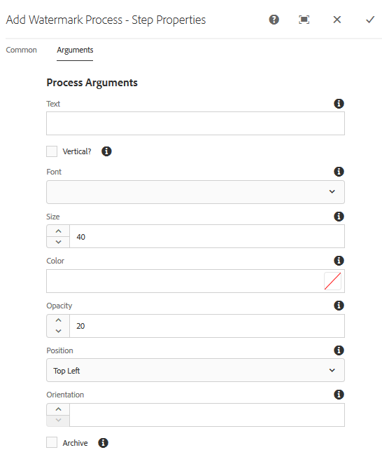

# Marque com água seus ativos digitais {#watermarking}

Os ativos Adobe Experience Manager (AEM) permitem que você adicione uma marca d&#39;água digital aos ativos que ajudam os usuários a verificar a autenticidade e a propriedade de direitos autorais dos ativos. O AEM Assets oferece suporte para texto a ser usado como marca d&#39;água em arquivos PNG e JPEG.

Para poder aplicar uma marca d&#39;água em ativos, adicione a etapa de marca d&#39;água no fluxo de trabalho Atualizar ativo [!UICONTROL do] DAM.

1. Acesse a interface do usuário do AEM e vá até **[!UICONTROL Ferramentas]** > **[!UICONTROL Fluxo de trabalho]** > **[!UICONTROL Modelos]**.
1. Na página Modelos **[!UICONTROL de]** fluxo de trabalho, selecione o fluxo de trabalho do ativo **[!UICONTROL de atualização]** DAM e clique em **[!UICONTROL Editar]**.

1. No painel lateral, arraste a etapa **[!UICONTROL Adicionar marca d&#39;água]** para o fluxo de trabalho Atualizar ativo [!UICONTROL do] DAM.

   ![Arraste a etapa [!UICONTROL Adicionar marca d&#39;água] e adicione ao fluxo de trabalho do ativo [!UICONTROL de atualização] DAM](assets/add_watermark_step_aem_assets.png)2
   *Figura: Arraste a etapa[!UICONTROL Adicionar marca d&#39;água]e adicione ao fluxo de trabalho do ativo[!UICONTROL de atualização do]DAM*

   >[!NOTE]
   >
   >Coloque a etapa [!UICONTROL Adicionar marca d&#39;água] em qualquer lugar antes da etapa [!UICONTROL Processar miniatura] .

1. Abra a etapa **[!UICONTROL Adicionar marca d&#39;água]** para exibir suas propriedades.
1. Na guia **[!UICONTROL Argumentos]** , especifique valores válidos nos vários campos, incluindo texto, tipo de fonte, tamanho, cor, posição, orientação e assim por diante. Para confirmar as alterações, toque/clique no ícone Concluído.

   

   *Figura: Forneça os argumentos na etapa adicionar marca d&#39;água em Ativos*

1. Save the **[!UICONTROL DAM Update Asset]** workflow with the watermark step.
1. Na interface do usuário Ativos, faça upload de um ativo de amostra. A marca d&#39;água é exibida com o tamanho da fonte, a cor e assim por diante, na posição configurada nas etapas acima.
