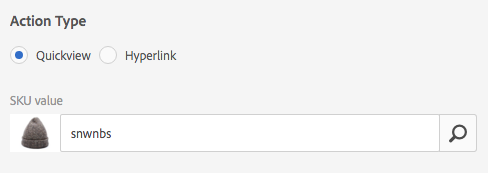
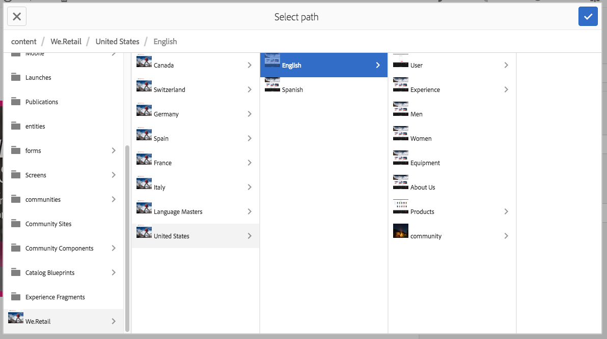

# Trabalhar com seletores {#working-with-selectors}

Ao trabalhar com uma Imagem interativa, Vídeo interativo ou Banner do carrossel, você seleciona ativos e seleciona sites e produtos para hotspots e mapas de imagem para serem vinculados. Ao trabalhar com Conjuntos de imagens, Conjuntos de rotação e Conjuntos de multimídia, você também seleciona ativos com o Seletor de ativos.

Este tópico aborda como usar os seletores de Produto, Site e Ativo, incluindo a capacidade de navegar, filtrar e classificar nos seletores.

Você acessa os seletores enquanto cria conjuntos de carrossel, adiciona pontos de acesso e mapas de imagem, criando vídeos e imagens interativos.

Por exemplo, neste banner de carrossel, você usa o seletor de produto se estiver vinculando um ponto de acesso ou mapa de imagem a uma página de visualização rápida. Use o seletor de sites se estiver vinculando um ponto de acesso ou mapa de imagem a um hiperlink; use o seletor de ativos ao criar um slide.

Ao selecionar (em vez de inserir manualmente) para onde os pontos de acesso ou mapas de imagem são direcionados, você está usando o seletor. O Seletor de sites só funciona se você for um cliente do Experience Manager Sites. O seletor de produtos também exige o Experience Manager Commerce.

## Usar seletor de produto {#selecting-products}

Use o seletor de produtos para escolher um produto quando quiser um ponto de acesso ou mapa de imagem que forneça uma exibição rápida para um produto específico em seu catálogo de produtos.

1. Navegue até o Conjunto de carrosséis, Imagem interativa ou Vídeo interativo e selecione a **[!UICONTROL Ações]** guia (disponível somente se tiver definido um ponto de acesso ou mapa de imagem).

   O seletor de produto está na **[!UICONTROL Tipo de ação]** área.

   

1. Selecione o **[!UICONTROL Seletor de produto]** (lupa) e navegue até um produto no catálogo.

   

   Filtrar por palavra-chave ou tag tocando **[!UICONTROL Filtro]** e digitando palavras-chave, selecionando tags ou ambos.

   

   Alterar onde o Experience Manager procura dados do produto ao tocar **[!UICONTROL Procurar]** e navegar para outra pasta.

   

   Selecionar **[!UICONTROL Ordenar]** por para alterar se o Experience Manager classifica do mais novo para o mais antigo ou do mais antigo para o mais recente.

   

   Selecionar **[!UICONTROL Exibir como]** para alterar a exibição de produtos - **[!UICONTROL Exibição de lista]** ou **[!UICONTROL Exibição de cartão]**.

   

1. Depois que o produto é selecionado, o campo é preenchido com o nome e a miniatura do produto.

   

1. Quando em **[!UICONTROL Visualizar]** , você pode selecionar o ponto de acesso ou mapa de imagem e ver a aparência do Quickview.

   

## Usar seletor de sites {#selecting-sites}

Use o seletor de sites para escolher uma página da Web quando quiser que um ponto de acesso ou mapa de imagem se vincule a uma página da Web gerenciada no Experience Manager Sites.

1. Navegue até o Conjunto de carrosséis, Imagem interativa ou Vídeo interativo e selecione a **[!UICONTROL Ações]** guia (disponível somente se tiver definido um ponto de acesso ou mapa de imagem).

   O Seletor de site está na área **[!UICONTROL Tipo de ação]**.

   

1. Selecione o **[!UICONTROL Seletor de sites]** (pasta com lupa) e navegue até uma página no Experience Manager Sites à qual você deseja vincular o ponto de acesso ou mapa de imagem.

   

1. Depois que o site é selecionado, o campo é preenchido com o caminho.

   

1. Quando em **[!UICONTROL Visualizar]** se selecionar o ponto de acesso ou mapa de imagem, você navegará para a página do site de Experience Manager especificada.

## Usar o Seletor de ativos {#selecting-assets}

Use esse seletor para escolher imagens para usar em um banner de carrossel, um vídeo interativo, conjuntos de imagens, conjuntos de mídia mista e conjuntos de rotação. No Vídeo interativo, o seletor de ativos está disponível ao selecionar **[!UICONTROL Selecionar ativos]** no **[!UICONTROL Conteúdo]** guia. Em Conjuntos de carrossel, o seletor de ativos está disponível ao criar um slide. Em Conjuntos de imagens, Conjuntos de mídias mistas e Conjuntos de rotação, o seletor de ativos fica disponível ao criar um Conjunto de imagens, Conjunto de mídias mistas ou Conjunto de rotação, respectivamente.

Consulte também [Seletor de ativos](search-assets.md#assetpicker) para obter mais informações.

1. Navegue até o Conjunto de carrosséis e crie um slide. Ou, navegue até o Vídeo interativo, acesse o menu **[!UICONTROL Conteúdo]** e selecione ativos. Ou crie um Conjunto de mídia mista, Conjunto de imagens ou Conjunto de rotação.
1. Selecione o **[!UICONTROL Seletor de ativos]** (pasta com lupa) e navegue até um ativo.

   

   Filtrar por palavra-chave ou tag tocando **[!UICONTROL Filtro]** e digitando palavras-chave, adicionando critérios ou ambos.

   

   Alterar o local em que o Experience Manager navega por ativos ao navegar para outra pasta na **[!UICONTROL Caminho]** campo.

   Selecionar **[!UICONTROL Coleção]** para pesquisar apenas ativos dentro de coleções.

   

   Selecionar **[!UICONTROL Exibir como]** para alterar a exibição de produtos - **[!UICONTROL Exibição de lista]**, **[!UICONTROL Exibição de coluna]** ou **[!UICONTROL Exibição de cartão]**.

   

1. Selecione o ativo tocando na marca de seleção. O ativo é exibido.

   
