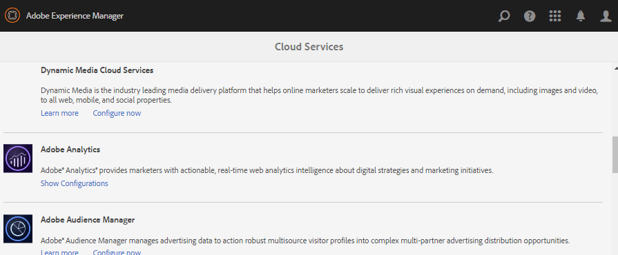
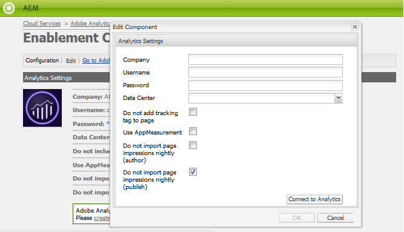

# Configuração do Analytics para recursos das comunidades {#analytics-configuration-for-communities-features}

## Visão geral {#overview}

O Adobe Analytics e o Adobe Experience Manager (AEM) são soluções da Adobe Experience Cloud.

O Adobe Analytics pode ser configurado para o AEM Communities de forma que, à medida que um membro interage com os recursos compatíveis do Communities, os eventos sejam enviados para o Adobe Analytics a partir do qual os relatórios são gerados.

Por exemplo, no site da comunidade, os administradores podem ver vários relatórios sobre a reprodução do vídeo.

Além disso, a análise é necessária para:

* No ambiente de publicação:

   * Relatórios sobre a comunidade [tendências](/help/communities/trends.md)
   * Permitir que visitantes do site classifiquem por &quot;mais visualizados&quot;, &quot;mais ativos&quot;, &quot;mais curtidos&quot;
   * Exibir contagens em listas UGC (Conteúdo gerado pelo usuário)

* No ambiente de criação:

   * Exibição dos dados de participação no [console de gerenciamento de membros](/help/communities/members.md) (visualizações, publicações, seguidores, curtidas)
   * Resumo de tendências, heartbeat de vídeo e dispositivo de vídeo para obter recursos de ativação [relatórios](/help/communities/reports.md)

Os recursos compatíveis do Communities incluem:

* [Fórum](/help/communities/forum.md)
* [QnA](/help/communities/working-with-qna.md)
* [Blog](/help/communities/blog-feature.md)
* [Biblioteca de arquivos](/help/communities/file-library.md)
* [Calendário](/help/communities/calendar.md)

Esta seção da documentação descreve como conectar um conjunto de relatórios do Analytics com recursos das Comunidades. As etapas básicas são:

1. [Replicar a chave de criptografia](#replicate-the-crypto-key) para garantir que a criptografia/descriptografia ocorra corretamente em todas as instâncias do AEM
1. Preparar uma Adobe Analytics [conjunto de relatórios](#adobe-analytics-report-suite-for-video-reporting)
1. Criar uma análise de AEM [Cloud Service](#aem-analytics-cloud-service-configuration) e [estrutura](#aem-analytics-framework-configuration)

1. [Ativar o Analytics](#enable-analytics-for-a-community-site) para um site da comunidade
1. [**Verificar**](#verify-analytics-to-aem-variable-mapping) Mapeamento de variáveis do Analytics para o AEM
1. Identificar [editor principal](#primary-publisher)
1. [Publish](#publish-community-site-and-analytics-cloud-service) o site da comunidade
1. Configurar [importação de dados do relatório](#obtaining-reports-from-analytics) do Adobe Analytics para o site da comunidade

## Pré-requisitos {#prerequisites}

Para configurar os recursos do Analytics for Communities, é necessário trabalhar com seu representante de conta para configurar uma conta do Adobe Analytics e [conjunto de relatórios](#adobe-analytics-report-suite-for-video-reporting). Uma vez estabelecidas, as seguintes informações devem estar disponíveis:

* **Nome da empresa**

  A empresa associada à conta do Adobe Analytics.

* **Nome do usuário**

  O nome de usuário de logon do usuário autorizado a gerenciar a conta do Analytics (deve incluir privilégios de Acesso ao serviço da Web).

* **Senha**

  A senha de logon do usuário autorizado.

* **Centro de dados do Analytics**

  A URL do data center do Analytics para a conta.

* **Report Suite**

  O nome do conjunto de relatórios do Analytics que será usado.

## Conjunto de relatórios Adobe Analytics para relatórios de vídeo {#adobe-analytics-report-suite-for-video-reporting}

Uso do Adobe Experience Cloud [Gerenciador de conjunto de relatórios](https://experienceleague.adobe.com/docs/analytics/admin/admin-tools/manage-report-suites/c-new-report-suite/new-report-suite.html), os conjuntos de relatórios do Analytics podem ser configurados para que um site da comunidade possa ser habilitado para fornecer relatórios para os recursos do Communities.

Ao fazer logon no [Adobe Experience Cloud](https://experienceleague.adobe.com/docs/analytics/analyze/analysis-workspace/home.html) com [Nome da empresa e nome de usuário](/help/communities/analytics.md#prerequisites), é possível configurar um conjunto de relatórios novo ou existente para ter:

* [11 Variáveis de conversão](https://experienceleague.adobe.com/docs/analytics/admin/admin-tools/manage-report-suites/edit-report-suite/conversion-variables/conversion-var-admin.html) (eVars)

   * **`evar1`** até **`evar11`** habilitado

   * Pode redefinir (renomear) eVars existentes ou criar outras para usar nos recursos das comunidades

* [7 eventos bem-sucedidos](https://experienceleague.adobe.com/docs/analytics/admin/admin-tools/manage-report-suites/edit-report-suite/conversion-variables/success-events/success-event.html) (eventos)

   * **`event1`** até **`event7`** habilitado

   * type **`Counter`**

      * não **`Counter (no subrelations)`**

   * Pode redefinir (renomear) eventos existentes ou criar eventos para usar nos recursos das Comunidades

* [Gerenciamento de vídeo](https://experienceleague.adobe.com/docs/media-analytics/using/media-overview.html)

   * Console de relatório de vídeo

      * Ativar `Video Core`
      * Selecione Salvar

   * Console de medição do vídeo principal

      * Selecionar `Use Solution Variables`
      * Selecione Salvar

Se estiver usando um **novo conjunto de relatórios**, um novo conjunto de relatórios pode ter apenas 4 evars e 6 variáveis de evento, enquanto 11 evars e 7 vars de evento são necessários para as Comunidades.

Se estiver usando um **conjunto de relatórios existente**, pode ser necessário [modificar o mapeamento de variáveis](#modifying-analytics-variable-mapping) antes de ativar a estrutura do Analytics para um site da comunidade.

Entre em contato com seu representante de conta para obter informações sobre as variáveis dedicadas às Comunidades.

>[!CAUTION]
>
>**Se estiver usando um conjunto de relatórios existente que já usa variáveis no**
>
>* **`evar1`** a **`evar11`**
>
>* **`event1`** a **`event7`**
>
>**Antes de o site da comunidade ser publicado,** é importante restaurar o mapeamento pré-existente movendo as variáveis do AEM que foram mapeadas automaticamente para as variáveis do Analytics quando o Analytics foi ativado para um site da comunidade.
>
>Para restaurar o mapeamento pré-existente e mover variáveis de AEM para outras variáveis do Analytics, consulte a seção sobre [Modificação do mapeamento de variáveis do Analytics](#modifying-analytics-variable-mapping).
>
>Se isso não for feito, poderá ocorrer perda irrecuperável de dados.

### Video Heartbeat Analytics {#video-heartbeat-analytics}

Quando o Video Heartbeat Analytics é licenciado, uma `Marketing Cloud Org Id` é atribuído.

Para ativar os relatórios do Video Heartbeat após [configuração do conjunto de relatórios do Analytics para relatórios de vídeo](#adobe-analytics-report-suite-for-video-reporting):

* Criar um [serviço Analytics Cloud](#aem-analytics-cloud-service-configuration)
* Ativar [Analytics para um site da comunidade](#enable-analytics-for-a-community-site)
* Associe o `Marketing Cloud Org Id` com o site da comunidade

A variável `Marketing Cloud Org Id` pode ser inscrito no momento da [criação de site da comunidade](/help/communities/sites-console.md) ou posteriormente por [modificação](/help/communities/sites-console.md#modifying-site-properties) as propriedades do site da comunidade.


Quando o Video Heartbeat Analytics está ativado, o código JavaScript (JS) do reprodutor de vídeo instancia o código da biblioteca de heartbeat de vídeo (também em JS). O código lida com toda a lógica de envio de atualizações de status de vídeo aos servidores de rastreamento de vídeo do Analytics a cada 10 segundos (não configurável). Ele eventualmente envia um relatório cumulativo da sessão de vídeo para os principais servidores do Analytics.

Se não estiver ativado, o código de heartbeat de vídeo nunca será instanciado e somente o progresso do vídeo e o rastreamento da retomada da posição serão mantidos no SRP para os relatórios.

## Configuração do serviço AEM Analytics Cloud {#aem-analytics-cloud-service-configuration}

Para criar uma Integração do Analytics, que integra o Adobe Analytics ao site da comunidade AEM, usando a interface padrão na instância do autor:

* Na navegação global: **[!UICONTROL Ferramentas]** > **[!UICONTROL Implantação]** > **[!UICONTROL Cloud Service]**
* Role para baixo até **[!UICONTROL Adobe Analytics]**
* Selecionar **[!UICONTROL Configurar agora]** ou **[!UICONTROL Exibir configurações]**



### Caixa de diálogo Criar configuração {#create-configuration-dialog}

* Selecionar `[+]` ícone ao lado de **[!UICONTROL Configurações disponíveis]** para que você possa criar uma configuração.

Na caixa de diálogo Criar configuração, os valores a serem inseridos identificam a configuração.


* **Título**

  (Obrigatório) Um título de exibição para a configuração.
Por exemplo, insira *Análise da comunidade*

* **Nome**

  (Opcional) Se não for especificado, o nome assumirá como padrão um nome de nó válido derivado do título.
Por exemplo, insira *comunidades*

* **Modelo**

  Selecionar `Adobe Analytics Configuration`

* Selecionar **Criar**

   * Inicia a página de configuração e abre `Analytics Settings` caixa de diálogo

### Caixa de diálogo Configurações do Analytics {#analytics-settings-dialog}

A criação inicial de uma nova configuração do Analytics resulta na exibição da configuração e de uma nova caixa de diálogo para a entrada das Configurações do Analytics. Essa caixa de diálogo requer o [informações da conta de pré-requisito](#prerequisites) obtido junto do representante de conta.



* **Empresa**

  A empresa associada à conta do Adobe Analytics.

* **Nome do usuário**

  O nome de usuário de logon do usuário autorizado a gerenciar a conta do Analytics.

* **Senha**

  A senha de logon do usuário autorizado.

* **Centro de dados**

  Selecione o data center do Analytics que hospeda o conjunto de relatórios.

* **Não adicionar a tag de rastreamento à página**

  Deixar como padrão (desmarcado).

* **Usar AppMeasurement**

  Deixar como padrão (desmarcado).

* **Não realizar importações de impressões de página todas as noites (autor)**

  Deixar como padrão (desmarcado).

* **Não realizar importações de impressões de página todas as noites (publicar)**

  Deixar como padrão (desmarcado).

Para salvar as configurações:

* Selecionar **Conectar-se ao Analytics**

   * Se não for bem-sucedido,

      * Verifique se as entradas não contêm espaços à esquerda.
      * Experimente um data center diferente.

* Selecionar **OK**.

  

### Criar estrutura {#create-framework}

Após a configuração bem-sucedida da conexão básica com o Adobe Analytics, é necessário criar ou editar uma estrutura para o site da comunidade. A finalidade da estrutura é mapear variáveis de recurso das Comunidades (AEM) para variáveis do Analytics (conjunto de relatórios).

* Selecionar `[+]` ícone ao lado de **[!UICONTROL Estruturas disponíveis]** para que você possa criar uma estrutura.

  

* **Título**

  (Obrigatório) Um título de exibição para a estrutura. Por exemplo, insira *Quadro comunitário*.

* **Nome**

  (Opcional) Se não for especificado, o nome assumirá como padrão um nome de nó válido derivado do título.
Por exemplo, insira *comunidades*.

* *Modelo*

  Selecionar `Adobe Analytics Framework`.

* Selecione **Criar**.

A criação da Estrutura do Analytics abre a estrutura para configuração.

## Configuração de estrutura analítica do AEM {#aem-analytics-framework-configuration}

A finalidade da estrutura é mapear variáveis do AEM para variáveis do Analytics (eVars e eventos). As variáveis do Analytics disponíveis para mapeamento são [definido no conjunto de relatórios](#adobe-analytics-report-suite-for-video-reporting).


### Selecionar conjunto de relatórios {#select-report-suite}

Selecione o conjunto de relatórios que foi configurado para o relatório de vídeo.

Se um conjunto de relatórios ainda não tiver sido criado ou configurado incorretamente, consulte a seção anterior:
[Conjunto de relatórios Adobe Analytics para relatórios de vídeo](#adobe-analytics-report-suite-for-video-reporting)

O Sidekick não é necessário e pode ser minimizado para que não obstrua o acesso às configurações dos Conjuntos de relatórios.

#### Caixa de diálogo Conjuntos de relatórios antes e depois de selecionar &quot;Adicionar item&quot; {#report-suites-dialog-before-and-after-selecting-add-item}


1. Selecionar **Adicionar item +**.

   Duas caixas suspensas são exibidas.

1. Escolha um `Report suite.`

   Os conjuntos de relatórios associados à Conta da empresa estão disponíveis para seleção.

1. Selecionar **Sim** na caixa de diálogo que é aberta:

   ```
   Load default server settings?
    Do you want to load the default server settings and overwrite current values in the Server section?
   ```

1. Escolha um `Run Mode`.

1. Selecionar **Publish**.


O Analytics Cloud Service e a estrutura agora estão concluídos. Os Mapeamentos são definidos após a criação de um site da comunidade com este serviço do Analytics ativado.

## Ativar o Analytics para um site da comunidade {#enable-analytics-for-a-community-site}

### Ativar para novo site da comunidade {#enable-for-new-community-site}

Para adicionar o serviço Analytics Cloud enquanto [criação de um site da comunidade](/help/communities/sites-console.md):

* Na etapa 3, sob o [Guia ANALYTICS](/help/communities/sites-console.md#analytics):
   * Selecione o **Ativar o Analytics** caixa de seleção
   * Selecione a estrutura na caixa suspensa.

* Opcionalmente, retorne à configuração da estrutura do Analytics para ajustar os mapeamentos da variável.

### Ativar para site da comunidade existente {#enable-for-existing-community-site}

Para adicionar o serviço Analytics Cloud a um [site da comunidade existente](/help/communities/sites-console.md#modifying-site-properties):

* Navegue até a **Comunidades > Sites** console.
* Selecione o ícone Editar site da comunidade.
* Selecione as CONFIGURAÇÕES.
* Na seção Analytics:
   * Selecione o **Ativar o Analytics** caixa de seleção
   * Escolha a estrutura na caixa suspensa.

* Opcionalmente, retorne à configuração da estrutura do Analytics para ajustar os mapeamentos da variável.

### Ativar para sites personalizados {#enable-for-customized-sites}

Para que o rastreamento e a importação do Analytics funcionem corretamente em um site da comunidade, um elemento de página com a `scf-js-site-title` os atributos class e href devem estar presentes. Apenas um desses elementos deve existir na página, como ocorre em um `sitepage.hbs` script para um site da comunidade. O valor de `siteUrl` é extraído e enviado para o Adobe Analytics como a *caminho do site*.

```xml
# present in default sitepage.hbs
# only one scf-js-site-title class should be included
# this example sets it to be hidden as it serves no visual purpose
<div
    class="navbar-brand scf-js-site-title"
    href="{{siteUrl}}.html"
    style="visibility: hidden;"
>
</div>
```

Para um **site personalizado da comunidade** que se sobrepõe ao `sitepage.hbs` verifique se o elemento está presente. A variável `siteUrl` é definida quando renderizada no servidor antes de servir ao cliente.

Para um **site genérico de AEM** que inclui componentes do Communities, mas não é criada com o [assistente de criação de site](/help/communities/sites-console.md), é necessário adicionar o elemento. O valor de href deve ser o caminho para o site. Por exemplo, se o caminho do site for `/content/my/company/en`, use:

```xml
<div
    class="navbar-brand scf-js-site-title"
    href="/content/my/company/en.html"
    style="visibility: hidden;"
>
</div>
```

## Recursos do Analytics for Communities {#analytics-for-communities-features}

O Analytics é usado automaticamente para vários recursos das Comunidades.

O ambiente do autor [Configuração OSGi](/help/sites-deploying/configuring-osgi.md), `AEM Communities Analytics Component Configuration`, fornece uma lista dos componentes que foram instrumentados para o Analytics. O mapeamento automático de variáveis é determinado pelos componentes listados.

Se novos componentes personalizados forem criados e instrumentados para o Analytics, eles deverão ser adicionados a esta lista de componentes configurados.

### Configuração do componente {#component-configuration}


>[!NOTE]
>
>Os componentes do journal são usados para implementar o recurso de blog.

### Mapeamento do Analytics para variáveis AEM {#mapped-analytics-to-aem-variables}

Depois que o site da comunidade é salvo, com o Analytics ativado e a estrutura de configuração da nuvem selecionada, as variáveis AEM são mapeadas automaticamente para as eVars e os eventos do Analytics. Ela começa com evar1 e event1, respectivamente, e é incrementada em 1.

Se estiver usando um conjunto de relatórios existente que mapeou qualquer uma das variáveis de evar1 a evar11 e de event1 a event7, será necessário [remapear as variáveis AEM](#modifying-analytics-variable-mapping) e restaure o mapeamento original.

Veja a seguir um exemplo de mapeamentos padrão:


#### Mapa de eVars enviados com cada evento {#map-of-evars-sent-with-each-event}

<table>
 <tbody>
  <tr>
   <td><strong> </strong></td>
   <td><strong>Ativação<br /> Recurso<br /> Tipo</strong></td>
   <td><strong>Site<br /> Título</strong></td>
   <td><strong>Função<br /> Tipo</strong></td>
   <td><strong>Grupo<br /> Título</strong></td>
   <td><strong>Grupo<br /> Caminho</strong></td>
   <td><strong>UGC<br /> Tipo</strong></td>
   <td><strong>UGC<br /> Título</strong></td>
   <td><strong>Usuário<br /> (Membro)</strong></td>
   <td><strong>UGC<br /> Caminho</strong></td>
   <td><strong>Site<br /> Caminho</strong></td>
  </tr>
  <tr>
   <td><strong> </strong></td>
   <td><strong>EVAR 1</strong></td>
   <td><strong>EVAR 2</strong></td>
   <td><strong>EVAR 3</strong></td>
   <td><strong>EVAR 4</strong></td>
   <td><strong>EVAR 5</strong></td>
   <td><strong>EVAR 6</strong></td>
   <td><strong>EVAR 7</strong></td>
   <td><strong>EVAR 8</strong></td>
   <td><strong>EVAR 9</strong></td>
   <td><strong>eVar 10</strong></td>
  </tr>
  <tr>
   <td><strong>event1<br /> Reprodução do recurso</strong></td>
   <td><em>a)</em></td>
   <td><em>-</em></td>
   <td><em>-</em></td>
   <td><em>-</em></td>
   <td><em>-</em></td>
   <td><em>-</em></td>
   <td><em>-</em></td>
   <td><em>-</em></td>
   <td><em>i)</em></td>
   <td><em>-</em></td>
  </tr>
  <tr>
   <td><strong>event2<br /> SCFView</strong></td>
   <td><em>a)</em></td>
   <td><em>b)</em></td>
   <td><em>c)</em></td>
   <td><em>d)</em></td>
   <td><em>e)</em></td>
   <td><em>f)</em></td>
   <td><em>g)</em></td>
   <td><em>h)</em></td>
   <td><em>i)</em></td>
   <td><em>j)</em></td>
  </tr>
  <tr>
   <td><strong>event3<br /> SCFCreate (Pós)</strong></td>
   <td><em>-</em></td>
   <td><em>b)</em></td>
   <td><em>c)</em></td>
   <td><em>d)</em></td>
   <td><em>e)</em></td>
   <td><em>f)</em></td>
   <td><em>g)</em></td>
   <td><em>h)</em></td>
   <td><em>i)</em></td>
   <td><em>j)</em></td>
  </tr>
  <tr>
   <td><strong>event4<br /> SCFFollow</strong></td>
   <td><em>-</em></td>
   <td><em>b)</em></td>
   <td><em>c)</em></td>
   <td><em>d)</em></td>
   <td><em>e)</em></td>
   <td><em>f)</em></td>
   <td><em>g)</em></td>
   <td><em>h)</em></td>
   <td><em>i)</em></td>
   <td><em>j)</em></td>
  </tr>
  <tr>
   <td><strong>event5<br /> SCFVoteUp</strong></td>
   <td><em>-</em></td>
   <td><em>b)</em></td>
   <td><em>c)</em></td>
   <td><em>d)</em></td>
   <td><em>e)</em></td>
   <td><em>f)</em></td>
   <td><em>g)</em></td>
   <td><em>h)</em></td>
   <td><em>i)</em></td>
   <td><em>j)</em></td>
  </tr>
  <tr>
   <td><strong>evento6<br /> SCFVoteDown</strong></td>
   <td><em>-</em></td>
   <td><em>b)</em></td>
   <td><em>c)</em></td>
   <td><em>d)</em></td>
   <td><em>e)</em></td>
   <td><em>f)</em></td>
   <td><em>g)</em></td>
   <td><em>h)</em></td>
   <td><em>i)</em></td>
   <td><em>j)</em></td>
  </tr>
  <tr>
   <td><strong>event7<br /> SCFRate</strong></td>
   <td><em>-</em></td>
   <td><em>b)</em></td>
   <td><em>c)</em></td>
   <td><em>d)</em></td>
   <td><em>e)</em></td>
   <td><em>f)</em></td>
   <td><em>g)</em></td>
   <td><em>h)</em></td>
   <td><em>i)</em></td>
   <td><em>j)</em></td>
  </tr>
 </tbody>
</table>

**Exemplos para valores de eVar:**

* *[Tipo MIME](https://www.iana.org/assignments/media-types/media-types.xhtml)*: video/mp4
* *[título do site da comunidade](/help/communities/sites-console.md#step13asitetemplate)*: Comunidades do Geometrixx
* *[nome da função da comunidade](/help/communities/functions.md)*: Fórum
* *[nome do grupo da comunidade](/help/communities/creating-groups.md#creating-a-new-group)*: Caminhada
* *caminho para o conteúdo do grupo da comunidade*: `/content/sites/<site name>/en/groups/hiking`
* *[ResourceType do componente UGC](/help/communities/essentials.md)*: `social/forum/components/hbs/topic`
* *Título do componente UGC*: Tópicos sobre caminhada
* *logon (authorizableId)*: `aaron.mcdonald@mailinator.com`
* *Caminho SRP para UGC*: `/content/usergenerated/asi/.../forum/jmtz-topic3`
ou *caminho do componente a seguir*: `/content/sites/<site name>/en/jcr:content/content/primary/forum`

* *caminho para o conteúdo do site da comunidade*: `/content/sites/<site name>/en`

### Modificação do mapeamento de variáveis do Analytics {#modifying-analytics-variable-mapping}

O mapeamento de eVars e eventos do Analytics para variáveis AEM é visível na configuração da estrutura depois que o Analytics é ativado para um site da comunidade.

Após a ativação do Analytics e antes da publicação do site da comunidade, o mapeamento pode ser alterado na estrutura. Basta arrastar a eVar ou o evento do Analytics desejado do painel esquerdo e soltá-lo na linha relevante na tabela de mapeamento.

Para evitar mapeamentos duplicados, remova a evar ou o evento do Analytics substituído da linha, passando o mouse sobre ela e selecionando o &quot;X&quot; que aparece à direita do elemento de variável do Analytics.

Se as eVars e os eventos do Communities substituírem os mapeamentos pré-existentes no conjunto de relatórios, para evitar perda de dados, atribua as variáveis AEM dos recursos Communities a outras eVars ou eventos do Analytics e restaure os mapeamentos originais.

>[!CAUTION]
>
>É importante remapear antes que o site da comunidade seja [publicado](#publishing-the-community-site) com o Analytics ativado, há o risco de perda de dados.

#### Exemplo Etapa 1: arrastar a evar14 do Analytics para a tabela de mapeamento {#example-step-dragging-analytics-evar-into-mapping-table}


#### Exemplo Etapa 2: seleção de &quot;x&quot; para remover a evar11 substituída {#example-step-selecting-x-to-remove-replaced-evar}


#### Exemplo: AEM var eventdata.siteId remapeado para Analytics evar14 {#example-step-aem-var-eventdata-siteid-remapped-to-analytics-evar}


## Publicação do site da comunidade {#publishing-the-community-site}

### Verificar mapeamento de variável do Analytics para o AEM {#verify-analytics-to-aem-variable-mapping}

É recomendável verificar o mapeamento da variável antes de publicar o site da comunidade, que também publica o serviço e a estrutura do Analytics Cloud.

Consulte as seções:

* [Mapeamento do Analytics para variáveis AEM](#mapped-analytics-to-aem-variables)
* [Modificação do mapeamento de variáveis do Analytics](#modifying-analytics-variable-mapping)

>[!CAUTION]
>
>**Se estiver usando um conjunto de relatórios existente que já usa variáveis no**
>
>* **`evar1`** a **`evar11`**
>
>* **`event1`** a **`event7`**
>
>**Antes de o site da comunidade ser publicado,** restaure o mapeamento pré-existente. Mova as variáveis AEM das comunidades que foram mapeadas automaticamente (quando o Analytics foi habilitado para o site da comunidade) para outras variáveis do Analytics. Esse remapeamento deve ser consistente em todos os componentes das Comunidades.
>
>Se isso não for feito, poderá ocorrer perda irrecuperável de dados.

### Editor primário {#primary-publisher}

Quando a implantação escolhida for uma [publicar farm](/help/communities/topologies.md#tarmk-publish-farm), uma instância de publicação do AEM deve ser identificada como o publicador principal para sondagem de dados de relatório no Adobe Analytics para gravação [SRP](/help/communities/working-with-srp.md).

Por padrão, a variável `AEM Communities Publisher Configuration` A configuração OSGi identifica sua instância de publicação como o publicador principal, de modo que todas as instâncias de publicação em um farm de publicação se autoidentificariam como o principal.

Portanto, é necessário editar a configuração em todas as instâncias de publicação secundárias para desmarcar a **Editor primário** caixa de seleção

Para obter instruções específicas, consulte a seção editor principal de [Implantação de comunidades](/help/communities/deploy-communities.md#primary-publisher).

>[!CAUTION]
>
>É importante que o editor principal seja configurado para impedir a pesquisa de várias instâncias de publicação.

### Replicar a chave de criptografia {#replicate-the-crypto-key}

As credenciais do Adobe Analytics estão criptografadas. Para facilitar a replicação ou transmissão de credenciais de análise criptografadas entre o autor e os editores, todas as instâncias de AEM devem compartilhar a mesma chave de criptografia principal.

Para fazer isso, siga as instruções em [Replicar a chave de criptografia](/help/communities/deploy-communities.md#replicate-the-crypto-key).

### Publicar o site da comunidade e o serviço Analytics Cloud {#publish-community-site-and-analytics-cloud-service}

Depois que o serviço do Analytics Cloud for ativado para um site da comunidade e, se necessário, o [O mapeamento do Analytics para variáveis AEM é ajustado](#mapped-analytics-to-aem-variables), replicar a configuração no ambiente de publicação utilizando [(re)publicar o site da comunidade](/help/communities/sites-console.md#publishing-the-site).

## Obtenção de relatórios do Analytics {#obtaining-reports-from-analytics}

### Gerenciamento de Relatórios {#report-management}

O autor e o editor principal [Configuração OSGi](/help/sites-deploying/configuring-osgi.md), `AEM Communities Analytics Report Management`, é usado para consultar o Analytics.

Na criação, as consultas são para relatórios em tempo real.

No editor principal, as consultas são usadas para fornecer informações de preparação para a importação de dados analíticos do Importador de relatórios.

O padrão do intervalo de consulta é de 10 segundos.

### Importador de relatórios {#report-importer}

Depois que um site da comunidade habilitado para o Analytics for publicado, o editor principal [Configuração OSGi](/help/sites-deploying/configuring-osgi.md), `AEM Communities Analytics Report Importer`, pode ser configurado para definir o intervalo de pesquisa padrão para as configurações que não são configuradas individualmente no CRXDE.

O intervalo de pesquisa controla a frequência de solicitações à Adobe Analytics para que os dados sejam obtidos e salvos em [SRP](/help/communities/working-with-srp.md).

Quando os dados podem ser categorizados como &quot;grandes volumes de dados&quot;, as pesquisas mais frequentes podem colocar uma grande carga no site da comunidade.

A pesquisa padrão **Intervalo de importação** está definido como 12 horas.


### Personalização do relatório do componente {#component-report-customization}

Atualmente, para personalizar as métricas a serem rastreadas, são criados nós no repositório que definem períodos para os quais será gerado um relatório sobre essa métrica.

O tópico do fórum é atualmente o único exemplo dessa personalização:

* No editor principal, faça logon com privilégios administrativos.
* Navegue até [CRXDE Lite](/help/sites-developing/developing-with-crxde-lite.md). Por exemplo, [https://localhost:4503/crx/de](https://localhost:4503/crx/de).

* No `jcr:content` nó da raiz de idioma (por exemplo, `/content/sites/engage/en/jcr:content`), navegue até o componente configurado para os relatórios do Analytics.
Por exemplo, **`analytics/reportConfigs/social_forum_components_hbs_topic`**

* Observe os períodos de tempo criados:

   * `last30Days`
   * `last90Days`
   * `thisYear`

* Observe a `total`nó.

   * Modificação da **`interval`** A propriedade substitui o intervalo do Importador de relatórios.
   * O valor é em segundos e é definido como quatro horas (14400 segundos).


## Gerenciar dados do usuário no Analytics {#manage-user-data-in-analytics}

O Adobe Analytics fornece APIs que permitem acessar, exportar e excluir dados do usuário. Para obter mais informações, consulte [Enviar solicitações de acesso e de exclusão](https://experienceleague.adobe.com/docs/analytics/admin/admin-tools/data-governance/an-gdpr-workflow.html?lang=pt-BR).

## Recursos {#resources}

* Adobe Experience Cloud: [Ajuda e referência do Analytics](https://experienceleague.adobe.com/docs/analytics.html)
* AEM: [Integração com o Adobe Analytics](/help/sites-administering/adobeanalytics.md)
* AEM: [Analytics com provedores externos](/help/sites-administering/external-providers.md)
