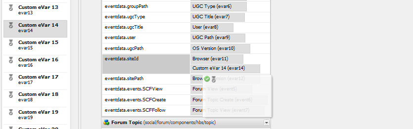

# Configuração do Analytics para recursos das comunidades {#analytics-configuration-for-communities-features}

## Visão geral {#overview}

O Adobe Analytics e o Adobe Experience Manager (AEM) são soluções da Adobe Experience Cloud.

O Adobe Analytics pode ser configurado para o AEM Communities de forma que, à medida que um membro interage com os recursos compatíveis do Communities, os eventos sejam enviados para o Adobe Analytics a partir do qual os relatórios são gerados.

Por exemplo, no site da comunidade, os administradores podem ver vários relatórios sobre a reprodução do vídeo.

Além disso, a análise é necessária para:

* No ambiente do Publish:

   * Relatórios sobre [tendências](/help/communities/trends.md) da comunidade
   * Permitir que visitantes do site classifiquem por &quot;mais visualizados&quot;, &quot;mais ativos&quot;, &quot;mais curtidos&quot;
   * Exibir contagens em listas UGC (Conteúdo gerado pelo usuário)

* No ambiente de criação:

   * Exibição de dados de participação no [console de gerenciamento de membros](/help/communities/members.md) (exibições, postagens, seguidores, curtidas)
   * Resumo de tendências, pulsação de vídeo e dispositivo de vídeo para o recurso de habilitação [relatórios](/help/communities/reports.md)

Os recursos compatíveis do Communities incluem:

* [Fórum](/help/communities/forum.md)
* [QnA](/help/communities/working-with-qna.md)
* [Blog](/help/communities/blog-feature.md)
* [Biblioteca de arquivos](/help/communities/file-library.md)
* [Calendário](/help/communities/calendar.md)

Esta seção da documentação descreve como conectar um conjunto de relatórios do Analytics com recursos das Comunidades. As etapas básicas são:

1. [Replicar a chave de criptografia](#replicate-the-crypto-key) para garantir que a criptografia/descriptografia ocorra corretamente em todas as instâncias do AEM
1. Preparar um [conjunto de relatórios](#adobe-analytics-report-suite-for-video-reporting) do Adobe Analytics
1. Criar um [Cloud Service](#aem-analytics-cloud-service-configuration) e uma [estrutura](#aem-analytics-framework-configuration) do AEM Analytics

1. [Habilitar o Analytics](#enable-analytics-for-a-community-site) para um site da comunidade
1. [**Verificar**](#verify-analytics-to-aem-variable-mapping) mapeamento de variáveis do Analytics para o AEM
1. Identificar [editor primário](#primary-publisher)
1. [Publish](#publish-community-site-and-analytics-cloud-service) o site da comunidade
1. Configurar [importação de dados de relatório](#obtaining-reports-from-analytics) do Adobe Analytics para o site da comunidade

## Pré-requisitos {#prerequisites}

Para configurar os recursos do Analytics for Communities, é necessário trabalhar com seu representante de conta para configurar uma conta da Adobe Analytics e um [conjunto de relatórios](#adobe-analytics-report-suite-for-video-reporting). Uma vez estabelecidas, as seguintes informações devem estar disponíveis:

* **Nome da Empresa**

  A empresa associada à conta do Adobe Analytics.

* **Nome de usuário**

  O nome de usuário de logon do usuário autorizado a gerenciar a conta do Analytics
(deve incluir privilégios de acesso ao serviço da Web).

* **Senha**

  A senha de logon do usuário autorizado.

* **Data Center do Analytics**

  A URL do data center do Analytics para a conta.

* **Conjunto de Relatórios**

  O nome do conjunto de relatórios do Analytics que será usado.

## Conjunto de relatórios Adobe Analytics para relatórios de vídeo {#adobe-analytics-report-suite-for-video-reporting}

Usando o [Gerenciador de conjunto de relatórios](https://experienceleague.adobe.com/docs/analytics/admin/admin-tools/manage-report-suites/c-new-report-suite/new-report-suite.html) da Adobe Experience Cloud, os conjuntos de relatórios do Analytics podem ser configurados para que um site da comunidade possa ser habilitado para fornecer relatórios para os recursos das Comunidades.

Ao entrar no [Adobe Experience Cloud](https://experienceleague.adobe.com/docs/analytics/analyze/analysis-workspace/home.html) com [Nome da Empresa e Nome de Usuário](/help/communities/analytics.md#prerequisites), é possível configurar um conjunto de relatórios novo ou existente para ter:

* [11 Variáveis de conversão](https://experienceleague.adobe.com/docs/analytics/admin/admin-tools/manage-report-suites/edit-report-suite/conversion-variables/conversion-var-admin.html) (eVars)

   * Habilitado de **`evar1`** a **`evar11`**

   * Pode redefinir (renomear) eVars existentes ou criar outras para usar nos recursos das comunidades

* [Eventos bem-sucedidos](https://experienceleague.adobe.com/docs/analytics/admin/admin-tools/manage-report-suites/edit-report-suite/conversion-variables/success-events/success-event.html) (eventos)

   * Habilitado de **`event1`** a **`event7`**

   * tipo **`Counter`**

      * não **`Counter (no subrelations)`**

   * Pode redefinir (renomear) eventos existentes ou criar eventos para usar nos recursos das Comunidades

* [Gerenciamento de vídeo](https://experienceleague.adobe.com/docs/media-analytics/using/media-overview.html)

   * Console de relatório de vídeo

      * Habilitar `Video Core`
      * Selecione Salvar

   * Console de medição do vídeo principal

      * Selecionar `Use Solution Variables`
      * Selecione Salvar

Se estiver usando um **novo conjunto de relatórios**, um novo conjunto de relatórios poderá ter apenas 4 evars e 6 variáveis de evento, enquanto 11 evars e 7 vars de evento serão necessários para as Comunidades.

Se estiver usando um **conjunto de relatórios existente**, talvez seja necessário [modificar o mapeamento de variáveis](#modifying-analytics-variable-mapping) antes de ativar a estrutura do Analytics para um site da comunidade.

Entre em contato com seu representante de conta para obter informações sobre as variáveis dedicadas às Comunidades.

>[!CAUTION]
>
>**Se estiver usando um conjunto de relatórios existente que já usa variáveis dentro de**
>
>* **`evar1`** a **`evar11`**
>
>* **`event1`** a **`event7`**
>
>**Antes de publicar o site da comunidade**, é importante restaurar o mapeamento preexistente, movendo as variáveis do AEM que foram mapeadas automaticamente para as variáveis do Analytics quando o Analytics foi habilitado para um site da comunidade.
>
>Para restaurar o mapeamento pré-existente e mover variáveis de AEM para outras variáveis do Analytics, consulte a seção em [Modificação do mapeamento de variáveis do Analytics](#modifying-analytics-variable-mapping).
>
>Se isso não for feito, poderá ocorrer perda irrecuperável de dados.

### Video Heartbeat Analytics {#video-heartbeat-analytics}

Quando o Video Heartbeat Analytics é licenciado, um `Marketing Cloud Org Id` é atribuído.

Para habilitar os relatórios de Pulsação de vídeo após [configurar o conjunto de relatórios do Analytics para relatórios de vídeo](#adobe-analytics-report-suite-for-video-reporting):

* Criar um [serviço Analytics Cloud](#aem-analytics-cloud-service-configuration)
* Habilitar o [Analytics para um site da comunidade](#enable-analytics-for-a-community-site)
* Associar o `Marketing Cloud Org Id` ao site da comunidade

O `Marketing Cloud Org Id` pode ser inserido no momento da [criação do site da comunidade](/help/communities/sites-console.md) ou posteriormente por [modificação](/help/communities/sites-console.md#modifying-site-properties) das propriedades do site da comunidade.


Quando o Video Heartbeat Analytics está ativado, o código do JavaScript (JS) para o reprodutor de vídeo instancia o código da biblioteca de heartbeat de vídeo (também em JS). O código lida com toda a lógica de envio de atualizações de status de vídeo aos servidores de rastreamento de vídeo do Analytics a cada 10 segundos (não configurável). Ele eventualmente envia um relatório cumulativo da sessão de vídeo para os principais servidores do Analytics.

Se não estiver ativado, o código de heartbeat de vídeo nunca será instanciado e somente o progresso do vídeo e o rastreamento da retomada da posição serão mantidos no SRP para os relatórios.

## Configuração do serviço AEM Analytics Cloud {#aem-analytics-cloud-service-configuration}

Para criar uma Integração do Analytics, que integra o Adobe Analytics ao site da comunidade AEM, usando a interface padrão na instância do autor:

* Da navegação global: **[!UICONTROL Ferramentas]** > **[!UICONTROL Implantação]** > **[!UICONTROL Cloud Service]**
* Role para baixo até **[!UICONTROL Adobe Analytics]**
* Selecione **[!UICONTROL Configurar Agora]** ou **[!UICONTROL Mostrar Configurações]**


### Caixa de diálogo Criar configuração {#create-configuration-dialog}

* Selecione o ícone `[+]` ao lado de **[!UICONTROL Configurações Disponíveis]** para que você possa criar uma configuração.

Na caixa de diálogo Criar configuração, os valores a serem inseridos identificam a configuração.


* **Título**

  (Obrigatório) Um título de exibição para a configuração.
Por exemplo, digite *Análises da comunidade*

* **Nome**

  (Opcional) Se não for especificado, o nome assumirá como padrão um nome de nó válido derivado do título.
Por exemplo, insira *comunidades*

* **Modelo**

  Selecionar `Adobe Analytics Configuration`

* Selecionar **Criar**

   * Inicia a página de configuração e abre a caixa de diálogo `Analytics Settings`

### Caixa de diálogo Configurações do Analytics {#analytics-settings-dialog}

A criação inicial de uma nova configuração do Analytics resulta na exibição da configuração e de uma nova caixa de diálogo para a entrada das Configurações do Analytics. Esta caixa de diálogo requer as [informações de conta de pré-requisito](#prerequisites) obtidas do representante de conta.


* **Empresa**

  A empresa associada à conta do Adobe Analytics.

* **Nome do usuário**

  O nome de usuário de logon do usuário autorizado a gerenciar a conta do Analytics.

* **Senha**

  A senha de logon do usuário autorizado.

* **Data Center**

  Selecione o data center do Analytics que hospeda o conjunto de relatórios.

* **Não adicionar marca de rastreamento à página**

  Deixar como padrão (desmarcado).

* **Usar AppMeasurement**

  Deixar como padrão (desmarcado).

* **Não realizar importações de impressões de página todas as noites (autor)**

  Deixar como padrão (desmarcado).

* **Não realizar importações de impressões de página todas as noites (publicar)**

  Deixar como padrão (desmarcado).

Para salvar as configurações:

* Selecione **Conectar ao Analytics**

   * Se não for bem-sucedido,

      * Verifique se as entradas não contêm espaços à esquerda.
      * Experimente um data center diferente.

* Selecione **OK**.

  

### Criar estrutura {#create-framework}

Após a configuração bem-sucedida da conexão básica com o Adobe Analytics, é necessário criar ou editar uma estrutura para o site da comunidade. A finalidade da estrutura é mapear variáveis de recurso das Comunidades (AEM) para variáveis do Analytics (conjunto de relatórios).

* Selecione o ícone `[+]` ao lado de **[!UICONTROL Estruturas Disponíveis]** para que você possa criar uma estrutura.

  

* **Título**

  (Obrigatório) Um título de exibição para a estrutura
Por exemplo, insira *Framework de comunidade*.

* **Nome**

  (Opcional) Se não for especificado, o nome assumirá como padrão um nome de nó válido derivado do título.
Por exemplo, insira *comunidades*.

* *Modelo*

  Selecione `Adobe Analytics Framework`.

* Selecione **Criar**.

A criação da Estrutura do Analytics abre a estrutura para configuração.

## Configuração de estrutura analítica do AEM {#aem-analytics-framework-configuration}

A finalidade da estrutura é mapear variáveis do AEM para variáveis do Analytics (eVars e eventos). As variáveis do Analytics disponíveis para mapeamento são [definidas no conjunto de relatórios](#adobe-analytics-report-suite-for-video-reporting).


### Selecionar conjunto de relatórios {#select-report-suite}

Selecione o conjunto de relatórios que foi configurado para o relatório de vídeo.

Se um conjunto de relatórios ainda não tiver sido criado ou configurado incorretamente, consulte a seção anterior:
[Conjunto de relatórios do Adobe Analytics para relatórios de vídeo](#adobe-analytics-report-suite-for-video-reporting)

O Sidekick não é necessário e pode ser minimizado para que não obstrua o acesso às configurações dos Conjuntos de relatórios.

#### Caixa de diálogo Conjuntos de relatórios antes e depois de selecionar &quot;Adicionar item&quot; {#report-suites-dialog-before-and-after-selecting-add-item}


1. Selecione **Adicionar Item +**.

   Duas caixas suspensas são exibidas.

1. Escolha um `Report suite.`

   Os conjuntos de relatórios associados à Conta da empresa estão disponíveis para seleção.

1. Selecione **Sim** na caixa de diálogo que será aberta:

   ```
   Load default server settings?
    Do you want to load the default server settings and overwrite current values in the Server section?
   ```

1. Escolha um `Run Mode`.

1. Selecione **Publish**.


O Analytics Cloud Service e a estrutura agora estão concluídos. Os Mapeamentos são definidos após a criação de um site da comunidade com este serviço do Analytics ativado.

## Ativar o Analytics para um site da comunidade {#enable-analytics-for-a-community-site}

### Ativar para novo site da comunidade {#enable-for-new-community-site}

Para adicionar o serviço Analytics Cloud ao [criar um site da comunidade](/help/communities/sites-console.md):

* Na etapa 3, na [guia ANALYTICS](/help/communities/sites-console.md#analytics):
   * Marque a caixa de seleção **Habilitar Analytics**.
   * Selecione a estrutura na caixa suspensa.

* Opcionalmente, retorne à configuração da estrutura do Analytics para ajustar os mapeamentos da variável.

### Ativar para site da comunidade existente {#enable-for-existing-community-site}

Para adicionar o serviço Analytics Cloud a um [site da comunidade existente](/help/communities/sites-console.md#modifying-site-properties):

* Navegue até o console **Comunidades > Sites**.
* Selecione o ícone Editar site da comunidade.
* Selecione as CONFIGURAÇÕES.
* Na seção Analytics:
   * Marque a caixa de seleção **Habilitar Analytics**.
   * Escolha a estrutura na caixa suspensa.

* Opcionalmente, retorne à configuração da estrutura do Analytics para ajustar os mapeamentos da variável.

### Ativar para sites personalizados {#enable-for-customized-sites}

Para que o rastreamento e a importação do Analytics funcionem corretamente para um site da comunidade, um elemento de página com a classe `scf-js-site-title` e os atributos href devem estar presentes. Apenas um desses elementos deve existir na página, como em um script `sitepage.hbs` não modificado para um site da comunidade. O valor de `siteUrl` é extraído e enviado para a Adobe Analytics como o *caminho do site*.

```xml
# present in default sitepage.hbs
# only one scf-js-site-title class should be included
# this example sets it to be hidden as it serves no visual purpose
<div
    class="navbar-brand scf-js-site-title"
    href="{{siteUrl}}.html"
    style="visibility: hidden;"
>
</div>
```

Para um **site de comunidade personalizado** que sobrepõe o script `sitepage.hbs`, verifique se o elemento está presente. A variável `siteUrl` é definida quando renderizada no servidor antes de servir ao cliente.

Para um **site AEM genérico** que inclui componentes das Comunidades, mas não é criado com o [assistente de criação de sites](/help/communities/sites-console.md), é necessário adicionar o elemento. O valor de href deve ser o caminho para o site. Por exemplo, se o caminho do site for `/content/my/company/en`, use:

```xml
<div
    class="navbar-brand scf-js-site-title"
    href="/content/my/company/en.html"
    style="visibility: hidden;"
>
</div>
```

## Recursos do Analytics for Communities {#analytics-for-communities-features}

O Analytics é usado automaticamente para vários recursos das Comunidades.

A [configuração OSGi](/help/sites-deploying/configuring-osgi.md), `AEM Communities Analytics Component Configuration` do ambiente de autor fornece uma lista dos componentes que foram instrumentados para o Analytics. O mapeamento automático de variáveis é determinado pelos componentes listados.

Se novos componentes personalizados forem criados e instrumentados para o Analytics, eles deverão ser adicionados a esta lista de componentes configurados.

### Configuração do componente {#component-configuration}


>[!NOTE]
>
>Os componentes do journal são usados para implementar o recurso de blog.

### Mapeamento do Analytics para variáveis AEM {#mapped-analytics-to-aem-variables}

Depois que o site da comunidade é salvo, com o Analytics ativado e a estrutura de configuração da nuvem selecionada, as variáveis AEM são mapeadas automaticamente para as eVars e os eventos do Analytics. Ela começa com evar1 e event1, respectivamente, e é incrementada em 1.

Se estiver usando um conjunto de relatórios que mapeou qualquer uma das variáveis dentro da evar1 até a evar11 e de event1 até event7, será necessário [remapear as variáveis de AEM](#modifying-analytics-variable-mapping) e restaurar o mapeamento original.

Veja a seguir um exemplo de mapeamentos padrão:


#### Mapa de eVars enviados com cada evento {#map-of-evars-sent-with-each-event}

<table>
 <tbody>
  <tr>
   <td><strong> </strong></td>
   <td><strong>Tipo de recurso<br /> de habilitação<br /></strong></td>
   <td><strong>Título do Site<br /></strong></td>
   <td><strong>Tipo de Função<br /></strong></td>
   <td><strong>Título do Grupo<br /></strong></td>
   <td><strong>Caminho do Grupo<br /></strong></td>
   <td><strong>Tipo UGC<br /></strong></td>
   <td><strong>Título de UGC<br /></strong></td>
   <td><strong>Usuário<br /> (Membro)</strong></td>
   <td><strong>Caminho UGC<br /></strong></td>
   <td><strong>Caminho do site<br /></strong></td>
  </tr>
  <tr>
   <td><strong> </strong></td>
   <td><strong>EVAR 1</strong></td>
   <td><strong>EVAR 2</strong></td>
   <td><strong>EVAR 3</strong></td>
   <td><strong>EVAR 4</strong></td>
   <td><strong>EVAR 5</strong></td>
   <td><strong>EVAR 6</strong></td>
   <td><strong>EVAR 7</strong></td>
   <td><strong>EVAR 8</strong></td>
   <td><strong>EVAR 9</strong></td>
   <td><strong>eVar 10</strong></td>
  </tr>
  <tr>
   <td><strong>event1<br /> Reprodução de recurso</strong></td>
   <td><em>a)</em></td>
   <td><em>-</em></td>
   <td><em>-</em></td>
   <td><em>-</em></td>
   <td><em>-</em></td>
   <td><em>-</em></td>
   <td><em>-</em></td>
   <td><em>-</em></td>
   <td><em>i)</em></td>
   <td><em>-</em></td>
  </tr>
  <tr>
   <td><strong>event2<br /> SCFView</strong></td>
   <td><em>a)</em></td>
   <td><em>b)</em></td>
   <td><em>c)</em></td>
   <td><em>d)</em></td>
   <td><em>e)</em></td>
   <td><em>f)</em></td>
   <td><em>g)</em></td>
   <td><em>h)</em></td>
   <td><em>i)</em></td>
   <td><em>j)</em></td>
  </tr>
  <tr>
   <td><strong>event3<br /> SCFCreate (Post)</strong></td>
   <td><em>-</em></td>
   <td><em>b)</em></td>
   <td><em>c)</em></td>
   <td><em>d)</em></td>
   <td><em>e)</em></td>
   <td><em>f)</em></td>
   <td><em>g)</em></td>
   <td><em>h)</em></td>
   <td><em>i)</em></td>
   <td><em>j)</em></td>
  </tr>
  <tr>
   <td><strong>event4<br /> SCFFollow</strong></td>
   <td><em>-</em></td>
   <td><em>b)</em></td>
   <td><em>c)</em></td>
   <td><em>d)</em></td>
   <td><em>e)</em></td>
   <td><em>f)</em></td>
   <td><em>g)</em></td>
   <td><em>h)</em></td>
   <td><em>i)</em></td>
   <td><em>j)</em></td>
  </tr>
  <tr>
   <td><strong>event5<br /> SCFVoteUp</strong></td>
   <td><em>-</em></td>
   <td><em>b)</em></td>
   <td><em>c)</em></td>
   <td><em>d)</em></td>
   <td><em>e)</em></td>
   <td><em>f)</em></td>
   <td><em>g)</em></td>
   <td><em>h)</em></td>
   <td><em>i)</em></td>
   <td><em>j)</em></td>
  </tr>
  <tr>
   <td><strong>event6<br /> SCFVoteDown</strong></td>
   <td><em>-</em></td>
   <td><em>b)</em></td>
   <td><em>c)</em></td>
   <td><em>d)</em></td>
   <td><em>e)</em></td>
   <td><em>f)</em></td>
   <td><em>g)</em></td>
   <td><em>h)</em></td>
   <td><em>i)</em></td>
   <td><em>j)</em></td>
  </tr>
  <tr>
   <td><strong>event7<br /> SCFRate</strong></td>
   <td><em>-</em></td>
   <td><em>b)</em></td>
   <td><em>c)</em></td>
   <td><em>d)</em></td>
   <td><em>e)</em></td>
   <td><em>f)</em></td>
   <td><em>g)</em></td>
   <td><em>h)</em></td>
   <td><em>i)</em></td>
   <td><em>j)</em></td>
  </tr>
 </tbody>
</table>

**Exemplos de valores de eVar:**

* *[Tipo MIME](https://www.iana.org/assignments/media-types/media-types.xhtml)*: video/mp4
* *[título do site da comunidade](/help/communities/sites-console.md#step13asitetemplate)*: Comunidades Geometrixx
* *[nome da função da comunidade](/help/communities/functions.md)*: fórum
* *[nome do grupo da comunidade](/help/communities/creating-groups.md#creating-a-new-group)*: caminhada
* *caminho para o conteúdo do grupo da comunidade*: `/content/sites/<site name>/en/groups/hiking`
* *[ResourceType do componente UGC](/help/communities/essentials.md)*: `social/forum/components/hbs/topic`
* *Título do componente UGC*: tópicos de caminhada
* *logon (authorizableId)*: `aaron.mcdonald@mailinator.com`
* *Caminho SRP para UGC*: `/content/usergenerated/asi/.../forum/jmtz-topic3`
ou *caminho do componente a seguir*: `/content/sites/<site name>/en/jcr:content/content/primary/forum`

* *caminho para o conteúdo do site da comunidade*: `/content/sites/<site name>/en`

### Modificação do mapeamento de variáveis do Analytics {#modifying-analytics-variable-mapping}

O mapeamento de eVars e eventos do Analytics para variáveis AEM é visível na configuração da estrutura depois que o Analytics é ativado para um site da comunidade.

Após a ativação do Analytics e antes da publicação do site da comunidade, o mapeamento pode ser alterado na estrutura. Basta arrastar a eVar ou o evento do Analytics desejado do painel esquerdo e soltá-lo na linha relevante na tabela de mapeamento.

Para evitar mapeamentos duplicados, remova a evar ou o evento do Analytics substituído da linha, passando o mouse sobre ela e selecionando o &quot;X&quot; que aparece à direita do elemento de variável do Analytics.

Se as eVars e os eventos do Communities substituírem os mapeamentos pré-existentes no conjunto de relatórios, para evitar perda de dados, atribua as variáveis AEM dos recursos Communities a outras eVars ou eventos do Analytics e restaure os mapeamentos originais.

>[!CAUTION]
>
>É importante remapear antes que o site da comunidade seja [publicado](#publishing-the-community-site) com o Analytics habilitado, caso contrário, há risco de perda de dados.

#### Exemplo Etapa 1: arrastar a evar14 do Analytics para a tabela de mapeamento {#example-step-dragging-analytics-evar-into-mapping-table}



#### Exemplo Etapa 2: seleção de &quot;x&quot; para remover a evar11 substituída {#example-step-selecting-x-to-remove-replaced-evar}


#### Exemplo: AEM var eventdata.siteId remapeado para Analytics evar14 {#example-step-aem-var-eventdata-siteid-remapped-to-analytics-evar}


## Publicação do site da comunidade {#publishing-the-community-site}

### Verificar mapeamento de variável do Analytics para o AEM {#verify-analytics-to-aem-variable-mapping}

É recomendável verificar o mapeamento da variável antes de publicar o site da comunidade, que também publica o serviço e a estrutura do Analytics Cloud.

Consulte as seções:

* [Mapeamento do Analytics para variáveis AEM](#mapped-analytics-to-aem-variables)
* [Modificação do mapeamento de variáveis do Analytics](#modifying-analytics-variable-mapping)

>[!CAUTION]
>
>**Se estiver usando um conjunto de relatórios existente que já usa variáveis dentro de**
>
>* **`evar1`** a **`evar11`**
>
>* **`event1`** a **`event7`**
>
>**Antes de publicar o site da comunidade**, restaure o mapeamento pré-existente. Mova as variáveis AEM das comunidades que foram mapeadas automaticamente (quando o Analytics foi habilitado para o site da comunidade) para outras variáveis do Analytics. Esse remapeamento deve ser consistente em todos os componentes das Comunidades.
>
>Se isso não for feito, poderá ocorrer perda irrecuperável de dados.

### Editor primário {#primary-publisher}

Quando a implantação escolhida for um [farm de publicação](/help/communities/topologies.md#tarmk-publish-farm), uma instância de publicação AEM deverá ser identificada como o publicador principal para sondagem de dados de relatório no Adobe Analytics para gravação em [SRP](/help/communities/working-with-srp.md).

Por padrão, a configuração OSGi `AEM Communities Publisher Configuration` identifica sua instância de publicação como o publicador principal, de modo que todas as instâncias de publicação em um farm de publicação se autoidentificariam como primárias.

Portanto, é necessário editar a configuração em todas as instâncias de publicação secundárias para desmarcar a caixa de seleção **Editor primário**.

Para obter instruções específicas, consulte a seção do editor principal de [Implantando comunidades](/help/communities/deploy-communities.md#primary-publisher).

>[!CAUTION]
>
>É importante que o editor principal seja configurado para impedir a pesquisa de várias instâncias de publicação.

### Replicar a chave de criptografia {#replicate-the-crypto-key}

As credenciais do Adobe Analytics estão criptografadas. Para facilitar a replicação ou transmissão de credenciais de análise criptografadas entre o autor e os editores, todas as instâncias de AEM devem compartilhar a mesma chave de criptografia principal.

Para fazer isso, siga as instruções em [Replicar a Chave de Criptografia](/help/communities/deploy-communities.md#replicate-the-crypto-key).

### Site da comunidade Publish e serviço da Analytics Cloud {#publish-community-site-and-analytics-cloud-service}

Depois que o serviço Analytics Cloud for habilitado para um site da comunidade e, se necessário, o [mapeamento do Analytics para variáveis AEM for ajustado](#mapped-analytics-to-aem-variables), replique a configuração para o ambiente de publicação [(re)publicando o site da comunidade](/help/communities/sites-console.md#publishing-the-site).

## Obtenção de relatórios do Analytics {#obtaining-reports-from-analytics}

### Gerenciamento de Relatórios {#report-management}

A [configuração OSGi](/help/sites-deploying/configuring-osgi.md), `AEM Communities Analytics Report Management` do autor e do editor principal é usada para consultar o Analytics.

Na criação, as consultas são para relatórios em tempo real.

No editor principal, as consultas são usadas para fornecer informações de preparação para a importação de dados analíticos do Importador de relatórios.

O padrão do intervalo de consulta é de 10 segundos.

### Importador de relatórios {#report-importer}

Depois que um site de comunidade habilitado para o Analytics for publicado, a [configuração OSGi](/help/sites-deploying/configuring-osgi.md), `AEM Communities Analytics Report Importer`, do editor principal poderá ser configurada para definir o intervalo de sondagem padrão para as configurações que não são configuradas individualmente no CRXDE.

O intervalo de sondagem controla a frequência de solicitações à Adobe Analytics para que os dados sejam extraídos e salvos em [SRP](/help/communities/working-with-srp.md).

Quando os dados podem ser categorizados como &quot;grandes volumes de dados&quot;, as pesquisas mais frequentes podem colocar uma grande carga no site da comunidade.

O **Intervalo de importação** da sondagem padrão está definido como 12 horas.


### Personalização do relatório do componente {#component-report-customization}

Atualmente, para personalizar as métricas a serem rastreadas, são criados nós no repositório que definem períodos para os quais será gerado um relatório sobre essa métrica.

O tópico do fórum é atualmente o único exemplo dessa personalização:

* No editor principal, faça logon com privilégios administrativos.
* Navegue até [CRXDE Lite](/help/sites-developing/developing-with-crxde-lite.md). Por exemplo, [https://localhost:4503/crx/de](https://localhost:4503/crx/de).

* No nó `jcr:content` da raiz de idioma (por exemplo, `/content/sites/engage/en/jcr:content`), navegue até o componente configurado para os relatórios do Analytics.
Por exemplo, **`analytics/reportConfigs/social_forum_components_hbs_topic`**

* Observe os períodos de tempo criados:

   * `last30Days`
   * `last90Days`
   * `thisYear`

* Observe o nó `total`.

   * Modificar a propriedade **`interval`** substitui o intervalo do Importador de Relatórios.
   * O valor é em segundos e é definido como quatro horas (14400 segundos).


## Gerenciar dados do usuário no Analytics {#manage-user-data-in-analytics}

O Adobe Analytics fornece APIs que permitem acessar, exportar e excluir dados do usuário. Para obter mais informações, consulte [Enviar solicitações de acesso e exclusão](https://experienceleague.adobe.com/docs/analytics/admin/admin-tools/data-governance/an-gdpr-workflow.html?lang=pt-BR).

## Recursos {#resources}

* Adobe Experience Cloud: [Ajuda e referência do Analytics](https://experienceleague.adobe.com/docs/analytics.html)
* AEM: [Integrando com o Adobe Analytics](/help/sites-administering/adobeanalytics.md)
* AEM: [Analytics com provedores externos](/help/sites-administering/external-providers.md)
