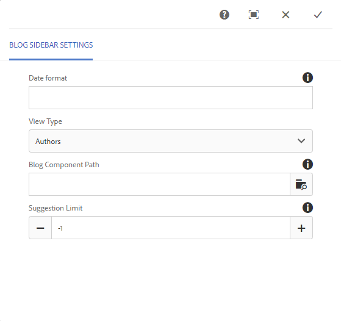

# Recurso do blog {#blog-feature}

## Introdução {#introduction}

O recurso de blog para AEM Communities se transformou de uma atividade de criação em uma verdadeira atividade da comunidade que acontece no ambiente de publicação.

O recurso de blog suporta o fornecimento de informações da comunidade em um formato de diário. As entradas do blog são feitas no ambiente de publicação por membros autorizados (usuários registrados, conectados).

O recurso de blog fornece :

* Criação no lado da publicação de artigos e comentários do blog
* Edição de texto formatado
* Imagens embutidas (com suporte para arrastar e soltar)
* Conteúdo de rede social incorporado (suporte[oEmbed](/help/communities/blog-developer-basics.md#allowing-rich-media))
* Modo de rascunho
* Publicação agendada
* Compor em nome (um membro  privilegiado pode criar conteúdo em nome de outro membro da comunidade)
* [Moderação](/help/communities/moderate-ugc.md) em massa de artigos e comentários do blog no contexto

Esta seção da documentação descreve:

* Adicionar o recurso de blog a um site do AEM
* Configurações para componentes de blog

>[!NOTE]
>
>Os componentes `Journal` e `Journal Sidebar` estão intitulados `Blog` e `Blog Sidebar`.
>
>O recurso de blog encontrado no AEM 6.0 e em versões anteriores foi removido. Ele era baseado em um modelo e permitia somente que autores criassem conteúdo no ambiente do autor.

## Adicionar componentes do blog a uma página {#adding-blog-components-to-a-page}

Se desejar adicionar um blog a uma página no modo de autor, use o navegador de componentes para localizar

* `Communities / Blog`
* `Communities / Blog Sidebar`

e arraste-os para o lugar em uma página onde o blog deve aparecer.

Para obter as informações necessárias, visite Noções básicas sobre componentes [das comunidades](/help/communities/basics.md).

Quando as bibliotecas [do lado do cliente](/help/communities/blog-developer-basics.md#essentials-for-client-side) necessárias forem incluídas, o `Blog` componente aparecerá desta forma:

E como `Blog Sidebar` aparecerá:

### Configuração do Blog {#configuring-blog}

Selecione o componente inserido a ser acessado e selecione o `Blog` `Configure` ícone que abre a caixa de diálogo de edição.

#### Guia Configurações {#settings-tab}

Na guia **Configurações** , especifique os recursos básicos do blog:

* **Permitir miniatura de anexo**

   Se marcada, uma miniatura da imagem anexada é criada.

* **Tamanho máximo da miniatura do anexo**

   Tamanho máximo (em pixels) da imagem em miniatura do anexo. O valor padrão é 800 x 800.

* **Tamanho mínimo de imagem para a miniatura**

   Tamanho mínimo (em bytes) da imagem para gerar miniatura de imagens em linha. O valor padrão é 100000 bytes (100 kb).

* **Tamanho máximo da miniatura**

   Tamanho máximo (em pixels) da imagem em miniatura para imagem em linha. O valor padrão é 800 x 800.

* **Permitir membros privilegiados**

   Se marcada, somente membros privilegiados poderão criar conteúdo.

* **Membros privilegiados permitidos**

   Adicione os membros com privilégios permitidos para criar conteúdo.

* **Bloquear conteúdo gerado pelo usuário no modo Edição do autor**

   Se ativado, bloqueia o Conteúdo gerado pelo usuário durante a edição no Modo de autor.

* **Título do diário**

   O título do blog a ser exibido na página.

>[!NOTE]
>
>O Título do Journal é usado para criar automaticamente o URL para o blog.
>No máximo 50 caracteres (com 5 caracteres adicionais para exclusividade) são usados no título do journal que você especificou aqui para criar o URL para o blog.

* **Descrição do diário**

   A descrição do blog.

* **Tópicos por página**

   Define o número de entradas/comentários do blog exibidos por página. O padrão é 10.

* **Moderada**

   Se marcada, a postagem de entradas e comentários do blog deve ser aprovada antes de serem exibidos em um site publicado. O padrão está desmarcado.

* **Fechado**

   Se marcada, o blog é fechado a novas entradas e comentários do blog. O padrão está desmarcado.

* **Editor de Rich Text**

   Se marcada, as entradas de blog e os comentários podem ser inseridos com marcação. O padrão está marcado.

* **Permitir marcação**

   Se marcada, permita que os membros adicionem etiquetas à sua postagem (consulte a guia Campo **de** tag). O padrão está desmarcado.

* **Permitir carregamento de arquivos**

   Se marcada, permita que os anexos de arquivo sejam adicionados a uma entrada de blog ou a um comentário. O padrão está desmarcado.

* **Tamanho máximo do arquivo**

   Relevante apenas se `Allow File Uploads` for verificada. Este campo limitará o tamanho (em bytes) de um arquivo carregado. O padrão é 104857600 (10 Mb).

* **Tipos de arquivos permitidos**

   Relevante apenas se `Allow File Uploads` for verificada. Uma lista separada por vírgulas de extensões de arquivo com o separador &quot;ponto&quot;. Por exemplo: .jpg, .jpeg, .png, .doc, .docx, .pdf. Se algum tipo de arquivo for especificado, o upload dos não especificados não será permitido. O padrão não é especificado, de modo que todos os tipos de arquivos sejam permitidos.

* **Tamanho máximo do arquivo de imagem a ser anexado**

   Relevante somente se a opção Permitir uploads de arquivo estiver marcada. Número máximo de bytes que um arquivo de imagem carregado pode ter. O padrão é 2097152 (2 Mb).

* **Permitir respostas**

   Se marcada, permita respostas a comentários publicados na entrada do blog. O padrão está desmarcado.

* **Permitir votação**

   Se marcada, inclua o recurso Voto com uma entrada de blog. O padrão está desmarcado.

* **Permitir que usuários excluam comentários e tópicos**

   Se marcada, permita que os membros excluam os comentários e entradas de blog que publicaram. O padrão está desmarcado.

* **Permitir monitoramento**

   Se marcada, inclua o seguinte recurso para artigos de blog, que permite que os membros sejam [notificados](/help/communities/notifications.md) sobre novas publicações. O padrão está desmarcado.

* **Permitir assinaturas de email**

   Se marcada, permita que os membros sejam notificados de novas postagens por email ([subscrição](/help/communities/subscriptions.md)). Requer `Allow Following` a verificação e configuração [de](/help/communities/email.md)email. O padrão está desmarcado.

* **Exibir selos**

   Se marcada, exiba [crachás](/help/communities/implementing-scoring.md) ganhados e atribuídos com a entrada de blog de um membro. O padrão está desmarcado.

* **Não receber respostas na página de listagem**

* **Ativar conteúdo em destaque**

   Se marcada, a ideia pode ser identificada como conteúdo [em](/help/communities/featured.md)destaque. O padrão está desmarcado.

* **Ativar a menção**

   Se ativada, permite que os usuários da comunidade registrados identifiquem outros membros registrados (usando o nome, sobrenome, nome de usuário) e os rotulem usando a sintaxe comum @user-name. Os usuários marcados recebem notificações sobre suas menções.

* **Quantidade máxima de menções**

   Restrinja o número máximo de menções permitidas em uma publicação. O padrão é 10.

* **Padrão de menção da interface do usuário**

   Especifique a string de padrão permitida para marcar (@menção) o usuário registrado em uma publicação. Por exemplo, ~{{familyName}}{{specifiedName}}.

#### Guia Moderação do usuário {#user-moderation-tab}

Na guia Moderação **do** usuário, especifique as configurações de moderação:

* **Negar postagens**

   Se marcada, os moderadores de membros confiáveis poderão negar publicações e impedir que a publicação apareça no fórum público. O padrão está desmarcado.

* **Fechar/Reabrir tópicos**

   Se marcada, os moderadores de membros confiáveis podem fechar um tópico para outras edições e comentários, e também podem reabrir um tópico. O padrão está desmarcado.

* **Sinalizar postagens**

   Se marcada, permita que os membros sinalizem os tópicos ou comentários de outras pessoas como inadequados. O padrão está desmarcado.

* **Sinalizar lista de motivo**

   Se marcada, permita que os membros escolham, em uma lista suspensa, seu motivo para marcar um tópico ou comentário como inapropriado. O padrão está desmarcado.

* **Motivo personalizado de sinalização**

   Se marcada, permita que os membros insiram seu próprio motivo para marcar um tópico ou comentário como inapropriado. O padrão está desmarcado.

* **Limite de moderação**

   Insira o número de vezes que um tópico ou comentário deve ser sinalizado pelos membros antes que os moderadores sejam notificados. O padrão é 1 (uma vez).

* **Limite de sinalização**

   Insira o número de vezes que um tópico ou comentário deve ser sinalizado antes de ser ocultado da visualização pública. Se definido como -1, o tópico ou comentário sinalizado nunca será ocultado da visualização pública. Caso contrário, esse número deve ser maior ou igual ao Limite de moderação. O padrão é 5.

#### Guia Campo de tag {#tag-field-tab}

Na guia Campo **de** tag , especifique as tags que podem ser aplicadas se **Permitir marcação** estiver marcada na guia **Configurações** :

* **Espaços de nomes permitidos**

   Relevante se `Allow Tagging` estiver marcado na guia **Configurações** . As marcas que podem ser aplicadas são limitadas às da categoria verificada. A lista do namespace inclui &quot;Tags padrão&quot; (a namespace padrão) e &quot;Incluir todas as tags&quot;. O padrão não está marcado, o que significa que todas as namespaces são permitidas.

* **Limite sugerido**

   Insira o número de tags a serem exibidas como uma sugestão para o membro postando no fórum. Um valor de -1 significa que não há limites. O padrão é 0.

### Configuração da barra lateral do blog {#configuring-blog-sidebar}

Ao clicar com o duplo no `Blog Sidebar` componente, uma caixa de diálogo de edição é aberta.

Na guia Configurações **da barra lateral do** Journal, especifique o formato de data para arquivos e que tipo de entradas serão exibidas na barra lateral:

* **Formato de data**

   O formato usado para exibir arquivos de entradas de blog. O formato usa espaços reservados de acordo com a convenção Java.

   * aaaa : ano inteiro, como em 2015
   * yy : ano curto, como &quot;15&quot;
   * MMMM : mês inteiro, como junho
   * MMM : mês curto, como Jun
   * MM : número do mês, como 06

   O padrão é &quot;yyyy MMMM&quot;, que exibiria, por exemplo, &quot;2015 June&quot;

* **Visualizar tipo**

   O Título e o tipo de entradas de blog a serem exibidas na barra lateral. A escolha é entre

   * Autores
   * Categorias
   * Arquivos

* **Caminho do componente Blopg**

   *(Opcional)* O local do recurso de blog a partir do qual os artigos de blog devem ser listados. Se deixado em branco, usará o componente de resourceType `social/journal/components/hbs/journal` que aparece na mesma página.

   * Por exemplo, `/content/sites/engage/en/blog/jcr:content/content/primary/blog`

* **Limite sugerido**

   O número de artigos do blog a serem exibidos. Um valor de -1 significa sem limite. O padrão é -1.

## Experiência com o Visitante do site {#site-visitor-experience}

No ambiente publish, o recurso blog exibirá o artigo mais recente do blog seguido de artigos mais antigos em blog em ordem decrescente de criação. As barras laterais do blog permitem que os visitantes do site apliquem filtros para limitar a seleção de artigos do blog exibidos.

O artigo do blog é seguido de um link para postar ou visualização de comentários.

Quando um artigo do blog é selecionado, o artigo do blog e os comentários são exibidos (se ativados).

Outras capacidades dependem de o visitante do site ser um moderador, administrador, membro da comunidade, membro privilegiado ou anônimo.

### Como trabalhar com artigos {#working-with-articles}

Ao criar um novo artigo de blog, há a opção de:

1. Publicar imediatamente
1. Publicar um rascunho
1. Publicar em uma data e hora agendadas

Os artigos do blog aparecerão sob a guia apropriada (Publicado, Rascunhos ou Programado) para os membros capazes de criar ao publicar.

#### Moderadores e administradores {#moderators-and-administrators}

Quando o usuário conectado tem privilégios de moderador ou administrador, ele pode executar tarefas [de](/help/communities/moderate-ugc.md) moderação (conforme permitido pela configuração do componente) em todos os artigos de blog e comentários publicados em um blog.

#### Membros {#members}

Quando o usuário conectado é um membro da comunidade ou membro  privilegiado (dependendo da configuração), ele pode selecionar `New Article` criar e publicar um novo artigo de blog.

Concretamente, podem:

* Criar um novo artigo de blog
* Publicar um novo artigo no blog em nome de outro membro
* Publicar um comentário em um artigo do blog
* Editar seu próprio artigo ou comentário no blog
* Excluir seu próprio artigo ou comentário no blog
* Sinalizar artigos ou comentários de outras pessoas no blog

#### Anônimo {#anonymous}

Os visitantes do site que não estão conectados só podem ler artigos e comentários postados do blog, traduzi-los se houver suporte, mas não podem adicionar artigos ou comentários do blog nem sinalizar artigos ou comentários de outras pessoas.

## Informações adicionais {#additional-information}

Mais informações podem ser encontradas na página [Blog Essentials](/help/communities/blog-developer-basics.md) para desenvolvedores.

Para moderação de entradas e comentários do blog, consulte [Moderação de conteúdo](/help/communities/moderate-ugc.md)gerado pelo usuário.

Para marcar entradas de blog e comentários, consulte [Marcação de conteúdo](/help/communities/tag-ugc.md)gerado pelo usuário.

Para obter a tradução de entradas e comentários do blog, consulte [Traduzindo conteúdo](/help/communities/translate-ugc.md)gerado pelo usuário.
