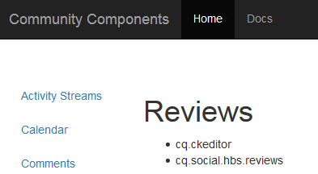

# Clientlibs para componentes do Communities {#clientlibs-for-communities-components}

## Introdução {#introduction}

Esta seção da documentação descreve como adicionar bibliotecas do lado do cliente (clientlibs) a uma página para componentes do Communities.

Para obter informações básicas, visite :

* [Usar bibliotecas do lado do cliente](/help/sites-developing/clientlibs.md) que fornece detalhes de uso e ferramentas de depuração
* [Clientlibs para SCF](/help/communities/client-customize.md#clientlibs) que fornece informações úteis ao personalizar componentes do SCF

## Por que clientlibs é necessário {#why-clientlibs-are-required}

Clientlibs são necessários para o funcionamento correto (JavaScript) e o estilo (CSS) de um componente.

Quando existe um [função da comunidade](/help/communities/functions.md) para um recurso, todos os componentes e configurações necessários, incluindo as clientlibs necessárias, estarão presentes no site da comunidade. Somente se componentes adicionais estiverem disponíveis para autores, será necessário adicionar clientlibs adicionais.

Quando as clientlibs necessárias estiverem ausentes, [adicionar um componente Comunidades a uma página](/help/communities/author-communities.md) pode resultar em erros de javascript, bem como em uma aparência inesperada.

### Exemplo : Revisões colocadas sem Clientlibs {#example-placed-reviews-without-clientlibs}

### Exemplo : Revisões colocadas com Clientlibs {#example-placed-reviews-with-clientlibs}

## Identificação de Clientlibs Obrigatórios {#identifying-required-clientlibs}

As informações de recursos essenciais para desenvolvedores identificam as clientlibs necessárias.

Além disso, de uma instância de AEM, navegue até a [Guia de componentes da comunidade](/help/communities/components-guide.md) fornece acesso a uma lista de categorias clientlib necessárias para um componente.

Por exemplo, na parte superior do [Página Revisões](https://localhost:4502/content/community-components/en/reviews.html) as clientlibs necessárias listadas são

* cq.ckeditor
* cq.social.hbs.reviews

## Adicionar Clientlibs Obrigatórios {#adding-required-clientlibs}

Quando for desejado adicionar um componente Comunidades a uma página, será necessário adicionar as clientlibs necessárias para o componente, se ainda não estiverem presentes.

Use [CRXDE|Lite](#using-crxde-lite) para modificar uma clientlibslist existente para uma página de site da comunidade.

Para adicionar uma clientlib para um site da comunidade usando [CRXDE Lite](/help/sites-developing/developing-with-crxde-lite.md):

* Navegue até [https://&lt;server>:&lt;port>/crx/de](https://localhost:4502/crx/de).
* Localize a variável `clientlibslist` nó da página na qual você deseja adicionar o componente:

   * `/content/sites/sample/en/page/jcr:content/clientlibslist`

* Com `clientlibslist` nó selecionado:

   * Localize a string[] propriedade `scg:requiredClientLibs`.
   * Selecione o `Value` para acessar a caixa de diálogo String array .

      * Role para baixo se necessário.
      * Selecione + para inserir uma nova biblioteca do cliente.

         * Repita para adicionar mais bibliotecas de clientes.

         * Selecionar **OK**.
   * Selecionar **Salvar tudo**.

>[!NOTE]
>
>Se o site não for um site da comunidade, a existência ou o local das bibliotecas de clientes em uso para o site precisará ser descoberto.

Usar o [Introdução ao AEM Communities](/help/communities/getting-started.md) exemplo, onde `site-name` é *engajamento*, é assim que a clientliblist apareceria se o componente resenhas fosse adicionado:

