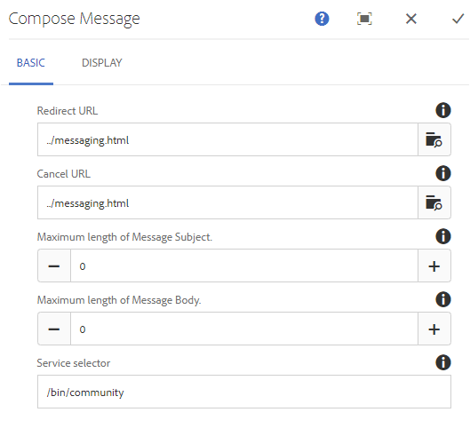

# Recurso de mensagens {#messaging-feature}

Além das interações publicamente visíveis que ocorrem em fóruns e comentários, o recurso de mensagens da AEM Communities permite que os membros da comunidade interajam mais privadamente.

Este recurso pode ser incluído quando um site [da](/help/communities/overview.md#communitiessites) comunidade é criado.

O recurso de mensagens oferece a capacidade de:

**A** - enviar uma mensagem para um ou mais membros da comunidade

**B** - enviar mensagens diretas em [massa para grupos de membros da comunidade](/help/communities/messaging.md#group-messaging)

**C** - enviar uma mensagem com anexos

**D** - encaminhar uma mensagem

**E** - responder a uma mensagem

**F** - excluir uma mensagem

**G** - restaurar uma mensagem excluída

Para ativar e modificar o recurso de mensagens, consulte:

* [Configurar mensagens](/help/communities/messaging.md) para administradores
* [Princípios básicos](/help/communities/essentials-messaging.md) de mensagens para desenvolvedores

>[!NOTE]
>
>Não há suporte para adicionar `Compose Message, Message, or Message List` componentes (encontrados no grupo de `Communities`componentes) a uma página no modo de edição do autor.

## Configurar componentes de mensagens {#configure-messaging-components}

Quando as mensagens são ativadas para um site da comunidade, elas são configuradas sem necessidade de outras configurações. As informações são fornecidas se houver necessidade de alterar a configuração padrão.

### Configurar Lista de mensagem (caixa de mensagem) {#configure-message-list-message-box}

Para modificar a configuração da lista de mensagens para as páginas **Caixa de entrada**, Itens **** enviados e **Lixeira** do recurso de mensagem, abra o site no modo [de edição do](/help/communities/sites-console.md#authoring-site-content)autor.

1. No `Preview` modo, selecione o link **Mensagens** para abrir a página principal de mensagens. Em seguida, selecione **Caixa de entrada**, Itens **** enviados ou **Lixeira** para configurar o componente para essa lista de mensagem.

1. No `Edit` modo, selecione o componente na página.
1. Para acessar a caixa de diálogo de configuração, cancele a herança selecionando o `link` ícone.
Após a herança ser cancelada, é possível selecionar o ícone de configuração para abrir a caixa de diálogo de configuração.

1. Quando a configuração for concluída, será necessário restaurar a herança selecionando o `broken link` ícone.

#### Basic tab {#basic-tab}

* **Seletor de serviços**

   (*Obrigatório*) Defina esse valor para o valor da propriedade **`serviceSelector.name`** do Serviço [de Operações de Mensagens do](/help/communities/messaging.md#messaging-operations-service)AEM Communities.

* **Compor página**

   (*Obrigatório*) A página a ser aberta quando um membro clicar no **`Reply`** botão. A página público alvo deve conter o formulário **Compor mensagem** .

* **Responder/Visualização como Recurso**

   Se marcada, o URL de resposta e o URL de Visualização farão referência a um recurso, caso contrário, os dados serão transmitidos como parâmetros de query no URL.

* **Formulário de exibição de perfil**

   O formulário de perfil a ser usado para exibir o perfil de remetentes.

* **Pasta de lixeira**

   Se marcado, esse componente de Lista de mensagem exibirá apenas as mensagens sinalizadas como excluídas (lixeira).

* **Caminhos da pasta**

   (*Obrigatório*) Referência aos valores definidos para **inbox.path.name** e **sentitems.path.name** no Serviço [de Operações de Mensagens do](/help/communities/messaging.md#messaging-operations-service)AEM Communities. Ao configurar para um `Inbox`, adicione uma entrada usando o valor de **inbox.path.name**. Ao configurar para um `Outbox`, adicione uma entrada usando o valor de **sentitems.path.name**. Ao configurar para `Trash`, adicione duas entradas com ambos os valores.

#### Guia Exibir {#display-tab}

* **Botão Marcar leitura**

   Se marcada, exibe um `Read`botão que permite que uma mensagem seja marcada como lida.

* **Botão Marcar como não lido**

   Se marcada, exibe um `Mark Unread` botão que permite que uma mensagem seja marcada como lida.

* **Botão Excluir**

   Se marcada, exibe um `Delete` botão que permite que uma mensagem seja marcada como lida. A funcionalidade de exclusão será duplicado se **`Message Options`** também estiver marcada.

* **Opções de mensagem**

   Se marcada, exibe **`Reply`**, **`Reply All`** e **`Forward`** **`Delete`** botões permitindo que uma mensagem seja reenviada ou excluída. A funcionalidade de exclusão será duplicado se **`Delete Button`** também estiver marcada.

* **Mensagens por página**

   O número especificado é o número máximo de mensagens exibidas por página em um esquema de paginação. Se nenhum número for especificado (deixado em branco), todas as mensagens serão exibidas e não haverá paginação.

* **Padrões de data e hora**

   Forneça padrões de carimbo de data e hora para um ou mais idiomas. O padrão é en, de, fr, it, es, ja, zh_CN, ko_KR.

* **Exibir o usuário**

   Escolha **`Sender`** ou **`Recipients`** para determinar se deseja exibir o Remetente ou os Recipient.

### Configurar mensagem de composição {#configure-compose-message}

Para modificar a configuração da página de mensagem de composição, abra o site no modo [de edição do](/help/communities/sites-console.md#authoring-site-content)autor.

* No `Preview` modo, selecione o link **Mensagens** para abrir a página principal de mensagens. Em seguida, selecione o botão Nova mensagem para abrir a `Compose Message` página.

* No `Edit` modo, selecione o componente principal na página que contém o corpo da mensagem.
* Para acessar a caixa de diálogo de configuração, cancele a herança selecionando o `link` ícone.
Após a herança ser cancelada, é possível selecionar o ícone de configuração para abrir a caixa de diálogo de configuração.

* Quando a configuração for concluída, será necessário restaurar a herança selecionando o `broken link` ícone.

#### Basic tab {#basic-tab-1}

* **URI de redirecionamento**

   Insira o URL da página exibida após o envio da mensagem. Por exemplo, `../messaging.html`.

* **URL de cancelamento**

   Insira o URL da página exibida se o remetente cancelar a mensagem. Por exemplo, `../messaging.html`.

* **Tamanho máximo do assunto da mensagem**

   O número máximo de caracteres permitidos no campo Assunto. Por exemplo, 500. O padrão não é limite.

* **Tamanho máximo do corpo da mensagem**

   O número máximo de caracteres permitidos no campo Conteúdo. Por exemplo, 10000. O padrão não é limite.

* **Seletor de serviços**

   (*Obrigatório*) Defina esse valor para o valor da propriedade **`serviceSelector.name`** do Serviço [de Operações de Mensagens do](/help/communities/messaging.md#messaging-operations-service)AEM Communities.

#### Guia Exibir {#display-tab-1}

* **Mostrar campo de assunto**

   Se marcada, mostre o `Subject` campo e ative a adição de um assunto à mensagem. O padrão não está marcado.

* **Rótulo do assunto**

   Insira o texto a ser exibido ao lado do `Subject` campo. O padrão é `Subject`.

* **Mostrar campo Anexar arquivo**

   Se marcada, mostre o `Attachment` campo e ative a adição de anexos de arquivo à mensagem. O padrão não está marcado.

* **Anexar etiqueta de arquivo**

   Insira o texto a ser exibido ao lado do `Attachment` campo. O padrão é **`Attach File`**.

* **Mostrar campo de conteúdo**

   Se marcada, mostre o `Content` campo e ative a adição de um corpo de mensagem. O padrão não está marcado.

* **Rótulo do conteúdo**

   Insira o texto a ser exibido ao lado do `Content` campo. O padrão é **`Body`**.

* **Com Rich Text Editor**

   Se marcada, indica o uso de uma caixa de texto Conteúdo personalizada com seu próprio editor de Rich Text. O padrão não está marcado.

* **Padrões de data e hora**

   Forneça padrões de carimbo de data e hora para um ou mais idiomas. O padrão é en, de, fr, it, es, ja, zh_CN, ko_KR.

