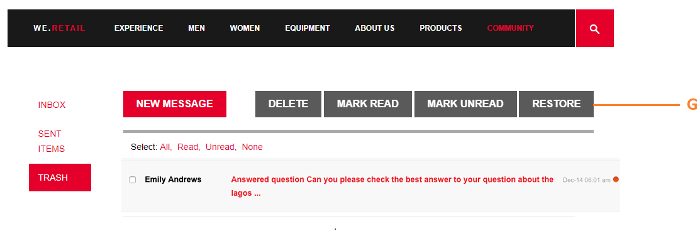

# Recurso de mensagens {#messaging-feature}

Além das interações visíveis publicamente que ocorrem em fóruns e comentários, o recurso de mensagens do AEM Communities permite que os membros da comunidade interajam entre si de forma mais privada.

Este recurso pode ser incluído quando um [site da comunidade](/help/communities/overview.md#communitiessites) for criado.

O recurso de mensagens permite fazer o seguinte:

**A** - enviar uma mensagem para um ou mais membros da comunidade

**B** - enviar mensagens diretas em [massa para grupos de membros da comunidade](/help/communities/messaging.md#group-messaging)

**C** - enviar uma mensagem com anexos

**D** - encaminhar uma mensagem

**E** - responder a uma mensagem

**F** - excluir uma mensagem

**G** - restaurar uma mensagem excluída

Para ativar e modificar o recurso de mensagens, consulte:

* [Configurar Mensagens](/help/communities/messaging.md) para administradores
* [Messaging Essentials](/help/communities/essentials-messaging.md) para desenvolvedores

>[!NOTE]
>
>Não há suporte para adicionar componentes `Compose Message, Message, or Message List` (encontrados no grupo de componentes `Communities`) a uma página no modo de edição do autor.

## Configurar componentes de mensagens {#configure-messaging-components}

Quando as mensagens estiverem ativadas para um site da comunidade, ele será configurado sem a necessidade de configuração adicional. As informações serão fornecidas se houver necessidade de alterar a configuração padrão.

### Configurar Lista de Mensagens (caixa de mensagem) {#configure-message-list-message-box}

Para modificar a configuração da lista de mensagens para as páginas **Caixa de Entrada**, **Itens Enviados** e **Lixeira** do recurso de mensagens, abra o site no [modo de edição do autor](/help/communities/sites-console.md#authoring-site-content).

1. No modo `Preview`, selecione o link **Mensagens** para abrir a página de mensagens principal. Em seguida, selecione **Caixa de entrada**, **Itens enviados** ou **Lixeira** para configurar o componente para essa lista de mensagens.

1. No modo `Edit`, selecione o componente na página.
1. Para acessar o diálogo de configuração, cancele a herança selecionando o ícone `link`.
Quando a herança for cancelada, é possível selecionar o ícone de configuração para abrir a caixa de diálogo de configuração.

1. Quando a configuração for concluída, será necessário restaurar a herança selecionando o ícone `broken link`.

#### Guia Básico {#basic-tab}

* **Seletor de serviços**

  (*Obrigatório*) Defina com o valor da propriedade **`serviceSelector.name`** do [Serviço de Operações de Mensagens da AEM Communities](/help/communities/messaging.md#messaging-operations-service).

* **Compor Página**

  (*Obrigatório*) A página a ser aberta quando um membro clicar no botão **`Reply`**. A página de destino deve conter o formulário **Compor Mensagem**.

* **Responder/Exibir como recurso**

  Se marcados, o URL de resposta e o URL de exibição fazem referência a um recurso, caso contrário, os dados são passados como parâmetros de consulta no URL.

* **Formulário de exibição de perfil**

  O formulário de perfil a ser usado para exibir o perfil dos remetentes.

* **Pasta de Lixeira**

  Se marcado, este componente Lista de mensagens exibe somente as mensagens sinalizadas como excluídas (lixeira).

* **Caminhos de pasta**

  (*Obrigatório*) Fazendo referência aos valores definidos para **inbox.path.name** e **sentiitems.path.name** no [Serviço de Operações do AEM Communities Messaging](/help/communities/messaging.md#messaging-operations-service). Ao configurar para um `Inbox`, adicione uma entrada usando o valor de **inbox.path.name**. Ao configurar para um `Outbox`, adicione uma entrada usando o valor de **sentiitems.path.name**. Ao configurar para `Trash`, adicione duas entradas com ambos os valores.

#### Guia Exibir {#display-tab}

* **Botão Marcar como Lida**

  Se marcado, exibe um botão `Read` que permite marcar uma mensagem como lida.

* **Botão Marcar como Não Lido**

  Se marcado, exibe um botão `Mark Unread` que permite marcar uma mensagem como lida.

* **Botão Excluir**

  Se marcado, exibe um botão `Delete` que permite marcar uma mensagem como lida. Duplica a funcionalidade de exclusão se **`Message Options`** também estiver marcado.

* **Opções de Mensagem**

  Se marcado, exibe os botões **`Reply`**, **`Reply All`**, **`Forward`** e **`Delete`**, permitindo que uma mensagem seja reenviada ou excluída. Duplica a funcionalidade de exclusão se **`Delete Button`** também estiver marcado.

* **Mensagens por Página**

  O número especificado é o número máximo de mensagens exibidas por página em um esquema de paginação. Se nenhum número for especificado (deixado em branco), todas as mensagens serão exibidas e não haverá paginação.

* **Padrões de carimbo de data/hora**

  Forneça padrões de carimbo de data e hora para um ou mais idiomas. O padrão é para en, de, fr, it, es, ja, zh_CN, ko_KR.

* **Exibir Usuário**

  Escolha **`Sender`** ou **`Recipients`** para que você possa determinar se deseja exibir o Remetente ou os Destinatários.

### Configurar Compor Mensagem {#configure-compose-message}

Para modificar a configuração da página para redigir mensagem, abra o site no [modo de edição do autor](/help/communities/sites-console.md#authoring-site-content).

* No modo `Preview`, selecione o link **Mensagens** para abrir a página de mensagens principal. Em seguida, clique no botão Nova Mensagem para abrir a página `Compose Message`.

* No modo `Edit`, selecione o componente principal na página que contém o corpo da Mensagem.
* Para acessar o diálogo de configuração, cancele a herança selecionando o ícone `link`.
Quando a herança for cancelada, é possível selecionar o ícone de configuração para abrir a caixa de diálogo de configuração.

* Quando a configuração for concluída, será necessário restaurar a herança selecionando o ícone `broken link`.

#### Guia Básico {#basic-tab-1}

* **URL de redirecionamento**

  Digite o URL da página exibida após o envio da mensagem. Por exemplo, `../messaging.html`.

* **Cancelar URL**

  Digite o URL da página exibida se o remetente cancelar a mensagem. Por exemplo, `../messaging.html`.

* **Tamanho máximo do assunto da mensagem**

  O número máximo de caracteres permitidos no campo Assunto. Por exemplo, 500. O padrão é sem limite.

* **Tamanho máximo do corpo da mensagem**

  O número máximo de caracteres permitidos no campo Conteúdo. Por exemplo, 10000. O padrão é sem limite.

* **Seletor de serviços**

  (*Obrigatório*) Defina com o valor da propriedade **`serviceSelector.name`** do [Serviço de Operações de Mensagens da AEM Communities](/help/communities/messaging.md#messaging-operations-service).

#### Guia Exibir {#display-tab-1}

* **Mostrar Campo de Assunto**

  Se marcado, mostra o campo `Subject` e habilita a adição de um assunto à mensagem. O padrão não está marcado.

* **Rótulo do assunto**

  Insira o texto que você deseja exibir ao lado do campo `Subject`. O padrão é `Subject`.

* **Mostrar campo Anexar arquivo**

  Se marcado, mostra o campo `Attachment` e habilita a adição de anexos de arquivo à mensagem. O padrão não está marcado.

* **Anexar Rótulo de Arquivo**

  Insira o texto que você deseja exibir ao lado do campo `Attachment`. O padrão é **`Attach File`**.

* **Mostrar Campo de Conteúdo**

  Se marcado, mostra o campo `Content` e habilita a adição de um corpo de mensagem. O padrão não está marcado.

* **Rótulo do conteúdo**

  Insira o texto que você deseja exibir ao lado do campo `Content`. O padrão é **`Body`**.

* **Com Rich Text Editor**

  Se marcado, indica o uso de uma caixa de texto de Conteúdo personalizada com seu próprio editor de rich text. O padrão não está marcado.

* **Padrões de carimbo de data/hora**

  Forneça padrões de carimbo de data e hora para um ou mais idiomas. O padrão é para en, de, fr, it, es, ja, zh_CN, ko_KR.
