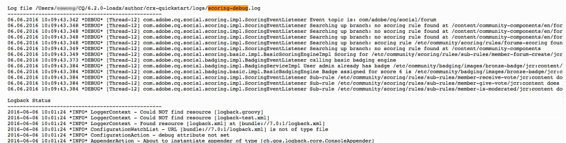

# Fundamentos de pontuação e emblemas {#scoring-and-badges-essentials}

O recurso de pontuação e selo do AEM Communities identifica e retribui os membros da comunidade.

Os detalhes da configuração do recurso estão descritos em

* [Pontuação e emblemas de comunidades](/help/communities/implementing-scoring.md)

Esta página contém detalhes técnicos adicionais :

* Como [exibir um símbolo](#displaying-badges) como imagem ou texto
* Como ativar o extenso [log de depuração](#debug-log-for-scoring-and-badging)
* Como [acessar UGC](#ugc-for-scoring-and-badging) relacionadas à pontuação e à marcação

>[!CAUTION]
>
>A estrutura de implementação visível no CRXDE Lite está sujeita a alterações.

## Exibição de emblemas {#displaying-badges}

Se um selo é exibido como texto ou imagem é controlado no lado do cliente no modelo HBS.

Por exemplo, pesquise por `this.isAssigned` em `/libs/social/forum/components/hbs/topic/list-item.hbs`:

```
{{#each author.badges}}

  {{#if this.isAssigned}}

    <div class="scf-badge-text">

      {{this.title}}

    </div>

  {{/if}}

{{/each}}

{{#each author.badges}}

  {{#unless this.isAssigned}}

    

  {{/unless}}

{{/each}}
```

Se verdadeiro, isAssigned indica que o símbolo foi atribuído para uma função e o símbolo deve ser exibido como texto.

Se falso, isAssigned indica que o selo foi concedido para uma pontuação ganha e o selo deve ser exibido como uma imagem.

Quaisquer alterações nesse comportamento devem ser feitas em um script personalizado (substituição ou sobreposição). Consulte [Personalização do lado do cliente](/help/communities/client-customize.md).

## Log de depuração para pontuação e marcação {#debug-log-for-scoring-and-badging}

Para ajudar a depurar a pontuação e o selo, um arquivo de log personalizado pode ser configurado. O conteúdo desse arquivo de log pode ser fornecido ao suporte ao cliente se forem encontrados problemas com o recurso.

Para obter instruções detalhadas, visite [Criar um arquivo de log personalizado](/help/sites-deploying/monitoring-and-maintaining.md#create-a-custom-log-file).

Para configurar rapidamente um arquivo de log de sling :

1. Acesse o **Suporte de log do console da Web da Adobe Experience Manager**, por exemplo

   * https://localhost:4502/system/console/slinglog

1. Selecionar **Adicionar novo logger**

   1. Selecionar `DEBUG` para **Nível de log**

   1. Insira um nome para **Arquivo de log**, por exemplo

      * logs/scoring-debug.log
   1. Digite dois **Logger** entradas (classe) (usando `+` ícone )

      * `com.adobe.cq.social.scoring`
      * `com.adobe.cq.social.badging`
   1. Selecione **Salvar**


Para ver entradas de log:

* No Console da Web

   * Em **Status** menu
   * Selecionar **Arquivos de registro**
   * Pesquise o nome do arquivo de log, como `scoring-debug`

* No disco local do servidor

   * O arquivo de log está em &lt;*server-install-dir*>/crx-quickstart/logs/&lt;*log-file-name*>.log

   * Por exemplo, `.../crx-quickstart/logs/scoring-debug.log`



## UGC para pontuação e marcação {#ugc-for-scoring-and-badging}

É possível visualizar o UGC relacionado à pontuação e à marcação quando o SRP escolhido é JSRP ou MSRP, mas não ASRP. (Se não estiver familiarizado com esses termos, consulte [Armazenamento de conteúdo da comunidade](/help/communities/working-with-srp.md) e [Visão geral do provedor de recursos de armazenamento](/help/communities/srp.md).)

As descrições para acessar dados de pontuação e marcação usam o JSRP, pois o UGC é facilmente acessível usando [CRXDE Lite](/help/sites-developing/developing-with-crxde-lite.md).

**JSRP no autor**: a experimentação no ambiente de criação resulta em UGC que é visível somente no ambiente de criação.

**JSRP na publicação**: da mesma forma, se estiver testando no ambiente de publicação, será necessário acessar o CRXDE Lite com privilégios administrativos em uma instância de publicação. Se a instância de publicação estiver em execução em [modo de produção](/help/sites-administering/production-ready.md) (nosamplecontent runmode), é necessário [habilitar o CRXDE Lite](/help/sites-administering/enabling-crxde-lite.md).

A localização base do UGC no JSRP é `/content/usergenerated/asi/jcr/`.

### APIs de pontuação e marcação {#scoring-and-badging-apis}

As seguintes APIs estão disponíveis para uso :

* [com.adobe.cq.social.scoring.api na 6.3](https://experienceleague.adobe.com/docs/experience-manager-release-information/aem-release-updates/previous-updates/aem-previous-versions.html?lang=pt-BR)
* [com.adobe.cq.social.badging.api na 6.3](https://experienceleague.adobe.com/docs/experience-manager-release-information/aem-release-updates/previous-updates/aem-previous-versions.html?lang=pt-BR)

Os Javadocs mais recentes para o pacote de recursos instalados estão disponíveis para os desenvolvedores do repositório do Adobe. Consulte [Usando o Maven para Comunidades : Javadocs](/help/communities/maven.md#javadocs).

**A localização e o formato do UGC no repositório estão sujeitos a alterações sem aviso prévio**.

### Exemplo de configuração {#example-setup}

As capturas de tela dos dados do repositório vêm da configuração da pontuação e do selo para um fórum em dois sites de AEM diferentes:

1. Um site AEM *com* uma id exclusiva (site da comunidade criado usando o assistente) :

   * Usar o site Tutorial de introdução (engajamento) criado durante a [tutorial de introdução](/help/communities/getting-started.md)
   * Localize o nó da página do fórum

      `/content/sites/engage/en/forum/jcr:content`

   * Adicionar propriedades de pontuação e marcação

   ```
   scoringRules = [/libs/settings/community/scoring/rules/comments-scoring,
   /libs/settings/community/scoring/rules/forums-scoring]
   ```

   ```
   badgingRules =[/libs/settings/community/badging/rules/comments-scoring,
   /libs/settings/community/badging/rules/forums-scoring]
   ```

   * Localize o nó do componente do fórum

      `/content/sites/engage/en/forum/jcr:content/content/primary/forum`
( `sling:resourceType = social/forum/components/hbs/forum`)

   * Para exibir emblemas, adicione a propriedade

      `allowBadges = true`

   * Um usuário entra, cria um tópico de fórum e recebe um selo de bronze


1. Um site AEM *without* uma id exclusiva :

   * Usar o [Guia de componentes da comunidade](/help/communities/components-guide.md)
   * Localize o nó da página do fórum

      `/content/community-components/en/forum/jcr:content`

   * Adicionar propriedades de pontuação e marcação

   ```
   scoringRules = [/libs/settings/community/scoring/rules/comments-scoring,
   /libs/settings/community/scoring/rules/forums-scoring]
   ```

   ```
   badgingRules =[/libs/settings/community/badging/rules/comments-badging,
   /libs/settings/community/badging/rules/forums-badging]
   ```

   * Localize o nó do componente do fórum

      `/content/community-components/en/forum/jcr:content/content/forum`
( `sling:resourceType = social/forum/components/hbs/forum`)

   * Para exibir emblemas, adicione a propriedade

      `allowBadges = true`

   * Um usuário entra, cria um tópico de fórum e recebe um selo de bronze


1. Um usuário recebe um selo de moderador usando cURL :

   ```shell
   curl -i -X POST -H "Accept:application/json" -u admin:admin -F ":operation=social:assignBadge" -F "badgeContentPath=/libs/settings/community/badging/images/moderator/jcr:content/moderator.png" https://localhost:4503/home/users/community/w271OOup2Z4DjnOQrviv/profile.social.json
   ```

   Como um usuário ganhou dois emblemas de bronze e recebeu um selo de moderador, o usuário aparece com a entrada do fórum da seguinte maneira:

   

>[!NOTE]
>
>Este exemplo não segue essas práticas recomendadas:
>
>* Os nomes de regras de pontuação devem ser globais exclusivas; eles não devem terminar com o mesmo nome.
>
>  Um exemplo do que *not* para fazer:
>
>  /libs/settings/community/scoring/rules/site1/forums-scoring
>  /libs/settings/community/scoring/rules/site2/forums-scoring
>
>* Criação de imagens de selo exclusivas para sites de AEM diferentes


### Acesse o UGC de pontuação {#access-scoring-ugc}

Utilização do [APIs](#scoring-and-badging-apis) é preferível.

Para fins de investigação, usando o JSRP, por exemplo, a pasta base contendo pontuações é

* `/content/usergenerated/asi/jcr/scoring`

O nó filho de `scoring` é o nome da regra de pontuação. Assim, uma prática recomendada é que a pontuação dos nomes de regras em um servidor seja globalmente exclusiva.

Para o site Geometrixx Engage, o usuário e sua pontuação estão em um caminho construído com o nome da regra de pontuação, a ID do site da comunidade ( `engage-ba81p`), uma id exclusiva e a id do usuário :

* `.../scoring/forums-scoring/engage-ba81p/6d179715c0e93cb2b20886aa0434ca9b5a540401/riley`

Para o site de guia Componentes da comunidade, o usuário e sua pontuação estão em um caminho construído com o nome da regra de pontuação, uma ID padrão ( `default-site`), uma id exclusiva e a id do usuário :

* `.../scoring/forums-scoring/default-site/b27a17cb4910a9b69fe81fb1b492ba672d2c086e/riley`

A pontuação é armazenada na propriedade `scoreValue_tl` que só podem conter um valor ou indiretamente se referem a um atomicCounter.


### UGC de marca de acesso {#access-badging-ugc}

Utilização do [APIs](#scoring-and-badging-apis) é preferível.

Para fins de investigação, usando o JSRP, por exemplo, a pasta base contendo informações sobre os emblemas atribuídos ou concedidos é

* `/content/usergenerated/asi/jcr`

Seguido pelo caminho para o perfil do usuário, terminando em uma pasta de emblemas, como:

* `/home/users/community/w271OOup2Z4DjnOQrviv/profile/badges`

#### Selo concedido {#awarded-badge}


#### Selo atribuído {#assigned-badge}


## Informações adicionais {#additional-information}

Para exibir uma lista classificada de membros com base em pontos:

* [Função de quadro de líderes](/help/communities/functions.md#leaderboard-function) para inclusão em um site da comunidade ou modelo de grupo.
* [Componente de quadro de líderes](/help/communities/enabling-leaderboard.md), o componente em destaque da função do Quadro de líderes, para criação de página.
