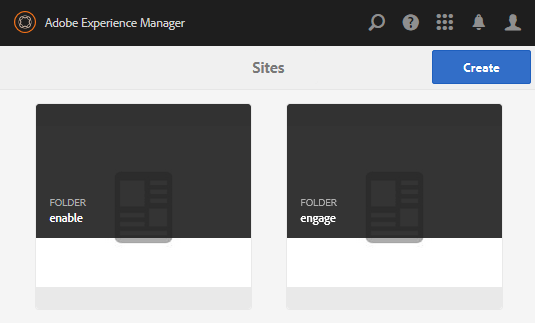

# Criar uma página de exemplo {#create-a-sample-page}

Desde AEM Comunidades 6.1, a maneira mais fácil de criar uma página de exemplo é criar um site da comunidade simples, que consiste apenas em uma função Página .

Isso incluirá um componente parsys para que você possa [ativar componentes para criação](basics.md#accessing-communities-components).

Outra opção para explorar componentes de amostra é usar os recursos apresentados na [Guia de componentes da comunidade](components-guide.md).

## Criar um site de comunidade {#create-a-community-site}

Isso é muito semelhante à criação de um novo site descrito em [Introdução ao AEM Communities](getting-started.md).

A principal diferença é que este tutorial criará um novo modelo de site da comunidade que contém apenas o [Função da página](functions.md#page-function) para criar um site da comunidade simples sem outros recursos (além dos recursos pré-conectados básicos em todos os sites da comunidade).

### Criar novo modelo de site {#create-new-site-template}

Para começar, crie um [modelo de site da comunidade](sites.md).

Na navegação global em uma instância de autor, selecione **[!UICONTROL Ferramentas]** > **[!UICONTROL Comunidades]** > **[!UICONTROL Modelos de site]**.

* Selecionar `Create button`
* INFORMAÇÕES BÁSICAS

   * `Name`: Modelo de página única
   * `Description`: Um modelo que consiste em uma única função de Página .
   * Selecionar `Enabled`

* ESTRUTURA

   * Arraste um `Page` para o Construtor de modelos
   * Para Detalhes da Função de Configuração, insira

      * `Title`: Página única
      * `URL`: page

* Selecionar **`Save`** para a configuração
* Selecionar **`Save`** para o modelo do site

### Criar novo site da comunidade {#create-new-community-site}

Agora crie um novo site da comunidade com base no modelo de site simples.

Depois de criar o modelo de site, na navegação global, selecione **[!UICONTROL Comunidades > Sites]**.

* Selecionar **`Create`** ícone

* Etapa `1 - Site Template`

   * `Title`: Site da comunidade simples
   * `Description`: Um site da comunidade que consiste em uma única página para experimentação.
   * `Community Site Root: (leave blank)`
   * `Community Site Base Language: English`
   * `Name`: amostra

      * url = http://localhost:4502/content/sites/sample

      * `Template`: Choose `Single Page Template`

      

* Selecionar `Next`
* Etapa `2 - Design`

   * Selecione qualquer design

* Selecionar `Next`
* Selecionar `Next`

   (Aceitar todas as configurações padrão)

* Selecionar `Create`

   

## Publicar o site {#publish-the-site}

No [console sites da comunidade](sites-console.md), selecione o ícone de publicação para publicar o site, por padrão, em http://localhost:4503.

## Abra o site no autor no modo de edição {#open-the-site-on-author-in-edit-mode}

Selecione o ícone de abrir site para exibir o site no modo de edição.

O URL será [http://localhost:4502/editor.html/content/sites/sample/en.html](http://localhost:4502/editor.html/content/sites/sample/en.html)

Na página inicial simples, é possível ver o que é pré-conectado por meio das funções e modelos da comunidade e brincar com a adição e configuração de componentes da comunidade.

## Exibir site na publicação {#view-site-on-publish}

Depois de publicar a página, abra a página no [instância de publicação](http://localhost:4503/content/sites/sample/en.html) para experimentar os recursos como um visitante anônimo do site, membro conectado ou administrador. O link Administração visível no ambiente do autor não aparecerá no ambiente de publicação, a menos que um administrador faça logon.
