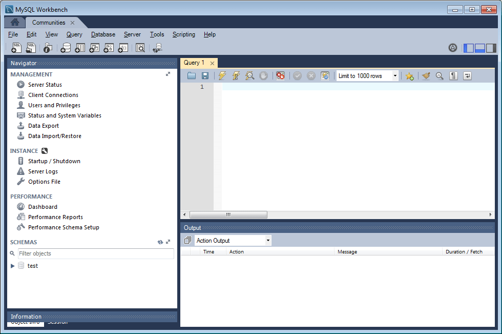

# Configuração do MySQL para DSRP {#mysql-configuration-for-dsrp}

MySQL é um banco de dados relacional que pode ser usado para armazenar conteúdo gerado pelo usuário (UGC).

Essas instruções descrevem como se conectar ao servidor MySQL e estabelecer o banco de dados UGC.

## Requisitos {#requirements}

* [Pacote de recursos das Comunidades mais recentes](deploy-communities.md#latestfeaturepack)
* [Driver JDBC para MySQL](deploy-communities.md#jdbc-driver-for-mysql)
* Um banco de dados relacional:

   * [MySQL ](https://dev.mysql.com/downloads/mysql/) serverCommunity Server versão 5.6 ou posterior

      * Pode ser executado no mesmo host que AEM ou executado remotamente
   * [Workbench MySQL](https://dev.mysql.com/downloads/tools/workbench/)

## Instalando o MySQL {#installing-mysql}

 MySQLdeve ser baixado e instalado de acordo com as instruções para o SO de destino.

### Nomes de tabela em minúsculas {#lower-case-table-names}

Como o SQL não diferencia maiúsculas de minúsculas, para sistemas operacionais que diferenciam maiúsculas de minúsculas, é necessário incluir uma configuração para minúsculas todos os nomes de tabela.

Por exemplo, para especificar todos os nomes de tabela de letras minúsculas em um sistema operacional Linux:

* Editar arquivo `/etc/my.cnf`
* Na seção `[mysqld]` , adicione a seguinte linha:

   `lower_case_table_names = 1`

### Conjunto de caracteres UTF8 {#utf-character-set}

Para oferecer um melhor suporte multilíngue, é necessário usar o conjunto de caracteres UTF8.

Altere MySQL para ter UTF8 como seu conjunto de caracteres:

* mysql > DEFINIR NOMES &#39;utf8&#39;;

Altere o banco de dados MySQL para UTF8:

* Editar arquivo `/etc/my.cnf`
* Na seção `[client]` , adicione a seguinte linha:

   `default-character-set=utf8`

* Na seção `[mysqld]` , adicione a seguinte linha:

   `character-set-server=utf8`

## Instalando o MySQL Workbench {#installing-mysql-workbench}

O MySQL Workbench fornece uma interface para executar scripts SQL que instalam o esquema e os dados iniciais.

O MySQL Workbench deve ser baixado e instalado seguindo as instruções para o SO de destino.

## Conexão de comunidades {#communities-connection}

Quando o MySQL Workbench é iniciado pela primeira vez, a menos que já esteja em uso para outros fins, ele ainda não mostrará conexões:

### Novas configurações de conexão {#new-connection-settings}

1. Selecione o ícone `+` à direita de `MySQL Connections`.
1. Na caixa de diálogo `Setup New Connection`, insira valores adequados para sua plataforma

   Para fins de demonstração, com a instância do autor AEM e o MySQL no mesmo servidor:

   * Nome da conexão: `Communities`
   * Método de conexão: `Standard (TCP/IP)`
   * Nome do host: `127.0.0.1`
   * Nome de usuário: `root`
   * Senha: `no password by default`
   * Esquema padrão: `leave blank`

1. Selecione `Test Connection` para verificar a conexão com o serviço MySQL em execução

**Notas**:

* A porta padrão é `3306`
* O Nome da Conexão escolhido é inserido como o nome da fonte de dados na [configuração JDBC OSGi](#configurejdbcconnections)

#### Nova conexão de comunidades {#new-communities-connection}

## Configuração do Banco de Dados {#database-setup}

Abra a conexão Comunidades para instalar o banco de dados.

### Obter o script SQL {#obtain-the-sql-script}

O script SQL é obtido do repositório AEM:

1. Navegue até CRXDE Lite

   * Por exemplo, [http://localhost:4502/crx/de](http://localhost:4502/crx/de)

1. Selecione a pasta /libs/social/config/datastore/dsrp/schema
1. Download `init-schema.sql`

   

Um método para baixar o schema é:

* Selecione o nó `jcr:content` para o arquivo sql
* Observe que o valor da propriedade `jcr:data` é um link de exibição

* Selecione o link de exibição para salvar os dados em um arquivo local

### Criar o Banco de Dados DSRP {#create-the-dsrp-database}

Siga as etapas abaixo para instalar o banco de dados. O nome padrão do banco de dados é `communities`.

Se o nome do banco de dados for alterado no script, altere-o também na [JDBC config](#configurejdbcconnections).

#### Etapa 1: abrir arquivo SQL {#step-open-sql-file}

No MySQL Workbench

* No menu suspenso Arquivo , selecione a opção **[!UICONTROL Abrir script SQL]**
* Selecione o script `init_schema.sql` baixado

#### Etapa 2: executar script SQL {#step-execute-sql-script}

Na janela do Workbench para o arquivo aberto na Etapa 1, selecione o `lightening (flash) icon` para executar o script.

Na imagem a seguir, o arquivo `init_schema.sql` está pronto para ser executado:

#### Atualizar {#refresh}

Depois que o script é executado, é necessário atualizar a seção `SCHEMAS` do `Navigator` para visualizar o novo banco de dados. Use o ícone de atualização à direita de &#39;SCHEMAS&#39;:

## Configurar conexão JDBC {#configure-jdbc-connection}

A configuração OSGi para **Day Commons JDBC Connections Pool** configura o driver JDBC do MySQL.

Todas as instâncias de publicação e criação de AEM devem apontar para o mesmo servidor MySQL.

Quando o MySQL é executado em um servidor diferente de AEM, o nome do host do servidor deve ser especificado no lugar de &#39;localhost&#39; no conector JDBC.

* Em cada autor e publique AEM instância.
* Conectado com privilégios de administrador.
* Acesse o [console da Web](../../help/sites-deploying/configuring-osgi.md).

   * Por exemplo, [http://localhost:4502/system/console/configMgr](http://localhost:4502/system/console/configMgr)

* Localize o `Day Commons JDBC Connections Pool`
* Selecione o ícone `+` para criar uma nova configuração de conexão.

   

* Insira os seguintes valores:

   * **[!UICONTROL Classe]** de driver JDBC:  `com.mysql.jdbc.Driver`
   * **[!UICONTROL URI]** de conexão JDBC:  `jdbc:mysql://localhost:3306/communities?characterEncoding=UTF-8`

      Especifique o servidor no lugar de localhost se o servidor MySQL não for o mesmo que &#39;this&#39; AEM server *communities* é o nome padrão do banco de dados (schema).

   * **[!UICONTROL Nome de usuário]**:  `root`

      Ou insira o Nome de usuário configurado para o servidor MySQL, se não for &#39;root&#39;.

   * **[!UICONTROL Senha]**:

      Limpar este campo se não houver senha definida para o MySQL,

      caso contrário, insira a senha configurada para o nome de usuário do MySQL.

   * **[!UICONTROL Nome]** da fonte de dados: nome inserido para a conexão  [MySQL](#new-connection-settings), por exemplo, &quot;communities&quot;.

* Selecione **[!UICONTROL Salvar]**

