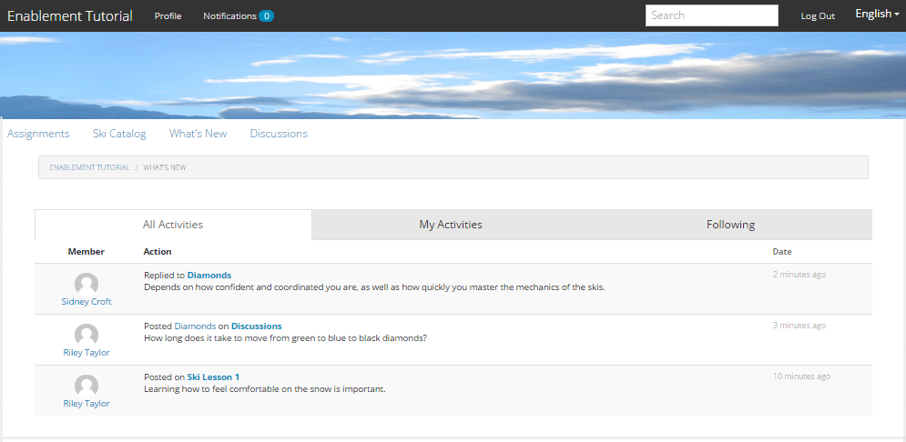

# Experimente o site publicado {#experience-the-published-site}

**[⇐ Criar e atribuir recursos de habilitação](resource.md)**

## Navegue até Novo site na publicação {#browse-to-new-site-on-publish}

Agora que o site da comunidade recém-criado e seus recursos de ativação e caminho de aprendizado foram publicados, é possível experimentar o site Tutorial de ativação.

Comece navegando até o URL exibido ao criar o site, mas no servidor de publicação, por exemplo

* URL do autor = [http://localhost:4502/content/sites/enable/en.html](http://localhost:4502/content/sites/enable/en.html)
* URL de publicação = [http://localhost:4503/content/sites/enable/en.html](http://localhost:4503/content/sites/enable/en.html)

Se a página inicial [padrão tiver sido definida](enablement-create-site.md#changethedefaulthomepage), basta navegar até [http://localhost:4503/](http://localhost:4503/) para iniciar o site.

Ao chegar ao site publicado pela primeira vez, o visitante do site normalmente não estaria conectado e seria anônimo.

**http://localhost:4503/content/sites/enable/en.html**

## Visitante Anônimo do Site {#anonymous-site-visitor}

Um visitante anônimo do site é imediatamente apresentado com a página de logon deste site privado da comunidade de ativação. Observe que não há nenhuma opção para se registrar automaticamente nem fazer login no Facebook ou Twitter.

Observe que esta página inicial mostra quatro itens de menu: `Assignments, Ski Catalog, What's New` e `Discussions`, mas nenhum pode ser acessado sem fazer logon.

>[!NOTE]
>
>É possível conceder acesso anônimo a um site de ativação sem permitir que os visitantes do site se registrem automaticamente.
>Se um recurso de ativação estiver definido como `show in catalog` e `allow anonymous access`, será possível que os visitantes anônimos do site exibam recursos no catálogo.

### Impedir acesso anônimo no JCR {#prevent-anonymous-access-on-jcr}

Uma limitação conhecida expõe o conteúdo do site da comunidade a visitantes anônimos por meio de conteúdo jcr e json , embora **[!UICONTROL permita o acesso]** anônimo esteja desabilitado para o conteúdo do site. No entanto, esse comportamento pode ser controlado usando Restrições de Sling como uma solução alternativa.

Para proteger o conteúdo do site da sua comunidade do acesso de usuários anônimos por meio de conteúdo jcr e json , siga estas etapas:

1. Na instância do autor de AEM, vá para https://&lt;host>:&lt;porta>/editor.html/content/site/&lt;sitename>.html.

   >[!NOTE]
   >
   >Não vá para o site localizado.

1. Ir para Propriedades **[!UICONTROL da]** página.

   

1. Vá para a guia **[!UICONTROL Avançado]** .
1. Enable **[!UICONTROL Authentication Requirement]**.

   

1. Adicione o caminho da página de logon. Por exemplo, `/content/......./GetStarted`.
1. Publique a página.

## Membro inscrito {#enrolled-member}

Essa experiência depende dos usuários `Riley Taylor` e `Sidney Croft` está sendo [criada](enablement-setup.md#publishcreateenablementmembers) e [atribuída](resource.md#settings) ao caminho de aprendizado das *Lições* de Esqui por meio de sua associação ao grupo *Community Ski Class* .

Logon com

* `Username: riley`
* `Password: password`

Se o perfil do usuário não tiver sido criado por meio de autoinscrição, na primeira vez que um membro fizer logon, sua página Perfil será exibida para que possa ser verificada e modificada conforme necessário.

Na próxima vez que o membro entrar, a página inicial, identificada pelo primeiro item de menu, será exibida.

### Atribuições {#assignments}

A página Atribuições é onde o membro é mostrado para todos os caminhos de aprendizado e recursos de ativação atribuídos especificamente a ele.

Cada atribuição fornece informações básicas sobre

* O tipo de Atribuição
* Se é uma nova Atribuição
* O nome
* Detalhes relevantes para o tipo de atribuição
* Contato de atribuição, especialista e autor (se fornecido)

O tipo de Atribuição é indicado por um ícone no canto superior esquerdo do cartão. A imagem de uma estrada é para um caminho de aprendizagem com o número de recursos de ativação incluídos.

A seleção de Lições *de* esqui exibirá os dois recursos de ativação referenciados pelo caminho de aprendizado.

Selecionar a Lição de *Esqui 1* abrirá a página de detalhes do recurso de ativação.

Na página de detalhes, o membro pode aprender, [classificar](rating.md) a lição e adicionar [comentários](comments.md). Qualquer atividade de membro será refletida na seção Novidades do site.

As interações com o recurso de ativação serão anotadas na seção Relatório, acessível no ambiente do autor.

### Catálogo de esqui {#ski-catalog}

A página Catálogo de esqui é o catálogo de recursos de ativação marcados com tags do `Tutorial` namespace. Os dois recursos de Lição *de* esqui são marcados com a `Skiing` tag , de modo que se nenhuma tag diferente `All` ou `Tutorial: Sports / Skiing` estiver selecionada, nada será exibido.

Quando os recursos de ativação não foram atribuídos a um membro, diretamente ou por meio de um caminho de aprendizado, é possível interagir com os recursos de ativação localizados em um catálogo e fornecer feedback por meio de comentários e classificações.

### Debates {#discussions}

Além de classificar e comentar sobre recursos de ativação ([quando habilitados](enablement-create-site.md#step33asettings)), o modelo de site da comunidade a partir do qual `Enablement Tutorial` foi criado inclui a função [do](functions.md#forum-function) fórum (o título é `Discussions)`.

Selecione o `Discussions`link e poste um tópico.

Faça logout e login como Sidney Croft (lateral/senha) e responda à pergunta, bem como Siga o tópico.

Observe que, além da moderação em linha, há opções para compartilhar o tópico nas redes sociais ou para enviar o tópico por email.

### Novidades {#what-s-new}

O item de `What's New` menu é o título, considerando a função [de fluxo de](functions.md#activity-stream-function) atividade na estrutura deste site da comunidade.

Ainda conectado como Sidney, selecione o `What's New` link para mostrar a atividade.

## Membro da Comunidade Confiável {#trusted-community-member}

Essa experiência supõe que ` [Quinn Harper](enablement-setup.md#publishcreateenablementmembers)` as funções de [moderador](enablement-create-site.md#moderation) e contato [de](resource.md#settings)recursos foram atribuídas.

Logon com

* `Username: quinn`
* `Password: password`

Depois de conectado, observe que há um novo item de menu, `Administration`, que é exibido porque o membro recebeu a função de moderador.

A página inicial é identificada pelo primeiro item de menu, Atribuições. Quinn é o contato de recursos de moderador e ativação e não estava inscrito em nenhum recurso de ativação ou caminhos de aprendizado, portanto não há nada para exibir.

### Administração {#administration}

O que existe é atividade dos dois alunos, `Riley Taylor` e `Sidney Croft`. Ao selecionar o `Administration` link para acessar o Console de moderação, o Quinn é capaz de usar o console [de moderação em](moderation.md) massa para moderar suas publicações.

Selecionar o ícone do painel lateral alterna para abrir os filtros usados para pesquisar o conteúdo da comunidade.

Passar o mouse sobre um cartão de comentários exibe ações de moderação.

## Relatórios sobre o autor {#reports-on-author}

Há duas maneiras de acessar os relatórios dos alunos e os recursos de ativação.

No autor, navegue até **Communities (Comunidades),[Resources console](resources.md)**(Recursos), onde os recursos de ativação são gerenciados e, após selecionar um site da comunidade, é possível gerar relatórios para

* Todos os recursos de ativação e caminhos de aprendizado
* Um recurso de ativação ou caminho de aprendizado específico

Navegue até **Comunidades, console**Relatórios e gere relatórios de acordo com

* Atribuições para ativar recursos e caminhos de aprendizado
* Postagens em um site da comunidade durante um período específico
* Exibições (visitas ao site) de um site da comunidade durante um período específico

* As postagens e exibições podem ser para todo o conteúdo ou para conteúdo específico:

   * Fórum
   * Tópico do fórum
   * Perguntas e respostas
   * Perguntas QnA
   * Blog
   * Artigo do blog
   * Calendário
   * Evento do calendário

### Console de recursos {#resources-console}

Com uma pequena atividade e interação com os Recursos na publicação, a exibição dos relatórios do autor vale a pena.

* Sobre o autor
* Fazer logon com privilégios administrativos
* Navegue do menu principal até **[!UICONTROL Comunidades > Recursos]**
* Selecionar o `Enablement Tutorial` site
* Selecione o `Report` ícone para obter um resumo de todos os Recursos
* Selecione um Recurso e, em seguida, o `Report` ícone para um relatório sobre esse Recurso

Observe que provavelmente é muito cedo para mostrar dados do Adobe Analytics, que podem levar de 1 a 12 horas para serem exibidos. No entanto, os relatórios SCORM básicos já estão disponíveis.

#### Relatório de recursos de lições de esqui {#ski-lessons-resource-report}

#### Relatório do usuário de lições de esqui {#ski-lessons-user-report}

* Selecionar **[!UICONTROL comunidades > Recursos]**

* Abrir cartão `Enablement Tutorial`
* Abrir cartão `Ski Lessons`
* Selecionar `Report > User Report`

### Console de relatórios {#reports-console}

O console Relatórios permite a geração de relatórios em

* **Atribuições** para qualquer site de comunidade de ativação
* **Exibições** para qualquer site da comunidade
* **Postagens** para qualquer site da comunidade

Para relatórios em atribuições:

* Sobre o autor
* Fazer logon com privilégios administrativos
* Navegue até **[!UICONTROL Comunidades > Relatórios > Relatório de atribuições]**
* Selecione um **[!UICONTROL Site]** no menu suspenso (selecione `Enablement Tutorial`)

* Selecionar **[!UICONTROL grupo]** (selecione `Community Ski Class`)

* Selecionar uma **[!UICONTROL atribuição]** (selecione `Ski Lessons`)

* Selecionar **[!UICONTROL Gerar]**

Para relatórios sobre exibições:

* Sobre o autor
* Fazer logon com privilégios administrativos
* Navegue até **[!UICONTROL Comunidades > Relatórios > Relatório de exibições]**
* Selecione um **Site **no menu suspenso (selecione`Enablement Tutorial`)

* Selecionar tipo **[!UICONTROL de]** conteúdo (selecione `all`)

* Selecionar um intervalo **[!UICONTROL de]** datas (selecione `Last 7 days`)

* Selecionar **[!UICONTROL Gerar]**

**[⇐ Criar e atribuir recursos de habilitação](resource.md)**
