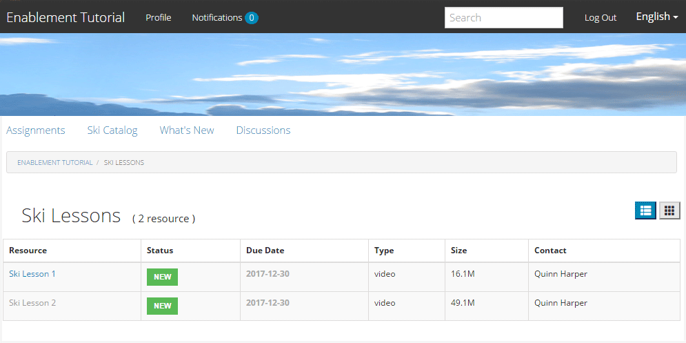
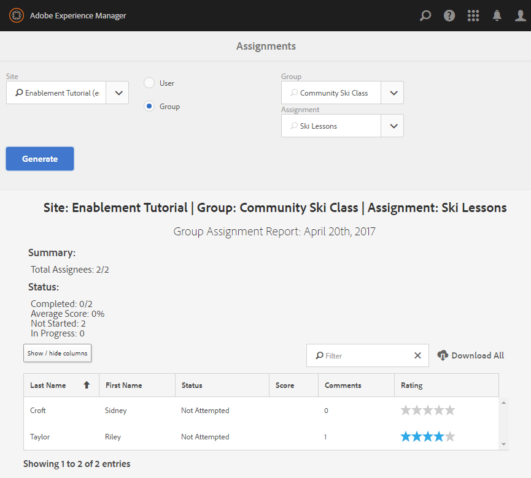
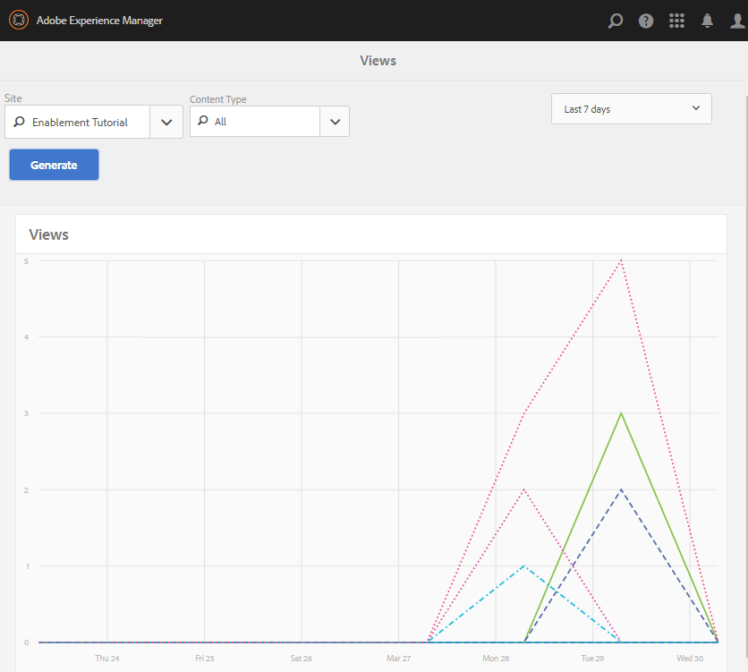

# Experimente o site publicado {#experience-the-published-site}

**[⇐ Criar e atribuir recursos de habilitação](resource.md)**

## Navegue até o novo site na publicação {#browse-to-new-site-on-publish}

Agora que o site da comunidade recém-criado e seus recursos de ativação e caminho de aprendizado foram publicados, é possível experimentar o site Tutorial de ativação .

Comece navegando até o URL exibido ao criar o site, mas no servidor de publicação, por exemplo

* URL do autor = [http://localhost:4502/content/sites/enable/en.html](http://localhost:4502/content/sites/enable/en.html)
* URL de publicação = [http://localhost:4503/content/sites/enable/en.html](http://localhost:4503/content/sites/enable/en.html)

Se a variável [a página inicial padrão foi definida](enablement-create-site.md#changethedefaulthomepage)e simplesmente navegando para [http://localhost:4503/](http://localhost:4503/) O deve iniciar o site.

Ao chegar pela primeira vez ao site publicado, o visitante do site normalmente não estaria conectado e seria anônimo.

**http://localhost:4503/content/sites/enable/en.html**

## Visitante Anônimo do Site {#anonymous-site-visitor}

Um visitante anônimo do site é imediatamente apresentado com a página de logon deste site de comunidade de capacitação privada. Observe que não há opção para se registrar automaticamente nem fazer logon com o Facebook ou Twitter.

Observe que esta página inicial mostra quatro itens de menu: `Assignments, Ski Catalog, What's New` e `Discussions`, mas nenhum pode ser acessado sem fazer logon.

>[!NOTE]
>
>É possível conceder acesso anônimo a um site de ativação sem permitir que os visitantes do site se registrem automaticamente.
>
>Se um recurso de ativação estiver definido como `show in catalog` e `allow anonymous access`, será possível que visitantes anônimos do site exibam recursos no catálogo.

### Impedir acesso anônimo no JCR {#prevent-anonymous-access-on-jcr}

Uma limitação conhecida expõe o conteúdo do site da comunidade para visitantes anônimos por meio de conteúdo jcr e json , embora **[!UICONTROL permitir acesso anônimo]** está desativado para o conteúdo do site. No entanto, esse comportamento pode ser controlado usando Restrições do Sling como uma solução alternativa.

Para proteger o conteúdo do site da comunidade do acesso de usuários anônimos por meio de conteúdo jcr e json , siga estas etapas:

1. Na instância AEM autor, acesse https://&lt;host>:&lt;port>/editor.html/content/site/&lt;sitename>.html.

   >[!NOTE]
   >
   >Não vá para o site localizado.

1. Ir para **[!UICONTROL Propriedades da página]**.

   

1. Ir para **[!UICONTROL Avançado]** guia .
1. Habilitar **[!UICONTROL Requisito de autenticação]**.

   

1. Adicione o caminho da página de logon. Por exemplo, `/content/......./GetStarted`.
1. Publique a página.

## Membro Inscrito {#enrolled-member}

Essa experiência depende dos usuários `Riley Taylor` e `Sidney Croft` being [criado](enablement-setup.md#publishcreateenablementmembers) e [atribuído](resource.md#settings) para *Lições de Esqui* caminho de aprendizado por meio de sua associação à *Classe de Esqui da Comunidade* grupo.

Faça logon com

* `Username: riley`
* `Password: password`

Se o perfil do usuário não tiver sido criado por meio de autorregistro, na primeira vez que um membro fizer logon, sua página de Perfil será exibida para que ele possa verificar e modificá-la, conforme necessário.

Na próxima vez que o membro entrar, a página inicial, identificada pelo primeiro item de menu, será exibida.

### Atribuições {#assignments}

A página Atribuições é onde o membro mostra todos os caminhos de aprendizagem e recursos de ativação atribuídos especificamente a ele.

Cada atribuição fornece informações básicas sobre:

* O tipo de Atribuição
* Se é uma nova Atribuição
* O nome
* Detalhes relevantes para o tipo de Atribuição
* Contato de atribuição, especialista e autor (se fornecido)

O tipo de Atribuição é indicado por um ícone no canto superior esquerdo do cartão. A imagem de uma estrada é para um caminho de aprendizagem com o número de recursos de capacitação incluídos.

Selecionar *Lições de Esqui* exibirá os dois recursos de habilitação referenciados pelo caminho de aprendizado.

Selecionar *Lição de Esqui 1* abrirá a página de detalhes do recurso de ativação.

Na página de detalhes, o membro pode aprender, [rate](rating.md) a lição e adicione [comentários](comments.md). Qualquer atividade de membro será refletida na seção Novidades do site.

As interações com o recurso de ativação serão anotadas na seção Relatório , acessível no ambiente do autor.

### Catálogo de esqui {#ski-catalog}

A página Catálogo de Esqui é o catálogo de recursos de ativação marcados com tags do `Tutorial` namespace. Os dois *Lição de Esqui* Os recursos são marcados com a variável `Skiing` dessa forma, se houver tags diferentes de `All` ou `Tutorial: Sports / Skiing` for selecionada, nada será exibido.

Quando um membro não recebe recursos de capacitação, diretamente ou por meio de um caminho de aprendizagem, é possível interagir com os recursos de habilitação localizados em um catálogo e fornecer feedback por meio de comentários e classificações.

### Debates {#discussions}

Além de classificar e comentar os recursos de ativação ([quando ativado](enablement-create-site.md#step33asettings)), o modelo de site da comunidade do qual `Enablement Tutorial` foi criado inclui a variável [função de fórum](functions.md#forum-function) (o título é `Discussions)`.

Selecione o `Discussions`vincular e publicar um tópico.

Faça logoff e login como Sidney Croft (lateral/senha) e responda à pergunta, assim como Siga o tópico.

Observe que, além da moderação em linha, há opções para compartilhar o tópico nas redes sociais ou enviar o tópico por email.

### Novidades {#what-s-new}

O `What's New` o item de menu é o título dado o [função de fluxo de atividades](functions.md#activity-stream-function) na estrutura deste site da comunidade.

Ainda conectado como Sidney, selecione o `What's New` link para mostrar a atividade.

## Membro da Comunidade Confiável {#trusted-community-member}

Essa experiência assume ` [Quinn Harper](enablement-setup.md#publishcreateenablementmembers)` recebeu as funções de [moderador](enablement-create-site.md#moderation) e [contato de recursos](resource.md#settings).

Faça logon com

* `Username: quinn`
* `Password: password`

Depois de entrar, observe que há um novo item de menu, `Administration`, que aparece porque o membro recebeu a função de moderador.

A página inicial é identificada pelo primeiro item de menu, Atribuições. Quinn é o contato de recursos de moderador e ativação e não foi inscrito em nenhum recurso de ativação ou caminhos de aprendizado e, portanto, não há nada para exibir.

### Administração {#administration}

O que existe é atividade dos dois aprendentes. `Riley Taylor` e `Sidney Croft`. Ao selecionar a variável `Administration` link para acessar o Console de moderação, o Quinn pode usar o [console de moderação em massa](moderation.md) para moderar suas publicações.

Selecionar o ícone do painel lateral ativa a abertura dos filtros usados para pesquisar o conteúdo da comunidade.

Passar o mouse sobre um cartão de comentários exibe ações de moderação.

## Relatórios sobre autor {#reports-on-author}

Há duas maneiras de acessar os relatórios sobre aprendentes e recursos de ativação.

Ao criar, navegue até o **Comunidades, [Console de recursos](resources.md)**, onde os recursos de ativação são gerenciados e depois de selecionar um site da comunidade, é possível gerar relatórios para

* Todos os recursos de ativação e caminhos de aprendizagem
* Um recurso de habilitação ou caminho de aprendizado específico

Navegue até o **Comunidades, [Console de relatórios](reports.md)** e gerar relatórios de acordo com:

* Atribuições para recursos de ativação e caminhos de aprendizado
* Postagens em um site da comunidade por um período específico
* Exibições (visitas ao site) de um site da comunidade durante um período específico

* As postagens e visualizações podem ser para todo o conteúdo ou para um conteúdo específico:

   * Fórum
   * Tópico do fórum
   * Perguntas e respostas
   * Perguntas QnA
   * Blog
   * Artigo do blog
   * Calendário
   * Evento do calendário

### Console de recursos {#resources-console}

Com um pouco de atividade e interação com os Recursos na publicação, a visualização dos relatórios sobre o autor vale a pena.

* Ao criar, entre com privilégios administrativos.
* Navegue pelo menu principal para **[!UICONTROL Comunidades]** > **[!UICONTROL Recursos]**.
* Selecione o `Enablement Tutorial` site.
* Selecione o `Report` para obter um resumo de todos os recursos.
* Selecione um Recurso e, em seguida, o `Report` ícone para um relatório sobre esse recurso.

Observe que é provável que seja cedo demais para mostrar os dados do Adobe Analytics, o que pode levar de 1 a 12 horas para serem exibidos. No entanto, o relatório básico SCORM já está disponível.

#### Relatório de recursos das lições de esqui {#ski-lessons-resource-report}

#### Relatório do Usuário das Lições de Esqui {#ski-lessons-user-report}

* Selecionar **[!UICONTROL Comunidades > Recursos]**

* Abrir cartão `Enablement Tutorial`
* Abrir cartão `Ski Lessons`
* Selecionar `Report > User Report`

### Console de relatórios {#reports-console}

O console Relatórios permite a geração de relatórios sobre

* **Atribuições** para qualquer site da comunidade de ativação
* **Exibições** para qualquer site da comunidade
* **Publicações** para qualquer site da comunidade

Para relatórios em atribuições:

* Ao criar, entre com privilégios administrativos.
* Navegar para **[!UICONTROL Comunidades]** > **[!UICONTROL Relatórios]** > **[!UICONTROL Relatório de Atribuições]**.
* Selecione um **[!UICONTROL Site]** no menu suspenso (selecione `Enablement Tutorial`).

* Selecionar **[!UICONTROL Grupo]** (selecione `Community Ski Class`)

* Selecione um **[!UICONTROL Atribuição]** (selecione `Ski Lessons`)

* Selecionar **[!UICONTROL Gerar]**

Para relatórios sobre exibições:

* Ao criar, entre com privilégios administrativos.
* Navegar para **[!UICONTROL Comunidades]** > **[!UICONTROL Relatórios]** > **[!UICONTROL Relatório de exibições]**.
* Selecione um **Site** no menu suspenso (selecione `Enablement Tutorial`).

* Selecionar **[!UICONTROL Tipo de conteúdo]** (selecione `all`).

* Selecione um **[!UICONTROL intervalo de datas]** (selecione `Last 7 days`).

* Selecionar **[!UICONTROL Gerar]**.

**[⇐ Criar e atribuir recursos de habilitação](resource.md)**
