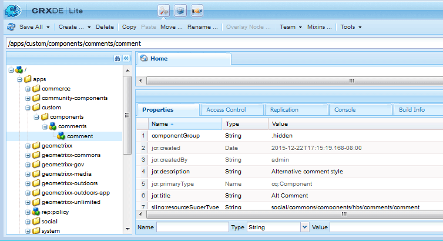

# Criar os componentes  {#create-the-components}

O exemplo de extensão de componentes usa o sistema de comentários, que na verdade é composto por dois componentes

* Comentários - O sistema de comentários abrangente, que é o componente colocado em uma página.
* Comentário - o componente que captura uma instância de um comentário publicado.

Ambos os componentes precisam ser implementados, especialmente se a aparência de um comentário publicado for personalizada.

>[!NOTE]
>
>Somente um sistema de comentários por página do site é permitido.
>
>Muitos recursos de Comunidades já incluem um sistema de comentários cujo resourceType pode ser modificado para fazer referência ao sistema de comentários estendido.

## Criar o componente Comentários {#create-the-comments-component}

Essas instruções especificam um valor de **Grupo** diferente `.hidden` para que o componente possa ser disponibilizado pelo navegador de componentes (sidekick).

A exclusão do arquivo JSP criado automaticamente ocorre porque o arquivo HBS padrão será usado.

1. Navegue até **CRXDE|Lite** ([http://localhost:4502/crx/de/index.jsp](http://localhost:4502/crx/de/index.jsp))

1. Crie um local para aplicativos personalizados:

   * Selecione o `/apps` nó

      * **Criar pasta** chamada **[!UICONTROL personalizada]**
   * Selecione o `/apps/custom` nó

      * **Criar pasta** nomeada **[!UICONTROL componentes]**


1. Selecione o `/apps/custom/components` nó

   * **[!UICONTROL Criar > Componente...]**

      * **Rótulo**: *comentários*
      * **Título**: *Comentários Alt*
      * **Descrição**: *Estilo de comentários alternativos*
      * **Supertipo**: *social/commons/components/hbs/comments*
      * **Grupo**: *Personalizado*
   * Selecione **[!UICONTROL Próximo]**
   * Selecione **[!UICONTROL Próximo]**
   * Selecione **[!UICONTROL Próximo]**
   * Selecionar **[!UICONTROL OK]**


1. Expanda o nó recém-criado: `/apps/custom/components/comments`
1. Selecione **[!UICONTROL Salvar tudo]**
1. Clique com o botão direito do mouse em `comments.jsp`
1. Selecionar **[!UICONTROL Excluir]**
1. Selecione **[!UICONTROL Salvar tudo]**


### Criar o componente Comentário filho {#create-the-child-comment-component}

Essas instruções definem o **Grupo** como somente `.hidden` o componente pai deve ser incluído em uma página.

A exclusão do arquivo JSP criado automaticamente ocorre porque o arquivo HBS padrão será usado.

1. Navegue até o `/apps/custom/components/comments` nó
1. Clique com o botão direito do mouse no nó

   * Selecione **[!UICONTROL Criar] > **[!UICONTROL Componente...]**

      * **Rótulo**: *comentário*
      * **Título**: *Comentário alternativo*
      * **Descrição**: *Estilo de comentário alternativo*
      * **Supertipo**: *social/commons/components/hbs/comments/comment*
      * **Grupo**: `*.hidden*`
   * Selecione **[!UICONTROL Próximo]**
   * Selecione **[!UICONTROL Próximo]**
   * Selecione **[!UICONTROL Próximo]**
   * Selecionar **[!UICONTROL OK]**


1. Expanda o nó recém-criado: `/apps/custom/components/comments/comment`
1. Selecione **[!UICONTROL Salvar tudo]**
1. Clique com o botão direito do mouse em `comment.jsp`
1. Selecionar **[!UICONTROL Excluir]**
1. Selecione **[!UICONTROL Salvar tudo]**




### Copiar e modificar os scripts HBS padrão {#copy-and-modify-the-default-hbs-scripts}

Usando o [CRXDE Lite](../../help/sites-developing/developing-with-crxde-lite.md):

* Copiar `comments.hbs`

   * De [/libs/social/commons/components/hbs/comments](http://localhost:4502/crx/de/index.jsp#/libs/social/commons/components/hbs/comments)
   * Para [/apps/custom/components/comments](http://localhost:4502/crx/de/index.jsp#/apps/custom/components/comments)

* Editar `comments.hbs` para:

   * Altere o valor do `data-scf-component` atributo (~linha 20):

      * De `social/commons/components/hbs/comments`
      * Para `/apps/custom/components/comments`
   * Modifique para incluir o componente de comentário personalizado (~linha 75):

      * Substituir `{{include this resourceType='social/commons/components/hbs/comments/comment'}}`
      * Com `{{include this resourceType='/apps/custom/components/comments/comment'}}`


* Copiar `comment.hbs`

   * De [/libs/social/commons/components/hbs/comments/comment](http://localhost:4502/crx/de/index.jsp#/libs/social/commons/components/hbs/comments/comment)
   * Para [/apps/custom/components/comments/comment](http://localhost:4502/crx/de/index.jsp#/apps/custom/components/comments/comment)

* Editar `comment.hbs` para:

   * Alterar o valor do atributo data-scf-component (~ linha 19)

      * De `social/commons/components/hbs/comments/comment`
      * Para `/apps/custom/components/comments/comment`

* Selecionar `/apps/custom` nó
* Selecione **[!UICONTROL Salvar tudo]**

## Criar uma pasta da biblioteca do cliente {#create-a-client-library-folder}

Para evitar a necessidade de incluir explicitamente essa biblioteca de cliente, o valor do categoria para a clientlib do sistema de comentários padrão poderia ser usado ( `cq.social.author.hbs.comments`), mas essa clientlib também seria incluída para todas as instâncias do componente padrão.

Usando o [CRXDE Lite](../../help/sites-developing/developing-with-crxde-lite.md):

* Selecionar `/apps/custom/components/comments` nó
* Selecionar nó **[!UICONTROL Criar]**

   * **Nome**: `clientlibs`
   * **Tipo**: `cq:ClientLibraryFolder`
   * Adicionar à guia **[!UICONTROL Propriedades]** :

      * **Nome** `categories` Tipo ****`String` **Valor** `cq.social.author.hbs.comments` `Multi`
      * **Nome** `dependencies` Tipo ****`String` **Valor** `cq.social.scf` `Multi`

* Selecione **[!UICONTROL Salvar tudo]**
* Com o nó `/apps/custom/components/comments/clientlib`s selecionado, crie 3 arquivos:

   * **Nome**: `css.txt`
   * **Nome**: `js.txt`
   * **Nome**: customcommentsystem.js

* Digite &#39;customcommentsystem.js&#39; como o conteúdo de `js.txt`
* Selecione **[!UICONTROL Salvar tudo]**


## Registre o modelo e a Visualização do SCF {#register-the-scf-model-view}

Ao estender (substituir) um componente SCF, o resourceType é diferente (a sobreposição usa o mecanismo de pesquisa relativo que pesquisa `/apps` antes `/libs` para que o resourceType permaneça o mesmo). É por isso que é necessário gravar o JavaScript (na biblioteca do cliente) para registrar o modelo e a visualização do SCF JS para o resourceType personalizado.

Digite o seguinte texto como conteúdo do `customcommentsystem.js`:

### customcommentsystem.js {#customcommentsystem-js}

```xml
(function($CQ, _, Backbone, SCF) {
    "use strict";

    var CustomComment = SCF.Components["social/commons/components/hbs/comments/comment"].Model;
    var CustomCommentView = SCF.Components["social/commons/components/hbs/comments/comment"].View;

    var CustomCommentSystem = SCF.Components["social/commons/components/hbs/comments"].Model;
    var CustomCommentSystemView = SCF.Components["social/commons/components/hbs/comments"].View;

    SCF.registerComponent('/apps/custom/components/comments/comment', CustomComment, CustomCommentView);
    SCF.registerComponent('/apps/custom/components/comments', CustomCommentSystem, CustomCommentSystemView);

})($CQ, _, Backbone, SCF);
```

* Selecione **[!UICONTROL Salvar tudo]**

## Publicar o aplicativo {#publish-the-app}

Para experimentar o componente estendido no ambiente de publicação, é necessário replicar o componente personalizado.

Uma maneira de o fazer é

* Da navegação global

   * Select **[!UICONTROL Tools]** > **[!UICONTROL Deployment]** > **[!UICONTROL Replication]**
   * Selecionar **[!UICONTROL Ativar árvore]**
   * Definir `Start Path` como `/apps/custom`
   * Desmarcar **[!UICONTROL somente modificação]**
   * Botão Selecionar **[!UICONTROL Ativar]**

