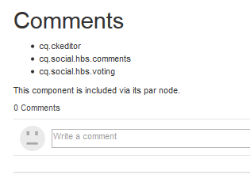

# Adicionar comentário à página de amostra {#add-comment-to-sample-page}

Agora que os componentes do sistema de comentários personalizado estão no diretório do aplicativo (/apps), é possível usar o componente estendido. A instância do sistema de comentários em um site a ser afetado deve definir resourceType como o sistema de comentários personalizado e incluir todas as bibliotecas de clientes necessárias.

## Identificar Clientlibs Necessários {#identify-required-clientlibs}

As bibliotecas do cliente necessárias para o estilo e o funcionamento dos Comentários padrão também são necessárias para os Comentários estendidos.

O [Guia de componentes da comunidade](/help/communities/components-guide.md) identifica as bibliotecas de clientes necessárias. Navegue até o Guia do componente e visualização o componente Comentários, por exemplo:

[https://localhost:4502/content/community-components/en/comments.html](https://localhost:4502/content/community-components/en/comments.html)

Observe as três bibliotecas de cliente necessárias para que os Comentários renderizem e funcionem corretamente. Eles precisarão ser incluídos no local em que os Comentários estendidos são referenciados e na biblioteca do cliente [Extended Comments](/help/communities/extend-create-components.md#create-a-client-library-folder) ( `apps.custom.comments`).

### Adicionar comentários personalizados a uma página {#add-custom-comments-to-a-page}

Como pode haver apenas um sistema de Comentários por página, é mais simples criar uma página de amostra conforme descrito no breve tutorial [Criar uma página de amostra](/help/communities/create-sample-page.md).

Depois de criado, entre no modo Design e disponibilize o grupo de componentes Personalizado para permitir que o componente `Alt Comments` seja adicionado à página.

Para que o Comentário seja exibido e funcione corretamente, as bibliotecas do cliente para Comentários devem ser adicionadas à clientlibslist para a página (consulte [Clientlibs for Communities Components](/help/communities/clientlibs.md)).

#### Comentários Clientlibs na Página de Amostra {#comments-clientlibs-on-sample-page}

#### Autor: Comentário alternativo na página de amostra {#author-alt-comment-on-sample-page}

#### Autor: Exemplo de Nó de Comentários da Página {#author-sample-page-comments-node}

Você pode verificar o resourceType no CRXDE exibindo as propriedades do nó comments da página de amostra em `/content/sites/sample/en/jcr:content/content/primary/comments`.

#### Publicar página de amostra {#publish-sample-page}

Depois que o componente personalizado é adicionado à página, também é necessário (re) [publicar a página](/help/communities/sites-console.md#publishing-the-site).

#### Publicar: Comentário alternativo na página de amostra {#publish-alt-comment-on-sample-page}

Depois de publicar o aplicativo personalizado e a página de amostra, é possível inserir um comentário. Quando conectado, com um [usuário de demonstração](/help/communities/tutorials.md#demo-users) ou administrador, é possível postar um comentário.

Aqui está aaron.mcdonald@mailinator.com postando um comentário:

Agora que parece que o componente estendido está funcionando corretamente com a aparência padrão, é hora de modificar a aparência.