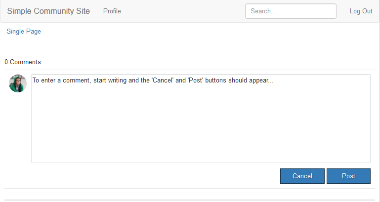

# Adicionar comentário à página de exemplo  {#add-comment-to-sample-page}

Agora que os componentes do sistema de comentários personalizado estão no diretório do aplicativo (/apps), é possível usar o componente estendido. A instância do sistema de comentários em um site a ser afetado deve definir seu resourceType como o sistema de comentários personalizado e incluir todas as bibliotecas de clientes necessárias.

## Identificar Clientlibs Necessários {#identify-required-clientlibs}

As bibliotecas de clientes necessárias para o estilo e o funcionamento dos Comentários padrão também são necessárias para os Comentários estendidos.

O [Guia de componentes da comunidade](/help/communities/components-guide.md) identifica as bibliotecas de clientes necessárias. Navegue até o Guia de componentes e exiba o componente Comentários , por exemplo:

[https://localhost:4502/content/community-components/en/comments.html](https://localhost:4502/content/community-components/en/comments.html)

Observe as três bibliotecas de clientes necessárias para que os Comentários renderizem e funcionem corretamente. Eles precisarão ser incluídos onde os Comentários estendidos forem referenciados e a variável [biblioteca cliente de comentários estendidos](/help/communities/extend-create-components.md#create-a-client-library-folder) ( `apps.custom.comments`).

### Adicionar comentários personalizados a uma página {#add-custom-comments-to-a-page}

Como pode haver apenas um sistema de Comentários por página, é mais simples criar uma página de exemplo, conforme descrito no [Criar uma página de exemplo](/help/communities/create-sample-page.md) tutorial.

Depois de criado, entre no modo Design e disponibilize o grupo de componentes Personalizado para permitir a `Alt Comments` componente a ser adicionado à página.

Para que o Comentário apareça e funcione corretamente, as bibliotecas de clientes para Comentários devem ser adicionadas à lista de clientlibslist para a página (consulte [Clientlibs para componentes do Communities](/help/communities/clientlibs.md)).

#### Comentários Clientlibs na página de exemplo {#comments-clientlibs-on-sample-page}

#### Autor: Comentário alternativo na página de exemplo {#author-alt-comment-on-sample-page}

#### Autor: Exemplo de nó Comentários da Página {#author-sample-page-comments-node}

Você pode verificar o resourceType no CRXDE exibindo as propriedades do nó comments da página de exemplo em `/content/sites/sample/en/jcr:content/content/primary/comments`.

#### Página Publicar exemplo {#publish-sample-page}

Depois que o componente personalizado é adicionado à página, também é necessário (re) [publicar a página](/help/communities/sites-console.md#publishing-the-site).

#### Publicar: Comentário alternativo na página de exemplo {#publish-alt-comment-on-sample-page}

Depois de publicar o aplicativo personalizado e a página de exemplo, é possível inserir um comentário. Quando estiver conectado, com um [usuário de demonstração](/help/communities/tutorials.md#demo-users) Para administrador, é possível postar um comentário.

Aqui está aaron.mcdonald@mailinator.com postando um comentário:

Agora que parece que o componente estendido está funcionando corretamente com a aparência padrão, é hora de modificar a aparência.
