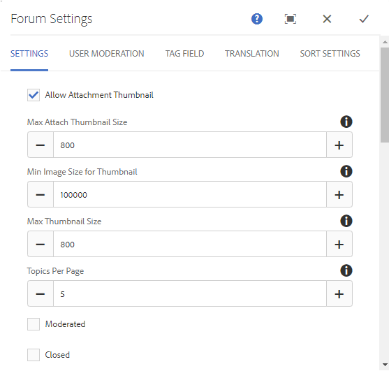

# Recurso Biblioteca de Arquivos{#file-library-feature}

## Introdução {#introduction}

O recurso de biblioteca de arquivos fornece um local para visitantes conectados do site (membros da comunidade) fazerem upload, gerenciarem e baixarem arquivos no site da comunidade.

Esta seção da documentação descreve:

* Adicionando o recurso de biblioteca de arquivos a um site AEM.
* Definições de configuração para o `File Library` componente.

### Adicionar uma biblioteca de arquivos a uma página {#adding-a-file-library-to-a-page}

Para adicionar um `File Library` para uma página no modo de autor, localize o componente:

* `Communities / File Library`

e arraste-o para o local em uma página.

Para obter as informações necessárias, visite [Noções básicas sobre componentes das comunidades](/help/communities/basics.md).

Quando a variável [bibliotecas obrigatórias do lado do cliente](/help/communities/essentials-file-library.md#essentials-for-client-side) são incluídos, é assim que a variável `File Library` componente aparecerá:

### Configuração da biblioteca de arquivos {#configuring-file-library}

Selecione o colocado `File Library` para acessar e selecionar a variável `Configure` ícone que abre a caixa de diálogo de edição.

#### Guia Comentários {#comments-tab}

No **Comentários** especifique se e como os comentários dos arquivos carregados serão exibidos:

* **Permitir comentários em arquivos**

  Se marcado, permite comentários nos arquivos carregados. O padrão está desmarcado.

* **Comentários por página**

  Limita o número de comentários exibidos por página, bem como o número de respostas exibidas. O padrão é **10**.

* **Tamanho máximo do arquivo**

  Esse valor limitará o tamanho do arquivo carregado. O limite padrão é 104857600 (10 Mb).

* **Comprimento máximo da mensagem de**

  Número máximo de caracteres que podem ser inseridos na caixa de texto. O padrão é 4.096 caracteres.

* **Tipos de arquivos permitidos**

  Uma lista separada por vírgulas de extensões de arquivo com o separador &quot;ponto&quot;. Por exemplo: .jpg, .jpeg, .png, .doc, .docx, .pdf. Se algum tipo de arquivo for especificado, os não especificados não serão permitidos. O padrão não é especificado, de modo que todos os tipos de arquivos sejam permitidos.

* **Editor de rich text**

  Se marcados, os comentários podem ser inseridos com marcação. O padrão está desmarcado.

* **Excluir comentários**

  Se marcado, os usuários poderão excluir seus próprios comentários. O padrão está marcado.

* **Permitir marcação**

  Se marcado, a capacidade de adicionar uma tag ao arquivo será habilitada. O padrão está desmarcado.

* **Namespaces permitidos**

  Se Permitir marcação estiver marcado, as tags disponíveis serão limitadas aos namespaces marcados. Se nenhum estiver marcado, todos serão permitidos. O padrão é todos os namespaces.

* **Limite sugerido**

  Se Permitir marcação estiver marcada, essa configuração limita o número de tags sugeridas para exibição. Se definido como -1, não há limite. O padrão é -1.

* **Permitir votação**

  Se marcado, a capacidade de votar em um arquivo será habilitada. O padrão está desmarcado.

* **Permitir monitoramento**

  Se marcado, inclui o seguinte recurso para artigos de blog, que permite que membros sejam [notificado](/help/communities/notifications.md) de novos posts. O padrão está desmarcado.

* **Ativar a menção**

  Se ativado, permite que os usuários registrados da comunidade identifiquem outros membros registrados (usando nome, sobrenome, nome de usuário) e marquem-nos usando a sintaxe comum @user-name. Os usuários marcados recebem notificações sobre suas menções.

* **Quantidade máxima de menções**

  Restringir o número máximo de menções permitidas em uma publicação. O padrão é 10.

* **Padrão de menção da interface do usuário**

  Especifique a string padrão permitida para marcar (@mention) o usuário registrado em uma publicação. Por exemplo, `~{{familyName}}{{givenName}}`.

* **Permitir respostas encadeadas**

  Se marcado, permite respostas aos comentários postados. O padrão está desmarcado.

#### Guia Moderação de usuário {#user-moderation-tab}

No **Moderação de usuário** , configure a moderação de comentários, se os comentários forem permitidos:

* **Pré-moderação**

  Se marcados, os comentários devem ser aprovados antes de serem exibidos em um site de publicação. O padrão está desmarcado.

* **Excluir comentários**

  Se marcado, o visitante que postou o comentário recebe a capacidade de excluí-lo. O padrão está marcado.

* **Negar comentários**

  Se marcado, permitir que os moderadores de membros confiáveis neguem comentários. O padrão está desmarcado.

* **Fechar/Reabrir comentários**

  Se essa opção estiver marcada, permitir que os moderadores de membros confiáveis fechem e reabram comentários. O padrão está desmarcado.

* **Sinalizar comentários**

  Se marcado, permite que os visitantes sinalizem comentários como inadequados. O padrão está desmarcado.

* **Sinalizar lista de motivo**

  Se marcado, permite que os visitantes escolham, em uma lista suspensa, o motivo para sinalizar um comentário como inapropriado. O padrão está desmarcado.

* **Motivo personalizado de sinalização**

  Se marcado, permite que os visitantes insiram seu próprio motivo para sinalizar um comentário como inapropriado. O padrão está desmarcado.

* **Limite de moderação**

  Insira o número de vezes que um comentário deve ser marcado pelos visitantes antes que os moderadores sejam notificados. O padrão é uma vez (**1**).

* **Limite de sinalização**

  Insira o número de vezes que um comentário deve ser sinalizado antes de ser ocultado da visualização pública. Esse número deve ser maior ou igual ao **Limite de moderação**. O padrão é 5.

### Guia Configurações de classificação {#sort-settings-tab}

Ordenar por

Definir como padrão

### Informações adicionais {#additional-information}

Mais informações podem ser encontradas no [Fundamentos da biblioteca de arquivos](/help/communities/essentials-file-library.md) página para desenvolvedores.

Para moderação de tópicos e comentários publicados, consulte [Moderação de conteúdo gerado pelo usuário](/help/communities/moderate-ugc.md).

Para marcar tópicos e comentários publicados, consulte [Marcação do conteúdo gerado pelo usuário](/help/communities/tag-ugc.md).
