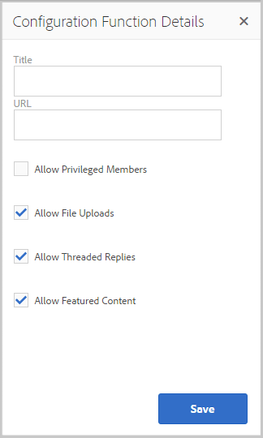

# Funções da comunidade{#community-functions}

O tipo de recursos esperados de uma experiência da comunidade são bem conhecidos. Os recursos da comunidade estão disponíveis como funções da comunidade. Essencialmente, elas são uma ou mais páginas pré-conectadas para implementar um recurso da comunidade, o que requer mais do que simplesmente adicionar um componente a uma página no modo de criação. Eles são os blocos fundamentais usados para definir a estrutura de um [modelo de site da comunidade](/help/communities/sites.md) a partir do qual os sites da comunidade são [criados](/help/communities/sites-console.md).

Depois que um site da comunidade é criado, o conteúdo pode ser adicionado às páginas resultantes usando o [AEM modo de criação padrão](/help/sites-authoring/editing-content.md). Várias funções de comunidade estão disponíveis, conforme visto no console de funções de comunidade.

>[!NOTE]
>
>Os consoles para a criação de [sites da comunidade](/help/communities/sites-console.md), [modelos de site da comunidade](/help/communities/sites.md), [modelos de grupo da comunidade](/help/communities/tools-groups.md) e [funções da comunidade](/help/communities/functions.md) são para uso somente no ambiente do autor.

## Console de funções da comunidade {#community-functions-console}

Para acessar o console de funções da comunidade no ambiente de criação:

* Navegue até **[!UICONTROL Ferramentas]** > **[!UICONTROL Comunidades]** > **[!UICONTROL Funções da comunidade]**.

## Funções pré-criadas {#pre-built-functions}

Veja a seguir uma breve descrição das funções fornecidas com o AEM Communities. Cada função inclui uma ou mais páginas AEM contendo componentes do Communities conectados em um recurso que é facilmente incorporado a um [modelo de site da comunidade](/help/communities/sites.md).

Um modelo de site da comunidade fornece a estrutura para um site da comunidade, incluindo logon, perfis de usuário, notificações, mensagens, menu do site, pesquisa, tema e recursos de marca.

### Configurações de título e URL {#title-and-url-settings}

**** Título e  **** URLs são propriedades comuns a todas as funções da comunidade.

Quando uma função da comunidade é adicionada a um modelo de site da comunidade ou adicionada quando [modificando](/help/communities/sites-console.md#modifying-site-properties) a estrutura de um site da comunidade, a caixa de diálogo da função é aberta para que o Título e o URL possam ser configurados.

#### Detalhes da função de configuração {#configuration-function-details}

* **Título**

   (*Obrigatório*) O texto que aparece no menu de recursos do site

* **URL**

   (*Obrigatório*) O nome usado para gerar o URI. O nome deve estar em conformidade com as [convenções de nomenclatura](/help/sites-developing/naming-conventions.md) impostas pelo AEM e JCR.

Por exemplo, usando o site criado a partir do acompanhamento do tutorial [Introdução](/help/communities/getting-started.md), se

* Título = Página da Web
* URL = página

Em seguida, o URL da página é https://localhost:4503/content/sites/engage/en/page.html

e o link de menu da página é exibido como:

### Função de fluxo de atividades {#activity-stream-function}

A função de fluxo de atividades é uma página com um [componente Fluxos de atividades](/help/communities/activities.md) com todas as exibições selecionadas (todas as atividades, atividades do usuário e seguintes). Consulte também [Activity Stream Essentials](/help/communities/essentials-activities.md) para desenvolvedores.

Quando adicionada a um modelo, a seguinte caixa de diálogo é aberta:

#### Detalhes da função de configuração {#configuration-function-details-1}

* [Configurações de título e URL](#title-and-url-settings)

* **Mostrar a exibição &quot;Minhas atividades&quot;**

   Se selecionada, a página Atividades inclui uma guia que filtra as atividades com base nas geradas na comunidade pelo membro atual. O padrão é selecionado.

* **Mostrar a exibição &quot;Todas as atividades&quot;**

   Se selecionada, a página Atividades inclui uma guia que inclui todas as atividades geradas na comunidade às quais o membro atual tem acesso. O padrão é selecionado.

* **Mostrar a exibição &quot;Feed de notícias&quot;**

   Se selecionada, as páginas Atividades incluem uma guia que filtra as atividades com base nas atividades que o membro atual está seguindo. O padrão é selecionado.

### Função das atribuições {#assignments-function}

A função de atribuições é o recurso básico que define um [site da comunidade para a ativação](/help/communities/overview.md#enablement-community). Ela permite a atribuição de recursos de ativação a membros da comunidade. Consulte também [Assignments Essentials](/help/communities/essentials-assignments.md) para desenvolvedores.

Essa função está disponível como um recurso do [complemento de ativação](/help/communities/enablement.md). O complemento de ativação requer licenciamento adicional para uso em um ambiente de produção.

Quando adicionada a um modelo, a única configuração é para o [Título e Configurações de URL](#title-and-url-settings).

### Função do blog {#blog-function}

A função do blog é uma página com um [Blog component](/help/communities/blog-feature.md) configurado para marcação, uploads de arquivos, a seguir, membros para autoeditar, votar e moderar. Consulte também [Blog Essentials](/help/communities/blog-developer-basics.md) para desenvolvedores.

Quando adicionada a um modelo, a seguinte caixa de diálogo é aberta:

* [Configurações de título e URL](#title-and-url-settings)

* **Permitir membros privilegiados**

   Se selecionado, o blog permite somente que membros privilegiados criem artigos permitindo a seleção de um [grupo de membros privilegiados](/help/communities/users.md#privileged-members-group). Se não estiver selecionada, todos os membros da comunidade poderão criar. O padrão está desmarcado.

* **Permitir carregamento de arquivos**

   Se selecionado, o blog inclui a capacidade de membros fazerem upload de arquivos. O padrão é selecionado.

* **Permitir respostas encadeadas**

   Se não estiver selecionado, o blog permitirá respostas (comentários) a um artigo, mas as respostas aos comentários não serão permitidas. O padrão é selecionado.

* **Ativar conteúdo em destaque**

   Se selecionado, o blog é identificado como [conteúdo em destaque](/help/communities/featured.md). O padrão é selecionado.

### Função do calendário {#calendar-function}

A função de calendário é uma página com um [Componente de calendário](/help/communities/calendar.md) configurado para permitir marcação. Consulte também [Calendar Essentials](/help/communities/calendar-basics-for-developers.md) para desenvolvedores.

Quando adicionada a um modelo, a seguinte caixa de diálogo é aberta:

* [Configurações de título e URL](#title-and-url-settings)

* **Permitir fixação**

   Se selecionado, o fórum permite que as respostas do tópico sejam fixadas no início da lista de comentários. O padrão é selecionado.

* **Permitir membros privilegiados**

   Se selecionado, o blog permite somente que membros privilegiados criem artigos permitindo a seleção de um [grupo de membros privilegiados](/help/communities/users.md#privileged-members-group). Se não estiver selecionada, todos os membros da comunidade poderão criar. O padrão está desmarcado.

* **Permitir carregamento de arquivos**

   Se selecionado, o blog inclui a capacidade de membros fazerem upload de arquivos. O padrão é selecionado.

* **Permitir respostas encadeadas**

   Se não estiver selecionado, o blog permitirá respostas (comentários) a um artigo, mas as respostas aos comentários não serão permitidas. O padrão é selecionado.

* **Ativar conteúdo em destaque**

   Se selecionado, seu conteúdo é identificado como [content featured](/help/communities/featured.md). O padrão é selecionado.

### Função do catálogo {#catalog-function}

A função de catálogo fornece a capacidade de os membros da [comunidade de ativação](/help/communities/overview.md#enablement-community) navegarem pelos recursos de ativação que não estão atribuídos a eles. Consulte [Marcação de recursos de ativação](/help/communities/tag-resources.md) e [Catalog Essentials](/help/communities/catalog-developer-essentials.md) para desenvolvedores.

Todos os recursos de ativação e caminhos de aprendizado para o site da comunidade são exibidos em todos os catálogos se sua propriedade, ` [Show in Catalog](/help/communities/resources.md)`, estiver definida como true. Para incluir explicitamente recursos e caminhos de aprendizagem, é necessário aplicar um [pre-filter](/help/communities/catalog-developer-essentials.md#pre-filters) ao catálogo.

Quando adicionada a um modelo, a configuração permite especificar namespace de tag usado para configurar o filtro de tag apresentado aos visitantes do site:

* [Configurações de título e URL](#title-and-url-settings)

* **Selecionar todos os namespaces**

   Os namespaces de tags selecionados definem quais tags podem ser selecionadas pelos visitantes para filtrar a lista de recursos de ativação listados no catálogo.
Se selecionado, todos os namespaces de tags permitidos para o site da comunidade estarão disponíveis.
Se estiver desmarcado, é possível selecionar um ou mais namespaces permitidos para o site da comunidade.
O padrão é selecionado.

### Função de conteúdo em destaque {#featured-content-function}

A função de conteúdo em destaque é uma página com um [Componente de conteúdo em destaque](/help/communities/featured.md) configurado para permitir que os comentários sejam adicionados e excluídos.

A capacidade de incluir conteúdo pode ser permitida ou não permitida por componente (consulte [Função do Blog](#blog-function), [Função do Calendário](#calendar-function), [Função do Fórum](#forum-function), [Função de Ideação](#ideation-function) e [Função QnA](#qna-function)).

Quando adicionada a um modelo, a única configuração é para o [Título e Configurações de URL](#title-and-url-settings).

### Função da biblioteca de arquivo {#file-library-function}

A função da biblioteca de arquivos é uma página com um [componente da Biblioteca de arquivos](/help/communities/file-library.md) configurado para permitir que os comentários sejam adicionados e excluídos.

Quando adicionada a um modelo, a única configuração é para o [Título e Configurações de URL](#title-and-url-settings).

### Função do fórum {#forum-function}

A função do fórum é uma página com um [Componente do fórum](/help/communities/forum.md) configurado para marcação, uploads de arquivos, a seguir, membros para autoeditar, votar e moderar.

Quando adicionada a um modelo, a seguinte caixa de diálogo é aberta:

#### Detalhes da função de configuração {#configuration-function-details-2}

* [Configurações de título e URL](#title-and-url-settings)

* **Permitir fixação**

   Se selecionado, o fórum permite que as respostas do tópico sejam fixadas no início da lista de comentários. O padrão é selecionado.

* **Permitir membros privilegiados**

   Se selecionado, o fórum só permite que membros privilegiados postem tópicos permitindo a seleção de um [grupo de membros privilegiados](/help/communities/users.md#privileged-members-group). Se não estiver selecionada, todos os membros da comunidade poderão publicar. O padrão está desmarcado.

* **Permitir carregamento de arquivos**

   Se selecionado, o fórum inclui a capacidade de membros fazerem upload de arquivos. O padrão é selecionado.

* **Permitir respostas encadeadas**

   Se não estiver selecionado, o fórum permitirá comentários sobre um tópico, mas as respostas a esses comentários não serão permitidas. O padrão é selecionado.

* **Ativar conteúdo em destaque**

   Se selecionado, o conteúdo do componente é identificado como [conteúdo em destaque](/help/communities/featured.md). O padrão é selecionado.

### Função de grupos {#groups-function}

>[!CAUTION]
>
>A função de grupos deve *não* ser a *primeira nem a única* função na estrutura de um site ou em um modelo de site da comunidade.
>
>Qualquer outra função, como [page function](#page-function), deve ser incluída e listada primeiro.

A função de grupos oferece a capacidade de membros da comunidade criarem subcomunidades dentro do site da comunidade no ambiente de publicação.

Dependendo de [configurações](/help/communities/sites-console.md#groupmanagement) quando a função Grupos for incluída em um [modelo de site da comunidade](/help/communities/sites.md), os grupos poderão ser públicos ou privados e um ou mais modelos de grupo da comunidade poderão ser configurados para fornecer uma escolha de modelos quando o grupo da comunidade for realmente criado (como a partir do ambiente de publicação). Um [modelo de grupo da comunidade](/help/communities/tools-groups.md) especifica quais recursos do Communities são criados para as páginas de grupo, como fóruns e calendários.

Quando um grupo de comunidade é criado, um grupo de membros é criado dinamicamente para o novo grupo, ao qual os membros podem ser atribuídos ou unidos. Para obter mais informações, consulte [Gerenciar usuários e grupos de usuários](/help/communities/users.md).

A partir de Comunidades [feature pack 1](/help/communities/deploy-communities.md#latestfeaturepack), os grupos da comunidade são criados no ambiente do autor usando o [console Grupos do Sites de Comunidades](/help/communities/groups.md), e podem ser criados no ambiente de publicação quando ativados.

Quando adicionada a um modelo, a seguinte caixa de diálogo é aberta:

* [Configurações de título e URL](#title-and-url-settings)

* **Selecionar modelos de grupo**

   Uma lista suspensa que permite a seleção de um ou mais modelos de grupo ativados a partir dos quais o futuro criador de um novo grupo de comunidade (no ambiente de publicação) pode escolher.

* **Permitir membros privilegiados**

   Se selecionado, o fórum só permite que membros privilegiados postem tópicos permitindo a seleção de um [grupo de segurança de membros privilegiados](/help/communities/users.md#privileged-members-group). Se não estiver selecionada, todos os membros da comunidade poderão publicar. O padrão está desmarcado.

* **Permitir a publicação da criação**

   Se selecionada, os membros autorizados da comunidade podem criar um grupo no ambiente de publicação. Se estiver desmarcado, novos grupos (subcomunidades) só poderão ser criados no ambiente de criação a partir do console Grupos do Sites das Comunidades.
O padrão é selecionado.

### Função de ideação {#ideation-function}

A função de ideação é uma página com um [Componente de ideação](/help/communities/ideation-feature.md).

Quando adicionada a um modelo, a seguinte caixa de diálogo é aberta, que especifica o Título e os nomes de URL padrão, bem como as configurações de exibição padrão do modelo:

* [Configurações de título e URL](#title-and-url-settings)

* **Permitir membros privilegiados**

   Se selecionado, o fórum só permite que membros privilegiados postem tópicos permitindo a seleção de um [grupo de segurança de membros privilegiados](/help/communities/users.md#privileged-members-group). Se não estiver selecionada, todos os membros da comunidade poderão publicar. O padrão está desmarcado.

* **Permitir carregamento de arquivos**

   Se selecionada, a ideia inclui a capacidade de membros fazerem upload de arquivos. O padrão é selecionado.

* **Permitir respostas encadeadas**

   Se não estiver selecionada, a ideia permitirá respostas (comentários) a um tópico, mas as respostas aos comentários não serão permitidas. O padrão é selecionado.

* **Ativar conteúdo em destaque**

   Se selecionado, seu conteúdo é identificado como [content featured](/help/communities/featured.md). O padrão é selecionado.

### Função do Placar de líderes {#leaderboard-function}

A função de quadro de liderança é uma página com um [componente de Quadro de líderes](/help/communities/enabling-leaderboard.md).

**OBSERVAÇÃO**: O componente do Quadro de líderes precisa de mais configuração  ** depois que um site da comunidade é criado a partir de um modelo da comunidade que inclui a função do Quadro de líderes. Especifique as [regras](/help/communities/enabling-leaderboard.md#rules-tab) do componente do Quadro de líderes, que dependem da configuração de [pontuação e emblemas](/help/communities/implementing-scoring.md) para o site da comunidade.

Quando adicionada a um modelo, a seguinte caixa de diálogo é aberta, que especifica o Título e os nomes de URL padrão, bem como as configurações de exibição padrão do modelo:

* [Configurações de título e URL](#title-and-url-settings)

* **Exibir insígnia**

   Se selecionada, uma coluna para ícones de selo é incluída no quadro de líderes.
O padrão está desmarcado.

* **Exibir nome da insígnia**

   Se selecionada, uma coluna para o nome do símbolo é incluída no quadro de líderes.
O padrão está desmarcado.

* **Exibir avatar**

   Se selecionada, a imagem de avatar do membro é incluída no quadro de líderes, ao lado do link de nome para o perfil do membro.
O padrão está desmarcado.

### Função da página {#page-function}

A função de página adiciona uma página em branco ao site da comunidade que está conectada aos recursos do site da comunidade: login, menu, notificações, mensagens, tema e marca. O conteúdo é adicionado à página usando o [modo de criação de AEM padrão](/help/sites-authoring/editing-content.md).

Quando adicionada a um modelo, a única configuração é para o [Título e Configurações de URL](#title-and-url-settings).

### Função QnA {#qna-function}

A função QnA é uma página com um [componente QnA](/help/communities/working-with-qna.md) configurado para marcação, uploads de arquivos, a seguir, membros para autoeditar, votar e moderar.

Quando adicionada a um template, a configuração permite restrição a membros privilegiados:

* [Configurações de título e URL](#title-and-url-settings)

* **Permitir fixação**

   Se selecionado, o fórum permite que as respostas do tópico sejam fixadas no início da lista de comentários. O padrão é selecionado.

* **Permitir membros privilegiados**

   Se selecionado, o fórum QnA permite somente que membros privilegiados postem perguntas permitindo a seleção de um [grupo de membros privilegiados](/help/communities/users.md#privileged-members-group). Se não estiver selecionada, todos os membros da comunidade poderão publicar. O padrão está desmarcado.

* **Permitir carregamento de arquivos**

   Se selecionado, o fórum QnA inclui a capacidade dos membros carregarem arquivos. O padrão é selecionado.

* **Permitir respostas encadeadas**

   Se não estiver selecionado, o fórum QnA permitirá comentários (respostas) a uma pergunta postada, mas as respostas às respostas não são permitidas. O padrão é selecionado.

* **Ativar conteúdo em destaque**

   Se selecionado, seu conteúdo é identificado como [content featured](/help/communities/featured.md). O padrão é selecionado.

## Criar função da comunidade {#create-community-function}

A capacidade de criar uma função de comunidade é alcançada ao selecionar o ícone `Create Community Function` localizado na parte superior do console Funções da comunidade. Várias funções baseadas no mesmo AEM Blueprint podem ser criadas e personalizadas exclusivamente ao abrir no modo de edição do autor.

### Nome da função da comunidade {#community-function-name}

No painel Nome da função da comunidade, um nome, uma descrição e se a função está habilitada ou desabilitada são configurados:

* **Nome da função da comunidade**

   O nome da função usado para exibição e armazenamento.

* **Descrição da função da comunidade**

   A descrição da função para exibição.

* **Desativado/Ativado**

   Um switch de alternância que controla se a função é referenciável.

### Blueprint AEM {#aem-blueprint}

No painel `AEM Blueprint`, é possível selecionar o blueprint que é a implementação subjacente da função de comunidade.

A função da comunidade é um mini site que inclui uma ou mais páginas, pré-conectadas para inclusão em um site da comunidade, incluindo logon, perfis de usuário, notificações, mensagens, menu do site, pesquisa, tema e recursos de marca. Depois que a função é criada, é possível [abrir a função](#open-community-function) no modo de edição do autor e personalizar as configurações da página ou do componente.

Como a função da comunidade é implementada como uma [live copy](/help/sites-administering/msm.md#live-copies) de um [blueprint](/help/sites-administering/msm-livecopy.md#creatingablueprint), é possível implantar alterações feitas em uma função que afeta todas as páginas do site da comunidade criadas a partir do [modelo de site da comunidade](/help/communities/sites.md) ou [modelo de grupo da comunidade](/help/communities/tools-groups.md) que incluiu a função. Também é possível desassociar uma página de seu blueprint pai para fazer modificações no nível da página.

Consulte também [Multi Site Manager](/help/sites-administering/msm.md).

### Miniatura  {#thumbnail}

No painel Miniatura, uma imagem pode ser carregada para ser exibida no [console Funções da comunidade](#community-functions-console).

## Abrir função da comunidade {#open-community-function}

Selecione o ícone `Open Community Function` para entrar no modo de edição do autor para criar o conteúdo da página e modificar a configuração do(s) componente(s) de recurso.

### Configuração de componentes {#configuring-components}

Uma função da comunidade é implementada como uma Live Copy de um Blueprint AEM, cujos detalhes são documentados em [Multi Site Manager](/help/sites-administering/msm.md).

É possível não apenas criar conteúdo de página, mas configurar componentes.

Ao configurar um componente em uma página de um site da comunidade criado, pode ser necessário cancelar [herança](/help/sites-administering/msm-livecopy.md#changing-live-copy-content) para configurar o componente. A herança deve ser restabelecida quando a configuração for concluída.

Para obter detalhes de configuração, visite [Componentes das comunidades](/help/communities/author-communities.md) para autores.

## Editar função da comunidade {#edit-community-function}

Selecione o ícone `Edit Community Function` para editar as propriedades da função usando os mesmos painéis que [criar uma função de comunidade](#create-community-function), incluindo a ativação ou desativação da função.
