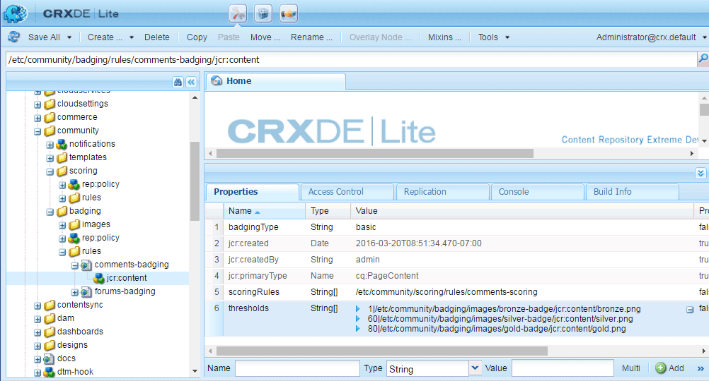

# Pontuação e emblemas de comunidades {#communities-scoring-and-badges}

## Visão geral {#overview}

O recurso de pontuação e selo do AEM Communities oferece a capacidade de identificar e recompensar membros da comunidade.

Os principais aspectos da pontuação e dos emblemas são:

* [Atribuir emblemas](#assign-and-revoke-badges) para identificar o papel de um membro na comunidade.

* [Atribuição básica de cartões](#enable-scoring) aos membros para incentivar sua participação (quantidade de conteúdo criado).

* [Atribuição avançada de cartões](/help/communities/advanced.md) identificar membros como especialistas (qualidade do conteúdo criado).

**Observação** que a atribuição de cartões é [não habilitado por padrão](/help/communities/implementing-scoring.md#main-pars-text-237875536).

>[!CAUTION]
>
>A estrutura de implementação visível no CRXDE Lite está sujeita a alterações assim que a interface do usuário estiver disponível.

## Selos {#badges}

Os emblemas são colocados sob o nome de um membro para indicar sua função ou sua posição na comunidade. Os emblemas podem ser exibidos como uma imagem ou como um nome. Quando exibido como uma imagem, o nome é incluído como texto alternativo para acessibilidade.

Por padrão, os rótulos estão localizados no repositório em

* `/libs/settings/community/badging/images`

Se armazenados em um local diferente, eles devem ser lidos e acessíveis a todos.

Os emblemas são diferenciados no UGC quanto ao fato de terem sido atribuídos ou terem sido obtidos de acordo com as regras. No momento, os emblemas atribuídos são exibidos como texto e os emblemas recebidos são exibidos como uma imagem.

### Interface do usuário do gerenciamento de emblemas {#badge-management-ui}

Comunidades [Console de emblemas](/help/communities/badges.md) O fornece a capacidade de adicionar emblemas personalizados que podem ser exibidos para um membro quando ganhados (concedidos) ou quando assumem uma função específica na comunidade (atribuídos).

### Símbolos atribuídos {#assigned-badges}

Os emblemas baseados em funções são atribuídos por um administrador aos membros da comunidade com base em sua função na comunidade.

Os rótulos atribuídos (e avisados) são armazenados no [SRP](/help/communities/srp.md) e não são diretamente acessíveis. Até que uma GUI esteja disponível, o único meio para atribuir emblemas baseados em função é fazer isso com código ou cURL. Para obter instruções de cURL, consulte a seção intitulada [Atribuir e Revogar Símbolos](#assign-and-revoke-badges).

Incluídos na versão, há três distintivos com base em funções:

* **moderador**

   `/libs/settings/community/badging/images/moderator/jcr:content/moderator.png`

* **gerente de grupo**

   `/libs/settings/community/badging/images/group-manager/jcr:content/group-manager.png`

* **membro privilegiado**

   `/libs/settings/community/badging/images/privileged-member/jcr:content/privileged-member.png`

   

### Símbolos atribuídos {#awarded-badges}

Os emblemas baseados em recompensa são concedidos pelo serviço de pontuação aos membros da comunidade com base nas regras aplicadas à sua atividade na comunidade.

Para que os emblemas apareçam como recompensa pela atividade, há duas coisas que devem acontecer:

* O selo deve ser [ativado](#enableforcomponent) para o componente de recurso.
* As regras de pontuação e marcação devem ser [aplicado](#applytopage) à página (ou ancestral) em que o componente é colocado.

Incluídos na versão, há três selos baseados em recompensa:

* **ouro**

   `/libs/settings/community/badging/images/gold-badge/jcr:content/gold.png`

* **prata**

   `/libs/settings/community/badging/images/silver-badge/jcr:content/silver.png`

* **bronze**

   `/libs/settings/community/badging/images/bronze-badge/jcr:content/bronze.png`

   

>[!NOTE]
>
>As regras de pontuação podem ser configuradas para atribuir pontos negativos para publicações sinalizadas como inadequadas e, portanto, afetar o valor da pontuação. No entanto, uma vez obtido o selo, ele não será removido automaticamente devido à redução do ponto de pontuação ou alterações na regra de pontuação.
>
>Os emblemas concedidos podem ser revogados da mesma forma que os emblemas atribuídos. Consulte a [Atribuir e Revogar Símbolos](#assign-and-revoke-badges) seção. As melhorias futuras incluirão uma interface do usuário para gerenciar os emblemas dos membros.

### Símbolos personalizados {#custom-badges}

Os emblemas personalizados podem ser instalados usando o [Console de emblemas](/help/communities/badges.md) e atribuído ou especificado nas regras de marcação.

Quando instalados a partir do console Badges, os emblemas personalizados são replicados automaticamente para o ambiente de publicação.

## Ativar Pontuação {#enable-scoring}

A pontuação não está ativada por padrão. As etapas básicas para a configuração e a habilitação da pontuação e da atribuição de emblemas são:

* Identificar regras para pontos de ganhos ([regras de pontuação](#scoring-rules)).
* Para pontos acumulados por regra de pontuação, atribua [emblemas](#badges) ([regras de marcação](#badging-rules)).

* [Aplicar as regras de pontuação e marcação a um site da comunidade](#apply-rules-to-content).
* [Ativar a marcação para recursos da comunidade](#enable-badges-for-component).

Consulte a [Teste rápido](#quick-test) para ativar a pontuação para um site da comunidade usando as regras de pontuação e marcação padrão para fóruns e comentários.

### Aplicar regras ao conteúdo {#apply-rules-to-content}

Para ativar a pontuação e os emblemas, adicione as propriedades `scoringRules` e `badgingRules` para qualquer nó na árvore de conteúdo do site.

Se o site já estiver publicado, depois de aplicar todas as regras e ativar os componentes, publique-o novamente.

As regras que se aplicam a um componente habilitado para marcação são as do nó atual ou seu ancestral.

Se o nó for do tipo `cq:Page` (recomendado), em seguida, usando o CRXDE|Lite, adicione as propriedades à sua `jcr:content` nó .

| **Propriedade** | **Tipo** | **Descrição** |
|---|---|---|
| badgingRules | Sequência de caracteres | uma lista de matriz de [regras de marcação](#badging-rules) |
| regras de pontuação | Sequência de caracteres | uma lista de matriz de [regras de pontuação](#scoring-rules) |

>[!NOTE]
>
>Se uma regra de pontuação parecer não ter efeito na atribuição de emblemas, verifique se a regra de pontuação não foi bloqueada pela propriedade scoringRules da regra de marcação. Consulte a seção intitulada [Regras de marcação](#badging-rules).

### Ativar emblemas para componente {#enable-badges-for-component}

As regras de pontuação e delimitação estão em vigor apenas para instâncias de componentes que habilitaram a marcação ao editar a configuração do componente em [modo de criação](/help/communities/author-communities.md).

Uma propriedade booleana, `allowBadges`, ativa/desativa a exibição de emblemas para uma instância de componente. É configurável no [caixa de diálogo edição de componente](/help/communities/author-communities.md) para componentes de fórum, QnA e comentário por meio de uma caixa de seleção rotulada **Exibir emblemas**.

#### Exemplo : allowBadges para a instância do componente Forum {#example-allowbadges-for-forum-component-instance}


>[!NOTE]
>
>Qualquer componente pode ser sobreposto para exibir emblemas usando o código HBS encontrado em fóruns, QnA e comentários como exemplo.

## Regras de pontuação {#scoring-rules}

As regras de pontuação são a base da pontuação para fins de concessão de emblemas.

Muito simplesmente, cada regra de pontuação é uma lista de uma ou mais subregras. As regras de pontuação são aplicadas ao conteúdo do site da comunidade para identificar as regras a serem aplicadas quando os rótulos estiverem ativados.

As regras de pontuação são herdadas, mas não aditivas. Por exemplo:

* Se a página 2 contém a regra de pontuação 2 e sua página ancestral 1 contém a regra de pontuação 1.
* Uma ação em um componente de página 2 chamará a regra 1 e a regra 2.
* Se ambas as regras contiverem subregras aplicáveis para o mesmo `topic/verb`:

   * Somente a subregra da rule2 afetará a pontuação.
   * As pontuações de ambas as subregras não são adicionadas juntas.

Quando há mais de uma regra de pontuação, as pontuações são mantidas separadamente para cada regra.

As regras de pontuação são nós do tipo `cq:Page` com propriedades em `jcr:content` que especificam a lista de subregras que a definem.

As pontuações são armazenadas no SRP.

>[!NOTE]
>
>Prática recomendada: nomeie exclusivamente cada regra de pontuação.
>
>Os nomes de regras de pontuação devem ser globais exclusivas; eles não devem terminar com o mesmo nome.
>
>Um exemplo do que *not* para fazer:
>
>/libs/settings/community/scoring/rules/site1/forums-scoring
>/libs/settings/community/scoring/rules/site2/forums-scoring

### Subregras de pontuação {#scoring-sub-rules}

As sub-regras de pontuação contêm as propriedades que detalham os valores para participar da comunidade.

Cada subregra de pontuação identifica:

* Quais atividades estão sendo rastreadas?
* Que função comunitária específica está envolvida?
* Quantos pontos são atribuídos?

Por padrão, os pontos são atribuídos ao membro que está tomando a ação, a menos que a subregra especifique o proprietário do conteúdo como recebendo os pontos ( `forOwner`).

Cada subregra pode ser incluída em uma ou mais regras de pontuação.

O nome da subregra normalmente segue o padrão de uso de um *assunto* , *objeto* e *verbo*. Por exemplo:

* membro-comentário-criar
* membro-receberá-voto

Sub-regras são nós do tipo `cq:Page` com propriedades em `jcr:content`nó que especifica a [verbos e tópicos](#topics-and-verbs) .

<table>
 <tbody>
  <tr>
   <th>Propriedade</th>
   <th>Tipo</th>
   <th> Descrição do valor</th>
  </tr>
  <tr>
   <td><i><code>VERB</code></i></td>
   <td>Longo</td>
   <td>
    <ul>
     <li>Obrigatório; o verbo corresponde a uma ação de evento</li>
     <li>deve haver pelo menos uma propriedade verb</li>
     <li>o verbo deve ser inserido em todas as letras maiúsculas</li>
     <li>pode haver várias propriedades de verbo, mas nenhuma duplicação</li>
     <li>o valor é a pontuação a ser aplicada para esse evento</li>
     <li>o valor pode ser positivo ou negativo</li>
     <li>uma lista de verbos suportados na versão está no <a href="#topics-and-verbs">Tópicos e verbos</a> seção</li>
    </ul> </td>
  </tr>
  <tr>
   <td><code>topics</code></td>
   <td>Sequência de caracteres</td>
   <td>
    <ul>
     <li>facultativo; restringe a subregra aos componentes da comunidade identificados por tópicos de evento</li>
     <li>se especificado : é uma string de vários valores com tópicos de evento</li>
     <li>uma lista de tópicos na versão está no <a href="#topics-and-verbs">Tópicos e verbos</a> seção</li>
     <li>o padrão é aplicar a todos os tópicos associados ao(s) verbo(s)</li>
    </ul> </td>
  </tr>
  <tr>
   <td><code>forOwner</code></td>
   <td>Booleano</td>
   <td>
    <ul>
     <li>facultativo; não é relevante quando o membro age com base no conteúdo que possui</li>
     <li>se verdadeiro, aplique pontuação ao proprietário do conteúdo que está sendo tratado</li>
     <li>se falso, aplique pontuação ao membro que está tomando a ação</li>
     <li>o padrão é false</li>
    </ul> </td>
  </tr>
  <tr>
   <td><code>scoringType</code></td>
   <td>Sequência de caracteres</td>
   <td>
    <ul>
     <li>facultativo; identifica o mecanismo de pontuação</li>
     <li>se "básico", especifica o mecanismo de pontuação com base na quantidade
      <ul>
       <li>incluído na versão</li>
      </ul> </li>
     <li>se "avançado", especifica o mecanismo de pontuação com base na qualidade e quantidade
      <ul>
       <li>exige um <a href="/help/communities/advanced.md">pacote adicional</a></li>
      </ul> </li>
     <li>o padrão é "básico"</li>
    </ul> </td>
  </tr>
 </tbody>
</table>

### Regras e subregras de pontuação incluídas {#included-scoring-rules-and-sub-rules}

Incluídas na versão são duas regras de pontuação para a variável [Função do fórum](/help/communities/functions.md#forum-function) (um para os componentes Fórum e Comentários do recurso Fórum ):

1. /libs/settings/community/pontuação/regras/pontuação de comentários

   * subRules[] = /libs/settings/community/scoring/rules/sub-rules/member-comment-create /libs/settings/community/scoring/rules/sub-rules/member-receive-vote /libs/settings/community/scoring/rules/sub-rules/member-given-vote /libs/settings/community/scoring/rules/sub-rules/member-is-moderated

1. /libs/settings/community/scoring/rules/forums-scoring

   * subRules[] = /libs/settings/community/scoring/rules/sub-rules/member-forum-create /libs/settings/community/scoring/rules/sub-rules/member-receive-vote /libs/settings/community/scoring/rules/sub-rules/member-given-vote /libs/settings/community/scoring/rules/sub-rules/member-is-moderated

**Notas:**

* Ambos `rules` e `sub-rules` nós são do tipo cq:Page.

* `subRules` é um atributo do tipo String[] no relatório `jcr:content` nó .

* `sub-rules` pode ser compartilhado entre várias regras de pontuação.
* `rules` deve estar localizado em um local de repositório com permissão de leitura para todos.

   * Os nomes das regras devem ser exclusivos, independentemente da localização.

### Ativar regras de pontuação personalizadas {#activating-custom-scoring-rules}

Quaisquer alterações ou adições feitas às regras de pontuação ou subregras feitas no ambiente de criação precisam ser instaladas na publicação.

## Regras de marcação {#badging-rules}

Regras de atribuição de rótulo vinculam regras de pontuação a rótulos especificando:

* Regra de pontuação
* Pontuação necessária para receber um símbolo específico

Regras de marcação são nós do tipo `cq:Page` com propriedades em `jcr:content` nó que correlaciona as regras de pontuação a pontuações e distinções.

As regras para a marcação consistem em um `thresholds` que é uma lista ordenada de pontuações mapeadas para emblemas. As pontuações devem ser ordenadas em maior valor. Por exemplo:

* `1|/libs/settings/community/badging/images/bronze-badge/jcr:content/bronze.png`

   * Um selo de bronze é avisado por ganhar 1 ponto.

* `60|/libs/settings/community/badging/images/silver-badge/jcr:content/silver.png`

   * Um selo de prata é concedido quando há 60 pontos acumulados.

* `80|/libs/settings/community/badging/images/gold-badge/jcr:content/gold.png`

   * Um selo de ouro é avisado quando 80 pontos foram acumulados.

As regras de marcação são emparelhadas com regras de pontuação, que determinam como os pontos são acumulados. Consulte a seção intitulada [Aplicar regras ao conteúdo](#apply-rules-to-content).

O `scoringRules` em uma regra de marcação, o simplesmente restringe quais regras de pontuação podem ser emparelhadas com essa regra de marcação específica.

>[!NOTE]
>
>Prática recomendada : crie imagens de selo exclusivas para cada site de AEM.



<table>
 <tbody>
  <tr>
   <th>Propriedade</th>
   <th>Tipo</th>
   <th>Descrição do valor</th>
  </tr>
  <tr>
   <td>limites</td>
   <td>Sequência de caracteres</td>
   <td><em>(obrigatório)</em> Uma string com vários valores do formulário 'number|path'
    <ul>
     <li>número = pontuação</li>
     <li>| = barra vertical (U+007C)</li>
     <li>caminho = caminho completo para o recurso de imagem de selo</li>
    </ul> As cadeias de caracteres devem ser ordenadas de forma que os números aumentem em valor e nenhum espaço em branco deve aparecer entre o número e o caminho.<br /> Exemplo de entrada :<br /> <code>80|/libs/settings/community/badging/images/gold-badge/jcr:content/gold.png</code></td>
  </tr>
  <tr>
   <td>badgingType</td>
   <td>Sequência de caracteres</td>
   <td><em>(opcional)</em> Identifica o mecanismo de pontuação como "básico" ou "avançado". Se desejar o mecanismo avançado de pontuação, consulte <a href="/help/communities/advanced.md">Pontuação avançada e emblemas</a>. O padrão é "básico".</td>
  </tr>
  <tr>
   <td>regras de pontuação</td>
   <td>Sequência de caracteres</td>
   <td>(<em>opcional</em>) Uma string com vários valores para restringir a regra de classificação a eventos de pontuação identificados pelas regras de pontuação</td>
  </tr>
 </tbody>
</table>

### Regras de marcação incluídas {#included-badging-rules}

Incluídas na versão estão duas Regras de emblema que correspondem à variável [Fóruns e regras de pontuação de comentários](#includedscoringrules).

* `/libs/settings/community/badging/rules/comments-badging`

* `/libs/settings/community/badging/rules/forums-badging`

**Notas:**

* `rules` nós são do tipo cq:Page.
* `rules` deve estar localizado em um local de repositório com permissão de leitura para todos.

   * Os nomes das regras devem ser exclusivos, independentemente da localização.

### Ativando regras de marcação personalizadas {#activating-custom-badging-rules}

Quaisquer alterações ou adições feitas às regras de marcação ou imagens feitas no ambiente de criação precisam ser instaladas na publicação.

## Atribuir e Revogar Símbolos {#assign-and-revoke-badges}

Os emblemas podem ser atribuídos aos membros utilizando a [console membros](/help/communities/members.md#badges-tab) ou programaticamente usando comandos cURL.

Os seguintes comandos cURL mostram o que é necessário para uma solicitação HTTP para atribuir e revogar emblemas. O formato básico é:

cURL -i -X POST -H *header* -u *assinatura* -F *operation* -F *emblema* *member-profile-url*

*header* = cabeçalho personalizado &quot;Accept:application/json&quot; para passar para o servidor (obrigatório)

*assinatura* = administrador-id:senha por exemplo : admin:admin

*operation* = &quot;:operation=social:assignBadge&quot; OU &quot;:operation=social:deleteBadge&quot;

*emblema* = &quot;badgeContentPath=*badge-image-file*&quot;

*badge-image-file* = o local do arquivo de imagem do selo no repositório, por exemplo: /libs/settings/community/badging/images/moderator/jcr:content/moderator.png

*member-profile-url* = o ponto de extremidade do perfil do membro na publicação, por exemplo: https://&lt;server>:&lt;port>/home/users/community/riley/profile.social.json

>[!NOTE]
>
>O *member-profile-url*:
>
>* Pode se referir a uma instância do autor se a variável [Serviço de túnel](/help/communities/users.md#tunnel-service) estiver ativado.
>* Pode ser um nome aleatório obscuro - consulte [Lista de verificação de segurança](/help/sites-administering/security-checklist.md#verify-that-you-are-not-disclosing-personally-identifiable-information-in-the-users-home-path) sobre a ID de autorização.


### Exemplos: {#examples}

#### Atribuir um símbolo de moderador {#assign-a-moderator-badge}

```shell
curl -i -X POST -H "Accept:application/json" -u admin:admin -F ":operation=social:assignBadge" -F "badgeContentPath=/libs/settings/community/badging/images/moderator/jcr:content/moderator.png" /home/users/community/updcs9DndLEI74DB9zsB/profile.social.json
```

#### Revogar um símbolo de prata atribuído {#revoke-an-assigned-silver-badge}

```shell
curl -i -X POST -H "Accept:application/json" -u admin:admin -F ":operation=social:deleteBadge" -F "badgeContentPath=/libs/settings/community/badging/images/silver/jcr:content/silver.png" /home/users/community/updcs9DndLEI74DB9zsB/profile.social.json
```

>[!NOTE]
>
>Usar cURL para atribuir e revogar emblemas funciona para qualquer imagem de emblema, mas quando atribuído em vez de ganho, eles são marcados como emblemas atribuídos e manipulados de acordo.

## Pontuação e emblemas para componentes personalizados {#scoring-and-badges-for-custom-components}

As regras de pontuação e marcação podem ser criadas para componentes personalizados ao associar os tópicos de evento criados para o componente aos verbos.

## Tópicos e verbos {#topics-and-verbs}

Quando os membros interagem com os recursos das comunidades, os eventos são enviados e podem acionar ouvintes assíncronos, como notificações e pontuação.

A instância SocialEvent de um componente registra os eventos como `actions` que ocorrem para um `topic`. O SocialEvent inclui um método para retornar um `verb` associada à ação. Existe um *n-1* relação entre `actions` e `verbs`.

Para os componentes de comunidades entregues, as tabelas a seguir descrevem o `verbs` definido para cada `topic` disponível para uso em [subregras de pontuação](#scoring-sub-rules).

>[!NOTE]
>
>Uma nova propriedade booleana, `allowBadges`, ativa/desativa a exibição de emblemas para uma instância de componente. Ele poderá ser configurado na atualização [caixas de diálogo de edição de componente](/help/communities/author-communities.md) por meio de uma caixa de seleção rotulada **Exibir emblemas**.

**[Componente de calendário](/help/communities/calendar.md)**
SocialEvent `topic`= com/adobe/cq/social/calendar

| **Verbo** | **Descrição** |
|---|---|
| POST | membro cria um evento de calendário |
| ADICIONAR | comentários do membro em um evento de calendário |
| ATUALIZAR | evento ou comentário do calendário do membro é editado |
| EXCLUIR | o evento ou comentário do calendário do membro é excluído |

**[Componente Comentários](/help/communities/comments.md)**
SocialEvent `topic`= com/adobe/cq/social/comment

| **Verbo** | **Descrição** |
|---|---|
| POST | membro cria um comentário |
| ADICIONAR | membro responde ao comentário |
| ATUALIZAR | o comentário do membro é editado |
| EXCLUIR | o comentário do membro é excluído |

**[Componente Biblioteca de arquivos](/help/communities/file-library.md)**
SocialEvent `topic`= com/adobe/cq/social/fileLibrary

| **Verbo** | **Descrição** |
|---|---|
| POST | membro cria uma pasta |
| ANEXAR | membro carrega um arquivo |
| ATUALIZAR | membro atualiza uma pasta ou arquivo |
| EXCLUIR | membro exclui uma pasta ou arquivo |

**[Componente de fórum](/help/communities/forum.md)**
SocialEvent `topic`= com/adobe/cq/social/forum

| **Verbo** | **Descrição** |
|---|---|
| POST | membro cria tópico do fórum |
| ADICIONAR | membro responde ao tópico do fórum |
| ATUALIZAR | o tópico ou a resposta do fórum do membro é editada |
| EXCLUIR | o tópico ou resposta do fórum do membro é excluído |

**[Componente Diário](/help/communities/blog-feature.md)**
SocialEvent `topic`= com/adobe/cq/social/journal

| **Verbo** | **Descrição** |
|---|---|
| POST | membro cria um artigo de blog |
| ADICIONAR | membro comenta em um artigo do blog |
| ATUALIZAR | artigo ou comentário do blog do membro é editado |
| EXCLUIR | artigo ou comentário do blog do membro é excluído |

**[Componente QnA](/help/communities/working-with-qna.md)**
SocialEvent `topic` = com/adobe/cq/social/qna

| **Verbo** | **Descrição** |
|---|---|
| POST | membro cria uma pergunta QnA |
| ADICIONAR | membro cria uma resposta QnA |
| ATUALIZAR | pergunta ou resposta QnA do membro é editada |
| SELECIONAR | a resposta do membro é selecionada |
| CANCELAR SELEÇÃO | a resposta do membro é desmarcada |
| EXCLUIR | pergunta ou resposta QnA do membro é excluída |

**[Componente de revisões](/help/communities/reviews.md)**
SocialEvent `topic`= com/adobe/cq/social/review

| **Verbo** | **Descrição** |
|---|---|
| POST | membro cria revisão |
| ATUALIZAR | a revisão do membro é editada |
| EXCLUIR | a revisão do membro é eliminada |

**[Componente de classificação](/help/communities/rating.md)**
SocialEvent `topic`= com/adobe/cq/social/tally/rating

| **Verbo** | **Descrição** |
|---|---|
| ADICIONAR CLASSIFICAÇÃO | o conteúdo do membro foi atualizado |
| REMOVER CLASSIFICAÇÃO | o conteúdo do membro foi reduzido |

**[Componente de votação](/help/communities/voting.md)**
SocialEvent `topic`= com/adobe/cq/social/tally/votar

| **Verbo** | **Descrição** |
|---|---|
| ADICIONAR VOTAÇÃO | o conteúdo do membro foi votado |
| REMOVER VOTAÇÃO | o conteúdo do membro foi rejeitado |

**Componentes habilitados para moderação**
SocialEvent `topic`= com/adobe/cq/social/moderação

| **Verbo** | **Descrição** |
|---|---|
| NEGAR | o conteúdo do membro é negado |
| SINALIZADOR COMO INADEQUADO | o conteúdo do membro é sinalizado |
| INADEQUADO | o conteúdo do membro não está sinalizado |
| ACEITAR | o conteúdo do membro é aprovado pelo moderador |
| FECHAR | membro fecha comentário a edições e respostas |
| ABRIR | membro reabre comentário |

### Eventos de componente personalizado {#custom-component-events}

Para um componente personalizado, um SocialEvent é instanciado para registrar os eventos do componente como `actions` que ocorrem para um `topic`.

Para oferecer suporte à pontuação, o SocialEvent precisaria substituir o método `getVerb()` de forma a que `verb` é retornado para cada `action`. O `verb` retornado para uma ação pode ser usado normalmente (como `POST`) ou uma especializada para o componente (como `ADD RATING`). Existe um *n-1* relação entre `actions` e `verbs`.

## Resolução de problemas {#troubleshooting}

### Os emblemas não estão aparecendo {#badges-are-not-appearing}

Se as regras de pontuação e selo tiverem sido aplicadas ao conteúdo do site, mas os emblemas não estiverem sendo avisados para nenhuma atividade, verifique se os emblemas foram ativados para a instância desse componente.

Consulte [Ativar emblemas para componente](#enable-badges-for-component).

### A regra de pontuação não tem efeito {#scoring-rule-has-no-effect}

Se as regras de pontuação e selo tiverem sido aplicadas ao conteúdo do site, e os emblemas tiverem sido atribuídos para algumas ações, mas não para outras, verifique se a regra de selo não restringiu as regras de pontuação às quais se aplica.

Consulte a `scoringRules` propriedade de [Regras de marcação](#badging-rules).

### Tipo sensível a maiúsculas e minúsculas {#case-sensitive-typo}

A maioria das propriedades e valores, especialmente os verbos, diferencia maiúsculas de minúsculas. Os verbos devem ser todos MAIÚSCULAS quando usados em uma subregra de pontuação.

Se o recurso não estiver funcionando como esperado, verifique se os dados foram inseridos corretamente.

## Teste rápido {#quick-test}

É possível experimentar rapidamente a pontuação e o selo usando o [Tutorial de introdução](/help/communities/getting-started.md) (engajamento) site :

* Acesse o CRXDE Lite no autor.
* Navegue até a página base:

   * /content/sites/engagement/en/jcr:content

* Adicione a propriedade badgingRules:

   * **Nome**: `badgingRules`
   * **Tipo**: `String`
   * Selecionar **Multi**
   * Selecionar **Adicionar**
   * Insira `/libs/settings/community/badging/rules/forums-badging`
   * Selecionar **+**
   * Insira `/libs/settings/community/badging/rules/comments-badging`
   * Selecionar **OK**

* Adicione a propriedade scoringRules:

   * **Nome**: `scoringRules`
   * **Tipo**: `String`
   * Selecionar **Multi**
   * Selecionar **Adicionar**
   * Insira `/libs/settings/community/scoring/rules/forums-scoring`
   * Selecionar **+**
   * Insira `/libs/settings/community/scoring/rules/comments-scoring`
   * Selecionar **OK**

* Selecionar **Salvar tudo**.


Em seguida, verifique se os componentes de fórum e comentários permitem a exibição de emblemas:

* Mais uma vez usando o CRXDE Lite.
* Navegue até o componente de fórum

   * `/content/sites/engage/en/forum/jcr:content/content/primary/forum`

* Adicione a propriedade booleana allowBadges, se necessário, e verifique se ela é verdadeira.

   * **Nome**: `allowBadges`
   * **Tipo**: `Boolean`
   * **Valor**: `true`


Em seguida, [republicar](/help/communities/sites-console.md#publishing-the-site) o site da comunidade.

Finalmente,

* Navegue até o componente na instância de publicação.
* Fazer logon como membro da comunidade (por exemplo: weston.mccall@dodgit.com / password).
* Poste um novo tópico do fórum.
* A página deve ser atualizada para que o símbolo seja exibido.

   * Faça logoff e login como um membro da comunidade diferente (por exemplo: aaron.mcdonald@mailinator.com/password).

* Selecione o Fórum.

Isso deve gerar para o membro da comunidade um selo de bronze visível em sua publicação no fórum, devido ao primeiro limite da regra de selo de fóruns ser uma pontuação de 1.


## Informações adicionais {#additional-information}

Mais informações podem ser encontradas no [Fundamentos de pontuação e emblemas](/help/communities/configure-scoring.md) página para desenvolvedores.

Para obter informações sobre o mecanismo de pontuação avançado, consulte [Pontuação avançada e emblemas](/help/communities/advanced.md).

O Quadro de líderes configurável [componente](/help/communities/enabling-leaderboard.md) e [função](/help/communities/functions.md#leaderboard-function) simplifica a exibição de membros e suas pontuações em um site da comunidade.
