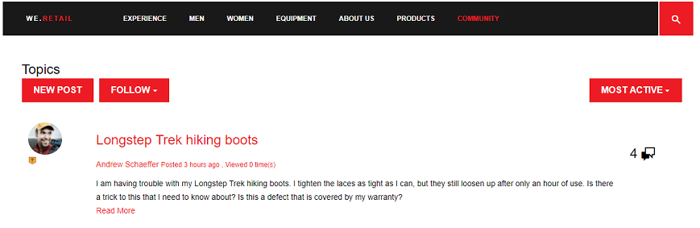

# Pontuação das comunidades e emblemas {#communities-scoring-and-badges}

## Visão geral {#overview}

O recurso de pontuação de AEM Communities e emblemas fornece a capacidade de identificar e recompensar membros da comunidade.

Os principais aspectos da pontuação e dos emblemas são:

* [Atribua emblemas](#assign-and-revoke-badges) para identificar a função de um membro na comunidade.

* [Atribuição básica de emblemas](#enable-scoring) aos membros para incentivar sua participação (quantidade de conteúdo criado).
* [Atribuição avançada de emblemas](/help/communities/advanced.md) para identificar membros como especialistas (qualidade do conteúdo criado).

**Observe** que a atribuição de emblemas [não está ativada por padrão](/help/communities/implementing-scoring.md#main-pars-text-237875536).

>[!CAUTION]
>
>A estrutura de implementação visível no CRXDE Lite está sujeita a alterações assim que a interface do usuário estiver disponível.


## Selos {#badges}

Os símbolos são colocados sob o nome de um membro para indicar sua função ou sua posição na comunidade. Os símbolos podem ser exibidos como uma imagem ou como um nome. Quando exibido como uma imagem, o nome é incluído como texto alternativo para acessibilidade.

Por padrão, os emblemas estão localizados no repositório em

* `/libs/settings/community/badging/images`

Se armazenados em um local diferente, eles devem ser lidos e acessíveis a todos.

Os crachás são diferenciados no UGC quanto ao fato de terem sido atribuídos ou recebidos de acordo com as regras. Atualmente, os símbolos atribuídos são exibidos como texto e os símbolos ganhos são exibidos como uma imagem.

### Interface do usuário do Gerenciamento de emblemas {#badge-management-ui}

O console [](/help/communities/badges.md) Distintos de comunidades fornece a capacidade de adicionar símbolos personalizados que podem ser exibidos para um membro quando ganhado (concedido) ou quando eles assumem uma função específica na comunidade (atribuído).

### Caracteres atribuídos {#assigned-badges}

Os emblemas baseados em funções são atribuídos por um administrador aos membros da comunidade com base em sua função na comunidade.

Os símbolos atribuídos (e avisados) são armazenados no [SRP](/help/communities/srp.md) selecionado e não são diretamente acessíveis. Até que uma GUI esteja disponível, o único meio de atribuir emblemas baseados em funções é fazer isso com código ou cURL. Para obter instruções sobre cURL, consulte a seção [Atribuir e Revogar emblemas](#assign-and-revoke-badges).

Na versão estão incluídos três emblemas baseados em funções:

* **moderador**

   `/libs/settings/community/badging/images/moderator/jcr:content/moderator.png`

* **gestor de grupo**

   `/libs/settings/community/badging/images/group-manager/jcr:content/group-manager.png`

* **membro privilegiado**

   `/libs/settings/community/badging/images/privileged-member/jcr:content/privileged-member.png`


### Crachás recompensados {#awarded-badges}

Os crachás baseados em recompensas são concedidos pelo serviço de pontuação aos membros da comunidade com base nas regras aplicadas à sua atividade na comunidade.

Para que os crachás apareçam como recompensa pela atividades, há duas coisas que devem acontecer:

* A marcação deve ser [ativada](#enableforcomponent) para o componente de recurso.
* As regras de pontuação e marcação devem ser [aplicadas](#applytopage) à página (ou ancestral) na qual o componente é colocado.

Na versão estão incluídos três cartões baseados em recompensa:

* **ouro**

   `/libs/settings/community/badging/images/gold-badge/jcr:content/gold.png`

* **prata**

   `/libs/settings/community/badging/images/silver-badge/jcr:content/silver.png`

* **bronze**

   `/libs/settings/community/badging/images/bronze-badge/jcr:content/bronze.png`


>[!NOTE]
>
>As regras de pontuação podem ser configuradas para atribuir pontos negativos para postagens sinalizadas como inadequadas e, portanto, afetar o valor da pontuação. No entanto, uma vez obtido um crachá, ele não será removido automaticamente devido à redução do ponto de pontuação ou a alterações na regra de pontuação.
>
>Os emblemas atribuídos podem ser revogados da mesma forma que os emblemas atribuídos. Consulte a seção [Atribuir e Revogar emblemas](#assign-and-revoke-badges) . As melhorias futuras incluirão uma interface do usuário para gerenciar os emblemas dos membros.


### Caracteres personalizados {#custom-badges}

Os símbolos personalizados podem ser instalados usando o console [](/help/communities/badges.md) Badges e atribuídos ou especificados nas regras de identificação.

Quando instalados a partir do console Distintos, os símbolos personalizados são replicados automaticamente para o ambiente de publicação.

## Ativar Pontuação {#enable-scoring}

A pontuação não está ativada por padrão. As etapas básicas para a configuração e habilitação da pontuação e da atribuição dos emblemas são:

* Identificar regras para pontos de ganhos (regras[de](#scoring-rules)pontuação).
* Para pontos acumulados por regras de pontuação, atribua [emblemas](#badges) (regras[de](#badging-rules)marcação).

* [Aplique as regras de pontuação e marcação a um site](#apply-rules-to-content)da comunidade.
* [Habilite a identificação para recursos](#enable-badges-for-component)da comunidade.

Consulte a seção Teste [](#quick-test) rápido para ativar a pontuação para um site da comunidade usando as regras padrão de pontuação e marcação para fóruns e comentários.

### Aplicar regras ao conteúdo {#apply-rules-to-content}

Para ativar a pontuação e os emblemas, adicione as propriedades `scoringRules` e `badgingRules` a qualquer nó na árvore de conteúdo do site.

Se o site já estiver publicado, depois de aplicar todas as regras e ativar os componentes, publique-o novamente.

As regras que se aplicam a um componente habilitado para marcação são as do nó atual ou de seu ancestral.

Se o nó for do tipo `cq:Page` (recomendado), então, usando CRXDE|Lite, adicione as propriedades ao seu `jcr:content` nó.

| **Propriedade** | **Tipo** | **Descrição** |
|---|---|---|
| badgingRules | Sequência de caracteres[] | uma lista de matriz de regras de [marcação](#badging-rules) |
| regras de pontuação | Sequência de caracteres[] | uma lista de matriz de regras de [pontuação](#scoring-rules) |

>[!NOTE]
>
>Se uma regra de pontuação parecer não ter efeito na atribuição de emblemas, verifique se a regra de pontuação não foi bloqueada pela propriedade scoringRules da regra de classificação. Consulte a seção [Regras](#badging-rules)de identificação.


### Ativar emblemas para o componente {#enable-badges-for-component}

As regras de pontuação e delimitação estão em vigor somente para instâncias de componentes que habilitaram a identificação ao editar a configuração do componente no modo [de](/help/communities/author-communities.md)criação.

Uma propriedade booleana `allowBadges`, ativa/desativa a exibição de emblemas para uma instância do componente. Ele é configurável na caixa de diálogo [de edição de](/help/communities/author-communities.md) componentes para o fórum, QnA e componentes de comentários através de uma caixa de seleção rotulada **Exibir emblemas**.

#### Exemplo: allowBadges para a instância do componente Fórum {#example-allowbadges-for-forum-component-instance}


>[!NOTE]
>
>Qualquer componente pode ser sobreposto para exibir emblemas usando o código HBS encontrado em fóruns, QnA e comentários como exemplo.


## Regras de Pontuação {#scoring-rules}

As regras de pontuação são a base da pontuação para fins de atribuição de emblemas.

Muito simplesmente, cada regra de pontuação é uma lista de uma ou mais sub-regras. As regras de pontuação são aplicadas ao conteúdo do site da comunidade para identificar as regras a serem aplicadas quando os emblemas estiverem ativados.

As regras de pontuação são herdadas, mas não aditivas. Por exemplo:

* Se page2 contiver a regra de pontuação2 e sua página 1 anterior contiver a regra de pontuação1.
* Uma ação em um componente page2 chamará rule1 e rule2.
* Se ambas as regras contiverem sub-regras aplicáveis para o mesmo `topic/verb`:

   * Somente a subregra da rule2 afetará a pontuação.
   * As pontuações de ambas as sub-regras não são adicionadas.

Quando há mais de uma regra de pontuação, as pontuações são mantidas separadamente para cada regra.

As regras de pontuação são nós do tipo `cq:Page` com propriedades em seu `jcr:content` nó que especificam a lista de subregras que a definem.

As pontuações são armazenadas no SRP.

>[!NOTE]
>
>Prática recomendada: nomeie exclusivamente cada regra de pontuação.
>
>Os nomes das regras de pontuação devem ser globalmente exclusivos; não devem terminar com o mesmo nome.
>
>Um exemplo do que *não* fazer:
>/libs/settings/community/scoring/rules/site1/forums-scoring
>/libs/settings/community/scoring/rules/site2/forums-scoring


### Sub-regras de Pontuação {#scoring-sub-rules}

As subregras de pontuação contêm as propriedades que detalham os valores para participação na comunidade.

Cada subregra de pontuação identifica:

* Que atividades estão sendo rastreadas?
* Que função comunitária específica está envolvida?
* Quantos pontos são atribuídos?

Por padrão, os pontos são concedidos ao membro que está tomando a ação, a menos que a subregra especifique o proprietário do conteúdo como recebendo os pontos ( `forOwner`).

Cada subregra pode ser incluída em uma ou mais regras de pontuação.

O nome da subregra normalmente segue o padrão de uso de um *assunto* , *objeto* e *verbo*. Por exemplo:

* membro-comment-create
* membro-a-voto

Subregras são nós do tipo `cq:Page` com propriedades em seu `jcr:content`nó que especificam os [verbos e tópicos](#topics-and-verbs) .

<table>
 <tbody>
  <tr>
   <th>Propriedade</th>
   <th>Tipo</th>
   <th> Valor Descrição</th>
  </tr>
  <tr>
   <td><i><code>VERB</code></i></td>
   <td>Longo</td>
   <td>
    <ul>
     <li>obrigatório; o verbo corresponde a uma ação de evento</li>
     <li>deve haver pelo menos uma propriedade verb</li>
     <li>o verbo deve ser inserido em todas as MAIÚSCULAS</li>
     <li>pode haver várias propriedades de verbo, mas nenhum duplicado</li>
     <li>o valor é a pontuação a ser aplicada para este evento</li>
     <li>o valor pode ser positivo ou negativo</li>
     <li>uma lista de verbos suportados na versão está na seção <a href="#topics-and-verbs">Tópicos e Verbos</a></li>
    </ul> </td>
  </tr>
  <tr>
   <td><code>topics</code></td>
   <td>Sequência de caracteres[]</td>
   <td>
    <ul>
     <li>facultativo; restringe a sub-regra aos componentes da comunidade identificados pelos tópicos do evento</li>
     <li>se especificado: value é uma string de vários valores de tópicos de evento</li>
     <li>uma lista de tópicos na versão está na seção <a href="#topics-and-verbs">Tópicos e Verbos</a></li>
     <li>o padrão é aplicar a todos os tópicos associados aos verbos</li>
    </ul> </td>
  </tr>
  <tr>
   <td><code>forOwner</code></td>
   <td>Booleano</td>
   <td>
    <ul>
     <li>facultativo; não relevante quando o membro está agindo sobre o conteúdo que possui</li>
     <li>se verdadeiro, aplique a pontuação ao proprietário do conteúdo que está sendo executado</li>
     <li>se falso, aplique a pontuação ao membro que está realizando a ação</li>
     <li>o padrão é false</li>
    </ul> </td>
  </tr>
  <tr>
   <td><code>scoringType</code></td>
   <td>Sequência de caracteres</td>
   <td>
    <ul>
     <li>facultativo; identifica o mecanismo de pontuação</li>
     <li>se "básico", especifica o mecanismo de pontuação com base na quantidade
      <ul>
       <li>incluído na versão</li>
      </ul> </li>
     <li>se "avançado", especifica o mecanismo de pontuação com base na qualidade e quantidade
      <ul>
       <li>requer um pacote <a href="/help/communities/advanced.md">adicional</a></li>
      </ul> </li>
     <li>o padrão é "basic"</li>
    </ul> </td>
  </tr>
 </tbody>
</table>

### Regras e sub-regras de pontuação incluídas {#included-scoring-rules-and-sub-rules}

Na versão estão incluídas duas regras de pontuação para a Função [do](/help/communities/functions.md#forum-function) Fórum (uma para os componentes Fórum e Comentários do recurso Fórum):

1. /libs/settings/community/scoring/rules/comments-scoring

   * subRules[] =/libs/settings/community/scoring/rules/sub-rules/Member-comment-create/libs/settings/community/scoring/rules/sub-rules/Member-receive-vote/libs/settings/community/scoring/rules/sub-rules/Member-Dê-voto/libs/settings/community/scoring/rules/sub-rules/Member-is-moderado

1. /libs/settings/community/scoring/rules/forums-scoring

   * subRules[] =/libs/settings/community/scoring/rules/sub-rules/Member-forum-create/libs/settings/community/scoring/rules/sub-rules/Member-receive-vote/libs/settings/community/scoring/rules/sub-rules/Member-Dê-voto/libs/settings/community/scoring/rules/sub-rules/Member-is-moderado

**Notas:**

* Ambos `rules` e `sub-rules` nós são do tipo cq:Page.

* `subRules` é um atributo do tipo String[] no nó da regra `jcr:content` .

* `sub-rules` pode ser compartilhado entre várias regras de pontuação.
* `rules` deve estar localizado em um local de repositório com permissão de leitura para todos.

   * Os nomes de regras devem ser exclusivos, independentemente do local.

### Ativando regras de pontuação personalizadas {#activating-custom-scoring-rules}

Quaisquer alterações ou adições feitas às regras ou sub-regras de pontuação feitas no ambiente do autor precisam ser instaladas na publicação.

## Regras de marcação {#badging-rules}

Regras de marcação vinculam regras de pontuação a crachás especificando:

* Regra de pontuação.
* A pontuação necessária para receber um crachá específico.

As regras de marcação são nós do tipo `cq:Page` com propriedades em seu `jcr:content` nó que correlacionam as regras de pontuação com pontuações e emblemas.

As regras para identificação consistem em uma propriedade obrigatória que é uma lista ordenada de pontuações mapeadas para símbolos. `thresholds` As pontuações devem ser ordenadas em valor crescente. Por exemplo:

* `1|/libs/settings/community/badging/images/bronze-badge/jcr:content/bronze.png`

   * Um crachá de bronze é avisado por ganhar 1 ponto.

* `60|/libs/settings/community/badging/images/silver-badge/jcr:content/silver.png`

   * Um selo de prata é concedido quando se acumulam 60 pontos.

* `80|/libs/settings/community/badging/images/gold-badge/jcr:content/gold.png`

   * Um selo de ouro é emitido quando se acumulam 80 pontos.

As regras de marcação são emparelhadas com regras de pontuação, que determinam como os pontos se acumulam. Consulte a seção [Aplicar regras ao conteúdo](#apply-rules-to-content).

A `scoringRules` propriedade em uma regra de identificação simplesmente restringe quais regras de pontuação podem ser pareadas com essa regra de identificação específica.

>[!NOTE]
>
>Melhores práticas : crie imagens de crachá exclusivas para cada site do AEM.


<table>
 <tbody>
  <tr>
   <th>Propriedade</th>
   <th>Tipo</th>
   <th>Valor Descrição</th>
  </tr>
  <tr>
   <td>limiares</td>
   <td>Sequência de caracteres[]</td>
   <td><em>(obrigatório)</em> Uma string de vários valores do formulário 'number|path'
    <ul>
     <li>número = pontuação</li>
     <li>| = barra vertical (U+007C)</li>
     <li>caminho = caminho completo para o recurso de imagem de emblema</li>
    </ul> As sequências de caracteres devem ser ordenadas de modo que os números aumentem em valor e nenhum espaço em branco deve aparecer entre o número e o caminho.<br /> Exemplo de entrada :<br /> <code>80|/libs/settings/community/badging/images/gold-badge/jcr:content/gold.png</code></td>
  </tr>
  <tr>
   <td>badgingType</td>
   <td>Sequência de caracteres</td>
   <td><em>(opcional)</em> Identifica o mecanismo de pontuação como "básico" ou "avançado". Se o mecanismo de pontuação avançado for desejado, consulte Pontuação <a href="/help/communities/advanced.md">avançada e Distinções</a>. O padrão é "básico".</td>
  </tr>
  <tr>
   <td>regras de pontuação</td>
   <td>Sequência de caracteres[]</td>
   <td>(<em>opcional</em>) Uma string de vários valores para restringir a regra de identificação aos eventos de pontuação identificados pelas regras de pontuação</td>
  </tr>
 </tbody>
</table>

### Regras de marcação incluídas {#included-badging-rules}

Na versão estão incluídas duas Regras de marcação que correspondem às Regras [de pontuação de](#includedscoringrules)Fóruns e Comentários.

* /libs/settings/community/badging/rules/comments-badging

* /libs/settings/community/badging/rules/forums-badging

**Notas:**

* `rules` nós são do tipo cq:Page.
* `rules` deve estar localizado em um local de repositório com permissão de leitura para todos.

   * Os nomes de regras devem ser exclusivos, independentemente da localização.

### Ativando regras de identificação personalizadas {#activating-custom-badging-rules}

Quaisquer alterações ou adições feitas às regras de marcação ou imagens feitas no ambiente do autor precisam ser instaladas na publicação.

## Atribuir e Revogar Crachás {#assign-and-revoke-badges}

Os emblemas podem ser atribuídos a membros usando o console [de](/help/communities/members.md#badges-tab) membros ou de forma programática usando comandos cURL.

Os seguintes comandos cURL mostram o que é necessário para uma solicitação HTTP para atribuir e revogar emblemas. O formato básico é:

cURL -i -X POST -H *header* -u *login* -F *operação* -F *emblema* *membro-perfil-url*

*cabeçalho* = &quot;Aceitar:aplicativo/json&quot; cabeçalho personalizado para passar para o servidor (obrigatório)

*sign* = administrative-id:passwords, por exemplo: admin:admin

*operation* = &quot;:operation=social:assignBadge&quot; OU &quot;:operation=social:deleteBadge&quot;

*badge* = &quot;badgeContentPath=*badge-image-file*&quot;

*badge-image-file* = o local do arquivo de imagem de emblema no repositório, por exemplo: /libs/settings/community/badging/images/moderator/jcr:content/moderator.png

*membro-perfil-url* = o ponto final do perfil do membro em publisher, por exemplo: https://&lt;servidor>:&lt;porta>/home/users/community/riley/profile.social.json

>[!NOTE]
>
>O *membro-perfil-url*:
>
>* Pode consultar uma instância do autor se o Serviço [de](/help/communities/users.md#tunnel-service) Túnel estiver ativado.
>* Pode ser um nome obscuro e aleatório - consulte Lista de verificação [de](/help/sites-administering/security-checklist.md#verify-that-you-are-not-disclosing-personally-identifiable-information-in-the-users-home-path) segurança com relação à ID autorizada.

>


### Exemplos: {#examples}

#### Atribuir um selo de moderador {#assign-a-moderator-badge}

```shell
curl -i -X POST -H "Accept:application/json" -u admin:admin -F ":operation=social:assignBadge" -F "badgeContentPath=/libs/settings/community/badging/images/moderator/jcr:content/moderator.png" /home/users/community/updcs9DndLEI74DB9zsB/profile.social.json
```

#### Revogar um crachá prateado atribuído {#revoke-an-assigned-silver-badge}

```shell
curl -i -X POST -H "Accept:application/json" -u admin:admin -F ":operation=social:deleteBadge" -F "badgeContentPath=/libs/settings/community/badging/images/silver/jcr:content/silver.png" /home/users/community/updcs9DndLEI74DB9zsB/profile.social.json
```

>[!NOTE]
>
>Usar cURL para atribuir e revogar emblemas funciona em qualquer imagem de emblema, mas quando atribuídos em vez de ganhados, eles são marcados como emblemas atribuídos e manipulados de acordo.

## Pontuação e emblemas para componentes personalizados {#scoring-and-badges-for-custom-components}

As regras de pontuação e marcação podem ser criadas para componentes personalizados associando os tópicos do evento criados para o componente aos verbos.

## Tópicos e verbos {#topics-and-verbs}

Quando os membros interagem com os recursos das comunidades, são enviados eventos que podem acionar ouvintes assíncronos, como notificações e pontuação.

Uma instância do SocialEvent de um componente registra os eventos como `actions` ocorrem para um `topic`. O SocialEvent inclui um método para retornar um método associado `verb` à ação. Existe uma relação *n-1* entre `actions` e `verbs`.

Para os componentes de comunidades entregues, as tabelas a seguir descrevem o `verbs` definido para cada `topic` disponível para uso em [subregras](#scoring-sub-rules)de pontuação.

>[!NOTE]
>
>Uma nova propriedade booleana `allowBadges`, ativa/desativa a exibição de emblemas para uma instância do componente. Ele será configurável em caixas de diálogo [de edição de](/help/communities/author-communities.md) componentes atualizadas por meio de uma caixa de seleção rotulada **Exibir emblemas**.


**[Componente](/help/communities/calendar.md)**de calendárioSocialEvent`topic`= com/adobe/cq/social/calendário

| **Verbo** | **Descrição** |
|---|---|
| POSTAGEM | membro cria um evento de calendário |
| ADICIONAR | comentários do membro em um evento de calendário |
| ATUALIZAR | o evento do calendário ou comentário do membro é editado |
| EXCLUIR | o evento ou comentário do calendário do membro é excluído |

**[Componente Comentários](/help/communities/comments.md)**SocialEvent`topic`= com/adobe/cq/social/comment

| **Verbo** | **Descrição** |
|---|---|
| POSTAGEM | membro cria um comentário |
| ADICIONAR | membro responde ao comentário |
| ATUALIZAR | o comentário do membro é editado |
| EXCLUIR | o comentário do membro é excluído |

**[Componente](/help/communities/file-library.md)**da biblioteca de arquivosSocialEvent`topic`= com/adobe/cq/social/fileLibrary

| **Verbo** | **Descrição** |
|---|---|
| POSTAGEM | membro cria uma pasta |
| ANEXAR | membro carrega um arquivo |
| ATUALIZAR | membro atualiza uma pasta ou arquivo |
| EXCLUIR | membro exclui uma pasta ou arquivo |

**[Componente](/help/communities/forum.md)**de fórumSocialEvent`topic`= com/adobe/cq/social/fórum

| **Verbo** | **Descrição** |
|---|---|
| POSTAGEM | membro cria tópico do fórum |
| ADICIONAR | respostas do membro ao tópico do fórum |
| ATUALIZAR | o tópico do fórum do membro ou a resposta é editada |
| EXCLUIR | o tópico do fórum do membro ou a resposta é excluída |

**[Componente](/help/communities/blog-feature.md)**de JournalSocialEvent`topic`= com/adobe/cq/social/journal

| **Verbo** | **Descrição** |
|---|---|
| POSTAGEM | membro cria um artigo de blog |
| ADICIONAR | membro comenta em um artigo de blog |
| ATUALIZAR | artigo ou comentário do membro do blog é editado |
| EXCLUIR | artigo ou comentário do membro do blog é excluído |

**[Componente QnA](/help/communities/working-with-qna.md)**SocialEvent`topic`= com/adobe/cq/social/qna

| **Verbo** | **Descrição** |
|---|---|
| POSTAGEM | membro cria uma pergunta QnA |
| ADICIONAR | membro cria uma resposta QnA |
| ATUALIZAR | pergunta ou resposta QnA do membro é editada |
| SELECIONAR | a resposta do membro é selecionada |
| CANCELAR SELEÇÃO | a resposta do membro é desmarcada |
| EXCLUIR | pergunta ou resposta do membro é excluída |

**[Revisa o componente](/help/communities/reviews.md)**SocialEvent`topic`= com/adobe/cq/social/review

| **Verbo** | **Descrição** |
|---|---|
| POSTAGEM | membro cria revisão |
| ATUALIZAR | a revisão do membro é editada |
| EXCLUIR | a revisão do membro é excluída |

**[Componente de classificação](/help/communities/rating.md)**SocialEvent`topic`= com/adobe/cq/social/tally/rating

| **Verbo** | **Descrição** |
|---|---|
| ADICIONAR CLASSIFICAÇÃO | o conteúdo do membro foi avaliado |
| REMOVER CLASSIFICAÇÃO | o conteúdo do membro foi reduzido |

**[Componente](/help/communities/voting.md)**de votaçãoSocialEvent`topic`= com/adobe/cq/social/tally/vote

| **Verbo** | **Descrição** |
|---|---|
| ADICIONAR VOTAÇÃO | o conteúdo do membro foi votado |
| REMOVER VOTAÇÃO | o conteúdo do membro foi rejeitado |

**Componentes** SocialEvent habilitados para moderação `topic`= com/adobe/cq/social/moderação

| **Verbo** | **Descrição** |
|---|---|
| NEGAR | conteúdo do membro negado |
| SINALIZADOR COMO INAPROPRIADO | o conteúdo do membro está sinalizado |
| IMPRUDENTE COMO INAPROPRIADO | o conteúdo do membro não está sinalizado |
| ACEITAR | o conteúdo do membro é aprovado pelo moderador |
| FECHAR | membro fecha comentário a edições e respostas |
| ABRIR | membro reabre comentário |

### Eventos de componentes personalizados {#custom-component-events}

Para um componente personalizado, um SocialEvent é instanciado para registrar os eventos do componente como `actions` ocorrem para um `topic`.

Para suportar a pontuação, o SocialEvent precisaria sobrescrever o método para `getVerb()` que um apropriado `verb` fosse retornado para cada `action`. A ação `verb` retornada pode ser uma ação comumente usada (como `POST`) ou uma especializada para o componente (como `ADD RATING`). Existe uma relação *n-1* entre `actions` e `verbs`.

## Resolução de Problemas{#troubleshooting}

### Os símbolos não aparecem {#badges-are-not-appearing}

Se as regras de pontuação e marcação tiverem sido aplicadas ao conteúdo do site, mas os emblemas não estiverem sendo avisados para nenhuma atividade, verifique se os emblemas foram ativados para a instância desse componente.

Consulte [Ativar emblemas para o componente](#enable-badges-for-component).

### A regra de pontuação não tem efeito {#scoring-rule-has-no-effect}

Se as regras de pontuação e marcação tiverem sido aplicadas ao conteúdo do site, e os crachás estiverem sendo concedidos para algumas ações, mas não para outras, verifique se a regra de classificação não restringiu as regras de pontuação às quais se aplica.

Consulte a `scoringRules` propriedade de [Regras](#badging-rules)de identificação.

### Tipo com distinção entre maiúsculas e minúsculas {#case-sensitive-typo}

A maioria das propriedades e valores, especialmente os verbos, fazem distinção entre maiúsculas e minúsculas. Os verbos devem ser todos MAIÚSCULAS quando usados em uma subregra de pontuação.

Se o recurso não estiver funcionando como esperado, verifique se os dados foram inseridos corretamente.

## Teste rápido {#quick-test}

É possível tentar marcar e marcar rapidamente usando o site Tutorial [de](/help/communities/getting-started.md) introdução (engajar):

* Acesse o CRXDE Lite no autor.
* Navegue até a página base:

   * /content/sites/contact/en/jcr:content

* Adicione a propriedade badgingRules:

   * **Nome**: `badgingRules`
   * **Tipo**: `String`
   * Selecionar **vários**
   * Selecionar **Adicionar**
   * Enter `/libs/settings/community/badging/rules/forums-badging`
   * Selecionar **+**
   * Enter `/libs/settings/community/badging/rules/comments-badging`
   * Selecionar **OK**

* Adicione a propriedade scoringRules:

   * **Nome**: `scoringRules`
   * **Tipo**: `String`
   * Selecionar **vários**
   * Selecionar **Adicionar**
   * Enter `/libs/settings/community/scoring/rules/forums-scoring`
   * Selecionar **+**
   * Enter `/libs/settings/community/scoring/rules/comments-scoring`
   * Selecionar **OK**

* Selecione **Salvar tudo**.


Em seguida, verifique se os componentes do fórum e dos comentários permitem a exibição de emblemas:

* Novamente usando o CRXDE Lite.
* Navegue até o componente do fórum

   * `/content/sites/engage/en/forum/jcr:content/content/primary/forum`

* Adicione a propriedade booleana allowBadges, se necessário, e verifique se ela é verdadeira.

   * **Nome**: `allowBadges`
   * **Tipo**: `Boolean`
   * **Valor**: `true`


Em seguida, [republique](/help/communities/sites-console.md#publishing-the-site) o site da comunidade.

Finalmente,

* Navegue até o componente na instância de publicação.
* Fazer logon como membro da comunidade (por exemplo: weston.mccall@dodgit.com / senha).
* Poste um novo tópico do fórum.
* A página deve ser atualizada para que o crachá seja exibido.

   * Logout e login como um membro da comunidade diferente (por exemplo: aaron.mcdonald@mailinator.com/senha).

* Selecione o Fórum.

Isso deve ganhar um crachá de bronze para o membro da comunidade, visível em sua publicação no fórum, devido ao primeiro limite da regra de identificação dos fóruns ter uma pontuação de 1.



## Informações adicionais {#additional-information}

Mais informações podem ser encontradas na página [Scoring e Badges Essentials](/help/communities/configure-scoring.md) para desenvolvedores.

Para obter informações sobre o mecanismo de pontuação avançado, consulte Pontuação [avançada e Distinções](/help/communities/advanced.md).

O [componente](/help/communities/enabling-leaderboard.md) e a [função](/help/communities/functions.md#leaderboard-function) configuráveis do Quadro de líderes simplificam a exibição de membros e suas pontuações em um site da comunidade.
