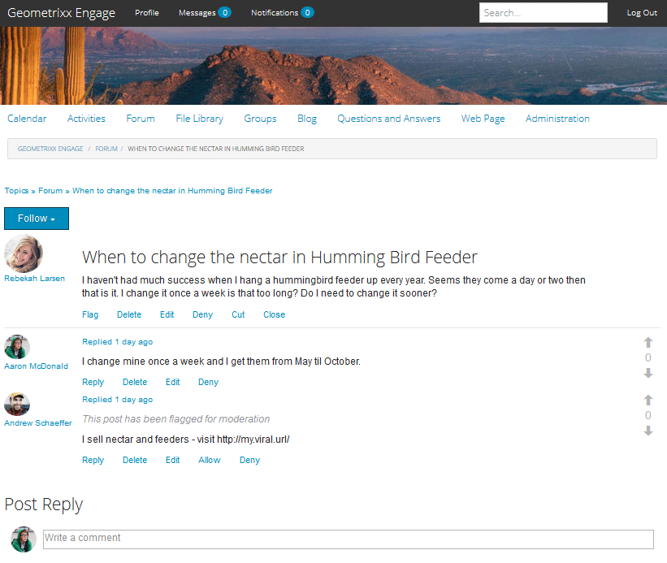

# Moderação no contexto {#in-context-moderation}

Para AEM Communities, a moderação pode ser executada por administradores e membros confiáveis da comunidade diretamente na página publicada onde o conteúdo da comunidade foi publicado.

Ao usar um console [de](moderation.md)moderação, as informações exibidas para o conteúdo incluem um link para a página publicada para permitir o acesso a ações de moderação adicionais disponíveis ao moderar no contexto.

## Ações de moderação {#moderation-actions}

Visite a visão geral da moderação para obter uma descrição das ações [de](moderate-ugc.md#moderation-actions)moderação.

## Interface de usuário de moderação {#moderation-ui}

A interface do usuário apresentada ao moderador na instância de publicação está contida na caixa de diálogo para publicar e gerenciar conteúdo gerado pelo usuário (UGC). Os elementos da interface são determinados pelo status do visitante do site - se eles são...

1. O membro que postou o conteúdo.
1. Um moderador de membro confiável.
1. Um administrador.
1. Conectado, mas nenhum administrador, moderador ou autor do conteúdo.
1. Não conectado.

## Exemplo {#example}

Usando o site [Geometrixx Engage](http://localhost:4503/content/sites/engage/en.html) criado ao [começar a usar o AEM Communities](getting-started.md), é possível configurar rapidamente um thread em um fórum no qual você pode experimentar várias atividades de moderação no ambiente de publicação, como mostrado abaixo.

Aaron McDonald (aaron.mcdonald@mailinator.com) foi identificado como um membro confiável da comunidade ao adicioná-lo ao grupo de moderadores engajados pela comunidade ao criar o site.

Rebekah Larsen (rebekah.larsen@trashymail.com) pode ser adicionado como membro do grupo de membros engajados da comunidade usando o console Membros.

Para obter mais informações sobre grupos de usuários da comunidade, visite [Gerenciar usuários e grupos](users.md)de usuários.

### Criar as publicações do fórum {#create-the-forum-posts}

* Faça logon como Rebekah Larsen (rebekah.larsen@trashymail.com)

   * Selecionar fórum
   * Selecionar nova publicação
   * Insira o Assunto

      Quando mudar o néctar no alimentador de aves

   * Insira o texto do corpo

      Não tenho tido muito sucesso quando penduro um alimentador de beija-flores todos os anos. Parece que chegam um dia ou dois, então é isso. Eu mudo uma vez por semana é muito tempo? Eu preciso mudar isso mais cedo?

   * Selecionar publicação
   * Selecione Desconectar

* Faça logon como Aaron McDonald (aaron.mcdonald@mailinator.com)

   * Selecionar fórum
   * Para o tópico do Hummingbird, selecione Leia mais
   * Insira o comentário para a resposta da postagem

      Eu troco o meu uma vez por semana e os recebo de maio a outubro.

   * Selecionar resposta
   * Selecione Desconectar

* Faça logon como Andrew Schaeffer (andrew.schaeffer@trashymail.com)

   * Selecionar fórum
   * Para o tópico do Hummingbird, selecione Leia mais
   * Insira o comentário para a resposta da postagem

      Eu vendo néctar e alimentadores - visite https://my.viral.url/

   * Selecionar resposta
   * Selecione Desconectar

### Visitante do site anônimo (#5) {#anonymous-site-visitor}

Veja a seguir uma visualização do fórum visto por um visitante do site que não está conectado (5).

Um visitante de site anônimo só pode visualização no fórum, mas não pode publicar nenhum conteúdo nem executar ações de moderação.

### Novo Membro ( nº 4) {#new-member}

No autor, faça logon como administrador e adicione Boyd Larsen (boyd.larsen@dodgit.com) como um novo membro do grupo de membros engajados pela comunidade usando o console Membros e, em seguida, faça logout.

Ao publicar, faça logon como Boyd Larsen e acesse o thread selecionando `Forum`e, em seguida, `Read more` para a publicação de beija-flor.

Aviso:

* Boyd não participou do fórum.
* Boyd não pode excluir nada.
* Boyd está conectado e pode responder ou sinalizar conteúdo.

Faça com que Boyd selecione Sinalizar para sinalizar o conteúdo publicado por Andrew.

Fazer logoff

### Administrator (#3) {#administrator}

Faça logon como um administrador (admin) e acesse o thread selecionando Fórum e, em seguida, Leia mais para uma publicação.

Aviso:

* O administrador pode sinalizar, excluir, editar, negar, recortar, fechar, fixar, recurso.
* O administrador pode selecionar Administração para acessar o console de moderação.

Selecione o item de menu Administração para acessar o console [de](moderation.md) moderação do ambiente de publicação.

Observe que, para um administrador, todo o conteúdo moderável é visível, não apenas o conteúdo do site da comunidade Geometrixx Engage.

O filtro de pesquisa é um painel lateral que alterna entre aberto e fechado.

Fazer logoff.

### Moderador da comunidade (#2) {#community-moderator}

Faça logon como Aaron McDonald (aaron.mcdonal@mailinator.com), um moderador da comunidade, e acesse o thread selecionando Fórum e, em seguida, Leia mais para obter a publicação do beija-flor.

Aviso:

* Aaron pode Responder, Excluir, Editar ou Negar sua própria publicação.
* Aaron também pode Sinalizar/Permitir, Responder, Excluir, Editar, Negar outro conteúdo.
* Aaron pode cortar o tópico do fórum para movê-lo para outro fórum para o qual ele modera.
* Aaron pode selecionar Administração para acessar o console de moderação.

Selecione o item de menu Administração para acessar o console [de](moderation.md) moderação do ambiente de publicação.

Observe que, para um moderador da comunidade, somente o conteúdo moderável do site da comunidade do Geometrixx Engage está visível.

Observe que o moderador da comunidade tem as mesmas opções que o administrador (a imagem está na barra lateral de pesquisa alternada fechada), mas não há acesso a outros consoles do AEM.

Fazer logoff.

### Autor de conteúdo (#1) {#content-author}

Faça logon como Rebekah Larsen (rebekah.larsen@mailinator.com), um membro da comunidade que iniciou o processo, e acesse o thread selecionando Fórum e, em seguida, Leia mais para a publicação de beija-flor.

Aviso:

* Rebekah pode excluir ou editar sua própria postagem.
* Rebekah também pode responder ou sinalizar outro conteúdo.
* Rebekah não pode acessar o console de moderação.

