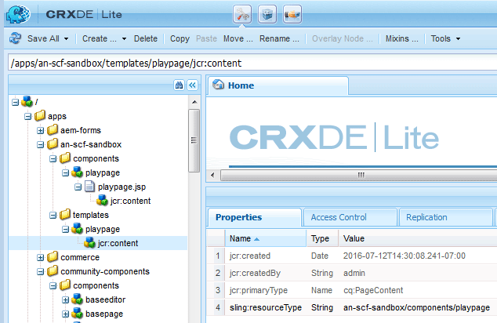

# Aplicativo de sandbox inicial {#initial-sandbox-application}

Nesta seção, você criará o seguinte:

* O **[modelo](#createthepagetemplate)** que será usada para criar páginas de conteúdo no site de exemplo.
* O **[componente e script](#create-the-template-s-rendering-component)** que será usada para renderizar as páginas do site.

## Criar o modelo de conteúdo {#create-the-content-template}

Um modelo define o conteúdo padrão de uma nova página. Sites complexos podem usar vários modelos para criar os diferentes tipos de páginas no site. Além disso, o conjunto de modelos pode se tornar um blueprint usado para implantar alterações em um cluster de servidores.

Neste exercício, todas as páginas são baseadas em um modelo simples.

1. No painel do explorador do CRXDE Lite:

   * Selecionar `/apps/an-scf-sandbox/templates`
   * **[!UICONTROL Criar]** > **[!UICONTROL Criar modelo]**

1. Na caixa de diálogo Criar modelo, digite os seguintes valores e clique em **[!UICONTROL Próximo]**:

   * Etiqueta: `playpage`
   * Título: `An SCF Sandbox Play Template`
   * Descrição: `An SCF Sandbox template for play pages`
   * Tipo de recurso: `an-scf-sandbox/components/playpage`
   * Classificação: &lt;leave as=&quot;&quot; default=&quot;&quot;>

   O Label é usado para o nome do nó.

   O Tipo de Recurso é exibido na `playpage`o nó jcr:content como a propriedade `sling:resourceType`. Ela identifica o componente (recurso) que renderiza o conteúdo quando solicitado por um navegador.

   Nesse caso, todas as páginas criadas usando o `playpage` são renderizados pelo `an-scf-sandbox/components/playpage` componente. Por convenção, o caminho para o componente é relativo, permitindo que o Sling procure o recurso primeiro na `/apps` e, se não for encontrada, no `/libs` pasta.

   

1. Se estiver usando copiar/colar, verifique se o valor de Tipo de recurso não tem espaços à esquerda ou à direita.

   Clique em **[!UICONTROL Avançar]**.

1. &quot;Caminhos permitidos&quot; refere-se aos caminhos das páginas que usam esse modelo, de modo que o modelo seja listado para a variável **[!UICONTROL Nova página]** caixa de diálogo.

   Para adicionar um caminho, clique no botão de adição `+` e tipo `/content(/.&ast;)?` na caixa de texto exibida. Se estiver usando copiar/colar, verifique se não há espaços à esquerda ou à direita.

   Observação: O valor da propriedade de caminho permitida é um *expressão regular*. As páginas de conteúdo com um caminho que corresponda à expressão podem usar o modelo . Nesse caso, a expressão regular corresponde ao caminho da variável **/conteúdo** e todas as suas subpáginas.

   Quando um autor cria uma página abaixo `/content`, o `playpage` O modelo chamado &quot;Um modelo de página de sandbox SCF&quot; aparece em uma lista de modelos disponíveis para uso.

   Depois que a página raiz é criada a partir do modelo, o acesso ao modelo pode ser restrito a este site, modificando a propriedade para incluir o caminho raiz na expressão regular, ou seja,

   `/content/an-scf-sandbox(/.&ast;)?`

   

1. Clique em **[!UICONTROL Avançar]**.

   Clique em **[!UICONTROL Próximo]** no **[!UICONTROL Pais permitidos]** painel.

   Clique em **[!UICONTROL Próximo]** no **[!UICONTROL Filhos permitidos]** painéis.

   Clique em **[!UICONTROL OK]**.

1. Depois de clicar em OK e terminar de criar o modelo, você notará triângulos vermelhos exibidos nos cantos dos valores da guia Propriedades para o novo `playpage` modelo . Esses triângulos vermelhos indicam edições que não foram salvas.

   Clique em **[!UICONTROL Salvar tudo]** para salvar o novo template no repositório.

   

### Criar o componente de renderização do modelo {#create-the-template-s-rendering-component}

Crie o *componente* que define o conteúdo e renderiza todas as páginas criadas com base no [modelo de página de reprodução](#createthepagetemplate).

1. No CRXDE Lite, clique com o botão direito do mouse **`/apps/an-scf-sandbox/components`** e clique em **[!UICONTROL Criar > Componente]**.
1. Ao definir o nome do nó (Rótulo) como *playpage*, o caminho para o componente é

   `/apps/an-scf-sandbox/components/playpage`

   que corresponde ao Tipo de recurso do modelo de página de reprodução (como opção, menos o **`/apps/`** parte do caminho).

   No **[!UICONTROL Criar componente]** digite os seguintes valores de propriedade:

   * Rótulo: **playpage**
   * Título: **Um Componente de reprodução de sandbox SCF**
   * Descrição: **Este é o componente que renderiza conteúdo para uma página de sandbox SCF.**
   * Supertipo: *&lt;leave blank=&quot;&quot;>*
   * Grupo: *&lt;leave blank=&quot;&quot;>*

   

1. Clique em **[!UICONTROL Próximo]** até que o **[!UICONTROL Filhos permitidos]** O painel da caixa de diálogo é exibido:

   * Clique em **[!UICONTROL OK]**.
   * Clique em **[!UICONTROL Salvar tudo]**.

1. Verifique se o caminho para o componente e o resourceType do modelo correspondem.

   >[!CAUTION]
   >
   >A correspondência entre o caminho para o componente de página de reprodução e a propriedade sling:resourceType do modelo de página de reprodução é crucial para o funcionamento correto do site.

   
