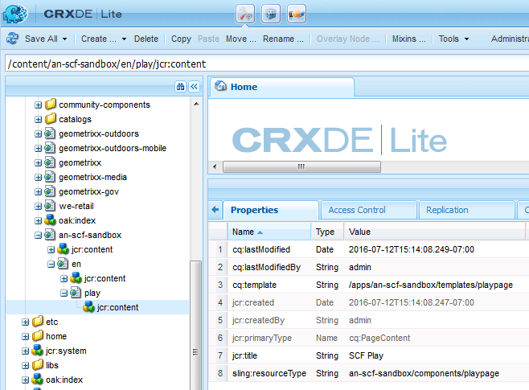

# Conteúdo inicial da sandbox {#initial-sandbox-content}

Nesta seção, você cria as seguintes páginas, todas usando o [modelo de página](initial-app.md#createthepagetemplate):

* Site de sandbox SCF, que redirecionará para a versão em inglês da página principal.

   * Sandbox SCF - A página principal da versão em inglês do site.

   * SCF Play - Filho da página principal na qual jogar.

Embora este tutorial não aborde [cópias de idioma](../../help/sites-administering/tc-prep.md), foi projetada para que a página raiz possa implementar a detecção do idioma preferencial para o usuário por meio do cabeçalho de HTML e redirecionar para a página principal apropriada do idioma. A convenção é usar o código de país de duas letras para o nome do nó da página, por exemplo, &quot;en&quot; para inglês, &quot;fr&quot; para francês e assim por diante.

## Criar primeiras páginas {#create-first-pages}

Agora que existe um [modelo de página](initial-app.md#createthepagetemplate), podemos estabelecer a página raiz do site no diretório /content.

1. A interface do usuário padrão atualmente fornece blueprints para criar sites. Como este tutorial está criando um site simples, a interface clássica é útil.

   Para alternar para a interface clássica, selecione Navegação global e passe o mouse sobre o lado direito do ícone Projetos. Selecione o *Alternar para a interface clássica* ícone que aparece:

   

   A capacidade de alternar para a interface clássica deve ser [habilitado por um administrador](../../help/sites-administering/enable-classic-ui.md).

1. No [página de boas-vindas da interface clássica](http://localhost:4502/welcome.html), selecione **[!UICONTROL Sites]**.

   

   Como alternativa, acesse a interface clássica dos sites diretamente navegando até [/siteadmin.](http://localhost:4502/siteadmin)

1. No painel do explorador, selecione **[!UICONTROL Sites]** e, na barra de ferramentas, selecione **[!UICONTROL Novo]** > **[!UICONTROL Nova página]**.

   No **[!UICONTROL Criar página]** insira o seguinte:

   * Título: `SCF Sandbox Site`
   * Nome: `an-scf-sandbox`
   * Selecionar **[!UICONTROL Um modelo de reprodução de sandbox SCF]**
   * Clique em **[!UICONTROL Criar]**

   

1. No painel do explorador, selecione a página que acabou de criar, `/Websites/SCF Sandbox Site`e clique em **[!UICONTROL Novo]** > **[!UICONTROL Nova página]**:

   * Título: `SCF Sandbox`
   * Nome: `en`
   * Selecionar **[!UICONTROL Um modelo de reprodução de sandbox SCF]**
   * Clique em **[!UICONTROL Criar]**

1. No painel do explorador, selecione a página que acabou de criar, `/Websites/SCF Sandbox Site/SCF Sandbox`e clique em **[!UICONTROL Novo]** > **[!UICONTROL Nova página]**

   * Título: `SCF Play`
   * Nome: `play`
   * Selecionar **[!UICONTROL Um modelo de reprodução de sandbox SCF]**
   * Clique em **[!UICONTROL Criar]**

1. É assim que o site agora é exibido no console Sites. Observe que as páginas secundárias do item selecionado no painel do explorador são exibidas no painel direito, onde podem ser gerenciadas.

   

   Esta é a exibição de repositório do que foi criado usando a ferramenta Site e o modelo:

   

## Adicionar o caminho de design {#add-the-design-path}

Quando ` [/etc/designs/an-scf-sandbox](setup-website.md#setupthedesigntreeetcdesigns)` foi criado usando a seção designs do console Ferramentas, a propriedade &quot;

* `cq:template="/libs/wcm/core/templates/designpage"`

foi definido, o que fornece a capacidade opcional de fazer referência a ativos de design em um script usando `currentDesign.getPath()`. Por exemplo

* `% String favIcon = currentDesign.getPath() + "/favicon.ico"; %`

   * Nome: `cq:designPath`
   * Tipo: `String`
   * Valor: `/etc/designs/an-scf-sandbox`

* Clique no botão verde `[+] Add`

O repositório deve ser mostrado da seguinte maneira:

* Clique em **[!UICONTROL Salvar tudo]**

Em caso de problemas para salvar a configuração, faça logon novamente e configure novamente.

>[!NOTE]
>
>A utilização de `cq:designPath` é opcional e não está relacionado ao [uso de clientlibs](develop-app.md#includeclientlibsintemplate), que são essencialmente necessários à medida que os componentes do CCAH usam [clientlibs](client-customize.md#clientlibs-for-scf) para gerenciar JS e CSS.
