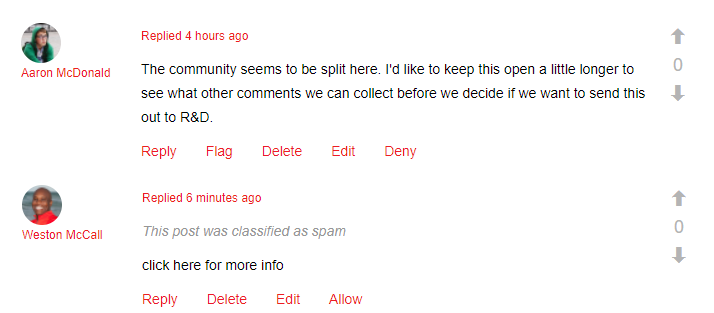

# Moderação de conteúdo da comunidade {#moderating-community-content}

## Visão geral {#overview}

O conteúdo da comunidade, também conhecido como conteúdo gerado pelo usuário (UGC), é criado quando um membro (visitante do site conectado) publica conteúdo de um site da comunidade publicado por meio da interação com um dos seguintes componentes da comunidade:

* [Blog](/help/communities/blog-feature.md): os membros postam um artigo de blog ou comentário.
* [Calendário](/help/communities/calendar.md): os membros postam um evento de calendário ou comentário.
* [Comentários](/help/communities/comments.md): os membros postam um comentário ou respondem a um comentário.

* [Fórum](/help/communities/forum.md): os membros postam um novo tópico ou respondem a um tópico.
* [Ideação](/help/communities/ideation-feature.md): os membros postam uma ideia ou um comentário.
* [QnA](/help/communities/working-with-qna.md): os membros criam uma pergunta ou respondem a uma pergunta.
* [Resenhas](/help/communities/reviews.md): os membros postam um comentário ao classificar um item.

A moderação de UGC é útil para reconhecer contribuições positivas e limitar as negativas (como spam e linguagem abusiva). O UGC pode ser moderado a partir de vários ambientes:

* [Armazenamento de conteúdo da comunidade](working-with-srp.md)

* [Console de moderação em massa](moderation.md)

  O console Moderação pode ser acessado por administradores e [moderadores da comunidade](/help/communities/users.md) no ambiente público e pelos administradores no ambiente de criação. Isso é possível quando o conteúdo da comunidade é armazenado em um [armazenamento comum](/help/communities/working-with-srp.md).

* [Moderação no contexto](in-context.md)

  A moderação no ambiente de publicação pode ser executada por administradores e moderadores da comunidade diretamente na página em que o conteúdo foi publicado.

## Ações de moderação {#moderation-actions}

As ações que podem ser executadas no conteúdo postado (UGC) variam dependendo da identidade do usuário e do ambiente. A tabela abaixo usa a seguinte terminologia para descrever as várias funções de acordo com a identidade do usuário:

* `Admin`

  Um usuário que é membro de [administradores da comunidade](users.md) grupo.

* `Moderator`

  Um membro de um [moderadores da comunidade](users.md#publishenvironmentusersandgroups) grupo (tem [permissões do moderador](in-context.md#moderatorpermissions)).

* `Creator`

  O usuário que publicou o conteúdo.

* `Member`

  Um usuário conectado sem permissões especiais.

* `Visitor`

  Um usuário anônimo.

<table>
 <tbody>
  <tr>
   <td> </td>
   <td><strong>Administrador</strong></td>
   <td><strong>Moderador</strong></td>
   <td><strong>Criador</strong></td>
   <td><strong>Membro</strong></td>
   <td><strong>Visitante</strong></td>
   <td><strong>Evento  Acionado</strong></td>
   <td><strong>Pré-moderado</strong></td>
  </tr>
  <tr>
   <td><strong>Editar/  Excluir</strong></td>
   <td>X</td>
   <td>X</td>
   <td>X</td>
   <td> </td>
   <td> </td>
   <td> </td>
   <td> </td>
  </tr>
  <tr>
   <td><strong>Recortar</strong></td>
   <td>X</td>
   <td>X</td>
   <td> </td>
   <td> </td>
   <td> </td>
   <td> </td>
   <td> </td>
  </tr>
  <tr>
   <td><strong>Negar </strong></td>
   <td>X</td>
   <td>X</td>
   <td> </td>
   <td> </td>
   <td> </td>
   <td>X</td>
   <td> </td>
  </tr>
  <tr>
   <td><strong>Fechar/  Reabrir</strong></td>
   <td>X</td>
   <td>X</td>
   <td> </td>
   <td> </td>
   <td> </td>
   <td>X</td>
   <td>X  </td>
  </tr>
  <tr>
   <td><strong>Sinalizador/  Remover Sinalizador</strong></td>
   <td>X</td>
   <td>X</td>
   <td> </td>
   <td>X</td>
   <td> </td>
   <td>X</td>
   <td> </td>
  </tr>
  <tr>
   <td><strong>Permitir</strong></td>
   <td>X</td>
   <td>X</td>
   <td> </td>
   <td> </td>
   <td> </td>
   <td>X</td>
   <td>X</td>
  </tr>
 </tbody>
</table>

### Editar / Excluir {#edit-delete}

Depois que uma publicação é feita, ela pode ser editada ou excluída pelo criador, administrador ou moderador da comunidade.

Quando o UGC é excluído, ele é removido do repositório e não pode ser recuperado.

### Recortar {#cut}

É possível para um administrador ou moderador da comunidade mover um ou mais tópicos do fórum ou perguntas sobre QnA de um local para outro. Isso inclui de um site da comunidade para outro site da comunidade, desde que o mesmo membro tenha privilégios de moderação em ambos os sites.

Ao selecionar a ação Recortar, o conteúdo é copiado para a área de transferência. Várias publicações podem ser copiadas e movidas como um grupo para o novo local.

No outro local, quando o conteúdo estiver presente na área de transferência, um botão Colar ficará visível ao lado de Nova publicação com um número que identifica o número de publicações que serão coladas. O botão Colar inclui uma opção para limpar a área de transferência em vez de colar.

### Negar  {#deny}

Um moderador pode impedir que o UGC permaneça visível no site publicado. Para administradores e moderadores da comunidade, a publicação ainda está disponível e é anotada como spam.

### Fechar / Reabrir {#close-reopen}

A ação Fechar opera em todo o thread da conversa (um tópico do fórum ou o comentário inicial) e inclui todas as postagens ou respostas subsequentes.

Quando encerradas, não só não são possíveis mais respostas, como também não são permitidas ações de moderação.

Para executar qualquer operação, o tópico ou comentário deve ser Reaberto.

A ação Fechar/Reabrir pode ser executada por administradores ou moderadores da comunidade.

### Sinalizar / Remover Sinalizador {#flag-unflag}

Sinalizar é um meio para qualquer membro conectado, exceto para o criador do conteúdo, para indicar que há um problema com o conteúdo de uma publicação. Depois de sinalizado, um ícone de não sinalizar é exibido, permitindo que o mesmo membro remova o sinalizador do conteúdo.

A moderação do contexto interno pode ser configurada para permitir que os membros selecionem um motivo ao sinalizar uma publicação. A lista de motivos de sinalizador selecionáveis pode ser configurada, incluindo se um motivo personalizado pode ser inserido. O motivo do sinalizador é salvo com o UGC, mas o motivo não aciona nenhuma ação específica. Somente o número de sinalizadores aciona uma notificação. O conteúdo sinalizado é anotado como tal, para que os moderadores possam agir nele.

O sistema rastreia todos os sinalizadores, quem sinalizou, o motivo do sinalizador e envia um evento quando o limite é atingido. Se o UGC for Permitido por um moderador da comunidade, esses sinalizadores serão arquivados. Após permitir e arquivar, se houver sinalizadores subsequentes, eles serão arquivados como se não houvesse sinalizadores anteriores.

### Permitir {#allow}

A ação Permitir é uma opção para UGC que foi sinalizada, negada ou não foi aprovada em um sistema pré-moderado. A ação Permitir limpa todos os status sinalizados ou negados/spam presentes e arquiva todos os dados sinalizados.

## Conceitos comuns de moderação {#common-moderation-concepts}

### Pré-moderação {#premoderation}

Quando o UGC é pré-moderado, a publicação não aparece no site publicado até ser aprovada por uma ação de moderação. Durante a criação de um [site da comunidade](/help/communities/sites-console.md), marcando a caixa [O conteúdo é pré-moderado](sites-console.md#moderation) permite a pré-moderação para todo o site. Quando os componentes são colocados em uma página, os componentes que oferecem suporte à moderação podem ser configurados para pré-moderação usando uma configuração na caixa de diálogo de edição:

* [Comentários](comments.md) e [análises](reviews.md)
in **[!UICONTROL Moderação de usuário]** > **[!UICONTROL Pré-moderação]**.

* [Fórum](/help/communities/forum.md), [ideação](/help/communities/ideation-feature.md), [QnA](/help/communities/working-with-qna.md), e [calendário](/help/communities/calendar.md)
in **[!UICONTROL Configurações]** > **[!UICONTROL Moderado]**.

### Detecção de spam {#spam-detection}

A detecção de spam é uma funcionalidade de moderação automática que filtra partes indesejáveis de conteúdo enviado gerado pelo usuário, marcando-as como spam. Depois de habilitado, ele identifica se um conteúdo gerado pelo usuário é spam ou não com base em uma coleção pré-configurada de palavras de spam. As palavras de spam padrão são fornecidas em

`/libs/settings/community/sites/moderation/spamdetector-conf/profiles/spam_words.txt`.

No entanto, para personalizar ou estender as palavras de spam padrão, crie um conjunto de palavras no diretório /apps seguindo a estrutura das palavras de spam padrão com [sobreposição](/help/communities/overlay-comments.md).

Uma publicação gerada pelo usuário (em todos os tipos de conteúdo, por exemplo, blogs, fóruns e comentários) contendo palavras de spam é marcada com o texto &quot;Esta publicação foi classificada como spam&quot; acima da publicação.

O moderador pode visualizar essa publicação e marcar o mesmo para permitir ou negar a exibição no site. As ações de moderação nessas publicações podem ser executadas no contexto ou pela interface de moderação em massa.

Para ativar o mecanismo de detecção de spam, siga estas etapas:

1. Abertura [Console da Web](https://localhost:4502/system/console/configMgr), acessando `/system/console/configMgr`.

1. Localizar **Moderação automática do AEM Communities** e editá-la.
1. Adicione o **[!UICONTROL SpamProcess]** entrada.

>[!NOTE]
>
>A detecção de spam é implementada somente para locais em inglês.

### Sentimento {#sentiment}

O sentimento é calculado com base no número de palavras-chave positivas e negativas ([watchwords](#configuringwatchwords)) presente em uma publicação (UGC).

A análise de sentimentos usa um conjunto de regras pré-configuradas e calcula o sentimento do UGC. As regras padrão estão em `/libs/cq/workflow/components/workflow/social/sentiments/rules`.

O valor que as regras geram é de 1 (todas negativas, sem palavras positivas) a 10 (todas positivas, sem palavras negativas). Um valor de sentimento de 5 é um sentimento neutro e é o padrão.

As regras definidas no componente /libs são:

* Regra 1: defina o valor para 1 se não houver palavras positivas e pelo menos uma palavra negativa.
* Regra 2: defina o valor como 10 se não houver palavras negativas e pelo menos uma palavra positiva.
* Regra 3: defina o valor como 3 se houver mais palavras negativas do que palavras positivas.
* Regra 4: defina o valor como 8 se houver mais palavras positivas do que palavras negativas.

Para substituir ou adicionar regras, crie um conjunto de regras no diretório /apps seguindo a estrutura das regras padrão. Edite a configuração do sentimento para poder identificar o local das regras.

Depois de analisado, o sentimento é armazenado com o UGC.

No [console de moderação em massa](/help/communities/moderation.md)No entanto, é possível filtrar e visualizar o UGC com base no fato de o sentimento ser negativo, neutro ou positivo.

#### Watchwords {#watchwords}

O AEM Communities fornece uma *analisador de palavra-chave* como uma etapa no processo para avaliar [sentimento](#sentiment). A contribuição para o valor do sentimento fornecida pelas palavras de observação é devido a uma comparação de palavras de observação negativas e positivas usadas no conteúdo publicado e palavras proibidas.

#### Configurar o sentimento e as palavras-chave {#configure-sentiment-and-watchwords}

A lista de palavras de ordem positivas e negativas pode ser personalizada como as regras de sentimento.

A lista padrão de palavras-chave pode ser inserida como propriedades de um nó no repositório, semelhante ao padrão ou substituindo o padrão ao configurar o serviço OSGi `sentimentprocess.name` com a lista de palavras.

A variável **sentimentprocess.name** O também pode ser modificado para fazer referência ao local de um conjunto personalizado de regras de sentimento.

Para configurar o sentimento e as palavras de observação:

* Faça logon na instância do autor como administrador.
* Abertura [Console da Web](https://localhost:4502/system/console/configMgr).
* Localizar `sentimentprocess.name`.
* Selecione a configuração para abri-la no modo de edição.

* **Watchwords positivas**

  Uma lista separada por vírgulas de palavras que contribuem para um sentimento positivo que substitui os padrões. O padrão é uma lista vazia.

* **Watchwords Negativas**

  Uma lista separada por vírgulas de palavras que contribuem para um sentimento negativo que substitui os padrões. O padrão é uma lista vazia.

* **Caminho explícito para o nó Watchwords**

  O local de repositório de um nó que contém o padrão `positive` e `negative` propriedades que especificam palavras-chave padrão. O padrão é `/libs/settings/community/watchwords/default`.

* **Regras de sentimento**

  A localização no repositório das regras para calcular o sentimento com base em palavras de observação positivas e negativas. O padrão é `/libs/cq/workflow/components/workflow/social/sentiments/rules` (no entanto, não há mais nenhum workflow envolvido).

Veja a seguir um exemplo de uma entrada personalizada para as palavras de observação padrão, quando `Explicit Path to Watchwords Node` está definida como `/libs/settings/community/watchwords/default`.

### Permissões do moderador {#moderator-permissions}

As seguintes permissões, quando atribuídas ao mesmo recurso, são coletivamente chamadas de `moderator permissions`:

* `Read`
* `Modify`
* `Create`
* `Delete`
* `Replicate`
