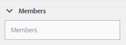
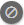

# Console de moderação {#moderation-console}

No AEM Communities, em massa [moderação do conteúdo da comunidade](/help/communities/moderate-ugc.md) O é possível nos ambientes de criação e publicação por administradores e moderadores da comunidade (membros confiáveis da comunidade atribuídos como moderadores).

Os administradores e os moderadores da comunidade também podem executar [moderação no contexto](/help/communities/in-context.md) no ambiente de publicação.

Um recurso de todos [sites da comunidade](/help/communities/sites-console.md) é um `Administration` item de menu disponível para usuários que fazem logon com privilégios administrativos. O `Administration` fornece acesso ao console Moderação .

No console Moderação, os administradores e os moderadores da comunidade terão acesso a todo o conteúdo gerado pelo usuário (UGC) para o qual têm permissão para moderar. Se for permitido moderar vários sites, é possível visualizar postagens em todos os sites ou filtrar por sites de comunidades selecionadas.

Para obter informações mais detalhadas, visite [Gerenciar usuários e grupos de usuários](/help/communities/users.md).

O console Moderação é compatível com:

* Execução de tarefas de moderação em massa.
* Pesquisando UGC.
* Exibindo detalhes do UGC.
* Exibindo detalhes do autor do UGC.

Somente quando conectado como administrador ou como um membro com ` [moderator permissions](/help/communities/in-context.md#identifyingtrustedmembers)`, podem ser realizadas tarefas de moderação.

## Publicar acesso ao ambiente {#publish-environment-access}

O acesso ao console Moderação de um site da comunidade publicado é feito por meio de um link de Administração que é exibido quando um moderador da comunidade é conectado.

Ao selecionar o link Administração , o console Moderação é exibido:

## Acesso ao ambiente do autor {#author-environment-access}

No ambiente de criação, para acessar o console Moderação

* Na navegação global, selecione **[!UICONTROL Comunidades]** > **[!UICONTROL Moderação]**.

Somente quando conectado como administrador ou como membro com [permissões de moderador](/help/communities/in-context.md#identifyingtrustedmembers), as tarefas de moderação podem ser realizadas. O único conteúdo da comunidade exibido é aquele que o membro conectado tem permissão para moderar.

>[!NOTE]
>
>O UGC do ambiente de publicação só será visível no autor se o SRP escolhido implementar uma loja comum. Por exemplo, por padrão, o armazenamento é o JSRP, que não é um armazenamento comum para autor e publicação. Consulte [Armazenamento de conteúdo da comunidade](/help/communities/working-with-srp.md).

## Interface do usuário do console de moderação {#moderation-console-ui}

Além do painel de navegação esquerdo (que aparece no autor, mas não na publicação), a interface do usuário de moderação tem as seguintes áreas principais:

* **[Barra de navegação superior](#top-navigation-bar)**
* **[Barra de ferramentas](#toolbar)**
* **[Área de conteúdo](#content-area)**

### Barra de navegação superior {#top-navigation-bar}

A barra de navegação superior é constante para todos os consoles. Para obter mais informações, consulte [Manuseio básico](/help/sites-authoring/basic-handling.md).

### Barra de ferramentas {#toolbar}

A barra de ferramentas, localizada abaixo da barra de navegação superior, fornece o seguinte switch de alternância no lado esquerdo:

* [Filtrar painel](/help/communities/moderation.md#filterrail)
abre um painel que permite escolher as propriedades nas quais filtrar o conteúdo.

A barra de ferramentas, localizada abaixo da barra de navegação superior, fornece o seguinte switch de alternância no lado esquerdo:

[Filtrar painel](/help/communities/moderation.md#filterrail)
abre um painel, ao selecionar Pesquisa, o que permite escolher as propriedades nas quais filtrar o conteúdo.

### Área de conteúdo {#content-area}

A área de conteúdo contém informações para o UGC publicado:

* UGC publicado
* Nome do membro
* Avatar do membro
* Localização da publicação.
* Quando foi postado.
* Número de respostas à publicação.
* [Sentimento](/help/communities/moderate-ugc.md#sentiment) associado à publicação
* Se aprovada, uma marca de seleção é exibida.
* Se houver um anexo, um clipe de papel será exibido.

>[!NOTE]
> 
>A área de conteúdo apresenta uma *rolagem infinita*, o que significa que permitirá continuar a rolagem até atingir o fim do conteúdo. A barra de ferramentas permanece em uma posição fixa e visível acima da área de conteúdo, mesmo durante a rolagem.

### Filtrar painel {#ootbfilters}

O ícone do painel lateral abre o painel filtro. O painel de filtro, que aparece à esquerda da área de conteúdo, fornece filtros diferentes, cada um com um efeito imediato no UGC referenciado que aparece na área de conteúdo.

Os filtros em cada categoria são **OU** d juntos e os filtros em diferentes categorias **E** d juntos.

Por exemplo, se você marcar ambos **Pergunta** e **Resposta**, você verá um conteúdo que é um **Pergunta** *ou* um **Resposta**.

No entanto, se você marcar **Pergunta** e **Pending**, você verá somente o conteúdo que é um **Pergunta** e **Pending**.

>[!NOTE]
>
>Os moderadores da comunidade podem marcar os filtros predefinidos na interface do usuário do console de moderação. Como esses filtros são anexados ao final do URL (como parâmetros de cadeias de caracteres de consulta), os moderadores podem retornar aos filtros marcados posteriormente e também compartilhar esses links.

Quando o painel de filtro estiver aberto, o ícone Pesquisar alterna o painel lateral para fechado. No entanto, para fechar o painel de filtros e exibir somente o conteúdo gerado pelo usuário, clique no ícone Pesquisar e selecione a opção Somente conteúdo .

#### Caminho do conteúdo {#content-path}

O Caminho do conteúdo limita o UGC de referência exibido nas publicações colocadas no repositório de conteúdo especificado.

#### Pesquisa de texto {#text-search}

A pesquisa de texto limita o UGC referenciado exibido em publicações nas quais o texto foi inserido.

#### Site {#site}

O site limita o UGC referenciado exibido para postagens em sites da comunidade selecionados. Se nenhum site estiver marcado, então todas as referências ao UGC serão exibidas.

>[!NOTE]
>
>Quando o console de moderação em massa é acessado por um administrador, todas as referências ao UGC são mostradas, incluindo sites não criados com o [assistente de criação de sites](/help/communities/sites-console.md), como as amostras de Geometrixx.
>
>Quando o console de moderação em massa é acessado ao publicar por um membro da comunidade confiável, somente as referências ao UGC criado para sites da comunidade que o membro está autorizado a moderar são mostradas e podem ser filtradas com o filtro Site .

#### Tipo de conteúdo {#content-type}

O Tipo de conteúdo limita o UGC referenciado exibido para postagens do tipo de recurso selecionado. Um ou mais dos seguintes tipos podem ser selecionados. Todos os tipos são mostrados se nenhum estiver selecionado.

* **Comentar**
* **Tópico do fórum**
* **Resposta do fórum**
* **Perguntas QnA**
* **Resposta QnA**
* **Artigo do blog**
* **Comentário do blog**
* **Evento do calendário**
* **Comentário do calendário**
* **Pasta da biblioteca de arquivos**
* **Documento da biblioteca de arquivos**
* **Ideia**
* **Comentário da ideação**

#### Tipos de conteúdo adicionais {#additional-content-types}

Para adicionar recursos adicionais sobre os quais filtrar:

* Faça logon na instância do autor como administrador.
* Abrir [Console da Web](https://localhost:4502/system/console/configMgr).
* Localizar `AEM Communities Moderation Dashboard Filters`.
* Selecione a configuração a ser aberta no modo de edição.
* Insira o ResourceType de um componente no qual filtrar:

   * Por exemplo, para filtrar nos componentes de Votação incluídos, insira:

      `Voting=social/tally/components/hbs/voting`
   

* Selecione Salvar.
* Atualize as Comunidades - Console de moderação.

O resultado é um novo filtro selecionável para `Voting` nos termos do `Content Type` grupo de filtros.

Quando esse filtro for selecionado, o conteúdo do painel mostrará o UGC que corresponde a qualquer um dos ResourceTypes inseridos.

#### Status {#status}

O Status limita o UGC referenciado exibido em postagens do status selecionado, que pode ser uma ou mais de Pendente, Aprovado, Negado ou Fechado, assim como Rascunho ou Programado para Artigos de Blog e Respondido ou Não Respondido para Perguntas QnA. Se nenhum estiver selecionado, então todos serão exibidos.

>[!NOTE]
>
>Se apenas o status Não respondido for selecionado, o moderador visualizará todo o conteúdo (para todos os tipos de conteúdo) exceto as perguntas respondidas. Isso ocorre porque a propriedade responsável pela Pergunta Respondida não existe no caso de perguntas não respondidas e outro conteúdo, como tópico do fórum, artigo do blog ou comentários.

#### Sinalização {#flagging}

A sinalização limita o UGC referenciado exibido a postagens que estão sinalizadas ou ocultas.

Depois que um conteúdo é sinalizado, ele permanece sinalizado até que você cancele a sinalização desse conteúdo único selecionando o **Sinalizador** novamente. Observe que não há níveis de sinalização, como importante ou de acompanhamento.

#### Membros {#members}

Os membros limitam o UGC referenciado exibido ao UGC publicado pelo nome do membro inserido.

#### Publicado nos últimos {#posted-in-the-last}

Publicado em Últimos limites, o UGC referenciado é exibido para postagens feitas na última hora, dia, semana, mês ou ano.

#### Sentimento {#sentiment}

[Sentimento](/help/communities/moderate-ugc.md#sentiment) limita o UGC referenciado exibido em publicações com um valor de sentimento positivo, negativo ou neutro.

## Filtros personalizados {#custom-filters}

Além dos filtros prontos para uso em [Filtrar painel](/help/communities/moderation.md#ootbfilters), filtros personalizados adicionais nos metadados podem ser adicionados à interface do usuário de moderação. Os desenvolvedores podem usar o código de amostra no Github para estender os filtros da interface do usuário de moderação existentes.

O [projeto de exemplo](https://github.com/Adobe-Marketing-Cloud/aem-communities-extensions/tree/main/aem-communities-moderation-filter) no Github implementa o filtro Tag , para filtrar a lista de UGC com base no fato de as tags específicas serem aplicadas no conteúdo gerado pelo usuário. Você pode seguir o código de amostra e criar filtros análogos para outros campos de metadados UGC semelhantes.

Para instalar a amostra do filtro Tags:

1. Abra o gerenciador de pacotes no AEM Author (`https://[aem-author]:4502/crx/packmgr/index.jsp`) e AEM Publish (`https://[aem-publish]:4503/crx/packmgr/index.jsp`).
1. Crie o pacote `com.adobe.social.sample.moderation.filter.ui.apps-1.0-SNAPSHOT.zip` do código Github, instale e habilite o mesmo.
1. Abra o console pacotes no AEM Author ( `https://[aem-author]:4502/system/console/bundles`) e AEM Publish ( `https://[aem-publish]:4503/system/console/bundles`).
1. Crie o pacote (`[com](https://sample-moderation-filter.com/).adobe.social.sample.moderation.filter.core-1.0-SNAPSHOT.jar`) do Github, e instale e habilite o mesmo.
1. Ir para **/apps/social/moderação/facetas** nó no AEM Author (`https://[aem-author]:4502/crx/de/index.jsp#/apps/social/moderation/facets`) e Publicação do AEM (`https://[aem-publish]:4502/crx/de/index.jsp#/apps/social/moderation/facets`).
1. Adicionar um usuário técnico **communities-utility-reader** com `jcr:read` permissões.

Para expor os filtros personalizados nos sites existentes da Comunidade:

1. Editar `Clientlibs` da página de moderação existente `/content/we-retail/us/en/community/moderation/shell3/jcr:content/head/clientlibs.`

   * Adicionar nova categoria `cq.social.hbs.moderation.v2.`

1. Ir para `/content/we-retail/us/en/community/moderation/shell3/jcr:content/rails/searchWell/items/filters.`

   * Definir como novo componente `sling:resourceType = social/moderation/v2/filters.`

1. Ir para `/content/we-retail/us/en/community/moderation/shell3/jcr:content/views/content/items/modcontainer`.

   * Definir como novo componente `sling:resourceType = social/moderation/v2/modcontainer`.

## Ações de moderação {#moderation-actions}

[Ações de moderação](/help/communities/moderate-ugc.md#moderation-actions) pode ser executado em uma ou mais seleções feitas na área de conteúdo ou durante a visualização dos detalhes do conteúdo.

Para moderar as publicações em massa, na área de conteúdo, clique no botão Selecionar () em uma publicação, que aparece ao passar o mouse sobre ela (desktop) ou pressionando e segurando um dedo na publicação (móvel). Ao fazer isso, você insere o modo de seleção múltipla e agora pode selecionar as publicações subsequentes para moderação em massa ao simplesmente clicar nelas. Use os botões exibidos na barra de ferramentas para executar ações de moderação nas publicações selecionadas. Todas as ações solicitarão confirmação.

Para moderar uma única publicação na área de conteúdo, passe o mouse sobre ela (desktop) ou pressione e segure o dedo na publicação (móvel) de modo que os botões apareçam na publicação. Ao operar em um único detalhe de conteúdo, somente uma ação de exclusão solicitará a confirmação.

### Moderação de várias publicações {#moderating-multiple-posts}

Entre no modo de seleção em massa clicando no botão `Select` ícone em uma publicação:

Para sair do modo de seleção em massa, selecione o ícone cancelar (x) na barra de ferramentas:

As ações de moderação que podem ser executadas em várias publicações são:

* Negar 
* Excluir
* Fechar/reabrir as publicações

Os ícones que permitem essas ações só aparecem na barra de ferramentas quando várias publicações são selecionadas.

### Moderação de uma única publicação {#moderating-a-single-post}

No modo de seleção único, é possível:

* Visualize os detalhes do usuário selecionando o nome do usuário.
* Visualize a publicação no contexto selecionando o link para a publicação.
* [Responder](#reply)
* [Permitir](#allow)
* [Negar ](#deny)
* [Excluir](#delete)
* [Fechar](#close)
* Exibir [Histórico de moderação](#moderation-history)
* [Visualizar Detalhes](#viewdetails)

Apresentado na exibição de cartão acima dos ícones de ação de moderação está o texto da publicação e abaixo estão os dados que indicam:

* Se tiver respondido e, em caso afirmativo, precedido do número de respostas.
* Se tiver sido sinalizado.
* Se tiver sido aprovado.
* Quando o UGC foi postado.

#### Responder {#reply}

Ao trabalhar com uma única publicação, um ícone de Resposta será exibido se o tipo UGC suportar respostas e estiver configurado para permitir respostas.

#### Permitir {#allow}

Ao trabalhar com uma única publicação, o ícone Permitir será exibido quando a publicação tiver sido sinalizada ou negada. Se estiver sinalizado, selecionar Permitir apagará todos os sinalizadores.

#### Negar  {#deny}

O **Negar** a ação de moderação está disponível somente para conteúdo moderado e não é exibido em conteúdo não moderado, exceto no modo de multiseleção.

O conteúdo que não é moderado é sempre aprovado.

O conteúdo moderado insere inicialmente um estado Pendente e pode ser modificado posteriormente para ser aprovado ou negado.

O conteúdo que deixa o estado pendente nunca pode retornar a um estado pendente. O conteúdo marcado como aprovado ou negado pode ser alterado para um estado diferente a qualquer momento.

#### Excluir {#delete}

Em uma única seleção ou modo em massa, você pode selecionar itens e excluí-los. A ação de exclusão resulta em uma caixa de diálogo de confirmação. Depois de excluídos, esses itens desaparecem imediatamente da área de conteúdo. **Depois que o UGC é excluído, ele é removido permanentemente do repositório e não pode ser recuperado posteriormente**.

#### Fechar {#close}

Ao trabalhar com uma única publicação, um ícone Fechar será exibido se o tipo UGC suportar a capacidade de impedir outras publicações para esse recurso.

#### Histórico de moderação {#moderation-history}

Ao trabalhar com uma única publicação, um ícone Histórico de moderação será exibido ao passar o mouse sobre ele. Selecionar o ícone exibirá um painel contendo um histórico de ações tomadas em relação à publicação do UGC.

Para retornar à exibição da área de conteúdo de várias publicações UGC, selecione o X no canto superior direito do painel de detalhes da exibição.

Por exemplo:

#### Exibir detalhe {#view-detail}

Ao trabalhar com uma única publicação, mais detalhes podem ser visualizados ao abrir o UGC no modo de detalhes.

Para fazer isso, passe o mouse sobre a publicação para exibir a variável `View Detail` e selecione-o para exibir um painel contendo mais detalhes da publicação.

Para retornar à exibição da área de conteúdo de várias publicações UGC, selecione o X no canto superior direito do painel de detalhes da exibição.

Por exemplo:

