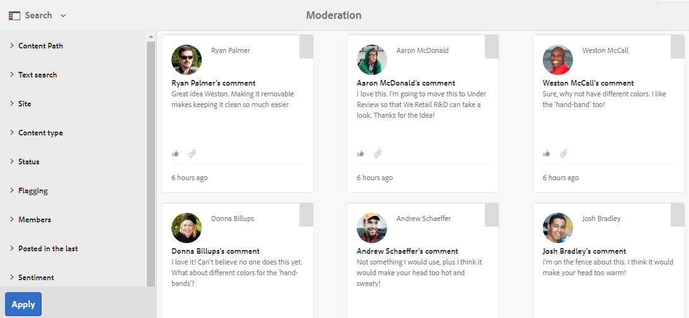
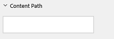
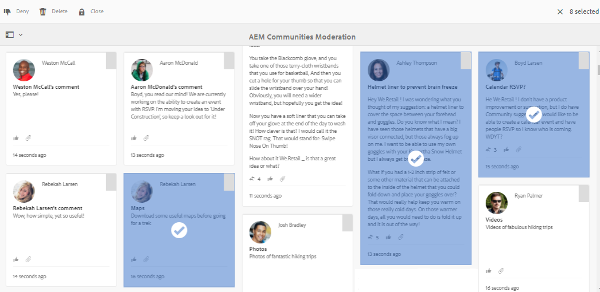
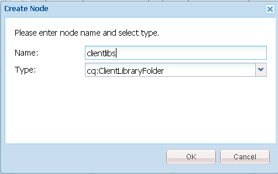
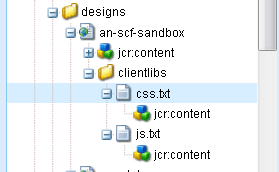
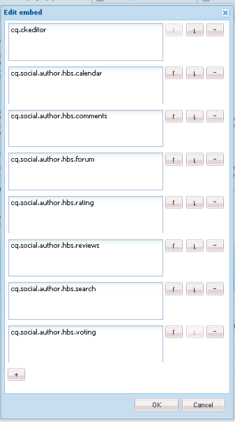

# Console de moderação {#moderation-console}

In AEM Communities, bulk [moderation of community content](/help/communities/moderate-ugc.md) is possible from both the author and publish environments by administrators and community moderators (trusted community members assigned as moderators).

Administrators and community moderators may also perform [in-context moderation](/help/communities/in-context.md) in the publish environment.

Um recurso de todos os sites [da](/help/communities/sites-console.md) comunidade é um item de `Administration` menu disponível para usuários que fazem logon com privilégios administrativos. O `Administration` link fornece acesso ao console Moderação.

No console Moderação, os administradores e moderadores da comunidade terão acesso a todo o conteúdo gerado pelo usuário (UGC) para o qual eles têm permissão para moderar. Se for permitido moderar vários sites, é possível visualização as publicações em todos os sites ou filtrar por sites de comunidades selecionadas.

Para obter informações mais detalhadas, visite [Gerenciar usuários e grupos](/help/communities/users.md)de usuários.

O console Moderação suporta:

* Realização de tarefas de moderação em massa.
* Procurando UGC.
* Exibindo detalhes do UGC.
* Exibindo detalhes do autor UGC.

Somente quando conectado como um administrador, ou um membro com ` [moderator permissions](/help/communities/in-context.md#identifyingtrustedmembers)`, pode ser realizada a moderação de tarefas.

## Publicar acesso ao Ambiente {#publish-environment-access}

O acesso ao console de Moderação de um site da comunidade publicado é feito por meio de um link de Administração que é exibido quando um moderador da comunidade está conectado.

Ao selecionar o link Administração, o console Moderação é exibido:

## Acesso ao Ambiente do autor {#author-environment-access}

No ambiente do autor, para acessar o console Moderação

* Na navegação global, selecione **[!UICONTROL Comunidades]** > **[!UICONTROL Moderação]**.

Somente quando conectado como administrador, ou como membro com permissões [de](/help/communities/in-context.md#identifyingtrustedmembers)moderador, tarefas de moderação podem ser executadas. O único conteúdo da comunidade exibido é aquele que o membro conectado tem permissão para moderar.

>[!NOTE]
>
>O UGC do ambiente publish só estará visível no autor se o SRP escolhido implementar uma loja comum. Por exemplo, por padrão, o armazenamento é JSRP, que não é uma loja comum para autor e publicação. Consulte Armazenamento [de conteúdo da](/help/communities/working-with-srp.md)comunidade.

## Interface do usuário do console de moderação {#moderation-console-ui}

Além do painel de navegação esquerdo (que aparece no autor, mas não na publicação), a interface de usuário de moderação tem as seguintes áreas principais:

* **[Barra de navegação superior](#top-navigation-bar)**
* **[Barra de ferramentas](#toolbar)**
* **[Área de conteúdo](#content-area)**

### Top Navigation Bar {#top-navigation-bar}

A barra de navegação superior é constante para todos os consoles. Para obter mais informações, consulte Manuseio [básico](/help/sites-authoring/basic-handling.md).

### Barra de ferramentas {#toolbar}

A barra de ferramentas, localizada abaixo da barra de navegação superior, fornece a seguinte opção de alternância no lado esquerdo:

* [O painel](/help/communities/moderation.md#filterrail)de filtros abre um painel que permite escolher as propriedades nas quais filtrar o conteúdo.

A barra de ferramentas, localizada abaixo da barra de navegação superior, fornece a seguinte opção de alternância no lado esquerdo:

[O trilho](/help/communities/moderation.md#filterrail)de filtragem abre um trilho ao selecionar Pesquisar, o que permite escolher as propriedades nas quais filtrar o conteúdo.

### Área de conteúdo {#content-area}

A área de conteúdo contém informações para o UGC publicado:

* UGC postado
* Nome do membro
* avatar do membro
* Localização da publicação.
* Quando foi postada.
* Número de respostas à publicação.
* [Sentimento](/help/communities/moderate-ugc.md#sentiment) associado à publicação
* Se aprovada, uma marca de seleção será exibida.
* Se houver um anexo, um clipe de papel será exibido.

>[!NOTE]
> 
>A área de conteúdo apresenta uma rolagem ** infinita, o que significa que permitirá que você continue a rolagem até atingir o final do conteúdo. A barra de ferramentas permanece em uma posição fixa e visível acima da área de conteúdo, mesmo durante a rolagem.

### Filtrar painel {#ootbfilters}

O ícone do painel lateral abre o painel do filtro. O painel de filtros, que aparece à esquerda da área de conteúdo, fornece filtros diferentes, cada um com um efeito imediato no UGC referenciado que aparece na área de conteúdo.

Os filtros dentro de cada categoria são **OU** estão juntos, e os filtros em categorias diferentes são **E** juntos.

Por exemplo, se você marcar **Pergunta** e **Resposta**, verá um conteúdo que seja uma **Pergunta** *ou* uma **Resposta**.

No entanto, se você marcar **Pergunta** e **Pendente**, verá somente o conteúdo que é uma **Pergunta** e está **Pendente**.

>[!NOTE]
>
>Os moderadores da comunidade podem marcar os filtros predefinidos na interface do usuário do console de moderação. Como esses filtros são anexados ao final do URL (como parâmetros de string de query), os moderadores podem voltar aos filtros marcados posteriormente e também compartilhar esses links.

Quando o trilho do filtro estiver aberto, o ícone Pesquisar alterna o painel lateral para fechado. No entanto, para fechar o painel de filtros e somente visualização o conteúdo gerado pelo usuário, clique no ícone Pesquisar e selecione a opção Somente conteúdo.

#### Caminho do conteúdo {#content-path}

O Caminho do conteúdo limita o UGC de referência exibido nas postagens colocadas no repositório de conteúdo especificado.

#### Pesquisa de texto {#text-search}

A pesquisa de texto limita o UGC referenciado exibido às postagens que contêm o texto inserido.

#### Site {#site}

O site limita o UGC referenciado exibido às postagens nos sites da comunidade selecionados. Se nenhum site for marcado, todas as referências ao UGC serão exibidas.

>[!NOTE]
>
>Quando o console de moderação em massa é acessado por um administrador, todas as referências ao UGC são exibidas, incluindo sites não criados com o assistente [de criação de](/help/communities/sites-console.md)site, como as amostras do Geometrixx.
>
>Quando o console de moderação em massa é acessado na publicação por um membro da comunidade confiável, somente as referências ao UGC criado para sites da comunidade que o membro está autorizado a moderar são mostradas e podem ser filtradas com o filtro Site.

#### Tipo de conteúdo {#content-type}

O Tipo de conteúdo limita o UGC referenciado exibido às postagens do tipo de recurso selecionado. Um ou mais dos seguintes tipos podem ser selecionados. Todos os tipos são exibidos se nenhum estiver selecionado.

* **Comentário**
* **Tópico do fórum**
* **Resposta do fórum**
* **Perguntas QnA**
* **Resposta QnA**
* **Artigo do blog**
* **Comentário do blog**
* **Evento do calendário**
* **Comentário do calendário**
* **Pasta da biblioteca de arquivos**
* **Documento da biblioteca de arquivos**
* **Ideia**
* **Comentário da ideação**

#### Tipos de conteúdo adicionais {#additional-content-types}

Para adicionar recursos adicionais nos quais filtrar:

* Faça logon na instância do autor como administrador.
* Abra o Console [da Web](https://localhost:4502/system/console/configMgr).
* Localize `AEM Communities Moderation Dashboard Filters`.
* Selecione a configuração para abrir no modo de edição.
* Informe o ResourceType de um componente no qual filtrar:

   * Por exemplo, para filtrar os componentes de Votação incluídos, informe:

      `Voting=social/tally/components/hbs/voting`

* Selecione Salvar.
* Atualize o console Comunidades - Moderação.

O resultado é um novo filtro selecionável para `Voting` o grupo de `Content Type` filtros.

Quando esse filtro for selecionado, o conteúdo do painel mostrará o UGC que corresponde a qualquer um dos ResourceTypes inseridos.

#### Status {#status}

O status limita o UGC referenciado exibido às postagens do status selecionado, que pode ser uma ou mais de Pendente, Aprovado, Negado ou Fechado, assim como Rascunho ou Agendado para Artigos do Blog e Respondido ou Não Respondido para Perguntas QnA. Se nenhum estiver selecionado, então todos serão exibidos.

>[!NOTE]
>
>Se apenas o status Não respondida for selecionado, então o moderador visualizará todo o conteúdo (para todos os tipos de conteúdo), exceto as perguntas respondidas. Isso ocorre porque a propriedade responsável pela Pergunta respondida não existe no caso de perguntas não respondidas e outros conteúdos, como tópico do fórum, artigo do blog ou comentários.

#### Sinalização {#flagging}

A sinalização limita a exibição do UGC referenciado em postagens que estão sinalizadas ou ocultas.

Depois que um conteúdo é sinalizado, ele permanece sinalizado até que você cancele a sinalização desse único conteúdo selecionando o botão **Sinalizar** novamente. Observe que não há níveis de sinalização, como importante ou acompanhamento.

#### Membros {#members}

Os membros limitam o UGC referenciado exibido ao UGC postado pelo nome do membro inserido.

#### Publicado nos últimos {#posted-in-the-last}

Publicado no último limite, o UGC referenciado era exibido nas postagens feitas na última hora, dia, semana, mês ou ano.

#### Sentimento {#sentiment}

[O sentimento](/help/communities/moderate-ugc.md#sentiment) limita a exibição do UGC referenciado em publicações com um valor de sentimento que seja positivo, negativo ou neutro.

## Custom Filters {#custom-filters}

Além dos filtros predefinidos no painel [Filtro](/help/communities/moderation.md#ootbfilters), filtros personalizados adicionais nos metadados podem ser adicionados à interface do usuário de moderação. Os desenvolvedores podem usar o código de amostra no Github para estender os filtros da interface de moderação existentes.

O projeto [de](https://github.com/Adobe-Marketing-Cloud/aem-communities-extensions/tree/master/aem-communities-moderation-filter) amostra no Github implementa o filtro Tag para filtrar a lista UGC com base no fato de as tags específicas serem aplicadas no conteúdo gerado pelo usuário. Você pode seguir o código de amostra e criar filtros análogos para outros campos de metadados UGC semelhantes.

Para instalar a amostra do filtro Tags:

1. Abra o gerenciador de pacotes na instância AEM Author ([https://[aem-author]:4502/crx/packmgr/index.jsp](https://aem65-communities-demo.corp.adobe.com:4502/crx/packmgr/index.jsp)) e na instância AEM Publish ([https://[aem-publish]:4503/crx/packmgr/index.jsp](https://aem65-communities-demo.corp.adobe.com:4502/crx/packmgr/index.jsp)).
1. Crie o pacote a partir `com.adobe.social.sample.moderation.filter.ui.apps-1.0-SNAPSHOT.zip` do código Github e instale e ative o mesmo.
1. Abra o console de pacotes na instância AEM Author ( `https://[aem-author]:4502/system/console/bundles`) e AEM Publish ( `https://[aem-publish]:4503/system/console/bundles`).
1. Crie o pacote ` [com](https://sample-moderation-filter.com/).adobe.social.sample.moderation.filter.core-1.0-SNAPSHOT.jar` do Github e instale e ative o mesmo.
1. Vá para o nó **/apps/social/moderação/facetas** no AEM Author ([https://[aem-author]:4502/crx/de/index.jsp#/apps/social/moderation/facets](https://aem65-communities-demo.corp.adobe.com:4502/crx/de/index.jsp#/apps/social/moderation/facets)) e AEM Publish ([https://[aem-publish]:4502/crx/de/index.jsp#/apps/social/moderation/facets](https://aem65-communities-demo.corp.adobe.com:4502/crx/de/index.jsp#/apps/social/moderation/facets)).
1. Adicione um leitor **de utilitários-comunidades de usuários técnicos com** `jcr:read` permissões.

Para expor os filtros personalizados em sites existentes da Comunidade:

1. Editar página `Clientlibs` de moderação existente `/content/we-retail/us/en/community/moderation/shell3/jcr:content/head/clientlibs.`

   * Adicionar nova categoria `cq.social.hbs.moderation.v2.`

1. Ir para `/content/we-retail/us/en/community/moderation/shell3/jcr:content/rails/searchWell/items/filters.`

   * Definir como novo componente `sling:resourceType = social/moderation/v2/filters.`

1. Ir para `/content/we-retail/us/en/community/moderation/shell3/jcr:content/views/content/items/modcontainer`.

   * Defina como novo componente `sling:resourceType = social/moderation/v2/modcontainer`.

## Ações de moderação {#moderation-actions}

[As ações](/help/communities/moderate-ugc.md#moderation-actions) de moderação podem ser executadas em uma ou mais seleções feitas na área de conteúdo ou ao exibir os detalhes do conteúdo.

Para moderar as publicações em massa, na área de conteúdo, clique no ícone Selecionar ( ) em uma publicação, que aparece ao passar o mouse sobre ela (área de trabalho) ou pressionando e segurando um dedo na publicação (móvel). Ao fazer isso, você entra no modo de seleção múltipla e pode selecionar as publicações subsequentes para serem moderadas em massa simplesmente clicando nelas. Use os botões exibidos na barra de ferramentas para executar ações de moderação nas postagens selecionadas. Todas as ações solicitarão confirmação.

Para moderar uma única publicação na área de conteúdo, passe o mouse sobre ela (área de trabalho) ou pressione e mantenha pressionado um dedo na publicação (móvel) para que os botões apareçam na publicação. Ao operar em um único detalhe de conteúdo, somente uma ação de exclusão solicitará a confirmação.

### Moderação de várias publicações {#moderating-multiple-posts}

Digite o modo de seleção em massa clicando no `Select` ícone em uma publicação:

Para sair do modo de seleção em massa, selecione o ícone de cancelamento (x) na barra de ferramentas:

As ações de moderação que podem ser executadas em várias publicações são:

* Negar 
* Excluir
* Fechar/reabrir as publicações

Os ícones que permitem essas ações só aparecem na barra de ferramentas quando várias postagens são selecionadas.

### Moderação de uma única publicação {#moderating-a-single-post}

No modo de seleção única, é possível:

* Visualização dos detalhes do usuário selecionando o nome do usuário.
* Visualização a publicação no contexto selecionando o link para a publicação.
* [Responder](#reply)
* [Permitir](#allow)
* [Negar ](#deny)
* [Excluir](#delete)
* [Fechar](#close)
* Histórico [de moderação da Visualização](#moderation-history)
* [Visualizar Detalhes](#viewdetails)

Presente na visualização do cartão acima dos ícones de ação de moderação está o texto da publicação e abaixo estão os dados que indicam:

* Se tiver respondido, e, em caso afirmativo, precedido do número de respostas.
* Se tiver sido sinalizado.
* Se foi aprovado.
* Quando o UGC foi postado.

#### Responder {#reply}

Ao trabalhar com uma única publicação, um ícone Responder será exibido se o tipo UGC suportar respostas e estiver configurado para permitir respostas.

#### Permitir {#allow}

Ao trabalhar com uma única publicação, o ícone Permitir aparecerá quando a publicação tiver sido sinalizada ou negada. Se sinalizado, selecionar Permitir apagará todos os sinalizadores.

#### Negar {#deny}

A ação de moderação **Negar** está disponível somente para conteúdo que é moderado e não aparece em conteúdo não moderado, exceto no modo de seleção múltipla.

O conteúdo que não é moderado é sempre aprovado.

O conteúdo moderado entra inicialmente em um estado Pendente e pode ser modificado posteriormente para ser aprovado ou negado.

O conteúdo que deixa o estado pendente nunca poderá voltar a um estado pendente. O conteúdo marcado como aprovado ou negado pode ser alterado para um estado diferente a qualquer momento.

#### Exclua {#delete}

No modo de seleção única ou em massa, é possível selecionar itens e excluí-los. A ação de exclusão resulta em uma caixa de diálogo de confirmação. Depois de excluídos, esses itens desaparecem imediatamente da área de conteúdo. **Depois que o UGC é excluído, ele é removido permanentemente do repositório e não pode ser recuperado** posteriormente.

#### Fechar {#close}

Ao trabalhar com uma única publicação, um ícone Fechar será exibido se o tipo UGC suportar a capacidade de impedir outras publicações para esse recurso.

#### Histórico de moderação {#moderation-history}

Ao trabalhar com uma única publicação, um ícone Histórico de moderação aparecerá ao passar o mouse sobre ela. Selecionar o ícone exibirá um painel contendo um histórico de ações tomadas em relação à publicação do UGC.

Para retornar à exibição da área de conteúdo de várias postagens UGC, selecione o X no canto superior direito do painel de detalhes da visualização.

Por exemplo :

#### Exibir detalhe {#view-detail}

Ao trabalhar com uma única publicação, mais detalhes podem ser exibidos ao abrir o UGC no modo de detalhes.

Para fazer isso, passe o mouse sobre a publicação para exibir o `View Detail` ícone e selecione-o para exibir um painel que contenha mais detalhes da publicação.

Para retornar à exibição da área de conteúdo de várias postagens UGC, selecione o X no canto superior direito do painel de detalhes da visualização.

Por exemplo :

