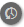

# Console de moderação {#moderation-console}

No AEM Communities, [moderação de conteúdo da comunidade](/help/communities/moderate-ugc.md) O é possível tanto do ambiente de criação quanto de publicação por administradores e moderadores da comunidade (membros confiáveis da comunidade atribuídos como moderadores).

Os administradores e moderadores da comunidade também podem realizar [moderação no contexto](/help/communities/in-context.md) no ambiente de publicação.

Um recurso de todos os [sites da comunidade](/help/communities/sites-console.md) é um `Administration` item de menu disponível para usuários que fazem logon com privilégios administrativos. A variável `Administration` fornece acesso ao console Moderação.

No console Moderação, os administradores e moderadores da comunidade terão acesso a todo o conteúdo gerado pelo usuário (UGC) para o qual tenham permissão para moderar. Se permitido moderar vários sites, é possível exibir publicações em todos os sites ou filtrar por sites de comunidades selecionados.

Para obter informações mais detalhadas, visite [Gerenciar usuários e grupos de usuários](/help/communities/users.md).

O console Moderação é compatível com:

* Execução de tarefas de moderação em massa.
* Pesquisando UGC.
* Exibição de detalhes de UGC.
* Exibição dos detalhes do autor de UGC.

Somente quando conectado como administrador ou um membro com ` [moderator permissions](/help/communities/in-context.md#identifyingtrustedmembers)`, podem ser realizadas tarefas de moderação.

## Acesso ao ambiente de publicação {#publish-environment-access}

O acesso ao console Moderação a partir de um site da comunidade publicado é feito por meio de um link Administração que aparece quando um moderador da comunidade está conectado.

Ao selecionar o link Administração, o console Moderação é exibido:

## Acesso ao ambiente do autor {#author-environment-access}

No ambiente de criação, para acessar o console Moderação

* Na navegação global, selecione **[!UICONTROL Communities]** > **[!UICONTROL Moderação]**.

Somente quando conectado como administrador ou como membro com [permissões do moderador](/help/communities/in-context.md#identifyingtrustedmembers), tarefas de moderação podem ser executadas. O único conteúdo da comunidade exibido é aquele que o membro conectado tem permissão para moderar.

>[!NOTE]
>
>O UGC do ambiente de publicação só estará visível no autor se o SRP escolhido implementar um armazenamento comum. Por exemplo, por padrão, o armazenamento é JSRP, que não é um armazenamento comum para autor e publicação. Consulte [Armazenamento de conteúdo da comunidade](/help/communities/working-with-srp.md).

## Interface do console da moderação {#moderation-console-ui}

Separando o painel de navegação esquerdo (que aparece no autor, mas não na publicação), a interface do usuário de moderação tem as seguintes áreas principais:

* **[Barra de navegação superior](#top-navigation-bar)**
* **[Barra de ferramentas](#toolbar)**
* **[Área de conteúdo](#content-area)**

### Barra de navegação superior {#top-navigation-bar}

A barra de navegação superior é constante para todos os consoles. Para obter mais informações, consulte [Manuseio básico](/help/sites-authoring/basic-handling.md).

### Barra de ferramentas {#toolbar}

A barra de ferramentas, localizada abaixo da barra de navegação superior, fornece a seguinte opção de alternância no lado esquerdo:

* [Filtrar painel](/help/communities/moderation.md#filterrail)
abre um painel que permite a escolha de propriedades nas quais filtrar o conteúdo.

A barra de ferramentas, localizada abaixo da barra de navegação superior, fornece a seguinte opção de alternância no lado esquerdo:

[Filtrar painel](/help/communities/moderation.md#filterrail)
abre um painel ao selecionar Pesquisar, o que permite uma escolha de propriedades nas quais filtrar o conteúdo.

### Área de conteúdo {#content-area}

A área de conteúdo contém informações para o UGC publicado:

* UGC publicado
* Nome do membro
* Avatar do membro
* Localização da publicação.
* Quando foi publicado.
* Número de respostas à postagem.
* [Sentimento](/help/communities/moderate-ugc.md#sentiment) associado à publicação
* Se aprovada, uma marca de seleção é exibida.
* Se houver um anexo, um clipe de papel será exibido.

>[!NOTE]
> 
>A área de conteúdo apresenta um *rolagem infinita*, o que significa que você continuará rolando até atingir o fim do conteúdo. A barra de ferramentas permanece em uma posição fixa e visível acima da área de conteúdo, mesmo ao rolar a tela.

### Trilho do filtro {#ootbfilters}

O ícone do painel lateral abre o painel de filtros. O painel de filtros, que aparece à esquerda da área de conteúdo, fornece filtros diferentes, cada um com um efeito imediato no UGC referenciado que aparece na área de conteúdo.

Os filtros dentro de cada categoria são **OU**&quot;d juntos, e os filtros em diferentes categorias são **E**&quot;d juntos.

Por exemplo, se você marcar ambos **Pergunta** e **Resposta**, você verá que o conteúdo é um **Pergunta** *ou* um **Resposta**.

No entanto, se você verificar **Pergunta** e **Pending**, você só verá o conteúdo que é um **Pergunta** e está **Pending**.

>[!NOTE]
>
>Os moderadores da comunidade podem marcar os filtros predefinidos na interface do usuário do console de moderação. À medida que esses filtros são anexados ao final do URL (como parâmetros de sequência de consulta), os moderadores podem voltar posteriormente aos filtros marcados e também compartilhar esses links.

Quando o painel de filtros está aberto, o ícone Pesquisar alterna para o painel lateral fechado. No entanto, para fechar o painel de filtro e exibir somente o conteúdo gerado pelo usuário, clique no ícone Pesquisar e selecione a opção Somente conteúdo.

#### Caminho do conteúdo {#content-path}

Caminho de conteúdo limita o UGC de referência exibido para as publicações colocadas no repositório de conteúdo especificado.

#### Pesquisa de texto {#text-search}

A pesquisa de texto limita o UGC referenciado exibido às publicações nas quais contém o texto inserido.

#### Site {#site}

O site limita o UGC referenciado exibido para publicações nos sites da comunidade selecionados. Se nenhum site for marcado, todas as referências ao UGC serão exibidas.

>[!NOTE]
>
>Quando o console de moderação em massa é acessado por um administrador, todas as referências ao UGC são mostradas, incluindo sites não criados com o [assistente de criação de site](/help/communities/sites-console.md), como as amostras de Geometrixx.
>
>Quando o console de moderação em massa é acessado na publicação por um membro confiável da comunidade, apenas as referências ao UGC criado para sites da comunidade que o membro está autorizado a moderar são exibidas e podem ser filtradas com o filtro Site.

#### Tipo de conteúdo {#content-type}

Tipo de conteúdo limita o UGC referenciado exibido às publicações do tipo de recurso selecionado. Um ou mais dos seguintes tipos podem ser selecionados. Todos os tipos são mostrados se nenhum estiver selecionado.

* **Comentar**
* **Tópico do fórum**
* **Resposta do fórum**
* **Perguntas QnA**
* **Resposta QnA**
* **Artigo do blog**
* **Comentário do blog**
* **Evento do calendário**
* **Comentário do calendário**
* **Pasta da biblioteca de arquivos**
* **Documento da biblioteca de arquivos**
* **Ideia**
* **Comentário da ideação**

#### Tipos de conteúdo adicionais {#additional-content-types}

Para adicionar recursos adicionais aos quais filtrar:

* Faça logon na instância do autor como administrador.
* Abertura [Console da Web](https://localhost:4502/system/console/configMgr).
* Localizar `AEM Communities Moderation Dashboard Filters`.
* Selecione a configuração a ser aberta no modo de edição.
* Insira o ResourceType de um componente no qual filtrar:

   * Por exemplo, para filtrar os componentes de Votação incluídos, informe:

     `Voting=social/tally/components/hbs/voting`

  

* Selecione Salvar.
* Atualize o console Comunidades - Moderação.

O resultado é um novo filtro selecionável para `Voting` no `Content Type` grupo de filtros.

Quando esse filtro for selecionado, o conteúdo do painel mostrará o UGC que corresponde a qualquer um dos ResourceTypes inseridos.

#### Status {#status}

Status limita o UGC referenciado exibido a publicações do status selecionado, que pode ser um ou mais de Pendente, Aprovado, Negado ou Fechado, bem como Rascunho ou Agendado para Artigos do Blog e Respondido ou Não Respondido para Perguntas de QnA. Se nenhum for selecionado, todos serão exibidos.

>[!NOTE]
>
>Se apenas o status Não respondido for selecionado, o moderador verá todo o conteúdo (para todos os tipos de conteúdo) exceto as perguntas respondidas. É assim porque a propriedade responsável pela Pergunta Respondida não existe no caso de perguntas não respondidas e outros conteúdos, como tópicos de fórum, artigo de blog ou comentários.

#### Sinalização {#flagging}

A sinalização limita o UGC referenciado exibido às publicações sinalizadas ou ocultas.

Depois que um conteúdo é sinalizado, ele permanece sinalizado até que você remova o sinalizador desse conteúdo único selecionando o **Sinalizador** botão mais uma vez. Observe que não há níveis de sinalização, como importante ou de acompanhamento.

#### Membros {#members}

Membros limita o UGC referenciado exibido para o UGC publicado pelo nome do membro inserido.

#### Publicado nos últimos {#posted-in-the-last}

Publicado em Os últimos limita o UGC referenciado exibido nas publicações feitas na última hora, dia, semana, mês ou ano.

#### Sentimento {#sentiment}

[Sentimento](/help/communities/moderate-ugc.md#sentiment) limita o UGC referenciado exibido a publicações com um valor de sentimento positivo, negativo ou neutro.

## Filtros personalizados {#custom-filters}

Além dos filtros prontos para uso em [Trilho do filtro](/help/communities/moderation.md#ootbfilters)Além disso, filtros personalizados adicionais sobre metadados podem ser adicionados à interface de moderação. Os desenvolvedores podem usar o código de amostra no Github para estender os filtros existentes da interface de moderação.

A variável [projeto de amostra](https://github.com/Adobe-Marketing-Cloud/aem-communities-extensions/tree/main/aem-communities-moderation-filter) No Github, é possível implementar o filtro de tags para filtrar a lista UGC com base no fato de as tags específicas serem aplicadas a conteúdo gerado pelo usuário. Você pode seguir o código de amostra e criar filtros análogos para outros campos de metadados UGC semelhantes.

Para instalar a amostra do filtro Tags:

1. Abra o gerenciador de pacotes no AEM Author (`https://[aem-author]:4502/crx/packmgr/index.jsp`) e AEM Publish (`https://[aem-publish]:4503/crx/packmgr/index.jsp`).
1. Criar o pacote `com.adobe.social.sample.moderation.filter.ui.apps-1.0-SNAPSHOT.zip` do código Github, e instale e ative o mesmo.
1. Abra o console de pacotes no AEM Author ( `https://[aem-author]:4502/system/console/bundles`) e AEM Publish ( `https://[aem-publish]:4503/system/console/bundles`).
1. Criar o pacote (`[com](https://sample-moderation-filter.com/).adobe.social.sample.moderation.filter.core-1.0-SNAPSHOT.jar`) do Github, e instale e ative o mesmo.
1. Ir para **/apps/social/moderation/facets** nó no autor do AEM (`https://[aem-author]:4502/crx/de/index.jsp#/apps/social/moderation/facets`) e AEM Publish (`https://[aem-publish]:4502/crx/de/index.jsp#/apps/social/moderation/facets`).
1. Adicionar um usuário técnico **communities-utility-reader** com `jcr:read` permissões.

Para expor os filtros personalizados nos sites da Comunidade existentes:

1. Editar `Clientlibs` da página de moderação existente `/content/we-retail/us/en/community/moderation/shell3/jcr:content/head/clientlibs.`

   * Adicionar nova categoria `cq.social.hbs.moderation.v2.`

1. Acesse `/content/we-retail/us/en/community/moderation/shell3/jcr:content/rails/searchWell/items/filters.`

   * Definir como novo componente `sling:resourceType = social/moderation/v2/filters.`

1. Acesse `/content/we-retail/us/en/community/moderation/shell3/jcr:content/views/content/items/modcontainer`.

   * Definir como novo componente `sling:resourceType = social/moderation/v2/modcontainer`.

## Ações de moderação {#moderation-actions}

[Ações de moderação](/help/communities/moderate-ugc.md#moderation-actions) pode ser executado em uma ou mais seleções feitas na área de conteúdo ou ao exibir detalhes do conteúdo.

Para moderar as publicações em massa, na área de conteúdo, clique no botão Selecionar () em uma postagem, que aparece ao passar o mouse (no desktop) ou pressionar e segurar um dedo na postagem (dispositivo móvel). Ao fazer isso, você entra no modo de seleção múltipla e agora pode selecionar as publicações subsequentes para serem moderadas em massa, basta clicar nelas. Use os botões exibidos na barra de ferramentas para executar ações de moderação nas publicações selecionadas. Todas as ações solicitarão confirmação.

Para moderar uma única publicação na área de conteúdo, passe o mouse sobre ela (na área de trabalho) ou pressione e mantenha pressionado um dedo na publicação (dispositivos móveis), de modo que os botões apareçam na publicação. Ao operar em um único detalhe de conteúdo, somente uma ação de exclusão solicitará confirmação.

### Moderação de várias postagens {#moderating-multiple-posts}

Entre no modo de seleção em massa clicando no `Select` ícone em uma postagem:

Para sair do modo de seleção em massa, selecione o ícone Cancelar (x) na barra de ferramentas:

As ações de moderação que podem ser executadas em várias publicações são:

* Negar 
* Excluir
* Fechar/reabrir as postagens

Os ícones que permitem essas ações só aparecem na barra de ferramentas quando várias publicações são selecionadas.

### Moderação de uma única publicação {#moderating-a-single-post}

No modo de seleção única, é possível:

* Exiba os detalhes do usuário selecionando o nome dele.
* Visualize a publicação no contexto, selecionando o link para a publicação.
* [Responder](#reply)
* [Permitir](#allow)
* [Negar ](#deny)
* [Excluir](#delete)
* [Fechar](#close)
* Exibir [Histórico de moderação](#moderation-history)
* [Exibir Detalhes](#viewdetails)

Presente na exibição de cartão acima dos ícones de ação de moderação está o texto da publicação e abaixo estão os dados que indicam:

* Se tiver respostas e, nesse caso, precedidas pelo número de respostas.
* Se tiver sido sinalizado.
* Se tiver sido aprovado.
* Quando a UGC foi postada.

#### Responder {#reply}

Ao trabalhar com uma única publicação, um ícone Responder será exibido se o tipo de UGC der suporte a respostas e estiver configurado para permitir respostas.

#### Permitir {#allow}

Ao trabalhar com uma única publicação, o ícone Permitir será exibido quando a publicação for sinalizada ou negada. Se sinalizado, selecionar Permitir limpará todos os sinalizadores.

#### Negar  {#deny}

A variável **Negar** a ação de moderação só está disponível para conteúdo moderado e não aparece em conteúdo não moderado, exceto no modo de seleção múltipla.

O conteúdo que não é moderado é sempre aprovado.

O conteúdo moderado entra inicialmente em um estado Pendente e pode ser modificado posteriormente para ser aprovado ou negado.

O conteúdo que deixa o estado pendente nunca pode retornar a um estado pendente. O conteúdo marcado como aprovado ou negado pode ser alterado para um estado diferente a qualquer momento.

#### Excluir {#delete}

Na seleção única ou no modo em massa, é possível selecionar itens e excluí-los. A ação de exclusão resulta em uma caixa de diálogo de confirmação. Depois de excluídos, esses itens desaparecem imediatamente da área de conteúdo. **Depois que o UGC é excluído, ele é removido permanentemente do repositório e não pode ser recuperado posteriormente**.

#### Fechar {#close}

Ao trabalhar com uma única publicação, um ícone Fechar será exibido se o tipo de UGC suportar a capacidade de evitar mais publicações para esse recurso.

#### Histórico de moderação {#moderation-history}

Ao trabalhar com uma única publicação, um ícone de Histórico da moderação será exibido ao passar o mouse sobre ele. Ao selecionar o ícone, será exibido um painel contendo um histórico das ações executadas em relação à publicação UGC.

Para retornar à exibição da área de conteúdo de várias publicações UGC, selecione o X no canto superior direito do painel de detalhes da exibição.

Por exemplo:

#### Exibir detalhe {#view-detail}

Ao trabalhar com uma única publicação, para ver mais detalhes, abra o UGC no modo de detalhes.

Para fazer isso, passe o mouse sobre a publicação para exibir a `View Detail` e selecione-o para exibir um painel contendo mais detalhes da publicação.

Para retornar à exibição da área de conteúdo de várias publicações UGC, selecione o X no canto superior direito do painel de detalhes da exibição.

Por exemplo:

