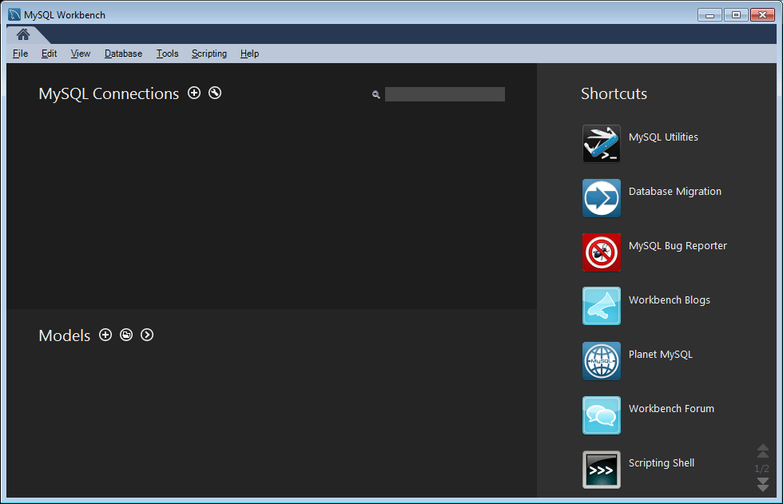
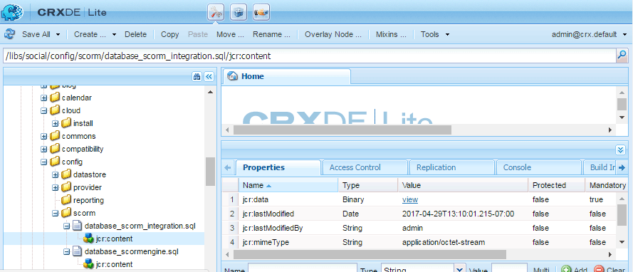

# Configuração do MySQL para Recursos de Ativação {#mysql-configuration-for-enablement-features}

MySQL é um banco de dados relacional usado principalmente para rastreamento SCORM e dados de relatórios para recursos de ativação. Inclui tabelas para outros recursos, como rastreamento de pausa/retomada de vídeo.

Essas instruções descrevem como se conectar ao servidor MySQL, estabelecer o banco de dados de ativação e preencher o banco de dados com os dados iniciais.

## Requisitos {#requirements}

Antes de configurar o recurso de ativação do MySQL for Communities, certifique-se de

* Instale o [MySQL Server](https://dev.mysql.com/downloads/mysql/) Community Server versão 5.6:
   * A versão 5.7 não é compatível com SCORM.
   * Pode ser o mesmo servidor que a instância do autor AEM.
* Em todas as instâncias AEM, instale o driver [JDBC oficial para MySQL](deploy-communities.md#jdbc-driver-for-mysql).
* Instale o [MySQL Workbench](https://dev.mysql.com/downloads/tools/workbench/).
* Em todas as instâncias AEM, instale o pacote SCORM.

## Instalando o MySQL {#installing-mysql}

O MySQL deve ser baixado e instalado de acordo com as instruções para o SO do público alvo.

### Nomes de tabela em minúsculas {#lower-case-table-names}

Como o SQL não diferencia maiúsculas de minúsculas, para sistemas operacionais sensíveis a maiúsculas e minúsculas, é necessário incluir uma configuração para minúsculas em todos os nomes de tabelas.

Por exemplo, para especificar todos os nomes de tabela de letras minúsculas em um sistema operacional Linux:

* Editar arquivo `/etc/my.cnf`
* Na `[mysqld]` seção, adicione a seguinte linha: `lower_case_table_names = 1`

### Conjunto de caracteres UTF8 {#utf-character-set}

Para fornecer um suporte multilíngue melhor, é necessário usar o conjunto de caracteres UTF8.

Altere MySQL para ter UTF8 como seu conjunto de caracteres:
* mysql > DEFINIR NOMES &#39;utf8&#39;;

Altere o banco de dados MySQL para o padrão UTF8:
* Editar arquivo `/etc/my.cnf`
* Na `[client]` seção, adicione: `default-character-set=utf8`
* Na `[mysqld]` seção, adicione: `character-set-server=utf8`

## Instalando o MySQL Workbench {#installing-mysql-workbench}

O MySQL Workbench fornece uma interface para executar scripts SQL que instalam o schema e os dados iniciais.

O MySQL Workbench deve ser baixado e instalado de acordo com as instruções para o SO do público alvo.

## Conexão de ativação {#enablement-connection}

Quando o MySQL Workbench é iniciado pela primeira vez, a menos que já esteja em uso para outros fins, ele ainda não mostrará conexões:

### Novas configurações de conexão {#new-connection-settings}

1. Selecione o ícone &#39;+&#39; à direita de `MySQL Connections`.
1. Na caixa de diálogo `Setup New Connection`, digite os valores apropriados para sua plataforma para fins de demonstração, com a instância AEM do autor e MySQL no mesmo servidor:
   * Nome da conexão: `Enablement`
   * Método de conexão: `Standard (TCP/IP)`
   * Hostname: `127.0.0.1`
   * Nome de usuário: `root`
   * Senha: `no password by default`
   * Schema padrão: `leave blank`
1. Selecione `Test Connection` para verificar a conexão com o serviço MySQL em execução.

**Notas**:
* A porta padrão é `3306`.
* O `Connection Name` nome escolhido é inserido como o `datasource` nome na configuração JDBC OSGi.

#### Conexão bem-sucedida {#successful-connection}

#### Nova conexão de ativação {#new-enablement-connection}

## Configuração do banco de dados {#database-setup}

Ao abrir a nova conexão de Ativação, observe que há um schema de teste e contas de usuário padrão.

### Obter Scripts SQL {#obtain-sql-scripts}

Os scripts SQL são obtidos usando CRXDE Lite na instância do autor. O pacote  SCORM deve ser instalado:

1. Navegue até CRXDE Lite:
   * Por exemplo, [http://localhost:4502/crx/de](http://localhost:4502/crx/de)
1. Expandir a `/libs/social/config/scorm/` pasta
1. Download `database_scormengine.sql`
1. Download `database_scorm_integration.sql`

Um método para baixar o schema é:

* Selecione o `jcr:content` nó para o arquivo sql.
* Observe que o valor da `jcr:data` propriedade é um link de visualização.
* Selecione o link visualização para salvar os dados em um arquivo local.

### Criar Banco de Dados SCORM {#create-scorm-database}

O banco de dados SCORM de ativação a ser criado é:

* name: `ScormEngineDB`
* criado a partir de scripts:
   * esquema: `database_scormengine.sql`
   * data: `database_scorm_integration.sql`
Follow the steps below (
[abrir](#step-open-sql-file), [executar](#step-execute-sql-script)) para instalar cada script  SQL. [Atualize](#refresh) quando necessário para ver os resultados da execução do script.

Instale o schema antes de instalar os dados.

>[!CAUTION]
>
>Se o nome do banco de dados for alterado, especifique-o corretamente em:
>
>* [Configuração JDBC](#configure-jdbc-connections)
>* [Configuração SCORM](#configure-scorm)

>

#### Etapa 1: abrir arquivo SQL {#step-open-sql-file}

No MySQL Workbench

* No menu suspenso Arquivo
* Selecionar `Open SQL Script ...`
* Nesta ordem, selecione um dos seguintes:
   1. `database_scormengine.sql`
   1. `database_scorm_integration.sql`

#### Etapa 2: executar script SQL {#step-execute-sql-script}

Na janela do Workbench para o arquivo aberto na Etapa 1, selecione o arquivo `lightening (flash) icon` para executar o script.

Observe que a execução do `database_scormengine.sql` script para criar o banco de dados SCORM pode levar um minuto para ser concluída.

#### Atualizar {#refresh}

Depois que os scripts são executados, é necessário atualizar a `SCHEMAS` seção do `Navigator` para visualizar o novo banco de dados. Use o ícone de atualização à direita de &#39;SCHEMAS:

#### Resultado: scormenginedb {#result-scormenginedb}

Depois de instalar e atualizar SCHEMAS, os visitantes `scormenginedb` estarão visíveis.

## Configurar conexões JDBC {#configure-jdbc-connections}

A configuração do OSGi para o Pool **de Conexões JDBC do** Day Commons configura o Driver JDBC do MySQL.

Todas as instâncias de publicação e autor AEM devem apontar para o mesmo servidor MySQL.

Quando MySQL é executado em um servidor diferente de AEM, o nome do host do servidor deve ser especificado no lugar de &#39;localhost&#39; no conector JDBC (que preenche a configuração [ScormEngine](#configurescormengineservice) ).

* Em cada autor e publicar AEM instância
* Conectado com privilégios de administrador
* Acesse o console [da Web](../../help/sites-deploying/configuring-osgi.md)
   * Por exemplo, [http://localhost:4502/system/console/configMgr](http://localhost:4502/system/console/configMgr)
* Localize a variável `Day Commons JDBC Connections Pool`
* Selecione o `+` ícone para criar uma nova configuração

   

* Insira os seguintes valores:
   * **[!UICONTROL Classe]** de driver JDBC: `com.mysql.jdbc.Driver`
   * **URIJ **de conexão DBC:`jdbc:mysql://localhost:3306/aem63reporting`especifique o servidor no lugar de localhost se o servidor MySQL não for o mesmo que o servidor AEM &#39;this&#39;.
   * **[!UICONTROL Nome de usuário]**: Raiz ou digite o nome de usuário configurado para o servidor MySQL, se não for &#39;root&#39;.
   * **[!UICONTROL Senha]**: Limpe este campo se nenhuma senha estiver definida para MySQL, caso contrário, insira a senha configurada para o Nome de Usuário do MySQL.
   * **[!UICONTROL Nome]** da fonte de dados: Nome inserido para a conexão MySQL, por exemplo, &quot;ativação&quot;.
* Selecione **[!UICONTROL Salvar]**.

## Configurar Scorm {#configure-scorm}

### Serviço AEM Communities ScormEngine {#aem-communities-scormengine-service}

A configuração do OSGi para o serviço **** AEM Communities ScormEngine configura o SCORM para o uso do servidor MySQL pela comunidade de ativação.

Essa configuração está presente quando o pacote  SCORM está instalado.

Todas as instâncias de publicação e autor apontam para o mesmo servidor MySQL.

Quando MySQL é executado em um servidor diferente de AEM, o nome do host do servidor deve ser especificado no lugar de &#39;localhost&#39; no Serviço ScormEngine, que geralmente é preenchido a partir da configuração da Conexão  JDBC.

* Em cada autor e publicar AEM instância
* Conectado com privilégios de administrador
* Acesse o console [da Web](../../help/sites-deploying/configuring-osgi.md)
   * Por exemplo, [http://localhost:4502/system/console/configMgr](http://localhost:4502/system/console/configMgr)
* Localize a variável `AEM Communities ScormEngine Service`
* Selecionar o ícone de edição

   

* Verifique se os seguintes valores de parâmetro estão consistentes com a configuração da conexão  JDBC:
   * **[!UICONTROL URI]** de conexão JDBC: `jdbc:mysql://localhost:3306/ScormEngineDB` *ScormEngineDB* é o nome do banco de dados padrão nos scripts SQL
   * **[!UICONTROL Nome de usuário]**: Raiz ou insira o nome de usuário configurado para o servidor MySQL, se não for &#39;root&#39;
   * **[!UICONTROL Senha]**: Limpar este campo se nenhuma senha estiver definida para MySQL, caso contrário, insira a senha configurada para o Nome de Usuário do MySQL
* Quanto ao seguinte parâmetro:
   * **[!UICONTROL Senha]** do usuário do Scorm: NÃO EDITAR

      Apenas para uso interno: É para um usuário de serviço especial usado pelos AEM Communities para se comunicar com o mecanismo de pontuação.
* Selecione **[!UICONTROL Salvar]**

### Filtro CSRF Adobe Granite {#adobe-granite-csrf-filter}

Para garantir que os cursos de ativação funcionem corretamente em todos os navegadores, é necessário adicionar o Mozilla como um Agente de usuário que não é verificado pelo filtro CSRF.

* Faça logon na instância de publicação AEM com privilégios de administrador.
* Acesse o console [da Web](../../help/sites-deploying/configuring-osgi.md)
   * Por exemplo, [http://localhost:4503/system/console/configMgr](http://localhost:4503/system/console/configMgr)
* Localize `Adobe Granite CSRF Filter`.
* Selecione o ícone de edição.

   

* Selecione o `[+]` ícone para adicionar um Agente de usuário seguro.
* Enter `Mozilla/*`.
* Selecione **[!UICONTROL Salvar]**.

