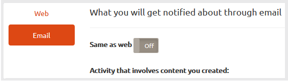

# Notificações de comunidades {#communities-notifications}

## Visão geral {#overview}

O AEM Communities fornece uma seção de notificações que exibe eventos de interesse para o membro da comunidade conectado.

As notificações são semelhantes a [atividades](/help/communities/essentials-activities.md) e [subscrições](/help/communities/subscriptions.md) , pois podem resultar de:

* O conteúdo de publicação do membro.
* O membro que escolheu seguir outro membro.
* O membro optou por seguir tópicos específicos, artigos e outros segmentos de conteúdo.
* A marcação de membro (@menção) de outro membro da comunidade em um conteúdo gerado pelo usuário.

O que distingue as notificações do atividade e do subscrição é:

* Um link para a seção de notificações está sempre presente no cabeçalho do site da comunidade:

   * As Atividades exigem que a função [de fluxo de](/help/communities/functions.md#activity-stream-function) atividade seja incluída na estrutura do site da comunidade.
   * O Subscrição exige [configuração de email](/help/communities/email.md).

* A implementação de notificações é feita por meio de canais escaláveis e conectáveis:

   * As Atividades só estão disponíveis na Web.
   * As Subscrições só estão disponíveis por email.

A partir do [FP1](/help/communities/deploy-communities.md#latestfeaturepack)das Comunidades, os canais de notificação disponíveis são:

* O canal da Web, acessado usando o `Notifications` link.
* O canal de email, disponível quando o email está configurado corretamente.

Os futuros canais são móveis e desktops.

### Requisitos {#requirements}

**Configurar email**

O e-mail deve ser configurado para que o canal de e-mail possa receber notificações.

Para obter instruções sobre como configurar e-mail, consulte [Configuração de e-mail](/help/communities/analytics.md).

**Habilitar Seguir**

Os componentes devem ser configurados para permitir o seguinte. Os recursos que permitem o seguinte são [blog](/help/communities/blog-feature.md), [fórum](/help/communities/forum.md), [QnA](/help/communities/working-with-qna.md), [calendário](/help/communities/calendar.md), [biblioteca](/help/communities/file-library.md)[](/help/communities/comments.md)e comentários.

**Nota**:

* Os componentes usados nos modelos [de](/help/communities/sites.md) site da comunidade e nos modelos [de](/help/communities/tools-groups.md) grupo já podem estar configurados para seguir.

* Os perfis membros já estão configurados para permitir que outros membros sigam.

## Notificações do seguinte {#notifications-from-following}


O botão **[!UICONTROL Seguir]** fornece um meio de seguir entradas como atividades, subscrições e/ou notificações. Cada vez que o botão **[!UICONTROL Seguir]** é selecionado, é possível ativar ou desativar uma seleção. A `Email Subscriptions` seleção só está presente quando configurada.

Se algum método de seguir for selecionado, o texto do botão mudará para **[!UICONTROL Seguinte]**. Para sua conveniência, é possível selecionar `Unfollow All` alternar todos os métodos.

O botão **[!UICONTROL Seguir]** será exibido:

* Ao exibir o perfil de outro membro.
* Em uma página principal do recurso, como fóruns, QnA e blogs:

   * Segue toda a atividade desse recurso geral.

* Para uma entrada específica, como um tópico do fórum, uma pergunta de QnA ou um artigo do blog:

   * Segue toda a atividade para essa entrada específica.

## Gerenciando configurações de notificação {#managing-notification-settings}

Ao selecionar o link Configurações de notificação na página Notificações, é possível que cada membro gerencie como as notificações são recebidas.

O canal da Web está sempre ativado.


O canal de e-mail, que depende da [configuração correta do e-mail](/help/communities/email.md), fornece as mesmas configurações do canal da Web.

O canal de email está desativado por padrão.



Pode ser ativado por um membro, mas ainda depende do email que está sendo configurado.


## Visualizar notificações {#viewing-notifications}

### Notificações da Web {#web-notifications}

Um [assistente criou um site](/help/communities/sites-console.md) da comunidade agora inclui um link para o `Notifications` recurso na barra de cabeçalho do site acima do banner. Ao contrário das mensagens, as notificações são criadas para cada site da comunidade, enquanto as mensagens devem ser ativadas durante o processo de criação do site.

Ao visitar o site publicado, a seleção do `Notifications` link exibirá todas as notificações do membro.


### Notificações por email {#email-notifications}

Quando o canal de email é ativado, o membro recebe um email que contém um link para o conteúdo da Web.


## Personalizar notificações por email {#customize-email-notifications}

As organizações podem personalizar as notificações por email [sobrepondo](/help/communities/client-customize.md#overlays) os modelos em **/libs/settings/community/models/email/html**.

Por exemplo, para modificar as notificações de menções por e-mail (para um componente de comunidades), adicione uma condição **if** para a **menção** verbo nos modelos dos componentes para os quais você habilitou o suporte a **@menções** .

Para modificar o modelo de notificações por e-mail para @menção nos comentários do blog, coloque-o fora da caixa em: **/libs/settings/community/templates/email/html/social.journal.components.hbs.comment/en**

```java
{{#equals this.verb "mention"}}\
    A new mention <a href="{{objectUrl}}">comment</a> {{#if this.target.properties.[jcr:title]}}to the article "{{{target.displayName}}}" {{/if}}was added by {{{user.name}}} on {{dateUtil this.published format="EEE, d MMM yyyy HH:mm:ss z"}}.\n \
{{/equals}}\
```

