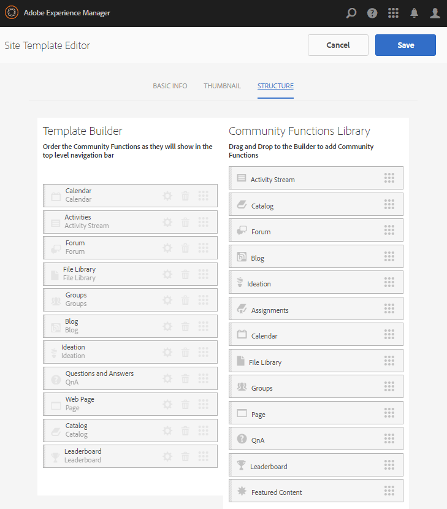

# Experimente o site publicado {#experience-the-published-site}

## Navegue até Novo site na publicação {#browse-to-new-site-on-publish}

Agora que o site de comunidades recém-criado foi publicado, navegue até o URL exibido ao criar o site, mas no servidor de publicação, por exemplo:

* URL do autor = https://localhost:4502/content/sites/engage/en.html
* URL de publicação = https://localhost:4503/content/sites/engage/en.html

Para minimizar a confusão sobre qual membro está conectado no autor e na publicação, recomenda-se usar navegadores diferentes para cada instância.

Ao chegar ao site publicado pela primeira vez, o visitante do site normalmente não estaria conectado e seria anônimo.

`https://localhost:4503/content/sites/engage/en.html {#http-localhost-content-sites-engage-en-html}`

## Visitante de site anônimo {#anonymous-site-visitor}

Um visitante de site anônimo vê o seguinte na interface do usuário:

* Título do site (Tutorial de introdução)
* Nenhum link de perfil
* Nenhum link de mensagens
* Nenhum link de notificações
* Campo Pesquisa
* Link de logon
* O banner da marca
* Links de menu para os componentes incluídos no Modelo de site de referência.

Se você selecionar vários links, eles ficarão no modo somente leitura.

### Impedir acesso anônimo no JCR {#prevent-anonymous-access-on-jcr}

Uma limitação conhecida expõe o conteúdo do site da comunidade a visitantes anônimos por meio de conteúdo jcr e json , embora **permita acesso anônimo** esteja desabilitado para o conteúdo do site. No entanto, esse comportamento pode ser controlado usando Restrições de Sling como uma solução alternativa.

Para proteger o conteúdo do site da sua comunidade do acesso de usuários anônimos por meio de conteúdo jcr e json , siga estas etapas:

1. Na instância do autor de AEM, vá para https:// nome do host:port/editor.html/content/site/sitename.html.

   >[!NOTE]
   >
   >Não vá para o site localizado.

1. Vá para **Propriedades da página**.

   

1. Vá para a guia **Avançado**.

1. Ative **Requisito de autenticação**.

   

1. Adicione o caminho da página de logon. Por exemplo, **/content/......./GetStarted**.
1. Publique a página.

## Membro da comunidade confiável {#trusted-community-member}

Essa experiência supõe que [Aaron McDonald](/help/communities/tutorials.md#demo-users) recebeu as funções de [gerente e moderador da comunidade](/help/communities/create-site.md#roles). Caso contrário, volte ao ambiente do autor para [modificar as configurações do site](/help/communities/sites-console.md#modifying-site-properties) e selecione Aaron McDonald como gerente e moderador da comunidade.

No canto superior direito, selecione `Log in` e entre com o nome de usuário (aaron.mcdonald@mailinator.com) e a senha (senha). Observe a capacidade de fazer logon com credenciais do Twitter ou Facebook.

Depois de fazer logon como membro da comunidade registrado, observe os seguintes itens de menu para clicar e explorar seu site da comunidade:

* **A opção** Perfil permite que você visualização e edite seu perfil.
* [A opção ](/help/communities/configure-messaging.md) Mensagens direciona você para a seção de mensagens diretas, onde você pode:

   1. Visualização as mensagens diretas recebidas (Caixa de entrada), enviadas (Itens enviados) e excluídas (Lixeira).
   1. Componha novas mensagens diretas para enviar a indivíduos e grupos.

* [A opção ](/help/communities/notifications.md) Notificações direciona você para a seção Notificações, onde você pode visualização seus eventos de interesse e editar configurações de notificação.
* [A ](/help/communities/published-site.md#moderationlink) Administração direciona você para a Página de moderação do AEM Communities, se você tiver privilégios de moderação.

Observe que a página Calendário é o home page porque o Modelo de site de referência escolhido incluiu a função Calendário primeiro, seguido pela função Fluxo de Atividade, função Fórum e assim por diante. Essa estrutura é visível do console [Modelo do site](/help/communities/sites.md#edit-site-template) ou ao modificar as propriedades do site no ambiente do autor:

>[!NOTE]
>
>Para obter mais informações sobre componentes e funções das Comunidades, visite:
>
>* [Componentes](/help/communities/author-communities.md)  das comunidades (para autores)
>* [Componentes, funções e recursos básicos](/help/communities/essentials.md)  (para desenvolvedores)

### Link do fórum {#forum-link}

Visualização o recurso básico do fórum selecionando o link do Fórum.

Os membros podem publicar um novo tópico ou seguir um tópico.

Os visitantes do site podem visualização as publicações e classificá-las de várias maneiras.

### Link de grupos {#groups-link}

Como Aaron é um administrador de grupo, selecionar o link Grupos permitirá que Aaron crie um novo grupo da comunidade selecionando um modelo de grupo, uma imagem, se o grupo estiver aberto ou secreto e convidando os membros.

Este é um exemplo onde um grupo é criado no ambiente publish.

Grupos também podem ser criados no ambiente do autor e gerenciados no site da comunidade no ambiente do autor ([console Grupos da comunidade](/help/communities/groups.md)). A experiência de [criar grupos no autor](/help/communities/nested-groups.md) é a próxima neste tutorial.

Criar um grupo de referência:

1. Selecionar **Novo Grupo**
1. **Guia Configurações**

   * Nome do grupo : `Sports`
   * Descrição : `A parent group for various sporting groups`.
   * Nome do URL do grupo : `sports`
   * Selecione `Open Group` (permitir que qualquer membro da comunidade participe ingressando)

1. **Guia Modelo**

   * Selecione `Reference Group` (contém uma função de grupos em sua estrutura para permitir grupos aninhados)

1. Selecione **Criar grupo**

   

Após a criação de um novo grupo, **selecione o novo grupo Esportes** para criar dois grupos (aninhados) dentro dele. Como uma estrutura de site não pode começar com a função de grupos, após abrir o grupo Esportes, é necessário selecionar o link Grupos:

O segundo conjunto de links, começando com `Blog`, pertence ao grupo atualmente selecionado, o grupo `Sports`. Ao selecionar o link Esportes `Groups`, é possível aninhar dois grupos dentro do grupo Esportes.

Como exemplo, adicione dois `new groups`.

* Um chamado `Baseball`

   * Deixe-o definido como `Open Group` (associação obrigatória).
   * Na guia Modelos, selecione `Conversational Group`.

* Um chamado `Gymnastics`

   * Altere sua configuração para `Member Only Group` (associação restrita).
   * Na guia Modelos, selecione `Conversational Group`.

**Aviso**:

* Uma atualização da página pode ser necessária antes que ambos os grupos sejam exibidos.
* Este modelo *not* inclui a função groups, pelo que não será possível o aninhamento adicional de grupos.
* No autor, o [console Grupos](/help/communities/groups.md) oferece uma terceira opção - uma `Public Group` (associação opcional).

Depois que ambos os grupos forem criados, selecione o grupo Beisebol, um grupo aberto e observe seus links:

`Discussions` `What's New` `Members`

Os links do grupo são exibidos abaixo dos links do site principal e os resultados são exibidos na seguinte exibição:

Em autor - com privilégios administrativos, navegue até o console [Grupos das Comunidades](/help/communities/members.md) e adicione Weston McCall ao grupo `Community Engage Gymnastics <uid> Members`.

Continuando a publicar, faça logout como Aaron McDonald e visualização os grupos no Sports Group como um visitante anônimo do site:

* Do home page
* Selecionar link `Groups`
* Selecionar link `Sports`
* Selecione o link Esportes`Groups`

Somente o grupo Beisebol estará visível.

Faça logon como Weston McCall (weston.mccall@dodgit.com / senha) e navegue até o mesmo local. Observe que o Weston é capaz de `Join` abrir o grupo `Baseball` e `enter or Leave` o grupo privado `Gymnastics`.

### Link da Página da Web {#web-page-link}

Visualização a página da Web básica incluída no site selecionando o link Página da Web. As ferramentas de criação de AEM padrão podem ser usadas para adicionar conteúdo a esta página no ambiente do autor.

Por exemplo, vá para a instância **autor**, abra a pasta `engage` no console [Sites das Comunidades](/help/communities/sites-console.md), selecione o ícone **Abrir Site** para entrar no modo de edição do autor. Em seguida, selecione o modo de pré-visualização para selecionar o link `Web Page` e, em seguida, selecione o modo de edição para adicionar componentes de Título e Texto. Por último, publique novamente apenas a página ou o site inteiro.

### Link de moderação {#moderationlink}

Quando o membro da comunidade tiver privilégios de moderação, o link Moderação ficará visível e sua seleção exibirá o conteúdo da comunidade publicado e permitirá que ele seja [moderado](/help/communities/moderate-ugc.md) de uma maneira semelhante ao [console de moderação](/help/communities/moderation.md) no ambiente do autor.

Use o botão Voltar do navegador para retornar ao site publicado. A maioria dos consoles não está acessível da navegação global no ambiente publish. 

## Autoinscrição {#self-registration}

Depois de fazer logoff, é possível criar um novo registro de usuário.

* Selecionar `Log In`
* Selecionar `Sign up for a new account`

Por padrão, o endereço de email é a ID de login. Se essa opção estiver desmarcada, o visitante poderá inserir sua própria ID de login (nome de usuário). O nome de usuário deve ser exclusivo no ambiente publish.

Depois de especificar o nome, email e senha do usuário, selecionar `Sign Up` criará o usuário e permitirá que ele assine.

Depois de conectado, a primeira página apresentada é a página `Profile`, que eles podem personalizar.

Se o membro se esquecer da ID de login, será possível recuperar se está usando seu endereço de email.

