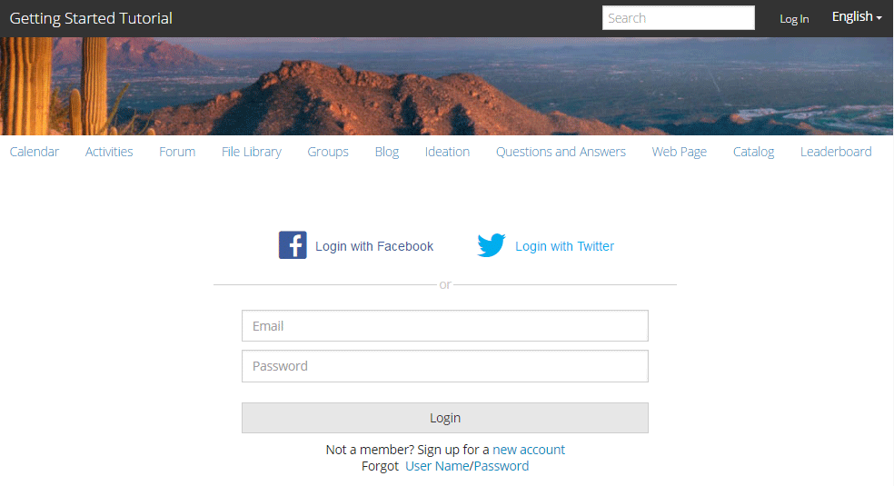

# Experimente o site publicado {#experience-the-published-site}

## Navegue até o novo site na publicação {#browse-to-new-site-on-publish}

Agora que o site de comunidades recém-criado foi publicado, navegue até o URL exibido ao criar o site, mas no servidor de publicação, por exemplo:

* URL do autor = https://localhost:4502/content/sites/engage/en.html
* URL de publicação = https://localhost:4503/content/sites/engage/en.html

Para minimizar a confusão sobre qual membro está conectado ao autor e à publicação, sugerimos usar navegadores diferentes para cada instância.

Ao chegar pela primeira vez ao site publicado, o visitante do site normalmente não estaria conectado e seria anônimo.

`https://localhost:4503/content/sites/engage/en.html {#http-localhost-content-sites-engage-en-html}`

## Visitante Anônimo do Site {#anonymous-site-visitor}

Um visitante anônimo do site vê o seguinte na interface do usuário:

* Título do site (Tutorial de introdução)
* Nenhum link de perfil
* Sem link de mensagens
* Sem link de notificações
* Campo Pesquisa
* Link de logon
* O banner da marca
* Links de menu para os componentes incluídos no Modelo de site de referência.

Se você selecionar vários links, eles estarão no modo somente leitura.

### Impedir acesso anônimo no JCR {#prevent-anonymous-access-on-jcr}

Uma limitação conhecida expõe o conteúdo do site da comunidade a visitantes anônimos por meio de conteúdo jcr e json , embora **permitir acesso anônimo** esteja desabilitado para o conteúdo do site. No entanto, esse comportamento pode ser controlado usando Restrições do Sling como uma solução alternativa.

Para proteger o conteúdo do site da comunidade do acesso de usuários anônimos por meio de conteúdo jcr e json , siga estas etapas:

1. Na instância do autor do AEM, acesse https:// hostname:port/editor.html/content/site/sitename.html.

   >[!NOTE]
   >
   >Não vá para o site localizado.

1. Vá para **Propriedades da página**.

   

1. Vá para a guia **Advanced**.

1. Habilite **Requisito de autenticação**.

   

1. Adicione o caminho da página de logon. Por exemplo, **/content/......./GetStarted**.
1. Publique a página.

## Membro da Comunidade Confiável {#trusted-community-member}

Essa experiência supõe que [Aaron McDonald](/help/communities/tutorials.md#demo-users) recebeu as funções de [gerente e moderador da comunidade](/help/communities/create-site.md#roles). Caso contrário, retorne ao ambiente do autor para [modifique as configurações do site](/help/communities/sites-console.md#modifying-site-properties) e selecione Aaron McDonald como gerente da comunidade e moderador.

No canto superior direito, selecione `Log in` e assine com nome de usuário (aaron.mcdonald@mailinator.com) e senha (senha). Observe a capacidade de fazer logon com credenciais do Twitter ou Facebook.

Depois de fazer logon como membro da comunidade registrada, observe os seguintes itens de menu para clicar e explorar seu site da comunidade:

* **** A opção Perfil permite exibir e editar o perfil.
*  A opção Mensagens direciona você para a seção Mensagens diretas, onde é possível:

   1. Exibir as mensagens diretas recebidas (Caixa de entrada), enviadas (Itens enviados) e excluídas (Lixeira).
   1. Componha novas mensagens diretas para enviar a indivíduos e grupos.

* [A opção ](/help/communities/notifications.md) Notificações direciona você à seção de notificações, onde é possível visualizar seus eventos de interesse e editar configurações de notificação.
*  A administração direciona você à página de moderação do AEM Communities, caso tenha privilégios de moderação.

Observe que a página Calendário é a página inicial, pois o Modelo de site de referência escolhido incluiu a função Calendário primeiro, seguido pela função Fluxo de atividade, função do Fórum e assim por diante. Esta estrutura é visível do console [Modelo de site](/help/communities/sites.md#edit-site-template) ou ao modificar as propriedades do site no ambiente do autor:

>[!NOTE]
>
>Para obter mais informações sobre componentes e funções do Communities, visite:
>
>* [Componentes das comunidades](/help/communities/author-communities.md)  (para autores)
>* [Componentes, funções e recursos essenciais](/help/communities/essentials.md)  (para desenvolvedores)

### Link do fórum {#forum-link}

Visualize o recurso básico do fórum selecionando o link Forum .

Os membros podem postar um novo tópico ou seguir um tópico.

Os visitantes do site podem visualizar postagens e classificá-las de várias maneiras.

### Link Grupos {#groups-link}

Como Aaron é um administrador de grupo, selecionar o link Grupos permitirá que Aaron crie um novo grupo da comunidade selecionando um modelo de grupo, uma imagem, se o grupo está aberto ou secreto e convidando membros.

Este é um exemplo em que um grupo é criado no ambiente de publicação.

Os grupos também podem ser criados no ambiente de criação e gerenciados no site da comunidade no ambiente de criação ([console Grupos da comunidade](/help/communities/groups.md)). A experiência de [criar grupos no autor](/help/communities/nested-groups.md) é a próxima neste tutorial.

Criar um grupo de referência:

1. Selecione **Novo Grupo**
1. **Guia Configurações**

   * Nome do grupo : `Sports`
   * Descrição : `A parent group for various sporting groups`.
   * Nome do URL do grupo : `sports`
   * Selecione `Open Group` (permitir que qualquer membro da comunidade participe unindo-se)

1. **Guia Modelo**

   * Selecione `Reference Group` (contém uma função de grupos na estrutura para permitir grupos aninhados)

1. Selecione **Criar Grupo**

   

Após a criação do novo grupo, **selecione o novo grupo Esportes** para criar dois grupos (aninhados) dentro dele. Como uma estrutura de site não pode começar com a função de grupos , após abrir o grupo Esportes, é necessário selecionar o link Grupos :

O segundo conjunto de links, começando com `Blog`, pertence ao grupo selecionado no momento, o grupo `Sports`. Ao selecionar o link Sports&#39; `Groups` , é possível aninhar dois grupos dentro do grupo Sports.

Como exemplo, adicione dois `new groups`.

* Um nome `Baseball`

   * Deixe-a configurada como `Open Group` (associação necessária).
   * Na guia Modelos , selecione `Conversational Group`.

* Um nome `Gymnastics`

   * Altere sua configuração para `Member Only Group` (associação restrita).
   * Na guia Modelos , selecione `Conversational Group`.

**Aviso**:

* Uma atualização da página pode ser necessária antes que ambos os grupos sejam exibidos.
* Esse template *not* inclui a função de grupos, portanto, nenhum aninhamento de grupos será possível.
* No autor, o [console Grupos](/help/communities/groups.md) fornece uma terceira opção - um `Public Group` (associação opcional).

Depois que ambos os grupos forem criados, selecione o grupo Beisebol, um grupo aberto e observe seus links:

`Discussions` `What's New` `Members`

Os links do grupo são exibidos abaixo dos links do site principal e resultam na seguinte exibição:

Em autor - com privilégios administrativos, navegue até o [console Grupos de Comunidades](/help/communities/members.md) e adicione Weston McCall ao grupo `Community Engage Gymnastics <uid> Members`.

Continuando a publicar, saia como Aaron McDonald e veja os grupos no Sports Group como um visitante anônimo do site:

* Da página inicial
* Selecionar link `Groups`
* Selecionar link `Sports`
* Selecione o link Esportes`Groups`

Somente o grupo Beisebol será visível.

Faça logon como Weston McCall (weston.mccall@dodgit.com / senha) e navegue até o mesmo local. Observe que o Weston pode `Join` abrir o grupo `Baseball` e `enter or Leave` o grupo privado `Gymnastics`.

### Link da página da Web {#web-page-link}

Visualize a página da Web básica incluída no site selecionando o link Página da Web. As ferramentas de criação de AEM padrão podem ser usadas para adicionar conteúdo a esta página no ambiente de criação.

Por exemplo, vá para a instância **author**, abra a pasta `engage` no [console Sites das Comunidades](/help/communities/sites-console.md), selecione o ícone **Abrir Site** para entrar no modo de edição do autor. Em seguida, selecione o modo de visualização para selecionar o link `Web Page` e, em seguida, selecione o modo de edição para adicionar os componentes Título e Texto. Por último, publique novamente apenas a página ou o site inteiro.

### Link de moderação {#moderationlink}

Quando o membro da comunidade tiver privilégios de moderação, o link Moderação estará visível e a seleção exibirá o conteúdo da comunidade publicado e permitirá que ele seja [moderado](/help/communities/moderate-ugc.md) de maneira semelhante ao [console de moderação](/help/communities/moderation.md) no ambiente do autor.

Use o botão Voltar do navegador para retornar ao site publicado. A maioria dos consoles não é acessível a partir da navegação global no ambiente de publicação.

## Autoregistro {#self-registration}

Depois de fazer logoff, é possível criar um novo registro de usuário.

* Selecionar `Log In`
* Selecionar `Sign up for a new account`

Por padrão, o endereço de email é a id de logon. Se estiver desmarcado, o visitante poderá inserir sua própria ID de logon (nome de usuário). O nome de usuário deve ser exclusivo no ambiente de publicação.

Após especificar o nome do usuário, email e senha, selecionar `Sign Up` criará o usuário e permitirá que ele assine.

Depois de conectado, a primeira página apresentada é a página `Profile`, que pode ser personalizada.

Se o membro esquecer a id de logon, será possível recuperar o usando seu endereço de email.

