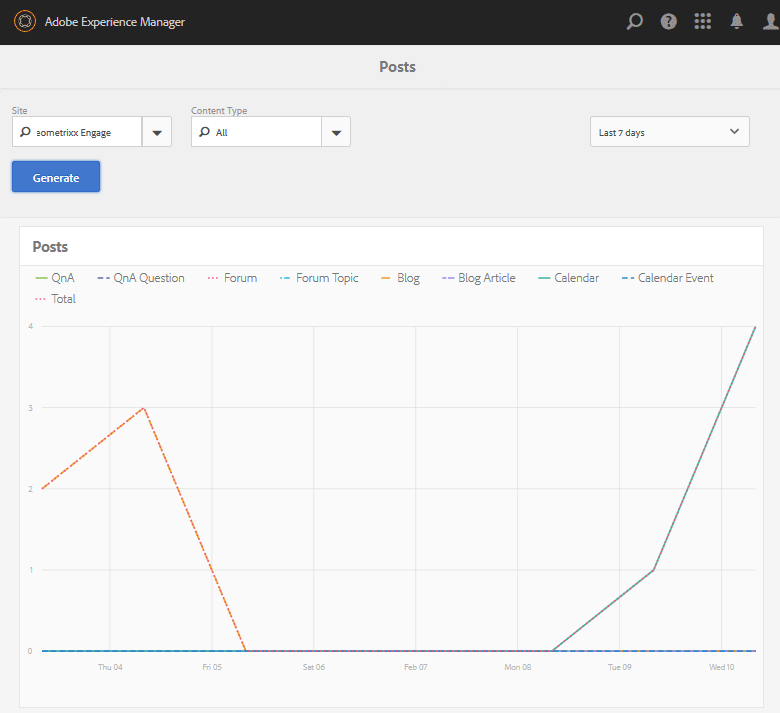

# Console de relatórios {#reports-console}

## Visão geral {#overview}

No AEM Communities, há vários relatórios que podem ser acessados de várias maneiras a partir do ambiente do autor.

Em geral, os vários relatórios são:

* [Relatório de atribuições](#assignments-report)

   Para uma comunidade [de](/help/communities/overview.md#enablement-community)ativação, fornece uma visão geral do progresso dos alunos em suas atribuições, incluindo uma pontuação associada ao implementar o padrão SCORM.

* [Relatório de exibições](#views-report)

   Fornece um gráfico de visualizações de conteúdo por membros da comunidade e visitantes do site para qualquer site da comunidade.

* [Relatório de publicações](#posts-report)

   Fornece um gráfico de vários tipos de publicações por membros da comunidade para qualquer site da comunidade.

Quando o [Adobe Analytics estiver ativado](/help/communities/sites-console.md#analytics), os relatórios incluirão o número de visualizações, reproduções, comentários e classificações para cada recurso de ativação ao longo do tempo.

Os relatórios tabulares podem ser exportados no formato .csv para processamento subsequente.

## Consoles do relatórios {#reporting-consoles}

### Relatórios para sites da comunidade {#reports-for-community-sites}

* Da navegação global: **[!UICONTROL Navigation]** > **[!UICONTROL Comunidades]** > **[!UICONTROL Relatórios]**

* Escolha entre:

   * **[!UICONTROL Relatório de atribuições]**

      * Gerar um relatório para Site da comunidade, Usuário ou Grupo e Atribuição selecionados.
   * **[!UICONTROL Relatório de publicações]**

      * Gere um relatório para o Site da comunidade, o Tipo de conteúdo e o Período.
   * **[!UICONTROL Relatório de exibições]**

      * gerar um relatório para o Site da comunidade, o Tipo de conteúdo e o Período.

### Relatórios para recursos de ativação e caminhos de aprendizado {#reports-for-enablement-resources-and-learning-paths}

* Da navegação global: **[!UICONTROL Navigation]** > **[!UICONTROL Comunidades]** > **[!UICONTROL Recursos]**

* Selecione um site da comunidade de ativação existente:

   * Selecione o ícone **Relatório** para gerar relatórios que abrangem todos os recursos de ativação.
   * Selecione um caminho de aprendizado de ativação.
   * Selecione o ícone **Relatório** para o qual gerar relatórios:

      * Os recursos de ativação incluídos.
      * Os alunos atribuídos ao caminho de aprendizado.

* Esses relatórios fornecem:

   * Dados da tabela, disponíveis para download como CSV:

      * Como identificar o aluno
      * Seu status
      * Se atribuído ou acessado pelo catálogo
      * Número de comentários feitos
      * Classificação de estrelas fornecida

Para obter mais detalhes, consulte a seção  Relatórios do console Recursos.

## Relatório de atribuições {#assignments-report}

O console Atribuições permite que os relatórios sejam filtrados por meio da ativação do site da comunidade, usuários ou grupos e atribuição.

O relatório fornece informações sobre o seu progresso, bem como quaisquer comentários ou notações que lhe sejam fornecidos.

Selecione os critérios para o relatório:

* **Site**

   Selecione um site de comunidade de ativação.

* **Usuário ou grupo**
   * Selecione Usuário para gerar um relatório para um aluno.
   * Selecione Grupo para gerar um relatório para um grupo de alunos.

   O serviço de túnel acessará membros e grupos de membros do ambiente publish.

* **Atribuição**

   Escolha entre os recursos de ativação atribuídos aos alunos selecionados.

Selecione **Gerar** para criar o relatório:

## Relatório de exibições {#views-report}

O console do Visualização permite que os relatórios sejam gerados nas visualizações de página por recursos da comunidade para um determinado período.

Selecione os critérios para o relatório:

* **[!UICONTROL Site]**

   Selecione um site da comunidade.

* **[!UICONTROL Tipo de conteúdo]**

   Pode escolher Todo o conteúdo ou selecionar um dos recursos presentes no site.

* **[!UICONTROL Período]**

   Selecione um dos seguintes:

   * Últimos 7 dias
   * Últimos 30 dias
   * Últimos 90 dias
   * Ano anterior

Selecione **[!UICONTROL Gerar]** para criar o relatório.

## Relatório de publicações {#posts-report}

O console Publicações permite que os relatórios sejam gerados em número de publicações para recursos da comunidade em um determinado período.

Selecione os critérios para o relatório:

* **[!UICONTROL Site]**

   Selecione um site da comunidade.

* **[!UICONTROL Tipo de conteúdo]**

   Pode escolher Todo o conteúdo ou selecionar um dos recursos presentes no site.

* **[!UICONTROL Período]**

   Selecione um dos seguintes:

   * Últimos 7 dias
   * Últimos 30 dias
   * Últimos 90 dias
   * Ano anterior

Selecione **[!UICONTROL Gerar]** para criar o relatório.

## Resolução de Problemas{#troubleshooting}

### Nenhum site da comunidade listado {#no-community-sites-listed}

Se nenhum site da comunidade estiver listado, verifique se a Adobe Analytics foi ativada para um site. Se você escolher relatórios em atribuições, verifique se a função de atribuições está na estrutura do site da comunidade.

### Os relatórios não são exibidos na instância do autor de AEM {#reports-do-not-show-in-aem-author-instance}

Se os relatórios não forem exibidos na instância de autor de AEM, verifique se há personalizações, como o mapeamento de URL na instância de publicação. Se o mapeamento de URL for feito somente na instância de publicação de AEM do site de comunidades, verifique se o mesmo foi configurado na instância de autor de AEM na configuração de fábrica **de componentes sociais do relatório de tendência do** site.

