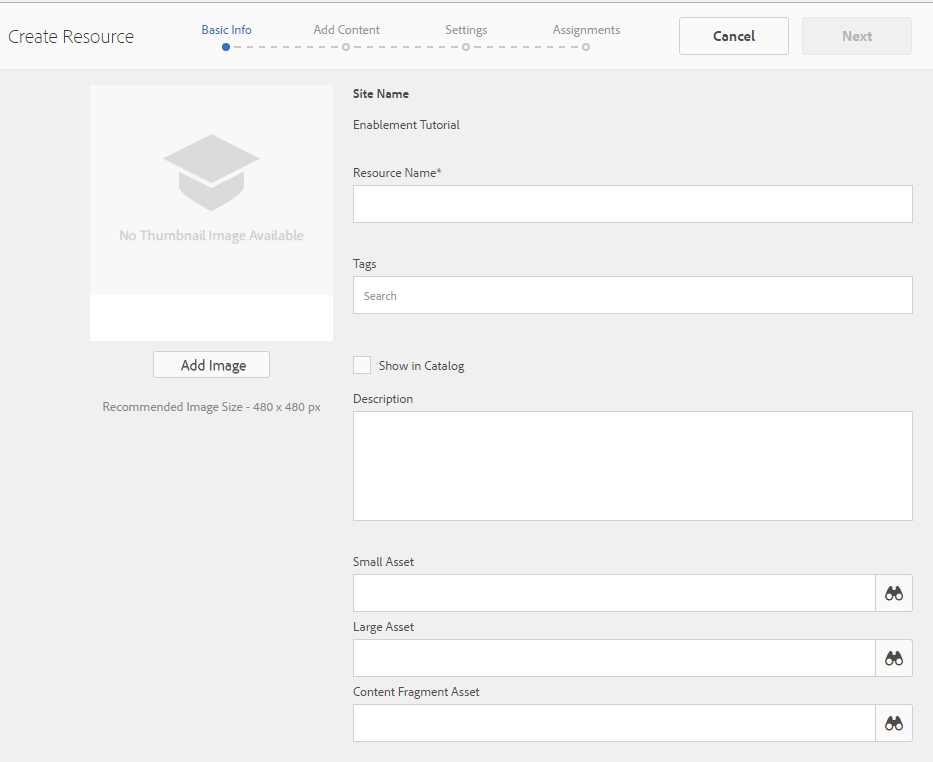
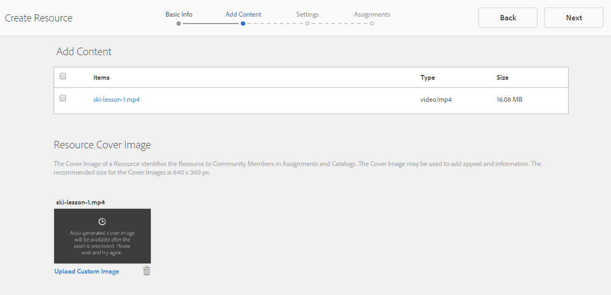

# Console de recursos de ativação {#enablement-resources-console}

Para o AEM Communities, o console Recursos é onde os Gerentes de [ativação](users.md) criam, gerenciam e atribuem recursos aos membros de um site da comunidade de ativação.

## Requisitos {#requirements}

Antes de adicionar recursos de ativação para um site da comunidade, as instâncias do AEM devem ser configuradas corretamente, incluindo:

* SCORM
* FFmpeg

Para obter detalhes, consulte [Configuração de habilitação](enablement.md).

>[!CAUTION]
>
>Se o SCORM for instalado após a criação do site da comunidade, todos os recursos de ativação presentes antes da instalação do SCORM devem ser recriados.

>[!NOTE]
>
>Com o lançamento do [AEM 6.3](deploy-communities.md#latestfeaturepack) e os pacotes de recursos equivalentes Comunidades [AEM 6.2 FP3](deploy-communities.md#latestfeaturepack) e [AEM 6.1 FP7](https://docs.adobe.com/content/docs/en/aem/6-1/deploy/communities.html#Latest Feature Pack), o recurso de ativação não requer mais um banco de dados MySQL.

## Terminologia {#terminology}

### Recurso {#resource}

Os recursos são essenciais para uma comunidade [de](overview.md#enablement-community)capacitação. São os materiais atribuídos aos membros que lhes permitem melhorar as suas competências.

Características de um recurso:

* Pode ser do tipo:
   * Imagem (JPG, PNG, GIF, BMP)
   * Vídeo (MP4)
   * Flash (SWF)
   * Documento (PDF)
   * Questionário (SCORM)
* Pode ser referenciado a partir de um ou mais caminhos de aprendizagem.

### Caminho de aprendizagem {#learning-path}

Um caminho de aprendizado é um conjunto lógico de recursos de ativação agrupados para facilitar a atribuição aos membros.

### Grupo de membros {#members-group}

Quando um site da comunidade é criado, o nome fornecido ao site para o URL é usado na criação dos grupos [de usuários específicos do](users.md) site configurados com várias permissões para várias funções. Todos esses grupos criados automaticamente recebem o prefixo `Community <site-name>`.

Um desses grupos de usuários é o `Community <site-name> Members` grupo, que identifica os usuários registrados no ambiente de publicação como membros da comunidade. Consulte o tutorial [Introdução ao AEM Communities para obter um exemplo da Ativação](getting-started-enablement.md) .

Para comunidades [de](overview.md#egagementcommunity)envolvimento, é razoável permitir que os visitantes do site se registrem automaticamente ou usem o login social, e nesse ponto eles são adicionados automaticamente ao grupo de membros.

Para comunidades [de](overview.md#enablement-community)ativação, é recomendável tornar o site privado, o que requer que um administrador adicione usuários ao grupo de membros.

## Acessar os recursos de ativação de um site da comunidade {#accessing-a-community-site-s-enablement-resources}

### Navegar até Recursos de comunidades {#navigate-to-communities-resources}

No ambiente do autor, para acessar o console Recursos

* Da navegação global: **[!UICONTROL Navegação]** > **[!UICONTROL Comunidades]** > **[!UICONTROL Recursos]**

   

### Selecionar um site da comunidade {#select-a-community-site}

O console Recursos das Comunidades exibirá todos os sites da comunidade.

Os recursos de ativação são criados para um site da comunidade específica depois de selecionar o site no console Recursos.

Depois que um site da comunidade específica é selecionado, todos os recursos de ativação e caminhos de aprendizado existentes são acessíveis para gerenciamento e modificação, e novos recursos de ativação e caminhos de aprendizado podem ser criados.

#### Pesquisar {#search-features}

Selecione o ícone de alternância do painel lateral para procurar um recurso de ativação ou um caminho de aprendizado. Quando selecionada, um painel de pesquisa é aberto no lado esquerdo do console e fornece uma caixa de texto na qual os termos de pesquisa podem ser inseridos.

#### Modo de seleção {#selection-mode}

Para selecionar vários recursos de ativação, selecione o primeiro passando o mouse sobre o cartão e selecionando o ícone de marca de seleção. Depois de selecionado, a seleção de qualquer outro cartão o adicionará ao grupo de seleção. Selecionar uma segunda vez cancela a seleção do cartão.

## Criar um recurso {#create-a-resource}

Para adicionar um novo recurso de ativação ao site da comunidade

* Select the `Create` icon.
* No submenu exibido, selecione **[!UICONTROL Recurso]**.

Isso inicia um processo passo a passo de:

* Descrever o recurso (nome, imagem do cartão e texto).
* Selecionar o conteúdo do recurso.
* Selecionar uma imagem de capa para o recurso.
* Identificando contatos de recursos.
* Atribuindo recursos aos membros.

Quando o recurso faz parte de um curso, um caminho de aprendizado, os membros devem ser atribuídos somente ao caminho de aprendizado. As atribuições podem ser adicionadas após o recurso de ativação ter sido criado.

### 1 Basic Info {#basic-info}

* **[!UICONTROL Adicionar]**

   (*Opcional*) Uma imagem a ser exibida no cartão para o recurso de ativação na página de atribuições do membro, bem como no console Recursos. A imagem é selecionada do sistema de arquivos local do servidor. Se uma imagem não for fornecida, uma miniatura será gerada para o recurso carregado.

   ***Observação***: O tamanho de imagem recomendado não é apenas 480 x 480 pixels. Devido ao design responsivo dos cartões para várias dimensões do navegador, o tamanho da exibição varia de 220 X 165 pixels a 400 x 165 pixels.

* **[!UICONTROL Nome do site]**

   (*somente leitura*) O site da comunidade ao qual o recurso está sendo adicionado.

* **[!UICONTROL Nome do recurso]**

   (*Obrigatório*) O nome de exibição do recurso. Um nome de nó válido é criado a partir do nome de exibição.

* **[!UICONTROL Tags]**

   (*Opcional*) Uma ou mais tags podem ser escolhidas que associam o recurso de ativação a um ou mais catálogos. Consulte [Marcação de recursos](tag-resources.md)de ativação.

* **[!UICONTROL Mostrar no catálogo]**

   Quando desmarcado, o recurso de ativação não aparecerá em nenhum catálogo. Se marcado, o recurso de ativação aparecerá em todos os catálogos, a menos que [pré-filtrado](catalog-developer-essentials.md#pre-filters) ou os filtros membros da interface do usuário. O padrão está desmarcado.

* **[!UICONTROL Descrição]**

   (*Opcional*) A descrição a ser exibida para o recurso de ativação.

* **[!UICONTROL Ativo pequeno]**

   (*Opcional*) Selecionado dos ativos AEM. Uma imagem em miniatura para representar o recurso no ambiente de publicação, como em um catálogo.

* **[!UICONTROL Ativo grande]**

   (*Opcional*) Selecionado dos ativos AEM. Uma imagem grande para representar o recurso no ambiente de publicação, como na página principal de um recurso.

* **[!UICONTROL Ativo do conteúdo de fragmento]**

   (*Opcional*) Selecionado dos ativos AEM. Um fragmento de conteúdo que pode ser referenciado no ambiente de publicação, mas não está em uso por padrão.

* Selecione **[!UICONTROL Próximo]**

### 2 Add Content {#add-content}

Embora pareça que vários recursos de ativação podem ser selecionados, somente um é permitido.

Selecione o `'+' icon`, no canto superior direito, para iniciar o processo de escolha do recurso identificando a fonte.

* **[!UICONTROL Fazer upload a partir de meus arquivos locais]**

   Fazer upload do sistema de arquivos local usará o navegador de arquivos nativo para selecionar e fazer upload de um arquivo. Os tipos de arquivos suportados são SCORM.zip (HTML5 ou SWF), vídeo MP4, SWF, PDF e tipos de imagem (JPG, PNG, GIF, BMP). O nome do arquivo se torna o nome do ativo, que é adicionado à biblioteca de ativos.

* **[!UICONTROL Consultar biblioteca de ativos]**

   Selecione na Biblioteca de ativos. A seleção é limitada àqueles que estão visíveis no site da comunidade.

* **[!UICONTROL Adicione um URL externo]**

   Insira um link para o conteúdo de aprendizado.

   Na caixa de diálogo que é aberta, digite:

   * **[!UICONTROL Título]**

      O nome do ativo para o recurso de ativação.

   * **[!UICONTROL URL]**

      O URL para um ativo.

* **[!UICONTROL Adicione um URL do Adobe Connect]**

   Digite um link para uma sessão do Adobe Connect.

   Na caixa de diálogo que é aberta, digite:

   * **[!UICONTROL Título]**

      O nome do ativo para o recurso de ativação.

   * **[!UICONTROL URL]**

      O URL para uma sessão do Adobe Connect.

* **[!UICONTROL Defina um recurso externo]**

   Insira o local onde o material será apresentado. Os valores para o status e a pontuação de sucesso são inseridos manualmente (consulte [Relatórios](reports.md)). Uma imagem de capa carregada pode ser usada para fornecer informações adicionais.

   Na caixa de diálogo que é aberta, digite:

   * **[!UICONTROL Título]**

      O nome do ativo para o recurso de ativação.

   * **[!UICONTROL Local]**

      A localização de um site físico, como uma sala de aula.

#### Exemplo de um recurso de vídeo adicionado {#example-of-an-added-video-resource}

* **[!UICONTROL Imagem de capa do recurso]**

   A imagem de capa é uma imagem a ser exibida quando o recurso de ativação for visualizado pela primeira vez. Por exemplo, a imagem de capa é exibida quando um recurso de vídeo ainda não está sendo reproduzido. Se uma imagem personalizada não for carregada, uma imagem padrão será exibida. Para recursos de vídeo, pode ser possível [gerar uma miniatura](enablement.md#ffmpeg), mas somente quando carregada e não quando o vídeo é referenciado como um URL. Para recursos de localização, a imagem pode ser usada para fornecer informações adicionais.

   O tamanho recomendado para a imagem de capa é 640 x 360 px.

* Selecione **[!UICONTROL Próximo]**.

### 3 Settings {#settings}

>[!NOTE]
>
>Os alunos não devem estar inscritos diretamente nos recursos de ativação que devem ser referenciados a partir de um caminho de aprendizagem. Os alunos precisam estar inscritos somente no caminho de aprendizado.
>
>Se um membro estiver inscrito em um recurso e em um caminho de aprendizado que faça referência a esse recurso, suas atribuições mostrarão o recurso único e o recurso no caminho de aprendizado.

* **[!UICONTROL Configurações sociais]**

   Essas configurações controlam se os alunos podem ou não fornecer informações sobre o recurso de ativação. As configurações [de](sites-console.md#moderation) moderação são as do site da comunidade pai.

   * **[!UICONTROL Permitir comentários]**

      Se marcada, os membros têm permissão para comentar no recurso. O padrão está marcado.

   * **[!UICONTROL Permitir classificações]**

      Se marcada, os membros têm permissão para classificar o recurso. O padrão está marcado.

   * **[!UICONTROL Permitir acesso anônimo]**

      Se marcada, visitantes anônimos do site poderão visualização o recurso em um catálogo quando o site da comunidade também permitir acesso anônimo. O padrão está desmarcado.

* **[!UICONTROL Data de vencimento]**

   *(Opcional)* Uma data na qual a atribuição deve ser concluída pode ser selecionada.

* **[!UICONTROL Autor do recurso]**

   *(Opcional)* O autor do recurso de ativação. Use o menu suspenso para selecionar entre os usuários que são membros do grupo [de](#members-group)membros.

* **[!UICONTROL &amp;Painel de Recurso;ast;]**

   *(Obrigatório)* Uma pessoa que o membro pode contatar em relação ao recurso de ativação. Use o menu suspenso para selecionar entre os usuários que são membros do grupo [de](#members-group)membros.

* **[!UICONTROL Especialista de recurso]**

   *(Opcional)* Uma pessoa que o membro pode entrar em contato e que tem conhecimento sobre o recurso de ativação. Use o menu suspenso para selecionar usuários que sejam membros do grupo [de](#members-group)membros.

### 4 Assignments {#assignments}

* **[!UICONTROL Adicionar responsáveis]**

   Use o menu suspenso para selecionar entre os [membros](#members-group) - Os usuários e os grupos de usuários (listados em negrito) - que devem ser inscritos como alunos. Quando os membros entram no site da comunidade, os recursos de ativação (e caminhos de aprendizado) nos quais estão inscritos aparecerão em sua página [Atribuições](functions.md#assignments-function) .

* Selecione **[!UICONTROL Criar]**.

   

A criação bem-sucedida do recurso de ativação retorna ao console Recursos com o recurso recém-criado selecionado. Desse console, é possível [gerenciar o recurso](#managing-a-resource).

## Create a Learning Path {#create-a-learning-path}

Para adicionar um novo caminho de aprendizado ao site da comunidade

* Selecione o `Create` ícone
* No submenu que é exibido, selecione Caminho **[!UICONTROL de aprendizado]**.

Isso inicia um processo passo a passo de:

* Identificação do caminho de aprendizado.
* Fornecer uma imagem de cartão para representar o caminho de aprendizado aos alunos.
* Referência aos recursos de ativação a serem incluídos no caminho de aprendizado.
* Como opção, ordene os recursos.
* Como opção, identificar caminhos de aprendizado de pré-requisito.
* Identificação de um contato de caminho de aprendizado.
* Inscrevendo membros.

Para os recursos de ativação incluídos em um caminho de aprendizado, as atribuições devem ser feitas apenas para o caminho de aprendizado e não para os recursos individuais.

### Informações básicas {#basic-info-1}

* **[!UICONTROL Adicionar]**

   (*Opcional*) Uma imagem a ser exibida no cartão para o caminho de aprendizado na página de atribuições do membro, bem como no console Recursos. A imagem é selecionada do sistema de arquivos local do servidor. Se uma imagem não for fornecida, uma miniatura será gerada para o recurso carregado.

   ***Observação***: O tamanho de imagem recomendado não é mais simplesmente 480 x 480 pixels. Devido ao design responsivo dos cartões para várias dimensões do navegador, o tamanho da exibição varia de 220 X 165 pixels a 400 x 165 pixels.

* **[!UICONTROL Nome do site]**

   (*Somente leitura*) O site da comunidade ao qual o recurso está sendo adicionado.

* **[!UICONTROL Nome do Caminho de aprendizagem]**

   (*Obrigatório*) O nome de exibição do caminho de aprendizado. Um nome de nó válido é criado a partir do nome de exibição.

* **[!UICONTROL Tags]**

   (*Opcional*) Uma ou mais tags podem ser escolhidas que associem o caminho de aprendizado a um ou mais catálogos. Consulte [Marcação de recursos](tag-resources.md)de ativação.

* **[!UICONTROL Mostrar no catálogo]**

   Quando desmarcado, o caminho de aprendizado não aparecerá em nenhum catálogo. Se marcada, o caminho de aprendizado aparecerá em todos os catálogos, a menos que [pré-filtrado](catalog-developer-essentials.md#pre-filters) ou os filtros membros da interface do usuário. Mostrar o caminho de aprendizado em um catálogo concederá indiretamente acesso de LEITURA a todos os seus recursos contidos. O padrão está desmarcado.

* **[!UICONTROL Descrição]**

   (*Opcional*) A descrição a ser exibida para o recurso de ativação.

* **[!UICONTROL Ativo pequeno]**

   (*Opcional*) Selecionado dos ativos AEM. Uma imagem em miniatura para representar o recurso no ambiente de publicação, como em um catálogo.

* **[!UICONTROL Ativo grande]**

   (*Opcional*) Selecionado dos ativos AEM. Uma imagem grande para representar o recurso no ambiente de publicação, como na página principal de um recurso.

* **[!UICONTROL Ativo do conteúdo de fragmento]**

   (*Opcional*) Selecionado dos ativos AEM. Um fragmento de conteúdo que pode ser referenciado no ambiente de publicação, mas não está em uso por padrão.

* Selecione **[!UICONTROL Próximo]**.

### Adicionar pré-requisitos {#add-prerequisites}

* **[!UICONTROL Pré-requisito dos Caminhos de aprendizagem]**

   (*Opcional*) Quando outros caminhos de aprendizado publicados são selecionados, eles devem ser concluídos antes que um aluno possa selecionar esse caminho de aprendizado.

* Selecione **[!UICONTROL Próximo]**.

### Adicionar recursos {#add-resources}

* **[!UICONTROL Impor ordem no Caminho de aprendizagem]**

   (*Opcional*) Se definido como Ativado, a ordem na qual os recursos de ativação são adicionados é a ordem na qual os alunos devem prosseguir pelo caminho de aprendizado. O padrão é Desativado.

* **[!UICONTROL Recursos]**

   Um ou mais recursos escolhidos entre os recursos de ativação *publicados* criados para o site da comunidade atual.

>[!NOTE]
>
>Você só pode selecionar os recursos disponíveis no mesmo nível do caminho de aprendizado. Por exemplo, para um caminho de aprendizado criado em um grupo, somente os recursos de nível de grupo estão disponíveis; para um caminho de aprendizado criado em um site da comunidade, os recursos desse site estão disponíveis para adição ao caminho de aprendizado.

* Selecione **[!UICONTROL Próximo]**.

### Configurações {#settings-1}

* **[!UICONTROL Adicionar inscrições]**

   Use o menu suspenso para selecionar os membros e grupos de membros (listados em negrito) que são membros do grupo [de](#members-group)membros do site da comunidade. Não é necessário adicionar atribuições ao criar o caminho de aprendizado pela primeira vez. As propriedades do caminho de aprendizado podem ser modificadas para adicionar alunos posteriormente.

* **[!UICONTROL &amp;Painel de Contato do Caminho de Aprendizagem;ast;]**

   *(Obrigatório)* Uma pessoa que o membro pode contatar em relação ao caminho de aprendizado. Use o menu suspenso para selecionar entre os usuários que são membros do grupo [de](#members-group)membros do site da comunidade.

* Selecione **[!UICONTROL Criar]**

>[!NOTE]
>
>Os recursos de habilitação referenciados no caminho de aprendizado não devem lista os mesmos Designados (alunos), se houver.
>
>Se um membro estiver inscrito em um recurso de ativação e em um caminho de aprendizado que faça referência a esse recurso, suas atribuições mostrarão o recurso único e o recurso no caminho de aprendizado.

## Gerenciamento de um recurso {#managing-a-resource}

Para gerenciar um único recurso de ativação:

* No console **[!UICONTROL Recursos]** , selecione o site da comunidade que contém o recurso.
* Selecione o recurso.

Para o recurso de ativação selecionado, é possível:

* Propriedades da Visualização (padrão)
* Editar propriedades
* Excluir
* Publicação
* Cancelar publicação

Para carregar uma nova versão do recurso de ativação, é recomendável criar um novo recurso e, em seguida, cancelar a inscrição de membros da versão antiga e inscrevê-los na nova versão.

### Editar recurso {#edit-resource}

Ao selecionar o ícone de lápis, as etapas mostradas para criar um recurso de ativação são disponibilizadas para que qualquer uma das informações fornecidas possa ser modificada.

Se a única alteração for modificar atribuições na etapa Configurações, salvar as alterações resultará na publicação das modificações. Se outras alterações forem feitas, o recurso deve ser publicado explicitamente após a gravação.

### Excluir recurso {#delete-resource}

Ao selecionar o ícone da lixeira, o recurso de ativação será `Deleted` após a confirmação.

### Publicação {#publish}

Antes que os alunos possam ver um recurso de ativação atribuído, ele deve ser publicado:

* Selecione o ícone do mundo para `Publish`.
* Na caixa de diálogo que será exibida, selecione **[!UICONTROL Publicar]** novamente.
* Selecione **[!UICONTROL Fechar]**.

Embora o diálogo afirme que a ação está na fila, geralmente é publicada imediatamente.

### Cancelar publicação {#unpublish}

Para tornar temporariamente os recursos de ativação inacessíveis aos membros no ambiente de publicação sem excluí-lo, use o ícone de mundo para `Unpublish` o recurso.

### Relatório {#report}

O ícone Relatório fornece acesso aos relatórios gerados quando os alunos interagem com seus recursos de ativação atribuídos no ambiente de publicação. O relatório varia dependendo do tipo de recurso.

Para todos os caminhos de aprendizado, é possível visualização um relatório com base em recursos ou alunos ( `User Report`.)

Este Relatório é especificamente para o recurso de ativação ou caminho de aprendizado atual. A profundidade do relatórios fornecido depende se o [Adobe Analytics](analytics.md) está licenciado e habilitado para o site da comunidade. Os relatórios [Linha](#timeline)do tempo, [Envolvimento](#viewer-engagement)do visualizador e [Envolvimento pelo dispositivo](#engagement-by-device) são importados do Adobe Analytics com base no intervalo [de](analytics.md#report-importer)sondagem.

Para todos os recursos de ativação, independentemente de o Adobe Analytics estar ou não ativado, há relatórios sobre Status [e](#assignee-status) Classificações [do](#ratings) destinatário, bem como uma tabela Resumo [do](#report-summary) relatório.

#### Linha do tempo {#timeline}

O relatório Linha do tempo do Analytics mostra quando eventos ocorrem ao longo do tempo para esse recurso de ativação:

* **Exibições**

   Uma visualização é quando um aluno visita a página de detalhes do recurso.

* **Reproduções**

   Uma reprodução é quando todos os alunos interagem com o recurso, como reproduzir um vídeo ou abrir um PDF.

* **Classificações**

   Uma classificação é quando um aluno atribui uma classificação de estrela a um recurso.

* **Comentários**

   Um comentário é quando o alLearner adiciona um comentário.

O eixo vertical é o número de eventos.

O eixo horizontal é o tempo do calendário.

[Adobe Analytics necessário](sites-console.md#analytics).

#### Envolvimento do visualizador {#viewer-engagement}

O relatório de Envolvimento do visualizador do Analytics mostra, para recursos de vídeo, o número de alunos que visualizaram o recurso e, se não foram reproduzidos até o fim, em que ponto os alunos pararam de reproduzi-lo.

O eixo vertical é o número de alunos que visualizaram esse recurso.

O eixo horizontal é a duração deste recurso.

[A ID da organização da Marketing Cloud é necessária](sites-console.md#enablement).

#### Envolvimento por dispositivo {#engagement-by-device}

O relatório Envolvimento por dispositivo do Analytics, para recursos de vídeo, descreve a porcentagem de visualizações que foram reproduzidas do desktop e do dispositivo móvel.

[A ID da organização da Marketing Cloud é necessária](sites-console.md#enablement).

#### Status do destinatário {#assignee-status}

O relatório Status do Destinatário, com base no número de alunos, descreve quantos deles têm

* **Não iniciado**
* **Em andamento**
* **Concluído**

#### Classificações {#ratings}

O relatório de Classificações baseia-se no número de alunos que classificaram o recurso de ativação, mostrando o número de cada classificação de estrela seguido de um resumo do número total de classificações e da classificação média.

#### Resumo do relatório {#report-summary}

Para um recurso de ativação, o Resumo do relatório é uma lista de tabelas.

* Cada aluno que interagiu com o recurso
   * Seu status
   * Se eles foram atribuídos ao recurso
      * Em oposição à localização do recurso em um catálogo
      * Número de comentários publicados
      * A classificação atribuída, se for caso disso

Para um Relatório de Recursos de caminho de aprendizado, o Resumo do Relatório é uma lista de tabelas

* Cada recurso incluído no caminho de aprendizado
   * Publicar status
   * Número de visualizações
   * Número de reproduções
   * Classificação média
   * Formato
   * Tamanho
   * Nome do site da comunidade

Para um Relatório do usuário de caminho de aprendizado, o Resumo do relatório é uma lista de tabelas.

* Cada aluno atribuído ao caminho de aprendizado:
   * Número de Recursos concluídos.
   * Seu status.

É possível ajustar a exibição da tabela selecionando colunas usando o `Show / hide columns` seletor.

#### Download Report as CSV {#download-report-as-csv}

A tabela Resumo dos relatórios pode ser baixada no formato CSV usando um botão na parte superior do console.

* Para um recurso de ativação: `Download Resource Report as CSV` botão.
* Para um caminho de aprendizado: `Download Learning Path Report as CSV` botão.

O Resumo completo dos relatórios é baixado independentemente das colunas escolhidas para exibição.
