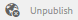

# Console de recursos de ativação {#enablement-resources-console}

No AEM Communities, o console Recursos é onde [Gerentes de ativação](users.md) crie, gerencie e atribua recursos aos membros de um site da comunidade de ativação.

## Requisitos {#requirements}

Antes de adicionar recursos de ativação para um site da comunidade, as instâncias de AEM devem ser configuradas corretamente, incluindo:

* SCORM
* FFmpeg

Para obter detalhes, consulte [Configurar habilitação](enablement.md).

>[!CAUTION]
>
>Se o SCORM for instalado após a criação do site da comunidade, todos os recursos de ativação presentes antes que o SCORM seja instalado deverão ser recriados.

>[!NOTE]
>
>Com o lançamento do [AEM 6.3](deploy-communities.md#latestfeaturepack) e os pacotes de recursos equivalentes das Comunidades [AEM 6.2 FP3](deploy-communities.md#latestfeaturepack) e [AEM 6.1 FP7](https://docs.adobe.com/content/docs/en/aem/6-1/deploy/communities.html#Latest Feature Pack), o recurso de ativação não requer mais um [Banco de dados MySQL](mysql.md).

## Terminologia {#terminology}

### Recurso {#resource}

Os recursos são essenciais para uma [comunidade de capacitação](overview.md#enablement-community). São os materiais atribuídos aos membros que lhes permitem melhorar as suas competências.

Características de um Recurso:

* Pode ser do tipo:
   * Imagem (JPG, PNG, GIF, BMP)
   * Vídeo (MP4)
   * Flash (SWF)
   * Documento (PDF)
   * Questionário (SCORM)
* Pode ser referenciado a partir de um ou mais caminhos de aprendizagem.

### Caminho de aprendizagem {#learning-path}

Um caminho de aprendizagem é um conjunto lógico de recursos de ativação agrupados para facilitar a atribuição aos membros.

### Grupo de membros {#members-group}

Quando um site da comunidade é criado, o nome dado ao site para o URL é usado na criação do [grupos de usuários específicos do site](users.md) configurado com várias permissões para várias funções. Todos esses grupos criados automaticamente recebem o prefixo `Community <site-name>`.

Um desses grupos de usuários é `Community <site-name> Members` , que identifica usuários registrados no ambiente de publicação como membros da comunidade. Consulte o tutorial [Introdução ao AEM Communities para ativação](getting-started-enablement.md) para obter um exemplo.

Para [comunidades de engajamento](overview.md#egagementcommunity), é razoável permitir que os visitantes do site se registrem automaticamente ou usem logon social, e nesse momento eles são adicionados automaticamente ao grupo de membros.

Para [comunidades de capacitação](overview.md#enablement-community), é recomendável tornar o site privado, o que requer que um administrador adicione usuários ao grupo de membros.

## Acessar os recursos de ativação de um site da comunidade {#accessing-a-community-site-s-enablement-resources}

### Navegar até os Recursos das Comunidades {#navigate-to-communities-resources}

No ambiente de criação, para acessar o console Recursos

* Na navegação global: **[!UICONTROL Navegação]** > **[!UICONTROL Comunidades]** > **[!UICONTROL Recursos]**

   

### Selecionar um Site de Comunidade {#select-a-community-site}

O console Recursos das Comunidades exibirá todos os sites da comunidade.

Os recursos de ativação são criados para um site específico da comunidade depois de selecionar o site no console Recursos.

Depois que um site específico da comunidade é selecionado, todos os recursos de capacitação e caminhos de aprendizagem existentes são acessíveis para gerenciamento e modificação, e novos recursos de capacitação e caminhos de aprendizagem podem ser criados.

#### Pesquisar {#search-features}

Selecione o ícone de alternância do painel lateral para procurar um recurso de ativação ou um caminho de aprendizado. Quando selecionado, um painel de pesquisa é aberto no lado esquerdo do console e fornece uma caixa de texto na qual os termos de pesquisa podem ser inseridos.

#### Modo de seleção {#selection-mode}

Para selecionar vários recursos de ativação, selecione o primeiro ao passar o mouse sobre o cartão e selecionar o ícone de marca de seleção. Depois de selecionado, selecionar qualquer outro cartão o adicionará ao grupo de seleção. Selecionar uma segunda vez desmarca a seleção do cartão.

## Criar um recurso {#create-a-resource}

Para adicionar um novo recurso de ativação ao site da comunidade

* Selecione o `Create` ícone .
* No submenu exibido, selecione **[!UICONTROL Recurso]**.

Isso inicia um processo passo a passo de:

* Descrição do recurso (nome, imagem do cartão e texto).
* Seleção do conteúdo do recurso.
* Selecionar uma imagem de capa para o recurso.
* Identificação de contatos de recursos.
* Atribuição de recursos aos membros.

Quando o recurso faz parte de um curso, de um caminho de aprendizagem, os membros só devem ser atribuídos ao caminho de aprendizagem. As atribuições podem ser adicionadas após a criação do recurso de ativação.

### 1 Informações básicas {#basic-info}

* **[!UICONTROL Adicionar]**

   (*Opcional*) Uma imagem a ser exibida no cartão para o recurso de ativação na página de atribuições do membro, bem como no console Recursos . A imagem é selecionada no sistema de arquivos local do servidor. Se uma imagem não for fornecida, uma miniatura será gerada para o recurso carregado.

   ***Observação***: O tamanho de imagem recomendado não é apenas 480 x 480 pixels. Devido ao design responsivo dos cartões em várias dimensões do navegador, o tamanho da exibição varia de 220 X 165 pixels a 400 x 165 pixels.

* **[!UICONTROL Nome do site]**

   (*somente leitura*) O site da comunidade ao qual o recurso está sendo adicionado.

* **[!UICONTROL Nome do recurso]**

   (*Obrigatório*) O nome de exibição do recurso. Um nome de nó válido é criado a partir do nome de exibição.

* **[!UICONTROL Tags]**

   (*Opcional*) Uma ou mais tags podem ser escolhidas para associar o recurso de ativação a um ou mais catálogos. Consulte [Marcar recursos de ativação](tag-resources.md).

* **[!UICONTROL Mostrar no catálogo]**

   Quando desmarcado, o recurso de ativação não aparecerá em nenhum catálogo. Se marcada, o recurso de ativação aparecerá em todos os catálogos, a menos que [pré-filtrado](catalog-developer-essentials.md#pre-filters) ou o membro filtra da interface do usuário. O padrão está desmarcado.

* **[!UICONTROL Descrição]**

   (*Opcional*) A descrição a ser exibida para o recurso de ativação.

* **[!UICONTROL Ativo pequeno]**

   (*Opcional*) Selecionado do AEM Assets. Uma imagem em miniatura para representar o recurso no ambiente de publicação, como em um catálogo.

* **[!UICONTROL Ativo grande]**

   (*Opcional*) Selecionado do AEM Assets. Uma imagem grande para representar o recurso no ambiente de publicação, como na página principal de um recurso.

* **[!UICONTROL Ativo do conteúdo de fragmento]**

   (*Opcional*) Selecionado do AEM Assets. Um fragmento de conteúdo que pode ser referenciado no ambiente de publicação, mas não está em uso por padrão.

* Selecione **[!UICONTROL Próximo]**

### 2 Adicionar conteúdo {#add-content}

Embora pareça que vários recursos de capacitação podem ser selecionados, somente um é permitido.

Selecione o `'+' icon`, no canto superior direito, para iniciar o processo de escolha do recurso identificando a fonte.

* **[!UICONTROL Fazer upload a partir de meus arquivos locais]**

   O upload do sistema de arquivos local usará o navegador de arquivos nativo para selecionar e carregar um arquivo. Os tipos de arquivos suportados são SCORM.zip (HTML5 ou SWF), MP4 video, SWF, PDF e tipos de imagem (JPG, PNG, GIF, BMP). O nome do arquivo se torna o nome do ativo, que é adicionado à biblioteca de ativos.

* **[!UICONTROL Consultar biblioteca de ativos]**

   Selecione na Biblioteca de ativos. A seleção é limitada àqueles que estão visíveis no site da comunidade.

* **[!UICONTROL Adicione um URL externo]**

   Insira um link para o conteúdo de aprendizagem.

   Na caixa de diálogo que é aberta, digite:

   * **[!UICONTROL Título]**

      O nome do ativo para o recurso de ativação.

   * **[!UICONTROL URL]**

      O URL para um ativo.

* **[!UICONTROL Adicione um URL do Adobe Connect]**

   Insira um link para uma sessão do Adobe Connect.

   Na caixa de diálogo que é aberta, digite:

   * **[!UICONTROL Título]**

      O nome do ativo para o recurso de ativação.

   * **[!UICONTROL URL]**

      O URL para uma sessão do Adobe Connect.

* **[!UICONTROL Defina um recurso externo]**

   Insira o local onde o material deve ser apresentado. Os valores para o status e pontuação de sucesso são inseridos manualmente (consulte [Relatórios](reports.md)). Uma imagem de capa carregada pode ser usada para fornecer informações adicionais.

   Na caixa de diálogo que é aberta, digite:

   * **[!UICONTROL Título]**

      O nome do ativo para o recurso de ativação.

   * **[!UICONTROL Local]**

      O local de um site físico, como uma sala de aula.

#### Exemplo de um recurso de vídeo adicionado {#example-of-an-added-video-resource}

* **[!UICONTROL Imagem de capa do recurso]**

   A imagem de capa é uma imagem a ser exibida quando o recurso de ativação for visualizado pela primeira vez. Por exemplo, a imagem de capa é exibida quando um recurso de vídeo ainda não está sendo reproduzido. Se uma imagem personalizada não for carregada, uma imagem padrão será exibida. Para recursos de vídeo, talvez seja possível [gerar uma miniatura](enablement.md#ffmpeg), mas somente quando carregado e não quando o vídeo é referenciado como URL. Para recursos de localização, a imagem pode ser usada para fornecer informações adicionais.

   O tamanho recomendado para a imagem de capa é 640 x 360 px.

* Selecione **[!UICONTROL Próximo]**.

### 3 Configurações {#settings}

>[!NOTE]
>
>Os aprendentes não devem ser inscritos diretamente nos recursos de ativação que devem ser referenciados a partir de um caminho de aprendizagem. Os aprendentes só precisam ser inscritos no caminho de aprendizado.
>
>Se um membro estiver inscrito em um recurso e em um caminho de aprendizado que faça referência a esse recurso, suas atribuições mostrarão o recurso único e o recurso no caminho de aprendizado.

* **[!UICONTROL Configurações sociais]**

   Essas configurações controlam se os alunos podem ou não fornecer informações sobre o recurso de ativação. O [configurações de moderação](sites-console.md#moderation) são do site da comunidade principal.

   * **[!UICONTROL Permitir comentários]**

      Se marcada, os membros poderão comentar no recurso. O padrão está marcado.

   * **[!UICONTROL Permitir classificações]**

      Se marcada, os membros poderão classificar o recurso. O padrão está marcado.

   * **[!UICONTROL Permitir acesso anônimo]**

      Se marcada, visitantes anônimos do site podem exibir o recurso em um catálogo quando o site da comunidade também permite acesso anônimo. O padrão está desmarcado.

* **[!UICONTROL Data de vencimento]**

   *(Opcional)* Pode ser selecionada uma data até à qual a atribuição deve ser concluída.

* **[!UICONTROL Autor do recurso]**

   *(Opcional)* O autor do recurso de ativação. Use o menu suspenso para selecionar entre os usuários que são membros do [grupo de membros](#members-group).

* **[!UICONTROL Contato do Recurso &amp;;]**

   *(Obrigatório)* Uma pessoa que o membro pode entrar em contato com relação ao recurso de ativação. Use o menu suspenso para selecionar entre os usuários que são membros do [grupo de membros](#members-group).

* **[!UICONTROL Especialista de recurso]**

   *(Opcional)* Uma pessoa que o membro pode entrar em contato e que tem conhecimento sobre o recurso de ativação. Use o menu suspenso para selecionar entre usuários que são membros do [grupo de membros](#members-group).

### 4 Atribuições {#assignments}

* **[!UICONTROL Adicionar responsáveis]**

   Use o menu suspenso para selecionar [membros](#members-group) - Os usuários e grupos de usuários (listados em negrito) que serão inscritos como aprendentes. Quando os membros entram no site da comunidade, os recursos de ativação (e caminhos de aprendizado) nos quais estão inscritos aparecerão em seus [Atribuições](functions.md#assignments-function) página.

* Selecione **[!UICONTROL Criar]**.

   

A criação bem-sucedida do recurso de ativação retorna ao console Recursos com o recurso recém-criado selecionado. Nesse console, é possível [gerenciar o recurso](#managing-a-resource).

## Criar um caminho de aprendizado {#create-a-learning-path}

Para adicionar um novo caminho de aprendizagem ao site da comunidade

* Selecione o `Create` ícone
* No submenu exibido, selecione **[!UICONTROL Caminho de aprendizado]**.

Isso inicia um processo passo a passo de:

* Identificação do caminho de aprendizado.
* Fornecer uma imagem de cartão para representar o caminho de aprendizagem para os alunos.
* Fazendo referência aos recursos de capacitação a serem incluídos no caminho de aprendizado.
* Como opção, ordene os recursos.
* Como opção, identificar caminhos de aprendizado de pré-requisito.
* Identificação de um contato do caminho de aprendizado.
* Inscrevendo membros.

Para recursos de capacitação incluídos em um caminho de aprendizado, as atribuições devem ser feitas somente para o caminho de aprendizado e não para os recursos individuais.

### Informações básicas {#basic-info-1}

* **[!UICONTROL Adicionar]**

   (*Opcional*) Uma imagem a ser exibida no cartão do caminho de aprendizado na página de atribuições do membro, bem como no console Recursos . A imagem é selecionada no sistema de arquivos local do servidor. Se uma imagem não for fornecida, uma miniatura será gerada para o recurso carregado.

   ***Observação***: O tamanho de imagem recomendado não é mais apenas 480 x 480 pixels. Devido ao design responsivo dos cartões em várias dimensões do navegador, o tamanho da exibição varia de 220 X 165 pixels a 400 x 165 pixels.

* **[!UICONTROL Nome do site]**

   (*Somente leitura*) O site da comunidade ao qual o recurso está sendo adicionado.

* **[!UICONTROL Nome do Caminho de aprendizagem]**

   (*Obrigatório*) O nome de exibição do caminho de aprendizagem. Um nome de nó válido é criado a partir do nome de exibição.

* **[!UICONTROL Tags]**

   (*Opcional*) Uma ou mais tags podem ser escolhidas para associar o caminho de aprendizado a um ou mais catálogos. Consulte [Marcar recursos de ativação](tag-resources.md).

* **[!UICONTROL Mostrar no catálogo]**

   Quando desmarcado, o caminho de aprendizagem não aparecerá em nenhum catálogo. Se marcada, o caminho de aprendizado aparecerá em todos os catálogos, a menos que [pré-filtrado](catalog-developer-essentials.md#pre-filters) ou o membro filtra da interface do usuário. Mostrar o caminho de aprendizagem em um catálogo irá conceder indiretamente acesso READ a todos os seus recursos contidos. O padrão está desmarcado.

* **[!UICONTROL Descrição]**

   (*Opcional*) A descrição a ser exibida para o recurso de ativação.

* **[!UICONTROL Ativo pequeno]**

   (*Opcional*) Selecionado do AEM Assets. Uma imagem em miniatura para representar o recurso no ambiente de publicação, como em um catálogo.

* **[!UICONTROL Ativo grande]**

   (*Opcional*) Selecionado do AEM Assets. Uma imagem grande para representar o recurso no ambiente de publicação, como na página principal de um recurso.

* **[!UICONTROL Ativo do conteúdo de fragmento]**

   (*Opcional*) Selecionado do AEM Assets. Um fragmento de conteúdo que pode ser referenciado no ambiente de publicação, mas não está em uso por padrão.

* Selecione **[!UICONTROL Próximo]**.

### Adicionar pré-requisitos {#add-prerequisites}

* **[!UICONTROL Pré-requisito dos Caminhos de aprendizagem]**

   (*Opcional*) Quando outros caminhos de aprendizado publicados são selecionados, eles devem ser concluídos antes que um aluno possa selecionar esse caminho de aprendizado.

* Selecione **[!UICONTROL Próximo]**.

### Adicionar recursos {#add-resources}

* **[!UICONTROL Impor ordem no Caminho de aprendizagem]**

   (*Opcional*) Se definida como Ativado, a ordem na qual os recursos de ativação são adicionados será a ordem na qual os alunos devem prosseguir pelo caminho de aprendizado. O padrão é Desativado.

* **[!UICONTROL Recursos]**

   Um ou mais recursos escolhidos entre as *publicado* recursos de ativação criados para o site atual da comunidade.

>[!NOTE]
>
>Você só pode selecionar os recursos disponíveis no mesmo nível que o caminho de aprendizagem. Por exemplo, para um caminho de aprendizado criado em um grupo, somente os recursos de nível de grupo estão disponíveis; para um caminho de aprendizado criado em um site da comunidade, os recursos nesse site estão disponíveis para adição ao caminho de aprendizado.

* Selecione **[!UICONTROL Próximo]**.

### Configurações {#settings-1}

* **[!UICONTROL Adicionar inscrições]**

   Use o menu suspenso para selecionar os membros e grupos de membros (listados em negrito) que são membros do site da comunidade [grupo de membros](#members-group). Não é necessário adicionar atribuições ao criar o caminho de aprendizado pela primeira vez. As propriedades do caminho de aprendizagem podem ser modificadas para adicionar alunos posteriormente.

* **[!UICONTROL Contato do Caminho de Aprendizagem &amp;;]**

   *(Obrigatório)* Uma pessoa que o membro pode contatar em relação ao caminho de aprendizado. Use o menu suspenso para selecionar entre os usuários que são membros do site da comunidade [grupo de membros](#members-group).

* Selecione **[!UICONTROL Criar]**

>[!NOTE]
>
>Os recursos de ativação referenciados a partir do caminho de aprendizagem não devem listar os mesmos Atributos (aprendentes), se houver.
>
>Se um membro estiver inscrito em um recurso de ativação e em um caminho de aprendizado que faça referência a esse recurso, suas atribuições mostrarão o recurso único e o recurso no caminho de aprendizado.

## Gerenciar um recurso {#managing-a-resource}

Para gerenciar um único recurso de ativação:

* No **[!UICONTROL Recursos]** selecione o site da comunidade que contém o recurso.
* Selecione o recurso .

Para o recurso de ativação selecionado, é possível:

* Exibir propriedades (padrão)
* Editar propriedades
* Excluir
* Publicação
* Desfazer publicação

Para carregar uma nova versão do recurso de ativação, é recomendável criar um novo recurso e, em seguida, cancelar a inscrição dos membros da versão antiga e inscrevê-los na nova versão.

### Editar recurso {#edit-resource}

Ao selecionar o ícone de lápis, as etapas mostradas para criar um recurso de ativação são disponibilizadas para que qualquer uma das informações fornecidas possa ser modificada.

Se a única alteração for modificar atribuições na etapa Configurações , salvar as alterações resultará na publicação das modificações. Se qualquer outra alteração for feita, o recurso deverá ser publicado explicitamente após a gravação.

### Excluir recurso {#delete-resource}

Ao selecionar o ícone da lixeira, o recurso de ativação será `Deleted` após confirmação.

### Publicação {#publish}

Antes que os alunos possam ver um recurso de ativação atribuído, ele deve ser publicado:

* Selecione o ícone do mundo para `Publish`.
* Na caixa de diálogo que aparece, selecione **[!UICONTROL Publicar]** novamente.
* Selecionar **[!UICONTROL Fechar]**.

Embora o diálogo afirme que a ação está na fila, geralmente é publicada imediatamente.

### Desfazer publicação {#unpublish}

Para tornar temporariamente os recursos de ativação inacessíveis aos membros no ambiente de publicação sem excluí-lo, use o ícone do mundo para `Unpublish` o recurso .

### Relatório {#report}

O ícone Relatório fornece acesso aos relatórios gerados quando os alunos interagem com os recursos de ativação atribuídos no ambiente de publicação. O relatório varia dependendo do tipo de recurso.

Em todos os caminhos de aprendizado, é possível visualizar um relatório com base em recursos ou aprendentes ( `User Report`.)

Este relatório é especificamente para o recurso de ativação atual ou o caminho de aprendizado. A profundidade do relatório fornecido depende do fato de [Adobe Analytics](analytics.md) O está licenciado e ativado para o site da comunidade. O [Linha do tempo](#timeline), [Envolvimento do visualizador](#viewer-engagement)e [Envolvimento por dispositivo](#engagement-by-device) são importados do Adobe Analytics com base na variável [intervalo de sondagem](analytics.md#report-importer).

Para todos os recursos de ativação, independentemente de o Adobe Analytics estar ou não habilitado, há relatórios sobre [Status do Destinatário](#assignee-status) e [Classificações](#ratings) bem como [Resumo do relatório](#report-summary) tabela.

#### Linha do tempo {#timeline}

O relatório Linha do tempo do Analytics mostra quando os eventos ocorrem ao longo do tempo para esse recurso de ativação:

* **Exibições**

   Uma visualização ocorre quando um aluno visita a página de detalhes do recurso.

* **Reproduções**

   Uma reprodução é quando o Aprendiz interage com o recurso, como reproduzir um vídeo ou abrir um PDF.

* **Classificações**

   Uma classificação ocorre quando um aluno atribui uma classificação de estrela a um recurso.

* **Comentários**

   Um comentário é quando o Aprendiz adiciona um comentário.

O eixo vertical é o número de eventos.

O eixo horizontal é a hora do calendário.

[Adobe Analytics obrigatório](sites-console.md#analytics).

#### Envolvimento do visualizador {#viewer-engagement}

O relatório de Engajamento com o visualizador do Analytics mostra, para recursos de vídeo, o número de alunos que visualizaram o recurso e, se não foram reproduzidos até o fim, em que ponto os alunos pararam de reproduzi-lo.

O eixo vertical é o número de alunos que visualizaram esse recurso.

O eixo horizontal é a duração desse recurso.

[A ID da organização da Marketing Cloud é necessária](sites-console.md#enablement).

#### Envolvimento por dispositivo {#engagement-by-device}

O relatório Envolvimento do Analytics por dispositivo , para recursos de vídeo, descreve a porcentagem de visualizações que foram reproduzidas do desktop e de dispositivos móveis.

[A ID da organização da Marketing Cloud é necessária](sites-console.md#enablement).

#### Status do destinatário {#assignee-status}

O relatório Status do Destinatário , com base no número de alunos, descreve quantos alunos têm

* **Não iniciado**
* **Em andamento**
* **Concluído**

#### Classificações {#ratings}

O relatório de Classificações baseia-se no número de alunos que classificaram o recurso de ativação, mostrando o número de cada classificação de estrela seguida de um resumo do número total de classificações e da classificação média.

#### Resumo do relatório {#report-summary}

Para um recurso de ativação, o Resumo do relatório é uma lista de tabela.

* Cada aluno que interagiu com o recurso
   * Seu status
   * Se o recurso foi atribuído a eles
      * Em vez de encontrar o recurso em um catálogo
      * Número de comentários publicados
      * A classificação atribuída, se for caso disso

Para um Relatório de recurso de caminho de aprendizado, o Resumo do relatório é uma lista de tabela

* Cada recurso incluído no caminho de aprendizado
   * Publicar status
   * Número de visualizações
   * Número de reproduções
   * Classificação média
   * Formato
   * Tamanho
   * Nome do site da comunidade

Para um Relatório do usuário de caminho de aprendizagem, o Resumo do relatório é uma lista de tabela.

* Cada aluno atribuído ao caminho de aprendizado:
   * Número de recursos concluídos.
   * Seu status.

É possível ajustar a exibição da tabela selecionando colunas usando o `Show / hide columns` seletor.

#### Baixar relatório como CSV {#download-report-as-csv}

A tabela Resumo dos relatórios pode ser baixada no formato CSV usando um botão na parte superior do console.

* Para um recurso de ativação: `Download Resource Report as CSV` botão.
* Para um caminho de aprendizagem: `Download Learning Path Report as CSV` botão.

O Resumo completo dos relatórios é baixado independentemente das colunas escolhidas para exibição.
