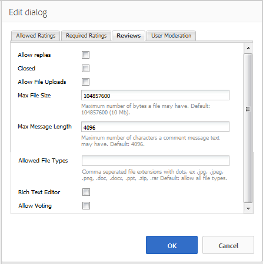

# Uso do Resumo de análises e análises (exibir) {#using-reviews-and-reviews-summary-display}

A variável `Reviews` é um composto de [Comentários](comments.md) e [Classificação](rating.md) componentes prontos para uso.

A variável `Reviews Summary (Display)` fornece um resumo de uma instância ativa ou fechada de um `Reviews` componente para exibição em outro lugar no site.

>[!NOTE]
>
>Não há suporte para postagem anônima de uma revisão. Os visitantes do site devem se registrar (tornar-se membros) e fazer logon para participar. O visitante conectado pode atualizar sua análise a qualquer momento.

## Adicionando uma Revisão a uma Página {#adding-a-review-to-a-page}

Para adicionar um `Reviews` para uma página no modo de autor, use o navegador de componentes para localizar `Communities / Reviews` e arraste-o para o local em uma página, como uma posição relativa ao recurso para que os usuários analisem.

Para obter as informações necessárias, visite [Noções básicas sobre componentes das comunidades](basics.md).

Quando a variável [bibliotecas obrigatórias do lado do cliente](reviews-basics.md#essentials-for-client-side) são incluídos, é assim que a variável `Reviews` será exibido.

## Configurar análises {#configuring-reviews}

Selecione o colocado `Reviews` para acessar e selecionar a variável `Configure` ícone que abre a caixa de diálogo de edição.

No **[!UICONTROL Classificações permitidas]** especifique a lista completa de classificações a serem exibidas para os membros. A primeira notação deve ser global/geral, uma vez que é a notação que fornece a notação média para a `Review Summary (Display)` componente. As próximas duas classificações na configuração padrão devem receber um título diferente, diferente de &quot;Subclassificação 1&quot; ou &quot;Subclassificação 2&quot;.

* **[!UICONTROL Classificações permitidas]**

   Uma lista de classificações que um membro pode escolher.

   Use os botões seta para cima, seta para baixo e excluir para modificar as seleções visíveis.

   Clique em **[!UICONTROL Adicionar item]** para adicionar outra opção de classificação.

No **[!UICONTROL Classificações necessárias]** insira novamente os itens da lista de **[!UICONTROL Classificações permitidas]** que devem ser classificados. Se um item for especificado somente na guia Classificações Permitidas, ele poderá ser deixado desmarcado quando for enviado pelo membro.

No site, as classificações necessárias são marcadas com um asterisco. Se um item for obrigatório e deixado desmarcado, uma mensagem será exibida para o membro e o envio será negado até que todas as classificações necessárias sejam marcadas.

* **[!UICONTROL Classificações necessárias]**

   Um subconjunto de classificações permitidas, indicando quais classificações são necessárias.

   Use os botões seta para cima, seta para baixo e excluir para modificar as seleções visíveis.

   Clique em **[!UICONTROL Adicionar item]** para adicionar outra opção de resposta.

>[!NOTE]
>
>Se um item for inserido no **[!UICONTROL Classificações necessárias]** guia que não está especificada na **[!UICONTROL Classificações permitidas]** , então ele não será incluído nos itens a serem classificados.

No **[!UICONTROL Resenhas]** especifique como as revisões são tratadas.

* **[!UICONTROL Permitir respostas]**

   Se marcado, permitir respostas para revisões. O padrão está desmarcado.

* **[!UICONTROL Fechado]**

   Se marcada, a revisão será fechada para novas revisões e respostas. O padrão está desmarcado.

* **[!UICONTROL Permitir carregamento de arquivos]**

   Se marcado, permite que os anexos de arquivo sejam carregados para revisão. O padrão está desmarcado.

* **Tamanho máximo do arquivo**

   Relevante apenas se **[!UICONTROL Permitir carregamentos de arquivo]** está marcado. Este campo limita o tamanho (em bytes) de um arquivo carregado. O padrão é 10 MB.

* **[!UICONTROL Comprimento máximo da mensagem de]**

   Número máximo de caracteres que podem ser inseridos na caixa de texto. O padrão é 4.096 caracteres.

* **[!UICONTROL Tipos de arquivos permitidos]**

   Relevante apenas se **[!UICONTROL Permitir carregamentos de arquivo]** está marcado. Uma lista separada por vírgulas de extensões de arquivo com o separador &quot;ponto&quot;. Por exemplo: .jpg, .jpeg, .png, .doc, .docx, .pdf. Se algum tipo de arquivo for especificado, os não especificados não serão permitidos. O padrão é nenhum especificado, de modo que todos os tipos de arquivos são permitidos.

* **[!UICONTROL Editor de rich text]**

   Se marcados, os posts podem ser inseridos com marcação. O padrão está desmarcado.

* **[!UICONTROL Permitir votação]**

   Se marcado, inclui o recurso Votação de um tópico. O padrão está desmarcado.

No **[!UICONTROL Moderação de usuário]** especifique como as revisões publicadas são gerenciadas. Para obter mais informações, consulte [Moderação de conteúdo gerado pelo usuário](moderate-ugc.md).

* **[!UICONTROL Pré-moderação]**

   Se marcadas, as revisões devem ser aprovadas antes de serem exibidas em um site de publicação. O padrão está desmarcado.

* **[!UICONTROL Excluir análises]**

   Se marcado, o membro que postou a revisão receberá a capacidade de excluí-lo. O padrão está desmarcado.

* **[!UICONTROL Negar análises]**

   Se marcado, permitir que os moderadores neguem comentários. O padrão está desmarcado.

* **[!UICONTROL Fechar/reabrir análises]**

   Se marcado, permite que os moderadores fechem e reabram os comentários. O padrão está desmarcado.

* **[!UICONTROL Sinalizar análises]**

   Se marcado, permite que os membros sinalizem revisões como inapropriadas. O padrão está desmarcado.

* **[!UICONTROL Sinalizar lista de motivo]**

   Se marcado, permitirá que os membros escolham, em uma lista suspensa, seu motivo para sinalizar uma revisão como inapropriado. O padrão está desmarcado.

* **[!UICONTROL Motivo personalizado de sinalização]**

   Se marcado, permite que os membros insiram seu próprio motivo para sinalizar uma revisão como inapropriada. O padrão está desmarcado.

* **[!UICONTROL Limite de moderação]**

   Insira o número de vezes que uma revisão deve ser marcada por membros antes que os moderadores sejam notificados. O padrão é uma vez (1).

* **[!UICONTROL Limite de sinalização]**

   Insira o número de vezes que uma revisão deve ser sinalizada antes de ser ocultada da visualização pública. Esse número deve ser maior ou igual ao **[!UICONTROL Limite de moderação]**. O padrão é 5.

### Adicionar um resumo de revisão (exibir) a uma página {#adding-a-review-summary-display-to-a-page}

Para adicionar um `Reviews Summary (Display)` para uma página no modo de autor, localize o componente

* `Communities / Reviews Summary (Display)`

e arraste-o para o local em uma página onde um resumo de uma revisão ativa ou fechada deve ser exibido.

Para obter as informações necessárias, visite [Noções básicas sobre componentes das comunidades](basics.md).

Quando a variável [bibliotecas obrigatórias do lado do cliente](reviews-basics.md#essentials-for-client-side) são incluídos, é assim que a variável `Reviews Summary (Display)`será exibido.

>[!NOTE]
>
>A &quot;Média&quot; reflete os votos para o primeiro item listado nas guias de Classificações permitidas da revisão que está sendo resumida.

### Resumo das análises de configuração (exibir) {#configuring-reviews-summary-display}

Selecione o colocado `Reviews Summary (Display)` para acessar e selecionar a variável `Configure` ícone que abre a caixa de diálogo de edição.

No **[!UICONTROL Resumo da análise]** guia

* `Review Path`

   digite ou procure a instância colocada do `reviews`componente para resumir, por exemplo, se adicionado à Página da Web do [Site do Geometrixx Engage,](getting-started.md) o caminho seria:

   `/content/sites/engage/en/page/jcr:content/content/primary/reviews`

* `Include histogram`

   Se marcado, incluirá a exibição de um gráfico de barras indicando quantas de cada classificação de estrelas há nas revisões sendo resumidas. O padrão está desmarcado.

### Alterar para um tipo de revisão personalizada {#changing-to-a-custom-review-type}

O componente de Revisões usa o Sistema de comentários.

Ao alterar o Tipo de recurso de comentário, o sistema de comentários não gerará mais uma instância de um comentário usando o padrão, mas sim uma que foi personalizada (estendida) pelos desenvolvedores.

Depois que os tipos de recursos personalizados forem conhecidos, insira [Modo Design](../../help/sites-authoring/default-components-designmode.md) e clique duas vezes no local `Comments` para abrir uma caixa de diálogo com uma guia adicional.

No **[!UICONTROL Tipos de recursos]** especifique o resourceType personalizado para novas instâncias do `Comments or Voting` componentes:

* **[!UICONTROL Tipo de recursos de comentários]**

   Navegue até o resourceType de uma extensão `comment`componente (comentário único) em /apps. Por exemplo, `/apps/social/commons/components/hbs/comments/comment`.

   Esse recurso identificará o resourceType do UGC criado quando um visitante publica um comentário.

* **[!UICONTROL Tipo de recursos para pesquisa]**

   Navegue até o resourceType de uma extensão `voting`componente em /apps. Por exemplo, `/apps/social/components/hbs/voting`.

   Esse recurso identificará o tipo de recurso do UGC criado quando um visitante posta um voto.

* **[!UICONTROL Tipo de recursos de comentários do sistema]**

   Navegue até o resourceType de uma extensão `comments`componente (Sistema de comentários) em /apps. Deixe em branco, a menos que o modelo de página [inclui dinamicamente](scf.md#add-or-include-a-communities-component) o Sistema de comentários no script subjacente, em vez de ser adicionado à página como um recurso (nó comentários). Saiba mais lendo sobre o [{{include}} auxiliar](handlebars-helpers.md#include).

## Experiência de visitante do site {#site-visitor-experience}

### Moderadores e administradores {#moderators-and-administrators}

Quando o usuário conectado tem privilégios de moderador ou administrador, ele pode executar as tarefas de moderação permitidas pela configuração do componente, independentemente de quem criou a revisão.

### Membros {#members}

Quando o visitante do site está conectado, dependendo da configuração, ele pode:

* Publicar uma nova revisão
* Editar sua própria revisão
* Excluir sua própria revisão
* Sinalizar comentários de outras pessoas

Só é permitida uma classificação por membro. O membro pode alterar a sua classificação a qualquer momento.

### Anônimo {#anonymous}

Os visitantes do site que não estão conectados podem ler somente os comentários publicados, traduzi-los se houver suporte, mas não podem adicionar uma classificação ou uma revisão, nem sinalizar os comentários de revisão de outras pessoas.

## Informações adicionais {#additional-information}

Mais informações podem ser encontradas no [Fundamentos da revisão](reviews-basics.md) página para desenvolvedores.

Para moderação dos comentários publicados, consulte [Moderação de conteúdo gerado pelo usuário](moderate-ugc.md).

Para tradução de comentários publicados, consulte [Tradução de conteúdo gerado pelo usuário](translate-ugc.md).
