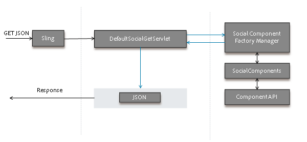

# Estrutura do componente social {#social-component-framework}

A estrutura de componentes sociais (SCF) simplifica o processo de configuração, personalização e extensão de componentes do Communities no lado do servidor e do cliente.

Os benefícios do quadro:

* **Funcional**: Fácil integração pronta para uso com pouca ou nenhuma personalização para 80% dos casos de uso.
* **Inclinável**: Uso consistente de atributos HTML para estilo CSS.
* **Extensível**: A implementação de componentes é orientada por objetos e baseada na lógica comercial - fácil de adicionar logon de negócios incremental no servidor.
* **Flexível**: Modelos simples de javascript sem lógica que são facilmente sobrepostos e personalizados.
* **Acessível**: A API HTTP suporta a publicação de qualquer cliente, incluindo aplicativos móveis.
* **Portátil**: Integre/incorpore em qualquer página da Web incorporada em qualquer tecnologia.

Explore uma instância de autor ou publicação usando o [Guia de componentes da comunidade](components-guide.md) interativo.

## Visão geral {#overview}

No SCF, um componente é composto de um POJO do Componente Social, um Modelo JS do Handlebars (para renderizar o componente) e CSS (para estilizar o componente).

Um Modelo JS do Handlebars pode estender os componentes JS do modelo/exibição para lidar com a interação do usuário com o componente no cliente.

Se um componente precisar oferecer suporte à modificação de dados, a implementação da API do SocialComponent poderá ser gravada para oferecer suporte à edição/salvamento de dados, semelhante a objetos de modelo/dados em aplicativos Web tradicionais. Além disso, operações (controladores) e um serviço de operação podem ser adicionados para lidar com solicitações de operação, executar lógica de negócios e invocar as APIs no modelo/objetos de dados.

A API do SocialComponent pode ser estendida para fornecer dados exigidos por um cliente para uma camada de exibição ou um cliente HTTP.

### Como as páginas são renderizadas para o cliente {#how-pages-are-rendered-for-client}


### Personalização e extensão de componentes {#component-customization-and-extension}

Para personalizar ou estender os componentes, você grava somente as sobreposições e extensões no diretório /apps, o que simplifica o processo de atualização para versões futuras.

* Para esfolamento:
   * Somente o [CSS precisa editar](client-customize.md#skinning-css).
* Para aparência:
   * Altere o Modelo JS e o CSS.
* Para aparência, sentimento e UX:
   * Altere o Modelo JS, o CSS e [estender/substituir o Javascript](client-customize.md#extending-javascript).
* Para modificar as informações disponíveis para o Modelo JS ou para o endpoint do GET:
   * Estenda o [SocialComponent](server-customize.md#socialcomponent-interface).
* Para adicionar processamento personalizado durante as operações:
   * Escreva um [OperationExtension](server-customize.md#operationextension-class).
* Para adicionar uma nova operação personalizada:
   * Crie uma nova [Operação de Publicação Sling](server-customize.md#postoperation-class).
   * Use [OperationServices](server-customize.md#operationservice-class) existente, conforme necessário.
   * Adicione o código Javascript para chamar sua operação do lado do cliente, conforme necessário.

## Estrutura do lado do servidor {#server-side-framework}

A estrutura fornece APIs para acessar a funcionalidade no servidor e oferecer suporte à interação entre o cliente e o servidor.

### APIs Java {#java-apis}

As APIs do Java fornecem classes abstratas e interfaces que são facilmente herdadas ou subclassificadas.

As classes principais são descritas na página [Personalização do lado do servidor](server-customize.md).

Visite [Visão Geral do Provedor de Recursos de Armazenamento](srp.md) para saber mais sobre como trabalhar com o UGC.

### API HTTP {#http-api}

A API HTTP oferece suporte à facilidade de personalização e à escolha de plataformas de clientes para aplicativos PhoneGap, aplicativos nativos e outras integrações e mashups. Além disso, a API HTTP permite que um site da comunidade seja executado como um serviço sem um cliente, de modo que os componentes da estrutura possam ser integrados em qualquer página da Web incorporada em qualquer tecnologia.

### API HTTP - Solicitações do GET {#http-api-get-requests}

Para cada SocialComponent, a estrutura fornece um ponto de extremidade de API baseado em HTTP. O endpoint é acessado enviando uma solicitação do GET para o recurso com um seletor &#39;.social.json&#39; + extensão. Usando o Sling, a solicitação é entregue ao `DefaultSocialGetServlet`.

**`DefaultSocialGetServlet`**

1. Passa o recurso (resourceType) para `SocialComponentFactoryManager` e recebe um SocialComponentFactory capaz de selecionar um `SocialComponent` representando o recurso.

1. Chama a fábrica e recebe um `SocialComponent` capaz de manipular o recurso e a solicitação.
1. Chama o `SocialComponent`, que processa a solicitação e retorna uma representação JSON dos resultados.
1. Retorna a resposta JSON ao cliente.

**`GET Request`**

Um servlet GET padrão escuta solicitações .social.json nas quais o SocialComponent responde com JSON personalizável.



### API HTTP - Solicitações do POST {#http-api-post-requests}

Além das operações de GET (Leitura), a estrutura define um padrão de ponto de extremidade para habilitar outras operações em um componente, incluindo Criar, Atualizar e Excluir. Esses endpoints são APIs HTTP que aceitam entrada e respondem com um código de status HTTP ou com um objeto de resposta JSON.

Esse padrão de endpoint de estrutura torna as operações de CUD extensíveis, reutilizáveis e testáveis.

**`POST Request`**

Há uma operação POST:Sling para cada operação SocialComponent. A lógica de negócios e o código de manutenção de cada operação são envolvidos em um OperationService que é acessível por meio da API HTTP ou de outro lugar como um serviço OSGi. Os ganchos são fornecidos com suporte para extensões de operação de plug-in para ações antes/depois.


### Provedor de recursos de armazenamento (SRP) {#storage-resource-provider-srp}

Para saber mais sobre como lidar com o UGC armazenado no [armazenamento de conteúdo da comunidade](working-with-srp.md), consulte:

* [Visão geral do provedor de recursos de armazenamento](srp.md)  - Introdução e visão geral do uso do repositório.
* [SRP e UGC Essentials](srp-and-ugc.md)  - métodos e exemplos de utilitário de API SRP.
* [Acesso ao UGC com SRP](accessing-ugc-with-srp.md)  - Diretrizes de codificação.

### Personalizações do lado do servidor {#server-side-customizations}

Visite [Personalizações do lado do servidor](server-customize.md) para obter informações sobre como personalizar a lógica comercial e o comportamento de um componente Comunidades no lado do servidor.

## Linguagem de modelo JS do Handlebars {#handlebars-js-templating-language}

Uma das alterações mais notáveis na nova estrutura é o uso da linguagem de modelo `Handlebars JS` (HBS), uma popular tecnologia de código aberto para renderização de servidor-cliente.

Os scripts HBS são simples, sem lógica, compilados no servidor e no cliente, são fáceis de sobrepor e personalizar e são naturalmente vinculados ao UX do cliente porque o HBS suporta renderização do lado do cliente.

A estrutura fornece vários [Handlebars helpers](handlebars-helpers.md) que são úteis ao desenvolver Componentes Sociais.

No servidor, quando o Sling resolve uma solicitação do GET, ele identifica o script que será usado para responder à solicitação. Se o script for um modelo HBS (.hbs), o Sling delegará a solicitação ao Mecanismo Handlebars. O mecanismo Handlebars obterá o SocialComponent da SocialComponentFactory apropriada, criará um contexto e renderizará o HTML.

### Sem restrição de acesso {#no-access-restriction}

Os arquivos de modelo Handlebars (HBS) (.hbs) são semelhantes aos arquivos de modelo .jsp e .html, exceto que podem ser usados para renderização no navegador do cliente e no servidor. Portanto, um navegador de cliente que solicita um modelo do lado do cliente receberá um arquivo .hbs do servidor.

Isso requer que todos os modelos HBS no caminho de pesquisa do sling (quaisquer arquivos .hbs em /libs/ ou /apps) possam ser buscados por qualquer usuário do autor ou da publicação.

O acesso HTTP a arquivos .hbs não pode ser proibido.

### Adicionar ou incluir um componente Comunidades {#add-or-include-a-communities-component}

A maioria dos componentes das Comunidades deve ser *adicionado* como um recurso endereçável do Sling. Alguns componentes das Comunidades podem ser *incluídos* em um modelo como um recurso não existente para permitir a inclusão dinâmica e a personalização do local no qual gravar o conteúdo gerado pelo usuário (UGC).

Em ambos os casos, as [bibliotecas de cliente necessárias](clientlibs.md) do componente também devem estar presentes.

**Adicionar um componente**

Adicionar um componente refere-se ao processo de adição de uma instância de um recurso (componente), como quando arrastado do navegador de componentes (sidekick) para uma página no modo de edição do autor.

O resultado é um nó filho JCR em um nó par, que é endereçável Sling.

**Incluir um componente**

A inclusão de um componente refere-se ao processo de adição de uma referência a um recurso [ &quot;não existente&quot;](srp.md#for-non-existing-resources-ners) (nenhum nó JCR) dentro do modelo, como o uso de uma linguagem de script.

A partir do AEM 6.1, quando um componente é incluído dinamicamente em vez de adicionado, é possível editar as propriedades do componente no modo * design *do autor.

Somente alguns componentes selecionados do AEM Communities podem ser incluídos dinamicamente. Eles são:

* [Comentários](essentials-comments.md)
* [Classificação](rating-basics.md)
* [Revisões](reviews-basics.md)
* [Votação](essentials-voting.md)

O [Guia de componentes da comunidade](components-guide.md) permite que componentes incluíveis sejam alternados para serem incluídos.

**Ao usar a linguagem** Handlebarstemplating , o recurso não existente é incluído usando o  [helperby ](handlebars-helpers.md#include) include especificando seu resourceType:

`{{include this.id path="comments" resourceType="social/commons/components/hbs/comments"}}`

**Ao usar o JSP**, um recurso é incluído usando a tag  [cq:include](../../help/sites-developing/taglib.md#lt-cq-include):

```
<cq:include path="votes"
 resourceType="social/tally/components/voting" />
```

>[!NOTE]
>
>Para adicionar um componente a uma página dinamicamente, em vez de adicioná-lo ou incluí-lo em um modelo, consulte [Sideloading do componente](sideloading.md).

### Ajudantes do Handlebars {#handlebars-helpers}

Consulte [Auxiliares do Handlebars do SCF](handlebars-helpers.md) para obter uma lista e descrição dos auxiliar personalizados disponíveis no SCF.

## Estrutura do lado do cliente {#client-side-framework}

### Estrutura Do Javascript De Exibição De Modelo {#model-view-javascript-framework}

A estrutura inclui uma extensão de [Backbone.js](https://www.backbonejs.org/), uma estrutura JavaScript de exibição de modelo, para facilitar o desenvolvimento de componentes interativos e ricos. A natureza orientada a objetos suporta uma estrutura extensível/reutilizável. A comunicação entre o cliente e o servidor é simplificada por meio da API HTTP.

A estrutura usa modelos Handlebars do lado do servidor para renderizar os componentes do cliente. Os modelos são baseados nas respostas JSON geradas pela API HTTP. As exibições se vinculam ao HTML gerado pelos modelos Handlebars e fornecem interatividade.

### Convenções CSS {#css-conventions}

As seguintes são convenções recomendadas para definir e usar classes CSS:

* Use nomes de seletor de classe CSS claramente namespacados e evite nomes genéricos, como &#39;cabeçalho&#39;, &#39;imagem&#39; etc.
* Defina estilos de seletor de classe específicos para que as folhas de estilos CSS funcionem bem com outros elementos e estilos na página. Por exemplo: `.social-forum .topic-list .li { color: blue; }`
* Mantenha as classes CSS para estilo separadas das classes CSS para UX orientadas pelo JavaScript.

### Personalizações do lado do cliente {#client-side-customizations}

Para personalizar a aparência e o comportamento de um componente Comunidades no lado do cliente, consulte [Personalizações no lado do cliente](client-customize.md), que inclui informações sobre:

* [Sobreposições](client-customize.md#overlays)
* [Extensões](client-customize.md#extensions)
* [Marcação HTML](client-customize.md#htmlmarkup)
* [CSS de capa](client-customize.md#skinning-css)
* [Extensão Do Javascript](client-customize.md#extending-javascript)
* [Clientlibs para SCF](client-customize.md#clientlibs-for-scf)

## Fundamentos de recursos e componentes {#feature-and-component-essentials}

As informações essenciais para desenvolvedores são descritas na seção [Recursos e componentes essenciais](essentials.md).

Informações adicionais sobre o desenvolvedor podem ser encontradas na seção [Diretrizes de codificação](code-guide.md) .

## Resolução de problemas {#troubleshooting}

As preocupações comuns e os problemas conhecidos são descritos na seção [Solução de problemas](troubleshooting.md).
